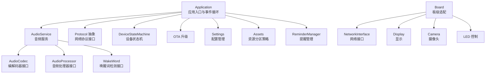
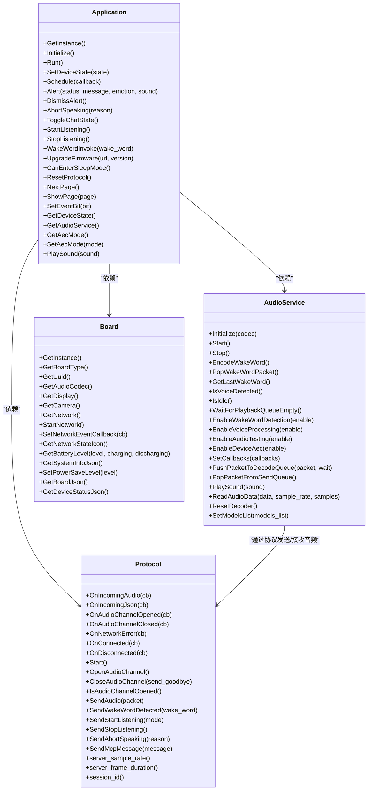
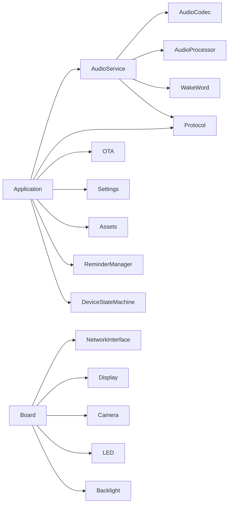

# API参考

<cite>
**本文引用的文件**
- [main/application.h](file://main/application.h)
- [main/application.cc](file://main/application.cc)
- [main/audio/audio_codec.h](file://main/audio/audio_codec.h)
- [main/audio/audio_processor.h](file://main/audio/audio_processor.h)
- [main/audio/audio_service.h](file://main/audio/audio_service.h)
- [main/audio/wake_word.h](file://main/audio/wake_word.h)
- [main/protocols/protocol.h](file://main/protocols/protocol.h)
- [main/boards/common/board.h](file://main/boards/common/board.h)
- [main/device_state.h](file://main/device_state.h)
- [main/mcp_server.h](file://main/mcp_server.h)
- [main/mcp_server.cc](file://main/mcp_server.cc)
- [main/ota.h](file://main/ota.h)
- [main/ota.cc](file://main/ota.cc)
- [main/settings.h](file://main/settings.h)
- [main/settings.cc](file://main/settings.cc)
- [main/assets.h](file://main/assets.h)
- [main/assets.cc](file://main/assets.cc)
- [main/display/display.h](file://main/display/display.h)
- [main/led/led.h](file://main/led/led.h)
- [main/time_parser.h](file://main/time_parser.h)
- [main/time_parser.cc](file://main/time_parser.cc)
- [main/reminder_manager.h](file://main/reminder_manager.h)
- [main/reminder_manager.cc](file://main/reminder_manager.cc)
- [main/device_state_machine.h](file://main/device_state_machine.h)
- [main/device_state_machine.cc](file://main/device_state_machine.cc)
- [docs/v0/README.md](file://docs/v0/README.md)
- [docs/v1/README.md](file://docs/v1/README.md)
</cite>

## 目录
1. [简介](#简介)
2. [项目结构](#项目结构)
3. [核心组件](#核心组件)
4. [架构总览](#架构总览)
5. [详细组件分析](#详细组件分析)
6. [依赖分析](#依赖分析)
7. [性能考虑](#性能考虑)
8. [故障排查指南](#故障排查指南)
9. [结论](#结论)
10. [附录](#附录)

## 简介
本API参考面向ESP32-AI项目的开发者与集成者，系统化梳理应用层、音频子系统、协议抽象、设备板级适配等模块的公共接口与使用方式。内容涵盖：
- 公共类与接口定义、方法签名与职责边界
- 参数说明、返回值语义与典型用法
- 异步回调机制与事件驱动模型
- 错误处理模式与异常路径
- 版本兼容性与废弃接口迁移建议
- 性能优化与最佳实践
- 关键流程的时序图与类图示意

## 项目结构
ESP32-AI采用“应用层 + 子系统（音频/显示/网络） + 板级适配”的分层组织方式。顶层入口通过Application统一调度，音频子系统负责采集、编码、传输与播放，协议抽象屏蔽底层通信细节，Board提供硬件能力封装。

图表来源
- [main/application.h:50-194](file://main/application.h#L50-L194)
- [main/audio/audio_service.h:106-194](file://main/audio/audio_service.h#L106-L194)
- [main/boards/common/board.h:49-86](file://main/boards/common/board.h#L49-L86)
- [main/protocols/protocol.h:44-95](file://main/protocols/protocol.h#L44-L95)

章节来源
- [main/application.h:1-212](file://main/application.h#L1-L212)
- [main/audio/audio_service.h:1-196](file://main/audio/audio_service.h#L1-L196)
- [main/boards/common/board.h:1-94](file://main/boards/common/board.h#L1-L94)

## 核心组件
本节对关键公共API进行分类归纳，包括应用入口、音频服务、协议抽象、唤醒词、设备状态与板级适配等。

- 应用入口 Application
  - 单例获取：GetInstance()
  - 初始化与主循环：Initialize(), Run()
  - 设备状态控制：SetDeviceState(state)
  - 事件调度：Schedule(callback)
  - 告警与播报：Alert(status, message, emotion, sound), DismissAlert(), AbortSpeaking(reason), PlaySound(sound)
  - 语音交互：ToggleChatState(), StartListening(), StopListening(), WakeWordInvoke(wake_word)
  - 固件升级：UpgradeFirmware(url, version="")
  - 睡眠与协议重置：CanEnterSleepMode(), ResetProtocol()
  - 页面管理：NextPage(), ShowPage(page)
  - 事件位设置：SetEventBit(bit)
  - 访问器：GetDeviceState(), GetAudioService(), GetAecMode()/SetAecMode(mode)

- 音频服务 AudioService
  - 初始化与生命周期：Initialize(codec), Start(), Stop()
  - 队列与任务：PushPacketToDecodeQueue(), PopPacketFromSendQueue(), WaitForPlaybackQueueEmpty()
  - 检测与状态：EnableWakeWordDetection(enable), EnableVoiceProcessing(enable), EnableAudioTesting(enable), EnableDeviceAec(enable)
  - 回调注册：SetCallbacks(callbacks)
  - 唤醒词：EncodeWakeWord(), PopWakeWordPacket(), GetLastWakeWord()
  - 测试与调试：PlaySound(sound), ReadAudioData(data, sample_rate, samples), ResetDecoder(), SetModelsList(models_list)

- 音频编解码 AudioCodec
  - 配置：SetOutputVolume(volume), SetInputGain(gain), EnableInput(enable), EnableOutput(enable)
  - 数据流：OutputData(data), InputData(data), Start()
  - 属性查询：duplex(), input_sample_rate(), output_sample_rate(), channels(), output_volume(), input_gain()

- 音频处理器 AudioProcessor
  - 初始化与运行：Initialize(codec, frame_duration_ms, models_list), Start(), Stop(), IsRunning()
  - 数据喂入：Feed(data)
  - 回调注册：OnOutput(cb), OnVadStateChange(cb)
  - 能力：GetFeedSize(), EnableDeviceAec(enable)

- 唤醒词 WakeWord
  - 初始化与运行：Initialize(codec, models_list), Start(), Stop()
  - 数据喂入：Feed(data)
  - 回调：OnWakeWordDetected(cb)
  - 编码与查询：EncodeWakeWordData(), GetWakeWordOpus(opus), GetLastDetectedWakeWord()

- 协议抽象 Protocol
  - 回调注册：OnIncomingAudio(cb), OnIncomingJson(cb), OnAudioChannelOpened(cb), OnAudioChannelClosed(cb), OnNetworkError(cb), OnConnected(cb), OnDisconnected(cb)
  - 通道与消息：OpenAudioChannel(), CloseAudioChannel(send_goodbye=true), IsAudioChannelOpened()
  - 发送：SendAudio(packet), SendWakeWordDetected(wake_word), SendStartListening(mode), SendStopListening(), SendAbortSpeaking(reason), SendMcpMessage(message)
  - 属性访问：server_sample_rate(), server_frame_duration(), session_id()

- 板级适配 Board
  - 单例与能力：GetInstance(), GetBoardType(), GetUuid()
  - 外设访问：GetAudioCodec(), GetDisplay(), GetCamera(), GetNetwork(), GetBacklight(), GetLed()
  - 网络事件：StartNetwork(), SetNetworkEventCallback(cb), GetNetworkStateIcon()
  - 电源与信息：SetPowerSaveLevel(level), GetSystemInfoJson(), GetBoardJson(), GetDeviceStatusJson(), GetBatteryLevel(level, charging, discharging)

- 设备状态 DeviceState
  - 枚举：kDeviceStateUnknown, kDeviceStateStarting, kDeviceStateWifiConfiguring, kDeviceStateIdle, kDeviceStateConnecting, kDeviceStateListening, kDeviceStateSpeaking, kDeviceStateUpgrading, kDeviceStateActivating, kDeviceStateAudioTesting, kDeviceStateFatalError

章节来源
- [main/application.h:50-194](file://main/application.h#L50-L194)
- [main/audio/audio_service.h:106-194](file://main/audio/audio_service.h#L106-L194)
- [main/audio/audio_codec.h:17-59](file://main/audio/audio_codec.h#L17-L59)
- [main/audio/audio_processor.h:11-24](file://main/audio/audio_processor.h#L11-L24)
- [main/audio/wake_word.h:11-24](file://main/audio/wake_word.h#L11-L24)
- [main/protocols/protocol.h:44-95](file://main/protocols/protocol.h#L44-L95)
- [main/boards/common/board.h:49-86](file://main/boards/common/board.h#L49-L86)
- [main/device_state.h:4-16](file://main/device_state.h#L4-L16)

## 架构总览
下图展示了应用层、音频服务、协议抽象与板级适配之间的交互关系，以及事件驱动与回调机制在异步场景中的作用。

图表来源
- [main/application.h:50-194](file://main/application.h#L50-L194)
- [main/audio/audio_service.h:106-194](file://main/audio/audio_service.h#L106-L194)
- [main/protocols/protocol.h:44-95](file://main/protocols/protocol.h#L44-L95)
- [main/boards/common/board.h:49-86](file://main/boards/common/board.h#L49-L86)

## 详细组件分析

### Application 类
- 角色定位：应用生命周期与事件循环的中枢；协调音频、协议、OTA、页面与提醒等子系统。
- 关键方法与行为
  - Initialize/Run：初始化外设与回调，进入事件循环；事件由事件位触发，事件处理在Run中集中执行。
  - 设备状态：SetDeviceState委托状态机完成状态转换，并触发状态变更事件。
  - 语音交互：ToggleChatState/StartListening/StopListening通过事件位实现线程安全切换。
  - 唤醒词：WakeWordInvoke触发唤醒词检测逻辑。
  - 固件升级：UpgradeFirmware支持指定URL与版本号；CanEnterSleepMode用于判断是否允许进入睡眠。
  - 协议重置：ResetProtocol释放网络连接后的资源，包括关闭音频通道、重置协议与OTA对象。
  - 页面管理：NextPage/ShowPage用于UI页面轮播与跳转。
  - 事件位：SetEventBit用于跨任务通知。
- 异步与回调
  - 通过事件位与事件处理函数（如HandleStateChangedEvent等）实现异步事件驱动。
  - Schedule提供在主线程上下文执行回调的能力，避免竞态。
- 错误处理
  - 通过事件与回调上报错误；错误发生后可通过重置协议或重启流程恢复。

章节来源
- [main/application.h:50-194](file://main/application.h#L50-L194)
- [main/application.cc](file://main/application.cc)

### AudioService 类
- 角色定位：音频数据的采集、处理、编码、发送与解码、播放的统一调度者。
- 关键数据流
  - 录入路径：麦克风PCM → 处理器/唤醒词 → 编码队列 → Opus编码 → 发送队列 → 协议发送
  - 播放路径：服务器音频 → 解码队列 → Opus解码 → 播放队列 → 扬声器PCM
- 关键方法与行为
  - Initialize：绑定AudioCodec并初始化编解码器与重采样器。
  - Start/Stop：启动/停止音频输入、输出与编解码任务。
  - EnableWakeWordDetection/EnableVoiceProcessing/EnableAudioTesting/EnableDeviceAec：开关各类音频功能。
  - SetCallbacks：注册回调，包括发送队列可用、唤醒词检测、VAD变化、测试队列满、音频电平。
  - PushPacketToDecodeQueue/PopPacketFromSendQueue：队列操作，支持阻塞等待。
  - PlaySound/ReadAudioData：播放本地音频与读取外部PCM数据。
  - ResetDecoder/SetModelsList：重置解码器状态与模型列表。
- 异步与回调
  - 通过回调与事件组实现异步通知；音频输入/输出/编解码分别在独立任务中运行。
- 错误处理
  - 通过回调上报网络错误；内部维护音频功率计时器，防止长时间无音频导致的资源占用。

章节来源
- [main/audio/audio_service.h:106-194](file://main/audio/audio_service.h#L106-L194)

### AudioCodec 与 AudioProcessor
- AudioCodec
  - 提供编解码器通用接口，包括增益/音量控制、输入输出使能、数据读写与启动。
  - 属性查询用于上层感知当前配置。
- AudioProcessor
  - 抽象音频处理流水线，支持初始化、喂入数据、启动/停止、运行状态查询。
  - 回调OnOutput/OnVadStateChange用于向上传递处理结果与VAD状态。
  - EnableDeviceAec用于启用设备侧AEC。

章节来源
- [main/audio/audio_codec.h:17-59](file://main/audio/audio_codec.h#L17-L59)
- [main/audio/audio_processor.h:11-24](file://main/audio/audio_processor.h#L11-L24)

### WakeWord
- 角色定位：唤醒词检测接口，支持初始化、喂入音频帧、回调检测事件、编码唤醒词音频与查询最近检测结果。
- 使用要点
  - Initialize绑定AudioCodec与模型列表；Start/Stop控制检测生命周期。
  - OnWakeWordDetected回调携带唤醒词名称，用于触发后续流程。

章节来源
- [main/audio/wake_word.h:11-24](file://main/audio/wake_word.h#L11-L24)

### Protocol 抽象
- 角色定位：屏蔽底层通信细节，向上提供统一的音频/文本通道与事件回调。
- 关键能力
  - 回调注册：音频包到达、JSON消息、通道开启/关闭、网络错误、连接/断开。
  - 通道与消息：打开/关闭音频通道、发送音频包、发送唤醒词检测、开始/停止监听、中止播报、发送MCP消息。
  - 属性访问：服务器采样率、帧时长、会话ID。
- 错误处理
  - 内置错误标记与超时检测，便于上层感知网络异常。

章节来源
- [main/protocols/protocol.h:44-95](file://main/protocols/protocol.h#L44-L95)

### Board 与设备状态
- Board
  - 提供板级能力的统一接口，包括网络、显示、摄像头、LED、背光、电池等。
  - 支持网络事件回调、系统信息导出与电源策略设置。
- 设备状态
  - DeviceState枚举覆盖从启动到致命错误的完整生命周期，配合状态机实现状态流转。

章节来源
- [main/boards/common/board.h:49-86](file://main/boards/common/board.h#L49-L86)
- [main/device_state.h:4-16](file://main/device_state.h#L4-L16)

### MCP 与 OTA
- MCP 服务器
  - 提供MCP消息处理与转发能力，支持与Application协作完成设备控制与状态同步。
- OTA 升级
  - 支持远程固件升级流程，结合Application的升级接口实现无缝升级。

章节来源
- [main/mcp_server.h](file://main/mcp_server.h)
- [main/mcp_server.cc](file://main/mcp_server.cc)
- [main/ota.h](file://main/ota.h)
- [main/ota.cc](file://main/ota.cc)

### Settings、Assets、Display、LED、ReminderManager、TimeParser
- Settings/Assets：配置与资源分区策略，支持不同策略下的资源加载与卸载。
- Display/LED：显示与LED控制接口，用于状态指示与用户反馈。
- ReminderManager：提醒管理，支持定时提醒与事件触发。
- TimeParser：时间解析工具，辅助提醒与日程管理。

章节来源
- [main/settings.h](file://main/settings.h)
- [main/settings.cc](file://main/settings.cc)
- [main/assets.h](file://main/assets.h)
- [main/assets.cc](file://main/assets.cc)
- [main/display/display.h](file://main/display/display.h)
- [main/led/led.h](file://main/led/led.h)
- [main/reminder_manager.h](file://main/reminder_manager.h)
- [main/reminder_manager.cc](file://main/reminder_manager.cc)
- [main/time_parser.h](file://main/time_parser.h)
- [main/time_parser.cc](file://main/time_parser.cc)

## 依赖分析
- 组件耦合
  - Application是中枢，依赖AudioService、Protocol、OTA、Settings、Assets、ReminderManager与设备状态机。
  - AudioService依赖AudioCodec、AudioProcessor、WakeWord、Protocol与音频编解码库。
  - Board为硬件抽象层，被Application与各子系统间接依赖。
- 外部依赖
  - FreeRTOS、ESP-IDF组件（I2S、Timer、EventGroup）、cJSON、音频编解码库（Opus、AE重采样）。
- 循环依赖
  - 通过接口与指针避免直接循环依赖；回调与事件组降低耦合。

图表来源
- [main/application.h:148-156](file://main/application.h#L148-L156)
- [main/audio/audio_service.h:139-143](file://main/audio/audio_service.h#L139-L143)
- [main/boards/common/board.h:76-85](file://main/boards/common/board.h#L76-L85)

## 性能考虑
- 音频队列与帧时长
  - OPUS帧时长与队列长度影响端到端延迟与稳定性；合理设置帧时长与队列深度可平衡实时性与吞吐。
- 任务分离
  - 将音频采集/播放/处理与编解码分离至不同任务，避免阻塞音频路径。
- AEC与VAD
  - 启用设备侧AEC与VAD可提升语音质量与功耗表现，但需权衡计算开销。
- 电源策略
  - Board提供电源保存等级设置，结合应用层的睡眠判断（CanEnterSleepMode）实现低功耗运行。
- 编解码参数
  - Opus自动比特率、DTX与VBR有助于在弱网环境下保持稳定传输。

## 故障排查指南
- 网络异常
  - 通过Protocol的OnNetworkError回调获取错误信息；检查网络事件回调与连接状态图标。
- 音频无声/杂音
  - 检查AudioCodec的输入增益/输出音量、EnableInput/EnableOutput状态；确认AudioService的编码/解码队列是否积压。
- 唤醒词不灵敏
  - 确认WakeWord初始化与模型列表正确；检查EnableWakeWordDetection状态与回调注册。
- 升级失败
  - 查看OTA流程与Application的升级接口返回值；确保网络连通与目标版本有效。
- 事件未触发
  - 检查事件位设置与事件处理函数是否在Run中被调用；确认Schedule回调是否在主线程执行。

章节来源
- [main/protocols/protocol.h:78-94](file://main/protocols/protocol.h#L78-L94)
- [main/audio/audio_service.h:188-193](file://main/audio/audio_service.h#L188-L193)
- [main/audio/wake_word.h:15-23](file://main/audio/wake_word.h#L15-L23)
- [main/boards/common/board.h:20-33](file://main/boards/common/board.h#L20-L33)

## 结论
本文档系统化梳理了ESP32-AI的核心API与关键流程，明确了应用层、音频子系统、协议抽象与板级适配的职责边界与交互方式。通过事件驱动与回调机制，系统实现了高内聚、低耦合的异步架构。建议在实际集成中遵循本文的最佳实践与性能建议，以获得稳定可靠的语音交互体验。

## 附录

### API使用示例（路径指引）
- 初始化应用并进入事件循环
  - 参考：[main/application.h:65-72](file://main/application.h#L65-L72)
- 设置设备状态并处理状态变更事件
  - 参考：[main/application.h:81-81](file://main/application.h#L81-L81), [main/application.h:169-170](file://main/application.h#L169-L170)
- 注册音频回调并启用语音处理
  - 参考：[main/audio/audio_service.h:129-129](file://main/audio/audio_service.h#L129-L129), [main/audio/audio_service.h:125-125](file://main/audio/audio_service.h#L125-L125)
- 发送音频包与接收服务器音频
  - 参考：[main/audio/audio_service.h:131-132](file://main/audio/audio_service.h#L131-L132), [main/protocols/protocol.h:70-70](file://main/protocols/protocol.h#L70-L70)
- 唤醒词检测与编码
  - 参考：[main/audio/wake_word.h:16-16](file://main/audio/wake_word.h#L16-L16), [main/audio/wake_word.h:21-21](file://main/audio/wake_word.h#L21-L21)
- 固件升级
  - 参考：[main/application.h:115-115](file://main/application.h#L115-L115)
- 板级能力访问（网络/显示/摄像头/LED）
  - 参考：[main/boards/common/board.h:72-85](file://main/boards/common/board.h#L72-L85)

### 异步API与回调机制
- 事件驱动
  - Application通过事件位与事件处理函数实现异步事件驱动；Schedule提供主线程回调执行保障。
- 回调注册
  - AudioService通过SetCallbacks注册多类回调；Protocol通过On*系列方法注册网络与音频事件回调。
- 错误处理
  - 通过回调与错误标志位上报异常；必要时调用ResetProtocol进行资源重置。

章节来源
- [main/application.h:169-182](file://main/application.h#L169-L182)
- [main/audio/audio_service.h:78-84](file://main/audio/audio_service.h#L78-L84)
- [main/protocols/protocol.h:58-64](file://main/protocols/protocol.h#L58-L64)

### 版本兼容性与废弃接口迁移
- 文档版本
  - v0与v1文档目录存在，建议优先参考v1文档以获取最新接口与行为说明。
- 迁移建议
  - 若历史版本接口变更，优先查找对应新接口并替换调用点；关注回调签名与返回值的变化。
  - 对于已废弃的API，保留临时兼容层并在升级路径中逐步移除。

章节来源
- [docs/v0/README.md](file://docs/v0/README.md)
- [docs/v1/README.md](file://docs/v1/README.md)