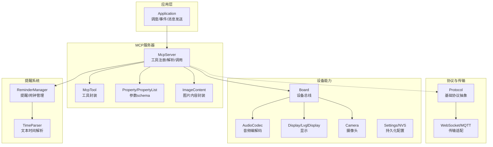
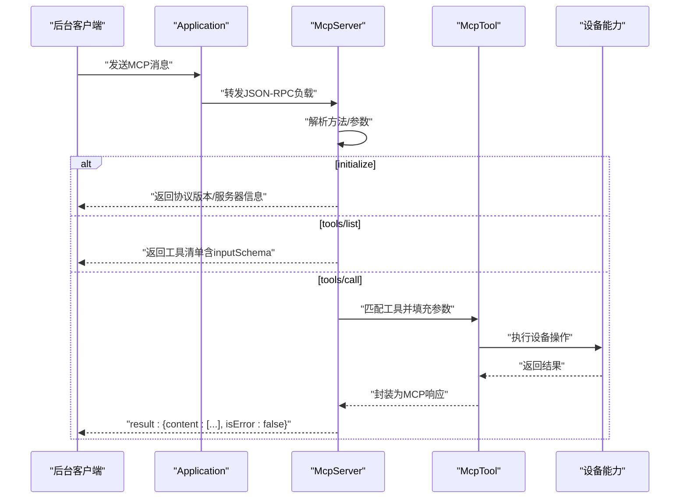
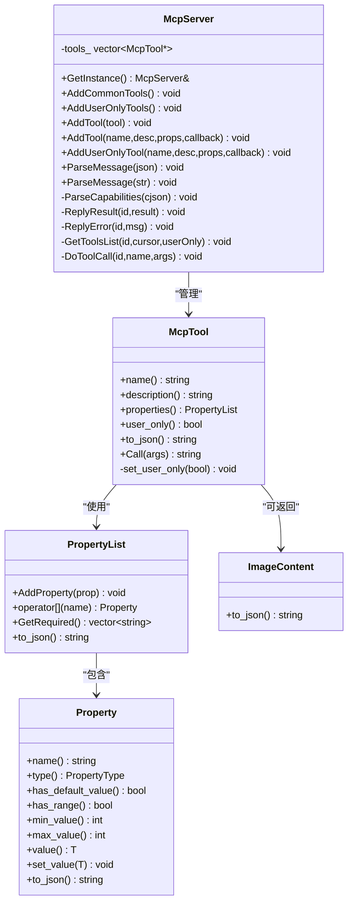
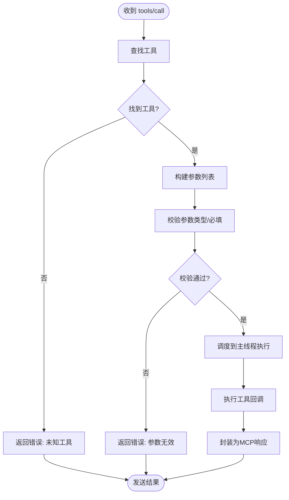
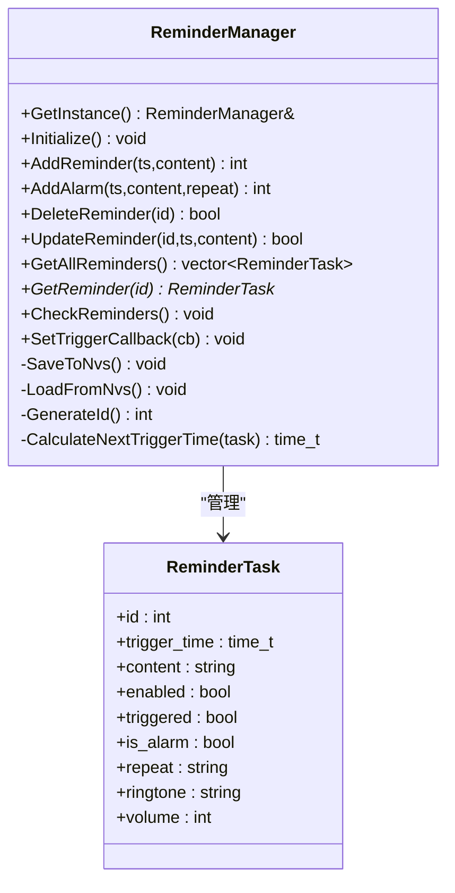
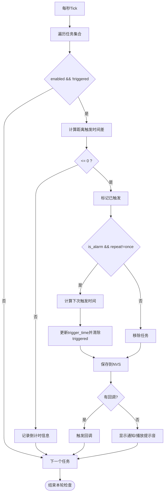
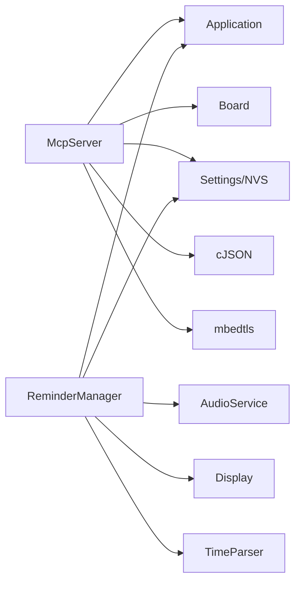

# MCP服务器API

<cite>
**本文引用的文件**
- [mcp_server.h](file://main/mcp_server.h)
- [mcp_server.cc](file://main/mcp_server.cc)
- [reminder_manager.h](file://main/reminder_manager.h)
- [reminder_manager.cc](file://main/reminder_manager.cc)
- [reminder_mcp_tool.cc](file://main/reminder_mcp_tool.cc)
- [press_to_talk_mcp_tool.h](file://main/boards/common/press_to_talk_mcp_tool.h)
- [press_to_talk_mcp_tool.cc](file://main/boards/common/press_to_talk_mcp_tool.cc)
- [mcp-protocol.md](file://docs/mcp-protocol.md)
- [mcp-usage.md](file://docs/mcp-usage.md)
- [application.h](file://main/application.h)
</cite>

## 目录
1. [简介](#简介)
2. [项目结构](#项目结构)
3. [核心组件](#核心组件)
4. [架构总览](#架构总览)
5. [详细组件分析](#详细组件分析)
6. [依赖关系分析](#依赖关系分析)
7. [性能考量](#性能考量)
8. [故障排查指南](#故障排查指南)
9. [结论](#结论)
10. [附录](#附录)

## 简介
本文件为MCP（Model Context Protocol）服务器API的技术文档，面向希望在ESP32设备上通过MCP协议对外暴露设备能力（工具）并接收远程控制指令的开发者。文档覆盖以下主题：
- MCP协议消息格式与交互流程
- 服务器端工具注册、命令解析与响应生成
- 设备状态查询、音频/屏幕/相机等硬件控制
- 提醒管理器API与定时任务处理
- 自定义MCP工具的注册与调用机制
- 实际使用示例与最佳实践

## 项目结构
MCP服务器位于main目录，配合提醒管理器、应用调度器与各板级工具共同构成完整的设备控制与消息处理体系。

图表来源
- [mcp_server.h:208-344](file://main/mcp_server.h#L208-L344)
- [mcp_server.cc:1-570](file://main/mcp_server.cc#L1-L570)
- [reminder_manager.h:22-56](file://main/reminder_manager.h#L22-L56)
- [reminder_manager.cc:1-331](file://main/reminder_manager.cc#L1-L331)
- [application.h:50-194](file://main/application.h#L50-L194)

章节来源
- [mcp_server.h:1-345](file://main/mcp_server.h#L1-L345)
- [mcp_server.cc:1-570](file://main/mcp_server.cc#L1-L570)
- [reminder_manager.h:1-59](file://main/reminder_manager.h#L1-L59)
- [reminder_manager.cc:1-331](file://main/reminder_manager.cc#L1-L331)
- [mcp-protocol.md:1-270](file://docs/mcp-protocol.md#L1-L270)
- [mcp-usage.md:1-115](file://docs/mcp-usage.md#L1-L115)
- [application.h:1-212](file://main/application.h#L1-L212)

## 核心组件
- McpServer：MCP协议服务器核心，负责消息解析、工具注册、工具调用与响应生成。
- McpTool：单个工具的封装，包含名称、描述、输入参数schema与回调。
- Property/PropertyList：参数类型与schema定义，支持布尔、整数、字符串，可设定默认值与取值范围。
- ImageContent：图片内容的编码封装，用于工具返回图像数据。
- ReminderManager：提醒/闹钟管理，支持一次性与周期性任务、触发回调、NVS持久化。
- Application：应用调度器，提供主线程调度、MCP消息发送、OTA升级、重启等能力。

章节来源
- [mcp_server.h:16-345](file://main/mcp_server.h#L16-L345)
- [mcp_server.cc:23-570](file://main/mcp_server.cc#L23-L570)
- [reminder_manager.h:10-56](file://main/reminder_manager.h#L10-L56)
- [reminder_manager.cc:16-331](file://main/reminder_manager.cc#L16-L331)
- [application.h:50-194](file://main/application.h#L50-L194)

## 架构总览
MCP服务器遵循JSON-RPC 2.0规范，通过基础协议（如WebSocket/MQTT）承载消息。典型交互包括：
- 初始化会话（initialize）
- 发现工具（tools/list）
- 调用工具（tools/call）

图表来源
- [mcp-protocol.md:61-196](file://docs/mcp-protocol.md#L61-L196)
- [mcp_server.cc:359-442](file://main/mcp_server.cc#L359-L442)
- [mcp_server.cc:517-569](file://main/mcp_server.cc#L517-L569)

## 详细组件分析

### McpServer 类
- 单例模式，提供工具注册与消息处理入口
- 公共接口
  - AddCommonTools/AddUserOnlyTools：注册通用/仅用户可见工具
  - AddTool/AddUserOnlyTool：注册自定义工具
  - ParseMessage：解析JSON-RPC消息并路由到对应处理逻辑
- 关键处理流程
  - initialize：返回协议版本与服务器信息
  - tools/list：分页返回工具清单，支持cursor与用户工具过滤
  - tools/call：参数校验、主线程调度执行、异常捕获与错误响应

图表来源
- [mcp_server.h:208-344](file://main/mcp_server.h#L208-L344)

章节来源
- [mcp_server.h:314-342](file://main/mcp_server.h#L314-L342)
- [mcp_server.cc:35-132](file://main/mcp_server.cc#L35-L132)
- [mcp_server.cc:330-442](file://main/mcp_server.cc#L330-L442)
- [mcp_server.cc:461-515](file://main/mcp_server.cc#L461-L515)
- [mcp_server.cc:517-569](file://main/mcp_server.cc#L517-L569)

### 工具注册与调用机制
- 工具注册
  - 通过AddTool/AddUserOnlyTool注册，支持匿名函数回调
  - 工具描述包含inputSchema，由PropertyList自动生成
- 工具调用
  - tools/call时，服务器根据工具的PropertyList校验参数类型与必填项
  - 使用Application::Schedule将工具执行调度到主任务队列，保证线程安全
  - 返回值统一封装为MCP result，支持文本与图片两种内容类型

图表来源
- [mcp_server.cc:517-569](file://main/mcp_server.cc#L517-L569)
- [mcp_server.h:208-312](file://main/mcp_server.h#L208-L312)

章节来源
- [mcp_server.cc:309-328](file://main/mcp_server.cc#L309-L328)
- [mcp_server.cc:517-569](file://main/mcp_server.cc#L517-L569)
- [mcp-usage.md:18-59](file://docs/mcp-usage.md#L18-L59)

### 设备控制与状态查询
- 通用工具（AddCommonTools）
  - 查询设备状态：self.get_device_status
  - 设置音量：self.audio_speaker.set_volume
  - 设置屏幕亮度：self.screen.set_brightness（若背光可用）
  - 设置界面主题：self.screen.set_theme（LVGL场景）
  - 拍照并解释：self.camera.take_photo（LVGL场景）
- 用户专用工具（AddUserOnlyTools）
  - 获取系统信息：self.get_system_info
  - 重启设备：self.reboot
  - 固件升级：self.upgrade_firmware
  - 屏幕信息：self.screen.get_info
  - 截图上传：self.screen.snapshot
  - 预览图片：self.screen.preview_image
  - 设置资源下载地址：self.assets.set_download_url

章节来源
- [mcp_server.cc:35-132](file://main/mcp_server.cc#L35-L132)
- [mcp_server.cc:134-307](file://main/mcp_server.cc#L134-L307)

### 提醒管理器API与定时任务处理
- 数据结构
  - ReminderTask：包含触发时间、内容、启用状态、是否已触发、是否为闹钟、重复策略、铃声、音量等
- 核心API
  - Initialize：从NVS加载任务
  - AddReminder/AddAlarm：新增提醒/闹钟；闹钟支持once/daily/weekly/monthly
  - DeleteReminder/UpdateReminder：删除/更新任务
  - GetAllReminders/GetReminder：查询全部或指定任务
  - CheckReminders：每秒检查，触发后按策略决定是否移除或安排下次触发
  - SetTriggerCallback：设置触发回调（默认回退到显示通知与播放提示音）
- 时间计算
  - CalculateNextTriggerTime：根据重复策略计算下次触发时间

图表来源
- [reminder_manager.h:10-56](file://main/reminder_manager.h#L10-L56)
- [reminder_manager.cc:94-114](file://main/reminder_manager.cc#L94-L114)

章节来源
- [reminder_manager.h:22-56](file://main/reminder_manager.h#L22-L56)
- [reminder_manager.cc:22-331](file://main/reminder_manager.cc#L22-L331)

### 定时任务处理流程

图表来源
- [reminder_manager.cc:167-244](file://main/reminder_manager.cc#L167-L244)

章节来源
- [reminder_manager.cc:167-244](file://main/reminder_manager.cc#L167-L244)

### 自定义MCP工具与设备控制示例
- 注册自定义工具
  - 使用McpServer::AddTool/AddUserOnlyTool注册，传入名称、描述、参数schema与回调
  - 参数schema通过Property/PropertyList声明，支持布尔、整数、字符串与默认值/范围
- 设备控制示例
  - 设置音量：arguments包含volume（0-100）
  - 设置屏幕亮度：arguments包含brightness（0-100）
  - 设置主题：arguments包含theme（如"light"/"dark"）
  - 拍照并解释：arguments包含question（问题描述）
- 提醒工具示例
  - self.reminder.set：解析文本中的时间并创建提醒
  - self.alarm.set：解析文本中的时间并创建闹钟（支持repeat）
  - self.reminder.list/self.reminder.delete：列出与删除提醒/闹钟

章节来源
- [mcp-usage.md:18-115](file://docs/mcp-usage.md#L18-L115)
- [reminder_mcp_tool.cc:23-163](file://main/reminder_mcp_tool.cc#L23-L163)
- [press_to_talk_mcp_tool.cc:10-57](file://main/boards/common/press_to_talk_mcp_tool.cc#L10-L57)

## 依赖关系分析
- McpServer依赖
  - Board：访问音频编解码、屏幕、摄像头、网络等设备能力
  - Application：主线程调度、MCP消息发送、OTA升级、重启
  - Settings/NVS：持久化配置与提醒任务存储
  - cJSON：JSON解析与序列化
  - mbedtls：图片Base64编码
- ReminderManager依赖
  - Settings/NVS：任务持久化
  - Application/AudioService/Display：触发时的通知与提示音
  - TimeParser：文本时间解析

图表来源
- [mcp_server.cc:13-19](file://main/mcp_server.cc#L13-L19)
- [reminder_manager.cc:2-7](file://main/reminder_manager.cc#L2-L7)

章节来源
- [mcp_server.cc:13-19](file://main/mcp_server.cc#L13-L19)
- [reminder_manager.cc:2-7](file://main/reminder_manager.cc#L2-L7)

## 性能考量
- Prompt缓存优化：常用工具置于工具列表前端，利于大模型prompt缓存命中，降低响应延迟
- 主线程调度：工具执行通过Application::Schedule进入主线程，避免并发冲突
- 分页返回工具列表：tools/list支持cursor分页，避免单次响应过大
- 轻量JSON处理：使用cJSON进行快速解析与序列化
- 资源优先级：拍照等耗时操作通过TaskPriorityReset临时降级，避免阻塞关键路径

章节来源
- [mcp_server.cc:35-38](file://main/mcp_server.cc#L35-L38)
- [mcp_server.cc:517-569](file://main/mcp_server.cc#L517-L569)
- [mcp_server.cc:461-515](file://main/mcp_server.cc#L461-L515)

## 故障排查指南
- 解析错误
  - JSONRPC版本不为2.0：检查客户端消息格式
  - 缺少method或params类型不正确：核对JSON结构
- 工具调用错误
  - 未知工具：确认工具名称拼写与注册顺序
  - 参数缺失或类型不匹配：核对PropertyList与客户端arguments
  - 工具执行异常：查看回调内异常日志
- 响应格式
  - 成功响应：result.content数组包含文本或图片内容，isError=false
  - 错误响应：error.message包含错误信息
- 提醒系统
  - 任务未触发：检查trigger_time与当前时间差
  - 闹钟未重复：确认repeat策略与CalculateNextTriggerTime逻辑
  - 触发无反馈：确认SetTriggerCallback是否设置或默认通知逻辑

章节来源
- [mcp_server.cc:359-442](file://main/mcp_server.cc#L359-L442)
- [mcp_server.cc:517-569](file://main/mcp_server.cc#L517-L569)
- [reminder_manager.cc:167-244](file://main/reminder_manager.cc#L167-L244)

## 结论
MCP服务器为ESP32设备提供了标准化、可扩展的设备控制与状态查询能力。通过清晰的工具注册机制、严谨的参数schema与完善的错误处理，开发者可以快速实现自定义工具并接入远程控制场景。结合提醒管理器与应用调度器，系统在易用性与可靠性方面达到良好平衡。

## 附录

### MCP协议消息格式与数据结构定义
- JSON-RPC 2.0负载字段
  - jsonrpc：固定为"2.0"
  - method：方法名（如initialize、tools/list、tools/call）
  - params：方法参数对象（可选）
  - id：请求ID（用于匹配响应）
  - result：成功结果（可选）
  - error：错误信息（可选）
- 基础协议封装
  - MCP消息封装在基础协议消息体中，包含session_id与type字段

章节来源
- [mcp-protocol.md:7-36](file://docs/mcp-protocol.md#L7-L36)
- [mcp-protocol.md:11-26](file://docs/mcp-protocol.md#L11-L26)

### 典型接口使用示例
- 获取工具列表
  - 方法：tools/list
  - 参数：cursor（首次为空）
  - 返回：tools数组与nextCursor（如需分页）
- 调用工具
  - 方法：tools/call
  - 参数：name（工具名称）、arguments（参数对象）
  - 返回：result.content包含文本或图片内容，isError=false表示成功
- 初始化会话
  - 方法：initialize
  - 返回：protocolVersion、capabilities、serverInfo

章节来源
- [mcp-protocol.md:61-196](file://docs/mcp-protocol.md#L61-L196)

### 自定义MCP工具实现步骤
- 步骤
  - 在设备初始化阶段获取McpServer实例
  - 通过AddTool/AddUserOnlyTool注册工具，声明名称、描述、参数schema与回调
  - 在回调中实现设备控制逻辑，返回统一的ReturnValue类型
  - 如需返回图片，构造ImageContent并返回
- 示例参考
  - 通用工具：音量设置、屏幕亮度、主题切换、拍照解释
  - 用户工具：系统信息、重启、固件升级、截图上传、预览图片、资源下载地址
  - 提醒工具：self.reminder.set、self.alarm.set、self.reminder.list、self.reminder.delete
  - 板级工具：按键说话模式切换

章节来源
- [mcp-usage.md:18-115](file://docs/mcp-usage.md#L18-L115)
- [mcp_server.cc:35-132](file://main/mcp_server.cc#L35-L132)
- [mcp_server.cc:134-307](file://main/mcp_server.cc#L134-L307)
- [reminder_mcp_tool.cc:23-163](file://main/reminder_mcp_tool.cc#L23-L163)
- [press_to_talk_mcp_tool.cc:10-57](file://main/boards/common/press_to_talk_mcp_tool.cc#L10-L57)