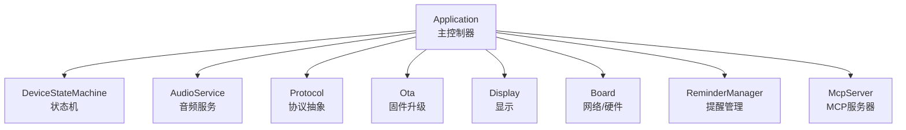
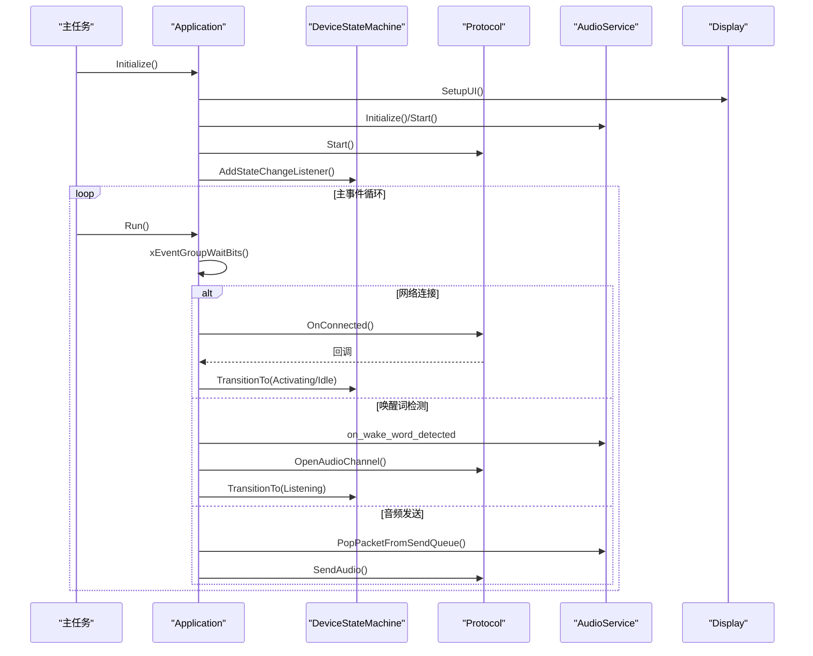
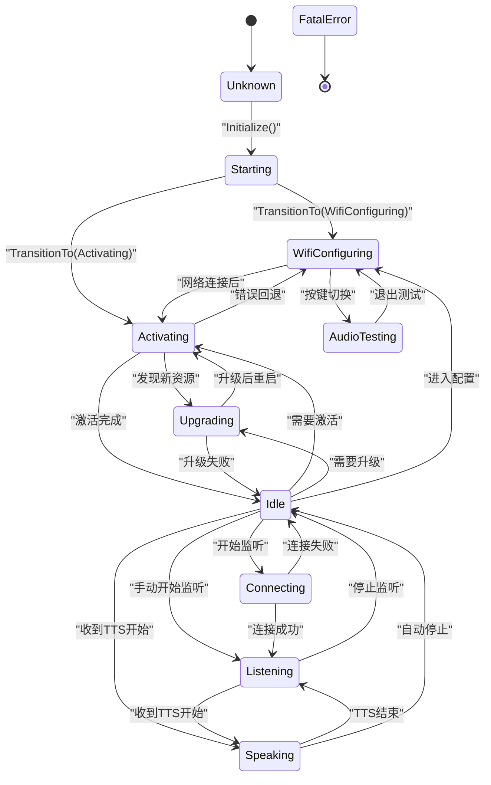
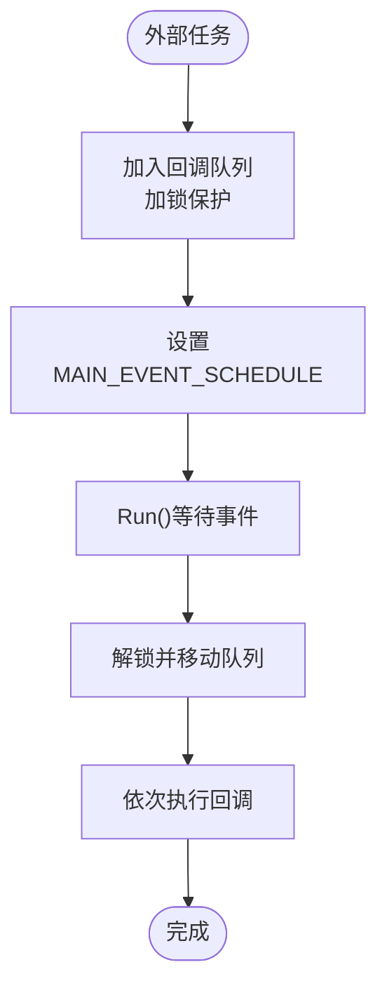
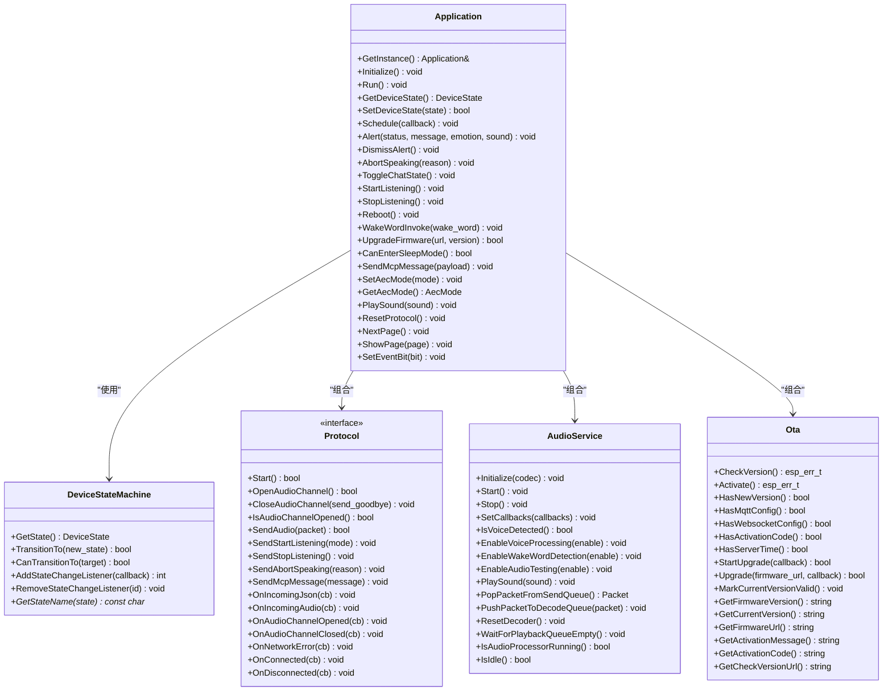

# 应用程序API

<cite>
**本文档引用的文件**
- [application.h](file://main/application.h)
- [application.cc](file://main/application.cc)
- [device_state.h](file://main/device_state.h)
- [device_state_machine.h](file://main/device_state_machine.h)
- [device_state_machine.cc](file://main/device_state_machine.cc)
- [protocol.h](file://main/protocols/protocol.h)
- [ota.h](file://main/ota.h)
- [audio_service.h](file://main/audio_service.h)
- [main.cc](file://main/main.cc)
</cite>

## 目录
1. [简介](#简介)
2. [项目结构](#项目结构)
3. [核心组件](#核心组件)
4. [架构总览](#架构总览)
5. [详细组件分析](#详细组件分析)
6. [依赖关系分析](#依赖关系分析)
7. [性能考虑](#性能考虑)
8. [故障排除指南](#故障排除指南)
9. [结论](#结论)
10. [附录](#附录)

## 简介
本文件为Application类的详细API文档，涵盖应用程序主控制器的所有公共接口，包括Initialize()、Run()、SetDeviceState()等核心方法。文档详细说明了每个方法的参数类型、返回值、异常处理策略，并提供了设备状态管理API的使用示例，包括状态转换、事件处理和回调机制。同时，文档解释了异步API的调度机制与线程安全保证，以及Application单例模式的使用方法和生命周期管理，并给出实际代码示例展示如何正确初始化和使用Application实例。

## 项目结构
Application类位于main目录下，是整个ESP32 AI应用的核心控制器。它负责：
- 初始化系统资源（显示、音频、网络）
- 维护设备状态机
- 处理事件循环与异步任务调度
- 协调协议层（MQTT/WebSocket）与OTA升级
- 提供对外API供其他模块调用

**图表来源**
- [application.h:50-194](file://main/application.h#L50-L194)
- [application.cc:85-199](file://main/application.cc#L85-L199)

**章节来源**
- [application.h:50-194](file://main/application.h#L50-L194)
- [main.cc:14-29](file://main/main.cc#L14-L29)

## 核心组件
- Application：单例主控制器，提供Initialize()、Run()、SetDeviceState()等公共接口；内部维护事件组、状态机、音频服务、协议对象、OTA对象等。
- DeviceStateMachine：严格的状态机，确保合法的状态转换并提供监听回调。
- Protocol：协议抽象接口，支持MQTT/WebSocket等具体实现。
- AudioService：音频编解码、唤醒词检测、VAD、播放队列等。
- Ota：固件版本检查、激活流程、OTA升级。
- Display/Board：显示与硬件抽象层。

**章节来源**
- [application.h:50-194](file://main/application.h#L50-L194)
- [device_state_machine.h:17-81](file://main/device_state_machine.h#L17-L81)
- [protocol.h:44-95](file://main/protocols/protocol.h#L44-L95)
- [ota.h:10-56](file://main/ota.h#L10-L56)

## 架构总览
Application采用事件驱动的主循环模型，通过FreeRTOS事件组协调多个异步源（网络、音频、定时器、用户按键），在主线程中统一处理事件并触发状态机转换与UI更新。所有跨任务调用均通过Schedule()进行线程安全的任务调度。

**图表来源**
- [application.cc:201-299](file://main/application.cc#L201-L299)
- [application.cc:302-362](file://main/application.cc#L302-L362)
- [application.cc:816-862](file://main/application.cc#L816-L862)

## 详细组件分析

### Application类API详解

#### 单例模式与生命周期
- 获取实例：Application::GetInstance()
- 构造/析构：Application()初始化事件组、GPIO、定时器；析构时释放资源。
- 生命周期：app_main()中创建单例，调用Initialize()后进入Run()主循环，永不返回。

**章节来源**
- [application.h:52-58](file://main/application.h#L52-L58)
- [application.cc:34-79](file://main/application.cc#L34-L79)
- [main.cc:26-28](file://main/main.cc#L26-L28)

#### Initialize() 初始化
- 功能：设置显示UI、启动音频服务、注册音频回调、添加状态变化监听、启动时钟定时器、初始化MCP工具、设置网络事件回调、异步启动网络。
- 参数：无
- 返回值：void
- 异常：无显式抛出；内部通过事件组通知错误。
- 关键行为：
  - 注册AudioService回调：on_send_queue_available/on_wake_word_detected/on_vad_change
  - 注册状态变化监听：MAIN_EVENT_STATE_CHANGED
  - 设置网络事件回调：根据事件类型更新UI与状态
  - 启动周期性时钟定时器（1秒）

**章节来源**
- [application.cc:85-199](file://main/application.cc#L85-L199)

#### Run() 主事件循环
- 功能：在主线程中运行事件循环，等待并处理各类事件位，按优先级顺序处理网络、状态变化、音频、定时器等事件。
- 参数：无
- 返回值：void（永不返回）
- 异常：无显式抛出；错误通过MAIN_EVENT_ERROR事件处理。
- 事件处理优先级：
  - 错误事件：设置空闲状态并弹出错误提示
  - 网络连接/断开：分别处理激活、关闭音频通道等
  - 激活完成：打印内存统计、设置空闲状态、播放成功音效
  - 状态变化：根据新状态更新UI、LED、音频处理开关
  - 聊天切换/开始/停止监听：根据当前状态执行相应动作
  - 音频发送：从发送队列取出包并发送
  - 唤醒词检测：根据状态决定是否开启音频通道或中断说话
  - VAD变化：在监听状态下更新LED状态
  - 任务调度：执行Schedule()提交的回调队列
  - 时钟滴答：更新状态栏、传感器、提醒检查、周期性打印堆栈信息

**章节来源**
- [application.cc:201-299](file://main/application.cc#L201-L299)

#### 设备状态管理API
- GetDeviceState()：获取当前设备状态（只读）
- SetDeviceState(state)：请求状态转换，返回是否成功
- OnStateChanged(old_state, new_state)：状态机回调，由状态机内部调用
- 设备状态枚举：kDeviceStateUnknown、kDeviceStateStarting、kDeviceStateWifiConfiguring、kDeviceStateIdle、kDeviceStateConnecting、kDeviceStateListening、kDeviceStateSpeaking、kDeviceStateUpgrading、kDeviceStateActivating、kDeviceStateAudioTesting、kDeviceStateFatalError

**图表来源**
- [device_state_machine.cc:34-102](file://main/device_state_machine.cc#L34-L102)
- [device_state.h:4-16](file://main/device_state.h#L4-L16)

**章节来源**
- [application.h:74-81](file://main/application.h#L74-L81)
- [application.cc:81-83](file://main/application.cc#L81-L83)
- [device_state_machine.h:29-41](file://main/device_state_machine.h#L29-L41)
- [device_state.h:4-16](file://main/device_state.h#L4-L16)

#### 异步API与调度机制
- Schedule(callback)：将回调函数加入队列并在MAIN_EVENT_SCHEDULE事件中执行，保证在主线程上下文安全执行。
- SetEventBit(bit)：设置指定事件位，用于从任意任务向主循环发送信号。
- 线程安全：
  - 使用std::mutex保护回调队列
  - 使用FreeRTOS事件组进行跨任务通信
  - 所有UI与协议操作均通过Schedule()在主线程执行

**图表来源**
- [application.cc:978-984](file://main/application.cc#L978-L984)
- [application.cc:275-282](file://main/application.cc#L275-L282)

**章节来源**
- [application.cc:978-984](file://main/application.cc#L978-L984)
- [application.cc:1215-1217](file://main/application.cc#L1215-L1217)

#### 事件处理与回调
- 网络事件：网络连接/断开时更新UI与状态，必要时关闭音频通道。
- 唤醒词检测：根据当前状态决定是否打开音频通道、中断说话、播放提示音等。
- 音频事件：发送队列可用时批量发送音频包；VAD变化时更新LED。
- 定时器事件：每秒更新状态栏、传感器、检查提醒、周期性打印堆栈信息。
- 状态变化事件：根据新状态更新显示、LED、音频处理开关。

**章节来源**
- [application.cc:302-362](file://main/application.cc#L302-L362)
- [application.cc:816-862](file://main/application.cc#L816-L862)
- [application.cc:264-298](file://main/application.cc#L264-L298)

#### 设备状态管理API使用示例
以下示例展示如何正确使用设备状态管理API：

- 切换到监听状态
  - 方法：StartListening()
  - 效果：根据当前状态打开音频通道或发送开始监听命令
  - 参考路径：[application.cc:711-799](file://main/application.cc#L711-L799)

- 停止监听
  - 方法：StopListening()
  - 效果：发送停止监听命令并回到空闲状态
  - 参考路径：[application.cc:715-814](file://main/application.cc#L715-L814)

- 切换聊天状态
  - 方法：ToggleChatState()
  - 效果：根据状态在不同页面间切换或进入音频测试
  - 参考路径：[application.cc:707-751](file://main/application.cc#L707-L751)

- 唤醒词触发
  - 方法：WakeWordInvoke(wake_word)
  - 效果：根据状态打开音频通道或中断说话
  - 参考路径：[application.cc:1068-1099](file://main/application.cc#L1068-L1099)

**章节来源**
- [application.cc:707-751](file://main/application.cc#L707-L751)
- [application.cc:711-799](file://main/application.cc#L711-L799)
- [application.cc:715-814](file://main/application.cc#L715-L814)
- [application.cc:1068-1099](file://main/application.cc#L1068-L1099)

#### 其他重要API
- Alert(status, message, emotion, sound)：弹出提示框，更新状态、表情与消息，可选播放声音
- DismissAlert()：在空闲状态下清除提示
- AbortSpeaking(reason)：中断正在播放的TTS
- Reboot()：关闭音频通道后重启系统
- UpgradeFirmware(url, version)：执行OTA升级，失败时恢复音频服务
- CanEnterSleepMode()：判断是否可以进入睡眠模式
- SendMcpMessage(payload)：发送MCP消息（线程安全）
- SetAecMode(mode)/GetAecMode()：设置/获取AEC模式
- PlaySound(sound)：播放指定声音
- ResetProtocol()：重置协议资源（线程安全）
- NextPage()/ShowPage(page)：页面管理
- SetListeningMode(mode)/GetDefaultListeningMode()：监听模式管理

**章节来源**
- [application.cc:687-705](file://main/application.cc#L687-L705)
- [application.cc:986-992](file://main/application.cc#L986-L992)
- [application.cc:1003-1066](file://main/application.cc#L1003-L1066)
- [application.cc:1101-1116](file://main/application.cc#L1101-L1116)
- [application.cc:1118-1125](file://main/application.cc#L1118-L1125)
- [application.cc:1127-1152](file://main/application.cc#L1127-L1152)
- [application.cc:1154-1156](file://main/application.cc#L1154-L1156)
- [application.cc:1158-1167](file://main/application.cc#L1158-L1167)
- [application.cc:1169-1213](file://main/application.cc#L1169-L1213)
- [application.cc:994-1001](file://main/application.cc#L994-L1001)

## 依赖关系分析

**图表来源**
- [application.h:50-194](file://main/application.h#L50-L194)
- [device_state_machine.h:17-81](file://main/device_state_machine.h#L17-L81)
- [protocol.h:44-95](file://main/protocols/protocol.h#L44-L95)
- [audio_service.h](file://main/audio_service.h)
- [ota.h:10-56](file://main/ota.h#L10-L56)

**章节来源**
- [application.h:146-156](file://main/application.h#L146-L156)
- [device_state_machine.h:17-81](file://main/device_state_machine.h#L17-L81)
- [protocol.h:44-95](file://main/protocols/protocol.h#L44-L95)

## 性能考虑
- 事件驱动模型：通过事件组避免轮询，降低CPU占用。
- 批量音频发送：在SEND_AUDIO事件中循环从发送队列取出包并发送，减少事件触发频率。
- 周期性任务：时钟定时器每秒触发一次，用于状态栏更新、传感器读取、提醒检查与堆栈打印。
- 内存管理：使用智能指针管理Protocol与Ota对象，避免泄漏。
- AEC模式切换：切换AEC模式时关闭音频通道，确保一致性。
- 电源管理：根据状态调整电源保存级别（低功耗/高性能）。

[本节为通用性能讨论，无需特定文件来源]

## 故障排除指南
- 网络错误：协议层发生网络错误时，通过MAIN_EVENT_ERROR事件设置错误消息并弹出提示。
- 版本检查失败：重试机制最多3次，指数退避，最大延迟15秒。
- 升级失败：恢复音频服务并继续运行，弹出错误提示。
- 状态非法转换：状态机记录警告日志，拒绝非法转换。
- 无法进入睡眠：当非空闲状态、音频通道已打开或音频服务未空闲时拒绝睡眠。

**章节来源**
- [application.cc:538-541](file://main/application.cc#L538-L541)
- [application.cc:442-516](file://main/application.cc#L442-L516)
- [application.cc:1050-1058](file://main/application.cc#L1050-L1058)
- [device_state_machine.cc:116-121](file://main/device_state_machine.cc#L116-L121)
- [application.cc:1101-1116](file://main/application.cc#L1101-L1116)

## 结论
Application类通过事件驱动与状态机相结合的方式，实现了对ESP32 AI设备的统一控制。其单例设计、线程安全的调度机制、完善的事件处理与状态管理，使得复杂的功能（网络、音频、显示、OTA、MCP）得以有序协调。开发者可通过本文档提供的API与示例，正确初始化并使用Application实例，构建稳定可靠的AI助手应用。

[本节为总结性内容，无需特定文件来源]

## 附录

### 实际使用示例

- 正确初始化与运行
  - 在app_main()中初始化NVFS Flash，获取Application单例，调用Initialize()与Run()
  - 参考路径：[main.cc:14-29](file://main/main.cc#L14-L29)

- 设备状态管理示例
  - 开始监听：调用StartListening()，根据状态自动打开音频通道
  - 停止监听：调用StopListening()，发送停止命令并回到空闲
  - 切换聊天：调用ToggleChatState()，在不同页面与测试模式间切换
  - 参考路径：[application.cc:711-814](file://main/application.cc#L711-L814)

- 异步API使用示例
  - 从任意任务调度UI更新：使用Schedule([this, message](){ display->SetChatMessage(...); })
  - 发送MCP消息：SendMcpMessage(json_payload)
  - 参考路径：[application.cc:978-984](file://main/application.cc#L978-L984)
  - [application.cc:1118-1125](file://main/application.cc#L1118-L1125)

- AEC模式切换示例
  - SetAecMode(kAecOnDeviceSide/ServerSide/Off)，自动更新显示与关闭音频通道
  - 参考路径：[application.cc:1127-1152](file://main/application.cc#L1127-L1152)

**章节来源**
- [main.cc:14-29](file://main/main.cc#L14-L29)
- [application.cc:711-814](file://main/application.cc#L711-L814)
- [application.cc:978-984](file://main/application.cc#L978-L984)
- [application.cc:1118-1125](file://main/application.cc#L1118-L1125)
- [application.cc:1127-1152](file://main/application.cc#L1127-L1152)