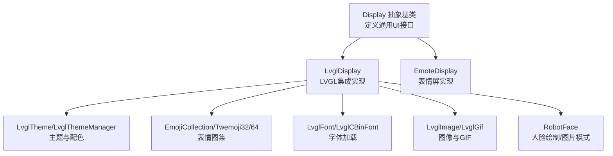
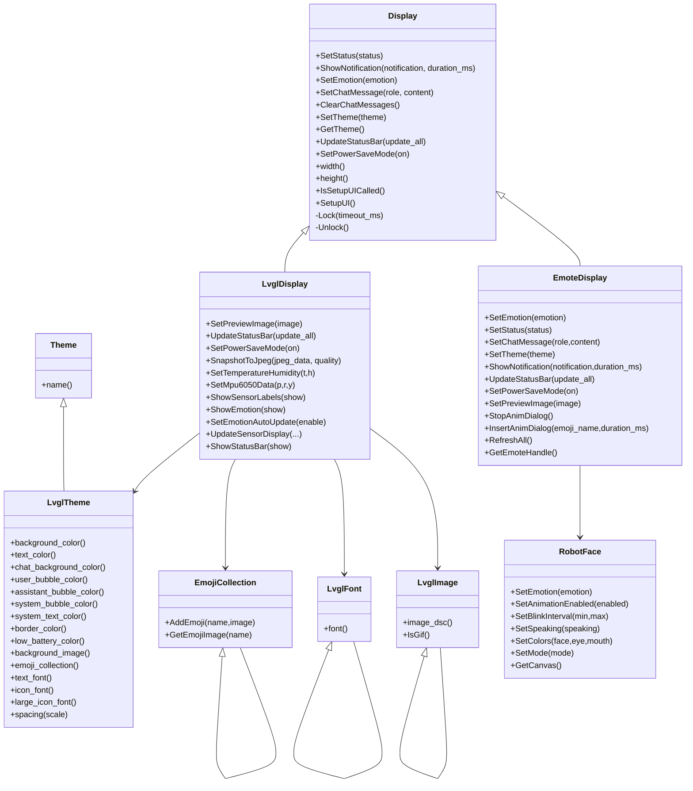
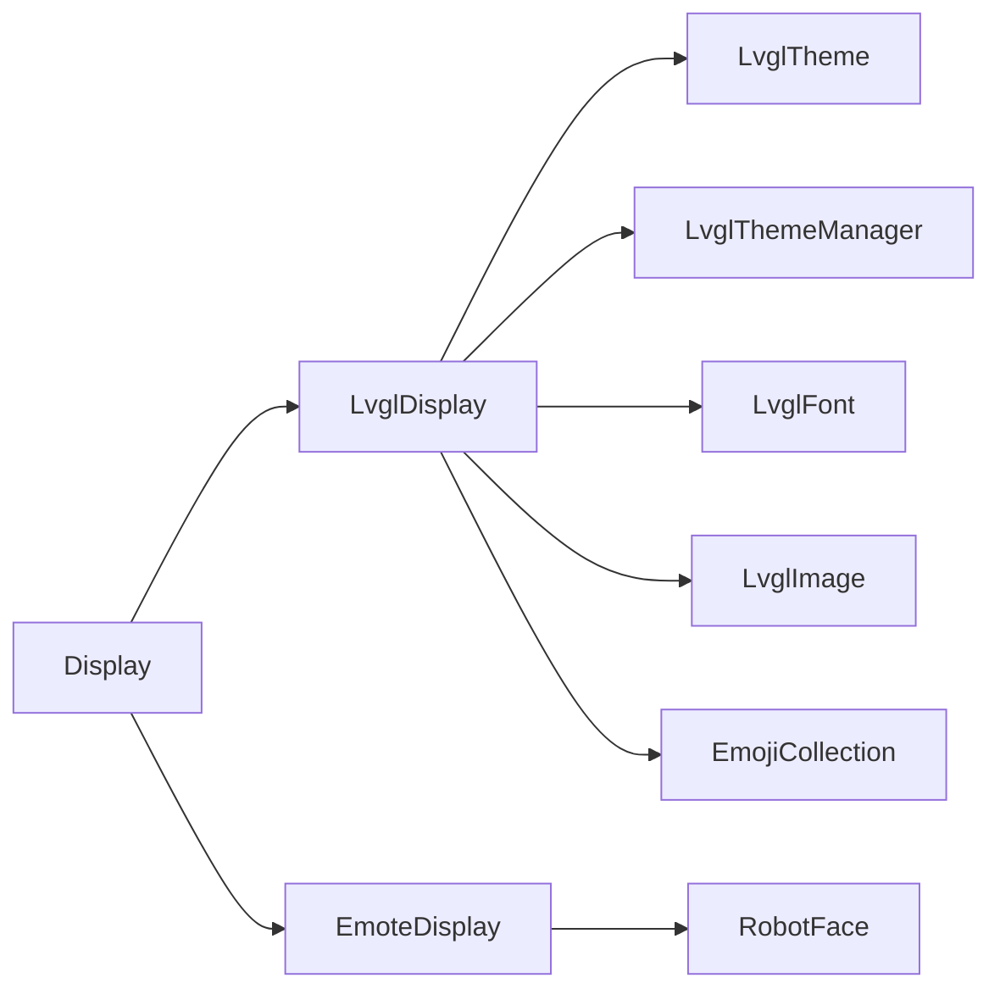

# 显示系统API

<cite>
**本文引用的文件**
- [display.h](file://main/display/display.h)
- [lvgl_display.h](file://main/display/lvgl_display/lvgl_display.h)
- [lvgl_display.cc](file://main/display/lvgl_display/lvgl_display.cc)
- [emote_display.h](file://main/display/emote_display.h)
- [emote_display.cc](file://main/display/emote_display.cc)
- [emoji_collection.h](file://main/display/lvgl_display/emoji_collection.h)
- [emoji_collection.cc](file://main/display/lvgl_display/emoji_collection.cc)
- [lvgl_font.h](file://main/display/lvgl_display/lvgl_font.h)
- [lvgl_font.cc](file://main/display/lvgl_display/lvgl_font.cc)
- [lvgl_image.h](file://main/display/lvgl_display/lvgl_image.h)
- [lvgl_theme.h](file://main/display/lvgl_display/lvgl_theme.h)
- [robot_face.h](file://main/display/lvgl_display/robot_face.h)
- [robot_face_images.h](file://main/display/lvgl_display/robot_face_images.h)
- [lvgl_gif.h](file://main/display/lvgl_display/gif/lvgl_gif.h)
</cite>

## 目录
1. [简介](#简介)
2. [项目结构](#项目结构)
3. [核心组件](#核心组件)
4. [架构总览](#架构总览)
5. [详细组件分析](#详细组件分析)
6. [依赖关系分析](#依赖关系分析)
7. [性能与内存优化](#性能与内存优化)
8. [故障排查指南](#故障排查指南)
9. [结论](#结论)
10. [附录：接口使用示例与最佳实践](#附录接口使用示例与最佳实践)

## 简介
本文件为Display类及其LVGL显示系统提供完整的API文档，覆盖屏幕控制、图形绘制、用户界面、表情显示、动画播放、主题切换、字体渲染、图像处理、颜色管理、触摸事件与交互、性能优化与内存管理，并给出创建自定义UI组件与复杂显示效果的实际示例路径。

## 项目结构
显示系统主要由三层组成：
- 抽象显示层：定义统一的Display接口，屏蔽具体驱动差异（LCD/OLED/Emote等）。
- LVGL集成层：基于LVGL实现的LvglDisplay，负责状态栏、通知、传感器数据、截图等功能。
- 表情与机器人面模块：EmoteDisplay与RobotFace，支持表情动画、图像模式与绘制模式。

图表来源
- [display.h:28-63](file://main/display/display.h#L28-L63)
- [lvgl_display.h:15-64](file://main/display/lvgl_display/lvgl_display.h#L15-L64)
- [emote_display.h:12-40](file://main/display/emote_display.h#L12-L40)
- [lvgl_theme.h:14-94](file://main/display/lvgl_display/lvgl_theme.h#L14-L94)
- [emoji_collection.h:14-34](file://main/display/lvgl_display/emoji_collection.h#L14-L34)
- [lvgl_font.h:6-31](file://main/display/lvgl_display/lvgl_font.h#L6-L31)
- [lvgl_image.h:7-53](file://main/display/lvgl_display/lvgl_image.h#L7-L53)
- [robot_face.h:7-131](file://main/display/lvgl_display/robot_face.h#L7-L131)

章节来源
- [display.h:28-63](file://main/display/display.h#L28-L63)
- [lvgl_display.h:15-64](file://main/display/lvgl_display/lvgl_display.h#L15-L64)
- [emote_display.h:12-40](file://main/display/emote_display.h#L12-L40)

## 核心组件
- Display抽象基类：定义统一的UI操作接口，如设置状态、显示通知、设置情绪、聊天消息、主题切换、电源省电模式、状态栏更新等；并提供尺寸查询与锁机制。
- LvglDisplay：继承Display，实现LVGL界面构建与更新，包括状态栏控件、通知定时器、传感器标签、表情自动更新、截图到JPEG等。
- EmoteDisplay：继承Display，面向表情屏设备，提供表情设置、聊天消息、主题切换、通知显示、预览图设置、动画对话插入与停止等。
- 主题系统：Theme基类与LvglTheme，提供颜色、字体、背景图、表情集合等主题属性，以及主题注册与管理。
- 字体系统：LvglFont抽象与LvglCBinFont，支持内置字体与cbin字体加载。
- 图像系统：LvglImage抽象与多种实现（原始数据、cbin、源数据、分配数据），以及LvglGif用于GIF动画播放。
- 表情集合：EmojiCollection及Twemoji32/64，提供表情名称到图像的映射。
- 机器人表情：RobotFace，支持绘制模式与图片模式、动画（眨眼、说话、空闲、呼吸）、颜色与形状配置。

章节来源
- [display.h:18-63](file://main/display/display.h#L18-L63)
- [lvgl_display.h:15-64](file://main/display/lvgl_display/lvgl_display.h#L15-L64)
- [emote_display.h:12-40](file://main/display/emote_display.h#L12-L40)
- [lvgl_theme.h:14-94](file://main/display/lvgl_display/lvgl_theme.h#L14-L94)
- [lvgl_font.h:6-31](file://main/display/lvgl_display/lvgl_font.h#L6-L31)
- [lvgl_image.h:7-53](file://main/display/lvgl_display/lvgl_image.h#L7-L53)
- [emoji_collection.h:14-34](file://main/display/lvgl_display/emoji_collection.h#L14-L34)
- [robot_face.h:7-131](file://main/display/lvgl_display/robot_face.h#L7-L131)

## 架构总览
Display作为统一抽象，通过虚函数接口向下分发到不同实现。LvglDisplay与EmoteDisplay分别对接LVGL与表情屏硬件，共享主题、字体、图像与表情集合体系。

图表来源
- [display.h:28-63](file://main/display/display.h#L28-L63)
- [lvgl_display.h:15-64](file://main/display/lvgl_display/lvgl_display.h#L15-L64)
- [emote_display.h:12-40](file://main/display/emote_display.h#L12-L40)
- [lvgl_theme.h:14-94](file://main/display/lvgl_display/lvgl_theme.h#L14-L94)
- [emoji_collection.h:14-34](file://main/display/lvgl_display/emoji_collection.h#L14-L34)
- [lvgl_font.h:6-31](file://main/display/lvgl_display/lvgl_font.h#L6-L31)
- [lvgl_image.h:7-53](file://main/display/lvgl_display/lvgl_image.h#L7-L53)
- [robot_face.h:7-131](file://main/display/lvgl_display/robot_face.h#L7-L131)

## 详细组件分析

### Display抽象层
- 职责：统一的屏幕控制与UI接口，屏蔽底层差异。
- 关键接口：
  - 屏幕控制：SetStatus、UpdateStatusBar、SetPowerSaveMode、SetupUI。
  - 消息与通知：ShowNotification、SetChatMessage、ClearChatMessages。
  - 表情与主题：SetEmotion、SetTheme、GetTheme。
  - 尺寸与锁：width、height、Lock/Unlock（内部使用DisplayLockGuard）。
- 设计要点：纯虚函数保证子类必须实现；提供默认空实现以兼容无显示场景（NoDisplay）。

章节来源
- [display.h:28-63](file://main/display/display.h#L28-L63)

### LvglDisplay（LVGL集成）
- 继承Display，扩展：
  - 预览图设置：SetPreviewImage。
  - 截图：SnapshotToJpeg。
  - 传感器数据：SetTemperatureHumidity、SetMpu6050Data、ShowSensorLabels、UpdateSensorDisplay。
  - 表情与状态栏：ShowEmotion、SetEmotionAutoUpdate、ShowStatusBar。
  - 内部状态：状态栏控件指针、低电量弹窗、PM锁、通知定时器、上次更新时间等。
- 锁机制：通过受保护的Lock/Unlock虚函数交由具体实现（如LVGL驱动）完成线程安全访问。

章节来源
- [lvgl_display.h:15-64](file://main/display/lvgl_display/lvgl_display.h#L15-L64)

### EmoteDisplay（表情屏）
- 继承Display，面向表情屏设备：
  - 表情与聊天：SetEmotion、SetChatMessage、SetStatus、SetTheme。
  - 通知与状态栏：ShowNotification、UpdateStatusBar、SetPowerSaveMode。
  - 预览图：SetPreviewImage（void*版本）。
  - 动画对话：StopAnimDialog、InsertAnimDialog（插入指定表情持续时长）。
  - 刷新：RefreshAll。
  - 获取句柄：GetEmoteHandle（内部使用）。

章节来源
- [emote_display.h:12-40](file://main/display/emote_display.h#L12-L40)

### 主题系统（LvglTheme/LvglThemeManager）
- LvglTheme：封装背景色、文本色、气泡色、边框色、低电量色、背景图、表情集合、文本/图标字体、间距等。
- LvglThemeManager：单例，提供注册与获取主题的能力，初始化默认主题。

章节来源
- [lvgl_theme.h:14-94](file://main/display/lvgl_display/lvgl_theme.h#L14-L94)

### 字体系统（LvglFont）
- LvglFont：字体接口。
- LvglBuiltInFont：内置字体。
- LvglCBinFont：从cbin二进制加载字体，支持删除释放。

章节来源
- [lvgl_font.h:6-31](file://main/display/lvgl_display/lvgl_font.h#L6-L31)
- [lvgl_font.cc:1-13](file://main/display/lvgl_display/lvgl_font.cc#L1-L13)

### 图像系统（LvglImage与GIF）
- LvglImage：图像接口，支持IsGif判断。
- 实现类型：
  - LvglRawImage：原始数据包装。
  - LvglCBinImage：cbin动态加载。
  - LvglSourceImage：源数据直接使用。
  - LvglAllocatedImage：分配数据包装。
- LvglGif：基于gifdec的GIF播放器，支持开始/暂停/恢复/停止、循环次数与延迟、帧回调。

章节来源
- [lvgl_image.h:7-53](file://main/display/lvgl_display/lvgl_image.h#L7-L53)
- [lvgl_gif.h:13-117](file://main/display/lvgl_display/gif/lvgl_gif.h#L13-L117)

### 表情集合（EmojiCollection/Twemoji32/64）
- EmojiCollection：表情名到图像的映射容器，提供添加与查找。
- Twemoji32/64：预置表情集合，注册常用表情（中性、开心、大笑、难过、愤怒、哭泣、爱、惊讶、思考、眨眼、酷、困倦、困惑等）。

章节来源
- [emoji_collection.h:14-34](file://main/display/lvgl_display/emoji_collection.h#L14-L34)
- [emoji_collection.cc:9-28](file://main/display/lvgl_display/emoji_collection.cc#L9-L28)
- [emoji_collection.cc:53-75](file://main/display/lvgl_display/emoji_collection.cc#L53-L75)
- [emoji_collection.cc:101-123](file://main/display/lvgl_display/emoji_collection.cc#L101-L123)

### 机器人表情（RobotFace）
- 支持绘制模式与图片模式，可设置表情（中性、开心、悲伤、愤怒、惊讶、思考、困倦、爱、困惑、酷、眨眼、大笑等）。
- 动画：眨眼、说话、空闲、呼吸定时器；可启用/禁用动画、设置闪烁区间、说话状态。
- 颜色与形状：面部、眼睛、瞳孔、嘴巴、腮红颜色；可设置模式、获取当前画布对象。

章节来源
- [robot_face.h:7-131](file://main/display/lvgl_display/robot_face.h#L7-L131)
- [robot_face_images.h:38-53](file://main/display/lvgl_display/robot_face_images.h#L38-L53)

## 依赖关系分析
- Display是所有显示实现的根，LvglDisplay与EmoteDisplay并列继承。
- LvglDisplay依赖主题、字体、图像、表情集合与机器人表情模块。
- EmoteDisplay依赖RobotFace进行表情绘制与动画。
- 主题管理器集中管理主题注册与获取，避免重复实例化。

图表来源
- [display.h:28-63](file://main/display/display.h#L28-L63)
- [lvgl_display.h:15-64](file://main/display/lvgl_display/lvgl_display.h#L15-L64)
- [emote_display.h:12-40](file://main/display/emote_display.h#L12-L40)
- [lvgl_theme.h:79-94](file://main/display/lvgl_display/lvgl_theme.h#L79-L94)

章节来源
- [display.h:28-63](file://main/display/display.h#L28-L63)
- [lvgl_display.h:15-64](file://main/display/lvgl_display/lvgl_display.h#L15-L64)
- [emote_display.h:12-40](file://main/display/emote_display.h#L12-L40)
- [lvgl_theme.h:79-94](file://main/display/lvgl_display/lvgl_theme.h#L79-L94)

## 性能与内存优化
- 主题与资源复用：通过LvglThemeManager集中管理主题，避免重复创建；表情集合与字体按需加载，减少内存占用。
- 图像与GIF：优先使用源数据或cbin加载，避免重复拷贝；GIF播放使用定时器驱动帧切换，合理设置loop_delay降低CPU占用。
- 锁与并发：DisplayLockGuard确保在多任务环境下对显示资源的互斥访问，防止LVGL绘制冲突。
- 电源管理：SetPowerSaveMode开启省电模式，结合PM锁在高负载时保持性能稳定。
- 截图优化：SnapshotToJpeg支持质量参数，根据需求平衡画质与内存带宽。

章节来源
- [lvgl_display.h:26-34](file://main/display/lvgl_display/lvgl_display.h#L26-L34)
- [display.h:66-79](file://main/display/display.h#L66-L79)
- [lvgl_gif.h:60-70](file://main/display/lvgl_display/gif/lvgl_gif.h#L60-L70)

## 故障排查指南
- 显示未刷新：检查是否调用UpdateStatusBar或SetupUI；确认Lock/Unlock配对使用。
- 表情不显示：确认SetEmotion传入的表情名存在于EmojiCollection或RobotFace支持列表；EmoteDisplay需正确设置预览图。
- GIF不播放：检查IsLoaded与IsPlaying状态；确认Start/Pause/Resume调用顺序正确；设置loop_delay与loop_count。
- 主题无效：确认已通过LvglThemeManager注册并SetTheme生效；检查颜色与字体是否为空。
- 截图失败：检查SnapshotToJpeg返回值与quality参数；确保显示缓冲可用。

章节来源
- [lvgl_gif.h:42-49](file://main/display/lvgl_display/gif/lvgl_gif.h#L42-L49)
- [lvgl_display.h:26](file://main/display/lvgl_display/lvgl_display.h#L26)
- [lvgl_theme.h:86-87](file://main/display/lvgl_display/lvgl_theme.h#L86-L87)

## 结论
该显示系统以Display为核心抽象，结合LVGL与表情屏实现，提供了统一的主题、字体、图像与表情管理能力。通过锁机制与电源管理策略，兼顾了易用性与性能。开发者可基于此框架快速扩展自定义UI组件与复杂显示效果。

## 附录：接口使用示例与最佳实践

### 屏幕控制与通知
- 设置状态与通知：调用SetStatus与ShowNotification，注意通知时长参数。
- 更新状态栏：UpdateStatusBar(true)可强制刷新全部控件。
- 电源省电：SetPowerSaveMode(true)进入省电模式。

章节来源
- [display.h:33-42](file://main/display/display.h#L33-L42)
- [lvgl_display.h:20-24](file://main/display/lvgl_display/lvgl_display.h#L20-L24)

### 图形绘制与表情显示
- 设置表情：SetEmotion传入表情名；EmoteDisplay支持动画对话插入与停止。
- 使用Twemoji：通过EmojiCollection注册表情，或直接使用Twemoji32/64。
- 机器人表情：RobotFace支持绘制与图片两种模式，可设置颜色与动画。

章节来源
- [emote_display.h:17-29](file://main/display/emote_display.h#L17-L29)
- [emoji_collection.cc:53-75](file://main/display/lvgl_display/emoji_collection.cc#L53-L75)
- [emoji_collection.cc:101-123](file://main/display/lvgl_display/emoji_collection.cc#L101-L123)
- [robot_face.h:19-30](file://main/display/lvgl_display/robot_face.h#L19-L30)

### 主题切换与颜色管理
- 注册与获取主题：通过LvglThemeManager注册并SetTheme应用。
- 自定义颜色：使用LvglTheme提供的颜色属性接口设置背景、文本、气泡、边框、低电量色等。
- 间距与字体：spacing(scale)按比例计算；text_font/icon_font/large_icon_font按需设置。

章节来源
- [lvgl_theme.h:86-87](file://main/display/lvgl_display/lvgl_theme.h#L86-L87)
- [lvgl_theme.h:37-50](file://main/display/lvgl_display/lvgl_theme.h#L37-L50)

### 字体渲染与图像处理
- 字体加载：LvglCBinFont从cbin数据创建字体；LvglBuiltInFont使用内置字体。
- 图像加载：根据数据来源选择LvglRawImage、LvglCBinImage或LvglSourceImage。
- GIF播放：LvglGif支持循环次数、延迟与帧回调，适合复杂动画。

章节来源
- [lvgl_font.cc:5-13](file://main/display/lvgl_display/lvgl_font.cc#L5-L13)
- [lvgl_image.h:15-53](file://main/display/lvgl_display/lvgl_image.h#L15-L53)
- [lvgl_gif.h:13-117](file://main/display/lvgl_display/gif/lvgl_gif.h#L13-L117)

### 触摸事件与用户交互
- 交互入口：通过LVGL对象树与回调机制实现触摸事件绑定（具体绑定方式依赖上层UI构建逻辑）。
- 建议：在SetupUI中建立控件与回调映射，使用DisplayLockGuard保护状态更新。

章节来源
- [display.h:45-47](file://main/display/display.h#L45-L47)
- [lvgl_display.h:40-51](file://main/display/lvgl_display/lvgl_display.h#L40-L51)

### 性能优化与内存管理
- 资源复用：主题与字体尽量全局复用；表情集合按需加载。
- 定时器节流：GIF与动画定时器合理设置间隔，避免高频触发。
- 截图质量：根据场景调整SnapshotToJpeg质量参数，平衡画质与内存占用。
- PM锁：在高负载绘制时持有PM锁，结束后及时释放。

章节来源
- [lvgl_gif.h:60-70](file://main/display/lvgl_display/gif/lvgl_gif.h#L60-L70)
- [lvgl_display.h:26](file://main/display/lvgl_display/lvgl_display.h#L26)
- [display.h:66-79](file://main/display/display.h#L66-L79)

### 创建自定义UI组件与复杂显示效果
- 自定义控件：在SetupUI中创建LVGL对象，设置样式与事件回调，使用UpdateStatusBar联动刷新。
- 复杂动画：组合RobotFace动画与LvglGif，通过帧回调同步视觉效果。
- 主题驱动：通过LvglThemeManager集中管理多套主题，运行时切换实现动态换肤。

章节来源
- [display.h:45](file://main/display/display.h#L45)
- [lvgl_display.h:31-34](file://main/display/lvgl_display/lvgl_display.h#L31-L34)
- [lvgl_theme.h:86-87](file://main/display/lvgl_display/lvgl_theme.h#L86-L87)