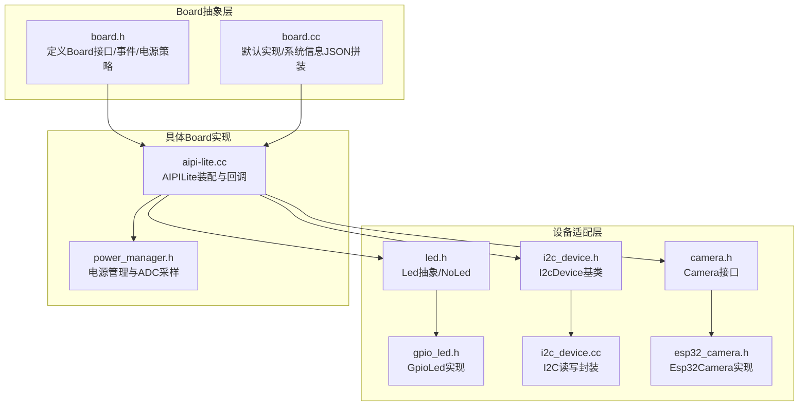
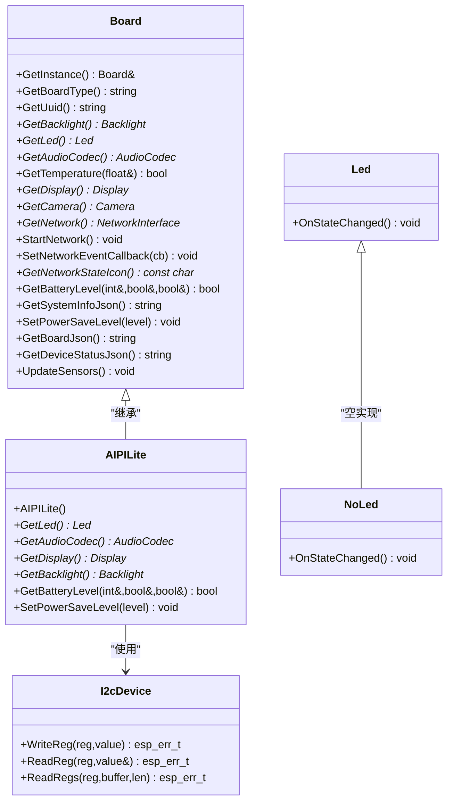
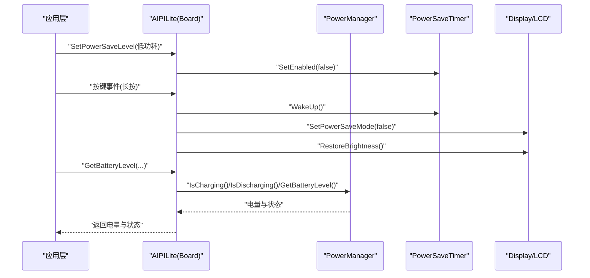
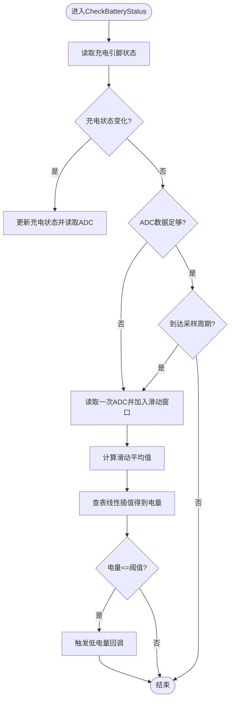
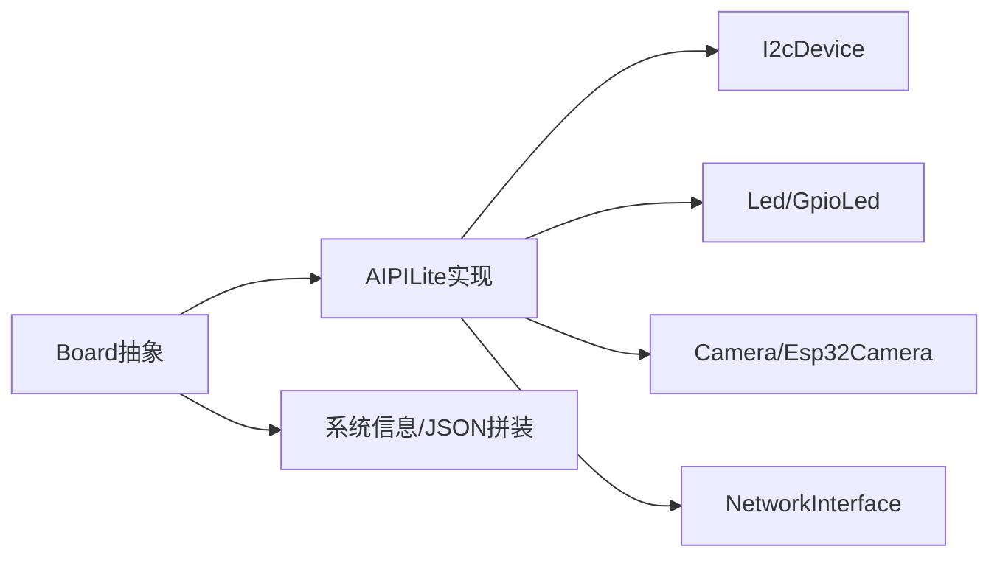

# 硬件抽象API

<cite>
**本文引用的文件**
- [main/boards/common/board.h](file://main/boards/common/board.h)
- [main/boards/common/board.cc](file://main/boards/common/board.cc)
- [main/boards/common/i2c_device.h](file://main/boards/common/i2c_device.h)
- [main/boards/common/i2c_device.cc](file://main/boards/common/i2c_device.cc)
- [main/led/led.h](file://main/led/led.h)
- [main/led/gpio_led.h](file://main/led/gpio_led.h)
- [main/boards/common/camera.h](file://main/boards/common/camera.h)
- [main/boards/common/esp32_camera.h](file://main/boards/common/esp32_camera.h)
- [main/boards/aipi-lite/aipi-lite.cc](file://main/boards/aipi-lite/aipi-lite.cc)
- [main/boards/aipi-lite/power_manager.h](file://main/boards/aipi-lite/power_manager.h)
</cite>

## 目录
1. [简介](#简介)
2. [项目结构](#项目结构)
3. [核心组件](#核心组件)
4. [架构总览](#架构总览)
5. [详细组件分析](#详细组件分析)
6. [依赖关系分析](#依赖关系分析)
7. [性能考虑](#性能考虑)
8. [故障排查指南](#故障排查指南)
9. [结论](#结论)
10. [附录：使用示例与最佳实践](#附录使用示例与最佳实践)

## 简介
本文件面向Board类及其派生类的硬件抽象层API，系统化梳理GPIO控制、I2C设备管理、电源管理、传感器读取、网络配置、外设控制等公共接口，并结合具体Board实现（如AIPILite）展示跨硬件平台的一致业务逻辑。文档同时给出设计模式、扩展方法与常见问题排查建议，帮助开发者在不同硬件平台上快速复用统一的业务代码。

## 项目结构
围绕硬件抽象层的关键目录与文件如下：
- Board抽象层：定义统一的Board接口、网络事件枚举、电源策略等
- 设备适配层：LED、I2C设备基类、摄像头接口与实现
- 具体Board实现：以AIPILite为例，展示如何在特定硬件上装配GPIO/I2C/显示/按键/电源管理等模块

图表来源
- [main/boards/common/board.h:49-86](file://main/boards/common/board.h#L49-L86)
- [main/boards/common/board.cc:15-178](file://main/boards/common/board.cc#L15-L178)
- [main/boards/common/i2c_device.h:6-16](file://main/boards/common/i2c_device.h#L6-L16)
- [main/boards/common/i2c_device.cc:8-38](file://main/boards/common/i2c_device.cc#L8-L38)
- [main/led/led.h:4-17](file://main/led/led.h#L4-L17)
- [main/led/gpio_led.h:13-47](file://main/led/gpio_led.h#L13-L47)
- [main/boards/common/camera.h:6-14](file://main/boards/common/camera.h#L6-L14)
- [main/boards/common/esp32_camera.h:22-44](file://main/boards/common/esp32_camera.h#L22-L44)
- [main/boards/aipi-lite/aipi-lite.cc:26-246](file://main/boards/aipi-lite/aipi-lite.cc#L26-L246)
- [main/boards/aipi-lite/power_manager.h:9-187](file://main/boards/aipi-lite/power_manager.h#L9-L187)

章节来源
- [main/boards/common/board.h:1-94](file://main/boards/common/board.h#L1-L94)
- [main/boards/common/board.cc:1-179](file://main/boards/common/board.cc#L1-L179)
- [main/boards/common/i2c_device.h:1-19](file://main/boards/common/i2c_device.h#L1-L19)
- [main/boards/common/i2c_device.cc:1-38](file://main/boards/common/i2c_device.cc#L1-L38)
- [main/led/led.h:1-18](file://main/led/led.h#L1-L18)
- [main/led/gpio_led.h:1-50](file://main/led/gpio_led.h#L1-L50)
- [main/boards/common/camera.h:1-17](file://main/boards/common/camera.h#L1-L17)
- [main/boards/common/esp32_camera.h:1-45](file://main/boards/common/esp32_camera.h#L1-L45)
- [main/boards/aipi-lite/aipi-lite.cc:1-247](file://main/boards/aipi-lite/aipi-lite.cc#L1-L247)
- [main/boards/aipi-lite/power_manager.h:1-188](file://main/boards/aipi-lite/power_manager.h#L1-L188)

## 核心组件
- Board抽象接口：提供设备类型查询、唯一ID、背光、LED、音频编解码、显示、摄像头、网络接口、网络启动、网络事件回调、系统信息JSON、电源策略设置、Board信息JSON、设备状态JSON、传感器更新等统一入口
- 设备适配接口：
  - Led：统一LED控制抽象，NoLed为空实现
  - I2cDevice：基于ESP-IDF I2C Master封装的寄存器读写工具
  - Camera：统一摄像头控制与解释调用接口，Esp32Camera为ESP32平台实现
- 具体Board实现：AIPILite通过组合电源管理、I2C、SPI、显示、按键等模块，实现一致的业务行为

章节来源
- [main/boards/common/board.h:49-86](file://main/boards/common/board.h#L49-L86)
- [main/boards/common/board.cc:15-178](file://main/boards/common/board.cc#L15-L178)
- [main/led/led.h:4-17](file://main/led/led.h#L4-L17)
- [main/boards/common/i2c_device.h:6-16](file://main/boards/common/i2c_device.h#L6-L16)
- [main/boards/common/esp32_camera.h:22-44](file://main/boards/common/esp32_camera.h#L22-L44)
- [main/boards/aipi-lite/aipi-lite.cc:26-246](file://main/boards/aipi-lite/aipi-lite.cc#L26-L246)

## 架构总览
Board作为工厂+单例的抽象层，通过create_board()与DECLARE_BOARD宏在各Board实现中注册；Board::GetInstance()返回全局唯一Board实例。具体Board实现负责装配GPIO/I2C/SPI/显示/按键/电源管理等子系统，并通过Board虚接口向上暴露统一能力。

图表来源
- [main/boards/common/board.h:49-86](file://main/boards/common/board.h#L49-L86)
- [main/boards/aipi-lite/aipi-lite.cc:26-246](file://main/boards/aipi-lite/aipi-lite.cc#L26-L246)
- [main/led/led.h:4-17](file://main/led/led.h#L4-L17)
- [main/boards/common/i2c_device.h:6-16](file://main/boards/common/i2c_device.h#L6-L16)

## 详细组件分析

### Board抽象层
- 单例与工厂：GetInstance()通过create_board()创建并缓存实例，避免重复构造
- 统一接口：GetBoardType/GetUuid/GetBacklight/GetLed/GetAudioCodec/GetDisplay/GetCamera/GetNetwork/StartNetwork/SetNetworkEventCallback/GetNetworkStateIcon/GetBatteryLevel/GetSystemInfoJson/SetPowerSaveLevel/GetBoardJson/GetDeviceStatusJson/UpdateSensors
- 默认实现：未覆盖的方法提供空实现或返回占位对象（如NoDisplay/NoLed），便于派生类按需覆盖

章节来源
- [main/boards/common/board.h:49-86](file://main/boards/common/board.h#L49-L86)
- [main/boards/common/board.cc:15-178](file://main/boards/common/board.cc#L15-L178)

### I2C设备基类 I2cDevice
- 功能：封装I2C从设备句柄创建、寄存器写入、单字节读取、多字节读取
- 接口要点：WriteReg/ReadReg/ReadRegs，内部使用ESP-IDF I2C Master传输API
- 注意事项：默认I2C速率100kHz，适用于大多数I2C设备；错误处理通过返回esp_err_t

章节来源
- [main/boards/common/i2c_device.h:6-16](file://main/boards/common/i2c_device.h#L6-L16)
- [main/boards/common/i2c_device.cc:8-38](file://main/boards/common/i2c_device.cc#L8-L38)

### LED抽象与GPIO LED实现
- Led抽象：OnStateChanged用于根据设备状态切换LED
- NoLed：空实现，用于无LED场景
- GpioLed：支持普通GPIO输出、LED Controller PWM、闪烁、呼吸灯等高级功能，内部使用互斥锁、FreeRTOS任务与定时器

章节来源
- [main/led/led.h:4-17](file://main/led/led.h#L4-L17)
- [main/led/gpio_led.h:13-47](file://main/led/gpio_led.h#L13-L47)

### 摄像头接口与实现
- Camera接口：Capture/Explain/SetHMirror/SetVFlip/SetSwapBytes/SetExplainUrl
- Esp32Camera：基于ESP32-camera驱动，支持JPEG编码、帧缓冲、线程化编码、可选字节交换

章节来源
- [main/boards/common/camera.h:6-14](file://main/boards/common/camera.h#L6-L14)
- [main/boards/common/esp32_camera.h:22-44](file://main/boards/common/esp32_camera.h#L22-L44)

### AIPILite：典型Board实现
- 组合模块：I2C总线、SPI总线、LCD显示、按键、电源管理、省电定时器、音频编解码
- 电源管理：PowerManager通过ADC与定时器周期采样电池电压，提供充电/放电状态与电量等级，并触发低电量回调
- 省电策略：PowerSaveTimer在无交互时自动进入睡眠模式，唤醒后恢复显示与背光
- 网络事件：通过Board网络接口与回调机制上报扫描/连接/断开等事件
- 外设控制：按键短按/长按触发不同行为（如进入配网模式、唤醒、关机）

图表来源
- [main/boards/aipi-lite/aipi-lite.cc:36-65](file://main/boards/aipi-lite/aipi-lite.cc#L36-L65)
- [main/boards/aipi-lite/aipi-lite.cc:225-243](file://main/boards/aipi-lite/aipi-lite.cc#L225-L243)
- [main/boards/aipi-lite/power_manager.h:115-187](file://main/boards/aipi-lite/power_manager.h#L115-L187)

章节来源
- [main/boards/aipi-lite/aipi-lite.cc:26-246](file://main/boards/aipi-lite/aipi-lite.cc#L26-L246)
- [main/boards/aipi-lite/power_manager.h:9-187](file://main/boards/aipi-lite/power_manager.h#L9-L187)

### 电源管理API详解
- 事件回调：OnChargingStatusChanged/OnLowBatteryStatusChanged
- 状态查询：IsCharging/IsDischarging/GetBatteryLevel
- 数据采集：定时器周期读取ADC，滑动窗口平均，查表线性插值计算电量百分比
- 低电量处理：当电量低于阈值时触发回调，可用于降低功耗或提示用户

图表来源
- [main/boards/aipi-lite/power_manager.h:27-112](file://main/boards/aipi-lite/power_manager.h#L27-L112)

章节来源
- [main/boards/aipi-lite/power_manager.h:9-187](file://main/boards/aipi-lite/power_manager.h#L9-L187)

### 网络配置API与事件处理
- 网络事件枚举：扫描中、连接中、已连接、断开、进入/退出WiFi配置模式、蜂窝模组检测/错误等
- 回调机制：SetNetworkEventCallback接收统一事件回调，Board实现负责在合适时机触发
- 启动流程：StartNetwork负责初始化网络栈并开始扫描/连接

章节来源
- [main/boards/common/board.h:17-33](file://main/boards/common/board.h#L17-L33)
- [main/boards/common/board.h:77-78](file://main/boards/common/board.h#L77-L78)

### 外设控制API
- GPIO控制：通过GpioLed等实现LED开关、亮度、闪烁、呼吸等
- I2C设备：通过I2cDevice封装的寄存器读写接口访问传感器/控制器
- 显示控制：Display/Backlight接口由Board实现提供，AIPILite中通过SPI/LCD驱动控制屏幕与背光
- 按键事件：通过Button库绑定短按/长按回调，Board实现中将其映射为业务动作

章节来源
- [main/led/gpio_led.h:13-47](file://main/led/gpio_led.h#L13-L47)
- [main/boards/common/i2c_device.h:6-16](file://main/boards/common/i2c_device.h#L6-L16)
- [main/boards/aipi-lite/aipi-lite.cc:98-132](file://main/boards/aipi-lite/aipi-lite.cc#L98-L132)
- [main/boards/aipi-lite/aipi-lite.cc:134-172](file://main/boards/aipi-lite/aipi-lite.cc#L134-L172)

## 依赖关系分析
- Board与具体实现：Board为抽象接口，AIPILite继承并实现具体装配
- 设备适配：Led/I2cDevice/Camera为通用适配层，被Board实现组合使用
- 外部依赖：ESP-IDF I2C/SPI/LCD/ADC/定时器/OTA/分区等组件

图表来源
- [main/boards/common/board.h:49-86](file://main/boards/common/board.h#L49-L86)
- [main/boards/aipi-lite/aipi-lite.cc:26-246](file://main/boards/aipi-lite/aipi-lite.cc#L26-L246)
- [main/boards/common/i2c_device.h:6-16](file://main/boards/common/i2c_device.h#L6-L16)
- [main/led/led.h:4-17](file://main/led/led.h#L4-L17)
- [main/boards/common/esp32_camera.h:22-44](file://main/boards/common/esp32_camera.h#L22-L44)

章节来源
- [main/boards/common/board.h:49-86](file://main/boards/common/board.h#L49-L86)
- [main/boards/aipi-lite/aipi-lite.cc:26-246](file://main/boards/aipi-lite/aipi-lite.cc#L26-L246)

## 性能考虑
- I2C速率：默认100kHz，兼顾兼容性；若设备支持更高频率，可在I2C初始化处调整
- ADC采样：滑动窗口与周期采样减少抖动并降低CPU占用
- 显示与背光：省电定时器在睡眠态关闭显示与背光，唤醒时恢复，显著降低功耗
- 线程化编码：Esp32Camera采用独立线程进行JPEG编码，避免阻塞主循环

## 故障排查指南
- 无法获取电量：确认ADC通道配置与电源管理引脚电平逻辑，检查定时器是否正常启动
- I2C读写失败：检查设备地址、时钟频率、上拉电阻与总线冲突
- 显示异常：核对SPI引脚配置、面板驱动参数与背光控制逻辑
- 网络事件不回调：确认SetNetworkEventCallback是否正确设置，网络栈是否成功初始化

章节来源
- [main/boards/aipi-lite/power_manager.h:125-153](file://main/boards/aipi-lite/power_manager.h#L125-L153)
- [main/boards/common/i2c_device.cc:8-38](file://main/boards/common/i2c_device.cc#L8-L38)
- [main/boards/aipi-lite/aipi-lite.cc:98-132](file://main/boards/aipi-lite/aipi-lite.cc#L98-L132)
- [main/boards/common/board.h:77-78](file://main/boards/common/board.h#L77-L78)

## 结论
Board抽象层提供了跨硬件平台的统一接口，结合I2cDevice、Led、Camera等适配层，使具体Board实现能够以一致的方式装配GPIO/I2C/SPI/显示/按键/电源管理等模块。通过事件回调与电源策略，系统实现了灵活的网络配置、外设控制与低功耗管理。开发者可基于Board接口快速扩展新的硬件平台，保持业务逻辑的稳定与可移植性。

## 附录：使用示例与最佳实践
- 在新硬件平台新增Board实现
  - 实现Board派生类，覆盖GetBoardType/GetAudioCodec/GetDisplay/GetBacklight/GetBatteryLevel/SetPowerSaveLevel等必要接口
  - 使用I2cDevice封装I2C传感器访问，使用GpioLed控制指示灯
  - 通过SetNetworkEventCallback注册网络事件回调，StartNetwork启动网络
- 示例参考路径
  - [AIPILite构造与装配:185-198](file://main/boards/aipi-lite/aipi-lite.cc#L185-L198)
  - [电源管理初始化与回调:36-45](file://main/boards/aipi-lite/aipi-lite.cc#L36-L45)
  - [省电定时器进入/退出/关机流程:47-65](file://main/boards/aipi-lite/aipi-lite.cc#L47-L65)
  - [I2C总线初始化:67-83](file://main/boards/aipi-lite/aipi-lite.cc#L67-L83)
  - [SPI/LCD显示初始化:85-132](file://main/boards/aipi-lite/aipi-lite.cc#L85-L132)
  - [按键事件绑定:134-172](file://main/boards/aipi-lite/aipi-lite.cc#L134-L172)
  - [LED与音频编解码接入:200-212](file://main/boards/aipi-lite/aipi-lite.cc#L200-L212)
  - [电量查询与省电联动:225-236](file://main/boards/aipi-lite/aipi-lite.cc#L225-L236)
  - [电源策略设置:238-243](file://main/boards/aipi-lite/aipi-lite.cc#L238-L243)
  - [I2C寄存器读写封装:22-38](file://main/boards/common/i2c_device.cc#L22-L38)
  - [LED控制接口:20-46](file://main/led/gpio_led.h#L20-L46)
  - [摄像头接口与实现:22-44](file://main/boards/common/esp32_camera.h#L22-L44)