# 设置管理API

<cite>
**本文档引用的文件**
- [settings.h](file://main/settings.h)
- [settings.cc](file://main/settings.cc)
- [system_info.h](file://main/system_info.h)
- [system_info.cc](file://main/system_info.cc)
- [dual_network_board.cc](file://main/boards/common/dual_network_board.cc)
- [board.cc](file://main/boards/common/board.cc)
- [reminder_manager.cc](file://main/reminder_manager.cc)
- [application.cc](file://main/application.cc)
</cite>

## 目录
1. [简介](#简介)
2. [项目结构](#项目结构)
3. [核心组件](#核心组件)
4. [架构概览](#架构概览)
5. [详细组件分析](#详细组件分析)
6. [依赖关系分析](#依赖关系分析)
7. [性能考虑](#性能考虑)
8. [故障排除指南](#故障排除指南)
9. [结论](#结论)
10. [附录](#附录)

## 简介

本文档详细介绍了ESP32 AI项目中的设置管理API，重点涵盖Settings类和SystemInfo类的设计与实现。Settings类提供了基于NVS（Non-Volatile Storage）的配置存储解决方案，支持字符串、整数和布尔值的读写操作，并具备默认值处理和持久化机制。SystemInfo类则负责系统信息的获取，包括闪存大小、内存状态、MAC地址、芯片型号等关键硬件信息。

这两个类构成了整个系统的配置管理基础设施，为应用程序提供了可靠的设置存储和系统信息查询能力。

## 项目结构

设置管理功能在项目中的组织结构如下：

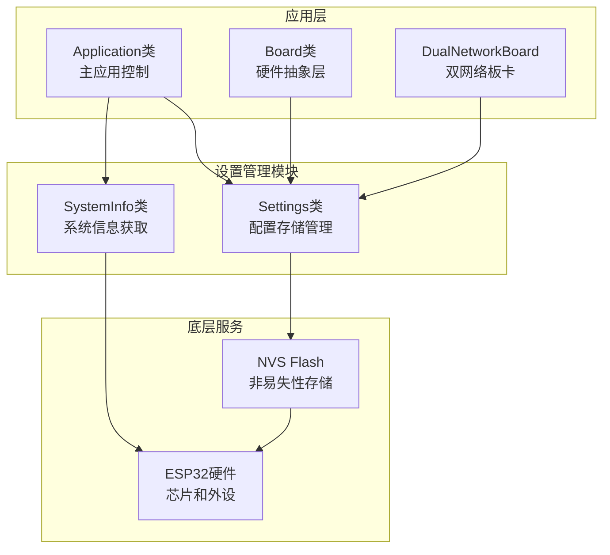

**图表来源**
- [settings.h:7-26](file://main/settings.h#L7-L26)
- [system_info.h:9-21](file://main/system_info.h#L9-L21)

**章节来源**
- [settings.h:1-29](file://main/settings.h#L1-L29)
- [system_info.h:1-24](file://main/system_info.h#L1-L24)

## 核心组件

### Settings类设计

Settings类采用RAII模式管理NVS句柄，提供类型安全的配置存储接口：

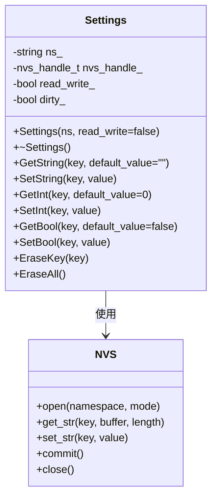

**图表来源**
- [settings.h:7-26](file://main/settings.h#L7-L26)
- [settings.cc:8-19](file://main/settings.cc#L8-L19)

### SystemInfo类功能

SystemInfo类提供静态方法获取系统关键信息：

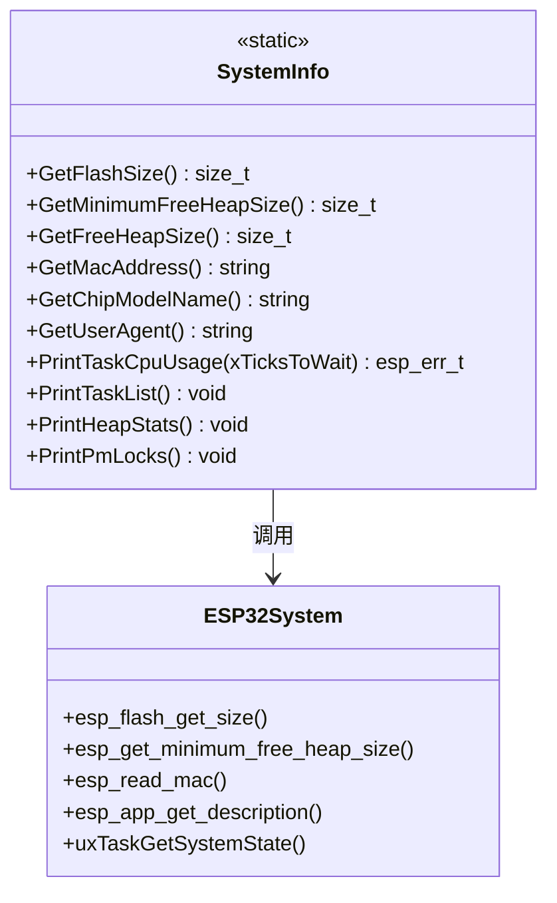

**图表来源**
- [system_info.h:9-21](file://main/system_info.h#L9-L21)
- [system_info.cc:18-55](file://main/system_info.cc#L18-L55)

**章节来源**
- [settings.cc:1-109](file://main/settings.cc#L1-L109)
- [system_info.cc:1-157](file://main/system_info.cc#L1-L157)

## 架构概览

设置管理API的整体架构体现了分层设计原则：

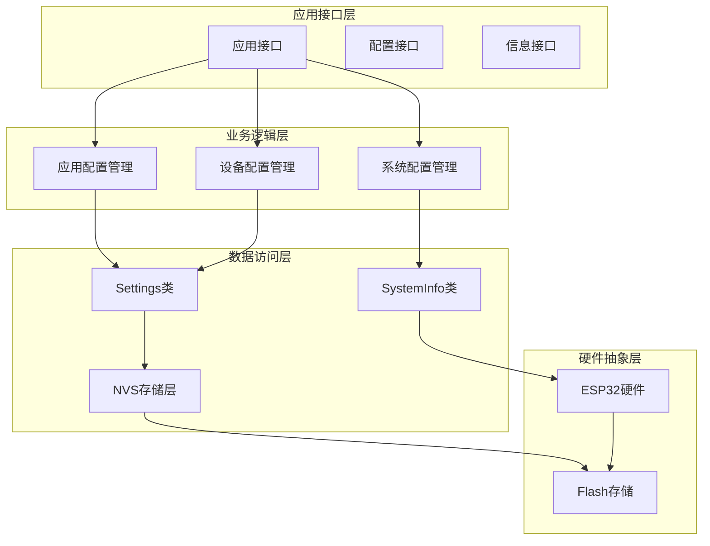

**图表来源**
- [settings.h:7-26](file://main/settings.h#L7-L26)
- [system_info.h:9-21](file://main/system_info.h#L9-L21)

## 详细组件分析

### Settings类详细分析

#### 数据存储机制

Settings类通过NVS实现配置数据的持久化存储，支持以下数据类型：

| 数据类型 | 存储方式 | 默认值处理 | 验证机制 |
|---------|---------|-----------|----------|
| 字符串 | nvs_set_str/nvs_get_str | 返回传入默认值 | 长度检查 |
| 整数 | nvs_set_i32/nvs_get_i32 | 返回传入默认值 | 类型匹配 |
| 布尔值 | nvs_set_u8/nvs_get_u8 | 返回传入默认值 | 0/1映射 |

#### 写入流程序列图

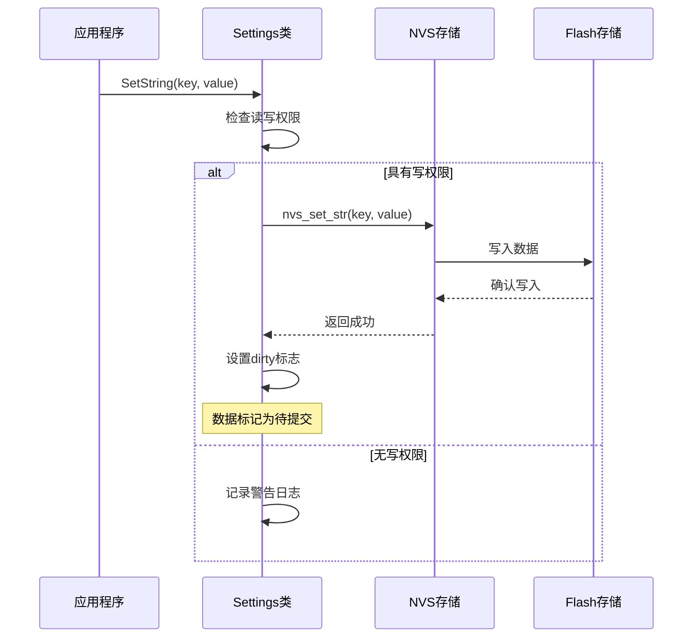

**图表来源**
- [settings.cc:40-47](file://main/settings.cc#L40-L47)

#### 错误处理机制

Settings类实现了完善的错误处理策略：

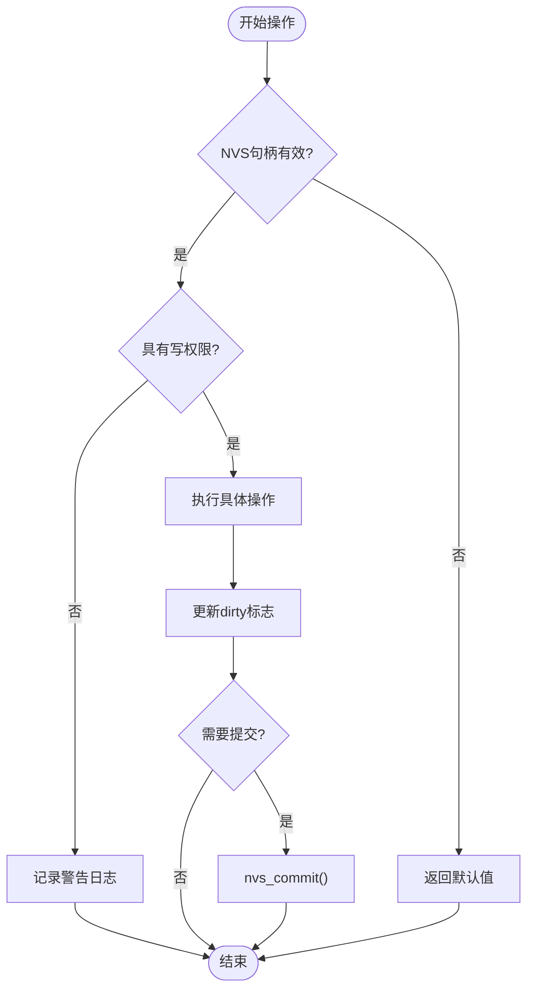

**图表来源**
- [settings.cc:21-38](file://main/settings.cc#L21-L38)
- [settings.cc:40-47](file://main/settings.cc#L40-L47)

**章节来源**
- [settings.cc:21-109](file://main/settings.cc#L21-L109)

### SystemInfo类详细分析

#### 系统信息获取流程

SystemInfo类提供多种系统信息获取方法：

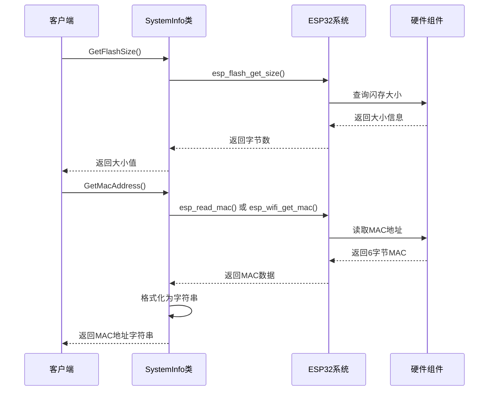

**图表来源**
- [system_info.cc:18-45](file://main/system_info.cc#L18-L45)

#### 性能监控功能

SystemInfo类还提供了任务CPU使用率分析功能：

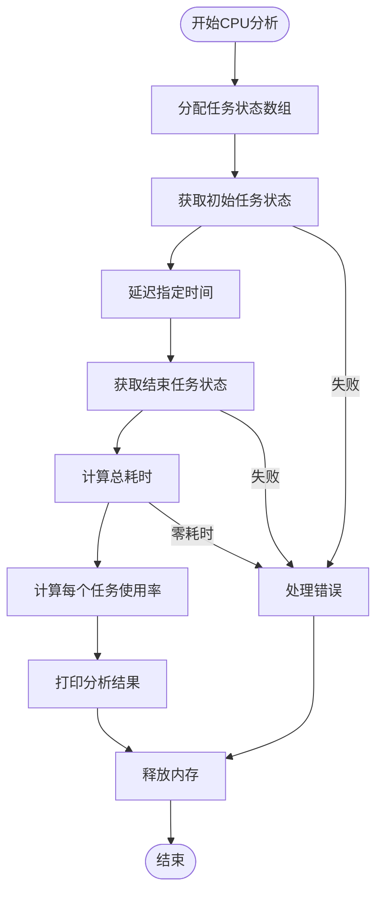

**图表来源**
- [system_info.cc:57-140](file://main/system_info.cc#L57-L140)

**章节来源**
- [system_info.cc:18-157](file://main/system_info.cc#L18-L157)

### 实际应用场景

#### 双网络板卡配置管理

DualNetworkBoard展示了Settings类在实际场景中的应用：

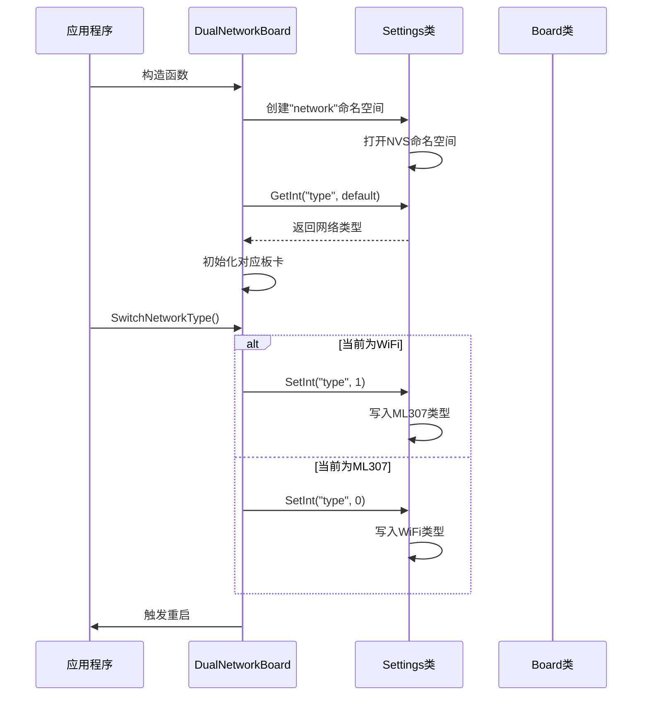

**图表来源**
- [dual_network_board.cc:16-33](file://main/boards/common/dual_network_board.cc#L16-L33)

**章节来源**
- [dual_network_board.cc:23-33](file://main/boards/common/dual_network_board.cc#L23-L33)

#### 应用程序集成示例

Application类展示了SystemInfo类的集成使用：

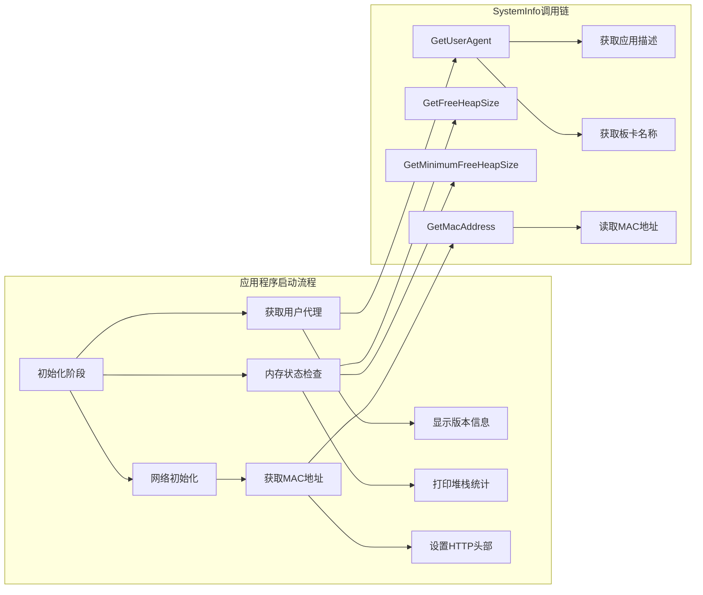

**图表来源**
- [application.cc:94-95](file://main/application.cc#L94-L95)
- [application.cc:295-342](file://main/application.cc#L295-L342)

**章节来源**
- [application.cc:94-95](file://main/application.cc#L94-L95)
- [application.cc:295-342](file://main/application.cc#L295-L342)

## 依赖关系分析

设置管理API的依赖关系体现了清晰的分层架构：

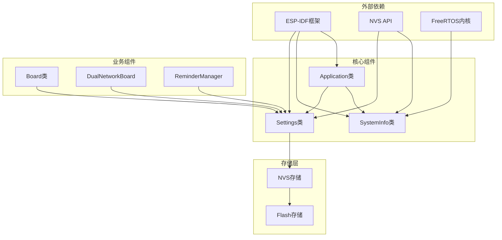

**图表来源**
- [settings.h:4-5](file://main/settings.h#L4-L5)
- [system_info.h:4-7](file://main/system_info.h#L4-L7)

**章节来源**
- [settings.h:1-29](file://main/settings.h#L1-L29)
- [system_info.h:1-24](file://main/system_info.h#L1-L24)

## 性能考虑

### 内存管理优化

Settings类采用了高效的内存管理模式：

- **惰性提交**：只有在数据修改后才标记为dirty状态
- **批量提交**：析构函数中统一处理NVS提交操作
- **缓冲区管理**：字符串读取时动态调整缓冲区大小

### 系统资源优化

SystemInfo类在资源使用方面考虑了以下因素：

- **按需查询**：只在需要时调用系统查询函数
- **内存池管理**：CPU使用率分析中动态分配和释放内存
- **日志级别控制**：通过ESP_LOG级别控制调试输出

## 故障排除指南

### 常见问题及解决方案

#### NVS操作失败

当NVS操作失败时，Settings类会返回默认值而不是抛出异常：

```cpp
// 示例：安全的配置读取
Settings settings("config", true);
int timeout = settings.GetInt("timeout", 30000); // 默认30秒
if (timeout <= 0) {
    // 处理无效配置值
    timeout = 30000;
}
```

#### 权限不足问题

当尝试写入只读命名空间时，系统会记录警告日志：

```cpp
// 检查写权限的最佳实践
Settings readOnlySettings("system");
int value = readOnlySettings.GetInt("critical_setting", 0);

Settings writeSettings("system", true);
if (writeSettings.SetInt("critical_setting", newValue)) {
    // 写入成功
} else {
    // 处理写入失败
}
```

#### 内存不足错误

SystemInfo类的CPU分析功能可能遇到内存不足的情况：

```cpp
// 处理内存分配失败
esp_err_t result = SystemInfo::PrintTaskCpuUsage(pdMS_TO_TICKS(1000));
if (result == ESP_ERR_NO_MEM) {
    ESP_LOGE(TAG, "内存不足，无法进行CPU分析");
    // 降级到基本的内存统计
    SystemInfo::PrintHeapStats();
}
```

**章节来源**
- [settings.cc:44-46](file://main/settings.cc#L44-L46)
- [settings.cc:97-99](file://main/settings.cc#L97-L99)
- [system_info.cc:68-77](file://main/system_info.cc#L68-L77)

## 结论

Settings类和SystemInfo类共同构成了ESP32 AI项目的设置管理基础设施，提供了：

1. **可靠的数据持久化**：通过NVS实现配置数据的安全存储
2. **类型安全的接口**：提供字符串、整数、布尔值的类型安全操作
3. **完善的错误处理**：优雅地处理各种异常情况
4. **丰富的系统信息**：全面的硬件和系统状态查询能力
5. **高性能的实现**：优化的内存管理和资源使用

这些组件为应用程序提供了坚实的配置管理基础，支持从简单的键值对存储到复杂的系统状态监控等各种应用场景。

## 附录

### API参考表

#### Settings类公共接口

| 方法名 | 参数 | 返回值 | 描述 |
|--------|------|--------|------|
| GetString | key, default_value | string | 获取字符串配置值 |
| SetString | key, value | void | 设置字符串配置值 |
| GetInt | key, default_value | int32_t | 获取整数配置值 |
| SetInt | key, value | void | 设置整数配置值 |
| GetBool | key, default_value | bool | 获取布尔配置值 |
| SetBool | key, value | void | 设置布尔配置值 |
| EraseKey | key | void | 删除指定键 |
| EraseAll |  | void | 清空所有配置 |

#### SystemInfo类公共接口

| 方法名 | 参数 | 返回值 | 描述 |
|--------|------|--------|------|
| GetFlashSize |  | size_t | 获取闪存大小 |
| GetMinimumFreeHeapSize |  | size_t | 获取最小可用堆大小 |
| GetFreeHeapSize |  | size_t | 获取当前可用堆大小 |
| GetMacAddress |  | string | 获取MAC地址 |
| GetChipModelName |  | string | 获取芯片型号 |
| GetUserAgent |  | string | 获取用户代理字符串 |
| PrintTaskCpuUsage | xTicksToWait | esp_err_t | 打印任务CPU使用率 |
| PrintTaskList |  | void | 打印任务列表 |
| PrintHeapStats |  | void | 打印堆栈统计 |
| PrintPmLocks |  | void | 打印电源管理锁信息 |

### 扩展指南

要扩展自定义配置项，可以按照以下步骤进行：

1. **定义配置键名**：选择有意义的键名并避免冲突
2. **设置默认值**：为新配置项提供合理的默认值
3. **添加读写方法**：根据数据类型选择合适的读写方法
4. **实现验证逻辑**：添加必要的数据验证和边界检查
5. **测试配置持久化**：验证配置在重启后的保持性