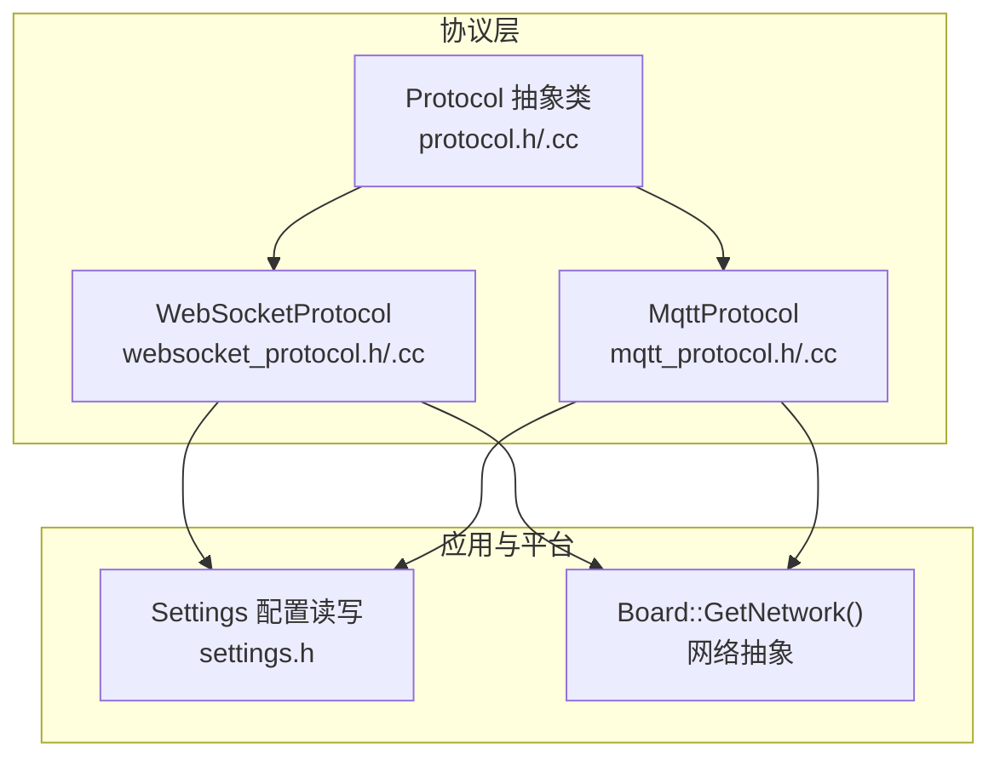
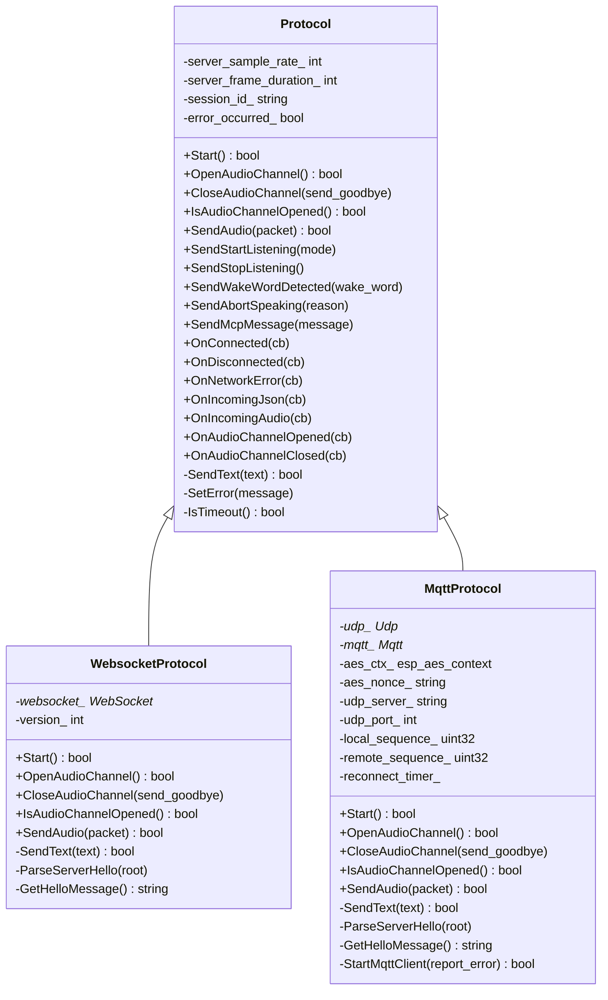
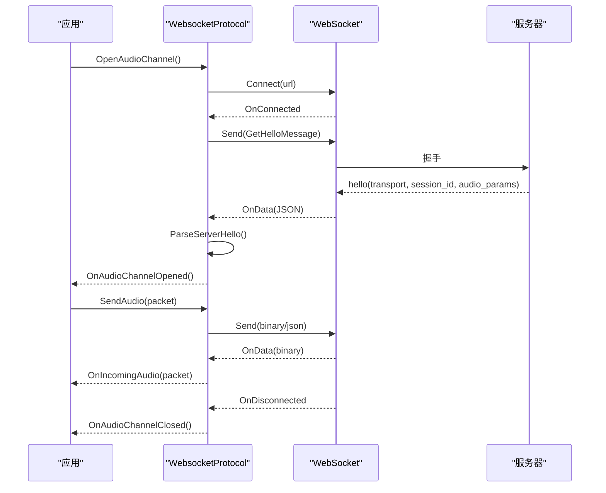
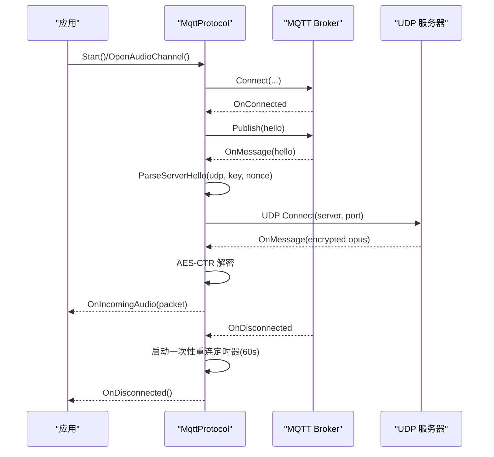
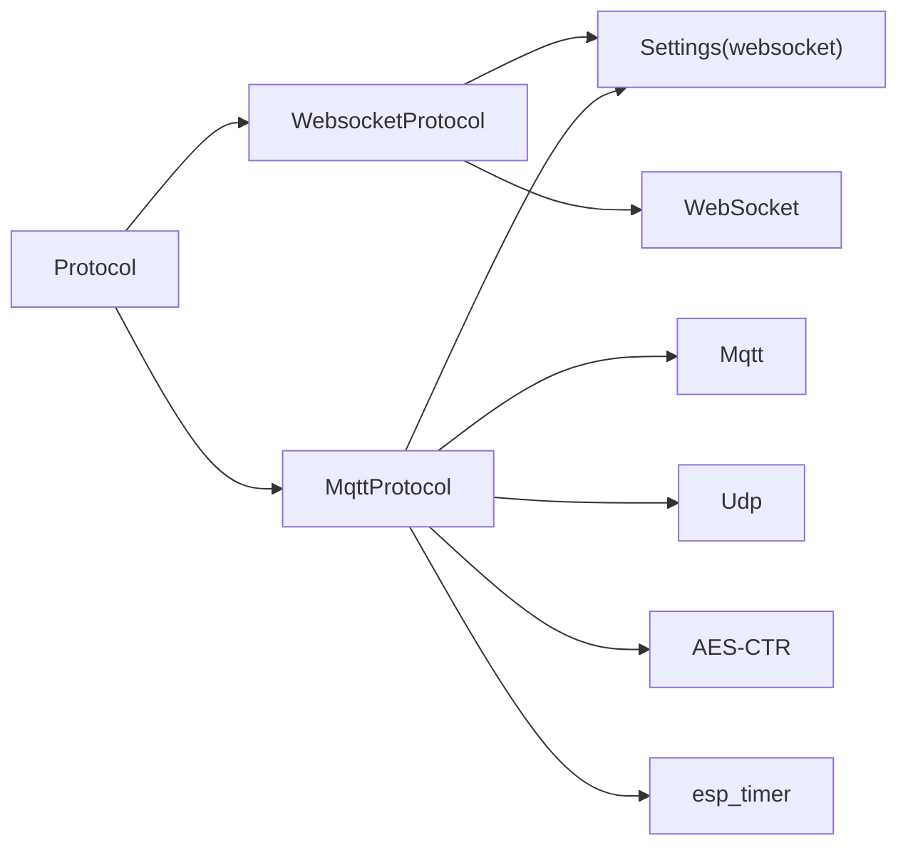

# 通信协议API

<cite>
**本文引用的文件**   
- [protocol.h](file://main/protocols/protocol.h)
- [protocol.cc](file://main/protocols/protocol.cc)
- [websocket_protocol.h](file://main/protocols/websocket_protocol.h)
- [websocket_protocol.cc](file://main/protocols/websocket_protocol.cc)
- [mqtt_protocol.h](file://main/protocols/mqtt_protocol.h)
- [mqtt_protocol.cc](file://main/protocols/mqtt_protocol.cc)
- [websocket.md](file://docs/websocket.md)
- [mqtt-udp.md](file://docs/mqtt-udp.md)
- [settings.h](file://main/settings.h)
</cite>

## 目录
1. [简介](#简介)
2. [项目结构](#项目结构)
3. [核心组件](#核心组件)
4. [架构总览](#架构总览)
5. [详细组件分析](#详细组件分析)
6. [依赖关系分析](#依赖关系分析)
7. [性能考量](#性能考量)
8. [故障排查指南](#故障排查指南)
9. [结论](#结论)
10. [附录](#附录)

## 简介
本文件面向开发者与集成工程师，系统化梳理 Protocol 抽象类及其子类 WebSocketProtocol 与 MqttProtocol 的通信协议 API。内容覆盖：
- 协议初始化、连接建立与数据传输方法
- 异步回调机制与错误处理模式
- 消息格式、事件类型与状态管理
- 协议切换与重连机制
- 网络状态监控与故障恢复接口
- 实际使用场景与配置示例路径

## 项目结构
协议相关代码位于 main/protocols 目录，配套文档位于 docs 目录，配置读写通过 Settings 类实现。

**图表来源**
- [protocol.h:44-95](file://main/protocols/protocol.h#L44-L95)
- [websocket_protocol.h:13-32](file://main/protocols/websocket_protocol.h#L13-L32)
- [mqtt_protocol.h:26-62](file://main/protocols/mqtt_protocol.h#L26-L62)
- [settings.h:7-26](file://main/settings.h#L7-L26)

**章节来源**
- [protocol.h:1-99](file://main/protocols/protocol.h#L1-L99)
- [websocket_protocol.h:1-35](file://main/protocols/websocket_protocol.h#L1-L35)
- [mqtt_protocol.h:1-66](file://main/protocols/mqtt_protocol.h#L1-L66)
- [settings.h:1-29](file://main/settings.h#L1-L29)

## 核心组件
- Protocol 抽象类：定义统一的协议接口、回调注册、通用消息发送方法与超时检测。
- WebSocketProtocol：基于 WebSocket 的全双工通道，支持二进制音频帧与 JSON 控制消息。
- MqttProtocol：基于 MQTT 的控制通道 + UDP 的音频通道，支持 AES-CTR 加密与序列号防护。

关键职责与接口要点：
- 会话与参数：session_id、server_sample_rate、server_frame_duration
- 回调注册：OnConnected、OnDisconnected、OnNetworkError、OnIncomingJson、OnIncomingAudio、OnAudioChannelOpened、OnAudioChannelClosed
- 音频通道：OpenAudioChannel、CloseAudioChannel、IsAudioChannelOpened、SendAudio
- 业务消息：SendStartListening、SendStopListening、SendWakeWordDetected、SendAbortSpeaking、SendMcpMessage
- 超时与错误：IsTimeout、SetError

**章节来源**
- [protocol.h:44-95](file://main/protocols/protocol.h#L44-L95)
- [protocol.cc:7-91](file://main/protocols/protocol.cc#L7-L91)

## 架构总览
WebSocket 与 MQTT 协议均继承自 Protocol，分别通过不同的网络栈与消息模型实现统一的音频与控制交互。

**图表来源**
- [protocol.h:44-95](file://main/protocols/protocol.h#L44-L95)
- [websocket_protocol.h:13-32](file://main/protocols/websocket_protocol.h#L13-L32)
- [mqtt_protocol.h:26-62](file://main/protocols/mqtt_protocol.h#L26-L62)

## 详细组件分析

### Protocol 抽象类
- 作用：统一协议行为契约，提供通用消息构造与回调框架。
- 重要点：
  - 会话参数 server_sample_rate、server_frame_duration、session_id 由子类在握手后填充。
  - SendStartListening/SendStopListening/SendWakeWordDetected/SendAbortSpeaking/SendMcpMessage 封装常用业务消息。
  - IsTimeout 基于 steady_clock 计算最后收包时间，超时阈值默认 120 秒。
  - SetError 触发 OnNetworkError 回调，便于上层统一处理。

**章节来源**
- [protocol.h:44-95](file://main/protocols/protocol.h#L44-L95)
- [protocol.cc:35-91](file://main/protocols/protocol.cc#L35-L91)

### WebSocketProtocol
- 初始化与连接
  - Start：按需建立连接（音频通道开启时才连接）。
  - OpenAudioChannel：读取配置（url、token、version），设置 Authorization、Protocol-Version、Device-Id、Client-Id 请求头，握手发送 hello，等待服务器 hello，设置 session_id 与音频参数。
  - CloseAudioChannel：释放 WebSocket 资源，触发 OnAudioChannelClosed。
- 数据传输
  - SendAudio：根据 version（1/2/3）选择二进制协议或直接发送 Opus。
  - SendText：发送 JSON 控制消息。
  - OnData 回调：二进制帧解析为 AudioStreamPacket，文本帧解析 JSON 并分派到 OnIncomingJson 或 ParseServerHello。
- 状态与超时
  - IsAudioChannelOpened：连接中且未超时。
  - 超时日志与错误上报。

**图表来源**
- [websocket_protocol.cc:83-201](file://main/protocols/websocket_protocol.cc#L83-L201)
- [websocket_protocol.cc:112-176](file://main/protocols/websocket_protocol.cc#L112-L176)
- [websocket_protocol.cc:203-254](file://main/protocols/websocket_protocol.cc#L203-L254)

**章节来源**
- [websocket_protocol.h:13-32](file://main/protocols/websocket_protocol.h#L13-L32)
- [websocket_protocol.cc:15-255](file://main/protocols/websocket_protocol.cc#L15-L255)
- [websocket.md:7-80](file://docs/websocket.md#L7-L80)

### MqttProtocol
- 初始化与连接
  - Start：启动 MQTT 客户端（内部调用 StartMqttClient）。
  - StartMqttClient：读取 endpoint、client_id、username、password、keepalive、publish_topic，设置 OnConnected/OnDisconnected/OnMessage，建立连接。
  - 断线自动重连：使用 esp_timer 定时器，每 60 秒尝试一次，仅在设备空闲状态下触发。
- 音频通道
  - OpenAudioChannel：发送 hello，等待服务器 hello，解析 UDP 服务器、端口、密钥与 nonce，初始化 AES-CTR，创建 UDP 并注册 OnMessage，建立 UDP 连接。
  - SendAudio：使用 AES-CTR 加密，按固定包头结构发送，包含 type、flags、payload_len、ssrc、timestamp、sequence。
  - CloseAudioChannel：可选择发送 goodbye，避免 ping-pong；触发 OnAudioChannelClosed。
- 状态与超时
  - IsAudioChannelOpened：UDP 存在且未超时。
  - 超时检测与错误上报。

**图表来源**
- [mqtt_protocol.cc:55-152](file://main/protocols/mqtt_protocol.cc#L55-L152)
- [mqtt_protocol.cc:215-295](file://main/protocols/mqtt_protocol.cc#L215-L295)
- [mqtt_protocol.cc:166-190](file://main/protocols/mqtt_protocol.cc#L166-L190)
- [mqtt-udp.md:22-57](file://docs/mqtt-udp.md#L22-L57)

**章节来源**
- [mqtt_protocol.h:26-62](file://main/protocols/mqtt_protocol.h#L26-L62)
- [mqtt_protocol.cc:13-390](file://main/protocols/mqtt_protocol.cc#L13-L390)
- [mqtt-udp.md:1-393](file://docs/mqtt-udp.md#L1-L393)

## 依赖关系分析
- 继承关系：WebSocketProtocol、MqttProtocol 均继承自 Protocol，统一回调与消息接口。
- 外设与网络：通过 Board::GetNetwork() 获取 WebSocket、Mqtt、Udp 等网络组件实例。
- 配置来源：Settings("websocket"/"mqtt", read_only) 读取协议配置。
- 加密与定时：MqttProtocol 使用 esp_aes_context 与 esp_timer。

**图表来源**
- [protocol.h:44-95](file://main/protocols/protocol.h#L44-L95)
- [websocket_protocol.cc:84-109](file://main/protocols/websocket_protocol.cc#L84-L109)
- [mqtt_protocol.cc:65-83](file://main/protocols/mqtt_protocol.cc#L65-L83)
- [mqtt_protocol.cc:166-190](file://main/protocols/mqtt_protocol.cc#L166-L190)

**章节来源**
- [protocol.h:44-95](file://main/protocols/protocol.h#L44-L95)
- [websocket_protocol.cc:83-110](file://main/protocols/websocket_protocol.cc#L83-L110)
- [mqtt_protocol.cc:64-83](file://main/protocols/mqtt_protocol.cc#L64-L83)

## 性能考量
- WebSocket
  - 二进制帧直接承载 Opus，版本 2/3 增加元数据，适合服务端 AEC。
  - 事件组等待服务器 hello，超时约 10 秒。
- MQTT+UDP
  - 控制通道高可靠，音频通道高实时；AES-CTR 加密带来 CPU 开销。
  - 序列号与时间戳用于防重放与乱序，提升鲁棒性。
  - 断线自动重连，避免长时间无响应。

[本节为通用性能讨论，不直接分析具体文件]

## 故障排查指南
- 连接失败
  - WebSocket：Connect 返回失败或等待 hello 超时，触发 OnNetworkError。
  - MQTT：Connect 失败或 OnDisconnected 触发，启动 60 秒重连定时器。
- 服务器断开
  - WebSocket：OnDisconnected 触发，回调 OnAudioChannelClosed。
  - MQTT：OnDisconnected 触发，清理资源并等待重连。
- 超时
  - 基类 IsTimeout 基于 last_incoming_time_ 计算，超过 120 秒视为超时。
- 加密/解密失败
  - MQTT 发送/接收 AES 失败时记录错误并返回失败。
- 配置问题
  - 未设置 endpoint/url 或 token 不合法，导致握手失败。

**章节来源**
- [websocket_protocol.cc:175-194](file://main/protocols/websocket_protocol.cc#L175-L194)
- [websocket_protocol.cc:168-173](file://main/protocols/websocket_protocol.cc#L168-L173)
- [mqtt_protocol.cc:144-148](file://main/protocols/mqtt_protocol.cc#L144-L148)
- [mqtt_protocol.cc:85-98](file://main/protocols/mqtt_protocol.cc#L85-L98)
- [protocol.cc:81-91](file://main/protocols/protocol.cc#L81-L91)

## 结论
- Protocol 抽象类提供了统一的回调与消息接口，屏蔽底层差异。
- WebSocketProtocol 适合简单场景与防火墙友好型部署。
- MqttProtocol 适合高实时性与强安全需求的混合通道方案。
- 两者均提供完善的错误处理、超时检测与状态管理，便于构建健壮的语音交互系统。

[本节为总结性内容，不直接分析具体文件]

## 附录

### 协议公共接口与回调
- 回调注册
  - OnConnected、OnDisconnected、OnNetworkError、OnIncomingJson、OnIncomingAudio、OnAudioChannelOpened、OnAudioChannelClosed
- 业务消息
  - SendStartListening(ListeningMode)
  - SendStopListening()
  - SendWakeWordDetected(string)
  - SendAbortSpeaking(AbortReason)
  - SendMcpMessage(string)
- 音频通道
  - OpenAudioChannel()、CloseAudioChannel(bool)、IsAudioChannelOpened()、SendAudio(unique_ptr<AudioStreamPacket>)

**章节来源**
- [protocol.h:58-76](file://main/protocols/protocol.h#L58-L76)
- [protocol.h:66-75](file://main/protocols/protocol.h#L66-L75)

### WebSocket 配置参数
- 配置命名空间："websocket"
- 关键键值
  - url：服务器地址
  - token：访问令牌（可为空，内部自动补 "Bearer "）
  - version：二进制协议版本（1/2/3）

**章节来源**
- [websocket_protocol.cc:84-109](file://main/protocols/websocket_protocol.cc#L84-L109)
- [websocket.md:82-91](file://docs/websocket.md#L82-L91)

### MQTT 配置参数
- 配置命名空间："mqtt"
- 关键键值
  - endpoint：服务器地址[:端口]
  - client_id：客户端标识
  - username/password：认证凭据
  - keepalive：心跳间隔（秒，默认 240）
  - publish_topic：发布主题

**章节来源**
- [mqtt_protocol.cc:65-71](file://main/protocols/mqtt_protocol.cc#L65-L71)
- [mqtt-udp.md:259-277](file://docs/mqtt-udp.md#L259-L277)

### 消息格式与事件类型
- WebSocket
  - hello：设备端→服务器，携带 features、transport、audio_params；服务器端→设备端，携带 session_id、audio_params。
  - listen：开始/停止/唤醒检测上报。
  - abort：中止说话或通道。
  - mcp：JSON-RPC 2.0 载荷。
- MQTT
  - hello/goodbye：通道建立与关闭。
  - stt/tts/llm/mcp/system/custom：控制与状态消息。
- 二进制协议
  - WebSocket：BinaryProtocol2/BinaryProtocol3（含版本、类型、时间戳、负载大小）。
  - MQTT：固定包头 + AES-CTR 加密的 Opus 负载。

**章节来源**
- [websocket.md:128-293](file://docs/websocket.md#L128-L293)
- [websocket_protocol.cc:112-166](file://main/protocols/websocket_protocol.cc#L112-L166)
- [websocket_protocol.cc:33-57](file://main/protocols/websocket_protocol.cc#L33-L57)
- [mqtt_protocol.cc:243-287](file://main/protocols/mqtt_protocol.cc#L243-L287)
- [mqtt-udp.md:186-223](file://docs/mqtt-udp.md#L186-L223)

### 状态管理与切换
- WebSocket
  - 空闲 → 连接中 → 监听中 → 说话中 → 空闲
  - 支持自动/手动/实时模式
- MQTT
  - 断开 → 重连中 → 已连接 → 申请通道 → 通道已建立 → 音频传输 → 关闭通道
- 超时与错误
  - 基类统一超时检测；子类在连接失败、断线、解密失败等场景触发错误回调

**章节来源**
- [websocket.md:308-366](file://docs/websocket.md#L308-L366)
- [mqtt-udp.md:226-256](file://docs/mqtt-udp.md#L226-L256)
- [protocol.cc:81-91](file://main/protocols/protocol.cc#L81-L91)

### 实际使用场景与配置示例路径
- WebSocket
  - 初始化与连接：[websocket_protocol.cc:83-201](file://main/protocols/websocket_protocol.cc#L83-L201)
  - 发送音频与控制消息：[websocket_protocol.cc:28-72](file://main/protocols/websocket_protocol.cc#L28-L72)
  - hello 消息结构与字段说明：[websocket.md:132-152](file://docs/websocket.md#L132-L152)
- MQTT
  - 启动与重连：[mqtt_protocol.cc:55-152](file://main/protocols/mqtt_protocol.cc#L55-L152)
  - 音频通道建立与加密发送：[mqtt_protocol.cc:215-295](file://main/protocols/mqtt_protocol.cc#L215-L295)
  - UDP 包结构与 AES-CTR：[mqtt-udp.md:186-223](file://docs/mqtt-udp.md#L186-L223)

**章节来源**
- [websocket_protocol.cc:28-201](file://main/protocols/websocket_protocol.cc#L28-L201)
- [mqtt_protocol.cc:55-295](file://main/protocols/mqtt_protocol.cc#L55-L295)
- [websocket.md:132-152](file://docs/websocket.md#L132-L152)
- [mqtt-udp.md:186-223](file://docs/mqtt-udp.md#L186-L223)