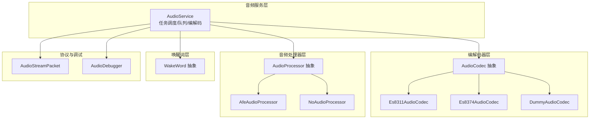
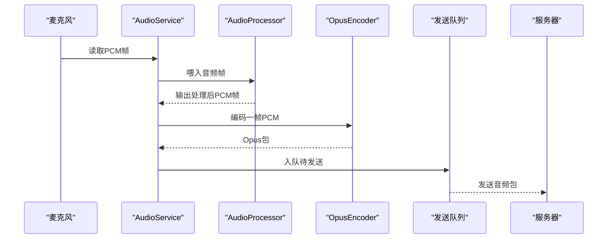
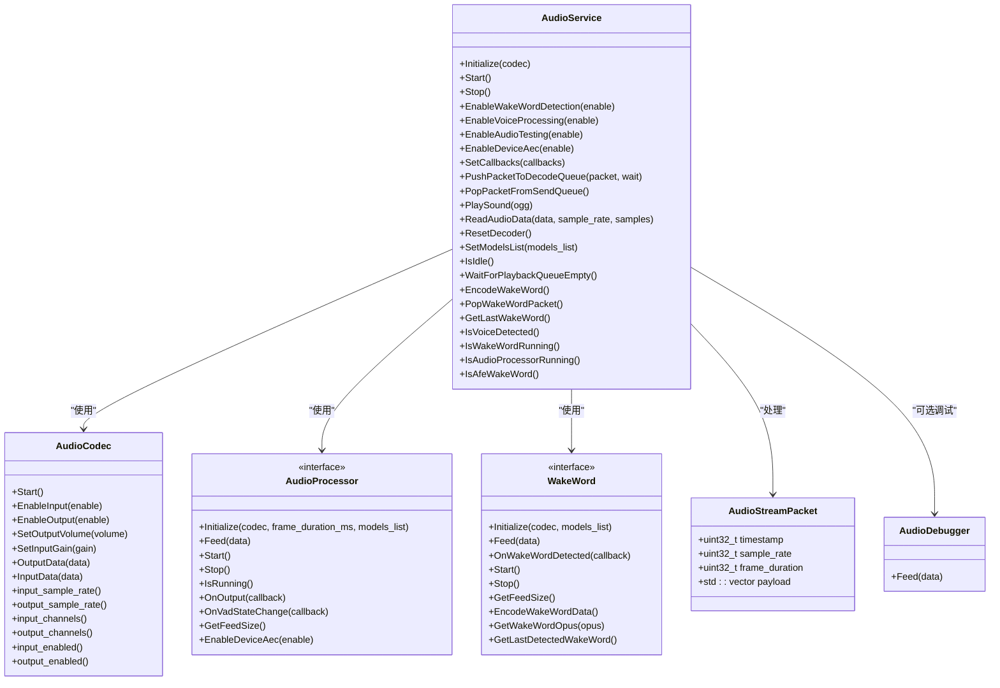
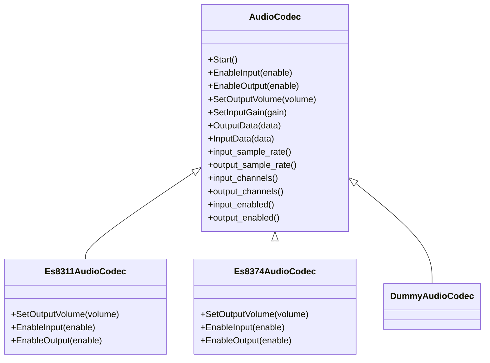
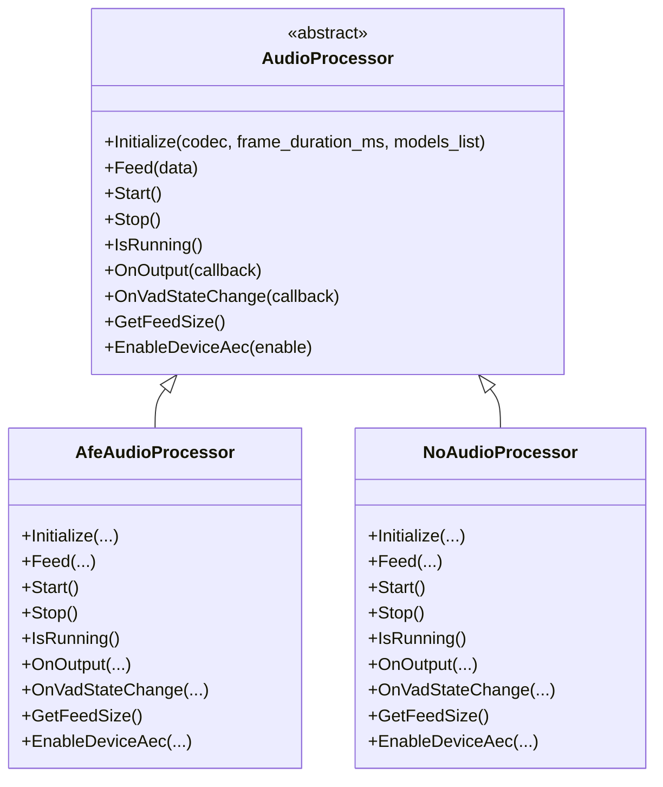
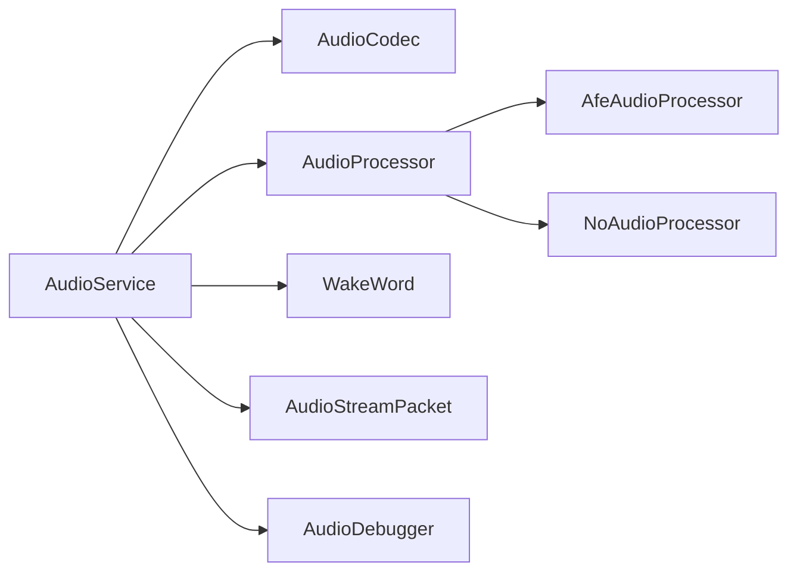
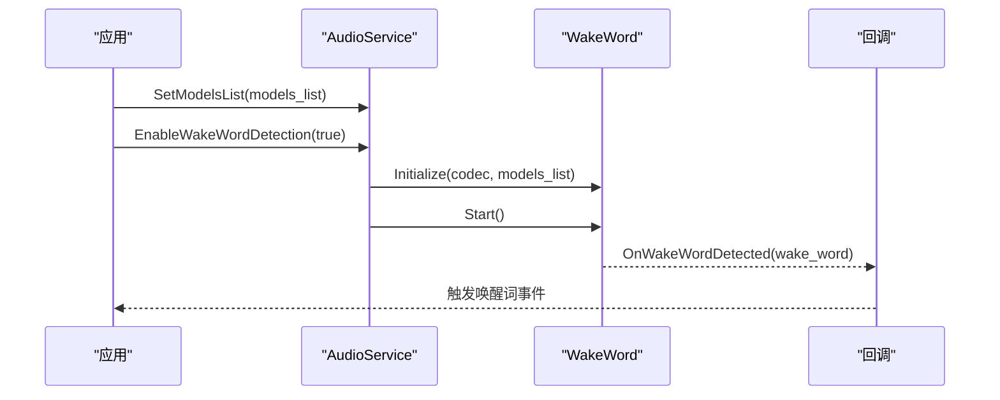
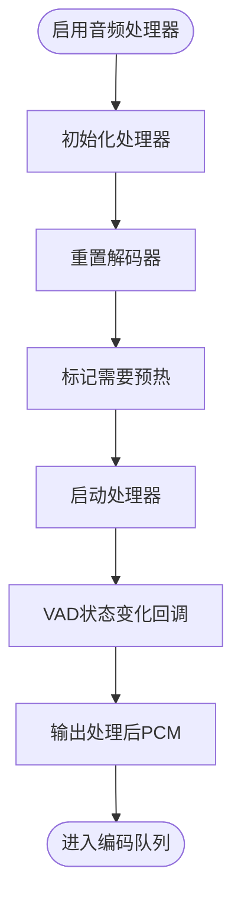
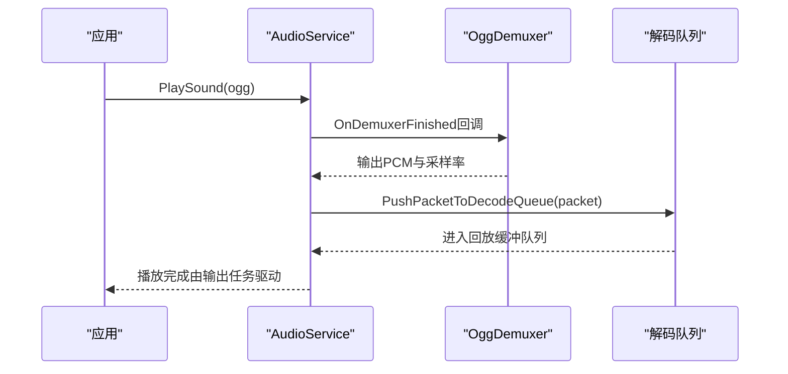

# 音频服务API

<cite>
**本文引用的文件**
- [audio_service.h](file://main/audio/audio_service.h)
- [audio_service.cc](file://main/audio/audio_service.cc)
- [audio_codec.h](file://main/audio/audio_codec.h)
- [audio_codec.cc](file://main/audio/audio_codec.cc)
- [audio_processor.h](file://main/audio/audio_processor.h)
- [afe_audio_processor.h](file://main/audio/processors/afe_audio_processor.h)
- [no_audio_processor.h](file://main/audio/processors/no_audio_processor.h)
- [audio_debugger.h](file://main/audio/processors/audio_debugger.h)
- [wake_word.h](file://main/audio/wake_word.h)
- [protocol.h](file://main/protocols/protocol.h)
- [es8311_audio_codec.h](file://main/audio/codecs/es8311_audio_codec.h)
- [es8374_audio_codec.h](file://main/audio/codecs/es8374_audio_codec.h)
- [dummy_audio_codec.h](file://main/audio/codecs/dummy_audio_codec.h)
</cite>

## 目录
1. [简介](#简介)
2. [项目结构](#项目结构)
3. [核心组件](#核心组件)
4. [架构总览](#架构总览)
5. [详细组件分析](#详细组件分析)
6. [依赖关系分析](#依赖关系分析)
7. [性能考量](#性能考量)
8. [故障排查指南](#故障排查指南)
9. [结论](#结论)
10. [附录](#附录)

## 简介
本文件为 AudioService 类的完整API文档，覆盖音频录制、播放、编解码与处理全流程。重点说明以下方面：
- 音频流管理API：音频数据包处理、发送队列与回放队列、测试队列
- VAD 检测与噪声抑制：通过音频处理器回调上报语音活动状态
- 音频格式转换与采样率配置：输入/输出重采样、帧时长与帧大小
- 音频设备控制：输入/输出使能、音量与增益设置
- 异步处理与回调：编码完成、唤醒词检测、VAD状态变化等
- 错误处理与异常路径：编解码失败、队列满、资源初始化失败
- 实际使用示例：典型场景下的调用流程与注意事项

## 项目结构
围绕音频子系统的关键文件组织如下：
- 音频服务：AudioService（初始化、启动/停止、任务调度、编解码、队列管理）
- 编解码器抽象：AudioCodec 及多个具体实现（如 ES8311、ES8374、Dummy）
- 音频处理器抽象：AudioProcessor 及其实现（AFE、无处理）
- 唤醒词接口：WakeWord 抽象接口
- 协议与数据包：AudioStreamPacket 定义
- 调试工具：AudioDebugger（UDP调试）

图表来源
- [audio_service.h:106-196](file://main/audio/audio_service.h#L106-L196)
- [audio_codec.h:17-62](file://main/audio/audio_codec.h#L17-L62)
- [audio_processor.h:11-27](file://main/audio/audio_processor.h#L11-L27)
- [wake_word.h:11-27](file://main/audio/wake_word.h#L11-L27)
- [protocol.h:9-20](file://main/protocols/protocol.h#L9-L20)
- [es8311_audio_codec.h:13-42](file://main/audio/codecs/es8311_audio_codec.h#L13-L42)
- [es8374_audio_codec.h:13-41](file://main/audio/codecs/es8374_audio_codec.h#L13-L41)
- [dummy_audio_codec.h:6-16](file://main/audio/codecs/dummy_audio_codec.h#L6-L16)
- [afe_audio_processor.h:17-48](file://main/audio/processors/afe_audio_processor.h#L17-L48)
- [no_audio_processor.h:11-35](file://main/audio/processors/no_audio_processor.h#L11-L35)
- [audio_debugger.h:10-22](file://main/audio/processors/audio_debugger.h#L10-L22)

章节来源
- [audio_service.h:1-196](file://main/audio/audio_service.h#L1-L196)
- [audio_service.cc:1-737](file://main/audio/audio_service.cc#L1-L737)

## 核心组件
- AudioService：音频主控制器，负责编解码器初始化、任务创建、队列管理、事件组控制、回调分发、设备电源管理等。
- AudioCodec：音频编解码器抽象，提供输入/输出使能、音量/增益设置、读写接口等。
- AudioProcessor：音频处理器抽象，提供初始化、喂入音频帧、开始/停止、VAD状态回调、设备AEC开关等。
- WakeWord：唤醒词检测抽象，提供初始化、喂入音频帧、检测回调、编码唤醒词数据等。
- AudioStreamPacket：音频流数据包结构，包含采样率、帧时长、时间戳与负载。
- AudioDebugger：音频调试工具，用于将原始PCM数据通过UDP发送到调试端。

章节来源
- [audio_service.h:106-196](file://main/audio/audio_service.h#L106-L196)
- [audio_codec.h:17-62](file://main/audio/audio_codec.h#L17-L62)
- [audio_processor.h:11-27](file://main/audio/audio_processor.h#L11-L27)
- [wake_word.h:11-27](file://main/audio/wake_word.h#L11-L27)
- [protocol.h:9-20](file://main/protocols/protocol.h#L9-L20)
- [audio_debugger.h:10-22](file://main/audio/processors/audio_debugger.h#L10-L22)

## 架构总览
AudioService 将音频数据流分为两条路径：
- 录制路径：麦克风采集 → 处理器/唤醒词 → 编码队列 → Opus 编码 → 发送队列 → 上行服务器
- 回放路径：服务器下行 → 解码队列 → Opus 解码 → 回放队列 → 扬声器播放

图表来源
- [audio_service.cc:231-290](file://main/audio/audio_service.cc#L231-L290)
- [audio_service.cc:329-448](file://main/audio/audio_service.cc#L329-L448)
- [audio_service.cc:486-506](file://main/audio/audio_service.cc#L486-L506)

章节来源
- [audio_service.h:28-37](file://main/audio/audio_service.h#L28-L37)
- [audio_service.cc:126-168](file://main/audio/audio_service.cc#L126-L168)

## 详细组件分析

### AudioService 类
- 初始化与生命周期
  - Initialize(AudioCodec*): 创建解码器、编码器；根据编解码器采样率配置输入重采样器；初始化音频处理器与VAD回调；创建音频功耗定时器。
  - Start(): 启动输入/输出任务与编解码任务；启动功耗定时器。
  - Stop(): 停止功耗定时器，置服务停止标志，清空各队列并通知等待线程。
- 队列与任务
  - 音频输入任务：从编解码器读取PCM，按事件组状态喂给唤醒词或音频处理器；支持“音频测试”模式。
  - 音频输出任务：从回放缓冲队列取出PCM并写入编解码器输出。
  - Opus编解码任务：在解码队列与回放缓冲队列之间进行解码；在编码队列与发送队列之间进行编码。
- 音频流管理API
  - PushPacketToDecodeQueue(packet, wait): 将服务器下行的音频包推入解码队列，可阻塞等待。
  - PopPacketFromSendQueue(): 从发送队列弹出一个已编码包。
  - PlaySound(ogg): OGG解复用后推入解码队列进行播放。
  - ResetDecoder(): 重置解码器状态、清空相关队列与时间戳队列。
  - WaitForPlaybackQueueEmpty(): 等待解码与回放队列为空。
  - IsIdle(): 判断所有队列是否均为空。
- 功能开关与模式
  - EnableWakeWordDetection(bool): 启用/禁用唤醒词检测；首次启用时初始化唤醒词模型并重置输入重采样器。
  - EnableVoiceProcessing(bool): 启用/禁用音频处理器；切换前重置解码器并重置输入重采样器。
  - EnableAudioTesting(bool): 启用/禁用音频测试模式；测试结束后将测试队列迁移至解码队列。
  - EnableDeviceAec(bool): 设备侧AEC开关（委托给音频处理器）。
  - EncodeWakeWord()/PopWakeWordPacket()/GetLastWakeWord(): 唤醒词数据编码与获取。
- 回调与状态
  - SetCallbacks(AudioServiceCallbacks&): 设置回调，包括发送队列可用、唤醒词检测、VAD状态变化、音频测试队列满、音频音量级别。
  - IsVoiceDetected()/IsWakeWordRunning()/IsAudioProcessorRunning(): 查询运行状态。
  - IsAfeWakeWord(): 判断是否使用AFE唤醒词。
- 设备电源管理
  - CheckAndUpdateAudioPowerState(): 基于最近输入/输出时间自动关闭输入/输出以节能。
- 数据结构
  - AudioTask/DebugStatistics/AudioTaskType：任务类型、统计信息与调试计数。
  - 队列：解码队列、发送队列、测试队列、编码队列、回放缓冲队列。
  - 时间戳队列：用于服务器AEC同步。

图表来源
- [audio_service.h:106-196](file://main/audio/audio_service.h#L106-L196)
- [audio_codec.h:17-62](file://main/audio/audio_codec.h#L17-L62)
- [audio_processor.h:11-27](file://main/audio/audio_processor.h#L11-L27)
- [wake_word.h:11-27](file://main/audio/wake_word.h#L11-L27)
- [protocol.h:9-20](file://main/protocols/protocol.h#L9-L20)
- [audio_debugger.h:10-22](file://main/audio/processors/audio_debugger.h#L10-L22)

章节来源
- [audio_service.h:106-196](file://main/audio/audio_service.h#L106-L196)
- [audio_service.cc:63-124](file://main/audio/audio_service.cc#L63-L124)
- [audio_service.cc:126-168](file://main/audio/audio_service.cc#L126-L168)
- [audio_service.cc:508-520](file://main/audio/audio_service.cc#L508-L520)
- [audio_service.cc:522-531](file://main/audio/audio_service.cc#L522-L531)
- [audio_service.cc:635-656](file://main/audio/audio_service.cc#L635-L656)
- [audio_service.cc:670-682](file://main/audio/audio_service.cc#L670-L682)
- [audio_service.cc:684-700](file://main/audio/audio_service.cc#L684-L700)
- [audio_service.cc:702-728](file://main/audio/audio_service.cc#L702-L728)
- [audio_service.cc:730-736](file://main/audio/audio_service.cc#L730-L736)

### AudioCodec 抽象与实现
- 抽象接口
  - Start(): 初始化音频编解码器参数（如音量）。
  - EnableInput/EnableOutput(): 控制输入/输出使能。
  - SetOutputVolume/SetInputGain(): 设置输出音量与输入增益。
  - InputData/OutputData(): 读取/写入PCM数据。
  - 访问器：采样率、通道数、输入/输出状态等。
- 具体实现
  - Es8311AudioCodec：基于 esp_codec_dev 的I2C驱动，支持PA引脚与MCLK配置。
  - Es8374AudioCodec：双通道编解码设备，支持独立输入/输出设备句柄。
  - DummyAudioCodec：占位实现，便于测试。

图表来源
- [audio_codec.h:17-62](file://main/audio/audio_codec.h#L17-L62)
- [es8311_audio_codec.h:13-42](file://main/audio/codecs/es8311_audio_codec.h#L13-L42)
- [es8374_audio_codec.h:13-41](file://main/audio/codecs/es8374_audio_codec.h#L13-L41)
- [dummy_audio_codec.h:6-16](file://main/audio/codecs/dummy_audio_codec.h#L6-L16)

章节来源
- [audio_codec.h:17-62](file://main/audio/audio_codec.h#L17-L62)
- [audio_codec.cc:29-68](file://main/audio/audio_codec.cc#L29-L68)
- [es8311_audio_codec.h:13-42](file://main/audio/codecs/es8311_audio_codec.h#L13-L42)
- [es8374_audio_codec.h:13-41](file://main/audio/codecs/es8374_audio_codec.h#L13-L41)
- [dummy_audio_codec.h:6-16](file://main/audio/codecs/dummy_audio_codec.h#L6-L16)

### AudioProcessor 抽象与实现
- 抽象接口
  - Initialize/Start/Stop/IsRunning：生命周期管理。
  - Feed：喂入一帧PCM数据。
  - OnOutput/OnVadStateChange：输出回调与VAD状态回调。
  - GetFeedSize：期望的单次喂入样本数。
  - EnableDeviceAec：启用设备侧AEC。
- 实现
  - AfeAudioProcessor：基于 AFE SR 接口，内部有事件组与任务，维护输入/输出缓冲区。
  - NoAudioProcessor：无处理实现，直接透传。

图表来源
- [audio_processor.h:11-27](file://main/audio/audio_processor.h#L11-L27)
- [afe_audio_processor.h:17-48](file://main/audio/processors/afe_audio_processor.h#L17-L48)
- [no_audio_processor.h:11-35](file://main/audio/processors/no_audio_processor.h#L11-L35)

章节来源
- [audio_processor.h:11-27](file://main/audio/audio_processor.h#L11-L27)
- [afe_audio_processor.h:17-48](file://main/audio/processors/afe_audio_processor.h#L17-L48)
- [no_audio_processor.h:11-35](file://main/audio/processors/no_audio_processor.h#L11-L35)

### WakeWord 抽象与实现
- 抽象接口
  - Initialize/Start/Stop：生命周期管理。
  - Feed：喂入音频帧。
  - OnWakeWordDetected：唤醒词检测回调。
  - GetFeedSize：期望的单次喂入样本数。
  - EncodeWakeWordData/GetWakeWordOpus：编码并获取唤醒词音频包。
  - GetLastDetectedWakeWord：获取最后一次检测到的唤醒词字符串。
- 使用场景
  - 由 AudioService 在启用唤醒词模式时初始化并注册回调，检测到唤醒词后通过回调通知上层。

章节来源
- [wake_word.h:11-27](file://main/audio/wake_word.h#L11-L27)
- [audio_service.cc:533-549](file://main/audio/audio_service.cc#L533-L549)
- [audio_service.cc:721-727](file://main/audio/audio_service.cc#L721-L727)

### AudioStreamPacket 数据结构
- 字段
  - timestamp：时间戳（用于服务器AEC同步）。
  - sample_rate：采样率。
  - frame_duration：帧时长（毫秒）。
  - payload：音频负载（例如Opus编码后的字节）。
- 用途
  - 作为跨模块传递的统一音频包格式，贯穿解码队列、发送队列与回放缓冲队列。

章节来源
- [protocol.h:9-20](file://main/protocols/protocol.h#L9-L20)

### 音频调试器 AudioDebugger
- 功能
  - Feed：将原始PCM数据通过UDP发送到调试端，便于网络传输与播放验证。
- 开关
  - 通过编译宏控制是否启用。

章节来源
- [audio_debugger.h:10-22](file://main/audio/processors/audio_debugger.h#L10-L22)
- [audio_service.cc:220-226](file://main/audio/audio_service.cc#L220-L226)

## 依赖关系分析
- 组件耦合
  - AudioService 依赖 AudioCodec、AudioProcessor、WakeWord、AudioDebugger、AudioStreamPacket。
  - AudioProcessor 与 WakeWord 通过回调与事件组与 AudioService 协作。
- 外部依赖
  - ESP-IDF FreeRTOS、ESP-ADF（esp_opus_enc/dec、esp_ae_rate_cvt）、esp_codec_dev（具体编解码器驱动）。
- 潜在循环依赖
  - 通过抽象接口避免直接循环依赖；回调采用 std::function 注册，降低耦合。
- 并发与同步
  - 使用互斥锁与条件变量保护队列；事件组控制多任务协作。

图表来源
- [audio_service.h:21-26](file://main/audio/audio_service.h#L21-L26)
- [audio_service.cc:26-37](file://main/audio/audio_service.cc#L26-L37)
- [audio_processor.h:11-27](file://main/audio/audio_processor.h#L11-L27)
- [afe_audio_processor.h:17-48](file://main/audio/processors/afe_audio_processor.h#L17-L48)
- [no_audio_processor.h:11-35](file://main/audio/processors/no_audio_processor.h#L11-L35)
- [wake_word.h:11-27](file://main/audio/wake_word.h#L11-L27)

章节来源
- [audio_service.h:21-26](file://main/audio/audio_service.h#L21-L26)
- [audio_service.cc:26-37](file://main/audio/audio_service.cc#L26-L37)

## 性能考量
- 队列长度与背压
  - 发送队列与解码队列存在最大长度限制，防止内存占用过高；当达到上限时，推送会阻塞或返回失败。
- 帧时长与采样率
  - 默认帧时长为60ms；编码器固定16kHz采样率；输入/输出重采样器按编解码器采样率动态配置。
- 任务优先级与栈空间
  - 输入/输出任务与编解码任务分别创建，栈空间与优先级已预留，避免抢占与栈溢出。
- 功耗管理
  - 基于定时器检测最近输入/输出时间，超过阈值自动关闭输入/输出，减少功耗。

章节来源
- [audio_service.h:39-48](file://main/audio/audio_service.h#L39-L48)
- [audio_service.cc:67-85](file://main/audio/audio_service.cc#L67-L85)
- [audio_service.cc:684-700](file://main/audio/audio_service.cc#L684-L700)

## 故障排查指南
- 编解码器初始化失败
  - 现象：日志显示创建解码器/编码器失败。
  - 处理：检查硬件连接、I2S配置、编解码器驱动版本；确认采样率与通道数配置正确。
- 队列满导致丢包
  - 现象：推送解码包返回false或日志提示测试队列已满。
  - 处理：加快消费速度（提高回放任务优先级或缩短帧时长），或增加队列容量。
- 唤醒词检测无效
  - 现象：未触发唤醒词回调。
  - 处理：确认模型列表已设置且包含对应唤醒词模型；确保启用唤醒词模式并已初始化。
- VAD状态不更新
  - 现象：VAD回调未被调用。
  - 处理：确认启用音频处理器；检查处理器是否正常运行。
- 音频无声或音量过低
  - 现象：播放无声或音量异常。
  - 处理：检查输出使能、音量设置；确认编解码器驱动与硬件连接正常。

章节来源
- [audio_service.cc:67-85](file://main/audio/audio_service.cc#L67-L85)
- [audio_service.cc:508-520](file://main/audio/audio_service.cc#L508-L520)
- [audio_service.cc:533-549](file://main/audio/audio_service.cc#L533-L549)
- [audio_service.cc:702-728](file://main/audio/audio_service.cc#L702-L728)
- [audio_codec.cc:30-68](file://main/audio/audio_codec.cc#L30-L68)

## 结论
AudioService 提供了完整的音频处理框架，涵盖录制、播放、编解码、处理与设备控制。通过清晰的抽象接口与严格的队列/事件机制，实现了高可靠性的异步音频处理。结合回调与调试工具，开发者可以快速集成唤醒词、VAD、AEC等功能，并在不同硬件平台上灵活适配。

## 附录

### API 一览与使用要点
- 初始化与启动
  - Initialize(AudioCodec*): 必须先调用，完成编解码器、重采样器、处理器与唤醒词的初始化。
  - Start(): 启动所有任务与定时器。
  - Stop(): 停止并清理资源。
- 音频流管理
  - PushPacketToDecodeQueue(packet, wait): 下行音频包入队；wait=true时阻塞等待。
  - PopPacketFromSendQueue(): 获取已编码包用于发送。
  - PlaySound(ogg): 播放本地OGG音频（内部解复用后入队）。
  - ResetDecoder(): 重置解码状态与队列。
  - WaitForPlaybackQueueEmpty(): 等待播放完成。
  - IsIdle(): 判断系统空闲。
- 功能开关
  - EnableWakeWordDetection/EnableVoiceProcessing/EnableAudioTesting/EnableDeviceAec：按需启用/禁用。
  - EncodeWakeWord()/PopWakeWordPacket()/GetLastWakeWord(): 唤醒词相关操作。
- 回调
  - on_send_queue_available/on_wake_word_detected/on_vad_change/on_audio_testing_queue_full/on_audio_level：事件回调。
- 设备控制
  - AudioCodec::EnableInput/EnableOutput/SetOutputVolume/SetInputGain：输入/输出使能与音量/增益设置。
- 数据结构
  - AudioStreamPacket：统一的音频包格式。

章节来源
- [audio_service.h:111-137](file://main/audio/audio_service.h#L111-L137)
- [audio_service.cc:508-531](file://main/audio/audio_service.cc#L508-L531)
- [audio_service.cc:635-656](file://main/audio/audio_service.cc#L635-L656)
- [audio_service.cc:670-682](file://main/audio/audio_service.cc#L670-L682)
- [audio_service.cc:684-700](file://main/audio/audio_service.cc#L684-L700)
- [audio_service.cc:702-728](file://main/audio/audio_service.cc#L702-L728)
- [audio_codec.h:22-29](file://main/audio/audio_codec.h#L22-L29)
- [audio_codec.cc:40-67](file://main/audio/audio_codec.cc#L40-L67)
- [protocol.h:9-20](file://main/protocols/protocol.h#L9-L20)

### 典型使用场景与流程图

#### 场景一：启用唤醒词检测

图表来源
- [audio_service.cc:702-728](file://main/audio/audio_service.cc#L702-L728)
- [audio_service.cc:551-579](file://main/audio/audio_service.cc#L551-L579)

章节来源
- [audio_service.cc:551-579](file://main/audio/audio_service.cc#L551-L579)
- [audio_service.cc:702-728](file://main/audio/audio_service.cc#L702-L728)

#### 场景二：启用音频处理器（含VAD与AEC）

图表来源
- [audio_service.cc:581-606](file://main/audio/audio_service.cc#L581-L606)
- [audio_service.cc:102-111](file://main/audio/audio_service.cc#L102-L111)

章节来源
- [audio_service.cc:581-606](file://main/audio/audio_service.cc#L581-L606)
- [audio_service.cc:102-111](file://main/audio/audio_service.cc#L102-L111)

#### 场景三：播放本地音频（OGG）

图表来源
- [audio_service.cc:635-656](file://main/audio/audio_service.cc#L635-L656)
- [audio_service.cc:508-520](file://main/audio/audio_service.cc#L508-L520)

章节来源
- [audio_service.cc:635-656](file://main/audio/audio_service.cc#L635-L656)
- [audio_service.cc:508-520](file://main/audio/audio_service.cc#L508-L520)