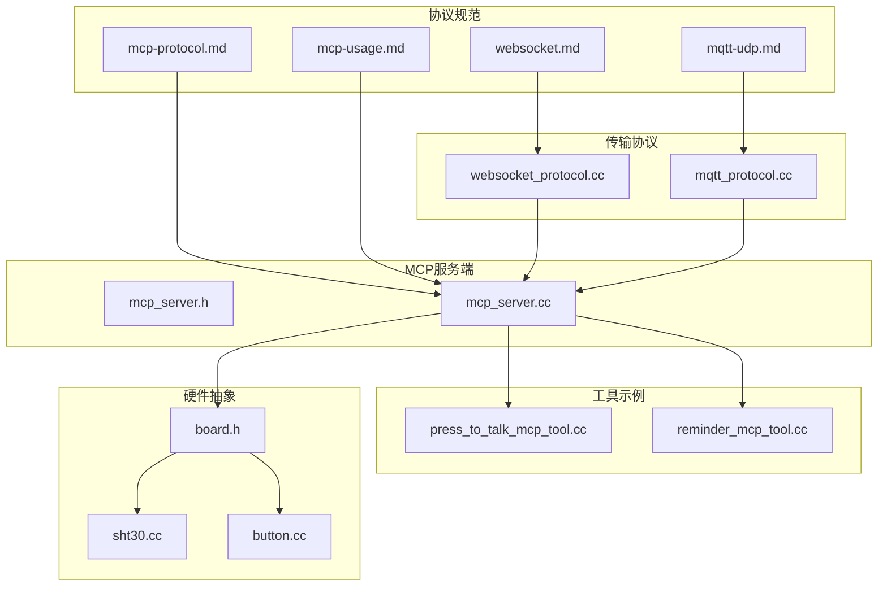
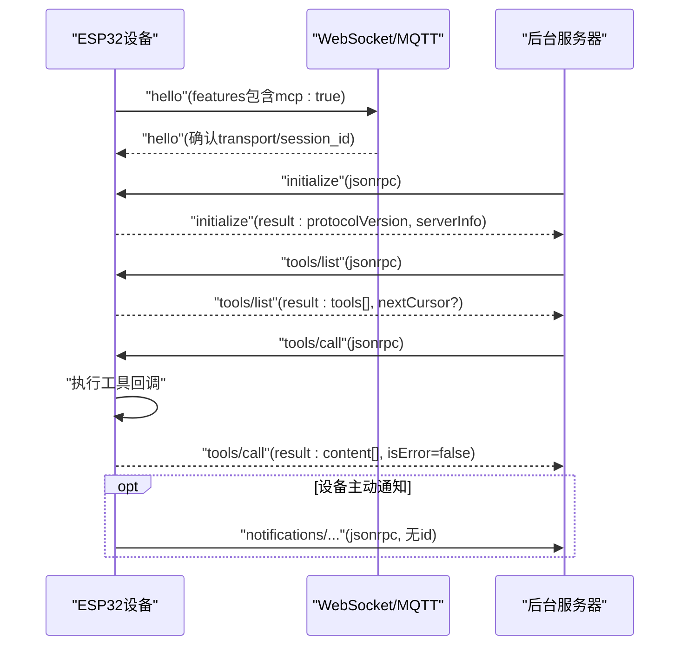
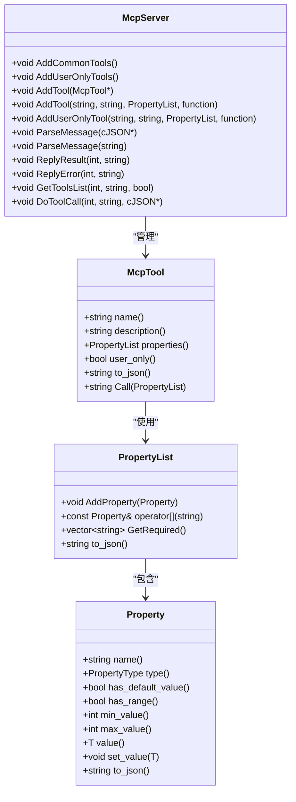
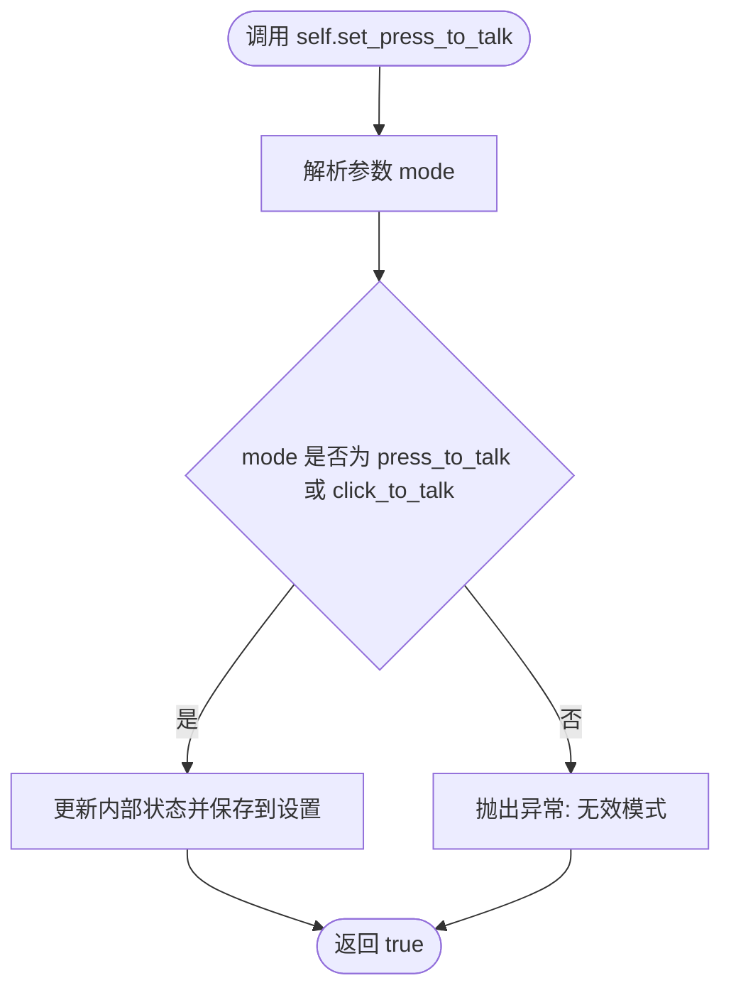
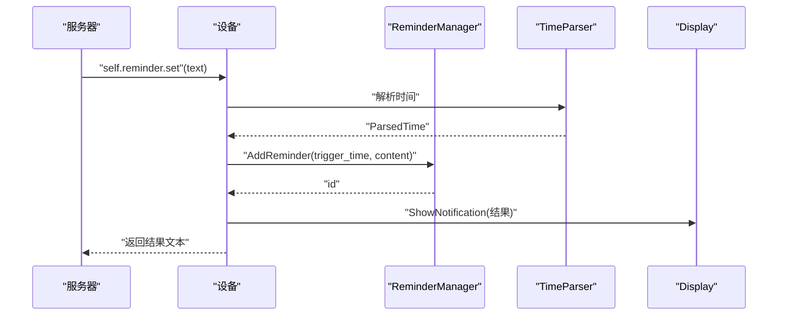
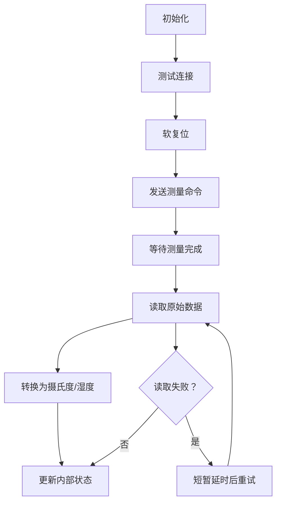
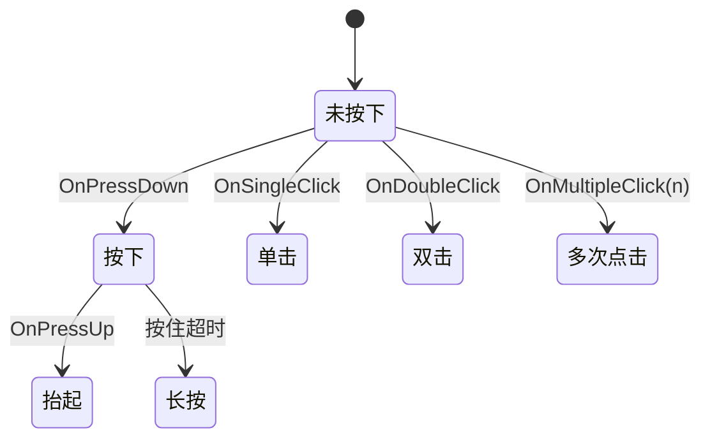
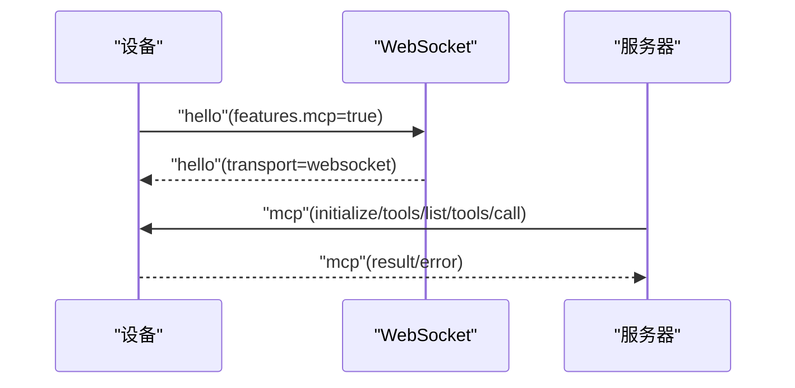
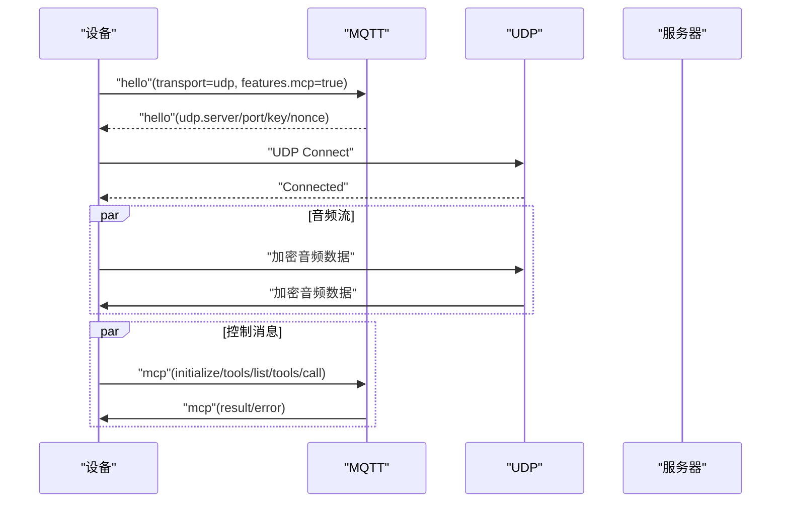
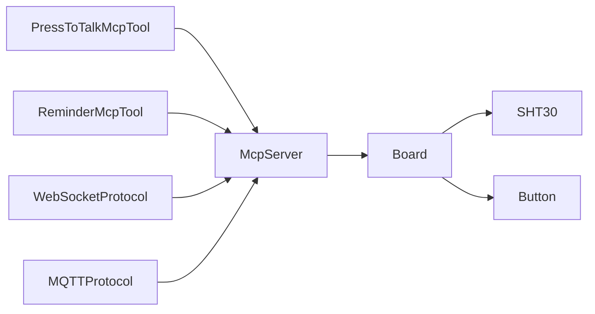

# MCP使用示例

<cite>
**本文档引用的文件**
- [mcp-protocol.md](file://docs/mcp-protocol.md)
- [mcp-usage.md](file://docs/mcp-usage.md)
- [websocket.md](file://docs/websocket.md)
- [mqtt-udp.md](file://docs/mqtt-udp.md)
- [mcp_server.h](file://main/mcp_server.h)
- [mcp_server.cc](file://main/mcp_server.cc)
- [press_to_talk_mcp_tool.cc](file://main/boards/common/press_to_talk_mcp_tool.cc)
- [reminder_mcp_tool.cc](file://main/reminder_mcp_tool.cc)
- [sht30.cc](file://main/boards/common/sht30.cc)
- [button.cc](file://main/boards/common/button.cc)
- [board.h](file://main/boards/common/board.h)
- [websocket_protocol.cc](file://main/protocols/websocket_protocol.cc)
- [mqtt_protocol.cc](file://main/protocols/mqtt_protocol.cc)
</cite>

## 目录
1. [简介](#简介)
2. [项目结构](#项目结构)
3. [核心组件](#核心组件)
4. [架构总览](#架构总览)
5. [详细组件分析](#详细组件分析)
6. [依赖关系分析](#依赖关系分析)
7. [性能考量](#性能考量)
8. [故障排除指南](#故障排除指南)
9. [结论](#结论)
10. [附录](#附录)

## 简介
本指南面向ESP32-AI项目中MCP（Model Context Protocol）协议的实际应用，提供设备端工具注册、常见控制场景（LED控制、按钮检测、温度读取、网络配置等）、与WebSocket/MQTT协议协同使用的完整操作示例。文档基于仓库中的协议规范、设备端实现与工具示例，帮助开发者快速上手并构建稳定的物联网控制方案。

## 项目结构
围绕MCP协议的关键目录与文件：
- 协议规范与使用说明：docs/mcp-protocol.md、docs/mcp-usage.md、docs/websocket.md、docs/mqtt-udp.md
- MCP服务端实现：main/mcp_server.h、main/mcp_server.cc
- 常用工具示例：main/boards/common/press_to_talk_mcp_tool.cc、main/reminder_mcp_tool.cc
- 传感器与外设：main/boards/common/sht30.cc、main/boards/common/button.cc
- 板级抽象：main/boards/common/board.h
- 传输协议适配：main/protocols/websocket_protocol.cc、main/protocols/mqtt_protocol.cc

**图表来源**
- [mcp-protocol.md:1-270](file://docs/mcp-protocol.md#L1-L270)
- [mcp-usage.md:1-115](file://docs/mcp-usage.md#L1-L115)
- [websocket.md:1-496](file://docs/websocket.md#L1-L496)
- [mqtt-udp.md:1-393](file://docs/mqtt-udp.md#L1-L393)
- [mcp_server.h:1-345](file://main/mcp_server.h#L1-L345)
- [mcp_server.cc:1-570](file://main/mcp_server.cc#L1-L570)
- [press_to_talk_mcp_tool.cc:1-57](file://main/boards/common/press_to_talk_mcp_tool.cc#L1-L57)
- [reminder_mcp_tool.cc:1-164](file://main/reminder_mcp_tool.cc#L1-L164)
- [sht30.cc:1-132](file://main/boards/common/sht30.cc#L1-L132)
- [button.cc:1-125](file://main/boards/common/button.cc#L1-L125)
- [board.h:61-93](file://main/boards/common/board.h#L61-L93)
- [websocket_protocol.cc](file://main/protocols/websocket_protocol.cc)
- [mqtt_protocol.cc](file://main/protocols/mqtt_protocol.cc)

**章节来源**
- [mcp-protocol.md:1-270](file://docs/mcp-protocol.md#L1-L270)
- [mcp-usage.md:1-115](file://docs/mcp-usage.md#L1-L115)
- [websocket.md:1-496](file://docs/websocket.md#L1-L496)
- [mqtt-udp.md:1-393](file://docs/mqtt-udp.md#L1-L393)

## 核心组件
- MCP服务器：负责解析JSON-RPC 2.0消息、维护工具列表、执行工具回调并返回结果。
- 工具注册：通过AddTool/AddUserOnlyTool注册设备功能，支持布尔/整数/字符串参数与默认值、范围约束。
- 传输适配：WebSocket/MQTT协议层负责承载MCP消息，握手与能力通告由底层协议完成。
- 板级抽象：Board类提供设备状态、传感器、显示、音频编解码器等统一接口，供工具调用。

**章节来源**
- [mcp_server.h:52-156](file://main/mcp_server.h#L52-L156)
- [mcp_server.cc:320-328](file://main/mcp_server.cc#L320-L328)
- [board.h:61-93](file://main/boards/common/board.h#L61-L93)

## 架构总览
MCP在设备端的运行时架构：
- 应用层通过WebSocket或MQTT与服务器建立连接，发送hello消息通告支持MCP。
- 服务器发起initialize/tools/list，设备返回工具清单。
- 服务器调用tools/call，设备执行对应工具并返回结果。
- 设备可通过Application::SendMcpMessage主动发送通知（如状态变更）。

**图表来源**
- [websocket.md:196-261](file://docs/websocket.md#L196-L261)
- [mcp-protocol.md:219-267](file://docs/mcp-protocol.md#L219-L267)
- [mcp_server.cc:393-442](file://main/mcp_server.cc#L393-L442)

## 详细组件分析

### MCP服务器与工具系统
- 工具注册与参数校验：工具参数支持默认值与范围约束，调用时自动校验缺失或越界参数。
- 工具执行：在主线程调度执行，避免并发风险；返回值支持bool/int/string、cJSON对象与图像内容。
- 工具列表分页：按最大负载限制动态拼接，支持cursor分页。
- 能力通告：支持解析客户端capabilities（如相机解释URL），用于增强工具能力。

**图表来源**
- [mcp_server.h:208-312](file://main/mcp_server.h#L208-L312)
- [mcp_server.cc:309-328](file://main/mcp_server.cc#L309-L328)

**章节来源**
- [mcp_server.h:52-156](file://main/mcp_server.h#L52-L156)
- [mcp_server.h:208-312](file://main/mcp_server.h#L208-L312)
- [mcp_server.cc:461-515](file://main/mcp_server.cc#L461-L515)
- [mcp_server.cc:517-569](file://main/mcp_server.cc#L517-L569)

### 常用工具示例

#### 按键说话模式切换工具
- 功能：在“长按说话”和“单击说话”模式间切换。
- 参数：mode（字符串，取值"press_to_talk"或"click_to_talk"）。
- 存储：通过Settings持久化当前模式。

**图表来源**
- [press_to_talk_mcp_tool.cc:35-49](file://main/boards/common/press_to_talk_mcp_tool.cc#L35-L49)

**章节来源**
- [press_to_talk_mcp_tool.cc:1-57](file://main/boards/common/press_to_talk_mcp_tool.cc#L1-L57)

#### 提醒与闹钟工具
- 功能：解析自然语言时间，设置提醒/闹钟，列出/删除。
- 参数：text（必填，包含时间信息的文本）、repeat（可选，闹钟重复周期）。
- 展示：通过Board::GetDisplay显示通知。

**图表来源**
- [reminder_mcp_tool.cc:34-65](file://main/reminder_mcp_tool.cc#L34-L65)

**章节来源**
- [reminder_mcp_tool.cc:26-109](file://main/reminder_mcp_tool.cc#L26-L109)
- [reminder_mcp_tool.cc:111-156](file://main/reminder_mcp_tool.cc#L111-L156)

### 传感器与外设集成

#### 温度传感器（SHT30）
- 初始化：测试连接、软复位。
- 读取：高精度测量、重试机制、失败计数与历史值回退。
- 更新：周期性更新，供显示与日志使用。

**图表来源**
- [sht30.cc:67-113](file://main/boards/common/sht30.cc#L67-L113)

**章节来源**
- [sht30.cc:16-41](file://main/boards/common/sht30.cc#L16-L41)
- [sht30.cc:67-113](file://main/boards/common/sht30.cc#L67-L113)

#### 按钮事件处理
- 支持按下/抬起、长按、单击、双击、多次点击事件回调注册。
- ADC/GPIO两种按键驱动方式。

**图表来源**
- [button.cc:44-125](file://main/boards/common/button.cc#L44-L125)

**章节来源**
- [button.cc:1-125](file://main/boards/common/button.cc#L1-L125)

### 传输协议与MCP协同

#### WebSocket与MCP
- hello消息中features包含"mcp": true，表明支持MCP。
- MCP消息封装在type:"mcp"的payload中，内部为JSON-RPC 2.0。

**图表来源**
- [websocket.md:196-261](file://docs/websocket.md#L196-L261)

**章节来源**
- [websocket.md:196-261](file://docs/websocket.md#L196-L261)

#### MQTT+UDP与MCP
- 控制通道：MQTT（Hello/Listen/TTS/MCP/System/Custom）。
- 音频通道：UDP（加密Opus音频）。
- MCP消息同样通过type:"mcp"承载。

**图表来源**
- [mqtt-udp.md:24-57](file://docs/mqtt-udp.md#L24-L57)

**章节来源**
- [mqtt-udp.md:71-112](file://docs/mqtt-udp.md#L71-L112)
- [mqtt-udp.md:143-154](file://docs/mqtt-udp.md#L143-L154)

## 依赖关系分析
- MCP服务器依赖Board抽象以获取设备状态、传感器、显示、音频编解码器等。
- 工具实现通过Board接口访问硬件资源，实现跨板级兼容。
- 传输协议层（WebSocket/MQTT）负责承载MCP消息，与应用层解耦。

**图表来源**
- [mcp_server.cc:47-124](file://main/mcp_server.cc#L47-L124)
- [press_to_talk_mcp_tool.cc:16-29](file://main/boards/common/press_to_talk_mcp_tool.cc#L16-L29)
- [reminder_mcp_tool.cc:23-34](file://main/reminder_mcp_tool.cc#L23-L34)
- [board.h:61-93](file://main/boards/common/board.h#L61-L93)
- [websocket_protocol.cc](file://main/protocols/websocket_protocol.cc)
- [mqtt_protocol.cc](file://main/protocols/mqtt_protocol.cc)

**章节来源**
- [mcp_server.cc:47-124](file://main/mcp_server.cc#L47-L124)
- [board.h:61-93](file://main/boards/common/board.h#L61-L93)

## 性能考量
- 工具列表优先级：常用工具前置以利用prompt缓存，缩短响应时间。
- 分页策略：tools/list按最大负载限制动态拼接，避免单次响应过大。
- 线程调度：工具调用在主线程执行，避免并发竞争；长耗时操作（如拍照）降低任务优先级。
- 传输选择：WebSocket适合统一承载，MQTT+UDP适合对实时性要求高的音频场景。

**章节来源**
- [mcp_server.cc:35-45](file://main/mcp_server.cc#L35-L45)
- [mcp_server.cc:461-515](file://main/mcp_server.cc#L461-L515)
- [mcp_server.cc:114-122](file://main/mcp_server.cc#L114-L122)

## 故障排除指南
- MCP消息解析失败：检查jsonrpc版本、method、params与id字段是否符合规范。
- 工具调用参数缺失或越界：确认PropertyList中必需参数与范围约束。
- 服务器断连：WebSocket/MQTT分别触发断开回调，设备应回收资源并回到空闲状态。
- 传感器读数异常：SHT30具备重试与失败计数机制，必要时回退到上次有效值。

**章节来源**
- [mcp_server.cc:359-442](file://main/mcp_server.cc#L359-L442)
- [mcp_server.cc:517-569](file://main/mcp_server.cc#L517-L569)
- [websocket.md:374-378](file://docs/websocket.md#L374-L378)
- [sht30.cc:101-113](file://main/boards/common/sht30.cc#L101-L113)

## 结论
MCP协议为ESP32-AI提供了标准化、可扩展的设备控制框架。通过清晰的工具注册机制、完善的参数校验与分页策略，以及与WebSocket/MQTT的良好协同，开发者可以快速实现LED控制、按钮检测、温度读取、提醒闹钟等多种场景，并在此基础上扩展更多智能功能。

## 附录

### 常见用例与最佳实践
- 设备控制
  - LED控制：在板级InitializeTools中注册GPIO控制工具，参数为布尔/亮度值。
  - 屏幕控制：注册亮度/主题设置工具，参数范围限定0-100或"light/dark"。
  - 音频控制：注册音量设置工具，调用Board::GetAudioCodec()。
- 状态查询
  - 设备状态：调用self.get_device_status工具，返回电池、网络、屏幕、音频等实时状态。
  - 传感器状态：通过Board::GetTemperature()/GetBatteryLevel()等接口查询。
- 数据获取
  - 温度/湿度：使用SHT30工具或直接调用Board接口。
  - 按钮事件：注册OnPressDown/OnLongPress等回调，实现交互逻辑。
- 网络配置
  - 通过WebSocket/MQTT握手时的hello消息携带features与audio_params，确保前后端参数一致。
- 最佳实践
  - 工具命名采用模块.功能风格，参数提供默认值与范围约束。
  - 长耗时操作在工具回调中异步执行，避免阻塞主线程。
  - 对外暴露的工具与用户专用工具分离，使用AddUserOnlyTool标注。

**章节来源**
- [mcp-usage.md:18-59](file://docs/mcp-usage.md#L18-L59)
- [mcp_server.cc:47-124](file://main/mcp_server.cc#L47-L124)
- [websocket.md:196-261](file://docs/websocket.md#L196-L261)
- [mqtt-udp.md:143-154](file://docs/mqtt-udp.md#L143-L154)