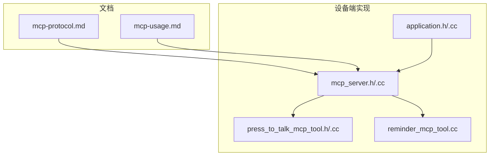
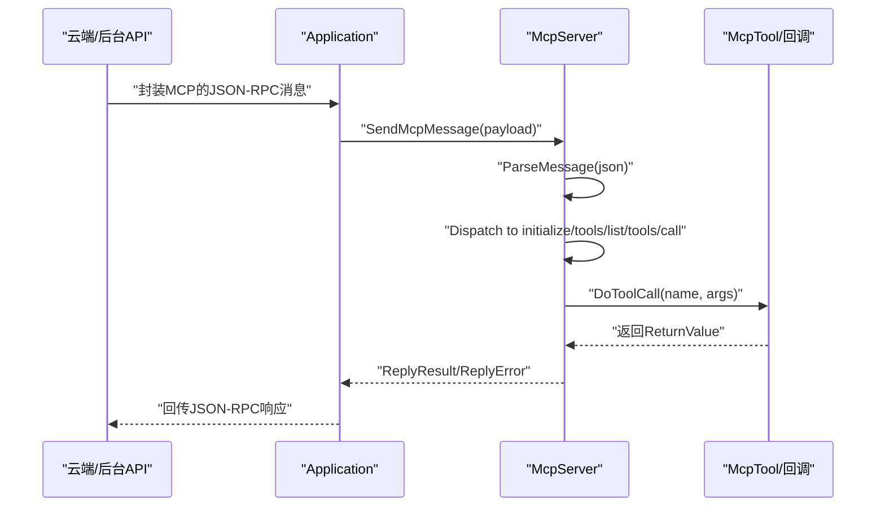
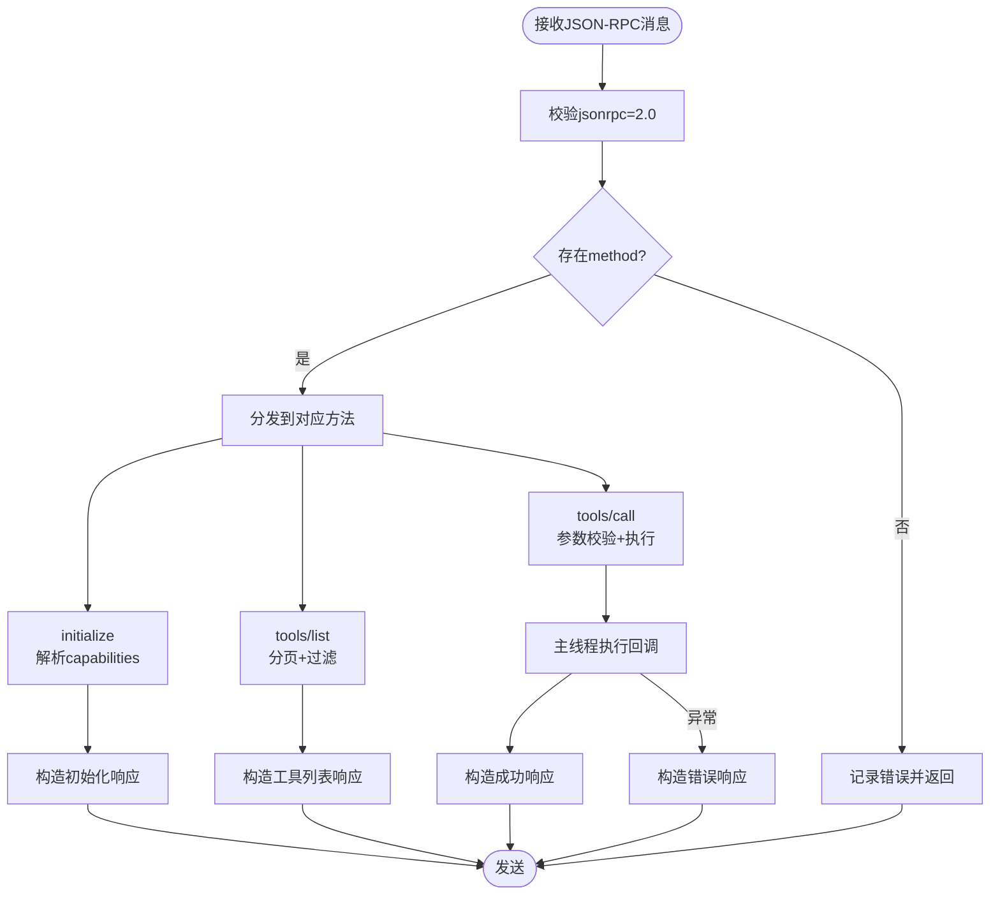
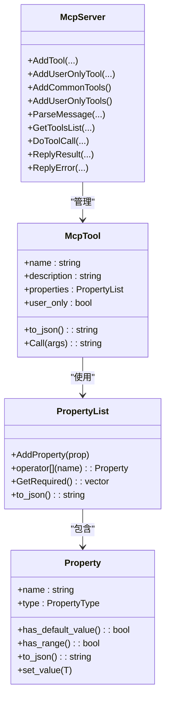
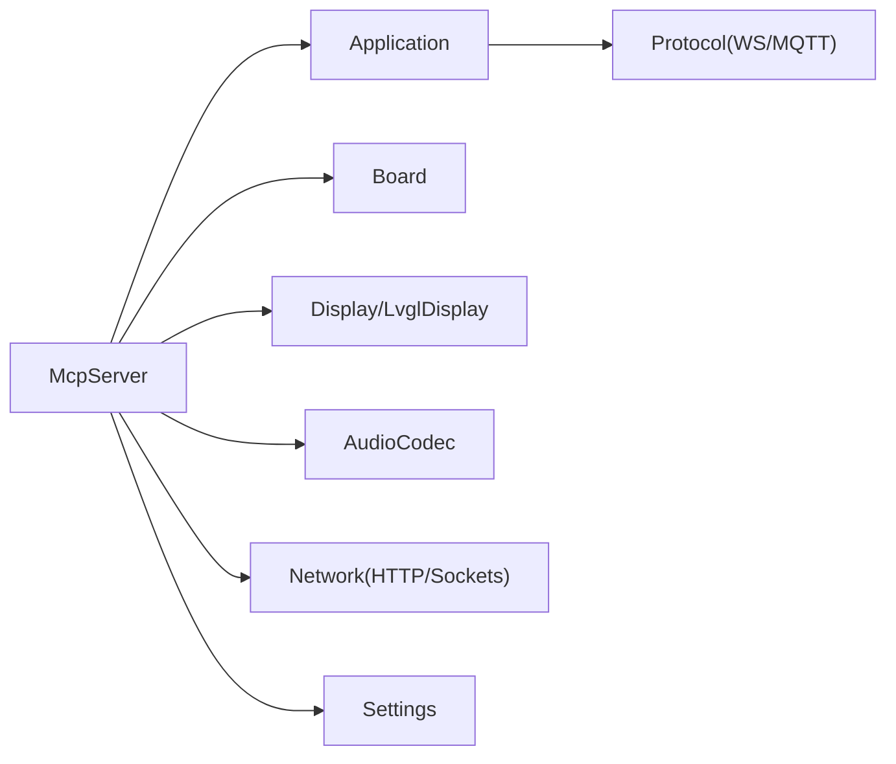

# MCP协议

<cite>
**本文引用的文件**   
- [mcp-protocol.md](file://docs/mcp-protocol.md)
- [mcp-usage.md](file://docs/mcp-usage.md)
- [mcp_server.h](file://main/mcp_server.h)
- [mcp_server.cc](file://main/mcp_server.cc)
- [press_to_talk_mcp_tool.h](file://main/boards/common/press_to_talk_mcp_tool.h)
- [press_to_talk_mcp_tool.cc](file://main/boards/common/press_to_talk_mcp_tool.cc)
- [reminder_mcp_tool.cc](file://main/reminder_mcp_tool.cc)
- [application.h](file://main/application.h)
- [application.cc](file://main/application.cc)
</cite>

## 目录
1. [简介](#简介)
2. [项目结构](#项目结构)
3. [核心组件](#核心组件)
4. [架构总览](#架构总览)
5. [详细组件分析](#详细组件分析)
6. [依赖关系分析](#依赖关系分析)
7. [性能考量](#性能考量)
8. [故障排查指南](#故障排查指南)
9. [结论](#结论)
10. [附录](#附录)

## 简介
本文件面向ESP32-AI项目的MCP（Model Context Protocol）协议，系统性阐述其工作原理、消息格式与交互流程；详解设备端MCP服务器的实现，包括工具注册、命令处理、状态反馈等；提供MCP工具开发指南，覆盖自定义工具的创建、参数定义与执行逻辑；解释与云端MCP服务器的协作机制，包括设备发现、能力协商、远程控制等；并给出实际使用示例、最佳实践、安全考虑与性能优化建议。

## 项目结构
MCP协议在本项目中由以下关键部分组成：
- 文档层：协议规范与使用说明，定义消息格式与交互流程
- 服务器层：MCP服务器实现，负责解析JSON-RPC 2.0消息、管理工具、执行调用
- 应用层：应用主控调度工具注册、消息发送与线程任务队列
- 板级扩展：可复用工具（如按键说话模式切换）与提醒/闹钟工具

**图表来源**
- [mcp-protocol.md:1-270](file://docs/mcp-protocol.md#L1-L270)
- [mcp-usage.md:1-115](file://docs/mcp-usage.md#L1-L115)
- [mcp_server.h:1-345](file://main/mcp_server.h#L1-L345)
- [mcp_server.cc:1-570](file://main/mcp_server.cc#L1-L570)
- [application.h:1-212](file://main/application.h#L1-L212)
- [application.cc:120-200](file://main/application.cc#L120-L200)
- [press_to_talk_mcp_tool.h:1-29](file://main/boards/common/press_to_talk_mcp_tool.h#L1-L29)
- [press_to_talk_mcp_tool.cc:1-57](file://main/boards/common/press_to_talk_mcp_tool.cc#L1-L57)
- [reminder_mcp_tool.cc:1-164](file://main/reminder_mcp_tool.cc#L1-L164)

**章节来源**
- [mcp-protocol.md:1-270](file://docs/mcp-protocol.md#L1-L270)
- [mcp-usage.md:1-115](file://docs/mcp-usage.md#L1-L115)
- [mcp_server.h:1-345](file://main/mcp_server.h#L1-L345)
- [mcp_server.cc:1-570](file://main/mcp_server.cc#L1-L570)
- [application.h:1-212](file://main/application.h#L1-L212)
- [application.cc:120-200](file://main/application.cc#L120-L200)
- [press_to_talk_mcp_tool.h:1-29](file://main/boards/common/press_to_talk_mcp_tool.h#L1-L29)
- [press_to_talk_mcp_tool.cc:1-57](file://main/boards/common/press_to_talk_mcp_tool.cc#L1-L57)
- [reminder_mcp_tool.cc:1-164](file://main/reminder_mcp_tool.cc#L1-L164)

## 核心组件
- MCP服务器（McpServer）
  - 单例，负责注册工具、解析JSON-RPC 2.0消息、执行工具调用、构造响应
  - 提供通用工具与仅用户可见工具两类注册入口
- 工具模型（McpTool、Property、PropertyList）
  - 将工具抽象为名称、描述、输入参数Schema与回调
  - 参数支持布尔、整数、字符串，可设定默认值与整数范围
- 应用主控（Application）
  - 统一调度工具注册、消息发送、线程任务队列
  - 通过Schedule确保工具回调在主线程执行，保障资源访问安全
- 板级工具示例
  - 按键说话模式切换工具（PressToTalkMcpTool）
  - 提醒/闹钟工具（RegisterReminderTools）

**章节来源**
- [mcp_server.h:50-342](file://main/mcp_server.h#L50-L342)
- [mcp_server.cc:35-132](file://main/mcp_server.cc#L35-L132)
- [application.cc:122-126](file://main/application.cc#L122-L126)
- [press_to_talk_mcp_tool.cc:10-29](file://main/boards/common/press_to_talk_mcp_tool.cc#L10-L29)
- [reminder_mcp_tool.cc:23-163](file://main/reminder_mcp_tool.cc#L23-L163)

## 架构总览
MCP协议消息封装于底层传输协议（WebSocket/MQTT）的消息体中，内部遵循JSON-RPC 2.0规范。设备端MCP服务器在应用初始化阶段完成工具注册，随后通过应用层统一发送消息接口与线程调度机制，保证工具执行的线程安全性与实时性。

**图表来源**
- [mcp-protocol.md:37-214](file://docs/mcp-protocol.md#L37-L214)
- [mcp_server.cc:359-442](file://main/mcp_server.cc#L359-L442)
- [application.h:118-118](file://main/application.h#L118-L118)

## 详细组件分析

### MCP服务器与消息处理
- 消息解析
  - 校验jsonrpc版本、method、params、id
  - 忽略以notifications开头的方法（通知）
  - 支持initialize、tools/list、tools/call三类方法
- 能力协商
  - initialize时解析客户端capabilities，如vision.url/token并配置相机解释服务
- 工具列表
  - 支持cursor分页与withUserTools过滤用户专用工具
  - 响应体包含tools数组与nextCursor（若需分页）
- 工具调用
  - 校验参数类型与必填项
  - 通过Application::Schedule在主线程执行回调
  - 统一封装返回值为JSON-RPC result/error

**图表来源**
- [mcp_server.cc:359-442](file://main/mcp_server.cc#L359-L442)
- [mcp_server.cc:405-419](file://main/mcp_server.cc#L405-L419)
- [mcp_server.cc:517-569](file://main/mcp_server.cc#L517-L569)

**章节来源**
- [mcp_server.cc:359-442](file://main/mcp_server.cc#L359-L442)
- [mcp_server.cc:405-419](file://main/mcp_server.cc#L405-L419)
- [mcp_server.cc:517-569](file://main/mcp_server.cc#L517-L569)

### 工具注册与参数模型
- 工具注册
  - AddTool/AddUserOnlyTool/AddCommonTools/AddUserOnlyTools
  - 防重入：同名工具不会重复注册
  - 用户专用工具（user_only=true）在tools/list时可选择过滤
- 参数模型
  - Property：名称、类型、默认值、整数范围
  - PropertyList：参数集合，支持required推导与JSON Schema输出
  - McpTool：工具元信息与回调，支持文本/图像/任意JSON返回值
- 返回值封装
  - 统一包装为content数组与isError标记
  - 支持字符串、布尔、整数、cJSON对象、ImageContent

**图表来源**
- [mcp_server.h:58-312](file://main/mcp_server.h#L58-L312)
- [mcp_server.h:314-342](file://main/mcp_server.h#L314-L342)

**章节来源**
- [mcp_server.h:58-312](file://main/mcp_server.h#L58-L312)
- [mcp_server.h:314-342](file://main/mcp_server.h#L314-L342)

### 应用主控与线程调度
- 初始化阶段注册工具
  - AddCommonTools/AddUserOnlyTools在应用Initialize中调用
- 线程安全
  - Schedule将工具回调投递至主线程执行
  - SendMcpMessage统一发送MCP消息
- 任务优先级
  - 拍照等耗时操作通过TaskPriorityReset降低优先级，避免阻塞音频/网络

**章节来源**
- [application.cc:122-126](file://main/application.cc#L122-L126)
- [mcp_server.cc:115-115](file://main/mcp_server.cc#L115-L115)
- [mcp_server.cc:559-569](file://main/mcp_server.cc#L559-L569)

### 板级工具示例：按键说话模式
- 功能
  - 切换“长按说话”与“单击说话”模式
  - 状态持久化到Settings分区
- 注册
  - 工具名为self.set_press_to_talk，参数为mode（字符串）
  - 回调根据mode设置状态并写入设置

**章节来源**
- [press_to_talk_mcp_tool.h:8-29](file://main/boards/common/press_to_talk_mcp_tool.h#L8-L29)
- [press_to_talk_mcp_tool.cc:10-29](file://main/boards/common/press_to_talk_mcp_tool.cc#L10-L29)
- [press_to_talk_mcp_tool.cc:35-49](file://main/boards/common/press_to_talk_mcp_tool.cc#L35-L49)

### 板级工具示例：提醒与闹钟
- 工具集
  - self.reminder.set：解析文本时间设置提醒
  - self.alarm.set：解析文本时间设置闹钟（支持once/daily/weekly/monthly）
  - self.reminder.list：列出当前提醒/闹钟
  - self.reminder.delete：按ID删除提醒/闹钟
- 实现要点
  - 使用TimeParser解析相对/绝对时间
  - 通过ReminderManager管理任务并在触发时显示通知

**章节来源**
- [reminder_mcp_tool.cc:23-163](file://main/reminder_mcp_tool.cc#L23-L163)

### 云端协作与设备发现
- 能力通告
  - 设备通过底层协议发送hello消息，声明支持mcp能力
- 会话初始化
  - 后台API发送initialize，携带capabilities（如vision.url/token）
  - 设备返回protocolVersion、capabilities、serverInfo
- 工具发现与调用
  - 后台API通过tools/list获取工具清单（支持分页）
  - 通过tools/call调用具体工具，参数为arguments对象

**章节来源**
- [mcp-protocol.md:37-214](file://docs/mcp-protocol.md#L37-L214)

## 依赖关系分析
- 模块耦合
  - McpServer依赖Board/Display/Audio等硬件抽象与Application的调度/发送接口
  - 工具回调可访问Board能力（如音量、屏幕、相机、网络）
- 外部依赖
  - JSON解析库cJSON
  - TLS/编码库（Base64）
- 循环依赖
  - 通过头文件分离与前置声明避免直接循环包含

**图表来源**
- [mcp_server.cc:13-20](file://main/mcp_server.cc#L13-L20)
- [mcp_server.cc:340-357](file://main/mcp_server.cc#L340-L357)
- [application.cc:122-126](file://main/application.cc#L122-L126)

**章节来源**
- [mcp_server.cc:13-20](file://main/mcp_server.cc#L13-L20)
- [mcp_server.cc:340-357](file://main/mcp_server.cc#L340-L357)
- [application.cc:122-126](file://main/application.cc#L122-L126)

## 性能考量
- 响应延迟优化
  - 将常用工具置于工具列表前端，利于提示缓存命中
- 分页与负载控制
  - tools/list对响应体大小进行上限控制，超限则返回nextCursor
- 线程与任务优先级
  - 工具回调在主线程执行，避免并发资源竞争
  - 拍照等高优先级任务通过TaskPriorityReset临时降级
- 网络上传
  - 屏幕快照上传采用multipart/form-data，按块读取与写入，减少内存峰值

**章节来源**
- [mcp_server.cc:36-38](file://main/mcp_server.cc#L36-L38)
- [mcp_server.cc:461-515](file://main/mcp_server.cc#L461-L515)
- [mcp_server.cc:115-115](file://main/mcp_server.cc#L115-L115)
- [mcp_server.cc:210-247](file://main/mcp_server.cc#L210-L247)

## 故障排查指南
- 常见错误
  - JSONRPC版本不匹配、缺少method/id、无效params
  - tools/call缺少有效参数或未知工具名
  - 工具回调抛出异常（如参数越界、拍照失败）
- 定位方法
  - 查看设备日志标签“MCP”，关注解析与执行阶段的错误信息
  - 确认工具是否正确注册（名称唯一、参数Schema完整）
  - 确认后台API的JSON-RPC格式与id匹配
- 处理建议
  - 对参数进行严格校验与范围约束
  - 对耗时操作进行异步调度与优先级调整
  - 对网络请求增加状态码与异常捕获

**章节来源**
- [mcp_server.cc:360-391](file://main/mcp_server.cc#L360-L391)
- [mcp_server.cc:419-441](file://main/mcp_server.cc#L419-L441)
- [mcp_server.cc:517-569](file://main/mcp_server.cc#L517-L569)

## 结论
本项目以JSON-RPC 2.0为基础，构建了清晰的MCP协议实现：设备端MCP服务器负责工具注册与调用执行，应用主控提供线程调度与消息发送保障；文档明确了云端协作流程与最佳实践。通过参数模型与分页策略，系统兼顾易用性与性能；通过用户专用工具与能力协商，满足不同场景下的控制需求。

## 附录

### MCP消息格式与交互要点
- 消息封装
  - MCP消息嵌套在底层协议消息体中，内部为JSON-RPC 2.0
- 方法与参数
  - initialize：capabilities可选，用于能力协商
  - tools/list：cursor分页，withUserTools过滤用户专用工具
  - tools/call：name+arguments调用工具
- 响应
  - 成功：result.content数组+isError=false
  - 失败：error.message

**章节来源**
- [mcp-protocol.md:7-214](file://docs/mcp-protocol.md#L7-L214)

### 工具开发指南（步骤）
- 注册工具
  - 使用AddTool/AddUserOnlyTool/AddCommonTools/AddUserOnlyTools
  - 命名建议模块.功能，描述简洁明确
- 定义参数
  - 使用Property/PropertyList定义必填/可选参数与默认值
  - 整数参数可设置最小/最大值
- 编写回调
  - 在主线程执行业务逻辑，返回bool/int/string/cJSON/ImageContent
  - 异常将转换为错误响应
- 测试与验证
  - 通过tools/list核对工具Schema
  - 通过tools/call验证参数与返回值

**章节来源**
- [mcp-usage.md:18-59](file://docs/mcp-usage.md#L18-L59)
- [mcp_server.h:208-312](file://main/mcp_server.h#L208-L312)
- [mcp_server.cc:309-328](file://main/mcp_server.cc#L309-L328)