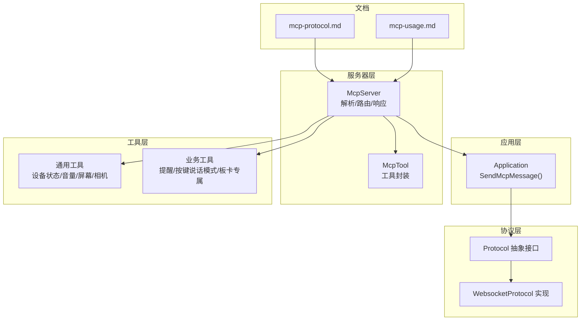
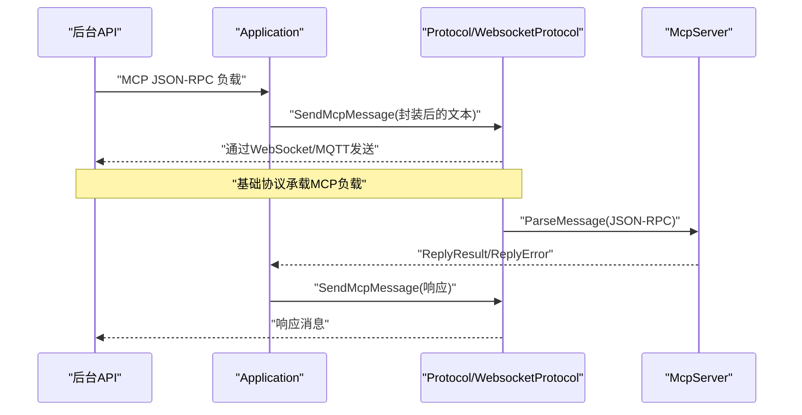
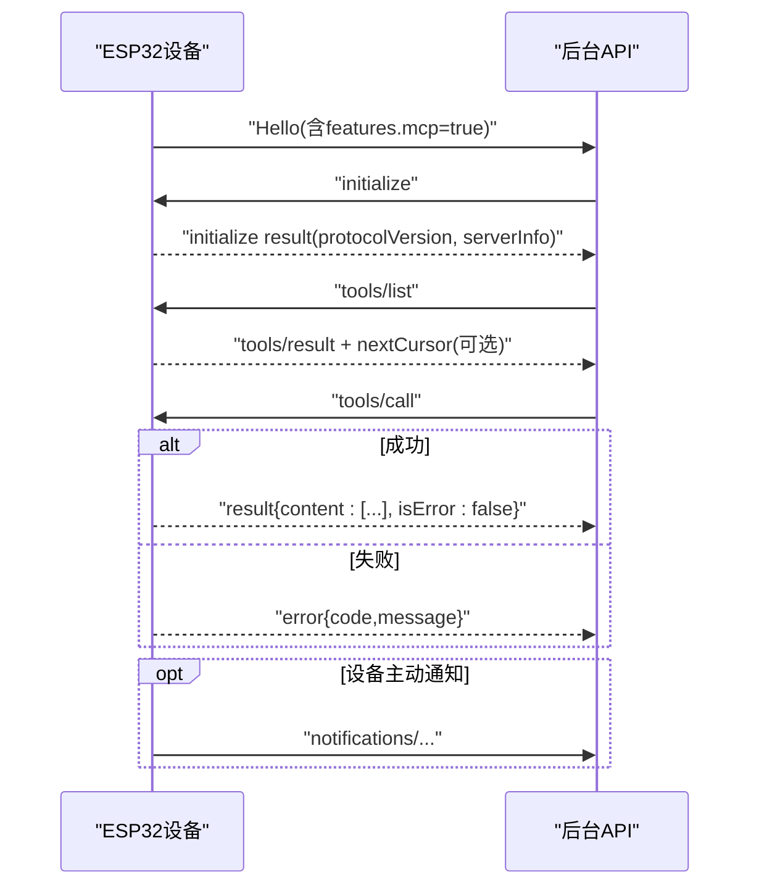
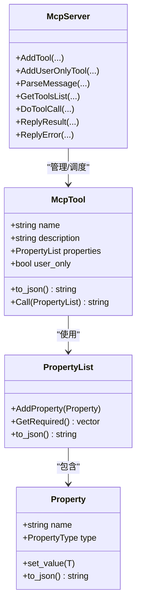
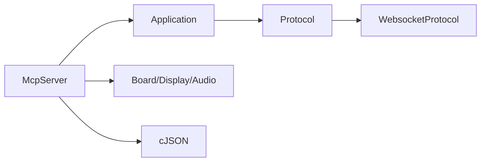

# MCP协议规范

<cite>
**本文引用的文件**
- [mcp-protocol.md](file://docs/mcp-protocol.md)
- [mcp-usage.md](file://docs/mcp-usage.md)
- [mcp_server.h](file://main/mcp_server.h)
- [mcp_server.cc](file://main/mcp_server.cc)
- [press_to_talk_mcp_tool.h](file://main/boards/common/press_to_talk_mcp_tool.h)
- [press_to_talk_mcp_tool.cc](file://main/boards/common/press_to_talk_mcp_tool.cc)
- [reminder_mcp_tool.cc](file://main/reminder_mcp_tool.cc)
- [mcp_controller.cc](file://main/boards/zhengchen-cam/mcp_controller.cc)
- [application.h](file://main/application.h)
- [protocol.h](file://main/protocols/protocol.h)
- [websocket_protocol.h](file://main/protocols/websocket_protocol.h)
</cite>

## 目录
1. [简介](#简介)
2. [项目结构](#项目结构)
3. [核心组件](#核心组件)
4. [架构总览](#架构总览)
5. [详细组件分析](#详细组件分析)
6. [依赖关系分析](#依赖关系分析)
7. [性能考量](#性能考量)
8. [故障排查指南](#故障排查指南)
9. [结论](#结论)
10. [附录](#附录)

## 简介
本文件面向ESP32-AI项目的MCP（Model Context Protocol）协议规范，系统阐述协议的消息格式、请求-响应模式、错误处理机制，以及在设备端的应用场景（设备发现、能力协商、工具调用）。文档同时给出协议的JSON Schema定义要点、安全与认证建议、版本管理与向后兼容策略，并结合源码路径定位关键实现。

## 项目结构
MCP协议在本项目中由以下模块协同实现：
- 文档层：协议交互流程与用法说明
- 服务器层：MCP消息解析、工具注册与调用
- 工具层：通用工具与业务工具（如提醒、按键说话模式切换、特定板卡工具）
- 应用层：消息转发至底层协议（WebSocket/MQTT）
- 协议层：抽象传输接口与WebSocket实现

**图表来源**
- [mcp-protocol.md:1-270](file://docs/mcp-protocol.md#L1-L270)
- [mcp-usage.md:1-115](file://docs/mcp-usage.md#L1-L115)
- [mcp_server.h:314-342](file://main/mcp_server.h#L314-L342)
- [mcp_server.cc:330-442](file://main/mcp_server.cc#L330-L442)
- [application.h:118-118](file://main/application.h#L118-L118)
- [protocol.h:75-75](file://main/protocols/protocol.h#L75-L75)
- [websocket_protocol.h:13-32](file://main/protocols/websocket_protocol.h#L13-L32)

**章节来源**
- [mcp-protocol.md:1-270](file://docs/mcp-protocol.md#L1-L270)
- [mcp-usage.md:1-115](file://docs/mcp-usage.md#L1-L115)

## 核心组件
- McpServer：协议解析器与工具调度中心，负责initialize、tools/list、tools/call等方法的处理与响应。
- McpTool：工具抽象，封装工具名称、描述、输入Schema与回调。
- Application：桥接MCP与底层协议，负责将MCP消息通过SendMcpMessage发送到网络层。
- Protocol/WebsocketProtocol：传输抽象与WebSocket实现，承载MCP消息的载体。
- 业务工具：通用工具（设备状态、音量、屏幕、相机）与用户专用工具（系统信息、重启、升级、截图、预览、提醒/闹钟等）。

**章节来源**
- [mcp_server.h:208-342](file://main/mcp_server.h#L208-L342)
- [mcp_server.cc:35-132](file://main/mcp_server.cc#L35-L132)
- [application.h:118-118](file://main/application.h#L118-L118)
- [protocol.h:75-75](file://main/protocols/protocol.h#L75-L75)
- [websocket_protocol.h:13-32](file://main/protocols/websocket_protocol.h#L13-L32)

## 架构总览
MCP消息在设备侧以JSON-RPC 2.0封装于基础协议消息体中，McpServer解析后路由到对应工具并返回结果；应用层通过Protocol接口将消息发送到WebSocket或MQTT通道。

**图表来源**
- [mcp_server.cc:330-442](file://main/mcp_server.cc#L330-L442)
- [application.h:118-118](file://main/application.h#L118-L118)
- [protocol.h:75-75](file://main/protocols/protocol.h#L75-L75)
- [websocket_protocol.h:13-32](file://main/protocols/websocket_protocol.h#L13-L32)

## 详细组件分析

### 1) 协议消息格式与版本
- 封装方式：MCP消息作为基础协议消息体的payload，遵循JSON-RPC 2.0规范。
- 关键字段：
  - jsonrpc：固定为"2.0"
  - method：方法名（initialize、tools/list、tools/call等）
  - params：请求参数对象
  - id：请求标识，响应需原样返回
  - result/error：成功/失败响应
- 版本：initialize返回包含protocolVersion字段，当前版本为"2024-11-05"。

**章节来源**
- [mcp-protocol.md:7-36](file://docs/mcp-protocol.md#L7-L36)
- [mcp_server.cc:393-404](file://main/mcp_server.cc#L393-L404)

### 2) 交互流程与消息类型
- 连接建立与能力通告：设备通过基础协议发送hello消息，声明支持MCP。
- 初始化：后台发送initialize，设备返回protocolVersion、capabilities、serverInfo。
- 发现工具：后台发送tools/list，设备返回工具数组与nextCursor（分页）。
- 调用工具：后台发送tools/call，设备执行工具并返回content与isError。
- 通知：设备可发送以notifications/开头的方法（无id）。

**图表来源**
- [mcp-protocol.md:37-214](file://docs/mcp-protocol.md#L37-L214)
- [mcp_server.cc:393-442](file://main/mcp_server.cc#L393-L442)

**章节来源**
- [mcp-protocol.md:37-214](file://docs/mcp-protocol.md#L37-L214)

### 3) 错误处理机制
- 解析错误：JSON-RPC版本/方法/id缺失或非法时直接丢弃并记录日志。
- 方法未实现：返回通用错误消息。
- tools/call参数校验：缺少必需参数或类型不匹配时返回错误。
- 工具执行异常：捕获异常并返回错误消息。

**章节来源**
- [mcp_server.cc:360-442](file://main/mcp_server.cc#L360-L442)
- [mcp_server.cc:517-569](file://main/mcp_server.cc#L517-L569)

### 4) 工具注册与调用
- 注册接口：AddTool/AddUserOnlyTool，支持名称、描述、参数Schema与回调。
- 参数Schema：支持boolean/integer/string，整数可配置范围与默认值；必填项自动标注。
- 调用流程：参数解析与校验，主线程调度执行，返回text或image内容，isError=false。

**图表来源**
- [mcp_server.h:58-342](file://main/mcp_server.h#L58-L342)

**章节来源**
- [mcp_server.h:58-342](file://main/mcp_server.h#L58-L342)
- [mcp_server.cc:309-328](file://main/mcp_server.cc#L309-L328)
- [mcp_server.cc:517-569](file://main/mcp_server.cc#L517-L569)

### 5) 通用工具与业务工具
- 通用工具（AddCommonTools）：
  - 设备状态查询
  - 音频音量设置
  - 屏幕亮度设置
  - 主题设置（LVGL）
  - 相机拍照与解释（带问题参数）
- 用户专用工具（AddUserOnlyTools）：
  - 系统信息、重启、固件升级
  - 屏幕截图上传、图片预览
  - 资源下载URL设置
  - 提醒/闹钟设置、列出、删除
- 板卡专属工具（如zhengchen-cam）：
  - AEC对话打断模式开关与查询
  - 设备重启

**章节来源**
- [mcp_server.cc:35-132](file://main/mcp_server.cc#L35-L132)
- [mcp_server.cc:134-307](file://main/mcp_server.cc#L134-L307)
- [reminder_mcp_tool.cc:23-163](file://main/reminder_mcp_tool.cc#L23-L163)
- [mcp_controller.cc:23-83](file://main/boards/zhengchen-cam/mcp_controller.cc#L23-L83)

### 6) 按键说话模式工具
- 功能：在“长按说话”与“单击说话”之间切换。
- 注册：通过PressToTalkMcpTool在MCP服务器注册工具。
- 存储：状态持久化到Settings。

**章节来源**
- [press_to_talk_mcp_tool.h:8-29](file://main/boards/common/press_to_talk_mcp_tool.h#L8-L29)
- [press_to_talk_mcp_tool.cc:10-57](file://main/boards/common/press_to_talk_mcp_tool.cc#L10-L57)

### 7) 传输与消息发送
- Application::SendMcpMessage：将MCP JSON文本发送到协议层。
- Protocol::SendMcpMessage：抽象接口，供上层调用。
- WebsocketProtocol：WebSocket实现，负责实际网络发送。

**章节来源**
- [application.h:118-118](file://main/application.h#L118-L118)
- [protocol.h:75-75](file://main/protocols/protocol.h#L75-L75)
- [websocket_protocol.h:13-32](file://main/protocols/websocket_protocol.h#L13-L32)

## 依赖关系分析
- McpServer依赖：
  - Board/Display/Audio等硬件抽象以实现具体工具
  - Application::Schedule用于主线程调度工具执行
  - cJSON用于JSON构建与解析
- 传输依赖：
  - Protocol抽象屏蔽WebSocket/MQTT差异
  - WebsocketProtocol实现具体发送与hello解析

**图表来源**
- [mcp_server.cc:1-20](file://main/mcp_server.cc#L1-L20)
- [application.h:148-148](file://main/application.h#L148-L148)
- [protocol.h:75-75](file://main/protocols/protocol.h#L75-L75)
- [websocket_protocol.h:25-26](file://main/protocols/websocket_protocol.h#L25-L26)

**章节来源**
- [mcp_server.cc:1-20](file://main/mcp_server.cc#L1-L20)
- [application.h:148-148](file://main/application.h#L148-L148)
- [protocol.h:75-75](file://main/protocols/protocol.h#L75-L75)
- [websocket_protocol.h:25-26](file://main/protocols/websocket_protocol.h#L25-L26)

## 性能考量
- 工具列表分页：GetToolsList对payload大小进行限制，超过阈值时设置nextCursor，避免单次响应过大。
- 主线程调度：工具执行通过Application::Schedule在主线程执行，确保与UI/硬件资源访问的线程安全。
- 相机操作优先级：拍照时临时降低任务优先级，避免影响语音链路。

**章节来源**
- [mcp_server.cc:461-515](file://main/mcp_server.cc#L461-L515)
- [mcp_server.cc:559-569](file://main/mcp_server.cc#L559-L569)

## 故障排查指南
- 无法解析MCP消息：检查JSON-RPC字段是否完整，method与id是否存在。
- tools/call失败：确认工具名称正确、参数类型与必填项满足Schema。
- 工具执行异常：查看设备日志中的异常信息，确认硬件状态（如相机/屏幕）可用。
- 传输问题：确认WebSocket连接正常，hello消息中features.mcp为true。

**章节来源**
- [mcp_server.cc:360-442](file://main/mcp_server.cc#L360-L442)
- [mcp_server.cc:517-569](file://main/mcp_server.cc#L517-L569)
- [mcp-protocol.md:41-59](file://docs/mcp-protocol.md#L41-L59)

## 结论
MCP协议在ESP32-AI项目中以JSON-RPC 2.0为载体，通过McpServer实现标准化的工具发现与调用流程。配合Application与Protocol层，实现了跨平台的设备控制与扩展能力。通过工具Schema与分页机制，既保证了易用性也兼顾了性能与安全性。

## 附录

### A. JSON Schema定义要点
- 工具描述对象（tools/list结果中的每个工具）：
  - name：字符串，唯一标识
  - description：字符串，自然语言描述
  - inputSchema：对象，包含
    - type："object"
    - properties：对象，键为参数名，值为参数Schema
    - required：数组，必填参数名列表
  - annotations：可选，如audience=["user"]表示仅用户可见
- 参数Schema（Property.to_json输出）：
  - boolean：type="boolean"，可选default
  - integer：type="integer"，可选default、minimum、maximum
  - string：type="string"，可选default
- 工具调用返回（result）：
  - content：数组，元素为对象，type="text"或"type"="image"
  - isError：布尔，false表示成功
- 错误响应（error）：
  - code：整数（如-32601表示方法未找到）
  - message：字符串

**章节来源**
- [mcp_server.h:232-270](file://main/mcp_server.h#L232-L270)
- [mcp_server.h:123-155](file://main/mcp_server.h#L123-L155)
- [mcp_server.cc:517-569](file://main/mcp_server.cc#L517-L569)

### B. 安全与认证建议
- 认证与授权：建议在基础协议（WebSocket/MQTT）层面启用TLS与鉴权，MCP消息内不携带敏感凭据。
- 传输加密：使用WSS或MQTT over TLS，防止中间人攻击。
- 工具权限：通过user_only标记区分系统工具，限制AI直接调用。
- 输入校验：严格依据inputSchema进行参数校验，拒绝非法参数。
- 日志与审计：记录关键工具调用与错误，便于追踪与审计。

### C. 版本管理与向后兼容
- 协议版本：initialize返回的protocolVersion为"2024-11-05"，设备端应保持该版本兼容。
- 向后兼容策略：
  - 新增工具：不破坏既有方法与Schema
  - 修改参数：新增可选字段，避免required变更
  - 删除工具：先标记废弃再移除，保留过渡期
  - 响应格式：保持result/error结构不变

**章节来源**
- [mcp_server.cc:393-404](file://main/mcp_server.cc#L393-L404)
- [mcp-protocol.md:96-106](file://docs/mcp-protocol.md#L96-L106)