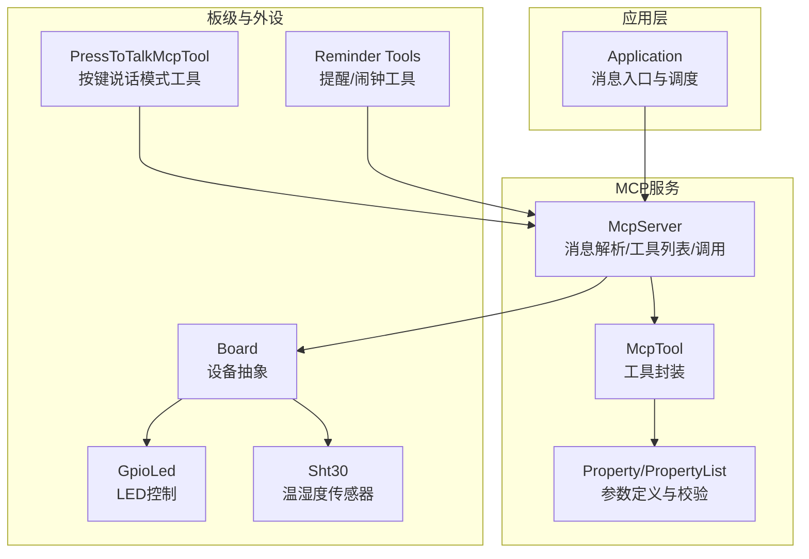
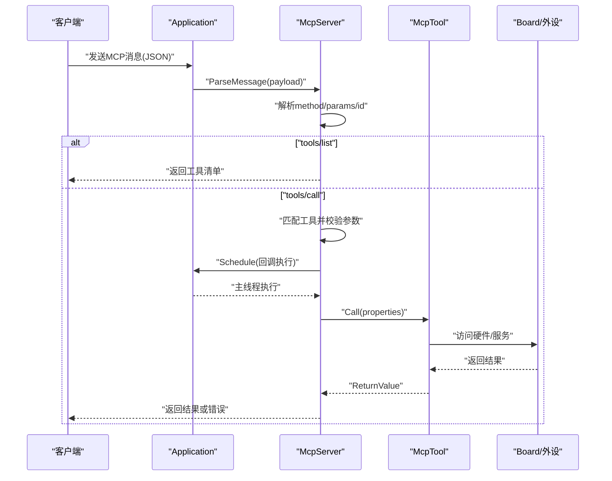
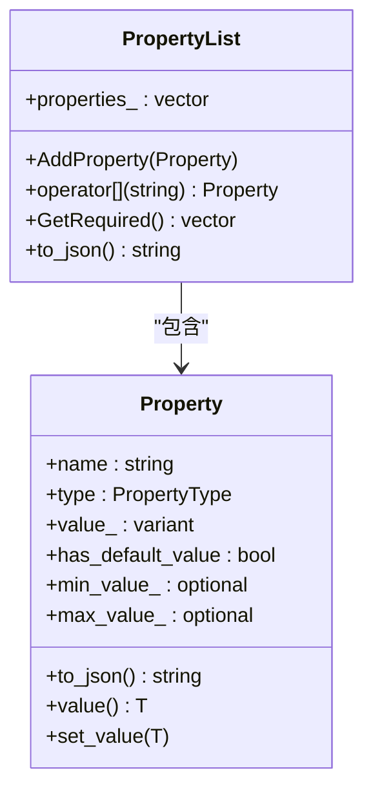
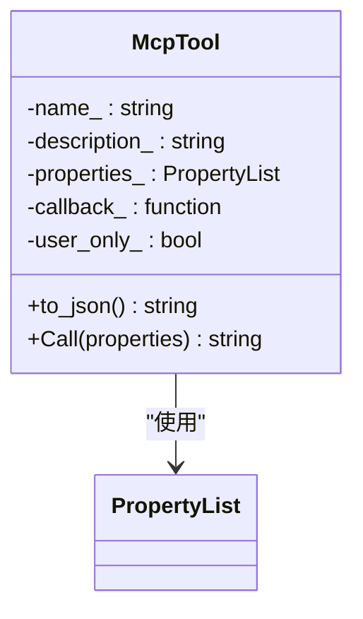
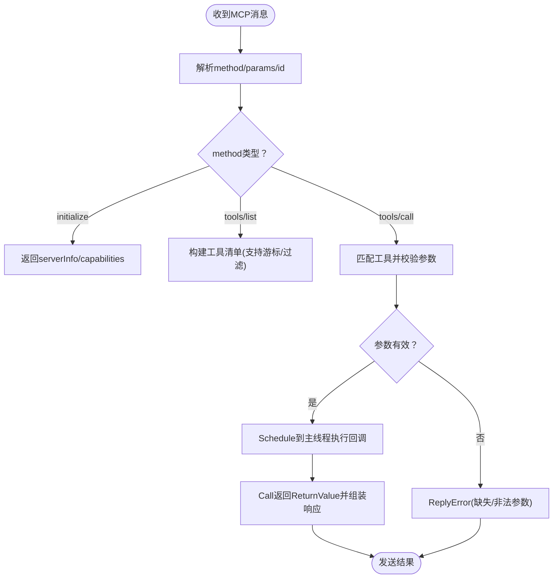
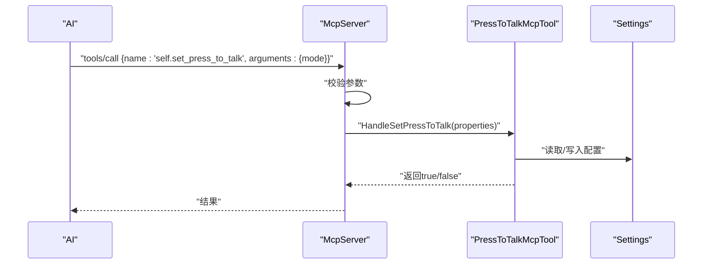
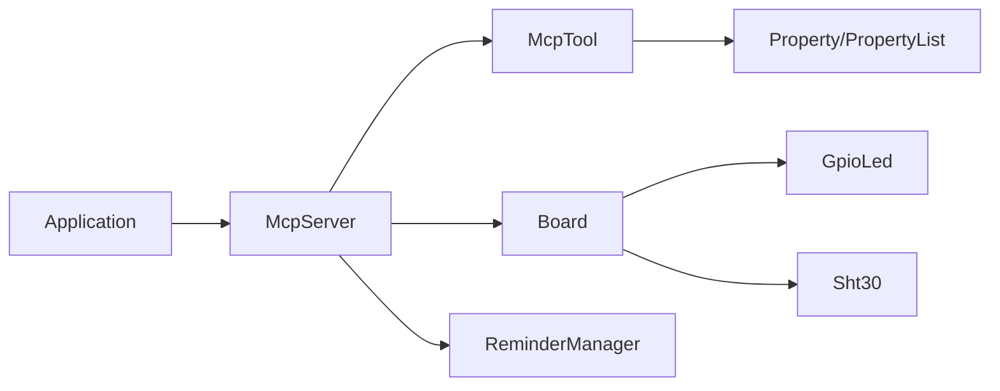

# MCP工具开发

<cite>
**本文引用的文件**
- [mcp_server.h](file://main/mcp_server.h)
- [mcp_server.cc](file://main/mcp_server.cc)
- [press_to_talk_mcp_tool.h](file://main/boards/common/press_to_talk_mcp_tool.h)
- [press_to_talk_mcp_tool.cc](file://main/boards/common/press_to_talk_mcp_tool.cc)
- [reminder_mcp_tool.cc](file://main/reminder_mcp_tool.cc)
- [sht30.h](file://main/boards/common/sht30.h)
- [sht30.cc](file://main/boards/common/sht30.cc)
- [gpio_led.cc](file://main/led/gpio_led.cc)
- [application.cc](file://main/application.cc)
</cite>

## 目录
1. [简介](#简介)
2. [项目结构](#项目结构)
3. [核心组件](#核心组件)
4. [架构总览](#架构总览)
5. [详细组件分析](#详细组件分析)
6. [依赖关系分析](#依赖关系分析)
7. [性能考量](#性能考量)
8. [故障排查指南](#故障排查指南)
9. [结论](#结论)
10. [附录](#附录)

## 简介
本指南面向ESP32-AI项目的MCP工具开发者，系统讲解如何基于MCP协议在设备侧实现自定义工具。文档覆盖以下关键主题：
- McpTool类与工具注册流程
- 参数定义与校验：Property与PropertyList
- 回调函数实现模式：返回值处理、错误处理、异步调度
- 完整开发示例：从简单GPIO控制到复杂传感器读取
- 测试与调试方法
- 常用硬件设备的MCP工具实现参考

## 项目结构
MCP工具能力由主服务端模块统一管理，工具注册集中在各板级初始化流程中，部分通用工具可直接复用。

图示来源
- [application.cc:603-615](file://main/application.cc#L603-L615)
- [mcp_server.cc:320-328](file://main/mcp_server.cc#L320-L328)
- [mcp_server.h:208-231](file://main/mcp_server.h#L208-L231)
- [mcp_server.h:58-156](file://main/mcp_server.h#L58-L156)

章节来源
- [mcp_server.h:1-345](file://main/mcp_server.h#L1-L345)
- [mcp_server.cc:1-570](file://main/mcp_server.cc#L1-L570)
- [application.cc:603-615](file://main/application.cc#L603-L615)

## 核心组件
- McpServer：MCP协议服务端，负责消息解析、工具列表生成、工具调用与回复。
- McpTool：工具封装，包含名称、描述、输入参数Schema与回调函数。
- Property/PropertyList：参数模型，支持布尔、整数、字符串三类，支持默认值与整数范围约束。
- ReturnValue：工具回调返回值类型，支持bool/int/string/cJSON*/ImageContent*。

章节来源
- [mcp_server.h:50-56](file://main/mcp_server.h#L50-L56)
- [mcp_server.h:58-156](file://main/mcp_server.h#L58-L156)
- [mcp_server.h:158-206](file://main/mcp_server.h#L158-L206)
- [mcp_server.h:208-312](file://main/mcp_server.h#L208-L312)

## 架构总览
MCP消息通过应用层进入，交由McpServer解析；工具列表与调用均在主线程调度执行，确保设备资源访问安全。

图示来源
- [application.cc:603-615](file://main/application.cc#L603-L615)
- [mcp_server.cc:359-442](file://main/mcp_server.cc#L359-L442)
- [mcp_server.cc:517-569](file://main/mcp_server.cc#L517-L569)
- [mcp_server.h:272-312](file://main/mcp_server.h#L272-L312)

## 详细组件分析

### Property与PropertyList：参数定义与校验
- 支持类型：布尔、整数、字符串。
- 默认值：可选，默认值存在则视为非必填参数。
- 整数范围：可同时指定最小值与最大值，构造时进行合法性校验，运行时写入也受范围约束。
- 序列化：to_json输出符合MCP规范的参数Schema，含type/default/minimum/maximum等字段。

图示来源
- [mcp_server.h:58-156](file://main/mcp_server.h#L58-L156)
- [mcp_server.h:158-206](file://main/mcp_server.h#L158-L206)

章节来源
- [mcp_server.h:58-156](file://main/mcp_server.h#L58-L156)
- [mcp_server.h:158-206](file://main/mcp_server.h#L158-L206)

### McpTool：工具封装与回调
- 构造：传入名称、描述、参数Schema与回调函数。
- 工具清单序列化：包含inputSchema与可选audience注解（user-only）。
- 回调执行：将ReturnValue转为标准MCP响应内容数组，支持文本与图片两种内容类型。

图示来源
- [mcp_server.h:208-312](file://main/mcp_server.h#L208-L312)

章节来源
- [mcp_server.h:208-312](file://main/mcp_server.h#L208-L312)

### McpServer：消息解析与工具调用
- 消息入口：ParseMessage支持字符串与cJSON对象。
- 方法分发：initialize/tools/list/tools/call。
- 工具列表：支持分页游标与用户工具过滤。
- 工具调用：参数类型校验、缺失参数报错、异常捕获、主线程调度执行。

图示来源
- [mcp_server.cc:359-442](file://main/mcp_server.cc#L359-L442)
- [mcp_server.cc:461-515](file://main/mcp_server.cc#L461-L515)
- [mcp_server.cc:517-569](file://main/mcp_server.cc#L517-L569)

章节来源
- [mcp_server.cc:330-442](file://main/mcp_server.cc#L330-L442)
- [mcp_server.cc:461-515](file://main/mcp_server.cc#L461-L515)
- [mcp_server.cc:517-569](file://main/mcp_server.cc#L517-L569)

### 工具注册与生命周期
- 公共工具：在McpServer::AddCommonTools中注册，优先加入工具列表以提升缓存命中率。
- 用户专用工具：通过AddUserOnlyTool注册，仅对用户可见（AI不可见）。
- 板级工具：在具体Board的InitializeTools中注册，避免在公共区域添加自定义工具。

章节来源
- [mcp_server.cc:35-132](file://main/mcp_server.cc#L35-L132)
- [mcp_server.cc:134-307](file://main/mcp_server.cc#L134-L307)
- [mcp_server.cc:320-328](file://main/mcp_server.cc#L320-L328)

### 示例一：按键说话模式工具（PressToTalkMcpTool）
- 功能：切换“长按说话”与“单击说话”模式。
- 参数：mode（字符串），取值为press_to_talk或click_to_talk。
- 实现要点：从设置读取状态，注册MCP工具，回调中根据mode切换并持久化。

图示来源
- [press_to_talk_mcp_tool.cc:10-29](file://main/boards/common/press_to_talk_mcp_tool.cc#L10-L29)
- [press_to_talk_mcp_tool.cc:35-49](file://main/boards/common/press_to_talk_mcp_tool.cc#L35-L49)
- [press_to_talk_mcp_tool.h:7-29](file://main/boards/common/press_to_talk_mcp_tool.h#L7-L29)

章节来源
- [press_to_talk_mcp_tool.cc:10-29](file://main/boards/common/press_to_talk_mcp_tool.cc#L10-L29)
- [press_to_talk_mcp_tool.cc:35-49](file://main/boards/common/press_to_talk_mcp_tool.cc#L35-L49)
- [press_to_talk_mcp_tool.h:7-29](file://main/boards/common/press_to_talk_mcp_tool.h#L7-L29)

### 示例二：提醒与闹钟工具（Reminder Tools）
- 工具集合：self.reminder.set、self.alarm.set、self.reminder.list、self.reminder.delete。
- 参数：文本解析时间（支持绝对/相对）、重复选项、ID等。
- 实现要点：解析文本为时间戳，调用ReminderManager创建任务，反馈状态到屏幕。

章节来源
- [reminder_mcp_tool.cc:23-163](file://main/reminder_mcp_tool.cc#L23-L163)

### 示例三：GPIO控制（LED）
- 控制目标：通过PWM控制LED亮度与闪烁，随设备状态变化自动调整。
- 实现要点：GpioLed封装LED控制细节，设备状态机驱动LED行为。

章节来源
- [gpio_led.cc:100-130](file://main/led/gpio_led.cc#L100-L130)
- [gpio_led.cc:207-254](file://main/led/gpio_led.cc#L207-L254)

### 示例四：传感器读取（SHT30）
- 设备接口：Sht30封装I2C通信与数据转换，提供温度/湿度读取。
- 实现要点：带重试与失败计数策略，保证稳定性。

章节来源
- [sht30.cc:67-113](file://main/boards/common/sht30.cc#L67-L113)
- [sht30.h:9-47](file://main/boards/common/sht30.h#L9-L47)

## 依赖关系分析
- 应用层通过Application接收MCP消息并转发至McpServer。
- McpServer依赖Board抽象访问硬件与服务。
- 工具回调可能涉及网络、存储、显示等子系统，需注意线程与资源竞争。

图示来源
- [application.cc:603-615](file://main/application.cc#L603-L615)
- [mcp_server.cc:320-328](file://main/mcp_server.cc#L320-L328)
- [mcp_server.h:208-312](file://main/mcp_server.h#L208-L312)

章节来源
- [application.cc:603-615](file://main/application.cc#L603-L615)
- [mcp_server.cc:320-328](file://main/mcp_server.cc#L320-L328)

## 性能考量
- 工具列表优先级：常用工具前置，提升提示缓存命中率。
- 工具调用串行化：通过主线程调度避免并发冲突。
- 大负载分页：tools/list支持游标分页，避免单次响应过大。
- 异步网络操作：如截图上传、图片预览等，采用异步HTTP请求并校验状态码。

章节来源
- [mcp_server.cc:35-132](file://main/mcp_server.cc#L35-L132)
- [mcp_server.cc:461-515](file://main/mcp_server.cc#L461-L515)
- [mcp_server.cc:195-291](file://main/mcp_server.cc#L195-L291)

## 故障排查指南
- 参数校验失败
  - 现象：tools/call返回缺失或非法参数错误。
  - 排查：确认参数类型与必填项，检查PropertyList构造是否正确。
- 工具未找到
  - 现象：Unknown tool错误。
  - 排查：确认工具名称拼写一致，是否在正确的初始化阶段注册。
- 回调异常
  - 现象：工具执行抛出异常导致错误响应。
  - 排查：在回调中捕获异常并返回可读错误信息；避免在回调中直接阻塞。
- 硬件访问问题
  - 现象：传感器读取失败或I2C通信异常。
  - 排查：检查引脚连接、地址与命令，参考SHT30的重试与失败计数策略。

章节来源
- [mcp_server.cc:523-557](file://main/mcp_server.cc#L523-L557)
- [mcp_server.cc:561-568](file://main/mcp_server.cc#L561-L568)
- [sht30.cc:29-41](file://main/boards/common/sht30.cc#L29-L41)

## 结论
通过McpTool与McpServer提供的统一框架，开发者可以快速扩展设备能力，实现从简单GPIO控制到复杂传感器读取与系统管理的各类工具。建议遵循参数Schema设计、主线程回调执行、错误显式返回的原则，结合实际硬件抽象，构建稳定可靠的MCP工具集。

## 附录

### 开发步骤速查
- 定义参数：使用Property/PropertyList声明参数类型、默认值与范围。
- 编写回调：在主线程上下文中实现业务逻辑，返回ReturnValue。
- 注册工具：在合适时机调用AddTool/AddUserOnlyTool注册。
- 测试验证：通过tools/list与tools/call验证Schema与行为。

章节来源
- [mcp_server.cc:320-328](file://main/mcp_server.cc#L320-L328)
- [mcp_server.h:208-312](file://main/mcp_server.h#L208-L312)