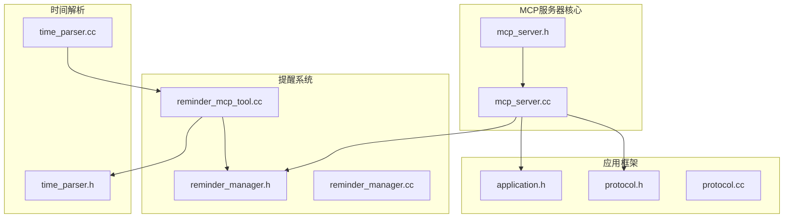
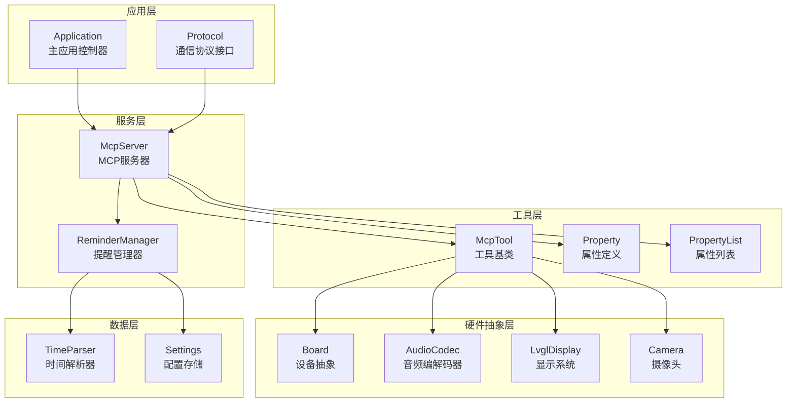
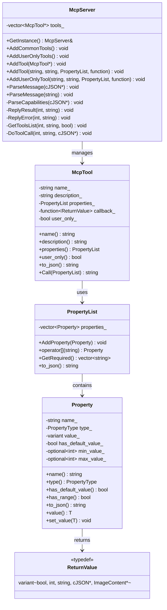
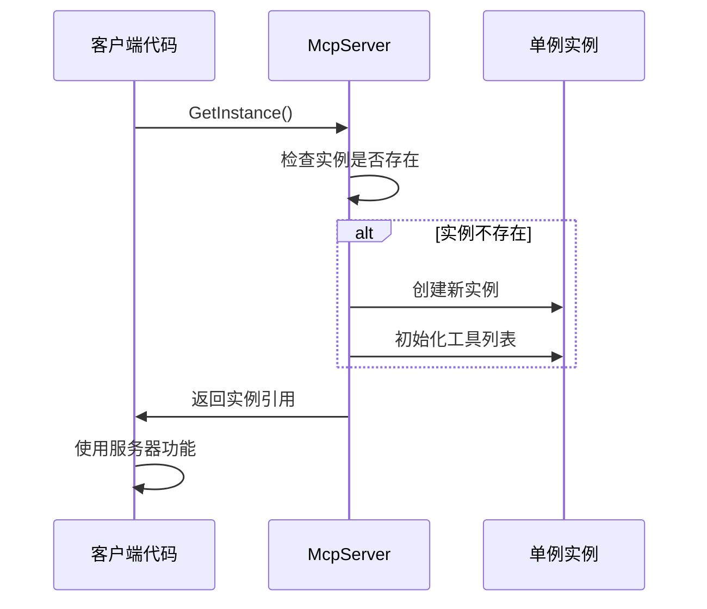
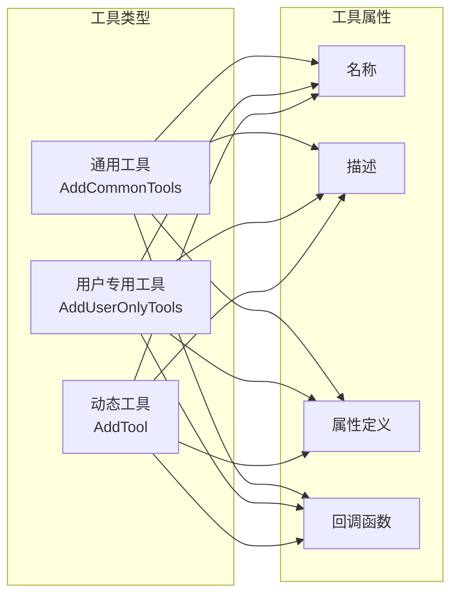
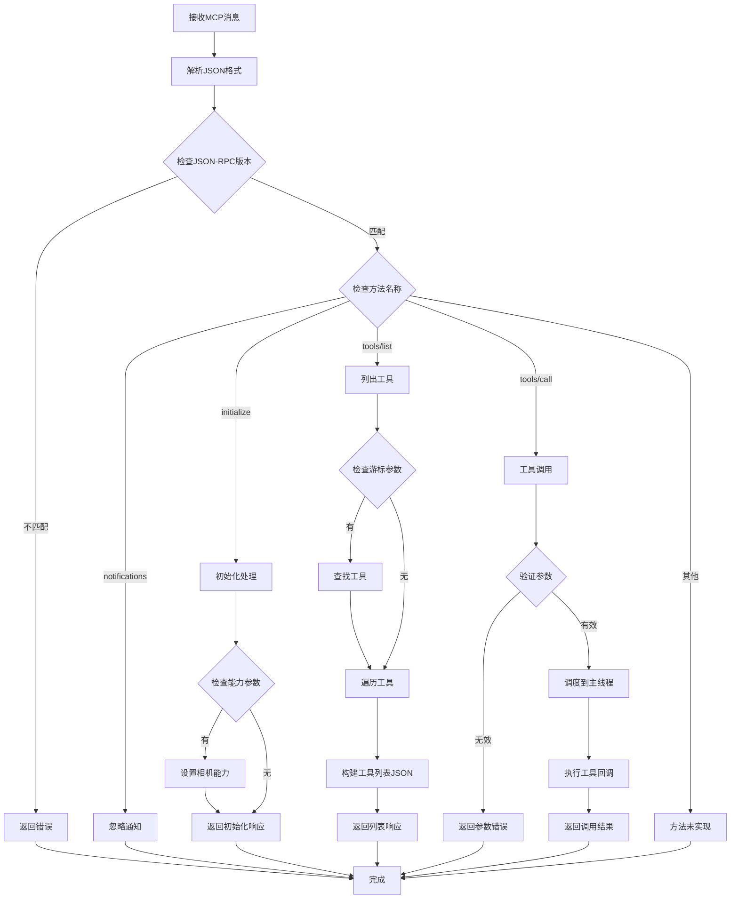
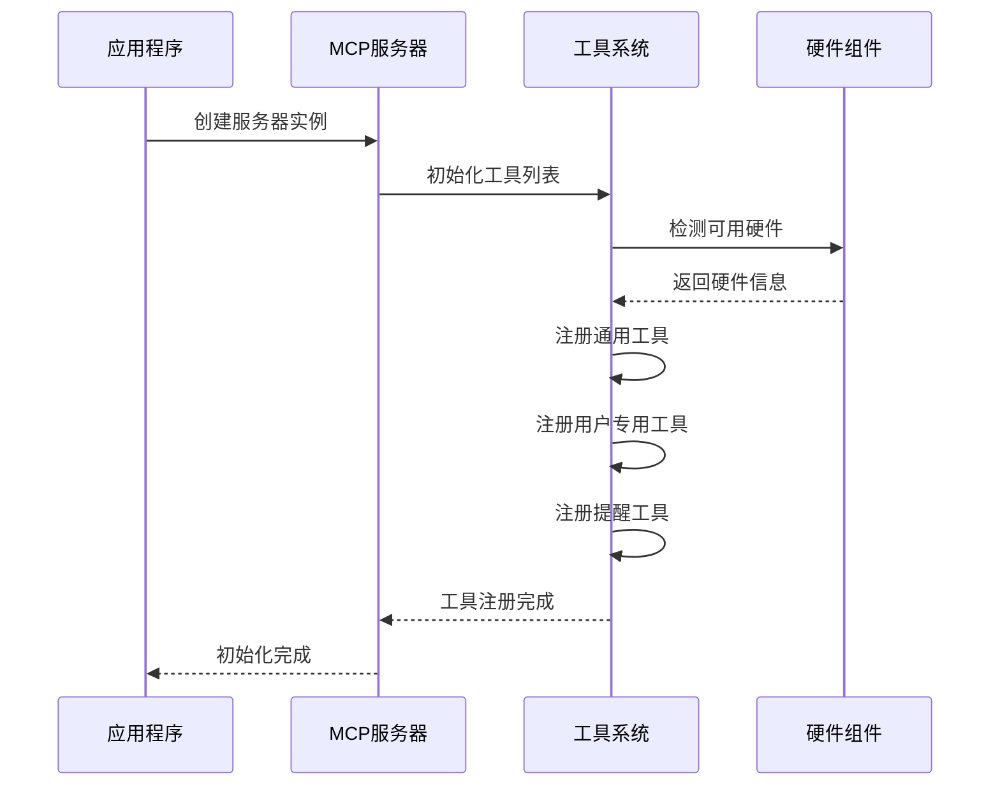
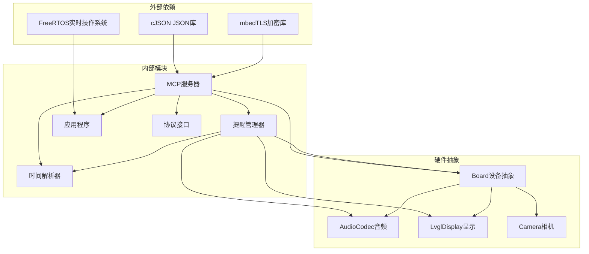

# MCP服务器实现

<cite>
**本文档引用的文件**
- [mcp_server.h](file://main/mcp_server.h)
- [mcp_server.cc](file://main/mcp_server.cc)
- [reminder_manager.h](file://main/reminder_manager.h)
- [reminder_manager.cc](file://main/reminder_manager.cc)
- [reminder_mcp_tool.cc](file://main/reminder_mcp_tool.cc)
- [time_parser.h](file://main/time_parser.h)
- [time_parser.cc](file://main/time_parser.cc)
- [application.h](file://main/application.h)
- [protocol.h](file://main/protocols/protocol.h)
- [protocol.cc](file://main/protocols/protocol.cc)
</cite>

## 目录
1. [简介](#简介)
2. [项目结构](#项目结构)
3. [核心组件](#核心组件)
4. [架构概览](#架构概览)
5. [详细组件分析](#详细组件分析)
6. [依赖关系分析](#依赖关系分析)
7. [性能考虑](#性能考虑)
8. [故障排除指南](#故障排除指南)
9. [结论](#结论)

## 简介

ESP32-AI项目的MCP（Model Context Protocol）服务器实现是一个基于C++的嵌入式系统组件，负责为AI助手提供本地设备控制和工具调用能力。该服务器实现了完整的MCP协议规范，支持工具注册、消息解析、响应生成等功能，并与设备的硬件组件（音频、显示、相机等）深度集成。

MCP服务器采用单例模式设计，确保在整个应用程序生命周期中只有一个服务器实例存在。它通过工具管理系统提供设备控制功能，包括音量调节、屏幕亮度控制、相机拍照、提醒管理等常用操作。

## 项目结构

MCP服务器实现位于ESP32-AI项目的main目录下，主要包含以下关键文件：

**图表来源**
- [mcp_server.h:1-345](file://main/mcp_server.h#L1-L345)
- [mcp_server.cc:1-570](file://main/mcp_server.cc#L1-L570)
- [reminder_manager.h:1-59](file://main/reminder_manager.h#L1-L59)
- [reminder_manager.cc:1-331](file://main/reminder_manager.cc#L1-L331)
- [reminder_mcp_tool.cc:1-164](file://main/reminder_mcp_tool.cc#L1-L164)
- [time_parser.h:1-30](file://main/time_parser.h#L1-L30)
- [time_parser.cc:1-244](file://main/time_parser.cc#L1-L244)
- [application.h:1-212](file://main/application.h#L1-L212)
- [protocol.h:1-99](file://main/protocols/protocol.h#L1-L99)
- [protocol.cc:1-91](file://main/protocols/protocol.cc#L1-L91)

**章节来源**
- [mcp_server.h:1-345](file://main/mcp_server.h#L1-L345)
- [mcp_server.cc:1-570](file://main/mcp_server.cc#L1-L570)

## 核心组件

MCP服务器实现包含多个核心组件，每个组件都有特定的功能职责：

### 单例模式实现
MCP服务器采用标准的C++单例模式实现，确保全局唯一性：
- 使用静态局部变量保证线程安全
- 提供GetInstance()静态方法访问实例
- 私有构造函数防止外部直接实例化

### 工具管理系统
服务器维护一个动态工具列表，支持：
- 工具注册和注销
- 工具属性定义和验证
- 用户可见工具和用户专用工具区分
- 工具调用的异步执行

### 消息解析引擎
实现完整的MCP协议消息解析：
- JSON-RPC 2.0兼容的消息格式
- 方法路由和参数验证
- 错误处理和响应生成
- 能力协商和配置

**章节来源**
- [mcp_server.h:314-342](file://main/mcp_server.h#L314-L342)
- [mcp_server.cc:23-31](file://main/mcp_server.cc#L23-L31)

## 架构概览

MCP服务器采用分层架构设计，各层之间职责清晰分离：

**图表来源**
- [mcp_server.cc:35-132](file://main/mcp_server.cc#L35-L132)
- [reminder_manager.cc:22-25](file://main/reminder_manager.cc#L22-L25)
- [application.h:50-194](file://main/application.h#L50-L194)
- [protocol.h:44-95](file://main/protocols/protocol.h#L44-L95)

## 详细组件分析

### McpServer类设计

McpServer是整个MCP服务器的核心类，实现了完整的MCP协议功能：

#### 类图结构

**图表来源**
- [mcp_server.h:208-342](file://main/mcp_server.h#L208-L342)

#### 单例模式实现

McpServer采用经典的单例模式实现：

**图表来源**
- [mcp_server.h:316-319](file://main/mcp_server.h#L316-L319)

**章节来源**
- [mcp_server.h:314-342](file://main/mcp_server.h#L314-L342)

### 工具注册机制

MCP服务器提供了灵活的工具注册机制，支持多种工具类型：

#### 工具分类

**图表来源**
- [mcp_server.cc:35-132](file://main/mcp_server.cc#L35-L132)
- [mcp_server.cc:134-307](file://main/mcp_server.cc#L134-L307)

#### 工具属性系统

Property类提供了强大的属性定义和验证功能：

**章节来源**
- [mcp_server.h:58-156](file://main/mcp_server.h#L58-L156)
- [mcp_server.cc:309-328](file://main/mcp_server.cc#L309-L328)

### 消息解析流程

MCP服务器实现了完整的消息解析和路由机制：

#### 消息处理流程

**图表来源**
- [mcp_server.cc:359-442](file://main/mcp_server.cc#L359-L442)
- [mcp_server.cc:517-569](file://main/mcp_server.cc#L517-L569)

#### 响应生成机制

服务器支持多种响应类型：

**章节来源**
- [mcp_server.cc:444-459](file://main/mcp_server.cc#L444-L459)
- [mcp_server.cc:461-515](file://main/mcp_server.cc#L461-L515)

### 服务器核心功能

#### 工具管理功能

MCP服务器内置了丰富的设备控制工具：

##### 设备状态工具
- `self.get_device_status`: 获取设备实时状态信息
- 支持音频扬声器、屏幕、电池、网络等状态查询

##### 音频控制工具
- `self.audio_speaker.set_volume`: 设置音频扬声器音量
- 参数验证和范围限制（0-100）

##### 屏幕控制工具
- `self.screen.set_brightness`: 设置屏幕亮度
- `self.screen.set_theme`: 设置界面主题（浅色/深色）
- `self.screen.get_info`: 获取屏幕信息

##### 相机控制工具
- `self.camera.take_photo`: 拍照并解释内容
- 集成视觉能力配置

##### 用户专用工具
- `self.get_system_info`: 获取系统信息
- `self.reboot`: 系统重启
- `self.upgrade_firmware`: 固件升级
- `self.assets.set_download_url`: 设置资源下载URL

**章节来源**
- [mcp_server.cc:47-124](file://main/mcp_server.cc#L47-L124)
- [mcp_server.cc:134-307](file://main/mcp_server.cc#L134-L307)

#### 提醒管理集成

MCP服务器集成了ReminderManager，提供完整的提醒和闹钟功能：

##### 提醒工具
- `self.reminder.set`: 设置提醒任务
- `self.alarm.set`: 设置闹钟任务（支持重复）
- `self.reminder.list`: 列出所有提醒
- `self.reminder.delete`: 删除提醒任务

##### 时间解析功能
- 支持中文时间表达式解析
- 绝对时间和相对时间识别
- 自动时间转换和验证

**章节来源**
- [reminder_mcp_tool.cc:23-163](file://main/reminder_mcp_tool.cc#L23-L163)
- [time_parser.cc:228-243](file://main/time_parser.cc#L228-L243)

### 服务器生命周期管理

MCP服务器的生命周期管理包括初始化、运行和清理阶段：

#### 初始化过程

**图表来源**
- [mcp_server.cc:35-132](file://main/mcp_server.cc#L35-L132)

#### 资源清理机制

服务器在析构时自动清理所有注册的工具：

**章节来源**
- [mcp_server.cc:23-31](file://main/mcp_server.cc#L23-L31)
- [mcp_server.h:329-331](file://main/mcp_server.h#L329-L331)

## 依赖关系分析

MCP服务器实现涉及多个模块之间的复杂依赖关系：

**图表来源**
- [mcp_server.h:14-12](file://main/mcp_server.h#L14-L12)
- [mcp_server.cc:6-20](file://main/mcp_server.cc#L6-L20)
- [reminder_manager.cc:1-8](file://main/reminder_manager.cc#L1-L8)

### 关键依赖关系

#### 硬件集成依赖
MCP服务器与设备硬件紧密集成，通过Board抽象层访问各种硬件组件：
- 音频编解码器控制
- 显示系统管理
- 摄像头功能调用
- 背光亮度调节

#### 应用框架集成
服务器与Application框架深度集成：
- 事件调度机制
- 网络通信协议
- 资源管理
- 系统状态监控

**章节来源**
- [mcp_server.cc:13-20](file://main/mcp_server.cc#L13-L20)
- [application.h:142-194](file://main/application.h#L142-L194)

## 性能考虑

MCP服务器在设计时充分考虑了嵌入式系统的性能限制：

### 内存管理优化

#### 工具列表优化
- 常用工具优先放置，利用提示缓存提高响应速度
- 动态内存分配策略，避免内存碎片
- 工具对象生命周期管理

#### JSON处理优化
- cJSON库的高效JSON序列化
- 字符串缓冲区预分配
- 大对象的智能指针管理

### 线程安全设计

#### 异步执行模型
- 工具调用通过Application::Schedule异步执行
- 主线程优先级保护机制
- 任务优先级重置工具类

#### 并发控制
- 工具注册时的重复检测
- 线程安全的日志输出
- 异常安全的资源管理

### 网络通信优化

#### 消息大小控制
- 工具列表响应的大小限制（8KB）
- 分页机制支持大量工具
- 游标导航优化

#### 错误处理优化
- 详细的错误日志记录
- 超时检测和恢复机制
- 连接状态监控

**章节来源**
- [mcp_server.cc:35-46](file://main/mcp_server.cc#L35-L46)
- [mcp_server.cc:461-515](file://main/mcp_server.cc#L461-L515)
- [mcp_server.cc:559-569](file://main/mcp_server.cc#L559-L569)

## 故障排除指南

### 常见问题诊断

#### 工具调用失败
当工具调用返回错误时，可能的原因包括：
- 缺少必需参数
- 参数类型不匹配
- 参数值超出范围
- 工具未正确注册

#### 网络通信问题
MCP服务器依赖Application框架进行网络通信，可能出现的问题：
- JSON-RPC版本不兼容
- 消息格式错误
- 超时连接断开
- 网络协议错误

#### 硬件访问异常
由于MCP服务器直接访问硬件组件，可能出现：
- 硬件初始化失败
- 权限不足访问
- 资源竞争冲突
- 硬件驱动错误

### 调试技巧

#### 日志分析
服务器使用ESP_LOG宏进行详细日志记录：
- 错误级别日志用于问题诊断
- 信息级别日志用于正常流程跟踪
- 警告级别日志用于潜在问题提示

#### 性能监控
- 工具调用耗时统计
- 内存使用情况监控
- 网络延迟测量
- 线程执行时间分析

**章节来源**
- [mcp_server.cc:330-338](file://main/mcp_server.cc#L330-L338)
- [mcp_server.cc:359-442](file://main/mcp_server.cc#L359-L442)

## 结论

ESP32-AI项目的MCP服务器实现是一个设计精良的嵌入式系统组件，具有以下特点：

### 技术优势
- **模块化设计**: 清晰的类层次结构和职责分离
- **扩展性强**: 灵活的工具注册机制支持功能扩展
- **性能优化**: 针对嵌入式环境的内存和计算优化
- **可靠性高**: 完善的错误处理和资源管理机制

### 架构特色
- **单例模式**: 确保全局唯一性和线程安全
- **异步执行**: 避免阻塞主任务，提高系统响应性
- **硬件抽象**: 通过Board抽象层实现硬件无关性
- **协议兼容**: 完整实现MCP协议规范

### 应用价值
MCP服务器为ESP32-AI项目提供了强大的本地设备控制能力，使AI助手能够直接操作硬件资源，无需依赖云端服务。这种设计不仅提高了响应速度，还增强了隐私保护和离线可用性。

通过合理的架构设计和性能优化，MCP服务器成功地在资源受限的嵌入式环境中实现了复杂的协议处理和硬件控制功能，为ESP32-AI项目的整体功能提供了坚实的技术基础。