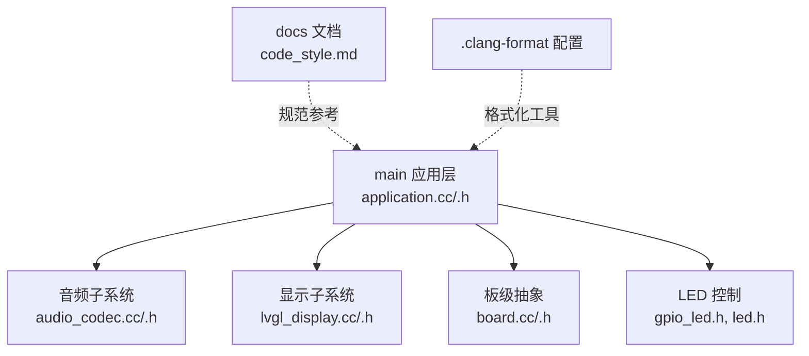
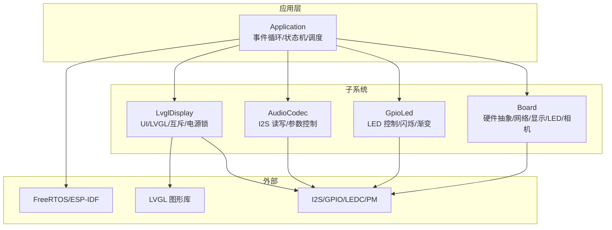
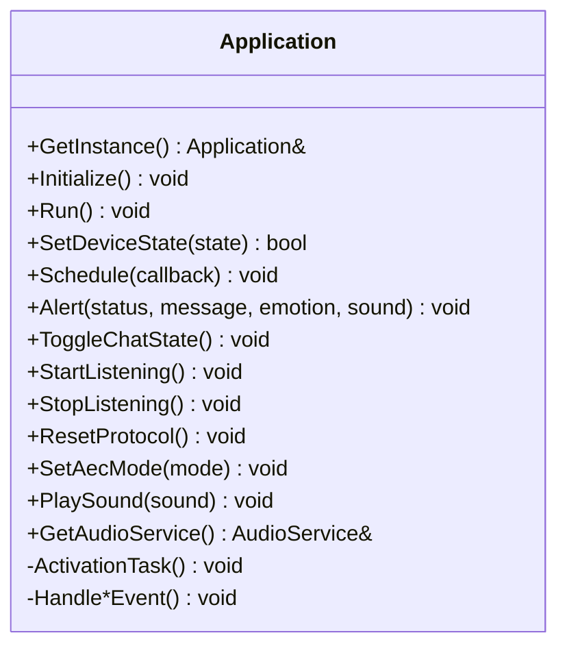
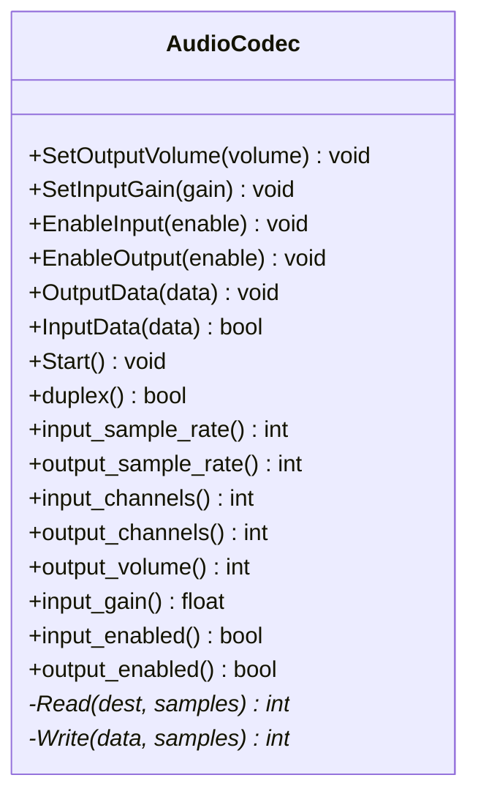
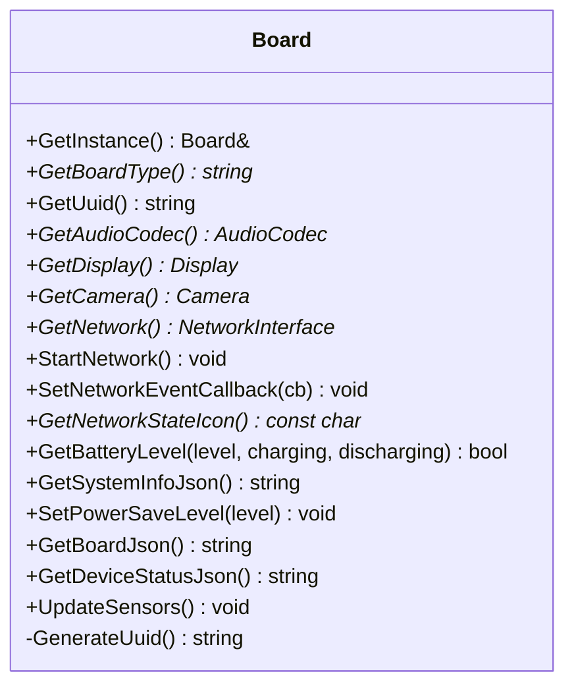
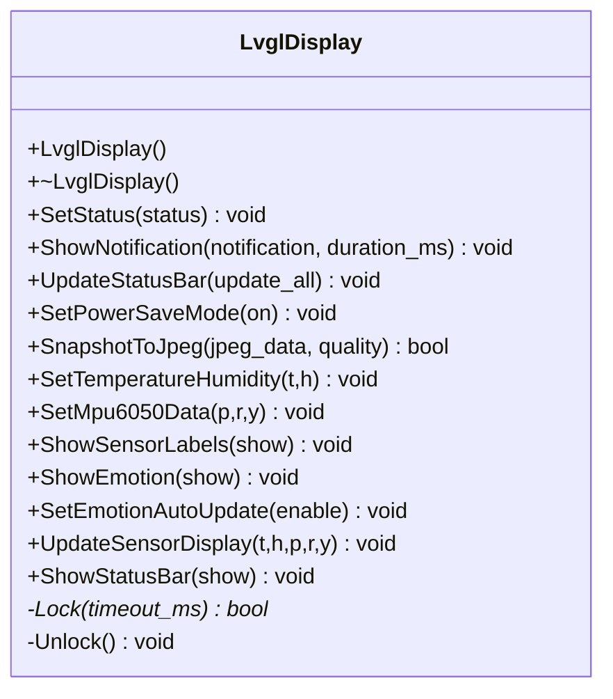
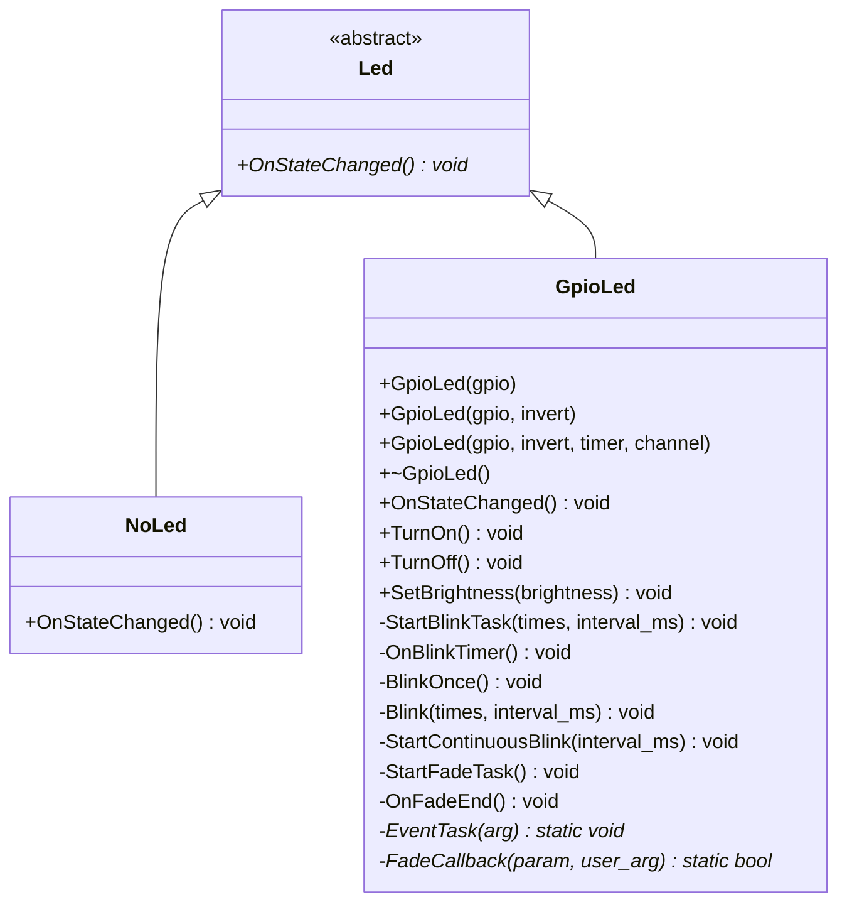
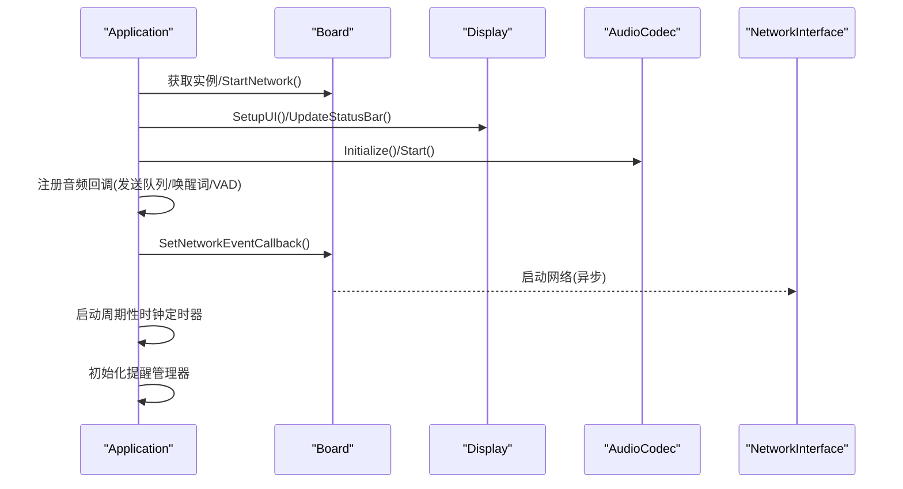
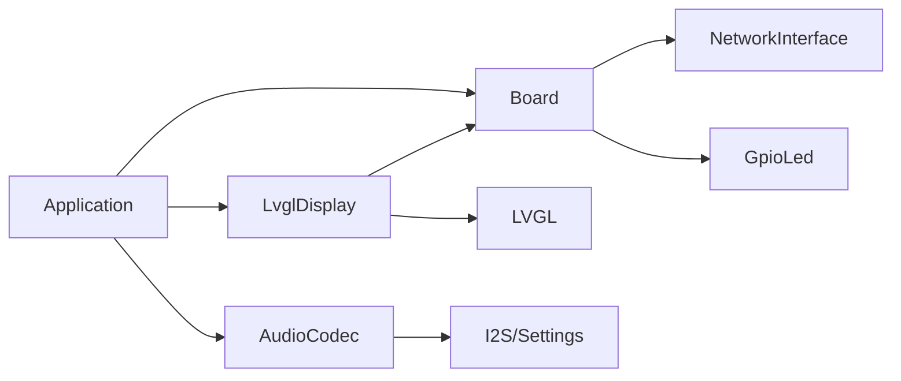

# 代码规范

<cite>
**本文档引用的文件**
- [.clang-format](file://.clang-format)
- [docs/code_style.md](file://docs/code_style.md)
- [README.md](file://README.md)
- [main/application.h](file://main/application.h)
- [main/application.cc](file://main/application.cc)
- [main/audio/audio_codec.h](file://main/audio/audio_codec.h)
- [main/audio/audio_codec.cc](file://main/audio/audio_codec.cc)
- [main/boards/common/board.h](file://main/boards/common/board.h)
- [main/boards/common/board.cc](file://main/boards/common/board.cc)
- [main/display/lvgl_display/lvgl_display.h](file://main/display/lvgl_display/lvgl_display.h)
- [main/display/lvgl_display/lvgl_display.cc](file://main/display/lvgl_display/lvgl_display.cc)
- [main/led/led.h](file://main/led/led.h)
- [main/led/gpio_led.h](file://main/led/gpio_led.h)
</cite>

## 目录
1. [引言](#引言)
2. [项目结构](#项目结构)
3. [核心组件](#核心组件)
4. [架构总览](#架构总览)
5. [详细组件分析](#详细组件分析)
6. [依赖分析](#依赖分析)
7. [性能考虑](#性能考虑)
8. [故障排查指南](#故障排查指南)
9. [结论](#结论)
10. [附录](#附录)

## 引言
本文件为 ESP32-AI 项目的全面代码规范标准，覆盖 C++ 编码规范、clang-format 使用与配置、头文件包含顺序、函数声明与实现格式、类设计原则、命名空间与常量定义、错误处理、内存管理与线程安全最佳实践，并提供代码审查清单与质量检查标准。所有规范均以仓库现有配置与代码实现为依据，确保一致性与可维护性。

## 项目结构
项目采用模块化分层组织，主要目录与职责如下：
- main：应用主逻辑、音频子系统、显示子系统、板级抽象、协议与网络等
- docs：开发与规范文档
- scripts：构建与资源处理脚本
- partitions：分区表
- 根目录：构建配置、格式化配置与顶层说明

图表来源
- [main/application.cc:1-200](file://main/application.cc#L1-L200)
- [main/audio/audio_codec.cc:1-68](file://main/audio/audio_codec.cc#L1-L68)
- [main/display/lvgl_display/lvgl_display.cc:1-200](file://main/display/lvgl_display/lvgl_display.cc#L1-L200)
- [main/boards/common/board.cc:1-179](file://main/boards/common/board.cc#L1-L179)
- [docs/code_style.md:1-91](file://docs/code_style.md#L1-L91)
- [.clang-format:1-126](file://.clang-format#L1-L126)

章节来源
- [README.md:105-128](file://README.md#L105-L128)

## 核心组件
- 应用入口与事件循环：Application 类负责初始化、状态机驱动、事件调度与资源复位，体现事件驱动与线程安全设计。
- 音频编解码：AudioCodec 抽象类封装 I2S 读写与参数控制，支持输入增益、输出音量与启停。
- 板级抽象：Board 抽象类统一硬件能力接口，提供网络、显示、LED、相机、电源管理等能力。
- 显示系统：LvglDisplay 实现基于 LVGL 的 UI 更新、通知与传感器数据显示，包含互斥锁与电源锁保护。
- LED 控制：Led 抽象基类与 GpioLed 实现，支持亮度调节、闪烁与渐变等行为。

章节来源
- [main/application.h:50-194](file://main/application.h#L50-L194)
- [main/application.cc:85-199](file://main/application.cc#L85-L199)
- [main/audio/audio_codec.h:17-59](file://main/audio/audio_codec.h#L17-L59)
- [main/audio/audio_codec.cc:11-67](file://main/audio/audio_codec.cc#L11-L67)
- [main/boards/common/board.h:49-86](file://main/boards/common/board.h#L49-L86)
- [main/boards/common/board.cc:15-46](file://main/boards/common/board.cc#L15-L46)
- [main/display/lvgl_display/lvgl_display.h:15-64](file://main/display/lvgl_display/lvgl_display.h#L15-L64)
- [main/display/lvgl_display/lvgl_display.cc:19-78](file://main/display/lvgl_display/lvgl_display.cc#L19-L78)
- [main/led/led.h:4-17](file://main/led/led.h#L4-L17)
- [main/led/gpio_led.h:13-47](file://main/led/gpio_led.h#L13-L47)

## 架构总览
系统采用“应用层-子系统-板级抽象”的分层架构，应用层通过事件组与定时器协调各子系统；音频与显示通过互斥与电源锁保证线程安全与性能；板级抽象屏蔽硬件差异，便于多硬件平台适配。

图表来源
- [main/application.cc:85-199](file://main/application.cc#L85-L199)
- [main/display/lvgl_display/lvgl_display.cc:19-78](file://main/display/lvgl_display/lvgl_display.cc#L19-L78)
- [main/audio/audio_codec.cc:11-67](file://main/audio/audio_codec.cc#L11-L67)
- [main/boards/common/board.cc:15-46](file://main/boards/common/board.cc#L15-L46)
- [main/led/gpio_led.h:13-47](file://main/led/gpio_led.h#L13-L47)

## 详细组件分析

### 组件一：Application（应用入口与事件循环）
- 设计要点
  - 单例模式与删除拷贝构造/赋值，避免并发误用
  - 事件组与定时器驱动状态机与 UI 更新
  - 通过 Schedule 将回调投递到主任务执行，保证线程安全
  - 资源复位与 OTA、协议对象管理
- 关键接口与实现路径
  - 初始化与网络回调注册：[main/application.cc:85-199](file://main/application.cc#L85-L199)
  - 事件处理与状态切换：[main/application.cc:199-200](file://main/application.cc#L199-L200)
  - 公共接口声明：[main/application.h:50-194](file://main/application.h#L50-L194)

图表来源
- [main/application.h:50-194](file://main/application.h#L50-L194)
- [main/application.cc:85-199](file://main/application.cc#L85-L199)

章节来源
- [main/application.h:50-194](file://main/application.h#L50-L194)
- [main/application.cc:85-199](file://main/application.cc#L85-L199)

### 组件二：AudioCodec（音频编解码）
- 设计要点
  - 纯虚函数 Read/Write 由派生类实现，统一接口
  - 参数持久化与日志记录，便于调试
  - 启动时从设置加载音量等参数
- 关键接口与实现路径
  - 接口声明：[main/audio/audio_codec.h:17-59](file://main/audio/audio_codec.h#L17-L59)
  - 启动与参数设置：[main/audio/audio_codec.cc:11-67](file://main/audio/audio_codec.cc#L11-L67)

图表来源
- [main/audio/audio_codec.h:17-59](file://main/audio/audio_codec.h#L17-L59)
- [main/audio/audio_codec.cc:11-67](file://main/audio/audio_codec.cc#L11-L67)

章节来源
- [main/audio/audio_codec.h:17-59](file://main/audio/audio_codec.h#L17-L59)
- [main/audio/audio_codec.cc:11-67](file://main/audio/audio_codec.cc#L11-L67)

### 组件三：Board（板级抽象）
- 设计要点
  - 单例工厂 create_board 返回具体硬件实例
  - 提供网络、显示、LED、相机、电源管理等统一接口
  - UUID 生成与持久化
- 关键接口与实现路径
  - 接口声明：[main/boards/common/board.h:49-86](file://main/boards/common/board.h#L49-L86)
  - UUID 生成与系统信息 JSON：[main/boards/common/board.cc:15-46](file://main/boards/common/board.cc#L15-L46)

图表来源
- [main/boards/common/board.h:49-86](file://main/boards/common/board.h#L49-L86)
- [main/boards/common/board.cc:15-46](file://main/boards/common/board.cc#L15-L46)

章节来源
- [main/boards/common/board.h:49-86](file://main/boards/common/board.h#L49-L86)
- [main/boards/common/board.cc:15-46](file://main/boards/common/board.cc#L15-L46)

### 组件四：LvglDisplay（显示系统）
- 设计要点
  - 基于 LVGL 的 UI 更新，包含互斥锁与电源锁
  - 通知与状态栏更新，电池图标动态切换
  - 低电量弹窗与声音提示联动
- 关键接口与实现路径
  - 接口声明：[main/display/lvgl_display/lvgl_display.h:15-64](file://main/display/lvgl_display/lvgl_display.h#L15-L64)
  - 构造/析构与通知定时器：[main/display/lvgl_display/lvgl_display.cc:19-78](file://main/display/lvgl_display/lvgl_display.cc#L19-L78)
  - 状态栏与电池图标更新：[main/display/lvgl_display/lvgl_display.cc:121-200](file://main/display/lvgl_display/lvgl_display.cc#L121-L200)

图表来源
- [main/display/lvgl_display/lvgl_display.h:15-64](file://main/display/lvgl_display/lvgl_display.h#L15-L64)
- [main/display/lvgl_display/lvgl_display.cc:19-78](file://main/display/lvgl_display/lvgl_display.cc#L19-L78)

章节来源
- [main/display/lvgl_display/lvgl_display.h:15-64](file://main/display/lvgl_display/lvgl_display.h#L15-L64)
- [main/display/lvgl_display/lvgl_display.cc:19-78](file://main/display/lvgl_display/lvgl_display.cc#L19-L78)
- [main/display/lvgl_display/lvgl_display.cc:121-200](file://main/display/lvgl_display/lvgl_display.cc#L121-L200)

### 组件五：LED 控制（Led/GpioLed）
- 设计要点
  - Led 抽象基类定义状态变更回调
  - GpioLed 支持 PWM/LEDC、闪烁与渐变，内部使用互斥与定时器
- 关键接口与实现路径
  - 抽象基类：[main/led/led.h:4-17](file://main/led/led.h#L4-L17)
  - 具体实现：[main/led/gpio_led.h:13-47](file://main/led/gpio_led.h#L13-L47)

图表来源
- [main/led/led.h:4-17](file://main/led/led.h#L4-L17)
- [main/led/gpio_led.h:13-47](file://main/led/gpio_led.h#L13-L47)

章节来源
- [main/led/led.h:4-17](file://main/led/led.h#L4-L17)
- [main/led/gpio_led.h:13-47](file://main/led/gpio_led.h#L13-L47)

### API/服务组件调用序列（Application 初始化流程）

图表来源
- [main/application.cc:85-199](file://main/application.cc#L85-L199)
- [main/boards/common/board.h:76-78](file://main/boards/common/board.h#L76-L78)
- [main/display/lvgl_display/lvgl_display.cc:19-78](file://main/display/lvgl_display/lvgl_display.cc#L19-L78)
- [main/audio/audio_codec.cc:11-67](file://main/audio/audio_codec.cc#L11-L67)

## 依赖分析
- 组件耦合
  - Application 依赖 Board、Display、AudioCodec、Protocol/Ota、ReminderManager 等
  - LvglDisplay 依赖 Board、Application、Settings、LVGL
  - AudioCodec 依赖 Settings、I2S 驱动
  - Board 依赖 Settings、SystemInfo、Display/OledDisplay 等
- 外部依赖
  - FreeRTOS/ESP-IDF、LVGL、I2S/LEDC、PM 电源管理

图表来源
- [main/application.cc:85-199](file://main/application.cc#L85-L199)
- [main/display/lvgl_display/lvgl_display.cc:19-78](file://main/display/lvgl_display/lvgl_display.cc#L19-L78)
- [main/audio/audio_codec.cc:11-67](file://main/audio/audio_codec.cc#L11-L67)
- [main/boards/common/board.cc:15-46](file://main/boards/common/board.cc#L15-L46)

章节来源
- [main/application.cc:85-199](file://main/application.cc#L85-L199)
- [main/display/lvgl_display/lvgl_display.cc:19-78](file://main/display/lvgl_display/lvgl_display.cc#L19-L78)
- [main/audio/audio_codec.cc:11-67](file://main/audio/audio_codec.cc#L11-L67)
- [main/boards/common/board.cc:15-46](file://main/boards/common/board.cc#L15-L46)

## 性能考虑
- 电源管理
  - 显示更新使用电源锁，避免 UI 更新期间降频影响交互体验
  - 低电量场景触发声音提示，减少用户等待时间
- 线程与中断
  - GPIO 中断快速设置事件位，避免阻塞
  - 定时器回调在任务上下文执行，降低中断处理压力
- 内存与日志
  - 日志级别合理使用，避免频繁打印影响实时性
  - 参数持久化与默认值校验，减少运行期异常开销

章节来源
- [main/display/lvgl_display/lvgl_display.cc:19-78](file://main/display/lvgl_display/lvgl_display.cc#L19-L78)
- [main/application.cc:29-71](file://main/application.cc#L29-L71)
- [main/audio/audio_codec.cc:29-67](file://main/audio/audio_codec.cc#L29-L67)

## 故障排查指南
- clang-format 相关
  - 版本过低或配置冲突：确认使用项目根目录 .clang-format，检查版本与 UTF-8 编码
  - 个别代码不希望被格式化：使用注释块包裹
- 运行期问题
  - 显示未更新：确认 UI 已 SetupUI 并且标签创建成功
  - 低电量弹窗不出现：检查电池状态与 discharging 标志
  - 音频无声：检查输出音量与输出使能标志
- 线程与同步
  - UI 更新需加锁，避免 LVGL 对象并发访问
  - 事件投递使用 Schedule，避免跨任务直接调用

章节来源
- [docs/code_style.md:70-91](file://docs/code_style.md#L70-L91)
- [main/display/lvgl_display/lvgl_display.cc:80-119](file://main/display/lvgl_display/lvgl_display.cc#L80-L119)
- [main/audio/audio_codec.cc:40-67](file://main/audio/audio_codec.cc#L40-L67)

## 结论
本规范以现有 .clang-format 与代码实现为基础，明确了命名、缩进、注释、头文件包含顺序、函数声明与实现、类设计、命名空间与常量、错误处理、内存与线程安全等要求。遵循本规范有助于提升代码一致性、可读性与可维护性，降低集成与审查成本。

## 附录

### A. C++ 编码规范（基于仓库实践）
- 命名约定
  - 类型与类名：大驼峰（如 Application、AudioCodec、LvglDisplay）
  - 函数与方法：小驼峰（如 Initialize、SetStatus、OnStateChanged）
  - 常量与宏：全大写+下划线（如 MAIN_EVENT_*、AUDIO_CODEC_*）
  - 变量与成员：小驼峰（如 event_group_、output_volume_）
- 缩进与对齐
  - 使用 4 空格缩进，TabWidth=4，UseTab=Never
  - 指针与引用靠近类型（左对齐），如 int* ptr
- 注释标准
  - 类与公共接口使用 Javadoc 风格注释，说明用途、参数与副作用
  - 复杂逻辑添加行内注释，必要时标注 TODO/NOTE
- 头文件包含顺序
  - 本地头文件 → 第三方头文件 → 系统头文件
  - 项目内按层级组织，避免循环包含
- 函数声明与实现
  - 声明尽量前置，实现就近放置
  - 成员函数访问修饰符缩进 -4，保持一致
- 类设计原则
  - 单一职责，抽象与继承清晰
  - 纯虚函数用于接口约束，具体实现分离
  - RAII 管理资源，析构函数释放资源
- 命名空间与常量
  - 项目未广泛使用命名空间，避免过度嵌套
  - 常量使用 constexpr 或枚举，避免魔法数
- 错误处理
  - 使用 ESP-IDF 错误码与 ESP_LOG 宏，失败路径明确返回
  - 重要资源释放放在析构或显式 Reset 中
- 内存管理
  - 优先使用智能指针（如 unique_ptr），避免裸 new/delete
  - 静态/全局对象谨慎使用，确保生命周期可控
- 线程安全
  - UI 更新使用互斥锁（mutex）与锁守卫
  - 事件投递使用事件组与 Schedule，避免跨任务直接调用
  - FreeRTOS 对象（定时器、事件组）在构造/析构中正确创建/销毁

章节来源
- [.clang-format:60-126](file://.clang-format#L60-L126)
- [docs/code_style.md:60-91](file://docs/code_style.md#L60-L91)
- [main/application.h:50-194](file://main/application.h#L50-L194)
- [main/display/lvgl_display/lvgl_display.h:15-64](file://main/display/lvgl_display/lvgl_display.h#L15-L64)
- [main/led/gpio_led.h:13-47](file://main/led/gpio_led.h#L13-L47)

### B. clang-format 使用与配置
- 安装与 IDE 集成
  - Windows/Linux/macOS 分别使用包管理器安装 clang-format
  - VS Code/CLion 配置为 clang-format，启用保存时格式化
- 常用命令
  - 格式化单文件：clang-format -i path/to/file.cpp
  - 批量格式化：find main -iname *.h -o -iname *.cc | xargs clang-format -i
  - 提交前检查：clang-format --dry-run -Werror path/to/file.cpp
- 配置要点
  - 基于 Google 风格，列宽 100，大括号 Attach，指针对齐左对齐
  - 自动排序 include，类访问修饰符缩进 -4，空行保留 1 行

章节来源
- [docs/code_style.md:7-91](file://docs/code_style.md#L7-L91)
- [.clang-format:1-126](file://.clang-format#L1-L126)

### C. 代码审查清单
- 规范性
  - 是否通过 clang-format 检查
  - 命名是否符合约定，注释是否完整
- 正确性
  - 头文件包含顺序是否正确
  - 是否存在循环依赖
- 安全性
  - UI 更新是否加锁
  - 事件投递是否使用 Schedule
  - 资源释放是否完备（析构/Reset）
- 性能
  - 是否使用电源锁与最小化阻塞
  - 日志级别是否合理
- 可测试性
  - 是否具备必要的接口与可观测点

章节来源
- [docs/code_style.md:60-91](file://docs/code_style.md#L60-L91)
- [main/display/lvgl_display/lvgl_display.cc:19-78](file://main/display/lvgl_display/lvgl_display.cc#L19-L78)
- [main/application.cc:85-199](file://main/application.cc#L85-L199)