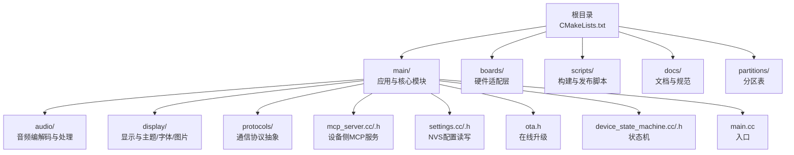
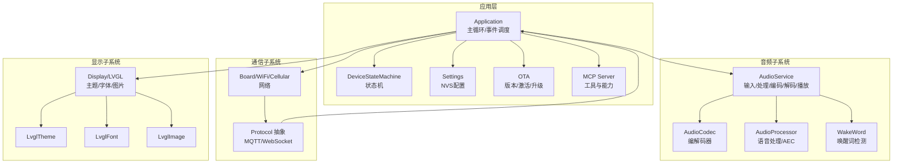
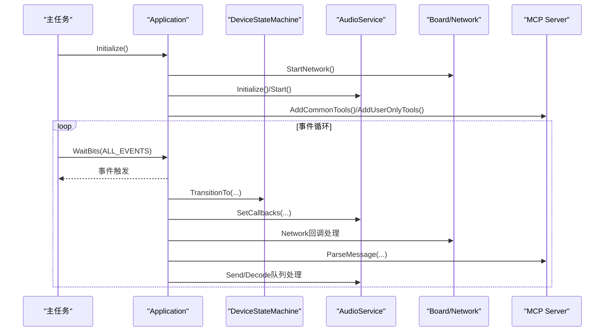
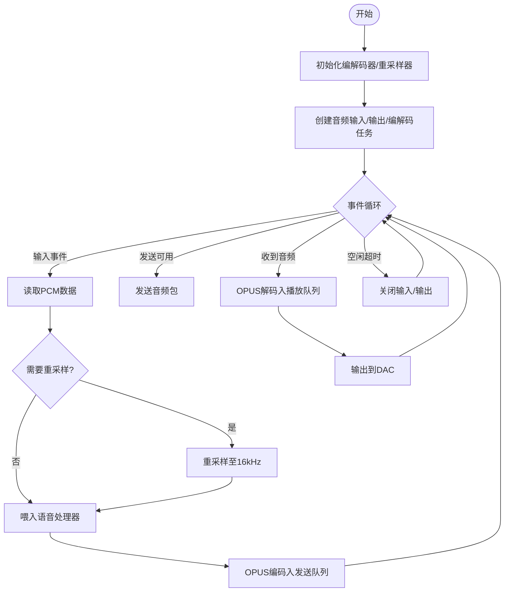
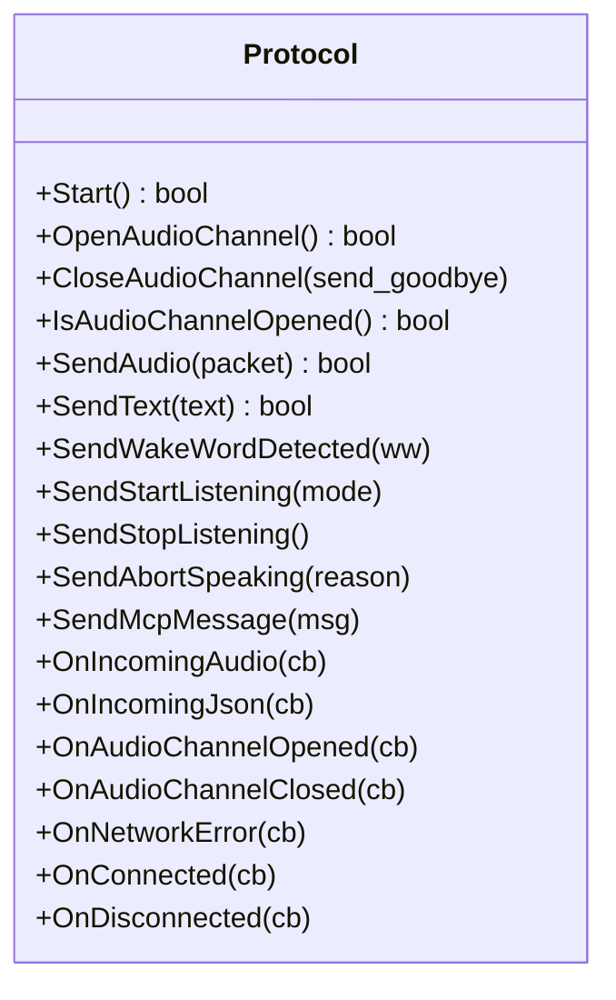
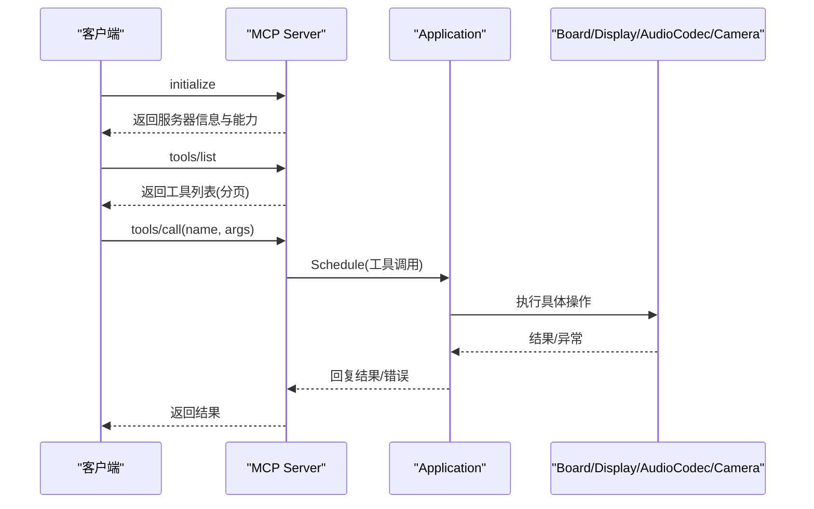
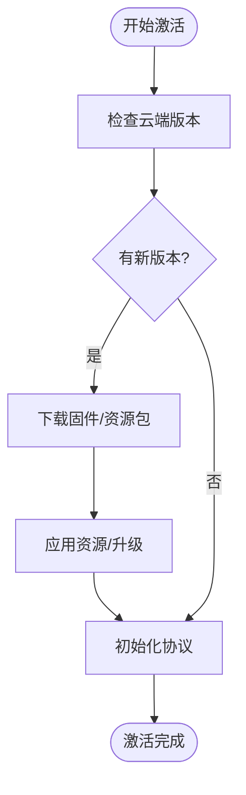
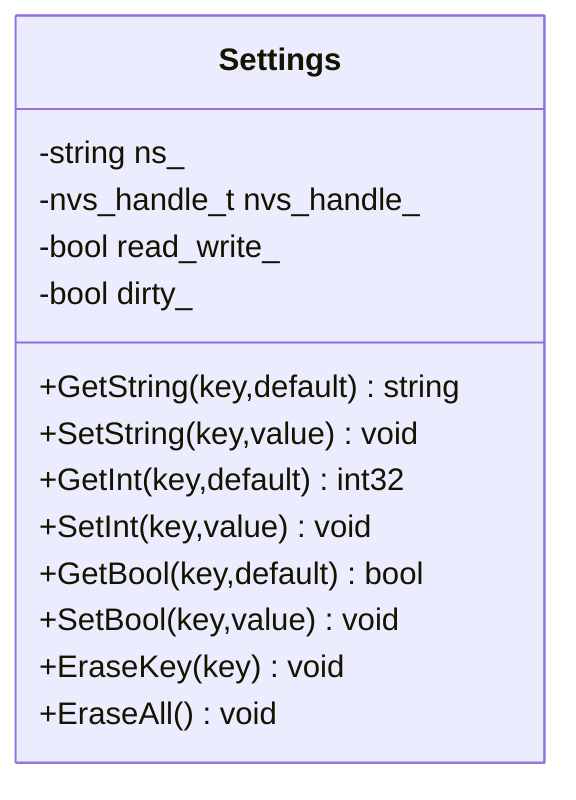
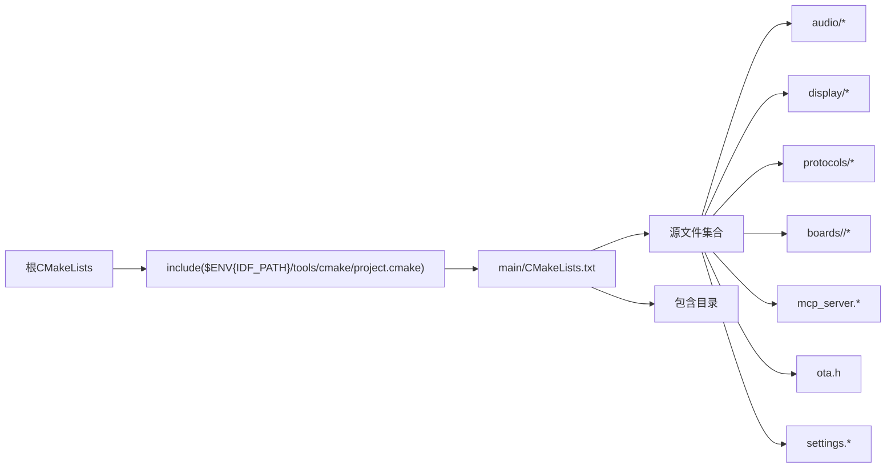

# 开发指南

<cite>
**本文档引用的文件**
- [README.md](file://README.md)
- [CMakeLists.txt](file://CMakeLists.txt)
- [main/CMakeLists.txt](file://main/CMakeLists.txt)
- [main/main.cc](file://main/main.cc)
- [main/application.h](file://main/application.h)
- [main/application.cc](file://main/application.cc)
- [main/device_state_machine.h](file://main/device_state_machine.h)
- [main/device_state_machine.cc](file://main/device_state_machine.cc)
- [main/settings.h](file://main/settings.h)
- [main/settings.cc](file://main/settings.cc)
- [main/ota.h](file://main/ota.h)
- [main/protocols/protocol.h](file://main/protocols/protocol.h)
- [main/audio/audio_service.h](file://main/audio/audio_service.h)
- [main/audio/audio_service.cc](file://main/audio/audio_service.cc)
- [main/mcp_server.h](file://main/mcp_server.h)
- [main/mcp_server.cc](file://main/mcp_server.cc)
- [docs/code_style.md](file://docs/code_style.md)
- [scripts/release.py](file://scripts/release.py)
</cite>

## 目录
1. [简介](#简介)
2. [项目结构](#项目结构)
3. [核心组件](#核心组件)
4. [架构总览](#架构总览)
5. [详细组件分析](#详细组件分析)
6. [依赖关系分析](#依赖关系分析)
7. [性能考虑](#性能考虑)
8. [故障排查指南](#故障排查指南)
9. [结论](#结论)
10. [附录](#附录)

## 简介
本指南面向ESP32-AI项目的开发者，提供从环境搭建到构建、调试、测试与持续集成的完整开发流程说明。内容覆盖代码风格、项目结构、头文件管理、依赖关系、API与注释规范、版本控制最佳实践、性能分析与内存泄漏检测、代码覆盖率分析、单元与集成测试策略、硬件测试方法以及CI/CD与自动化部署流程。目标是帮助新老开发者快速上手并高质量交付固件。

## 项目结构
项目采用ESP-IDF工程组织方式，核心源码位于main目录，按功能域划分为音频、显示、协议、MCP服务等模块；boards目录支持多种硬件平台；scripts提供打包与发布工具；docs包含代码风格与协议文档。



图示来源
- [CMakeLists.txt:1-17](file://CMakeLists.txt#L1-L17)
- [main/CMakeLists.txt:1-120](file://main/CMakeLists.txt#L1-L120)

章节来源
- [CMakeLists.txt:1-17](file://CMakeLists.txt#L1-L17)
- [main/CMakeLists.txt:1-120](file://main/CMakeLists.txt#L1-L120)

## 核心组件
- 应用入口与主循环：负责初始化硬件、网络、音频、显示与状态机，运行事件驱动主循环。
- 设备状态机：严格的状态转换规则与监听回调，保证系统行为可预测。
- 音频服务：多任务音频输入/输出与OPUS编解码流水线，支持唤醒词、语音处理与功耗管理。
- 协议抽象：统一音频通道打开/关闭、文本与二进制消息收发接口，支持MQTT/WebSocket。
- MCP服务：实现Model Context Protocol，提供设备能力清单与工具调用。
- OTA：版本检查、激活、固件升级与资源包更新。
- 配置存储：基于NVS的键值配置读写封装。

章节来源
- [main/main.cc:1-30](file://main/main.cc#L1-L30)
- [main/application.h:1-212](file://main/application.h#L1-L212)
- [main/application.cc:1-200](file://main/application.cc#L1-L200)
- [main/device_state_machine.h:1-84](file://main/device_state_machine.h#L1-L84)
- [main/device_state_machine.cc:1-162](file://main/device_state_machine.cc#L1-L162)
- [main/audio/audio_service.h:1-196](file://main/audio/audio_service.h#L1-L196)
- [main/audio/audio_service.cc:1-120](file://main/audio/audio_service.cc#L1-L120)
- [main/protocols/protocol.h:1-99](file://main/protocols/protocol.h#L1-L99)
- [main/mcp_server.h:1-120](file://main/mcp_server.h#L1-L120)
- [main/mcp_server.cc:1-120](file://main/mcp_server.cc#L1-L120)
- [main/ota.h:1-59](file://main/ota.h#L1-L59)
- [main/settings.h:1-29](file://main/settings.h#L1-L29)
- [main/settings.cc:1-109](file://main/settings.cc#L1-L109)

## 架构总览
系统采用“事件驱动 + 状态机 + 多任务音频流水线”的架构。应用主循环通过事件组协调网络、协议、音频与UI；音频服务通过独立任务完成采集、处理、编码、播放与解码；MCP服务提供设备侧工具能力；OTA负责版本与资源包管理。



图示来源
- [main/application.cc:80-200](file://main/application.cc#L80-L200)
- [main/device_state_machine.cc:108-131](file://main/device_state_machine.cc#L108-L131)
- [main/audio/audio_service.cc:126-168](file://main/audio/audio_service.cc#L126-L168)
- [main/protocols/protocol.h:44-95](file://main/protocols/protocol.h#L44-L95)
- [main/mcp_server.cc:35-132](file://main/mcp_server.cc#L35-L132)

## 详细组件分析

### 应用主循环与事件驱动
- 初始化阶段：启动显示、音频、网络回调、提醒管理、MCP工具注册。
- 事件循环：等待事件组位，分发处理网络连接、断开、激活完成、状态变化、按钮切换、开始/停止监听、音频发送、唤醒词检测、VAD变化、定时器等。
- 状态机：严格的状态转换与监听回调，避免非法跳转。
- 资源管理：激活完成后释放OTA对象，进入省电模式；时钟tick周期打印堆栈统计。



图示来源
- [main/application.cc:200-300](file://main/application.cc#L200-L300)
- [main/application.cc:300-382](file://main/application.cc#L300-L382)
- [main/device_state_machine.cc:108-131](file://main/device_state_machine.cc#L108-L131)

章节来源
- [main/application.h:60-140](file://main/application.h#L60-L140)
- [main/application.cc:80-200](file://main/application.cc#L80-L200)
- [main/application.cc:200-382](file://main/application.cc#L200-L382)

### 设备状态机
- 状态集合：未知、启动、Wi-Fi配置、空闲、连接中、监听、说话、升级、激活、音频测试、致命错误等。
- 转换规则：仅允许合法路径，非法转换记录警告日志。
- 观察者：状态变更通知回调，用于UI与业务逻辑联动。

```mermaid
stateDiagram-v2
[*] --> 未知
未知 --> 启动
启动 --> Wi-Fi配置
启动 --> 激活
Wi-Fi配置 --> 激活
Wi-Fi配置 --> 音频测试
激活 --> 升级
激活 --> 空闲
升级 --> 空闲
升级 --> 激活
空闲 --> 连接中
空闲 --> 监听
空闲 --> 说话
空闲 --> 激活
空闲 --> 升级
连接中 --> 空闲
连接中 --> 监听
监听 --> 说话
监听 --> 空闲
说话 --> 监听
说话 --> 空闲
```

图示来源
- [main/device_state_machine.cc:40-102](file://main/device_state_machine.cc#L40-L102)
- [main/device_state_machine.h:26-41](file://main/device_state_machine.h#L26-L41)

章节来源
- [main/device_state_machine.h:1-84](file://main/device_state_machine.h#L1-L84)
- [main/device_state_machine.cc:1-162](file://main/device_state_machine.cc#L1-L162)

### 音频服务与编解码流水线
- 任务分工：音频输入/输出/编解码三类任务分离，降低耦合与阻塞。
- 编解码参数：OPUS帧长、比特率、丢包/静音增强等配置。
- 队列与背压：发送/解码/播放/测试队列容量限制，防止内存膨胀。
- 功耗管理：空闲超时自动关闭输入/输出，保持TX时钟避免双工卡顿。
- 唤醒词与语音处理：可插拔处理器与唤醒词模型，支持设备端AEC。



图示来源
- [main/audio/audio_service.cc:63-124](file://main/audio/audio_service.cc#L63-L124)
- [main/audio/audio_service.cc:126-168](file://main/audio/audio_service.cc#L126-L168)
- [main/audio/audio_service.cc:292-327](file://main/audio/audio_service.cc#L292-L327)
- [main/audio/audio_service.cc:329-448](file://main/audio/audio_service.cc#L329-L448)
- [main/audio/audio_service.cc:684-700](file://main/audio/audio_service.cc#L684-L700)

章节来源
- [main/audio/audio_service.h:1-196](file://main/audio/audio_service.h#L1-L196)
- [main/audio/audio_service.cc:1-737](file://main/audio/audio_service.cc#L1-L737)

### 协议抽象与通信
- 统一接口：Start/Open/Close/Audio/Text/MCP消息发送。
- 二进制协议：定义二进制头部与负载，支持时间戳与校验扩展。
- 监听模式：自动/手动/实时（需AEC）三种模式。
- 错误处理：网络错误回调、超时检测、会话ID维护。



图示来源
- [main/protocols/protocol.h:44-95](file://main/protocols/protocol.h#L44-L95)

章节来源
- [main/protocols/protocol.h:1-99](file://main/protocols/protocol.h#L1-L99)

### MCP服务与工具系统
- 工具注册：通用工具（设备状态、音量、屏幕亮度/主题、拍照）与用户专用工具（系统信息、重启、升级、截图/预览）。
- 参数校验：属性类型、默认值、整数范围约束。
- 异步调用：工具调用在主线程执行，避免并发问题。
- 能力协商：解析客户端capabilities，动态配置视觉URL与令牌。



图示来源
- [main/mcp_server.cc:393-442](file://main/mcp_server.cc#L393-L442)
- [main/mcp_server.cc:461-515](file://main/mcp_server.cc#L461-L515)
- [main/mcp_server.cc:517-569](file://main/mcp_server.cc#L517-L569)

章节来源
- [main/mcp_server.h:1-345](file://main/mcp_server.h#L1-L345)
- [main/mcp_server.cc:1-570](file://main/mcp_server.cc#L1-L570)

### OTA与资源包管理
- 版本检查：云端版本对比，支持重试与延迟退避。
- 激活流程：下载资源包、应用资源、初始化协议、上报成功。
- 固件升级：异步升级与回滚策略，升级后重启生效。
- 时间同步：可选服务器时间校准。



图示来源
- [main/application.cc:364-382](file://main/application.cc#L364-L382)
- [main/application.cc:442-516](file://main/application.cc#L442-L516)
- [main/ota.h:15-33](file://main/ota.h#L15-L33)

章节来源
- [main/ota.h:1-59](file://main/ota.h#L1-L59)
- [main/application.cc:364-516](file://main/application.cc#L364-L516)

### 配置存储与持久化
- 命名空间隔离：不同模块使用独立命名空间，避免键冲突。
- 读写权限：只读/读写开关，写入时自动提交。
- 常用场景：语言、资产下载地址、设备标识等。



图示来源
- [main/settings.h:7-26](file://main/settings.h#L7-L26)
- [main/settings.cc:8-109](file://main/settings.cc#L8-L109)

章节来源
- [main/settings.h:1-29](file://main/settings.h#L1-L29)
- [main/settings.cc:1-109](file://main/settings.cc#L1-L109)

## 依赖关系分析
- 构建系统：顶层CMakeLists设置最小版本、链接libc、启用最小化构建；main/CMakeLists集中声明源文件与包含目录，动态根据CONFIG_BOARD_TYPE选择对应硬件板文件。
- 板级适配：boards/common提供通用外设抽象，各厂商/型号在各自目录下实现；通过Kconfig宏与CMake条件分支选择性编译。
- 第三方库：OPUS编解码、LVGL显示框架、cJSON序列化、ESP-ADF/ESP-SR模型等由ESP-IDF组件管理。
- 任务与事件：FreeRTOS事件组协调应用主循环与音频任务；音频服务内部使用互斥锁与条件变量保护队列。



图示来源
- [CMakeLists.txt:1-17](file://CMakeLists.txt#L1-L17)
- [main/CMakeLists.txt:1-120](file://main/CMakeLists.txt#L1-L120)

章节来源
- [CMakeLists.txt:1-17](file://CMakeLists.txt#L1-L17)
- [main/CMakeLists.txt:1-120](file://main/CMakeLists.txt#L1-L120)

## 性能考虑
- 音频功耗：空闲超时自动关闭输入/输出，避免长时间占用总线；双工模式下保持TX时钟。
- 队列背压：限制发送/解码/播放队列长度，防止内存峰值过高。
- 采样率重采样：输入/输出重采样器按需开启，减少不必要的CPU消耗。
- 任务优先级：主线程优先级固定，音频任务按需提高，避免抢占导致抖动。
- 日志与统计：定时打印堆栈统计，辅助定位内存压力与任务阻塞点。

章节来源
- [main/audio/audio_service.cc:684-700](file://main/audio/audio_service.cc#L684-L700)
- [main/application.cc:284-298](file://main/application.cc#L284-L298)

## 故障排查指南
- NVS初始化失败：首次运行擦除NVS修复损坏分区后重试。
- 网络连接异常：关注网络事件回调，区分WiFi/蜂窝注册与SIM/模组错误；断网时关闭音频通道。
- 音频无声/破音：检查编解码器采样率匹配、重采样器配置与队列拥塞；确认功耗定时器未提前关闭输出。
- 唤醒词无效：确认模型列表与目标平台匹配，切换输入/输出重采样器缓存。
- MCP工具报错：核对参数类型与范围，检查工具是否在当前会话可见（用户专用工具）。
- OTA失败：查看重试次数与延时，确认服务器时间与证书链；升级失败回滚策略。

章节来源
- [main/main.cc:16-23](file://main/main.cc#L16-L23)
- [main/application.cc:302-338](file://main/application.cc#L302-L338)
- [main/audio/audio_service.cc:470-484](file://main/audio/audio_service.cc#L470-L484)
- [main/mcp_server.cc:517-569](file://main/mcp_server.cc#L517-L569)

## 结论
本指南从工程化角度梳理了ESP32-AI项目的开发流程与关键组件，强调事件驱动、状态机与音频流水线的设计思想，提供从本地开发到自动化发布的全链路实践建议。遵循本文档可显著提升开发效率与代码质量，降低跨平台移植与集成风险。

## 附录

### 开发环境搭建
- 推荐使用VSCode或Cursor，安装ESP-IDF插件，SDK版本≥5.4。
- Linux编译更快且驱动问题更少。
- 代码风格遵循Google C++风格，使用clang-format统一格式。

章节来源
- [README.md:115-128](file://README.md#L115-L128)
- [docs/code_style.md:1-91](file://docs/code_style.md#L1-L91)

### 代码风格与注释规范
- 使用clang-format，配置文件位于项目根目录。
- 头文件保护、函数签名与类成员注释遵循现有模板。
- 关键算法与复杂流程配合流程图/时序图说明。

章节来源
- [docs/code_style.md:1-91](file://docs/code_style.md#L1-L91)

### 构建与调试技巧
- 最小化构建：启用MINIMAL_BUILD减少编译时间与镜像体积。
- 板级选择：通过CONFIG_BOARD_TYPE与CMake条件分支选择对应源文件。
- 调试：使用ESP_LOG系列输出，结合RTOS监视器与GDB；音频问题优先检查队列长度与重采样器。

章节来源
- [CMakeLists.txt:11-17](file://CMakeLists.txt#L11-L17)
- [main/CMakeLists.txt:97-120](file://main/CMakeLists.txt#L97-L120)

### 版本控制最佳实践
- 分支策略：稳定版本打标签，长期维护分支至指定日期。
- 兼容性：v2与v1分区不兼容，可通过手动刷写升级。
- 提交流程：提交前格式化，避免手动破坏格式化结果。

章节来源
- [README.md:15-21](file://README.md#L15-L21)
- [docs/code_style.md:73-78](file://docs/code_style.md#L73-L78)

### 性能分析与内存泄漏检测
- 内存统计：定期打印堆栈统计，定位内存增长趋势。
- 音频瓶颈：检查发送/解码队列长度与任务优先级。
- 工具建议：使用ESP-IDF性能分析工具与静态分析器，结合覆盖率工具评估测试完整性。

章节来源
- [main/application.cc:294-298](file://main/application.cc#L294-L298)

### 单元测试、集成测试与硬件测试
- 单测：针对纯函数与无外部依赖模块（如Settings、MCP工具参数校验）编写单元测试。
- 集成测试：模拟协议收发与状态机转换，验证音频流水线与UI联动。
- 硬件测试：按键/触摸/显示/麦克风/扬声器/网络连通性与OTA升级路径。

章节来源
- [main/settings.cc:21-109](file://main/settings.cc#L21-L109)
- [main/mcp_server.h:58-122](file://main/mcp_server.h#L58-L122)

### 持续集成与自动化部署
- 发布脚本：遍历boards配置，设置目标芯片、追加sdkconfig、构建、合并bin并打包。
- 批量编译：支持按厂商/变体过滤，生成多目标固件包。
- CI建议：在GitHub Actions中集成脚本，自动构建并上传制品。

章节来源
- [scripts/release.py:219-297](file://scripts/release.py#L219-L297)
- [scripts/release.py:302-360](file://scripts/release.py#L302-L360)