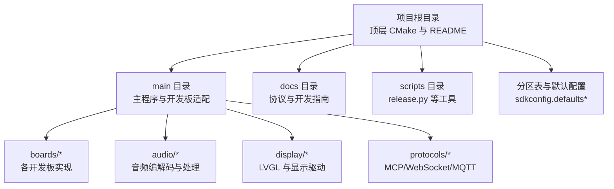
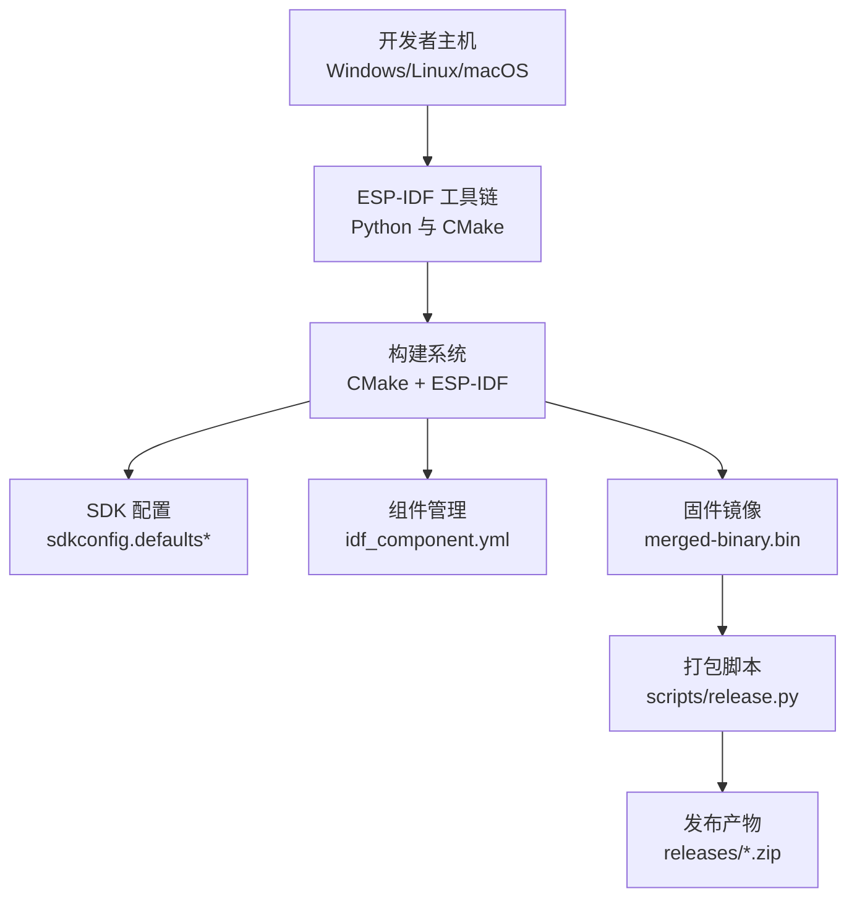
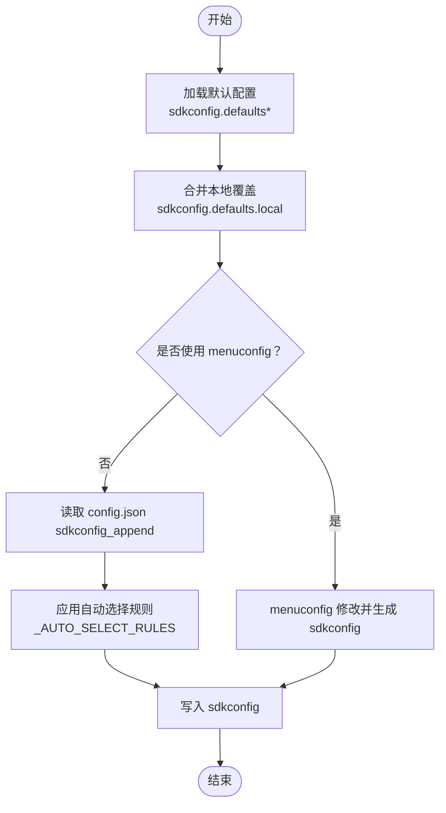
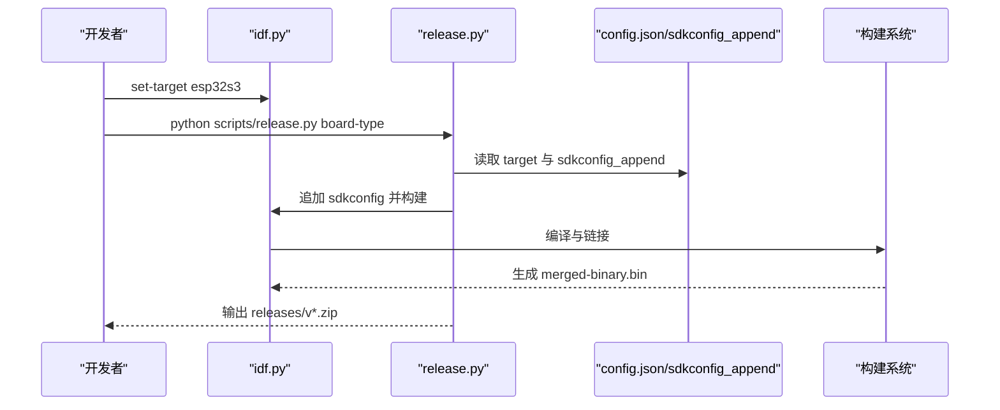
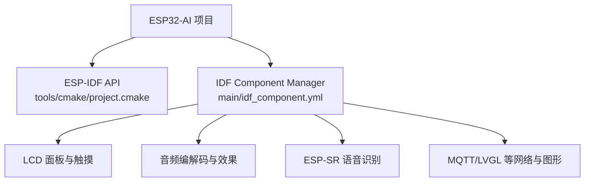

# 开发环境搭建

<cite>
**本文引用的文件**
- [README.md](file://README.md)
- [README_zh.md](file://README_zh.md)
- [sdkconfig.defaults](file://sdkconfig.defaults)
- [sdkconfig.defaults.esp32](file://sdkconfig.defaults.esp32)
- [sdkconfig.defaults.esp32s3](file://sdkconfig.defaults.esp32s3)
- [sdkconfig.defaults.local](file://sdkconfig.defaults.local)
- [CMakeLists.txt](file://CMakeLists.txt)
- [main/CMakeLists.txt](file://main/CMakeLists.txt)
- [main/idf_component.yml](file://main/idf_component.yml)
- [docs/custom-board.md](file://docs/custom-board.md)
- [docs/code_style.md](file://docs/code_style.md)
- [scripts/release.py](file://scripts/release.py)
</cite>

## 目录
1. [简介](#简介)
2. [项目结构](#项目结构)
3. [核心组件](#核心组件)
4. [架构总览](#架构总览)
5. [详细组件分析](#详细组件分析)
6. [依赖分析](#依赖分析)
7. [性能考虑](#性能考虑)
8. [故障排查指南](#故障排查指南)
9. [结论](#结论)
10. [附录](#附录)

## 简介
本指南面向首次参与 ESP32-AI 项目的开发者，提供跨平台（Windows、Linux、macOS）的完整开发环境搭建方案，涵盖 ESP-IDF 框架安装、工具链与 Python 环境配置、IDE（VS Code、CLion）插件与设置、SDK 配置文件（sdkconfig）的含义与自定义方法、以及常见问题的验证与排错步骤。项目采用 ESP-IDF 5.5+，支持 ESP32、ESP32-S3、ESP32-P4 等芯片平台，配套丰富的屏幕、音频、网络与 AI 能力。

## 项目结构
- 根目录包含顶层 CMake 构建入口、README 文档、默认 SDK 配置模板与脚本工具。
- main 目录包含主程序源码、各开发板适配层、Kconfig 与组件清单。
- docs 目录提供协议、自定义开发板、代码风格等技术文档。
- scripts 目录提供一键编译打包脚本，简化多变体固件产出。

**图表来源**
- [CMakeLists.txt:1-17](file://CMakeLists.txt#L1-L17)
- [main/CMakeLists.txt:1-120](file://main/CMakeLists.txt#L1-L120)
- [main/idf_component.yml:1-129](file://main/idf_component.yml#L1-L129)

**章节来源**
- [CMakeLists.txt:1-17](file://CMakeLists.txt#L1-L17)
- [README.md:115-121](file://README.md#L115-L121)

## 核心组件
- 构建系统与工具链
  - 顶层 CMake 通过 ESP-IDF 提供的 project.cmake 引入构建流程，启用最小化构建以缩短编译时间。
  - 顶层 CMake 还显式链接 libc 以解决符号问题，并设置项目版本号。
- 组件管理
  - 使用 IDF Component Manager 清单声明依赖，覆盖 LCD 面板、触摸、音频编解码、ESP-SR、MQTT、LVGL 等生态组件。
- SDK 配置
  - 默认配置文件按芯片族与功能场景提供优化项，如分区表、SPIRAM、任务看门狗、LVGL 图形等。
- 开发板适配
  - main/CMakeLists.txt 依据 Kconfig 选择具体开发板源码与资源，实现多板适配与差异化构建。

**章节来源**
- [CMakeLists.txt:1-17](file://CMakeLists.txt#L1-L17)
- [main/idf_component.yml:1-129](file://main/idf_component.yml#L1-L129)
- [sdkconfig.defaults:1-79](file://sdkconfig.defaults#L1-L79)
- [sdkconfig.defaults.esp32:1-7](file://sdkconfig.defaults.esp32#L1-L7)
- [sdkconfig.defaults.esp32s3:1-32](file://sdkconfig.defaults.esp32s3#L1-L32)
- [main/CMakeLists.txt:90-120](file://main/CMakeLists.txt#L90-L120)

## 架构总览
ESP32-AI 的开发环境围绕 ESP-IDF 构建，结合 Python 工具链与组件管理，形成“配置—编译—打包”的流水线。

**图表来源**
- [CMakeLists.txt:1-17](file://CMakeLists.txt#L1-L17)
- [main/idf_component.yml:125-129](file://main/idf_component.yml#L125-L129)
- [scripts/release.py:219-298](file://scripts/release.py#L219-L298)

## 详细组件分析

### ESP-IDF 安装与工具链
- 系统要求
  - 项目明确建议使用 Linux 以获得更快编译速度与更少驱动问题；同时支持 Windows 与 macOS。
- 安装步骤（通用）
  - 安装 Python（建议使用现代版本，满足项目脚本需求）。
  - 安装 ESP-IDF（版本需满足组件清单中的最低要求）。
  - 配置环境变量（IDF_PATH、IDF_TARGET 等），确保命令行可调用 idf.py。
  - 验证安装：运行 idf.py –version 与 idf.py set-target esp32s3（或对应目标）。
- Windows 特别注意
  - 推荐使用 WSL2 以获得更接近 Linux 的开发体验。
  - 若直接在原生 Windows 上开发，确保安装正确的驱动与串口工具。
- macOS 特别注意
  - 安装 Xcode Command Line Tools，确保 clang、git、CMake 可用。
- Linux 特别注意
  - 安装必要系统依赖（如 libfuse、libusb、python3-venv 等），视发行版而定。

**章节来源**
- [README.md:117-121](file://README.md#L117-L121)
- [README_zh.md:117-121](file://README_zh.md#L117-L121)
- [main/idf_component.yml:125-129](file://main/idf_component.yml#L125-L129)

### SDK 配置文件（sdkconfig）与自定义
- 默认配置文件
  - sdkconfig.defaults：适用于大多数场景的基础配置，包含分区表、内存与 LVGL 优化等。
  - sdkconfig.defaults.esp32 / sdkconfig.defaults.esp32s3：按芯片族的特定优化项（如 SPIRAM、CPU 频率、LVGL 图形等）。
  - sdkconfig.defaults.local：本地覆盖项，常用于开发板类型与特定显示面板的选择。
- 自定义方法
  - 使用 idf.py menuconfig 修改并生成 sdkconfig。
  - 通过 config.json 的 sdkconfig_append 追加项，配合 scripts/release.py 自动注入。
  - 通过 sdkconfig.defaults.local 覆盖 BOARD_TYPE 与显示面板等选项。
- 常见自定义点
  - 目标芯片：使用 idf.py set-target 或在 release.py 中传入 target。
  - 分区表：通过 CONFIG_PARTITION_TABLE_CUSTOM_FILENAME 指向 v2 分区表。
  - 语言与表情：通过 CONFIG_LANGUAGE_* 与 LVGL 字体/表情集合配置。
  - 显示面板：通过 CONFIG_LCD_* 或 CONFIG_LV_* 选择具体驱动与尺寸。

**图表来源**
- [sdkconfig.defaults:1-79](file://sdkconfig.defaults#L1-L79)
- [sdkconfig.defaults.local:1-16](file://sdkconfig.defaults.local#L1-L16)
- [scripts/release.py:164-204](file://scripts/release.py#L164-L204)

**章节来源**
- [sdkconfig.defaults:1-79](file://sdkconfig.defaults#L1-L79)
- [sdkconfig.defaults.esp32:1-7](file://sdkconfig.defaults.esp32#L1-L7)
- [sdkconfig.defaults.esp32s3:1-32](file://sdkconfig.defaults.esp32s3#L1-L32)
- [sdkconfig.defaults.local:1-16](file://sdkconfig.defaults.local#L1-L16)
- [docs/custom-board.md:88-134](file://docs/custom-board.md#L88-L134)
- [scripts/release.py:219-298](file://scripts/release.py#L219-L298)

### IDE 配置指南（VS Code、CLion）
- VS Code
  - 安装 ESP-IDF 插件，选择 SDK 版本 5.4 或以上。
  - 在设置中启用 clang-format，确保代码风格符合 Google C++ 规范。
  - 保存时自动格式化可选：editor.formatOnSave: true。
- CLion
  - 设置 Editor > Code Style > C/C++ 使用 clang-format。
  - 选择项目根目录下的 .clang-format 配置文件。
- 通用建议
  - 使用 idf.py 命令行作为主要构建入口，IDE 仅用于编辑与调试。
  - 在 VS Code 中可配置任务与启动配置，便于一键构建与下载。

**章节来源**
- [README.md:117-121](file://README.md#L117-L121)
- [docs/code_style.md:48-59](file://docs/code_style.md#L48-L59)

### Python 环境与依赖管理
- Python 环境
  - 建议使用虚拟环境隔离项目依赖，避免与系统 Python 冲突。
  - 安装项目脚本所需的依赖（如脚本中使用的模块）。
- 依赖库管理
  - 顶层 CMake 与 scripts/release.py 依赖 idf.py 与 ESP-IDF 工具链。
  - 组件清单通过 idf_component.yml 管理，确保版本与目标芯片兼容。

**章节来源**
- [scripts/release.py:1-360](file://scripts/release.py#L1-L360)
- [main/idf_component.yml:125-129](file://main/idf_component.yml#L125-L129)

### 虚拟环境与 PATH/环境变量
- 虚拟环境
  - 建议在项目根目录创建 venv 并激活，再安装所需 Python 包。
- PATH 与环境变量
  - 设置 IDF_PATH 指向 ESP-IDF 安装路径。
  - 将 idf.py 所在目录加入 PATH，确保命令行可用。
  - 如需固定目标芯片，可设置 IDF_TARGET（但推荐在构建时通过 idf.py set-target 指定）。

**章节来源**
- [CMakeLists.txt:11-11](file://CMakeLists.txt#L11-L11)
- [README.md:117-121](file://README.md#L117-L121)

### 开发板配置与构建流程
- 通过 Kconfig 选择 BOARD_TYPE，main/CMakeLists.txt 会动态添加对应开发板源码与资源。
- 使用 scripts/release.py 可自动：
  - 读取 config.json 的 target 与 sdkconfig_append。
  - 设置目标芯片、追加配置、构建、合并二进制并打包为 zip。
- 自定义开发板
  - 参考自定义开发板指南，创建目录、编写 config.h/config.json、实现板级初始化类，并在 Kconfig 与 CMakeLists 中注册。

**图表来源**
- [main/CMakeLists.txt:90-120](file://main/CMakeLists.txt#L90-L120)
- [scripts/release.py:219-298](file://scripts/release.py#L219-L298)
- [docs/custom-board.md:344-390](file://docs/custom-board.md#L344-L390)

**章节来源**
- [main/CMakeLists.txt:90-120](file://main/CMakeLists.txt#L90-L120)
- [docs/custom-board.md:344-390](file://docs/custom-board.md#L344-L390)
- [scripts/release.py:219-298](file://scripts/release.py#L219-L298)

## 依赖分析
- 组件依赖
  - 项目依赖大量 ESP-ECOSYS 组件（如 LCD 面板、触摸、音频编解码、ESP-SR、MQTT、LVGL 等），并通过规则限定目标芯片。
- 最低 ESP-IDF 版本
  - 组件清单要求 idf 版本 >= 5.5.2，确保与工具链兼容。
- 构建裁剪
  - 顶层 CMake 启用 MINIMAL_BUILD，仅包含必要组件，提升编译效率。

**图表来源**
- [CMakeLists.txt:11-13](file://CMakeLists.txt#L11-L13)
- [main/idf_component.yml:1-129](file://main/idf_component.yml#L1-L129)

**章节来源**
- [main/idf_component.yml:125-129](file://main/idf_component.yml#L125-L129)
- [CMakeLists.txt:11-13](file://CMakeLists.txt#L11-L13)

## 性能考虑
- 编译性能
  - 使用 Linux 或 WSL2 获得最佳编译速度。
  - 启用 MINIMAL_BUILD 减少无关组件，缩短构建时间。
- 运行时性能
  - 合理配置 SPIRAM、缓存与任务栈大小，避免内存碎片与中断抖动。
  - LVGL 图形与音频处理对 CPU 与内存占用较高，需根据屏幕与音频需求选择合适字体与表情集。

[本节为通用指导，无需列出章节来源]

## 故障排查指南
- 构建失败
  - 确认 ESP-IDF 版本满足最低要求（>= 5.5.2）。
  - 检查 PATH 是否包含 idf.py 所在目录。
  - 使用 idf.py fullclean 清理旧配置后重新配置。
- 目标芯片错误
  - 使用 idf.py set-target 指定目标芯片，避免与默认值冲突。
- 开发板未生效
  - 确认 Kconfig 中 BOARD_TYPE 已勾选，main/CMakeLists.txt 中存在对应分支。
  - 若使用 release.py，确认 config.json 的 target 与 sdkconfig_append 正确。
- 显示异常
  - 检查 CONFIG_LCD_* 与 CONFIG_LV_* 选项是否与硬件匹配。
  - 确认 sdkconfig.defaults.local 中的覆盖项未误删。
- 代码风格问题
  - 使用 clang-format 格式化，或在 IDE 中启用自动格式化。

**章节来源**
- [main/idf_component.yml:125-129](file://main/idf_component.yml#L125-L129)
- [docs/code_style.md:70-91](file://docs/code_style.md#L70-L91)
- [sdkconfig.defaults.local:1-16](file://sdkconfig.defaults.local#L1-L16)
- [main/CMakeLists.txt:90-120](file://main/CMakeLists.txt#L90-L120)

## 结论
通过遵循本指南，您可以在 Windows、Linux、macOS 上快速搭建 ESP32-AI 的开发环境。重点在于：正确安装与配置 ESP-IDF 工具链、理解并自定义 sdkconfig 配置、合理使用 IDE 插件与 Python 工具链、以及按需裁剪组件以获得最佳性能。遇到问题时，优先检查最低 ESP-IDF 版本、目标芯片设置与开发板配置项。

[本节为总结，无需列出章节来源]

## 附录
- 快速验证清单
  - idf.py –version 输出版本号。
  - idf.py set-target esp32s3 成功。
  - idf.py menuconfig 可打开配置界面。
  - 生成并验证 merged-binary.bin。
  - 通过 release.py 产出 releases/v*.zip。

**章节来源**
- [README.md:117-121](file://README.md#L117-L121)
- [scripts/release.py:322-331](file://scripts/release.py#L322-L331)