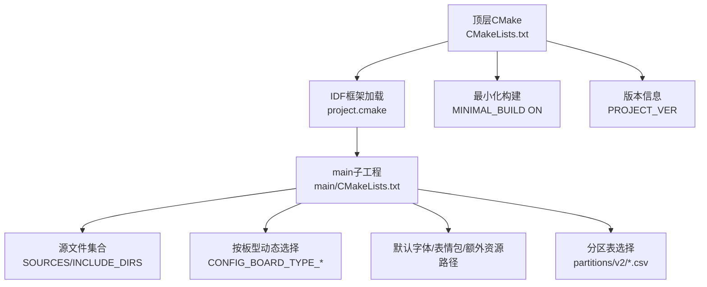
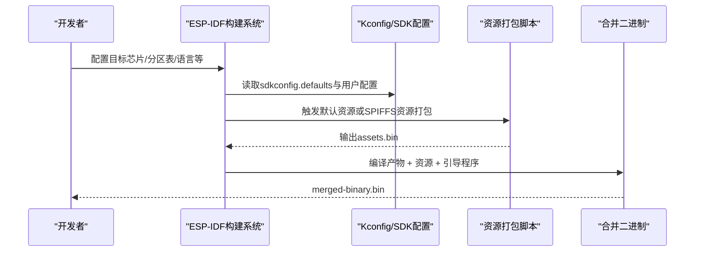
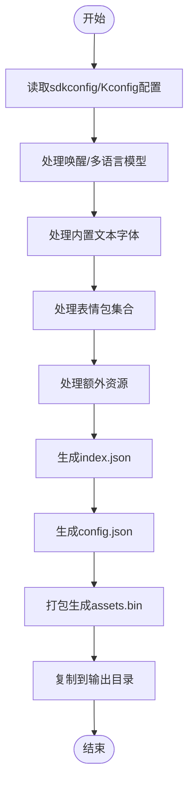
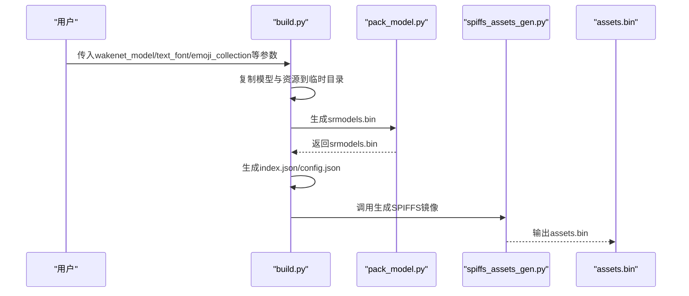
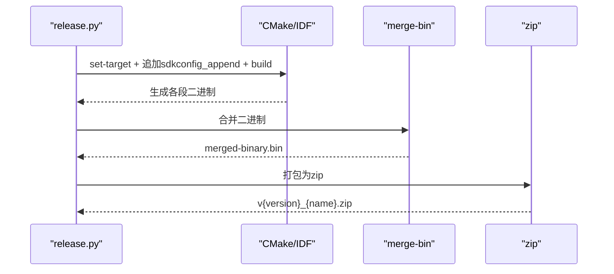
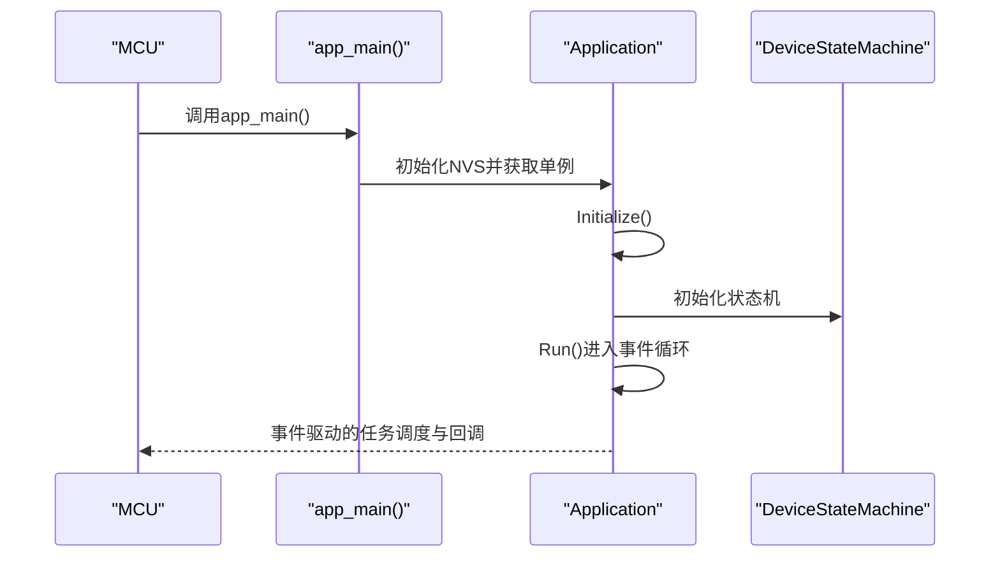
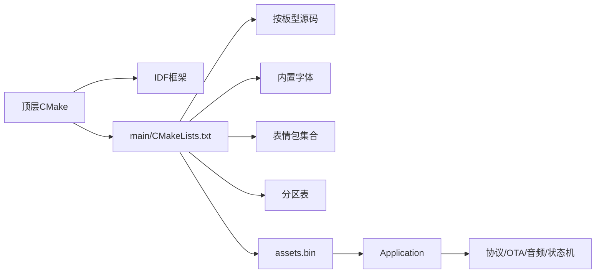

# 构建与测试

<cite>
**本文引用的文件**
- [CMakeLists.txt](file://CMakeLists.txt)
- [main/CMakeLists.txt](file://main/CMakeLists.txt)
- [sdkconfig.defaults](file://sdkconfig.defaults)
- [README.md](file://README.md)
- [scripts/build_default_assets.py](file://scripts/build_default_assets.py)
- [scripts/spiffs_assets/build.py](file://scripts/spiffs_assets/build.py)
- [scripts/release.py](file://scripts/release.py)
- [main/application.h](file://main/application.h)
- [main/main.cc](file://main/main.cc)
</cite>

## 目录
1. [简介](#简介)
2. [项目结构](#项目结构)
3. [核心组件](#核心组件)
4. [架构总览](#架构总览)
5. [详细组件分析](#详细组件分析)
6. [依赖关系分析](#依赖关系分析)
7. [性能考虑](#性能考虑)
8. [故障排查指南](#故障排查指南)
9. [结论](#结论)
10. [附录](#附录)

## 简介
本指南面向ESP32-AI项目的构建与测试，覆盖以下主题：
- 使用ESP-IDF CMake系统进行编译，包括编译选项、目标平台选择、分区表与资源打包。
- 默认资源构建与SPIFFS镜像生成流程。
- Debug与Release模式差异及常用编译命令与参数说明。
- 单元测试、集成测试与硬件测试的实施建议。
- 自动化测试脚本与自定义测试用例编写思路。
- 持续集成配置示例与构建流水线设置。
- 常见构建错误的诊断与解决方法。

## 项目结构
ESP32-AI采用ESP-IDF标准工程组织方式，顶层CMake负责引入IDF框架并启用最小化构建；主应用位于main目录，包含音频、显示、协议、设备状态机等模块，并通过CMake条件分支按不同开发板类型动态拼接源码与资源。

图表来源
- [CMakeLists.txt:1-17](file://CMakeLists.txt#L1-L17)
- [main/CMakeLists.txt:1-800](file://main/CMakeLists.txt#L1-L800)
- [sdkconfig.defaults:14-16](file://sdkconfig.defaults#L14-L16)

章节来源
- [CMakeLists.txt:1-17](file://CMakeLists.txt#L1-L17)
- [main/CMakeLists.txt:1-800](file://main/CMakeLists.txt#L1-L800)
- [sdkconfig.defaults:14-16](file://sdkconfig.defaults#L14-L16)

## 核心组件
- 构建系统与最小化构建：顶层CMake引入IDF并开启MINIMAL_BUILD，减少不必要的组件以缩短构建时间与减小镜像体积。
- 板型适配层：main/CMakeLists.txt根据CONFIG_BOARD_TYPE_*自动选择对应开发板源码、字体、表情包与分辨率等资源。
- 资源打包：提供两套资源打包方案：
  - 默认资源打包：scripts/build_default_assets.py读取sdkconfig与Kconfig配置，生成assets.bin并输出头文件供代码访问。
  - SPIFFS资源打包：scripts/spiffs_assets/build.py支持按板型合并表情、图标、布局等资源，生成assets.bin用于SPIFFS分区。
- 发布与打包：scripts/release.py可按各板型配置批量编译、合并二进制并打包发布。

章节来源
- [CMakeLists.txt:11-13](file://CMakeLists.txt#L11-L13)
- [main/CMakeLists.txt:97-737](file://main/CMakeLists.txt#L97-L737)
- [scripts/build_default_assets.py:1-800](file://scripts/build_default_assets.py#L1-L800)
- [scripts/spiffs_assets/build.py:1-400](file://scripts/spiffs_assets/build.py#L1-L400)
- [scripts/release.py:1-360](file://scripts/release.py#L1-L360)

## 架构总览
下图展示从配置到资源打包再到最终固件合并的关键步骤。

图表来源
- [sdkconfig.defaults:1-79](file://sdkconfig.defaults#L1-L79)
- [scripts/build_default_assets.py:750-800](file://scripts/build_default_assets.py#L750-L800)
- [scripts/spiffs_assets/build.py:340-397](file://scripts/spiffs_assets/build.py#L340-L397)
- [scripts/release.py:41-59](file://scripts/release.py#L41-L59)

## 详细组件分析

### CMake构建系统与编译选项
- 最小化构建：启用MINIMAL_BUILD以仅包含必要组件，加速构建并降低镜像大小。
- 版本号：通过PROJECT_VER设置版本字符串，便于发布与版本追踪。
- 链接与警告：显式链接libc并抑制特定字段初始化警告，确保符号解析与编译稳定性。
- 主工程：include IDF的project.cmake后，主工程在main目录中定义源文件、包含路径与板型选择逻辑。

章节来源
- [CMakeLists.txt:1-17](file://CMakeLists.txt#L1-L17)
- [main/CMakeLists.txt:1-800](file://main/CMakeLists.txt#L1-L800)

### 目标平台与分区表选择
- 分区表：默认使用partitions/v2/16m.csv，可通过sdkconfig.defaults修改分区表文件名与偏移。
- 目标芯片：通过release.py设置目标芯片（如esp32s3、esp32p4等），并在构建时传入宏定义BOARD_NAME与BOARD_TYPE。

章节来源
- [sdkconfig.defaults:14-16](file://sdkconfig.defaults#L14-L16)
- [scripts/release.py:274-289](file://scripts/release.py#L274-L289)

### 资源打包流程（默认资源）
默认资源打包由scripts/build_default_assets.py完成，主要流程如下：
- 解析sdkconfig中的唤醒词模型、多语言模型、内置字体与表情包集合等配置。
- 复制模型与资源至临时构建目录，生成index.json与config.json。
- 使用简化打包函数生成assets.bin，并输出头文件以供运行时访问。

图表来源
- [scripts/build_default_assets.py:456-622](file://scripts/build_default_assets.py#L456-L622)
- [scripts/build_default_assets.py:750-800](file://scripts/build_default_assets.py#L750-L800)

章节来源
- [scripts/build_default_assets.py:1-800](file://scripts/build_default_assets.py#L1-L800)

### 资源打包流程（SPIFFS镜像）
SPIFFS资源打包由scripts/spiffs_assets/build.py完成，支持按板型合并表情、图标与布局配置：
- 参数输入：wakenet_model、text_font、emoji_collection、res_path、target_board等。
- 处理流程：复制模型与资源，生成index.json与config.json，调用spiffs_assets_gen.py生成assets.bin。
- 输出：build/assets.bin可用于SPIFFS分区。

图表来源
- [scripts/spiffs_assets/build.py:340-397](file://scripts/spiffs_assets/build.py#L340-L397)

章节来源
- [scripts/spiffs_assets/build.py:1-400](file://scripts/spiffs_assets/build.py#L1-L400)

### 发布与打包（release.py）
release.py提供批量编译与打包能力：
- 支持列出所有受支持的板型与变体。
- 读取各板型config.json中的builds列表，按目标芯片与sdkconfig_append逐个编译。
- 调用idf.py merge-bin合并产物，并将merged-binary.bin压缩为releases/v{version}_{name}.zip。

图表来源
- [scripts/release.py:219-297](file://scripts/release.py#L219-L297)

章节来源
- [scripts/release.py:1-360](file://scripts/release.py#L1-L360)

### 应用入口与事件循环
应用入口位于main/main.cc，初始化NVS并启动Application单例；Application在main任务中运行事件循环，处理网络、状态机、音频与提醒等事件。

图表来源
- [main/main.cc:14-29](file://main/main.cc#L14-L29)
- [main/application.h:50-194](file://main/application.h#L50-L194)

章节来源
- [main/main.cc:1-30](file://main/main.cc#L1-L30)
- [main/application.h:1-212](file://main/application.h#L1-L212)

## 依赖关系分析
- 构建期依赖
  - 顶层CMake依赖IDF框架与MINIMAL_BUILD属性。
  - main/CMakeLists.txt依赖CONFIG_BOARD_TYPE_*与Kconfig变量，动态拼接源码与资源路径。
  - 资源脚本依赖sdkconfig与外部模型/字体/表情包目录。
- 运行期依赖
  - Application依赖协议、OTA、音频服务、设备状态机与提醒管理器等模块。
  - 事件组与定时器用于状态切换与周期性任务。

图表来源
- [CMakeLists.txt:11-13](file://CMakeLists.txt#L11-L13)
- [main/CMakeLists.txt:97-737](file://main/CMakeLists.txt#L97-L737)
- [sdkconfig.defaults:14-16](file://sdkconfig.defaults#L14-L16)

章节来源
- [CMakeLists.txt:1-17](file://CMakeLists.txt#L1-L17)
- [main/CMakeLists.txt:1-800](file://main/CMakeLists.txt#L1-L800)
- [sdkconfig.defaults:1-79](file://sdkconfig.defaults#L1-L79)

## 性能考虑
- 最小化构建：启用MINIMAL_BUILD可显著缩短构建时间并减小镜像体积，适合频繁迭代场景。
- 字体与表情包压缩：LVGL相关配置可控制字体格式与图片压缩策略，平衡存储占用与渲染性能。
- 内存与堆栈：适当调整主任务堆栈大小与WiFi缓冲参数，避免运行期内存压力。
- 资源打包：优先使用默认资源打包以减少SPIFFS碎片与IO开销；若需热更新可选SPIFFS镜像。

## 故障排查指南
- NVS初始化失败
  - 现象：首次烧录或升级后NVS损坏导致初始化失败。
  - 处理：擦除NVS分区后重试初始化。
  - 参考
    - [main/main.cc:16-23](file://main/main.cc#L16-L23)
- 分区表不匹配
  - 现象：v1到v2分区不兼容，OTA无法直接升级。
  - 处理：手动刷写v2固件或更换分区表。
  - 参考
    - [README.md:15-21](file://README.md#L15-L21)
    - [sdkconfig.defaults:14-16](file://sdkconfig.defaults#L14-L16)
- 资源打包失败
  - 现象：srmodels.bin生成失败或assets.bin为空。
  - 处理：检查wakenet/multinet模型路径与权限，确认emoji集合存在且包含有效图片。
  - 参考
    - [scripts/build_default_assets.py:157-203](file://scripts/build_default_assets.py#L157-L203)
    - [scripts/spiffs_assets/build.py:48-74](file://scripts/spiffs_assets/build.py#L48-L74)
- 目标芯片设置错误
  - 现象：编译报错或运行异常。
  - 处理：使用release.py设置正确目标芯片并重新编译。
  - 参考
    - [scripts/release.py:274-289](file://scripts/release.py#L274-L289)

章节来源
- [main/main.cc:16-23](file://main/main.cc#L16-L23)
- [README.md:15-21](file://README.md#L15-L21)
- [sdkconfig.defaults:14-16](file://sdkconfig.defaults#L14-L16)
- [scripts/build_default_assets.py:157-203](file://scripts/build_default_assets.py#L157-L203)
- [scripts/spiffs_assets/build.py:48-74](file://scripts/spiffs_assets/build.py#L48-L74)
- [scripts/release.py:274-289](file://scripts/release.py#L274-L289)

## 结论
本指南提供了ESP32-AI项目从配置、构建、资源打包到发布的完整路径。通过合理利用最小化构建、按板型动态选择与默认/SPFSS资源打包策略，可在保证功能完整性的同时提升开发效率与运行性能。结合release.py实现自动化打包与发布，有助于团队协作与版本管理。

## 附录

### 编译命令与参数说明（Debug与Release）
- 设置目标芯片
  - 示例：idf.py set-target esp32s3
- 追加SDK配置
  - 示例：追加sdkconfig_append项（如CONFIG_BOARD_TYPE_XXX=y）后再build
- 构建与合并
  - 示例：idf.py build；idf.py merge-bin
- 打包发布
  - 示例：python scripts/release.py board-type 或 python scripts/release.py --list-boards

章节来源
- [scripts/release.py:274-289](file://scripts/release.py#L274-L289)
- [scripts/release.py:322-331](file://scripts/release.py#L322-L331)

### 测试实施建议
- 单元测试
  - 建议针对Application事件处理、设备状态机与音频服务等模块编写可独立运行的测试用例，模拟事件触发与状态切换。
- 集成测试
  - 在真实开发板上验证网络连接、协议交互、语音唤醒与显示效果，记录不同板型下的行为差异。
- 硬件测试
  - 验证按键、屏幕、麦克风与扬声器等外设功能，关注不同电源管理策略对功耗与稳定性的影响。

### 持续集成配置示例
- GitHub Actions工作流建议
  - 步骤：检出代码 → 安装ESP-IDF → 设置目标芯片 → 读取sdkconfig.defaults → 构建 → 合并二进制 → 打包 → 上传Artifacts
  - 参考
    - [scripts/release.py:274-297](file://scripts/release.py#L274-L297)

### 常见构建错误与解决
- 缺少分区表文件：检查sdkconfig.defaults中的分区表路径是否正确。
- 资源目录不存在：确认模型与表情包目录存在且可读。
- 板型配置缺失：确保main/CMakeLists.txt中已定义对应CONFIG_BOARD_TYPE_*分支。

章节来源
- [sdkconfig.defaults:14-16](file://sdkconfig.defaults#L14-L16)
- [main/CMakeLists.txt:97-737](file://main/CMakeLists.txt#L97-L737)