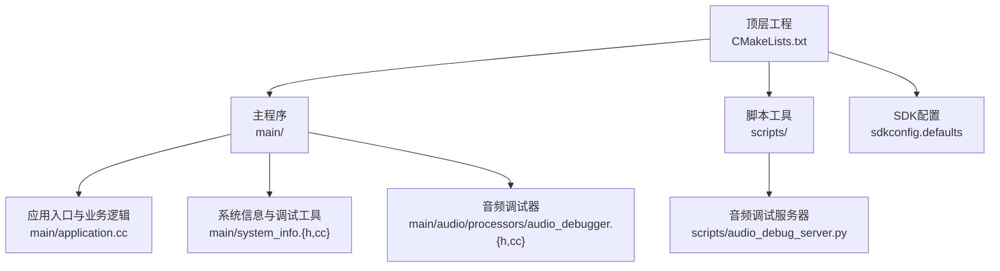
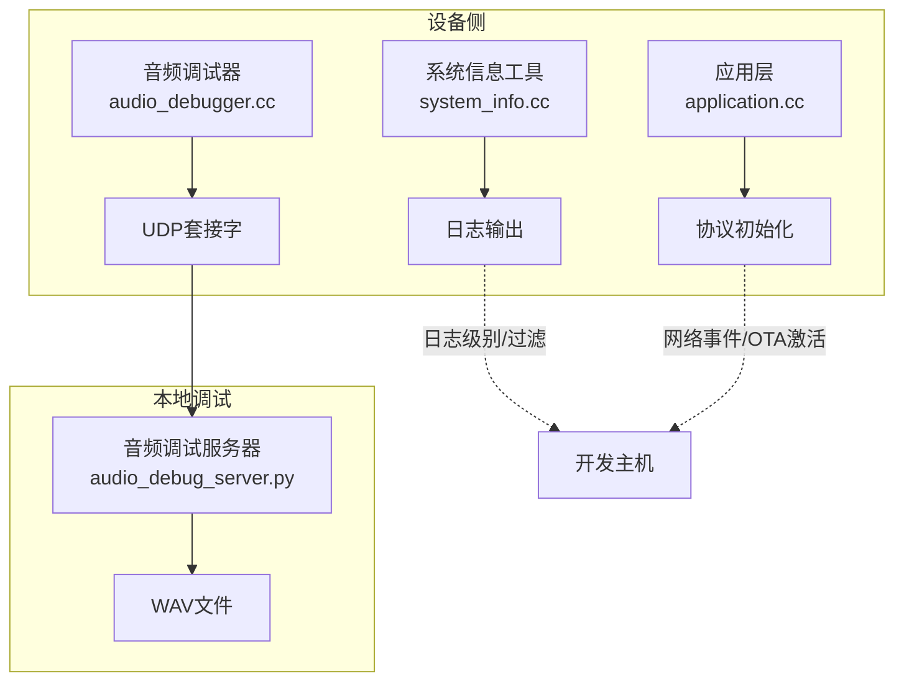
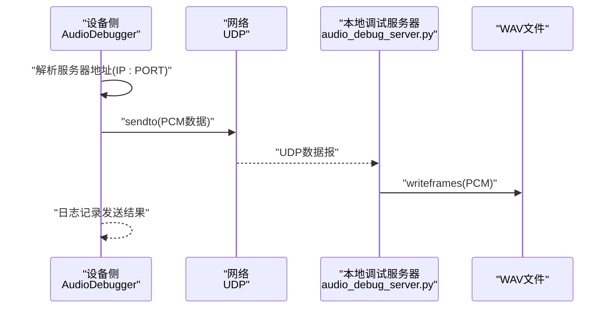
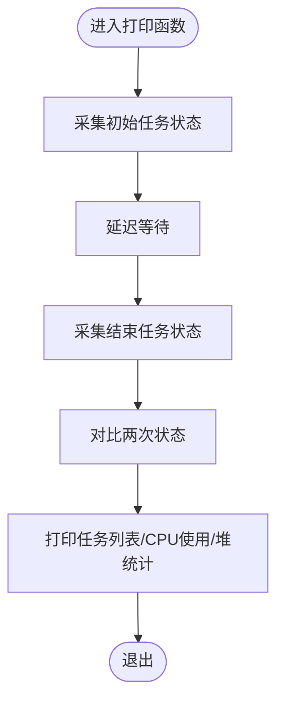
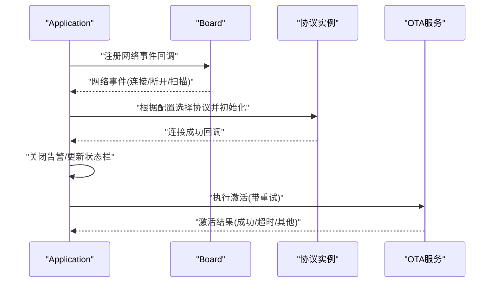
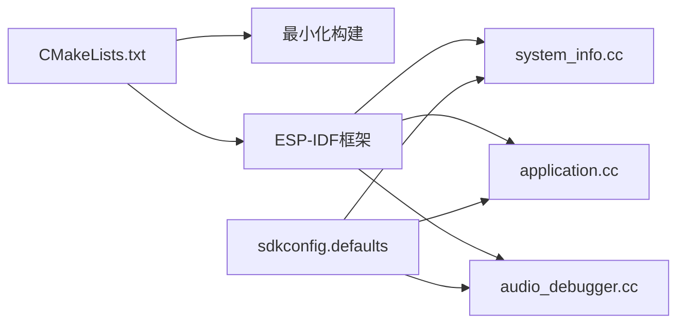

# 调试技巧

<cite>
**本文引用的文件**
- [README.md](file://README.md)
- [CMakeLists.txt](file://CMakeLists.txt)
- [sdkconfig.defaults](file://sdkconfig.defaults)
- [scripts/audio_debug_server.py](file://scripts/audio_debug_server.py)
- [main/system_info.h](file://main/system_info.h)
- [main/system_info.cc](file://main/system_info.cc)
- [main/settings.cc](file://main/settings.cc)
- [main/application.cc](file://main/application.cc)
- [main/audio/processors/audio_debugger.h](file://main/audio/processors/audio_debugger.h)
- [main/audio/processors/audio_debugger.cc](file://main/audio/processors/audio_debugger.cc)
</cite>

## 目录
1. [简介](#简介)
2. [项目结构](#项目结构)
3. [核心组件](#核心组件)
4. [架构总览](#架构总览)
5. [详细组件分析](#详细组件分析)
6. [依赖关系分析](#依赖关系分析)
7. [性能考量](#性能考量)
8. [故障排查指南](#故障排查指南)
9. [结论](#结论)
10. [附录](#附录)

## 简介
本指南面向ESP32-AI项目的开发者与维护者，聚焦于在ESP-IDF环境下进行系统化调试的方法论与实操技巧。内容覆盖：
- ESP-IDF调试工具链：GDB、OpenOCD、JTAG接口的配置与使用要点
- 日志系统：日志级别设置、输出控制与过滤策略
- 内存分析：堆栈跟踪、最小空闲堆大小监控、任务CPU占用统计、电源管理锁状态
- 音频调试：音频调试服务器的使用、UDP音频流采集与播放验证
- 网络调试：连接事件处理、OTA激活流程、协议选择与异常重试
- 硬件调试：分区表、SDK配置项对运行时行为的影响
- 常见问题与排障流程：从日志到抓包、从内存到网络的闭环定位思路
- 实战案例：结合仓库中的实现，给出可复用的调试步骤与检查清单

## 项目结构
本项目采用ESP-IDF工程组织方式，顶层通过CMake构建，主程序位于main目录，脚本工具位于scripts目录，音频调试相关代码位于main/audio/processors，系统信息与日志相关的工具类位于main/system_info.*。

图表来源
- [CMakeLists.txt:1-16](file://CMakeLists.txt#L1-L16)
- [main/application.cc:127-536](file://main/application.cc#L127-L536)
- [main/system_info.h:1-23](file://main/system_info.h#L1-L23)
- [main/system_info.cc:57-156](file://main/system_info.cc#L57-L156)
- [main/audio/processors/audio_debugger.h:1-22](file://main/audio/processors/audio_debugger.h#L1-L22)
- [main/audio/processors/audio_debugger.cc:1-68](file://main/audio/processors/audio_debugger.cc#L1-L68)
- [scripts/audio_debug_server.py:1-55](file://scripts/audio_debug_server.py#L1-L55)
- [sdkconfig.defaults:1-50](file://sdkconfig.defaults#L1-L50)

章节来源
- [CMakeLists.txt:1-16](file://CMakeLists.txt#L1-L16)
- [README.md:105-129](file://README.md#L105-L129)

## 核心组件
- 应用层：负责网络事件回调、协议初始化、OTA激活等业务流程，便于定位网络/协议相关问题。
- 系统信息工具：提供任务列表、CPU时间统计、堆内存统计、电源管理锁状态等，用于系统稳定性与资源瓶颈分析。
- 音频调试器：按配置启用UDP发送PCM音频帧，便于离线分析音频链路质量。
- 音频调试服务器：本地UDP监听并写入WAV文件，支持采样率与声道参数，便于回放验证。
- SDK配置：通过sdkconfig.defaults集中控制分区表、运行时统计、任务栈大小、SSL优化等，影响整体行为与性能。

章节来源
- [main/application.cc:127-536](file://main/application.cc#L127-L536)
- [main/system_info.h:1-23](file://main/system_info.h#L1-L23)
- [main/system_info.cc:57-156](file://main/system_info.cc#L57-L156)
- [main/audio/processors/audio_debugger.h:1-22](file://main/audio/processors/audio_debugger.h#L1-L22)
- [main/audio/processors/audio_debugger.cc:1-68](file://main/audio/processors/audio_debugger.cc#L1-L68)
- [scripts/audio_debug_server.py:1-55](file://scripts/audio_debug_server.py#L1-L55)
- [sdkconfig.defaults:1-50](file://sdkconfig.defaults#L1-L50)

## 架构总览
下图展示了调试相关的端到端路径：设备侧音频数据经由音频调试器通过UDP发送至本地调试服务器，同时系统信息工具提供运行时状态供日志与分析使用；应用层负责网络事件与协议初始化，便于定位网络/协议问题。

图表来源
- [main/audio/processors/audio_debugger.cc:54-66](file://main/audio/processors/audio_debugger.cc#L54-L66)
- [scripts/audio_debug_server.py:11-43](file://scripts/audio_debug_server.py#L11-L43)
- [main/system_info.cc:142-156](file://main/system_info.cc#L142-L156)
- [main/application.cc:302-338](file://main/application.cc#L302-L338)

## 详细组件分析

### 组件A：音频调试器与音频调试服务器
- 功能概述
  - 设备侧音频调试器：在启用条件下创建UDP套接字，解析服务器地址（IP:PORT），将音频PCM以UDP数据报形式发送。
  - 本地音频调试服务器：绑定UDP端口，接收二进制PCM并写入WAV文件，支持采样率与声道参数。
- 使用流程
  - 在设备侧启用音频调试功能并配置UDP服务器地址
  - 启动本地音频调试服务器，指定采样率与声道
  - 观察设备侧日志确认发送成功与字节数
  - 回放WAV文件验证音频质量与格式
- 关键实现点
  - 地址解析与错误处理
  - 发送失败的日志记录
  - 服务器端缓冲区大小与帧写入
- 适用场景
  - 音频链路质量验证
  - 录音/播放路径问题定位
  - 远程调试时的离线分析

图表来源
- [main/audio/processors/audio_debugger.cc:16-66](file://main/audio/processors/audio_debugger.cc#L16-L66)
- [scripts/audio_debug_server.py:11-43](file://scripts/audio_debug_server.py#L11-L43)

章节来源
- [main/audio/processors/audio_debugger.h:1-22](file://main/audio/processors/audio_debugger.h#L1-L22)
- [main/audio/processors/audio_debugger.cc:1-68](file://main/audio/processors/audio_debugger.cc#L1-L68)
- [scripts/audio_debug_server.py:1-55](file://scripts/audio_debug_server.py#L1-L55)

### 组件B：系统信息与日志工具
- 功能概述
  - 提供任务列表打印、运行时间统计、堆内存统计、电源管理锁状态等能力
  - 结合ESP_LOG系列接口进行分级输出，便于快速定位问题
- 使用建议
  - 在关键路径调用打印函数，结合日志级别筛选
  - 定期观察最小空闲堆大小，避免内存碎片导致的任务调度异常
  - 使用任务列表与CPU时间统计识别高负载或阻塞任务
- 关键实现点
  - 任务状态数组分配与释放
  - 延迟前后两次系统状态快照计算CPU占比
  - 堆内存统计与电源管理锁dump

图表来源
- [main/system_info.cc:57-140](file://main/system_info.cc#L57-L140)

章节来源
- [main/system_info.h:1-23](file://main/system_info.h#L1-L23)
- [main/system_info.cc:57-156](file://main/system_info.cc#L57-L156)

### 组件C：应用层网络事件与协议初始化
- 功能概述
  - 处理WiFi/蜂窝网络事件，驱动UI状态更新与音频通道关闭
  - 根据OTA配置选择MQTT或WebSocket协议，并在连接后清理告警
  - 执行OTA激活流程，带超时与重试逻辑
- 调试要点
  - 关注网络断开时是否正确关闭音频通道
  - 协议初始化失败时的降级策略与日志
  - 激活流程中错误码与重试间隔的合理性
- 关键实现点
  - 网络事件回调与状态机切换
  - 协议对象创建与连接回调
  - 激活任务的创建与删除

图表来源
- [main/application.cc:127-182](file://main/application.cc#L127-L182)
- [main/application.cc:302-338](file://main/application.cc#L302-L338)
- [main/application.cc:518-536](file://main/application.cc#L518-L536)
- [main/application.cc:487-516](file://main/application.cc#L487-L516)

章节来源
- [main/application.cc:127-536](file://main/application.cc#L127-L536)

### 组件D：设置与持久化
- 功能概述
  - 封装NVS读写接口，提供字符串、整型、布尔值的读取与写入
  - 支持键擦除与命名空间全量擦除
- 调试要点
  - 写入后需提交（commit）才能持久化
  - 只读命名空间禁止写操作，注意日志告警
  - 键不存在时返回默认值，避免空指针或异常

章节来源
- [main/settings.cc:1-108](file://main/settings.cc#L1-L108)

## 依赖关系分析
- 工程构建与最小化构建
  - 顶层CMake启用最小化构建，减少编译与链接时间
- SDK配置对调试的影响
  - 运行时统计与格式化函数开启，便于CPU与任务分析
  - 主任务栈大小、SSL相关选项、LVGL配置等影响内存与显示
  - 分区表选择与偏移影响OTA与存储布局
- 组件间耦合
  - 应用层依赖Board/Display/AudioCodec等板级抽象
  - 音频调试器依赖SDK配置项与网络栈
  - 系统信息工具依赖FreeRTOS与ESP-IDF运行时

图表来源
- [CMakeLists.txt:11-13](file://CMakeLists.txt#L11-L13)
- [sdkconfig.defaults:18-25](file://sdkconfig.defaults#L18-L25)
- [main/system_info.cc:142-156](file://main/system_info.cc#L142-L156)
- [main/application.cc:518-536](file://main/application.cc#L518-L536)
- [main/audio/processors/audio_debugger.cc:16-42](file://main/audio/processors/audio_debugger.cc#L16-L42)

章节来源
- [CMakeLists.txt:1-16](file://CMakeLists.txt#L1-L16)
- [sdkconfig.defaults:1-50](file://sdkconfig.defaults#L1-L50)

## 性能考量
- 运行时统计
  - 开启运行时间统计与格式化函数，定期打印任务列表与CPU使用，识别热点任务
- 堆内存监控
  - 定期打印最小空闲堆大小，结合任务列表判断是否存在内存碎片或泄漏征兆
- 任务栈与协议栈
  - 合理设置主任务栈大小，避免栈溢出
  - SSL相关配置与动态缓冲区策略影响内存占用与稳定性
- 显示与LVGL
  - LVGL相关配置影响内存与渲染性能，必要时调整内存分配策略

章节来源
- [sdkconfig.defaults:18-25](file://sdkconfig.defaults#L18-L25)
- [main/system_info.cc:148-152](file://main/system_info.cc#L148-L152)
- [main/system_info.cc:142-156](file://main/system_info.cc#L142-L156)

## 故障排查指南
- 日志与过滤
  - 利用系统信息工具打印任务列表与CPU使用，结合日志级别快速定位异常
  - 在网络事件回调中关注断开与重连路径，确保音频通道及时关闭
- 内存问题
  - 观察最小空闲堆大小变化趋势，结合任务列表判断是否存在长时间驻留任务
  - 使用电源管理锁dump排查锁持有情况，避免阻塞唤醒
- 网络问题
  - 在应用层检查网络事件回调与协议初始化流程，关注降级策略与重试逻辑
  - 对比OTA激活流程中的错误码，区分超时与非超时错误
- 音频问题
  - 启用音频调试器并配置UDP服务器地址，确认发送字节与日志
  - 使用音频调试服务器录制WAV，回放验证音频质量与格式
- 硬件与配置
  - 检查分区表与偏移，确保OTA与存储布局正确
  - 校验SDK配置项，特别是SSL、任务栈、LVGL相关选项

章节来源
- [main/system_info.cc:142-156](file://main/system_info.cc#L142-L156)
- [main/application.cc:302-338](file://main/application.cc#L302-L338)
- [main/application.cc:487-516](file://main/application.cc#L487-L516)
- [main/audio/processors/audio_debugger.cc:16-66](file://main/audio/processors/audio_debugger.cc#L16-L66)
- [scripts/audio_debug_server.py:11-43](file://scripts/audio_debug_server.py#L11-L43)
- [sdkconfig.defaults:14-16](file://sdkconfig.defaults#L14-L16)

## 结论
通过将设备侧音频调试器、本地音频调试服务器、系统信息工具与应用层网络事件处理相结合，可以形成一套覆盖“音频链路—系统资源—网络协议”的闭环调试体系。配合SDK配置与最小化构建策略，能够在保证开发效率的同时，快速定位并解决问题。

## 附录
- 快速检查清单
  - 日志级别：确认日志输出正常，必要时降低级别以获取更多信息
  - 任务与内存：打印任务列表与最小空闲堆大小，观察异常波动
  - 网络事件：确认断开时音频通道关闭，连接后协议初始化成功
  - 音频链路：启用音频调试器并校验UDP发送，使用服务器录制WAV回放
  - 配置核对：检查分区表、SSL与任务栈配置，确保与目标平台匹配