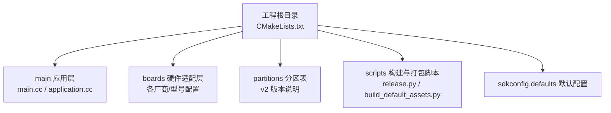
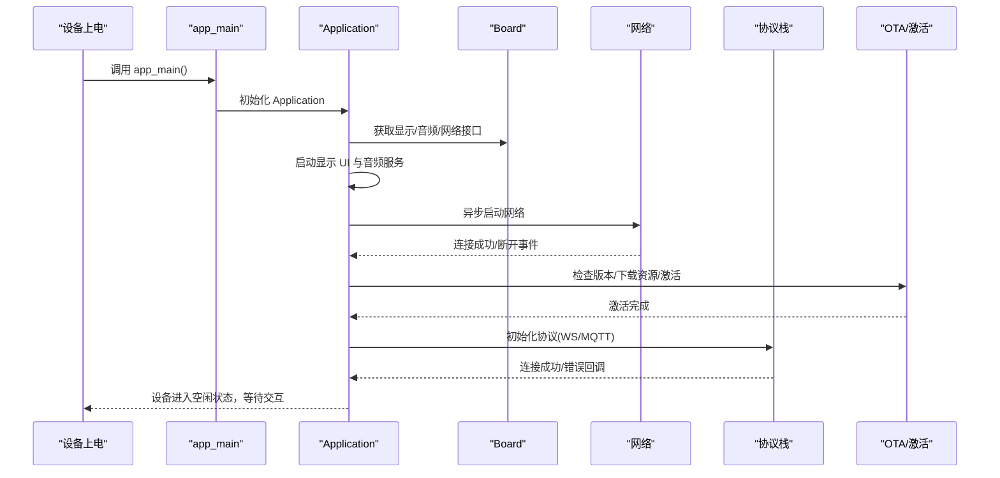
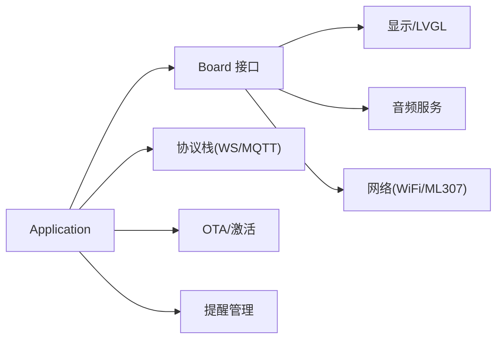

# 快速开始

<cite>
**本文引用的文件**
- [README.md](file://README.md)
- [CMakeLists.txt](file://CMakeLists.txt)
- [main/main.cc](file://main/main.cc)
- [main/application.cc](file://main/application.cc)
- [sdkconfig.defaults](file://sdkconfig.defaults)
- [partitions/v2/README.md](file://partitions/v2/README.md)
- [scripts/release.py](file://scripts/release.py)
- [scripts/build_default_assets.py](file://scripts/build_default_assets.py)
- [main/boards/aipi-lite/config.json](file://main/boards/aipi-lite/config.json)
- [main/boards/esp-box/config.json](file://main/boards/esp-box/config.json)
</cite>

## 目录
1. [简介](#简介)
2. [项目结构](#项目结构)
3. [核心组件](#核心组件)
4. [架构总览](#架构总览)
5. [详细组件分析](#详细组件分析)
6. [依赖关系分析](#依赖关系分析)
7. [性能考虑](#性能考虑)
8. [故障排除指南](#故障排除指南)
9. [结论](#结论)
10. [附录](#附录)

## 简介
本指南面向首次接触 ESP32-AI 的用户，帮助你在约 30 分钟内完成从零到体验语音交互的全流程。内容覆盖：
- 两种使用方式：无需开发环境的预编译固件直接烧录；完整本地开发环境配置
- 常见硬件平台选择建议与必要工具准备
- 固件烧录与首次配置步骤
- 故障排除与设备运行验证方法

## 项目结构
该仓库采用 ESP-IDF 工程组织方式，核心入口在 main 目录，包含应用主循环、音频服务、显示、协议栈、OTA 升级等模块；boards 子目录定义了多种硬件平台的配置；partitions 定义了 v2 分区表以支持动态资源更新。

图示来源
- [CMakeLists.txt:1-17](file://CMakeLists.txt#L1-L17)
- [main/main.cc:14-29](file://main/main.cc#L14-L29)
- [main/application.cc:85-199](file://main/application.cc#L85-L199)
- [partitions/v2/README.md:1-107](file://partitions/v2/README.md#L1-L107)
- [scripts/release.py:219-297](file://scripts/release.py#L219-L297)
- [scripts/build_default_assets.py:750-800](file://scripts/build_default_assets.py#L750-L800)

章节来源
- [CMakeLists.txt:1-17](file://CMakeLists.txt#L1-L17)
- [main/main.cc:14-29](file://main/main.cc#L14-L29)
- [partitions/v2/README.md:1-107](file://partitions/v2/README.md#L1-L107)

## 核心组件
- 应用入口与初始化
  - 入口函数负责 NVS 初始化、应用实例化与主事件循环启动
- 应用生命周期与状态机
  - 负责网络连接、协议初始化、音视频通道、提醒管理、OTA 激活等
- 音频服务与唤醒词检测
  - 提供录音、播放、唤醒词检测、VAD 状态回调
- 协议栈
  - 支持 Websocket 或 MQTT+UDP 两种通信协议，按 OTA 配置自动选择
- 分区与资源
  - v2 分区引入 assets 分区，支持 OTA 动态加载主题、唤醒词模型等资源

章节来源
- [main/main.cc:14-29](file://main/main.cc#L14-L29)
- [main/application.cc:85-199](file://main/application.cc#L85-L199)
- [main/application.cc:518-655](file://main/application.cc#L518-L655)
- [partitions/v2/README.md:1-107](file://partitions/v2/README.md#L1-L107)

## 架构总览
下图展示了从设备上电到进入可交互状态的关键流程：NVS 初始化 → 应用初始化 → 显示与音频服务启动 → 网络异步连接 → OTA 激活 → 协议初始化 → 进入空闲/监听/说话状态。

图示来源
- [main/main.cc:14-29](file://main/main.cc#L14-L29)
- [main/application.cc:85-199](file://main/application.cc#L85-L199)
- [main/application.cc:302-382](file://main/application.cc#L302-L382)
- [main/application.cc:518-655](file://main/application.cc#L518-L655)

## 详细组件分析

### 使用方式一：无需开发环境的预编译固件直接烧录
- 适用场景
  - 新手快速体验语音交互功能，避免安装 VSCode/ESP-IDF 的时间成本
- 建议硬件平台
  - 可参考 README 中列出的 70+ 开源硬件清单，优先选择官方文档中已收录的开发板
- 步骤概览
  - 下载对应硬件平台的预编译固件包
  - 使用烧录工具将固件写入设备
  - 首次上电后，设备会自动连接官方服务器或根据 OTA 配置进行激活
- 注意事项
  - 若需自定义语言/唤醒词/主题，请参考“使用方式二”通过本地构建生成定制固件

章节来源
- [README.md:107-114](file://README.md#L107-L114)
- [README.md:51-103](file://README.md#L51-L103)

### 使用方式二：本地开发环境配置（VSCode + ESP-IDF）
- 环境要求
  - 编辑器：VSCode 或 Cursor
  - 插件：ESP-IDF 插件，SDK 版本 5.4 或以上
  - 平台：Linux 更佳（编译更快、驱动问题更少）
- 获取与编译
  - 通过 release.py 指定目标硬件类型与变体进行编译打包
  - 也可直接使用 ESP-IDF 命令行进行 set-target、build、merge-bin
- 烧录与配置
  - 使用 ESP-IDF 烧录工具将合并后的二进制写入设备
  - 首次运行后，设备会根据 OTA 配置进行激活与资源下载

章节来源
- [README.md:115-121](file://README.md#L115-L121)
- [scripts/release.py:219-297](file://scripts/release.py#L219-L297)
- [CMakeLists.txt:13-16](file://CMakeLists.txt#L13-L16)

### 硬件平台选择与配置要点
- 平台多样性
  - 支持 ESP32-C3/C3、ESP32-S3/S3、ESP32-P4/P4 等多芯片平台
  - 多达 70+ 开源硬件平台，涵盖开发板、AI 相机、机器人等多种形态
- 配置方式
  - 各硬件平台在 main/boards 下有独立 config.json，定义目标芯片与构建参数
  - 示例：aipi-lite 与 esp-box 的配置文件展示了如何指定目标芯片与分区表

章节来源
- [README.md:34](file://README.md#L34)
- [README.md:51-103](file://README.md#L51-L103)
- [main/boards/aipi-lite/config.json:1-12](file://main/boards/aipi-lite/config.json#L1-L12)
- [main/boards/esp-box/config.json:1-9](file://main/boards/esp-box/config.json#L1-L9)

### 分区表与资源更新（v2）
- v2 分区新增 assets 分区，用于存放可网络加载的主题、唤醒词模型、字体、声音等资源
- 不同容量 Flash 的设备提供不同的分区布局，32MB 设备可获得最大 16MB 的 assets 分区
- 升级注意事项
  - v1 与 v2 分区不兼容，可通过手动烧录方式进行升级

章节来源
- [partitions/v2/README.md:1-107](file://partitions/v2/README.md#L1-L107)
- [sdkconfig.defaults:14-16](file://sdkconfig.defaults#L14-L16)

### 应用初始化与事件循环
- 初始化阶段
  - 显示 UI 初始化、音频服务启动、网络事件回调注册、提醒管理初始化
- 事件循环
  - 响应网络连接/断开、唤醒词检测、VAD 状态变化、定时器 tick、按钮切换等事件
  - 根据状态机在空闲、连接中、监听、说话之间切换

章节来源
- [main/application.cc:85-199](file://main/application.cc#L85-L199)
- [main/application.cc:201-299](file://main/application.cc#L201-L299)

### 协议与 OTA 激活
- 协议选择
  - 依据 OTA 配置自动选择 Websocket 或 MQTT+UDP
- OTA 流程
  - 检查新版本、下载资源、激活码/挑战校验、标记当前版本有效
- 错误处理
  - 网络错误通过事件上报，显示告警并提示重试

章节来源
- [main/application.cc:518-655](file://main/application.cc#L518-L655)
- [main/application.cc:442-516](file://main/application.cc#L442-L516)

## 依赖关系分析
- 组件耦合
  - Application 依赖 Board（显示/音频/网络）、协议栈（WS/MQTT）、OTA、提醒管理等子系统
  - 各硬件平台通过 config.json 与 CMakeLists 条件宏进行差异化编译
- 外部依赖
  - ESP-IDF SDK、LVGL、音频编解码、SPIFFS（assets 分区）

图示来源
- [main/application.cc:85-199](file://main/application.cc#L85-L199)
- [main/application.cc:518-655](file://main/application.cc#L518-L655)

章节来源
- [main/application.cc:85-199](file://main/application.cc#L85-L199)
- [main/application.cc:518-655](file://main/application.cc#L518-L655)

## 性能考虑
- 内存与分区
  - v2 分区优化应用分区大小，为 assets 分区腾出空间，减少应用体积
  - ESP32-C3 由于 mmap 页面限制，assets 分区较小，需注意资源占用
- 编译与运行
  - Linux 平台编译更快，Windows 可能遇到驱动与路径问题
  - 启用最小构建选项以减少编译时间与产物体积

章节来源
- [partitions/v2/README.md:60-107](file://partitions/v2/README.md#L60-L107)
- [README.md:118-121](file://README.md#L118-L121)
- [CMakeLists.txt:13](file://CMakeLists.txt#L13)

## 故障排除指南
- 无法联网/连接超时
  - 检查网络事件回调与状态栏显示，确认设备处于连接中/已连接状态
  - 若长时间无响应，尝试重启设备并重试
- 激活失败
  - 查看激活日志与告警提示，确认激活码/挑战是否正确
  - 如多次失败，等待指数退避后再试
- 唤醒词/音效异常
  - 确认 assets 分区可用且资源下载成功
  - 检查音频服务回调与采样率匹配情况
- 分区不兼容
  - v1 与 v2 分区不兼容，需手动烧录 v2 固件

章节来源
- [main/application.cc:302-382](file://main/application.cc#L302-L382)
- [main/application.cc:442-516](file://main/application.cc#L442-L516)
- [partitions/v2/README.md:94-107](file://partitions/v2/README.md#L94-L107)

## 结论
通过本指南，你可以快速完成两种使用方式的部署：既可直接烧录预编译固件体验语音交互，也可在本地开发环境中深度定制固件与资源。建议新手优先使用预编译固件验证功能，再逐步过渡到本地开发以满足个性化需求。

## 附录

### 快速开始清单（约 30 分钟）
- 方式一：预编译固件
  - 选择硬件平台 → 下载对应固件包 → 烧录固件 → 上电等待激活 → 验证语音交互
- 方式二：本地开发
  - 安装 VSCode/ESP-IDF → 克隆仓库 → 配置目标芯片与分区 → 编译/合并/烧录 → 首次运行激活

章节来源
- [README.md:107-114](file://README.md#L107-L114)
- [README.md:115-121](file://README.md#L115-L121)

### 验证设备正常运行的方法
- 观察显示界面：状态栏显示网络状态、表情与消息区域
- 语音交互：对设备说唤醒词，确认进入监听/说话状态
- 资源更新：OTA 成功后，界面显示版本号与成功提示音

章节来源
- [main/application.cc:302-382](file://main/application.cc#L302-L382)
- [main/application.cc:340-362](file://main/application.cc#L340-L362)