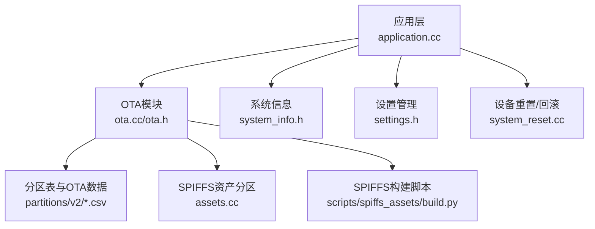
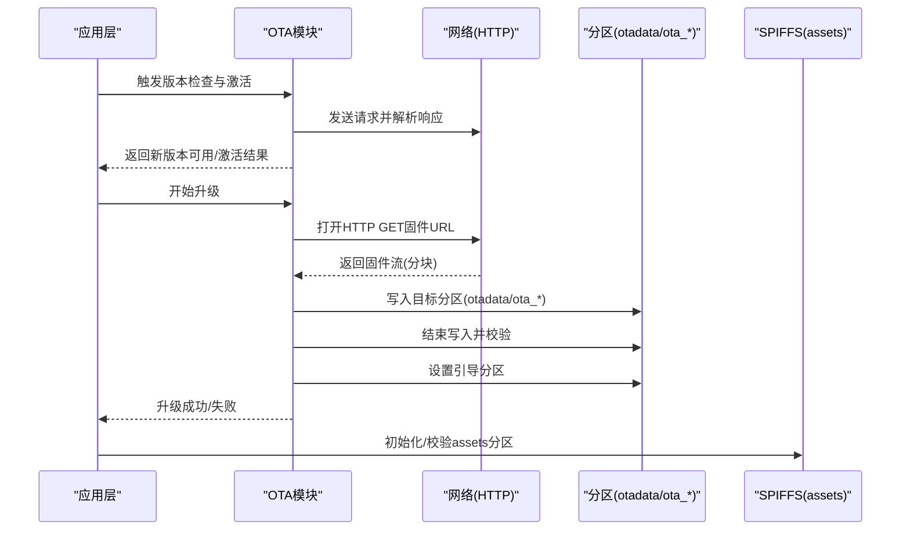
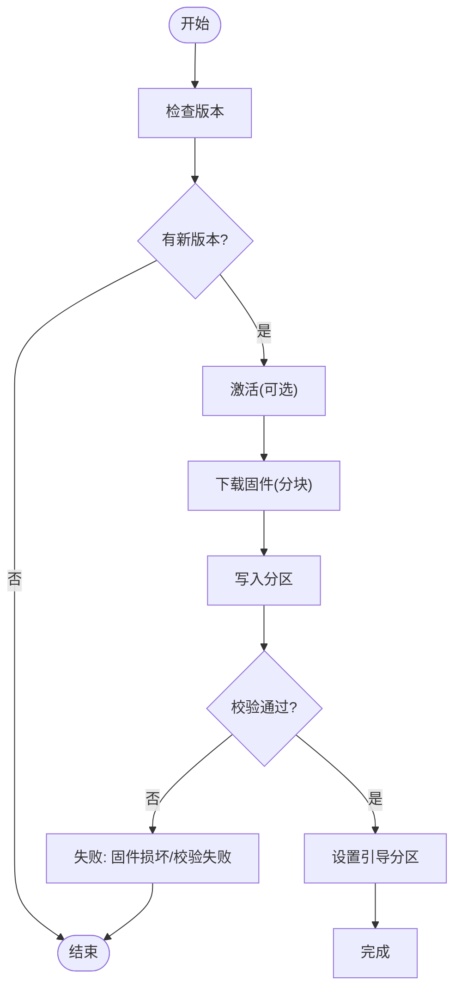
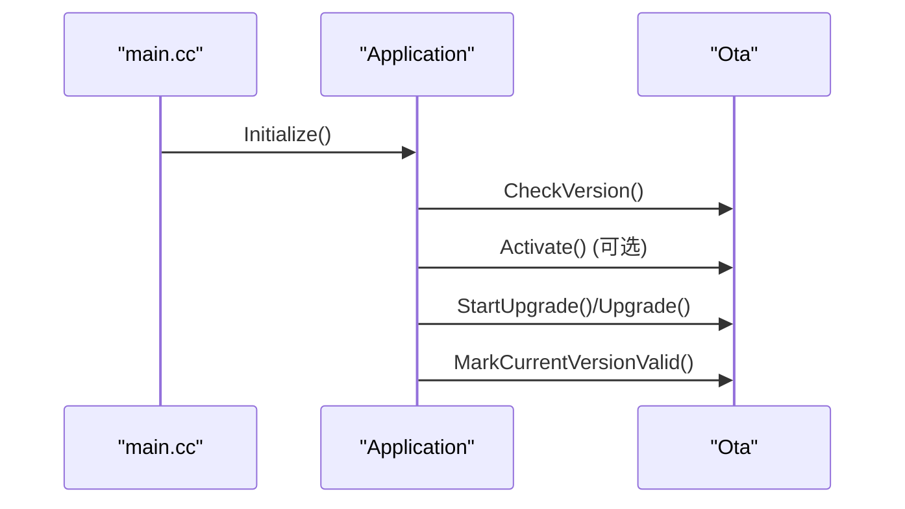
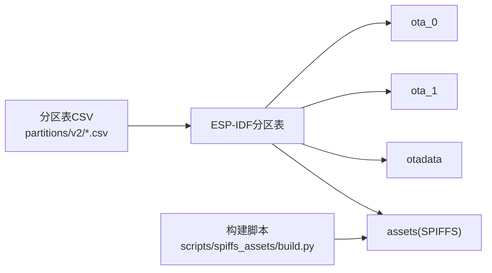
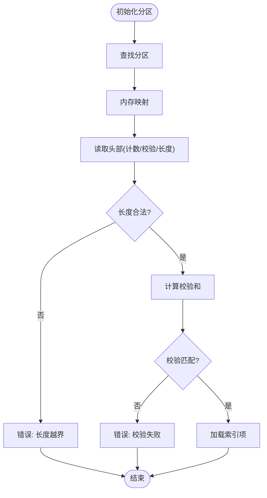
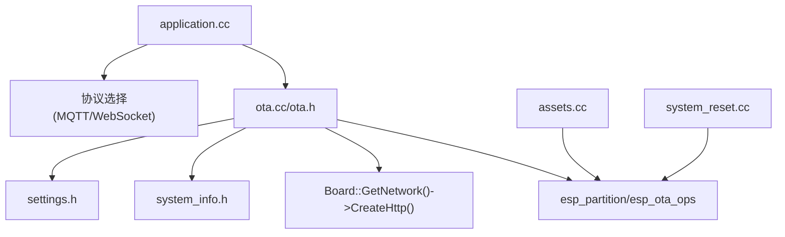
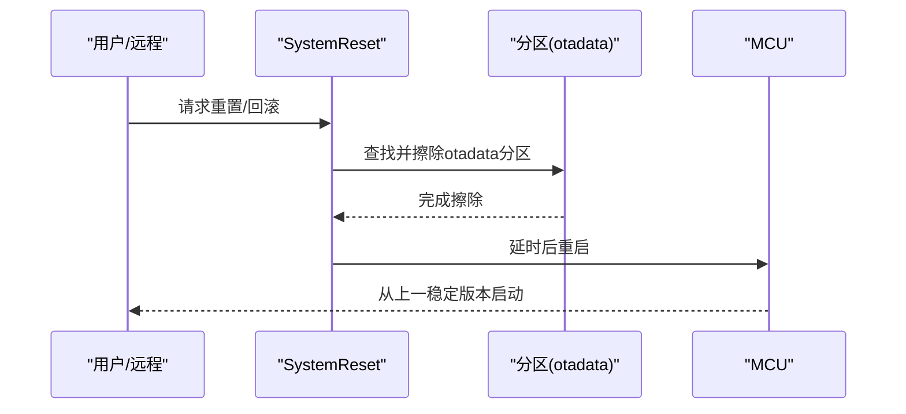

# OTA升级故障排除

<cite>
**本文档引用的文件**
- [ota.cc](file://main/ota.cc)
- [ota.h](file://main/ota.h)
- [application.cc](file://main/application.cc)
- [application.h](file://main/application.h)
- [main.cc](file://main/main.cc)
- [system_info.h](file://main/system_info.h)
- [settings.h](file://main/settings.h)
- [system_reset.cc](file://main/boards/common/system_reset.cc)
- [system_reset.h](file://main/boards/common/system_reset.h)
- [assets.cc](file://main/assets.cc)
- [README.md](file://partitions/v2/README.md)
- [16m.csv](file://partitions/v2/16m.csv)
- [build.py](file://scripts/spiffs_assets/build.py)
</cite>

## 目录
1. [简介](#简介)
2. [项目结构](#项目结构)
3. [核心组件](#核心组件)
4. [架构总览](#架构总览)
5. [详细组件分析](#详细组件分析)
6. [依赖关系分析](#依赖关系分析)
7. [性能考虑](#性能考虑)
8. [故障排除指南](#故障排除指南)
9. [结论](#结论)
10. [附录](#附录)

## 简介
本指南面向ESP32-AI项目的OTA固件升级场景，聚焦升级失败、固件损坏、版本回退等常见问题的诊断与解决。内容覆盖升级过程中的错误码分析、分区表配置错误、SPIFFS文件系统问题、校验和失败等技术问题处理方法，并提供手动回滚到上一个稳定版本的操作步骤、升级前准备与注意事项、升级后验证与功能测试方法，以及升级日志分析与预防措施。

## 项目结构
围绕OTA升级的关键模块与文件如下：
- OTA核心：main/ota.h, main/ota.cc
- 应用入口与事件循环：main/application.h, main/application.cc, main/main.cc
- 系统信息与设置：main/system_info.h, main/settings.h
- 分区表与SPIFFS资产：partitions/v2/README.md, partitions/v2/16m.csv
- SPIFFS构建脚本：scripts/spiffs_assets/build.py
- 设备重置与回滚辅助：main/boards/common/system_reset.h, main/boards/common/system_reset.cc
- 资产分区初始化与校验：main/assets.cc

**图表来源**
- [application.cc:487-536](file://main/application.cc#L487-L536)
- [ota.cc:267-387](file://main/ota.cc#L267-L387)
- [system_info.h:9-21](file://main/system_info.h#L9-L21)
- [settings.h:7-26](file://main/settings.h#L7-L26)
- [assets.cc:130-185](file://main/assets.cc#L130-L185)
- [README.md:1-107](file://partitions/v2/README.md#L1-L107)
- [16m.csv:1-9](file://partitions/v2/16m.csv#L1-L9)
- [build.py:1-400](file://scripts/spiffs_assets/build.py#L1-L400)
- [system_reset.cc:51-72](file://main/boards/common/system_reset.cc#L51-L72)

**章节来源**
- [application.cc:487-536](file://main/application.cc#L487-L536)
- [ota.cc:267-387](file://main/ota.cc#L267-L387)
- [system_info.h:9-21](file://main/system_info.h#L9-L21)
- [settings.h:7-26](file://main/settings.h#L7-L26)
- [assets.cc:130-185](file://main/assets.cc#L130-L185)
- [README.md:1-107](file://partitions/v2/README.md#L1-L107)
- [16m.csv:1-9](file://partitions/v2/16m.csv#L1-L9)
- [build.py:1-400](file://scripts/spiffs_assets/build.py#L1-L400)
- [system_reset.cc:51-72](file://main/boards/common/system_reset.cc#L51-L72)

## 核心组件
- OTA模块：负责版本检查、激活、下载固件、写入分区、校验与引导分区切换。
- 应用层：在启动阶段触发版本检查与激活流程，处理协议选择与状态机。
- 分区与SPIFFS：v2分区表引入assets分区用于网络可加载内容；OTA使用otadata记录升级状态。
- 资产分区：通过内存映射读取并校验assets分区完整性。
- 设备重置：提供擦除otadata分区并重启以回滚到上一个稳定版本的能力。

**章节来源**
- [ota.h:10-56](file://main/ota.h#L10-L56)
- [ota.cc:77-245](file://main/ota.cc#L77-L245)
- [application.cc:487-536](file://main/application.cc#L487-L536)
- [assets.cc:130-185](file://main/assets.cc#L130-L185)
- [system_reset.cc:51-72](file://main/boards/common/system_reset.cc#L51-L72)

## 架构总览
OTA升级从应用启动开始，先进行版本检查与激活，随后进入升级流程。升级过程中会打开HTTP连接、读取固件流、分块写入目标分区、结束写入并校验，最后设置引导分区完成升级。

**图表来源**
- [application.cc:487-536](file://main/application.cc#L487-L536)
- [ota.cc:267-387](file://main/ota.cc#L267-L387)
- [assets.cc:130-185](file://main/assets.cc#L130-L185)

## 详细组件分析

### OTA模块（版本检查、激活、升级）
- 版本检查：从服务器获取JSON响应，解析firmware字段判断是否有新版本；支持强制安装标志。
- 激活：若存在挑战或激活码，构造HMAC签名并提交激活请求。
- 升级：打开HTTP连接，按4KB分块读取固件流，写入目标分区，结束后进行校验并设置引导分区。
- 标记当前版本有效：当运行分区处于待验证状态时，标记为有效以取消回滚。

**图表来源**
- [ota.cc:77-245](file://main/ota.cc#L77-L245)
- [ota.cc:267-387](file://main/ota.cc#L267-L387)

**章节来源**
- [ota.h:10-56](file://main/ota.h#L10-L56)
- [ota.cc:77-245](file://main/ota.cc#L77-L245)
- [ota.cc:267-387](file://main/ota.cc#L267-L387)

### 应用层集成与事件循环
- 启动时触发版本检查与激活流程，根据返回的MQTT/WebSocket配置选择协议。
- 在升级完成后调用标记当前版本有效的逻辑，确保下次启动不会回滚。

**图表来源**
- [main.cc:14-29](file://main/main.cc#L14-L29)
- [application.cc:487-536](file://main/application.cc#L487-L536)
- [ota.cc:247-265](file://main/ota.cc#L247-L265)

**章节来源**
- [main.cc:14-29](file://main/main.cc#L14-L29)
- [application.cc:487-536](file://main/application.cc#L487-L536)
- [ota.cc:247-265](file://main/ota.cc#L247-L265)

### 分区表与SPIFFS资产
- v2分区表新增assets分区，支持网络可加载内容；otadata用于OTA状态记录。
- assets分区采用SPIFFS子类型，具备内存映射访问、校验和验证、渐进式下载等特性。
- 构建脚本负责生成assets.bin并打包到SPIFFS镜像中。

**图表来源**
- [README.md:1-107](file://partitions/v2/README.md#L1-L107)
- [16m.csv:1-9](file://partitions/v2/16m.csv#L1-L9)
- [build.py:1-400](file://scripts/spiffs_assets/build.py#L1-L400)

**章节来源**
- [README.md:1-107](file://partitions/v2/README.md#L1-L107)
- [16m.csv:1-9](file://partitions/v2/16m.csv#L1-L9)
- [build.py:1-400](file://scripts/spiffs_assets/build.py#L1-L400)

### 资产分区初始化与校验
- 通过内存映射访问assets分区，读取头部元数据并计算校验和，确保数据完整性。
- 若校验失败或存储空间不足，将拒绝加载并记录错误日志。

**图表来源**
- [assets.cc:130-185](file://main/assets.cc#L130-L185)

**章节来源**
- [assets.cc:130-185](file://main/assets.cc#L130-L185)

## 依赖关系分析
- OTA模块依赖系统信息、设置、网络抽象、分区API与OTA操作接口。
- 应用层依赖OTA模块与协议选择逻辑，负责事件调度与状态机。
- 分区与SPIFFS依赖ESP-IDF的分区与SPIFFS组件。
- 设备重置模块提供擦除otadata分区的能力，用于回滚。

**图表来源**
- [ota.cc:1-25](file://main/ota.cc#L1-L25)
- [application.cc:518-536](file://main/application.cc#L518-L536)
- [assets.cc:130-185](file://main/assets.cc#L130-L185)
- [system_reset.cc:51-72](file://main/boards/common/system_reset.cc#L51-L72)

**章节来源**
- [ota.cc:1-25](file://main/ota.cc#L1-L25)
- [application.cc:518-536](file://main/application.cc#L518-L536)
- [assets.cc:130-185](file://main/assets.cc#L130-L185)
- [system_reset.cc:51-72](file://main/boards/common/system_reset.cc#L51-L72)

## 性能考虑
- 分块写入：采用4KB分块写入flash，平衡内存占用与写入效率。
- 进度与速度：每秒计算一次传输速度与进度，便于用户感知与监控。
- SPIFFS映射：内存映射访问assets分区，减少拷贝开销，但需满足空闲页空间要求。

[本节为通用指导，无需具体文件分析]

## 故障排除指南

### 升级失败与常见错误码
- HTTP连接失败/状态码非200：检查网络连通性、URL有效性与服务器可达性。
- 内容长度为0：确认固件URL正确且服务器返回有效内容长度。
- 分配缓冲区失败：检查系统堆内存是否充足。
- 写入失败：检查分区权限、剩余空间与写入对齐。
- 校验失败/图像验证失败：固件损坏或下载中断，重新下载或更换源。
- 设置引导分区失败：分区状态异常，可能需要回滚或重置。

**章节来源**
- [ota.cc:280-387](file://main/ota.cc#L280-L387)

### 固件损坏与校验和失败
- 现象：升级结束阶段校验失败，日志提示“图像验证失败”。
- 排查：确认固件来源可信、网络传输稳定、未中途断电；重新下载固件并重试。
- 预防：在升级前保留上一稳定版本的备份，确保有回滚路径。

**章节来源**
- [ota.cc:369-387](file://main/ota.cc#L369-L387)

### 版本回退（手动）
- 方法：擦除otadata分区并重启，使系统回滚至上一个稳定版本。
- 步骤：
  1) 通过设备按键或远程命令触发重置流程。
  2) 程序擦除otadata分区后延时重启。
  3) 下次启动后系统从上一个有效分区引导。

**图表来源**
- [system_reset.cc:51-72](file://main/boards/common/system_reset.cc#L51-L72)

**章节来源**
- [system_reset.h:6-18](file://main/boards/common/system_reset.h#L6-L18)
- [system_reset.cc:51-72](file://main/boards/common/system_reset.cc#L51-L72)

### 分区表配置错误
- 症状：OTA分区缺失、大小不正确、assets分区冲突。
- 处理：核对目标设备的分区表CSV文件，确保otadata、ota_0、ota_1与assets分区存在且大小合理；使用对应尺寸的分区表重新烧录。

**章节来源**
- [README.md:24-107](file://partitions/v2/README.md#L24-L107)
- [16m.csv:1-9](file://partitions/v2/16m.csv#L1-L9)

### SPIFFS文件系统问题
- 症状：资产加载失败、校验和不匹配、存储空间不足。
- 排查：确认assets分区已正确构建与烧录；检查内存映射空闲页是否满足分区大小；重新生成assets.bin并烧录。
- 预防：使用构建脚本统一生成assets镜像，避免手工修改导致校验不一致。

**章节来源**
- [assets.cc:130-185](file://main/assets.cc#L130-L185)
- [build.py:1-400](file://scripts/spiffs_assets/build.py#L1-L400)

### 升级前准备与注意事项
- 备份配置：重要设置保存在NVS中，升级前建议导出关键配置。
- 存储空间：确保otadata与目标ota分区有足够空间；检查assets分区剩余容量。
- 网络连接：确保升级期间网络稳定，避免断电或信号波动。
- 固件来源：仅使用官方或可信来源的固件包，避免损坏或恶意代码。

**章节来源**
- [settings.h:7-26](file://main/settings.h#L7-L26)
- [system_info.h:9-21](file://main/system_info.h#L9-L21)
- [ota.cc:280-387](file://main/ota.cc#L280-L387)

### 升级后验证与功能测试
- 引导验证：确认系统从新分区启动，版本号更新。
- 功能测试：语音唤醒、音频播放、显示与交互、网络协议连通性。
- 资产验证：检查主题、字体、表情包等资源加载正常。

**章节来源**
- [ota.cc:379-387](file://main/ota.cc#L379-L387)
- [application.cc:518-536](file://main/application.cc#L518-L536)

### 升级日志分析与预防
- 日志要点：HTTP状态码、分块进度与速度、写入错误码、校验失败原因。
- 预防措施：使用稳定的电源与网络环境；升级前检查分区表与SPIFFS镜像；保留回滚路径；定期备份NVS配置。

**章节来源**
- [ota.cc:316-387](file://main/ota.cc#L316-L387)
- [main.cc:14-29](file://main/main.cc#L14-L29)

## 结论
OTA升级涉及网络、分区、文件系统与状态管理等多个层面。通过理解OTA模块的工作流程、分区表布局与SPIFFS资产机制，结合完善的日志分析与回滚策略，可以有效降低升级风险并快速定位与解决问题。建议在生产环境中严格执行升级前准备、升级后验证与持续监控流程。

[本节为总结性内容，无需具体文件分析]

## 附录

### 常见错误码与含义（基于源码日志）
- HTTP连接/状态码错误：网络或服务器问题。
- 内容长度为0：固件URL或服务器异常。
- 分配缓冲区失败：内存不足。
- 写入失败：分区写入异常。
- 校验失败/图像验证失败：固件损坏。
- 设置引导分区失败：分区状态异常。

**章节来源**
- [ota.cc:280-387](file://main/ota.cc#L280-L387)