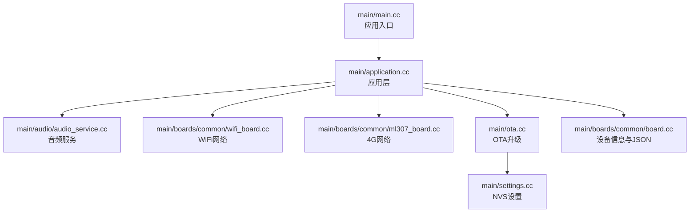
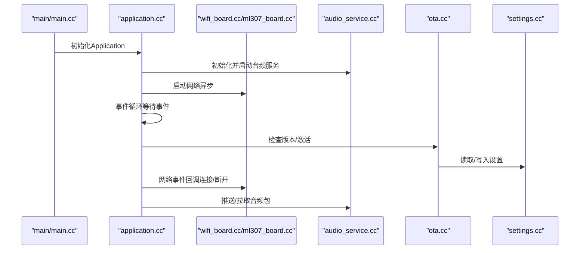
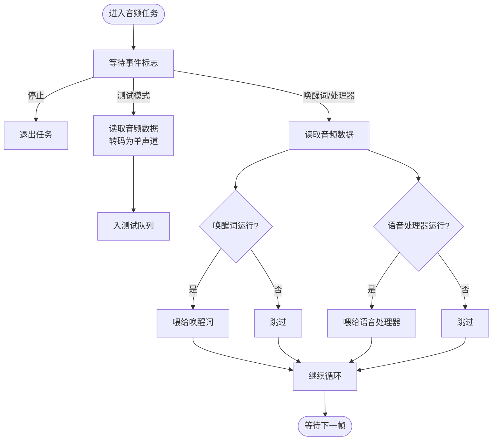
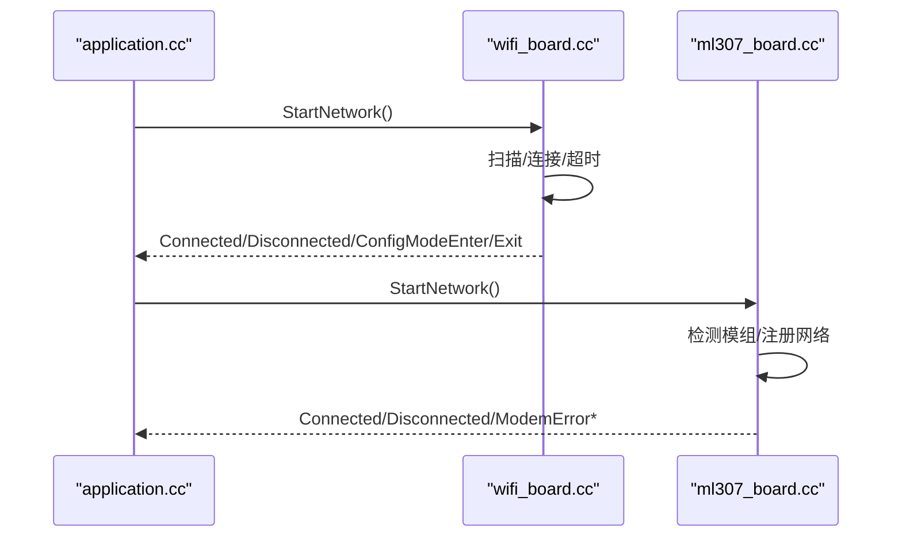
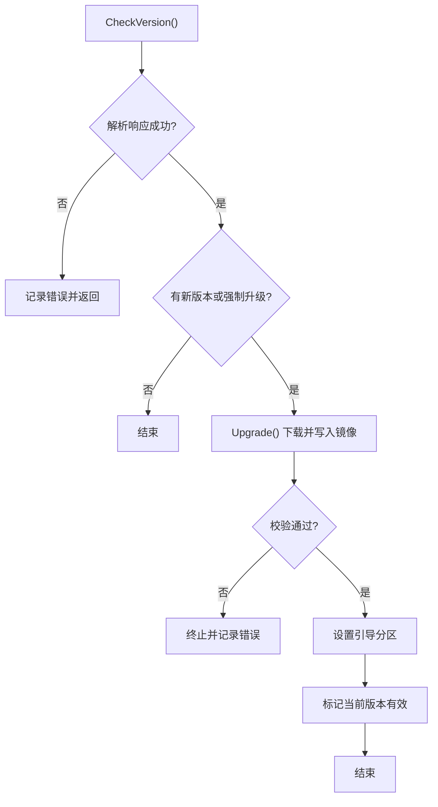
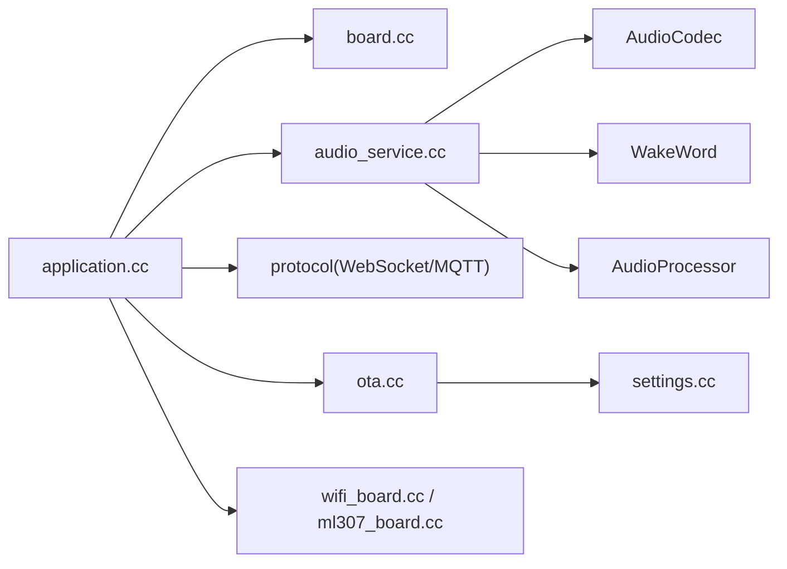

# 故障排除

<cite>
**本文引用的文件**
- [README.md](file://README.md)
- [main/main.cc](file://main/main.cc)
- [main/application.cc](file://main/application.cc)
- [main/audio/audio_service.cc](file://main/audio/audio_service.cc)
- [main/ota.cc](file://main/ota.cc)
- [main/settings.cc](file://main/settings.cc)
- [main/boards/common/board.cc](file://main/boards/common/board.cc)
- [main/boards/common/wifi_board.cc](file://main/boards/common/wifi_board.cc)
- [main/boards/common/ml307_board.cc](file://main/boards/common/ml307_board.cc)
- [.github/ISSUE_TEMPLATE](file://.github/ISSUE_TEMPLATE)
</cite>

## 目录
1. [简介](#简介)
2. [项目结构](#项目结构)
3. [核心组件](#核心组件)
4. [架构总览](#架构总览)
5. [详细组件分析](#详细组件分析)
6. [依赖关系分析](#依赖关系分析)
7. [性能考虑](#性能考虑)
8. [故障排除指南](#故障排除指南)
9. [结论](#结论)
10. [附录](#附录)

## 简介
本指南面向ESP32-AI项目的使用者与开发者，聚焦于系统化的问题定位与修复流程，覆盖编译错误、运行时崩溃、硬件不兼容、音频异常、网络连接问题、OTA升级失败与回滚策略、以及硬件故障检测与替换建议。文档同时提供日志分析、性能监控与内存检查方法，并给出问题报告模板与社区求助指引。

## 项目结构
- 应用入口与初始化：应用主函数负责NVS初始化、实例化并启动Application。
- 应用层：Application负责设备状态机、协议初始化、事件循环、网络事件回调、提醒管理与UI更新。
- 音频子系统：AudioService封装OPUS编解码、采样率转换、输入输出任务、唤醒词与语音处理模块集成。
- 网络与板级支持：Board抽象设备能力；WifiBoard与Ml307Board分别实现WiFi与4G网络接入。
- OTA与设置：Ota负责版本检查、激活、固件升级与标记有效；Settings封装NVS读写。
- 分区与版本：README中明确v1与v2分区不兼容，需手动刷写而非OTA升级。

**图示来源**
- [main/main.cc:14-29](file://main/main.cc#L14-L29)
- [main/application.cc:85-199](file://main/application.cc#L85-L199)
- [main/audio/audio_service.cc:63-124](file://main/audio/audio_service.cc#L63-L124)
- [main/boards/common/wifi_board.cc:52-87](file://main/boards/common/wifi_board.cc#L52-L87)
- [main/boards/common/ml307_board.cc:134-141](file://main/boards/common/ml307_board.cc#L134-L141)
- [main/ota.cc:77-121](file://main/ota.cc#L77-L121)
- [main/settings.cc:8-19](file://main/settings.cc#L8-L19)
- [main/boards/common/board.cc:70-178](file://main/boards/common/board.cc#L70-L178)

**章节来源**
- [main/main.cc:14-29](file://main/main.cc#L14-L29)
- [main/application.cc:85-199](file://main/application.cc#L85-L199)

## 核心组件
- 应用入口与初始化
  - NVS初始化与擦除重试，确保配置可用。
  - 获取Application单例并调用Initialize/Run。
- 应用层
  - 初始化显示、音频服务、网络事件回调、提醒管理。
  - 事件循环处理网络连接/断开、唤醒词、VAD变化、定时器等。
  - 协议初始化（MQTT/WebSocket），处理云端消息与音频通道。
- 音频服务
  - OPUS编码/解码、采样率转换、输入输出任务队列、唤醒词与语音处理。
  - 统计与调试接口（可选）。
- 网络
  - WiFi：扫描、连接、超时进入配置模式；RSSI图标指示信号强度。
  - 4G：ML307模组检测、注册、错误分类（无SIM、拒绝注册、超时、初始化失败）。
- OTA
  - 版本检查、激活（含HMAC校验）、固件下载与写入、标记有效镜像、引导重启。
- 设置
  - NVS键值读写、提交与清理。

**章节来源**
- [main/main.cc:16-23](file://main/main.cc#L16-L23)
- [main/application.cc:85-199](file://main/application.cc#L85-L199)
- [main/audio/audio_service.cc:63-124](file://main/audio/audio_service.cc#L63-L124)
- [main/boards/common/wifi_board.cc:52-87](file://main/boards/common/wifi_board.cc#L52-L87)
- [main/boards/common/ml307_board.cc:67-132](file://main/boards/common/ml307_board.cc#L67-L132)
- [main/ota.cc:77-121](file://main/ota.cc#L77-L121)
- [main/settings.cc:21-47](file://main/settings.cc#L21-L47)

## 架构总览
下图展示从应用入口到各子系统的交互路径，以及关键事件流（网络连接、OTA、音频）。

**图示来源**
- [main/main.cc:26-28](file://main/main.cc#L26-L28)
- [main/application.cc:97-100](file://main/application.cc#L97-L100)
- [main/boards/common/wifi_board.cc:52-87](file://main/boards/common/wifi_board.cc#L52-L87)
- [main/boards/common/ml307_board.cc:134-141](file://main/boards/common/ml307_board.cc#L134-L141)
- [main/audio/audio_service.cc:126-168](file://main/audio/audio_service.cc#L126-L168)
- [main/ota.cc:77-121](file://main/ota.cc#L77-L121)
- [main/settings.cc:8-19](file://main/settings.cc#L8-L19)

## 详细组件分析

### 音频子系统（AudioService）
- 关键职责
  - OPUS编码/解码、采样率转换（输入/输出）、音频任务队列（编码/解码/播放/测试）。
  - 唤醒词检测与语音处理模块集成，VAD状态回调。
  - 定时器驱动的功耗管理（输入/输出空闲自动关闭）。
- 典型问题与定位
  - 编码/解码失败：检查OPUS句柄创建、帧大小与采样率配置。
  - 输入/输出阻塞：检查队列容量阈值与事件触发条件。
  - 唤醒词/语音处理异常：确认初始化顺序与切换时重置缓存。
- 诊断要点
  - 日志级别：关注“Failed to create audio decoder/encoder”、“Failed to encode/decode audio”等错误。
  - 队列长度与事件：确认发送/播放队列未满，事件触发正常。
  - 采样率不匹配：注意设备输出采样率与服务器采样率差异导致的失真或降级。

**图示来源**
- [main/audio/audio_service.cc:231-290](file://main/audio/audio_service.cc#L231-L290)
- [main/audio/audio_service.cc:292-327](file://main/audio/audio_service.cc#L292-L327)
- [main/audio/audio_service.cc:329-448](file://main/audio/audio_service.cc#L329-L448)

**章节来源**
- [main/audio/audio_service.cc:63-124](file://main/audio/audio_service.cc#L63-L124)
- [main/audio/audio_service.cc:126-168](file://main/audio/audio_service.cc#L126-L168)
- [main/audio/audio_service.cc:231-290](file://main/audio/audio_service.cc#L231-L290)
- [main/audio/audio_service.cc:292-327](file://main/audio/audio_service.cc#L292-L327)
- [main/audio/audio_service.cc:329-448](file://main/audio/audio_service.cc#L329-L448)

### 网络组件（WiFi与4G）
- WiFi
  - 扫描/连接/断开事件映射至统一NetworkEvent；超时进入配置模式；RSSI图标指示信号质量。
  - 支持热点配置与Blutooth/声学配置（根据配置启用）。
- 4G（ML307）
  - 模组检测、注册状态轮询、错误分类（无SIM、拒绝注册、超时、初始化失败）。
  - 提供CSQ与运营商信息用于状态上报。

**图示来源**
- [main/application.cc:128-182](file://main/application.cc#L128-L182)
- [main/boards/common/wifi_board.cc:52-87](file://main/boards/common/wifi_board.cc#L52-L87)
- [main/boards/common/wifi_board.cc:159-197](file://main/boards/common/wifi_board.cc#L159-L197)
- [main/boards/common/ml307_board.cc:67-132](file://main/boards/common/ml307_board.cc#L67-L132)

**章节来源**
- [main/boards/common/wifi_board.cc:52-87](file://main/boards/common/wifi_board.cc#L52-L87)
- [main/boards/common/wifi_board.cc:106-145](file://main/boards/common/wifi_board.cc#L106-L145)
- [main/boards/common/wifi_board.cc:159-197](file://main/boards/common/wifi_board.cc#L159-L197)
- [main/boards/common/ml307_board.cc:31-65](file://main/boards/common/ml307_board.cc#L31-L65)
- [main/boards/common/ml307_board.cc:67-132](file://main/boards/common/ml307_board.cc#L67-L132)

### OTA与版本控制
- 版本检查：HTTP请求携带设备信息与语言，解析响应中的新版本URL与激活参数。
- 激活：若存在挑战，按算法生成HMAC并上报，支持超时返回。
- 固件升级：获取下一个更新分区、顺序写入、校验、设置引导分区。
- 标记有效：将处于挂起验证状态的应用标记为有效，避免回滚。
- 分区兼容性：v1与v2分区表不兼容，无法通过OTA从v1直接升级到v2，需手动刷写。

**图示来源**
- [main/ota.cc:77-121](file://main/ota.cc#L77-L121)
- [main/ota.cc:267-387](file://main/ota.cc#L267-L387)
- [main/ota.cc:247-265](file://main/ota.cc#L247-L265)
- [README.md:17-19](file://README.md#L17-L19)

**章节来源**
- [main/ota.cc:77-121](file://main/ota.cc#L77-L121)
- [main/ota.cc:267-387](file://main/ota.cc#L267-L387)
- [main/ota.cc:458-492](file://main/ota.cc#L458-L492)
- [README.md:17-19](file://README.md#L17-L19)

## 依赖关系分析
- 组件耦合
  - Application依赖Board、Display、AudioService、Protocol、OTA、Settings。
  - AudioService依赖AudioCodec、WakeWord、AudioProcessor、OPUS与采样率转换库。
  - Board提供设备信息JSON，供OTA与网络上报使用。
- 外部依赖
  - ESP-IDF、NVS、HTTP客户端、OPUS、ESP-Audio引擎、ESP-SR（唤醒词）。
- 潜在风险
  - v1与v2分区不兼容导致OTA升级限制。
  - 4G模组初始化失败可能阻塞网络。

**图示来源**
- [main/application.cc:85-199](file://main/application.cc#L85-L199)
- [main/audio/audio_service.cc:63-124](file://main/audio/audio_service.cc#L63-L124)
- [main/boards/common/board.cc:70-178](file://main/boards/common/board.cc#L70-L178)
- [main/boards/common/wifi_board.cc:52-87](file://main/boards/common/wifi_board.cc#L52-L87)
- [main/boards/common/ml307_board.cc:134-141](file://main/boards/common/ml307_board.cc#L134-L141)
- [main/ota.cc:77-121](file://main/ota.cc#L77-L121)
- [main/settings.cc:8-19](file://main/settings.cc#L8-L19)

**章节来源**
- [main/application.cc:85-199](file://main/application.cc#L85-L199)
- [main/audio/audio_service.cc:63-124](file://main/audio/audio_service.cc#L63-L124)
- [main/boards/common/board.cc:70-178](file://main/boards/common/board.cc#L70-L178)

## 性能考虑
- 内存与堆栈
  - 定时打印最小空闲堆以辅助评估内存压力。
  - 音频任务栈大小与优先级需满足实时性要求。
- 事件驱动
  - 使用事件组与条件变量减少忙等，降低CPU占用。
- 功耗管理
  - 音频输入/输出空闲超时自动关闭，避免不必要的功耗。
- 网络与协议
  - 连接/断开事件驱动UI与状态切换，避免轮询。
  - 4G网络注册失败快速重试并上报错误类型。

[本节为通用指导，无需列出具体文件来源]

## 故障排除指南

### 一、编译错误
- 常见症状
  - 工具链版本不匹配、头文件缺失、链接阶段报错。
- 诊断步骤
  - 确认ESP-IDF版本符合要求；检查C++代码风格与依赖库版本。
  - 清理构建缓存后重新编译。
- 处理建议
  - 使用推荐的开发环境与SDK版本；遵循代码风格规范。

[本节为通用指导，无需列出具体文件来源]

### 二、运行时崩溃与异常
- 现象
  - 应用启动后立即复位或卡死；音频任务崩溃；网络初始化失败。
- 诊断步骤
  - 查看NVS初始化日志，确认擦除与重试逻辑是否生效。
  - 检查Application事件循环是否被阻塞；核对协议初始化与网络事件回调。
  - 关注音频服务错误日志（解码/编码失败、队列满、采样率不匹配）。
- 处理建议
  - 修正事件触发条件与队列容量；确保音频采样率与设备配置一致；必要时降低任务优先级或增大栈空间。

**章节来源**
- [main/main.cc:16-23](file://main/main.cc#L16-L23)
- [main/application.cc:201-299](file://main/application.cc#L201-L299)
- [main/audio/audio_service.cc:69-85](file://main/audio/audio_service.cc#L69-L85)

### 三、硬件不兼容
- 现象
  - 设备无法识别、屏幕无显示、按键无效、音频无声。
- 诊断步骤
  - 确认所选板级配置与实际硬件一致；检查显示/LED/按键/摄像头接口。
  - 通过设备信息JSON核对芯片型号、分区表与运行分区标签。
- 处理建议
  - 更换正确的板级配置；检查硬件连线与电源供电。

**章节来源**
- [main/boards/common/board.cc:70-178](file://main/boards/common/board.cc#L70-L178)

### 四、音频相关问题

#### 无声
- 诊断
  - 检查音频输出使能与功耗定时器逻辑；确认输出队列非空且已推送PCM。
  - 核对设备输出采样率与服务器采样率是否一致。
- 处理
  - 确保音频输出被正确开启；调整采样率或启用重采样。

**章节来源**
- [main/audio/audio_service.cc:305-324](file://main/audio/audio_service.cc#L305-L324)
- [main/application.cc:549-555](file://main/application.cc#L549-L555)

#### 杂音/破音
- 诊断
  - 检查OPUS解码与重采样过程；确认帧大小与采样率配置。
  - 观察唤醒词/语音处理切换时是否重置输入重采样器。
- 处理
  - 保持帧大小一致性；在模式切换时重置重采样器缓存。

**章节来源**
- [main/audio/audio_service.cc:450-484](file://main/audio/audio_service.cc#L450-L484)
- [main/audio/audio_service.cc:565-599](file://main/audio/audio_service.cc#L565-L599)

#### 延迟过大
- 诊断
  - 检查发送/播放队列长度与事件触发频率；确认网络传输时延。
  - 关注音频测试模式下的队列积压情况。
- 处理
  - 优化队列阈值与事件回调；在网络侧进行带宽与丢包排查。

**章节来源**
- [main/audio/audio_service.cc:508-520](file://main/audio/audio_service.cc#L508-L520)
- [main/audio/audio_service.cc:247-268](file://main/audio/audio_service.cc#L247-L268)

### 五、网络连接问题

#### WiFi无法连接
- 诊断
  - 是否存在已保存的SSID；连接超时后是否进入配置模式。
  - RSSI图标是否显示弱信号；是否在配置模式提示热点名称与访问地址。
- 处理
  - 重新配置WiFi；靠近路由器改善信号；确认密码正确。

**章节来源**
- [main/boards/common/wifi_board.cc:89-104](file://main/boards/common/wifi_board.cc#L89-L104)
- [main/boards/common/wifi_board.cc:151-157](file://main/boards/common/wifi_board.cc#L151-L157)
- [main/boards/common/wifi_board.cc:168-177](file://main/boards/common/wifi_board.cc#L168-L177)

#### 4G无SIM/注册失败
- 诊断
  - 模组检测是否成功；注册状态错误类型（无SIM、拒绝注册、超时、初始化失败）。
  - CSQ与运营商信息是否可用。
- 处理
  - 插入有效SIM卡；检查套餐与区域；重试注册或更换位置。

**章节来源**
- [main/boards/common/ml307_board.cc:67-132](file://main/boards/common/ml307_board.cc#L67-L132)
- [main/boards/common/ml307_board.cc:147-166](file://main/boards/common/ml307_board.cc#L147-L166)

### 六、OTA升级失败与回滚策略

#### 升级失败
- 现象
  - HTTP连接失败、状态码非200、镜像校验失败、写入失败。
- 诊断
  - 检查版本检查URL与网络连通性；查看升级进度与速度日志。
  - 确认目标分区与镜像头部合法性。
- 处理
  - 重试升级或改用手动刷写；确保分区表与固件匹配。

**章节来源**
- [main/ota.cc:97-111](file://main/ota.cc#L97-L111)
- [main/ota.cc:308-365](file://main/ota.cc#L308-L365)
- [main/ota.cc:369-387](file://main/ota.cc#L369-L387)

#### 回滚策略
- 现象
  - 新固件启动后无法进入工作状态。
- 诊断
  - 检查当前运行分区状态；确认是否处于挂起验证状态。
- 处理
  - 若处于挂起验证，标记为有效以取消回滚；否则保留上次有效版本。

**章节来源**
- [main/ota.cc:247-265](file://main/ota.cc#L247-L265)

#### 分区不兼容（v1→v2）
- 现象
  - 无法通过OTA从v1升级到v2。
- 处理
  - 使用手动刷写方式升级至v2。

**章节来源**
- [README.md:17-19](file://README.md#L17-L19)

### 七、硬件故障检测与替换建议
- 电池/温度/屏幕/背光
  - 通过设备状态JSON上报电池电量、充电状态、屏幕亮度与主题、芯片温度等。
- 建议
  - 对于无显示/按键/摄像头的设备，检查对应外设驱动与引脚配置。
  - 替换疑似故障的音频编解码器或功放电路。

**章节来源**
- [main/boards/common/wifi_board.cc:301-357](file://main/boards/common/wifi_board.cc#L301-L357)
- [main/boards/common/ml307_board.cc:186-270](file://main/boards/common/ml307_board.cc#L186-L270)

### 八、系统化调试方法与工具

#### 日志分析
- 关键日志标签
  - “main”（NVS初始化与启动）、“Application”（事件与状态）、“AudioService”（音频）、“Ota”（OTA）、“Board/WifiBoard/ML307Board”（网络）。
- 建议
  - 提升日志级别以捕获更多细节；结合事件循环与网络回调定位问题。

**章节来源**
- [main/main.cc:12](file://main/main.cc#L12)
- [main/application.cc:26](file://main/application.cc#L26)
- [main/audio/audio_service.cc:39](file://main/audio/audio_service.cc#L39)
- [main/ota.cc:25](file://main/ota.cc#L25)
- [main/boards/common/wifi_board.cc:24](file://main/boards/common/wifi_board.cc#L24)
- [main/boards/common/ml307_board.cc:13](file://main/boards/common/ml307_board.cc#L13)

#### 性能监控
- 堆栈与内存
  - 定时打印最小空闲堆，评估内存压力。
- 事件与队列
  - 监控音频发送/播放队列长度与事件触发频率。

**章节来源**
- [main/application.cc:294-298](file://main/application.cc#L294-L298)
- [main/audio/audio_service.cc:508-520](file://main/audio/audio_service.cc#L508-L520)

#### 内存检查
- 使用NVS与Settings进行持久化配置读写，避免频繁写入导致磨损。
- 注意：Settings仅在命名空间可写时才提交变更。

**章节来源**
- [main/settings.cc:8-19](file://main/settings.cc#L8-L19)
- [main/settings.cc:40-47](file://main/settings.cc#L40-L47)

### 九、问题报告模板与社区求助

#### 问题报告模板
- 设备信息
  - 板型、芯片型号、固件版本、分区标签、MAC地址、UUID。
- 现象描述
  - 何时发生、是否可复现、影响范围。
- 日志与截图
  - 关键日志片段、设备状态JSON、网络状态（WiFi/4G）。
- 复现步骤
  - 逐步操作与触发条件。
- 期望结果与实际结果对比。
- 附加信息
  - 环境（电源、温度、网络）、已尝试的修复措施。

#### 社区求助
- 提交Issue时附带上述信息与日志。
- 参考项目README中的社区渠道与相关资源。

**章节来源**
- [.github/ISSUE_TEMPLATE](file://.github/ISSUE_TEMPLATE)
- [README.md:163](file://README.md#L163)

## 结论
本指南围绕ESP32-AI项目的常见问题提供了系统化的诊断与修复路径，涵盖编译、运行、音频、网络、OTA与硬件层面。建议在日常维护中结合日志分析、性能监控与内存检查，形成标准化的排障流程，并在社区中沉淀经验以提升整体稳定性与用户体验。

## 附录
- 快速参考
  - NVS初始化与重试：[main/main.cc:16-23](file://main/main.cc#L16-L23)
  - 应用事件循环：[main/application.cc:201-299](file://main/application.cc#L201-L299)
  - 音频队列与事件：[main/audio/audio_service.cc:508-520](file://main/audio/audio_service.cc#L508-L520)
  - WiFi连接与配置模式：[main/boards/common/wifi_board.cc:89-104](file://main/boards/common/wifi_board.cc#L89-L104)
  - 4G模组检测与错误分类：[main/boards/common/ml307_board.cc:67-132](file://main/boards/common/ml307_board.cc#L67-L132)
  - OTA版本检查与升级：[main/ota.cc:77-121](file://main/ota.cc#L77-L121)、[main/ota.cc:267-387](file://main/ota.cc#L267-L387)
  - 设备信息JSON：[main/boards/common/board.cc:70-178](file://main/boards/common/board.cc#L70-L178)