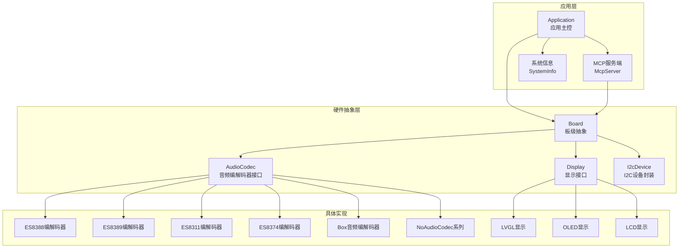
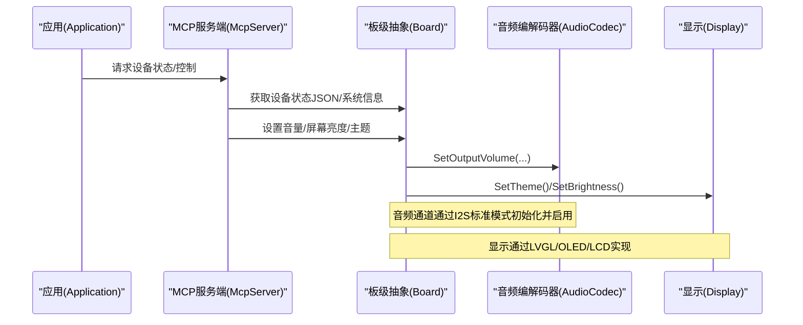
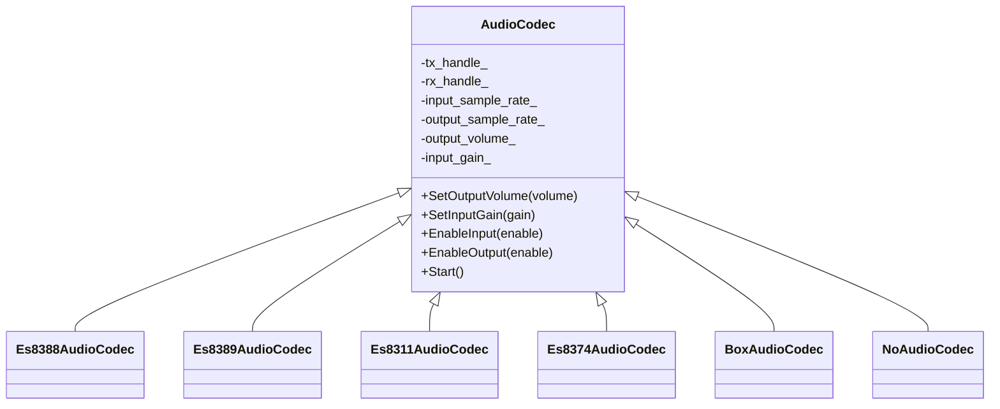
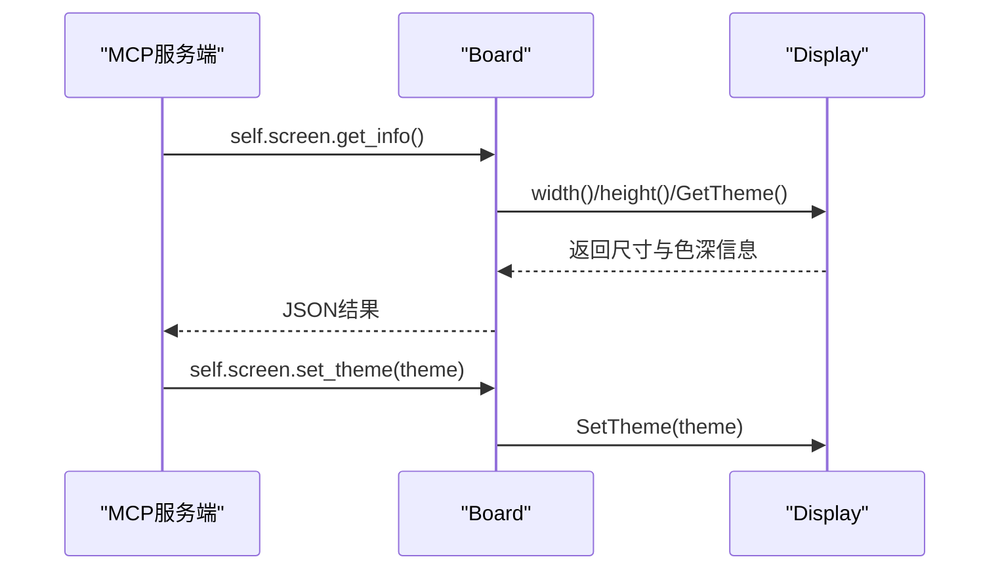
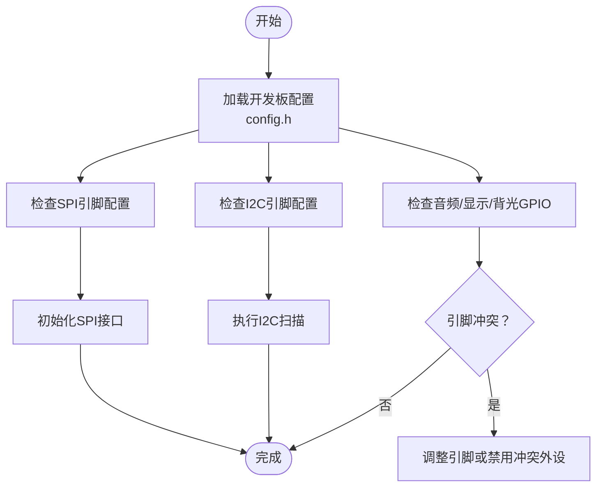
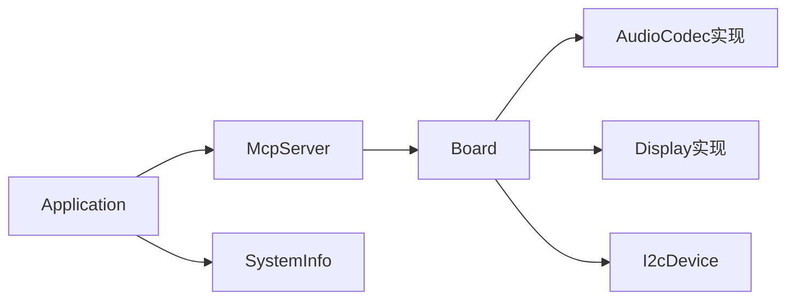
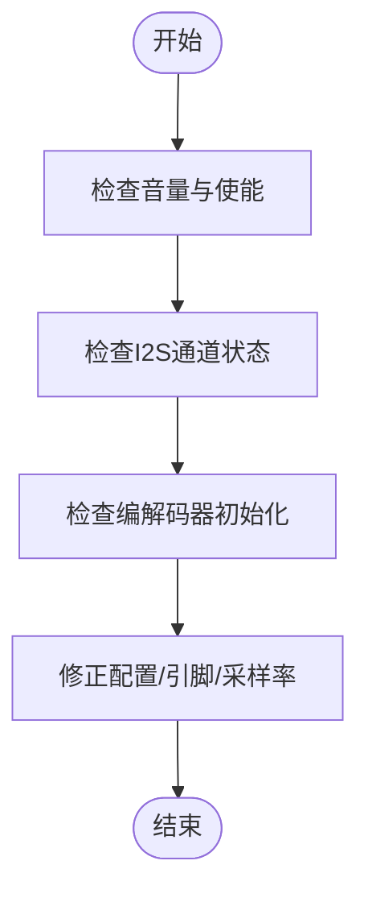
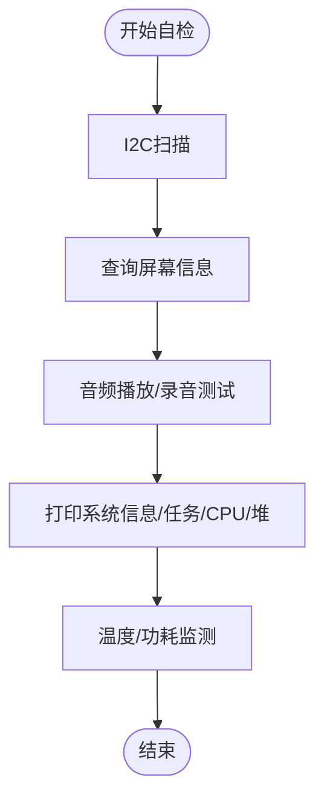

# 硬件问题

<cite>
**本文引用的文件**
- [audio_codec.h](file://main/audio/audio_codec.h)
- [es8388_audio_codec.cc](file://main/audio/codecs/es8388_audio_codec.cc)
- [es8389_audio_codec.cc](file://main/audio/codecs/es8389_audio_codec.cc)
- [es8311_audio_codec.cc](file://main/audio/codecs/es8311_audio_codec.cc)
- [es8374_audio_codec.cc](file://main/audio/codecs/es8374_audio_codec.cc)
- [box_audio_codec.cc](file://main/audio/codecs/box_audio_codec.cc)
- [no_audio_codec.h](file://main/audio/codecs/no_audio_codec.h)
- [no_audio_codec.cc](file://main/audio/codecs/no_audio_codec.cc)
- [audio/README.md](file://main/audio/README.md)
- [board.h](file://main/boards/common/board.h)
- [display.h](file://main/display/display.h)
- [mcp_server.cc](file://main/mcp_server.cc)
- [mcp_server.h](file://main/mcp_server.h)
- [system_info.h](file://main/system_info.h)
- [system_info.cc](file://main/system_info.cc)
- [aipi-lite/config.h](file://main/boards/aipi-lite/config.h)
- [esp-box/config.h](file://main/boards/esp-box/config.h)
- [bread-compact-wifi/config.h](file://main/boards/bread-compact-wifi/config.h)
- [i2c_device.h](file://main/boards/common/i2c_device.h)
- [i2c_scanner.h](file://main/boards/common/i2c_scanner.h)
- [Kconfig.projbuild](file://main/Kconfig.projbuild)
- [device_state.h](file://main/device_state.h)
- [device_state_machine.h](file://main/device_state_machine.h)
- [device_state_machine.cc](file://main/device_state_machine.cc)
- [application.cc](file://main/application.cc)
- [ota.cc](file://main/ota.cc)
</cite>

## 目录
1. 引言
2. 项目结构
3. 核心组件
4. 架构总览
5. 详细组件分析
6. 依赖关系分析
7. 性能考量
8. 故障排除指南
9. 结论
10. 附录

## 引言
本指南面向ESP32-AI项目的硬件工程师与开发者，聚焦于硬件层面的常见问题定位与修复：音频无声/杂音/失真/延迟过大；显示设备OLED/LCD异常、触摸无响应、背光控制失效；GPIO引脚冲突与I2C/SPI总线问题；电源管理不稳定、功耗异常与热保护触发；硬件抽象层（HAL）兼容性问题；以及硬件测试工具与自检流程。文档结合代码库中的硬件配置、驱动接口与系统工具，提供可操作的诊断步骤与解决方案。

## 项目结构
围绕硬件相关的关键模块与文件如下：
- 音频子系统：抽象接口与多种编解码器实现，覆盖I2S初始化、通道配置、增益/音量控制、功耗管理等
- 显示子系统：统一显示接口与LVGL集成，支持主题、亮度、截图等能力
- 板级抽象：Board类统一获取音频、显示、背光、网络、电池等硬件资源
- 硬件配置：各开发板config.h中定义GPIO、分辨率、背光、I2C/SPI引脚等
- 工具与诊断：系统信息打印、任务CPU占用、堆内存统计、I2C扫描等
- 状态机与OTA：设备状态机用于音频测试等场景，OTA用于固件升级与版本检查

图示来源
- [board.h:49-86](file://main/boards/common/board.h#L49-L86)
- [audio_codec.h:17-61](file://main/audio/audio_codec.h#L17-L61)
- [display.h:28-63](file://main/display/display.h#L28-L63)
- [i2c_device.h:6-16](file://main/boards/common/i2c_device.h#L6-L16)

章节来源
- [board.h:49-86](file://main/boards/common/board.h#L49-L86)
- [display.h:28-63](file://main/display/display.h#L28-L63)
- [audio_codec.h:17-61](file://main/audio/audio_codec.h#L17-L61)

## 核心组件
- 音频编解码器接口与实现
  - 抽象接口AudioCodec定义了输入/输出使能、采样率/声道数/音量/增益等属性与I2S通道句柄
  - 多种具体编解码器实现（ES8388/ES8389/ES8311/ES8374/Box/NoAudioCodec）均通过I2S标准模式初始化并启用通道
- 显示接口
  - Display抽象类提供主题设置、通知显示、温度湿度数据、电源省电模式等接口
  - 支持LVGL显示与OLED/LCD等具体实现
- 板级抽象Board
  - 统一获取音频、显示、背光、网络、电池等硬件资源，并提供系统信息JSON与设备状态JSON
- 系统信息与诊断
  - SystemInfo提供任务列表、堆内存统计、PM锁状态等诊断能力
- 硬件配置
  - 各开发板config.h集中定义GPIO、分辨率、背光、I2C/SPI引脚等关键硬件参数

章节来源
- [audio_codec.h:17-61](file://main/audio/audio_codec.h#L17-L61)
- [display.h:28-63](file://main/display/display.h#L28-L63)
- [board.h:49-86](file://main/boards/common/board.h#L49-L86)
- [system_info.h:9-23](file://main/system_info.h#L9-L23)

## 架构总览
下图展示从应用到硬件的调用链路与关键交互点，便于快速定位问题：

图示来源
- [mcp_server.cc:47-99](file://main/mcp_server.cc#L47-L99)
- [board.h:67-86](file://main/boards/common/board.h#L67-L86)
- [audio_codec.h:22-30](file://main/audio/audio_codec.h#L22-L30)
- [display.h:33-47](file://main/display/display.h#L33-L47)

## 详细组件分析

### 音频子系统
- 接口与通道
  - AudioCodec维护tx/rx I2S通道句柄，支持全双工/半双工、采样率/声道数/音量/增益等参数
  - 具体编解码器在初始化时通过I2S标准模式配置时钟、位宽、WS极性、引脚映射并启用通道
- 功耗管理
  - 音频输入/输出在空闲一段时间后自动关闭以节能，活动时重新启用
- 常见问题定位
  - 无声：检查通道是否启用、音量是否为0、GPIO引脚是否正确配置
  - 杂音/失真：检查采样率/位宽匹配、I2S引脚冲突、外部噪声耦合
  - 延迟过大：检查DMA帧大小、中断优先级、系统负载

图示来源
- [audio_codec.h:17-61](file://main/audio/audio_codec.h#L17-L61)
- [es8388_audio_codec.cc:38-77](file://main/audio/codecs/es8388_audio_codec.cc#L38-L77)
- [es8389_audio_codec.cc:37-76](file://main/audio/codecs/es8389_audio_codec.cc#L37-L76)
- [es8311_audio_codec.cc:114-156](file://main/audio/codecs/es8311_audio_codec.cc#L114-L156)
- [es8374_audio_codec.cc:91-133](file://main/audio/codecs/es8374_audio_codec.cc#L91-L133)
- [box_audio_codec.cc:108-139](file://main/audio/codecs/box_audio_codec.cc#L108-L139)
- [no_audio_codec.h:10-41](file://main/audio/codecs/no_audio_codec.h#L10-L41)

章节来源
- [audio_codec.h:17-61](file://main/audio/audio_codec.h#L17-L61)
- [audio/README.md:86-88](file://main/audio/README.md#L86-L88)
- [es8388_audio_codec.cc:38-77](file://main/audio/codecs/es8388_audio_codec.cc#L38-L77)
- [es8389_audio_codec.cc:37-76](file://main/audio/codecs/es8389_audio_codec.cc#L37-L76)
- [es8311_audio_codec.cc:114-156](file://main/audio/codecs/es8311_audio_codec.cc#L114-L156)
- [es8374_audio_codec.cc:91-133](file://main/audio/codecs/es8374_audio_codec.cc#L91-L133)
- [box_audio_codec.cc:108-139](file://main/audio/codecs/box_audio_codec.cc#L108-L139)
- [no_audio_codec.h:10-41](file://main/audio/codecs/no_audio_codec.h#L10-L41)

### 显示与触摸子系统
- 接口与能力
  - Display抽象类提供主题设置、通知显示、状态栏更新、省电模式等
  - LVGL显示通过MCP工具提供屏幕信息查询与截图上传能力
- 常见问题定位
  - 显示异常：检查分辨率/像素格式/颜色顺序/镜像/偏移等配置
  - 触摸无响应：确认触摸控制器驱动存在且初始化成功
  - 背光控制：核对背光GPIO与极性配置

图示来源
- [mcp_server.cc:178-203](file://main/mcp_server.cc#L178-L203)
- [display.h:28-63](file://main/display/display.h#L28-L63)
- [Kconfig.projbuild:520-604](file://main/Kconfig.projbuild#L520-L604)

章节来源
- [display.h:28-63](file://main/display/display.h#L28-L63)
- [mcp_server.cc:178-203](file://main/mcp_server.cc#L178-L203)
- [Kconfig.projbuild:520-604](file://main/Kconfig.projbuild#L520-L604)

### 板级抽象与GPIO/I2C/SPI配置
- Board统一接口
  - 提供获取音频、显示、背光、网络、电池等资源的方法，以及系统信息与设备状态JSON
- 硬件配置
  - 各开发板config.h集中定义I2S引脚、显示分辨率/方向/颜色顺序、背光GPIO、I2C引脚等
- I2C设备与扫描
  - I2cDevice封装寄存器读写；I2cScanner提供总线扫描能力

图示来源
- [board.h:67-86](file://main/boards/common/board.h#L67-L86)
- [aipi-lite/config.h:8-53](file://main/boards/aipi-lite/config.h#L8-L53)
- [esp-box/config.h:6-41](file://main/boards/esp-box/config.h#L6-L41)
- [bread-compact-wifi/config.h:6-60](file://main/boards/bread-compact-wifi/config.h#L6-L60)
- [i2c_device.h:6-16](file://main/boards/common/i2c_device.h#L6-L16)
- [i2c_scanner.h:1-4](file://main/boards/common/i2c_scanner.h#L1-L4)

章节来源
- [board.h:67-86](file://main/boards/common/board.h#L67-L86)
- [aipi-lite/config.h:8-53](file://main/boards/aipi-lite/config.h#L8-L53)
- [esp-box/config.h:6-41](file://main/boards/esp-box/config.h#L6-L41)
- [bread-compact-wifi/config.h:6-60](file://main/boards/bread-compact-wifi/config.h#L6-L60)
- [i2c_device.h:6-16](file://main/boards/common/i2c_device.h#L6-L16)
- [i2c_scanner.h:1-4](file://main/boards/common/i2c_scanner.h#L1-L4)

## 依赖关系分析
- 应用层依赖MCP服务端与Board抽象，MCP服务端再依赖Board提供的硬件资源
- 音频编解码器实现依赖I2S驱动，显示实现依赖LVGL/OLED/LCD驱动
- 系统信息模块用于运行时诊断与性能分析

图示来源
- [mcp_server.cc:47-99](file://main/mcp_server.cc#L47-L99)
- [board.h:67-86](file://main/boards/common/board.h#L67-L86)
- [system_info.h:9-23](file://main/system_info.h#L9-L23)

章节来源
- [mcp_server.cc:47-99](file://main/mcp_server.cc#L47-L99)
- [board.h:67-86](file://main/boards/common/board.h#L67-L86)
- [system_info.h:9-23](file://main/system_info.h#L9-L23)

## 性能考量
- 任务CPU使用与堆内存
  - 使用SystemInfo打印任务列表与CPU使用情况，监控是否存在高占用任务
  - 打印堆内存统计，关注最小空闲堆大小，避免内存碎片导致的异常
- 电源管理与热保护
  - 音频编解码器具备空闲自动关闭输入/输出通道的能力，降低功耗
  - OTA升级过程中会调整电源策略，建议在稳定电源条件下进行升级

章节来源
- [system_info.cc:57-156](file://main/system_info.cc#L57-L156)
- [audio/README.md:86-88](file://main/audio/README.md#L86-L88)
- [application.cc:442-451](file://main/application.cc#L442-L451)

## 故障排除指南

### 音频问题
- 无声
  - 检查通道是否启用、音量是否为0、GPIO引脚是否与config.h一致
  - 确认编解码器初始化成功并已启用I2S通道
- 杂音/失真
  - 对齐采样率与位宽、检查I2S引脚映射、屏蔽外部干扰源
  - 若使用ES83xx系列，核对MCLK/WS/BCLK/DIN/DOUT配置
- 延迟过大
  - 调整DMA帧大小、提升中断优先级、减少系统负载

图示来源
- [audio_codec.h:22-30](file://main/audio/audio_codec.h#L22-L30)
- [es8388_audio_codec.cc:38-77](file://main/audio/codecs/es8388_audio_codec.cc#L38-L77)
- [es8389_audio_codec.cc:37-76](file://main/audio/codecs/es8389_audio_codec.cc#L37-L76)
- [es8311_audio_codec.cc:114-156](file://main/audio/codecs/es8311_audio_codec.cc#L114-L156)
- [es8374_audio_codec.cc:91-133](file://main/audio/codecs/es8374_audio_codec.cc#L91-L133)
- [box_audio_codec.cc:108-139](file://main/audio/codecs/box_audio_codec.cc#L108-L139)

章节来源
- [audio_codec.h:22-30](file://main/audio/audio_codec.h#L22-L30)
- [es8388_audio_codec.cc:38-77](file://main/audio/codecs/es8388_audio_codec.cc#L38-L77)
- [es8389_audio_codec.cc:37-76](file://main/audio/codecs/es8389_audio_codec.cc#L37-L76)
- [es8311_audio_codec.cc:114-156](file://main/audio/codecs/es8311_audio_codec.cc#L114-L156)
- [es8374_audio_codec.cc:91-133](file://main/audio/codecs/es8374_audio_codec.cc#L91-L133)
- [box_audio_codec.cc:108-139](file://main/audio/codecs/box_audio_codec.cc#L108-L139)

### 显示与触摸问题
- 显示异常
  - 检查分辨率、像素格式、颜色顺序、镜像与偏移等配置项
  - 确认屏幕驱动初始化成功（如ST7789/GC9A01等）
- 触摸无响应
  - 确认触摸控制器驱动存在且初始化成功，检查I2C地址与引脚
- 背光控制
  - 核对背光GPIO与输出极性配置，确保PWM或电平控制逻辑正确

章节来源
- [Kconfig.projbuild:520-604](file://main/Kconfig.projbuild#L520-L604)
- [mcp_server.cc:178-203](file://main/mcp_server.cc#L178-L203)

### GPIO引脚冲突与I2C/SPI总线问题
- 引脚冲突
  - 在config.h中核对I2S、SPI、I2C、背光、按键等引脚分配，避免重复使用
  - 若冲突，修改引脚或禁用冲突外设
- I2C总线
  - 使用I2cScanner扫描总线，确认设备地址可达
  - 检查上拉电阻与速率设置
- SPI总线
  - 核对时钟极性/相位、数据宽度、CS/DC/RESET引脚配置

章节来源
- [bread-compact-wifi/config.h:6-60](file://main/boards/bread-compact-wifi/config.h#L6-L60)
- [i2c_device.h:6-16](file://main/boards/common/i2c_device.h#L6-L16)
- [i2c_scanner.h:1-4](file://main/boards/common/i2c_scanner.h#L1-L4)

### 电源管理问题
- 供电不稳定
  - 使用SystemInfo查看系统状态，确认无频繁重启或看门狗复位
  - 检查电源纹波与负载电流，必要时增加滤波电容
- 功耗异常
  - 关注音频编解码器的空闲自动关闭机制是否生效
  - 降低任务优先级与频率，启用低功耗模式
- 热保护触发
  - 监控温度传感器数据，避免长时间高负载运行
  - 优化算法与任务调度，改善散热条件

章节来源
- [audio/README.md:86-88](file://main/audio/README.md#L86-L88)
- [system_info.cc:57-156](file://main/system_info.cc#L57-L156)
- [application.cc:1206-1217](file://main/application.cc#L1206-L1217)

### HAL兼容性问题
- 不同开发板差异
  - I2S引脚、显示分辨率/驱动、背光控制方式可能不同，需按config.h逐项核对
- 屏幕类型选择
  - 通过Kconfig.projbuild选择屏幕类型与像素格式，确保与硬件一致

章节来源
- [aipi-lite/config.h:8-53](file://main/boards/aipi-lite/config.h#L8-L53)
- [esp-box/config.h:6-41](file://main/boards/esp-box/config.h#L6-L41)
- [Kconfig.projbuild:520-604](file://main/Kconfig.projbuild#L520-L604)

### 硬件测试工具与自检程序
- 系统信息与任务诊断
  - 使用SystemInfo打印任务列表、CPU使用、堆内存与PM锁状态
- 屏幕自检
  - 通过MCP工具查询屏幕信息与截图上传，验证显示链路
- I2C自检
  - 使用I2cScanner扫描总线，识别挂载设备
- 自检流程建议
  - 上电后先执行I2C扫描与显示信息查询
  - 运行音频播放/录音测试，观察有无杂音/失真
  - 在高负载场景下监控温度与内存，评估热保护与内存压力

图示来源
- [system_info.cc:57-156](file://main/system_info.cc#L57-L156)
- [mcp_server.cc:178-203](file://main/mcp_server.cc#L178-L203)
- [i2c_scanner.h:1-4](file://main/boards/common/i2c_scanner.h#L1-L4)

章节来源
- [system_info.cc:57-156](file://main/system_info.cc#L57-L156)
- [mcp_server.cc:178-203](file://main/mcp_server.cc#L178-L203)
- [i2c_scanner.h:1-4](file://main/boards/common/i2c_scanner.h#L1-L4)

### 设备状态与音频测试场景
- 设备状态机
  - 包含“音频测试”状态，可用于引导自检流程
- OTA与版本检查
  - 升级前检查版本URL与网络连通性，避免升级失败导致的黑屏/重启

章节来源
- [device_state.h:4-18](file://main/device_state.h#L4-L18)
- [device_state_machine.h:17-47](file://main/device_state_machine.h#L17-L47)
- [device_state_machine.cc:128-161](file://main/device_state_machine.cc#L128-L161)
- [ota.cc:55-91](file://main/ota.cc#L55-L91)

## 结论
通过结合硬件抽象层接口、编解码器实现、显示与I2C/SPI配置，以及系统诊断工具，可以系统化地定位与解决ESP32-AI项目中的硬件问题。建议在开发与调试阶段遵循“自检—定位—修复—验证”的闭环流程，确保问题可追溯、可复现、可回归。

## 附录
- 快速检查清单
  - 音频：通道启用、音量、GPIO、采样率/位宽、I2S引脚
  - 显示：分辨率/像素格式/颜色顺序/镜像/偏移、LVGL/OLED/LCD驱动
  - 触摸：I2C地址/引脚、触摸驱动
  - 背光：GPIO与极性
  - 总线：I2C/SPI引脚、上拉电阻、速率
  - 电源：纹波、功耗、热保护
  - 工具：系统信息、屏幕信息、I2C扫描、音频测试