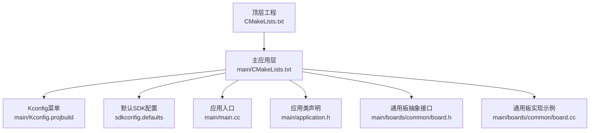
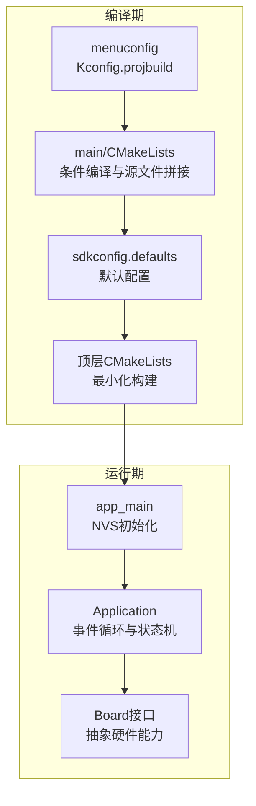
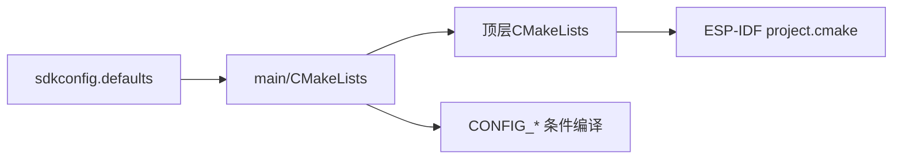
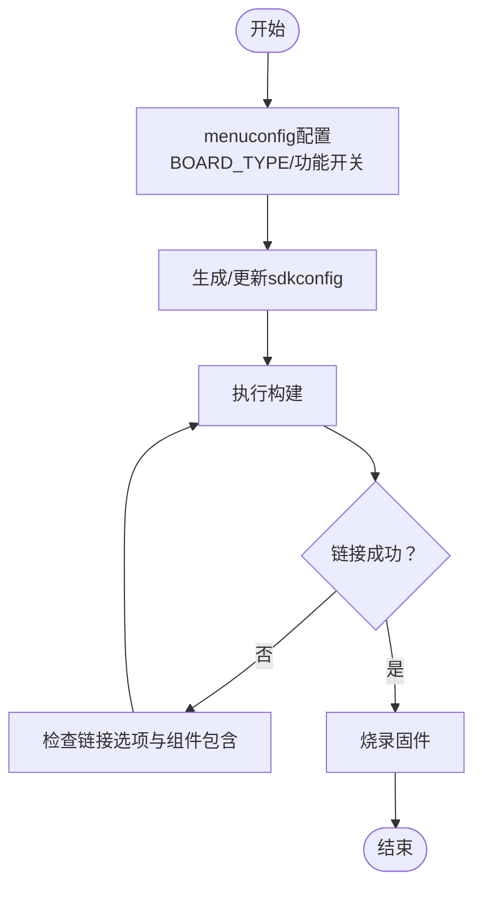
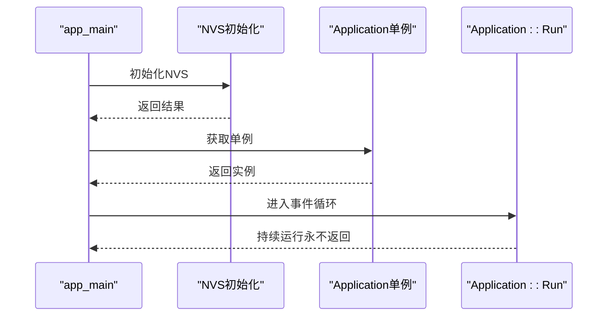

# 编译问题

<cite>
**本文档引用的文件**
- [CMakeLists.txt](file://CMakeLists.txt)
- [main/CMakeLists.txt](file://main/CMakeLists.txt)
- [main/Kconfig.projbuild](file://main/Kconfig.projbuild)
- [sdkconfig.defaults](file://sdkconfig.defaults)
- [main/application.h](file://main/application.h)
- [main/main.cc](file://main/main.cc)
- [main/boards/common/board.h](file://main/boards/common/board.h)
- [main/boards/common/board.cc](file://main/boards/common/board.cc)
- [README.md](file://README.md)
</cite>

## 目录
1. [简介](#简介)
2. [项目结构](#项目结构)
3. [核心组件](#核心组件)
4. [架构总览](#架构总览)
5. [详细组件分析](#详细组件分析)
6. [依赖关系分析](#依赖关系分析)
7. [性能考虑](#性能考虑)
8. [故障排除指南](#故障排除指南)
9. [结论](#结论)
10. [附录](#附录)

## 简介
本指南面向ESP32-AI项目的编译问题排查，覆盖头文件缺失、链接错误、SDK配置问题、组件依赖冲突、ESP-IDF版本兼容性、编译器警告与错误（如内存不足、栈溢出、未定义引用）、特定硬件平台的编译配置、以及环境清理与重新编译流程。文档同时解释如何使用ESP-IDF的menuconfig工具进行正确的SDK配置。

## 项目结构
ESP32-AI采用ESP-IDF工程组织方式，顶层通过CMakeLists.txt引入ESP-IDF构建系统，并在main目录下集中管理源码与条件编译逻辑。项目支持多种硬件平台（ESP32、ESP32-C3、ESP32-C5、ESP32-C6、ESP32-P4、ESP32-S3），并通过Kconfig.projbuild菜单选择目标板型与功能特性。

**图表来源**
- [CMakeLists.txt](file://CMakeLists.txt)
- [main/CMakeLists.txt](file://main/CMakeLists.txt)
- [main/Kconfig.projbuild](file://main/Kconfig.projbuild)
- [sdkconfig.defaults](file://sdkconfig.defaults)
- [main/main.cc](file://main/main.cc)
- [main/application.h](file://main/application.h)
- [main/boards/common/board.h](file://main/boards/common/board.h)
- [main/boards/common/board.cc](file://main/boards/common/board.cc)

**章节来源**
- [CMakeLists.txt](file://CMakeLists.txt)
- [main/CMakeLists.txt](file://main/CMakeLists.txt)
- [main/Kconfig.projbuild](file://main/Kconfig.projbuild)
- [sdkconfig.defaults](file://sdkconfig.defaults)
- [README.md](file://README.md)

## 核心组件
- 构建系统与最小化构建：顶层CMakeLists启用最小化构建以减少编译时间与资源占用。
- 主应用入口与初始化：app_main负责NVS初始化与应用实例运行。
- 应用状态机与事件驱动：Application封装事件组、任务调度、协议与OTA重置等。
- 板级抽象：Board接口统一LED、显示、音频编解码、网络、传感器等能力。
- Kconfig菜单：通过menuconfig选择硬件平台、显示风格、唤醒词实现、AEC模式等。

**章节来源**
- [CMakeLists.txt](file://CMakeLists.txt)
- [main/main.cc](file://main/main.cc)
- [main/application.h](file://main/application.h)
- [main/boards/common/board.h](file://main/boards/common/board.h)
- [main/boards/common/board.cc](file://main/boards/common/board.cc)
- [main/Kconfig.projbuild](file://main/Kconfig.projbuild)

## 架构总览
ESP32-AI的编译与运行时架构围绕“最小化构建 + 条件编译 + 板级抽象 + Kconfig菜单”展开。menuconfig选择BOARD_TYPE后，main/CMakeLists根据CONFIG_*变量动态拼接源文件与包含路径；sdkconfig.defaults提供默认优化与内存策略；顶层CMake引入ESP-IDF并设置最小化构建。

**图表来源**
- [main/Kconfig.projbuild](file://main/Kconfig.projbuild)
- [main/CMakeLists.txt](file://main/CMakeLists.txt)
- [sdkconfig.defaults](file://sdkconfig.defaults)
- [CMakeLists.txt](file://CMakeLists.txt)
- [main/main.cc](file://main/main.cc)
- [main/application.h](file://main/application.h)
- [main/boards/common/board.h](file://main/boards/common/board.h)

## 详细组件分析

### 构建系统与最小化构建
- 顶层CMake引入ESP-IDF构建系统，设置最小化构建以仅包含必要组件与main及其依赖。
- 添加编译选项抑制特定字段初始化警告，并显式链接libc以解析ctype相关符号。

**章节来源**
- [CMakeLists.txt](file://CMakeLists.txt)

### 主应用入口与初始化
- app_main先初始化NVS，若检测到NVS页空间不足或新版本不匹配则擦除并重初始化，随后启动Application单例并进入事件循环。

**章节来源**
- [main/main.cc](file://main/main.cc)

### 应用状态机与事件驱动
- Application提供事件位掩码、线程安全的任务调度、协议与OTA资源重置、页面切换与AEC模式控制等。
- 事件处理集中在Run中，结合设备状态机与回调机制实现多任务协作。

**章节来源**
- [main/application.h](file://main/application.h)

### 板级抽象接口
- Board抽象定义了LED、显示、音频编解码、网络、相机、传感器等能力接口，以及UUID生成与系统信息JSON输出。
- Board::GetDisplay/GetLed等提供默认实现，便于无硬件时的占位。

**章节来源**
- [main/boards/common/board.h](file://main/boards/common/board.h)
- [main/boards/common/board.cc](file://main/boards/common/board.cc)

### Kconfig菜单与硬件选择
- menuconfig提供BOARD_TYPE选择，涵盖ESP32、ESP32-C3、ESP32-C5、ESP32-C6、ESP32-P4、ESP32-S3等平台及多家厂商的开发板。
- 不同BOARD_TYPE会决定字体、表情包、分辨率、屏幕类型、AEC支持等特性。

**章节来源**
- [main/Kconfig.projbuild](file://main/Kconfig.projbuild)

## 依赖关系分析
- 顶层CMake依赖ESP-IDF提供的project.cmake，确保SDK路径与工具链正确加载。
- main/CMakeLists通过CONFIG_*变量动态选择源文件与包含路径，避免硬编码导致的跨平台问题。
- sdkconfig.defaults影响编译优化、分区表、LVGL配置、内存缓冲等，是链接阶段的关键输入。

**图表来源**
- [CMakeLists.txt](file://CMakeLists.txt)
- [main/CMakeLists.txt](file://main/CMakeLists.txt)
- [sdkconfig.defaults](file://sdkconfig.defaults)

**章节来源**
- [CMakeLists.txt](file://CMakeLists.txt)
- [main/CMakeLists.txt](file://main/CMakeLists.txt)
- [sdkconfig.defaults](file://sdkconfig.defaults)

## 性能考虑
- 最小化构建可显著缩短编译时间，但需确保所有依赖被正确包含。
- sdkconfig.defaults中对LVGL、HTTPD、PSRAM缓冲等的裁剪会影响运行时性能与内存占用。
- 多语言与表情包资源的启用会增加闪存与RAM消耗，建议按需选择。

[本节为通用指导，无需具体文件引用]

## 故障排除指南

### 一、常见编译错误类型与定位

1) 头文件缺失
- 现象：编译报错找不到头文件（如网络、显示、音频相关）。
- 排查要点：
  - 检查main/CMakeLists中的INCLUDE_DIRS是否包含对应模块路径。
  - 确认Kconfig中BOARD_TYPE已正确选择，否则相关源文件不会被加入构建。
- 解决方案：
  - 在main/CMakeLists中补充缺失的包含目录。
  - 使用menuconfig重新选择BOARD_TYPE并保存配置。

**章节来源**
- [main/CMakeLists.txt](file://main/CMakeLists.txt)
- [main/Kconfig.projbuild](file://main/Kconfig.projbuild)

2) 链接错误（未定义引用、符号缺失）
- 现象：链接阶段提示未定义引用（如ctype相关符号）。
- 排查要点：
  - 顶层CMake已显式link_libraries(-lc)，但仍可能因组件未包含或顺序不当导致未解析。
- 解决方案：
  - 确保最小化构建开启且必要组件已包含。
  - 清理构建缓存后重新编译。

**章节来源**
- [CMakeLists.txt](file://CMakeLists.txt)

3) SDK配置问题（menuconfig）
- 现象：功能异常或编译失败，如AEC、唤醒词、显示风格等。
- 排查要点：
  - 使用menuconfig检查BOARD_TYPE、DISPLAY_STYLE、WAKE_WORD_TYPE、USE_AUDIO_PROCESSOR、USE_DEVICE_AEC等。
  - 不同芯片平台（ESP32、ESP32-S3、ESP32-P4等）对某些功能有依赖限制。
- 解决方案：
  - 在menuconfig中按硬件平台勾选支持的功能。
  - 保存并重新生成sdkconfig。

**章节来源**
- [main/Kconfig.projbuild](file://main/Kconfig.projbuild)

4) 组件依赖冲突
- 现象：多个组件同时提供相同符号或头文件，导致重复定义或链接冲突。
- 排查要点：
  - 关注main/CMakeLists中动态拼接的源文件列表，避免重复包含。
  - 检查sdkconfig.defaults中对第三方库的裁剪设置。
- 解决方案：
  - 合并或移除重复源文件。
  - 在menuconfig中关闭冲突功能或调整组件优先级。

**章节来源**
- [main/CMakeLists.txt](file://main/CMakeLists.txt)
- [sdkconfig.defaults](file://sdkconfig.defaults)

5) ESP-IDF版本兼容性
- 现象：新旧SDK版本差异导致编译失败或行为异常。
- 排查要点：
  - README明确要求SDK版本5.4及以上。
  - 不同IDF_TARGET对功能支持不同（如ESP32-S3/P4对AFE唤醒词的支持）。
- 解决方案：
  - 升级至推荐的ESP-IDF版本。
  - 在menuconfig中仅启用当前平台支持的功能。

**章节来源**
- [README.md](file://README.md)
- [main/Kconfig.projbuild](file://main/Kconfig.projbuild)

6) 编译器警告与错误
- 常见问题：
  - 内存不足：降低优化级别或禁用部分功能（如大字体、表情包）。
  - 栈溢出：增大任务栈大小（参考sdkconfig.defaults中的主任务栈配置）。
  - 未定义引用：确认链接libc与必要组件已包含。
- 解决方案：
  - 在sdkconfig.defaults中调整堆栈与优化参数。
  - 在menuconfig中禁用非必要的资源与功能。

**章节来源**
- [sdkconfig.defaults](file://sdkconfig.defaults)
- [CMakeLists.txt](file://CMakeLists.txt)

7) 特定硬件平台的编译配置
- 不同BOARD_TYPE会自动设置字体、表情包、分辨率、屏幕类型等。
- 若自定义硬件，请在menuconfig中选择合适的BOARD_TYPE并手动微调显示参数。
- 注意：某些功能（如AEC）对硬件与PSRAM有依赖，需在menuconfig中按需启用。

**章节来源**
- [main/Kconfig.projbuild](file://main/Kconfig.projbuild)

8) 编译环境清理、缓存清理与重新编译
- 步骤建议：
  - 清理构建产物：删除build目录或执行清理命令。
  - 清理缓存：删除~/.espressif或缓存目录中与ESP-IDF相关的缓存。
  - 重新生成配置：重新运行menuconfig并保存。
  - 重新编译：执行构建命令。
- 说明：最小化构建会减少不必要的组件，有助于快速定位问题。

**章节来源**
- [CMakeLists.txt](file://CMakeLists.txt)

9) 使用menuconfig进行正确的SDK配置
- 打开menuconfig后，重点检查以下项：
  - 顶层：BOARD_TYPE（必须与实际硬件一致）
  - 显示：DISPLAY_STYLE、LCD/AMOLED类型、像素格式等
  - 唤醒词：WAKE_WORD_TYPE（根据芯片与PSRAM选择）
  - 音频：USE_AUDIO_PROCESSOR、USE_DEVICE_AEC、USE_SERVER_AEC
  - 语言：默认语言选择
  - 其他：分区表、HTTPD长度、LVGL裁剪等
- 保存并退出后重新编译。

**章节来源**
- [main/Kconfig.projbuild](file://main/Kconfig.projbuild)

### 二、典型流程图：编译与链接关键路径

[本图为概念流程，无需图表来源]

### 三、序列图：app_main初始化流程

**图表来源**
- [main/main.cc](file://main/main.cc)
- [main/application.h](file://main/application.h)

## 结论
ESP32-AI的编译问题多源于Kconfig配置不当、硬件平台选择错误、组件依赖冲突或SDK版本不兼容。通过规范使用menuconfig、合理设置sdkconfig.defaults、遵循最小化构建原则，并配合清理缓存与重新编译，可高效定位并解决问题。建议在开发前明确目标硬件平台与功能需求，避免不必要的资源与性能损耗。

[本节为总结，无需具体文件引用]

## 附录

### A. 常用命令速查
- 打开menuconfig：在项目根目录执行对应的ESP-IDF命令。
- 清理构建：删除build目录或使用清理命令。
- 重新编译：执行构建命令。
- 查看SDK版本：在IDE或终端查看ESP-IDF版本信息。

[本节为通用指导，无需具体文件引用]

### B. 参考配置要点清单
- 必须：BOARD_TYPE与实际硬件一致。
- 推荐：DISPLAY_STYLE与屏幕类型匹配。
- 功能：WAKE_WORD_TYPE、USE_AUDIO_PROCESSOR、USE_DEVICE_AEC按芯片与PSRAM选择。
- 资源：根据目标平台启用适当的语言与表情包资源。
- 默认：保持sdkconfig.defaults中的优化与内存策略稳定。

**章节来源**
- [main/Kconfig.projbuild](file://main/Kconfig.projbuild)
- [sdkconfig.defaults](file://sdkconfig.defaults)