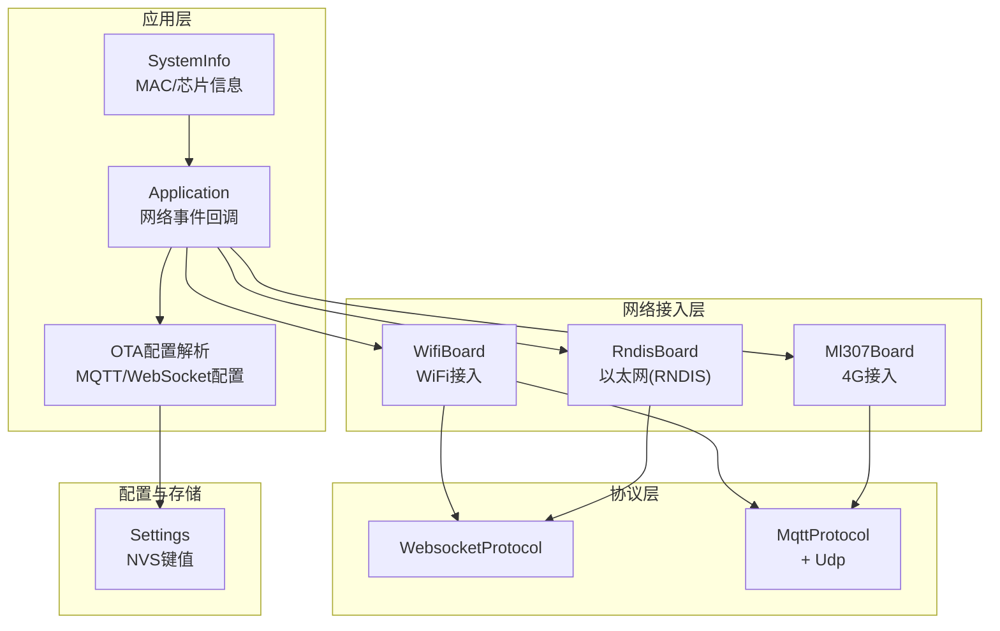
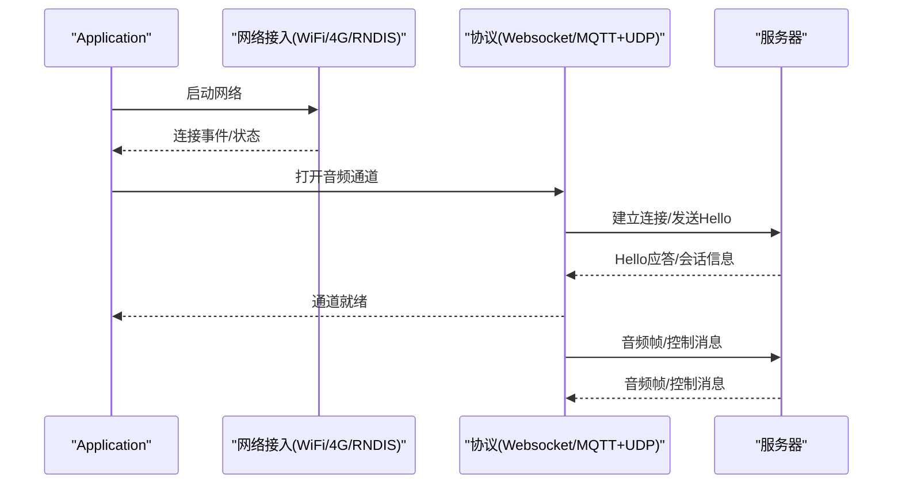
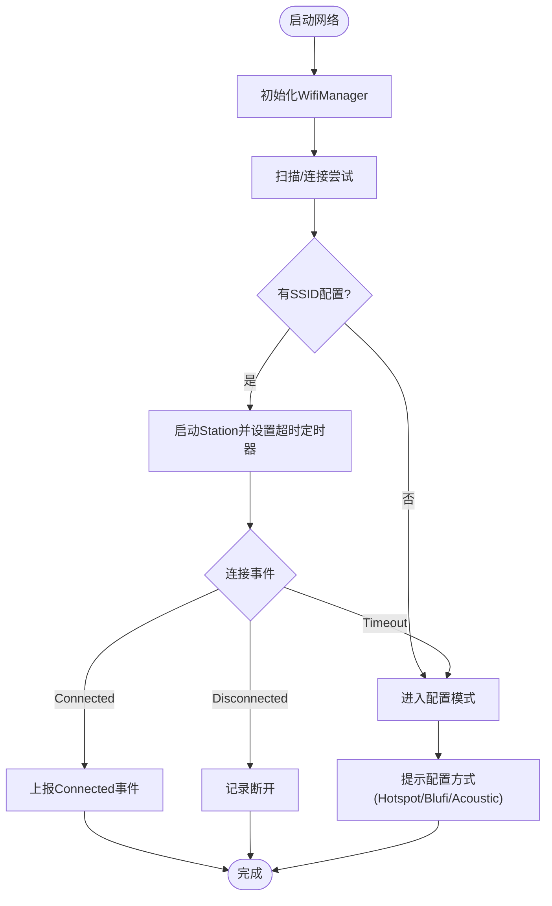
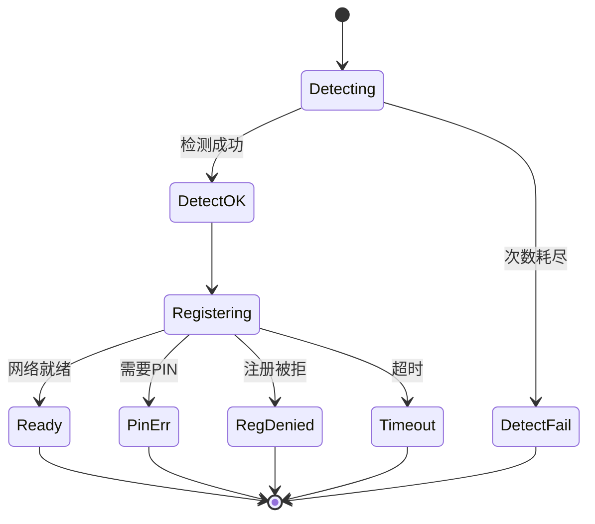
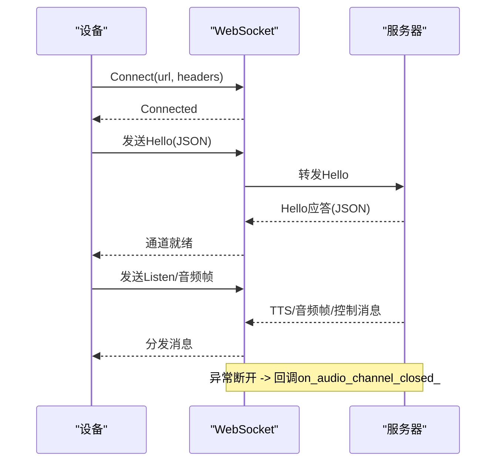
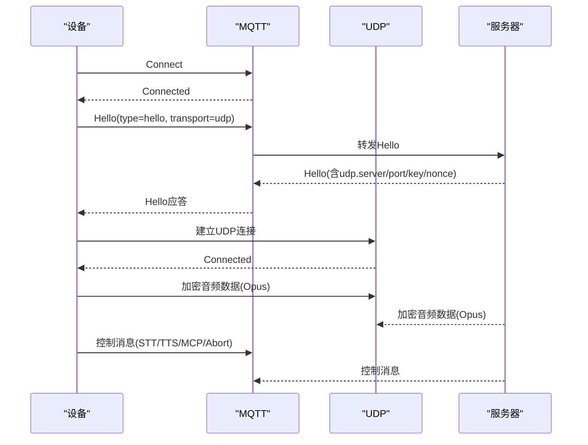
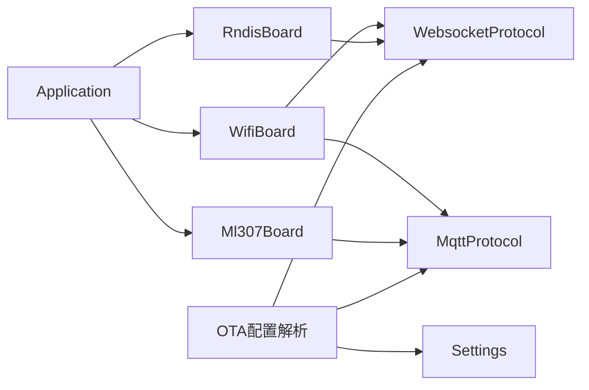

# 网络连接问题

<cite>
**本文引用的文件**
- [main/boards/common/wifi_board.h](file://main/boards/common/wifi_board.h)
- [main/boards/common/wifi_board.cc](file://main/boards/common/wifi_board.cc)
- [main/boards/common/ml307_board.h](file://main/boards/common/ml307_board.h)
- [main/boards/common/ml307_board.cc](file://main/boards/common/ml307_board.cc)
- [main/boards/common/rndis_board.cc](file://main/boards/common/rndis_board.cc)
- [main/application.cc](file://main/application.cc)
- [main/ota.cc](file://main/ota.cc)
- [main/ota.h](file://main/ota.h)
- [main/settings.h](file://main/settings.h)
- [main/system_info.h](file://main/system_info.h)
- [main/protocols/mqtt_protocol.h](file://main/protocols/mqtt_protocol.h)
- [main/protocols/websocket_protocol.h](file://main/protocols/websocket_protocol.h)
- [docs/websocket.md](file://docs/websocket.md)
- [docs/mqtt-udp.md](file://docs/mqtt-udp.md)
</cite>

## 目录
1. [简介](#简介)
2. [项目结构](#项目结构)
3. [核心组件](#核心组件)
4. [架构总览](#架构总览)
5. [详细组件分析](#详细组件分析)
6. [依赖关系分析](#依赖关系分析)
7. [性能考量](#性能考量)
8. [故障排除指南](#故障排除指南)
9. [结论](#结论)
10. [附录](#附录)

## 简介
本指南面向ESP32-AI项目的网络连接问题，覆盖WiFi连接失败、4G模块无法注册、网络超时、MQTT/WebSocket协议连接问题、网络状态监控与自动恢复、性能优化及多网络环境适配。文档基于仓库现有实现与文档，提供可操作的诊断步骤、排障流程与最佳实践。

## 项目结构
围绕网络连接的关键目录与文件：
- 网络接入层：WiFi、4G、以太网(RNDIS)接入板卡抽象与实现
- 应用层：网络事件回调、UI提示、设备状态上报
- 协议层：MQTT+UDP混合协议、WebSocket协议
- 配置与存储：Settings命名空间封装NVS读写
- 文档：WebSocket与MQTT+UDP协议规范与消息示例

**图表来源**
- [main/application.cc:127-182](file://main/application.cc#L127-L182)
- [main/boards/common/wifi_board.cc:52-87](file://main/boards/common/wifi_board.cc#L52-L87)
- [main/boards/common/ml307_board.cc:134-141](file://main/boards/common/ml307_board.cc#L134-L141)
- [main/boards/common/rndis_board.cc:30-57](file://main/boards/common/rndis_board.cc#L30-L57)
- [main/ota.cc:146-186](file://main/ota.cc#L146-L186)
- [main/protocols/websocket_protocol.h:13-32](file://main/protocols/websocket_protocol.h#L13-L32)
- [main/protocols/mqtt_protocol.h:26-62](file://main/protocols/mqtt_protocol.h#L26-L62)

**章节来源**
- [main/application.cc:127-182](file://main/application.cc#L127-L182)
- [main/boards/common/wifi_board.cc:52-87](file://main/boards/common/wifi_board.cc#L52-L87)
- [main/boards/common/ml307_board.cc:134-141](file://main/boards/common/ml307_board.cc#L134-L141)
- [main/boards/common/rndis_board.cc:30-57](file://main/boards/common/rndis_board.cc#L30-L57)
- [main/ota.cc:146-186](file://main/ota.cc#L146-L186)

## 核心组件
- WifiBoard：负责WiFi扫描、连接、配置模式、RSSI与IP状态上报、电源策略设置
- Ml307Board：负责4G模块检测、网络注册、CSQ信号强度、运营商信息、事件回调
- RndisBoard：负责USB RNDIS以太网接入，事件驱动的连接/断开处理
- Application：统一的网络事件回调入口，驱动UI状态与事件组
- WebsocketProtocol/MqttProtocol：分别承载WebSocket与MQTT+UDP协议栈
- Settings/SystemInfo：配置持久化与系统信息查询

**章节来源**
- [main/boards/common/wifi_board.h:9-67](file://main/boards/common/wifi_board.h#L9-L67)
- [main/boards/common/wifi_board.cc:29-104](file://main/boards/common/wifi_board.cc#L29-L104)
- [main/boards/common/ml307_board.h:9-36](file://main/boards/common/ml307_board.h#L9-L36)
- [main/boards/common/ml307_board.cc:67-132](file://main/boards/common/ml307_board.cc#L67-L132)
- [main/boards/common/rndis_board.cc:60-112](file://main/boards/common/rndis_board.cc#L60-L112)
- [main/application.cc:127-182](file://main/application.cc#L127-L182)
- [main/protocols/websocket_protocol.h:13-32](file://main/protocols/websocket_protocol.h#L13-L32)
- [main/protocols/mqtt_protocol.h:26-62](file://main/protocols/mqtt_protocol.h#L26-L62)
- [main/settings.h:7-26](file://main/settings.h#L7-L26)
- [main/system_info.h:9-21](file://main/system_info.h#L9-L21)

## 架构总览
ESP32-AI的网络路径分为两条主线：
- WiFi/以太网接入：WifiBoard/RndisBoard负责链路建立与状态上报
- 协议通道：WebsocketProtocol或MqttProtocol在链路之上承载音频与控制消息

**图表来源**
- [main/application.cc:127-182](file://main/application.cc#L127-L182)
- [main/boards/common/wifi_board.cc:52-87](file://main/boards/common/wifi_board.cc#L52-L87)
- [main/boards/common/ml307_board.cc:134-141](file://main/boards/common/ml307_board.cc#L134-L141)
- [main/boards/common/rndis_board.cc:30-57](file://main/boards/common/rndis_board.cc#L30-L57)
- [main/protocols/websocket_protocol.h:18-22](file://main/protocols/websocket_protocol.h#L18-L22)
- [main/protocols/mqtt_protocol.h:31-35](file://main/protocols/mqtt_protocol.h#L31-L35)

## 详细组件分析

### WiFi连接组件分析
- 连接流程：初始化WifiManager -> 注册事件回调 -> 尝试连接或进入配置模式 -> 超时回调进入配置模式
- 配置模式：热点配置、Blufi、声学配置三种方式
- 状态上报：RSSI、信道、IP、MAC等信息用于设备状态JSON与UI展示
- 电源策略：支持低功耗/平衡/高性能三种PS模式

**图表来源**
- [main/boards/common/wifi_board.cc:52-104](file://main/boards/common/wifi_board.cc#L52-L104)
- [main/boards/common/wifi_board.cc:151-157](file://main/boards/common/wifi_board.cc#L151-L157)
- [main/boards/common/wifi_board.cc:159-197](file://main/boards/common/wifi_board.cc#L159-L197)
- [main/boards/common/wifi_board.cc:268-282](file://main/boards/common/wifi_board.cc#L268-L282)

**章节来源**
- [main/boards/common/wifi_board.h:9-67](file://main/boards/common/wifi_board.h#L9-L67)
- [main/boards/common/wifi_board.cc:52-104](file://main/boards/common/wifi_board.cc#L52-L104)
- [main/boards/common/wifi_board.cc:151-157](file://main/boards/common/wifi_board.cc#L151-L157)
- [main/boards/common/wifi_board.cc:159-197](file://main/boards/common/wifi_board.cc#L159-L197)
- [main/boards/common/wifi_board.cc:268-282](file://main/boards/common/wifi_board.cc#L268-L282)

### 4G模块(ML307)组件分析
- 检测与注册：多次尝试检测模块 -> 设置网络状态回调 -> 等待网络就绪 -> 处理PIN/注册拒绝/超时等错误事件
- 事件上报：ModemDetecting/Connecting/Connected/Disconnected/错误事件
- 状态图标：依据CSQ值映射信号强度
- 设备状态：携带运营商、CSQ、IMEI、ICCID、注册状态等

**图表来源**
- [main/boards/common/ml307_board.cc:67-132](file://main/boards/common/ml307_board.cc#L67-L132)
- [main/boards/common/ml307_board.cc:147-166](file://main/boards/common/ml307_board.cc#L147-L166)
- [main/boards/common/ml307_board.cc:186-270](file://main/boards/common/ml307_board.cc#L186-L270)

**章节来源**
- [main/boards/common/ml307_board.h:9-36](file://main/boards/common/ml307_board.h#L9-L36)
- [main/boards/common/ml307_board.cc:67-132](file://main/boards/common/ml307_board.cc#L67-L132)
- [main/boards/common/ml307_board.cc:147-166](file://main/boards/common/ml307_board.cc#L147-L166)
- [main/boards/common/ml307_board.cc:186-270](file://main/boards/common/ml307_board.cc#L186-L270)

### 以太网(RNDIS)组件分析
- 事件驱动：ETH事件与IP事件处理，连接即设置事件位，断开清除事件位
- 初始化：NVS初始化、TCP/IP栈、事件循环、USB CDC驱动安装、RNDIS网卡等待IP

**章节来源**
- [main/boards/common/rndis_board.cc:1-58](file://main/boards/common/rndis_board.cc#L1-L58)
- [main/boards/common/rndis_board.cc:60-112](file://main/boards/common/rndis_board.cc#L60-L112)

### 协议组件分析

#### WebSocket协议
- 连接与Hello：建立连接、发送/等待Hello、超时判定、断连回调
- 请求头：Authorization、Protocol-Version、Device-Id、Client-Id
- 消息类型：hello、listen、abort、wake word、mcp、stt、tts、llm、system、custom等
- 状态流转：Idle/Connecting/Listening/Speaking

**图表来源**
- [docs/websocket.md:16-78](file://docs/websocket.md#L16-L78)
- [docs/websocket.md:82-91](file://docs/websocket.md#L82-L91)
- [docs/websocket.md:128-292](file://docs/websocket.md#L128-L292)
- [docs/websocket.md:369-378](file://docs/websocket.md#L369-L378)

**章节来源**
- [main/protocols/websocket_protocol.h:13-32](file://main/protocols/websocket_protocol.h#L13-L32)
- [docs/websocket.md:1-496](file://docs/websocket.md#L1-L496)

#### MQTT+UDP协议
- 混合通道：MQTT用于控制/状态，UDP用于实时音频(加密)
- Hello交换：MQTT通道协商UDP服务器、端口、密钥、随机数
- 音频包结构：类型、标志、长度、SSRC、时间戳、序列号、加密负载
- 状态机：Disconnected/MqttConnecting/MqttConnected/RequestingChannel/ChannelOpened/UdpConnected/AudioStreaming

**图表来源**
- [docs/mqtt-udp.md:22-57](file://docs/mqtt-udp.md#L22-L57)
- [docs/mqtt-udp.md:71-113](file://docs/mqtt-udp.md#L71-L113)
- [docs/mqtt-udp.md:176-224](file://docs/mqtt-udp.md#L176-L224)
- [docs/mqtt-udp.md:226-246](file://docs/mqtt-udp.md#L226-L246)

**章节来源**
- [main/protocols/mqtt_protocol.h:26-62](file://main/protocols/mqtt_protocol.h#L26-L62)
- [docs/mqtt-udp.md:1-393](file://docs/mqtt-udp.md#L1-L393)

## 依赖关系分析
- Application通过SetNetworkEventCallback统一接收网络事件，驱动UI与事件组
- WifiBoard/Ml307Board/RndisBoard分别实现StartNetwork并上报NetworkEvent
- 协议层依赖网络接口提供的连接能力
- OTA配置解析支持MQTT/WebSocket配置注入

**图表来源**
- [main/application.cc:127-182](file://main/application.cc#L127-L182)
- [main/boards/common/wifi_board.cc:52-87](file://main/boards/common/wifi_board.cc#L52-L87)
- [main/boards/common/ml307_board.cc:134-141](file://main/boards/common/ml307_board.cc#L134-L141)
- [main/boards/common/rndis_board.cc:30-57](file://main/boards/common/rndis_board.cc#L30-L57)
- [main/ota.cc:146-186](file://main/ota.cc#L146-L186)

**章节来源**
- [main/application.cc:127-182](file://main/application.cc#L127-L182)
- [main/ota.cc:146-186](file://main/ota.cc#L146-L186)

## 性能考量
- WiFi电源策略：低功耗/平衡/高性能三档，按场景选择
- UDP通道：AES-CTR加密、序列号管理、并发互斥保护
- 超时与重连：协议层默认超时与MQTT自动重连策略
- 带宽与延迟：WebSocket默认Opus参数与协议版本配置；MQTT+UDP适合高实时性场景

**章节来源**
- [main/boards/common/wifi_board.cc:284-299](file://main/boards/common/wifi_board.cc#L284-L299)
- [main/protocols/mqtt_protocol.h:21-22](file://main/protocols/mqtt_protocol.h#L21-L22)
- [docs/websocket.md:390-398](file://docs/websocket.md#L390-L398)
- [docs/mqtt-udp.md:323-343](file://docs/mqtt-udp.md#L323-L343)

## 故障排除指南

### 一、WiFi连接失败
- 现象
  - UI显示“扫描/连接中”，长时间无进展或断开
  - RSSI弱或IP为空
- 诊断步骤
  - 确认SSID列表是否已保存（无SSID将进入配置模式）
  - 观察连接超时回调是否触发（进入配置模式）
  - 查看UI状态图标与日志中的连接事件
  - 获取设备状态JSON，核对ssid、rssi、channel、ip、mac
- 解决方法
  - 重新进入配置模式，确保热点/Blufi/声学配置流程成功
  - 调整电源策略至平衡/高性能
  - 更换位置或AP，提升RSSI
  - 如为以太网设备，确认RNDIS已获得IP

**章节来源**
- [main/boards/common/wifi_board.cc:89-104](file://main/boards/common/wifi_board.cc#L89-L104)
- [main/boards/common/wifi_board.cc:151-157](file://main/boards/common/wifi_board.cc#L151-L157)
- [main/boards/common/wifi_board.cc:268-282](file://main/boards/common/wifi_board.cc#L268-L282)
- [main/boards/common/rndis_board.cc:83-86](file://main/boards/common/rndis_board.cc#L83-L86)

### 二、4G模块无法注册
- 现象
  - “检测模块/注册网络”事件持续，无SIM或注册被拒/超时
  - CSQ未知或极低
- 诊断步骤
  - 观察事件回调：ModemDetecting/Connecting/Connected/Disconnected/错误
  - 读取设备状态JSON，查看carrier、csq、imei、iccid、cereg
- 解决方法
  - 检查SIM卡是否插入正确
  - 确认所在区域网络覆盖良好
  - 等待多次重试后仍失败，记录日志并上报错误

**章节来源**
- [main/boards/common/ml307_board.cc:31-65](file://main/boards/common/ml307_board.cc#L31-L65)
- [main/boards/common/ml307_board.cc:100-123](file://main/boards/common/ml307_board.cc#L100-L123)
- [main/boards/common/ml307_board.cc:168-179](file://main/boards/common/ml307_board.cc#L168-L179)
- [main/boards/common/ml307_board.cc:186-270](file://main/boards/common/ml307_board.cc#L186-L270)

### 三、网络超时
- 现象
  - WiFi连接超时进入配置模式
  - 协议层Hello超时或通道不可用
- 诊断步骤
  - 查看连接超时回调日志
  - 检查协议层超时阈值与最后一次接收时间
- 解决方法
  - 重试连接或重新配置网络
  - 对MQTT通道启用自动重连

**章节来源**
- [main/boards/common/wifi_board.cc:151-157](file://main/boards/common/wifi_board.cc#L151-L157)
- [docs/mqtt-udp.md:294-300](file://docs/mqtt-udp.md#L294-L300)

### 四、MQTT/WebSocket协议问题

#### 认证失败
- 现象
  - WebSocket握手被拒绝或MQTT连接被拒
- 诊断步骤
  - 检查Authorization头与服务器端令牌有效性
  - 核对Protocol-Version、Device-Id、Client-Id
- 解决方法
  - 更新令牌或修正请求头

**章节来源**
- [docs/websocket.md:82-91](file://docs/websocket.md#L82-L91)

#### 消息丢失/连接中断
- 现象
  - WebSocket异常断开，回调on_audio_channel_closed_
  - MQTT断线后自动重连
- 诊断步骤
  - 观察协议层断开回调与事件标志
  - 检查MQTT重连间隔与UDP通道状态
- 解决方法
  - 依赖自动重连；必要时人工重启协议通道

**章节来源**
- [docs/websocket.md:374-378](file://docs/websocket.md#L374-L378)
- [docs/mqtt-udp.md:280-287](file://docs/mqtt-udp.md#L280-L287)

#### Hello超时
- 现象
  - WebSocket等待服务器Hello超时
- 诊断步骤
  - 检查服务器响应与网络连通性
- 解决方法
  - 重试或检查服务器端配置

**章节来源**
- [docs/websocket.md:61-62](file://docs/websocket.md#L61-L62)

### 五、网络状态监控与自动恢复
- 状态监控
  - Application统一回调，驱动UI通知与事件组
  - WifiBoard/RndisBoard提供状态图标与设备状态JSON
  - Ml307Board提供CSQ与运营商信息
- 自动恢复
  - WiFi连接超时自动进入配置模式
  - MQTT断线自动重连
  - 协议层超时检测与通道清理

**章节来源**
- [main/application.cc:127-182](file://main/application.cc#L127-L182)
- [main/boards/common/wifi_board.cc:249-266](file://main/boards/common/wifi_board.cc#L249-L266)
- [main/boards/common/rndis_board.cc:90-112](file://main/boards/common/rndis_board.cc#L90-L112)
- [main/boards/common/ml307_board.cc:147-166](file://main/boards/common/ml307_board.cc#L147-L166)
- [docs/mqtt-udp.md:280-287](file://docs/mqtt-udp.md#L280-L287)

### 六、网络性能优化建议
- 带宽管理
  - WebSocket协议版本选择与音频参数（采样率、帧时长）按场景调整
- 延迟优化
  - 优先选择UDP通道（MQTT+UDP）以降低音频传输延迟
- 丢包处理
  - UDP通道使用序列号与AES-CTR，具备防重放与容错记录

**章节来源**
- [docs/websocket.md:390-398](file://docs/websocket.md#L390-L398)
- [docs/mqtt-udp.md:211-223](file://docs/mqtt-udp.md#L211-L223)

### 七、不同网络环境下的适配方案
- WiFi环境
  - 选择合适电源策略；关注RSSI与信道
- 4G环境
  - 关注CSQ与运营商；确保SIM卡与网络覆盖
- 以太网(RNDIS)
  - 确保USB CDC驱动与RNDIS网卡正常，等待IP事件

**章节来源**
- [main/boards/common/wifi_board.cc:284-299](file://main/boards/common/wifi_board.cc#L284-L299)
- [main/boards/common/ml307_board.cc:147-166](file://main/boards/common/ml307_board.cc#L147-L166)
- [main/boards/common/rndis_board.cc:30-57](file://main/boards/common/rndis_board.cc#L30-L57)

### 八、网络诊断工具与日志分析
- 诊断工具
  - 设备状态JSON：包含网络类型、SSID、RSSI、IP、MAC、CSQ、运营商等
  - SystemInfo：MAC地址、芯片型号、用户代理等
  - Settings：NVS键值读写，用于配置持久化
- 日志分析
  - WiFi：扫描、连接、断开、配置模式进入/退出
  - 4G：模块检测、注册过程、错误事件
  - 协议：连接、Hello、断开、超时

**章节来源**
- [main/boards/common/wifi_board.cc:268-282](file://main/boards/common/wifi_board.cc#L268-L282)
- [main/boards/common/ml307_board.cc:168-179](file://main/boards/common/ml307_board.cc#L168-L179)
- [main/system_info.h:9-21](file://main/system_info.h#L9-L21)
- [main/settings.h:7-26](file://main/settings.h#L7-L26)

## 结论
本指南基于ESP32-AI现有实现，提供了从接入层到协议层的全链路网络问题排查路径。通过统一的网络事件回调、丰富的状态上报与日志、以及协议层的自动重连与超时机制，可快速定位并解决WiFi连接失败、4G模块无法注册、网络超时、MQTT/WebSocket协议问题等常见故障。建议在不同网络环境下结合电源策略、协议版本与通道选择，持续监控设备状态JSON与日志，以实现稳定可靠的网络连接。

## 附录
- 协议消息与状态参考
  - WebSocket协议：握手、Hello、Listen、Abort、Wake Word、MCP、STT、TTS、LLM、System、Custom等
  - MQTT+UDP协议：控制消息与UDP音频通道交互流程

**章节来源**
- [docs/websocket.md:128-292](file://docs/websocket.md#L128-L292)
- [docs/mqtt-udp.md:120-173](file://docs/mqtt-udp.md#L120-L173)