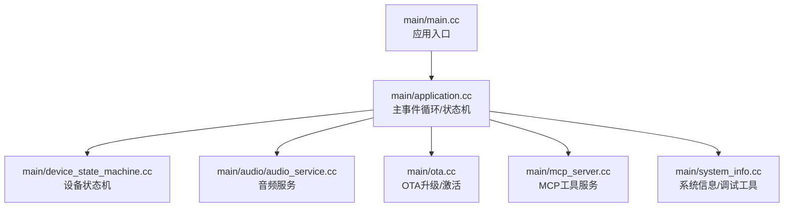
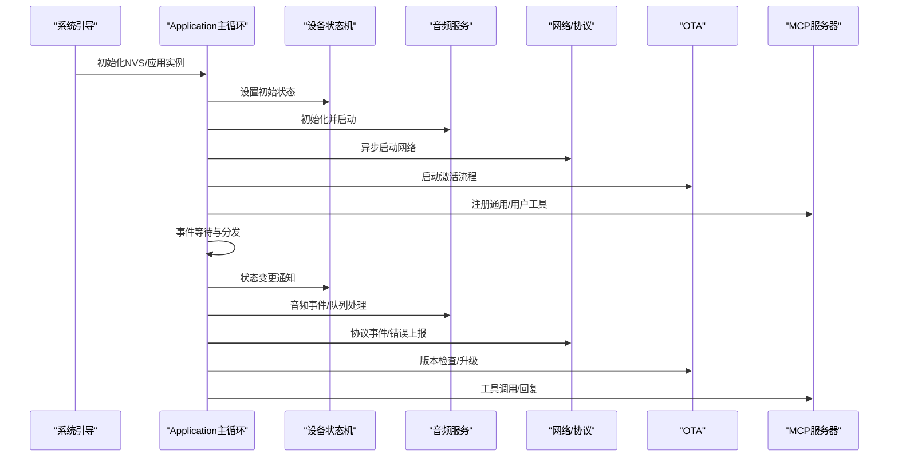
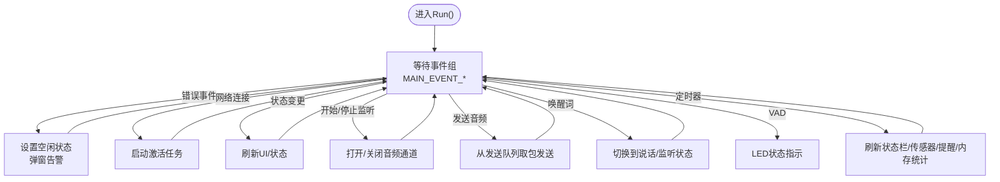
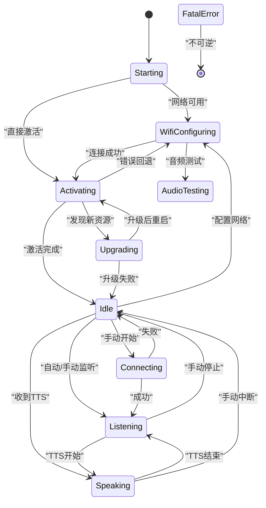
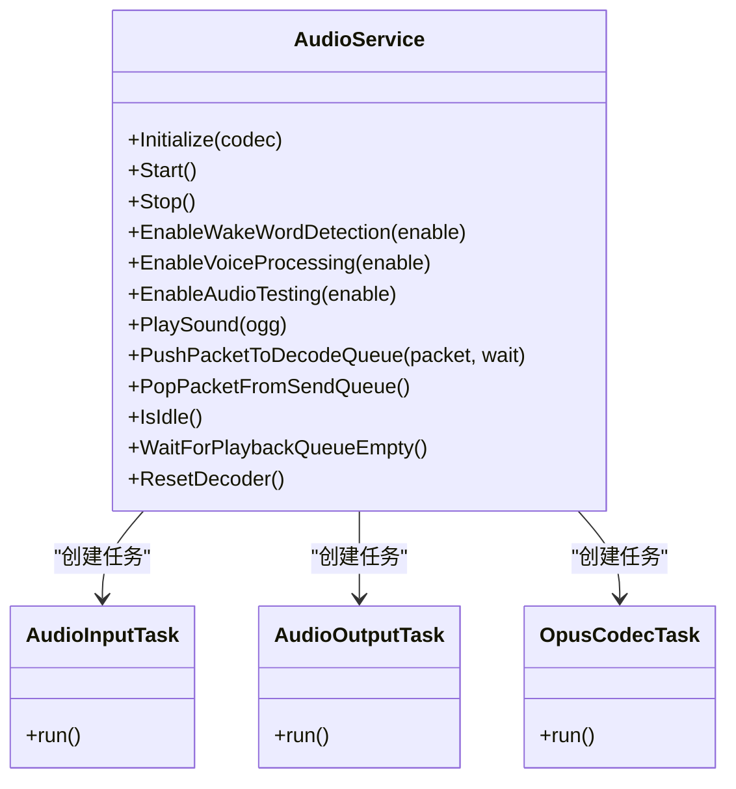
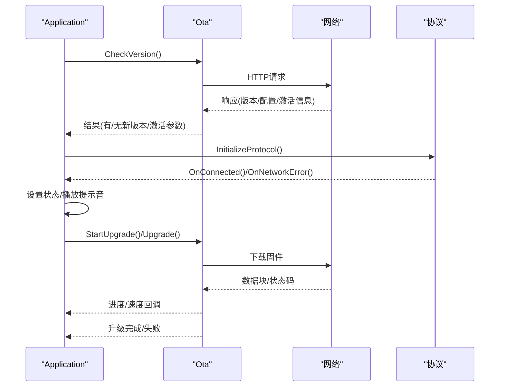
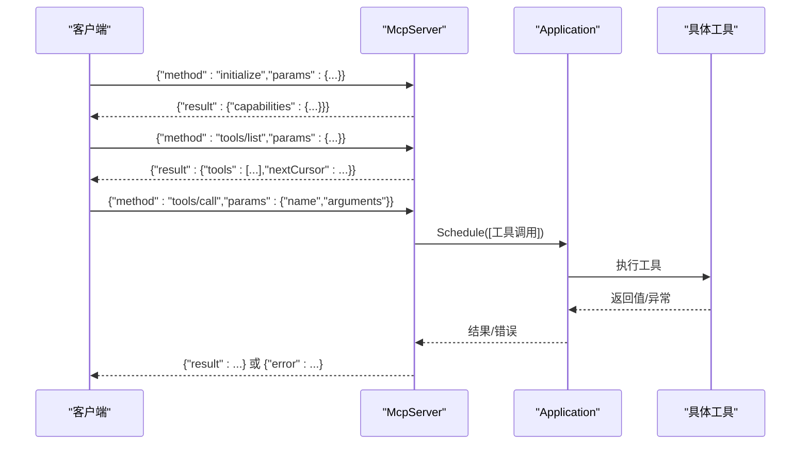
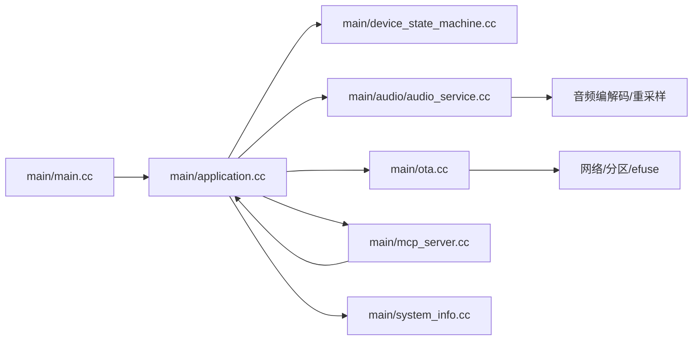

# 运行时错误

<cite>
**本文引用的文件**
- [main.cc](file://main/main.cc)
- [application.cc](file://main/application.cc)
- [application.h](file://main/application.h)
- [device_state_machine.cc](file://main/device_state_machine.cc)
- [device_state_machine.h](file://main/device_state_machine.h)
- [device_state.h](file://main/device_state.h)
- [audio_service.cc](file://main/audio/audio_service.cc)
- [mcp_server.cc](file://main/mcp_server.cc)
- [system_info.cc](file://main/system_info.cc)
- [system_info.h](file://main/system_info.h)
- [ota.cc](file://main/ota.cc)
</cite>

## 目录
1. [简介](#简介)
2. [项目结构](#项目结构)
3. [核心组件](#核心组件)
4. [架构总览](#架构总览)
5. [详细组件分析](#详细组件分析)
6. [依赖关系分析](#依赖关系分析)
7. [性能考量](#性能考量)
8. [故障排除指南](#故障排除指南)
9. [结论](#结论)
10. [附录](#附录)

## 简介
本指南聚焦于ESP32-AI项目的运行时错误与稳定性问题，覆盖崩溃、内存泄漏、死锁、任务调度异常、FreeRTOS任务相关问题（优先级反转、资源竞争、事件组误用）、设备状态机异常、以及网络/协议交互中的常见陷阱。文档提供系统化的调试方法，包括ESP-IDF GDB调试、日志分析、内存监控、任务CPU占用统计、以及如何分析core dump与崩溃转储文件。同时给出针对音频服务、OTA升级、MCP服务器等模块的诊断步骤与修复建议。

## 项目结构
应用入口在main/main.cc中初始化NVS与应用实例，并启动主事件循环；应用逻辑集中在main/application.cc中，采用事件驱动模型与设备状态机协同工作；音频子系统位于main/audio目录，负责编解码、唤醒词、语音处理与播放；系统信息与调试工具位于main/system_info.*；OTA与协议交互位于main/ota.cc与协议实现中；MCP服务器位于main/mcp_server.cc，提供远程工具调用能力。

图示来源
- [main.cc](file://main/main.cc)
- [application.cc](file://main/application.cc)
- [device_state_machine.cc](file://main/device_state_machine.cc)
- [audio_service.cc](file://main/audio/audio_service.cc)
- [mcp_server.cc](file://main/mcp_server.cc)
- [system_info.cc](file://main/system_info.cc)
- [ota.cc](file://main/ota.cc)

章节来源
- [main.cc](file://main/main.cc)
- [application.cc](file://main/application.cc)

## 核心组件
- 应用主循环与事件分发：通过FreeRTOS事件组聚合多源事件，统一处理网络、状态变化、用户交互、定时器等，避免直接共享全局变量引发竞态。
- 设备状态机：严格的状态转移规则与回调通知，确保UI、音频、网络等子系统按序切换，防止非法状态导致的资源冲突。
- 音频服务：多任务协作（输入、输出、编解码），内置队列容量控制与超时保护，支持唤醒词检测、语音处理、AEC模式切换。
- OTA与协议：异步版本检查、激活流程、MQTT/WebSocket协议选择与连接管理，具备网络错误上报与降级处理。
- MCP服务器：基于JSON-RPC的工具调用框架，支持用户工具与系统工具，具备参数校验与线程调度。

章节来源
- [application.cc](file://main/application.cc)
- [application.h](file://main/application.h)
- [device_state_machine.cc](file://main/device_state_machine.cc)
- [audio_service.cc](file://main/audio/audio_service.cc)
- [mcp_server.cc](file://main/mcp_server.cc)
- [system_info.cc](file://main/system_info.cc)
- [ota.cc](file://main/ota.cc)

## 架构总览
应用采用“事件驱动 + 状态机”的架构，主任务作为事件中枢，其他子系统以任务或回调形式参与协作。音频服务内部再细分为输入、输出、编解码三个任务，配合队列与条件变量实现背压与同步。OTA与协议模块在连接建立后才初始化，避免无网络环境下的资源浪费。

图示来源
- [main.cc](file://main/main.cc)
- [application.cc](file://main/application.cc)
- [device_state_machine.cc](file://main/device_state_machine.cc)
- [audio_service.cc](file://main/audio/audio_service.cc)
- [ota.cc](file://main/ota.cc)
- [mcp_server.cc](file://main/mcp_server.cc)

## 详细组件分析

### 应用主循环与事件模型
- 事件位定义集中于头文件，主循环使用事件组等待多事件并发触发，避免阻塞在单一事件上。
- 事件处理器内尽量短平快，复杂逻辑通过队列或Schedule投递到主任务上下文执行，降低ISR/回调中的锁粒度。
- 定时器周期性触发时钟tick，用于UI刷新、传感器更新、提醒检查与内存统计打印。

图示来源
- [application.cc](file://main/application.cc)
- [application.h](file://main/application.h)

章节来源
- [application.cc](file://main/application.cc)
- [application.h](file://main/application.h)

### 设备状态机
- 状态转移规则明确，非法转移会被记录日志并拒绝，有助于快速定位状态机滥用。
- 支持添加/移除状态变更监听器，便于UI与业务逻辑解耦。
- 当处于致命错误状态时禁止任何状态转移，确保系统稳定退出或重启。

图示来源
- [device_state_machine.cc](file://main/device_state_machine.cc)
- [device_state.h](file://main/device_state.h)

章节来源
- [device_state_machine.cc](file://main/device_state_machine.cc)
- [device_state_machine.h](file://main/device_state_machine.h)
- [device_state.h](file://main/device_state.h)

### 音频服务（含唤醒词、语音处理、编解码）
- 多任务分工清晰：输入任务读取硬件数据、输出任务播放PCM、编解码任务负责OPUS编码/解码与重采样。
- 内置队列容量上限与条件变量等待，防止队列无限增长导致内存耗尽。
- 支持AEC模式切换、唤醒词检测、音频测试模式，切换时重置相关状态与缓冲，避免旧数据污染。
- 提供音频功率管理定时器，空闲时自动关闭输入/输出，降低功耗。

图示来源
- [audio_service.cc](file://main/audio/audio_service.cc)

章节来源
- [audio_service.cc](file://main/audio/audio_service.cc)

### OTA与协议交互
- 版本检查与激活流程分离，支持多次重试与超时处理，避免阻塞主循环。
- 协议初始化根据配置选择MQTT或WebSocket，网络错误通过事件上报至主循环，触发告警与状态回退。
- 升级流程具备进度回调与速度统计，升级完成后标记有效并设置下次启动分区。

图示来源
- [application.cc](file://main/application.cc)
- [ota.cc](file://main/ota.cc)

章节来源
- [application.cc](file://main/application.cc)
- [ota.cc](file://main/ota.cc)

### MCP服务器
- 基于JSON-RPC 2.0，支持initialize、tools/list、tools/call等方法，工具列表可分页返回。
- 参数类型校验与默认值检查，缺失或类型不符时返回错误。
- 工具调用通过Application::Schedule投递到主线程执行，保证线程安全与一致性。

图示来源
- [mcp_server.cc](file://main/mcp_server.cc)
- [application.h](file://main/application.h)

章节来源
- [mcp_server.cc](file://main/mcp_server.cc)
- [application.h](file://main/application.h)

## 依赖关系分析
- 入口依赖：main/main.cc依赖nvs与Application单例。
- Application依赖：设备状态机、音频服务、OTA、协议接口、显示/网络抽象、提醒管理。
- 音频服务依赖：编解码库、重采样库、唤醒词/语音处理模块、音频编解码器。
- 系统信息依赖：FreeRTOS、ESP-IDF系统API，用于任务列表、堆内存统计、电源管理锁dump。
- OTA依赖：HTTP客户端、分区操作、efuse/HMAC等平台能力。
- MCP服务器依赖：cJSON、Application调度、Board能力查询。

图示来源
- [main.cc](file://main/main.cc)
- [application.cc](file://main/application.cc)
- [device_state_machine.cc](file://main/device_state_machine.cc)
- [audio_service.cc](file://main/audio/audio_service.cc)
- [ota.cc](file://main/ota.cc)
- [mcp_server.cc](file://main/mcp_server.cc)
- [system_info.cc](file://main/system_info.cc)

章节来源
- [main.cc](file://main/main.cc)
- [application.cc](file://main/application.cc)

## 性能考量
- 任务CPU使用率：可通过SystemInfo::PrintTaskCpuUsage定期采样，对比各任务运行时间占比，识别热点任务与异常占用。
- 堆内存监控：SystemInfo::PrintHeapStats输出当前SRAM空闲与历史最小空闲，结合heap_caps系列API定位碎片化与泄漏点。
- 队列背压：音频服务对发送/解码/播放队列设置上限，必要时增加队列深度或降低帧长/采样率以缓解压力。
- 任务优先级：主循环优先级固定，音频任务优先级高于普通任务，避免抢占导致的音频抖动。
- 功耗优化：音频功率定时器在空闲时自动关闭输入/输出，减少不必要的功耗。

章节来源
- [system_info.cc](file://main/system_info.cc)
- [audio_service.cc](file://main/audio/audio_service.cc)
- [application.cc](file://main/application.cc)

## 故障排除指南

### 一、常见运行时崩溃与core dump分析
- 现象特征
  - 看门狗复位/硬Fault/总线Fault
  - 崩溃时寄存器/堆栈内容不一致
  - 重复出现的崩溃地址集中在特定模块（如音频编解码、网络HTTP、MCP解析）
- 快速定位
  - 使用ESP-IDF GDB：在目标端开启GDB Server，IDE侧连接，断点命中后查看调用栈与关键变量。
  - 生成并下载core dump：在SDK配置中启用core dump功能，保存转储文件后用idf.py分析。
  - 关注常见风险点：数组越界、空指针解引用、未初始化的指针、跨任务共享未加锁的数据结构。
- 建议措施
  - 对所有外部输入（HTTP响应、JSON、音频数据）进行长度/类型校验后再使用。
  - 为共享资源引入互斥量或原子变量，避免竞态。
  - 在关键路径增加边界检查与日志，便于回溯。

章节来源
- [audio_service.cc](file://main/audio/audio_service.cc)
- [mcp_server.cc](file://main/mcp_server.cc)
- [ota.cc](file://main/ota.cc)

### 二、内存泄漏与碎片化
- 现象特征
  - 系统可用堆持续下降，最终导致分配失败
  - 任务栈/队列异常膨胀
- 排查步骤
  - 使用SystemInfo::PrintHeapStats观察free sram与最小空闲，结合heap_caps_get_info定位分配区域。
  - 检查动态分配点：音频服务的编码/解码缓冲、MCP下载图片/屏幕截图、OTA升级下载缓冲等。
  - 关注释放时机：HTTP句柄、cJSON对象、临时缓冲区是否成对释放。
- 修复建议
  - 统一使用RAII封装资源生命周期，避免裸指针。
  - 对大块内存分配（如屏幕截图）及时释放，避免长时间驻留。
  - 降低帧长/采样率或减少并发任务数量，缓解内存压力。

章节来源
- [system_info.cc](file://main/system_info.cc)
- [audio_service.cc](file://main/audio/audio_service.cc)
- [mcp_server.cc](file://main/mcp_server.cc)
- [ota.cc](file://main/ota.cc)

### 三、死锁与优先级反转
- 现象特征
  - 某些任务长期不被调度，事件组等待永不超时
  - 主循环卡住，无法响应按键/网络事件
- 可能原因
  - 事件组等待未设置超时，且缺少必要的事件位
  - 音频服务队列满导致编解码任务阻塞，进而影响主循环
  - 状态机回调中再次尝试修改状态，形成环路
- 诊断与修复
  - 为主循环等待设置合理超时，避免永久阻塞。
  - 检查音频服务队列上限与生产者/消费者速率匹配，必要时调整优先级或队列深度。
  - 确保状态机回调不直接调用TransitionTo，改为通过事件位异步触发。

章节来源
- [application.cc](file://main/application.cc)
- [audio_service.cc](file://main/audio/audio_service.cc)
- [device_state_machine.cc](file://main/device_state_machine.cc)

### 四、任务调度问题
- 现象特征
  - 音频卡顿/破音、TTS播放延迟
  - UI刷新掉帧、按键无响应
- 排查要点
  - 使用SystemInfo::PrintTaskList与PrintTaskCpuUsage查看任务状态与CPU占用。
  - 检查音频任务优先级是否过高/过低，与其他高负载任务是否存在抢占冲突。
  - 确认主循环未被长时间阻塞（例如在事件处理中执行耗时操作）。
- 优化建议
  - 将耗时操作（如HTTP下载、图像处理）放入后台任务，仅传递结果给主循环。
  - 合理划分任务职责，避免单任务承担过多职责。

章节来源
- [system_info.cc](file://main/system_info.cc)
- [audio_service.cc](file://main/audio/audio_service.cc)
- [application.cc](file://main/application.cc)

### 五、FreeRTOS事件组误用
- 常见问题
  - 仅设置事件位但未等待，导致事件丢失
  - 在ISR中直接执行耗时操作，破坏实时性
  - 事件位命名混乱，难以维护
- 修复建议
  - 事件位定义集中于头文件，事件处理函数内仅做轻量处理，复杂逻辑通过队列/回调异步执行。
  - ISR中仅设置事件位，不进行阻塞操作。

章节来源
- [application.h](file://main/application.h)
- [application.cc](file://main/application.cc)

### 六、设备状态机异常
- 现象特征
  - 状态无法从某个状态切换出去
  - UI与实际状态不一致
- 排查步骤
  - 查看状态机日志，确认是否发生非法转移
  - 检查状态变更监听器是否正确注册/注销
  - 确认主循环事件处理中未直接修改状态，而是通过事件位触发
- 修复建议
  - 保持状态机只读接口，所有状态变更通过TransitionTo发起
  - 对外暴露状态变更回调，内部仅通过事件驱动

章节来源
- [device_state_machine.cc](file://main/device_state_machine.cc)
- [application.cc](file://main/application.cc)

### 七、音频相关问题
- 常见症状
  - 唤醒词检测不稳定、VAD误判
  - 编解码失败、播放无声
  - 音频通道打开失败或延迟过大
- 诊断与修复
  - 检查音频编解码器采样率与帧长是否符合期望，必要时调整重采样参数
  - 确认音频输入/输出使能状态与功率定时器逻辑
  - 在切换AEC/唤醒词/语音处理模式时，重置相关队列与状态
  - 对网络错误或协议异常，确保关闭音频通道并回退到空闲状态

章节来源
- [audio_service.cc](file://main/audio/audio_service.cc)
- [application.cc](file://main/application.cc)

### 八、OTA与协议交互问题
- 现象特征
  - 版本检查频繁失败或超时
  - 激活流程卡住、无法进入正常工作态
  - 升级过程中断、镜像校验失败
- 排查步骤
  - 检查HTTP连接状态码与错误码，确认URL与头部设置正确
  - 观察升级进度回调与速度统计，判断网络质量
  - 激活流程中若返回超时，适当延长等待时间并重试
- 修复建议
  - 为网络请求设置合理的超时与重试策略
  - 升级完成后调用标记有效与设置启动分区的流程

章节来源
- [ota.cc](file://main/ota.cc)
- [application.cc](file://main/application.cc)

### 九、MCP工具调用问题
- 现象特征
  - tools/call返回参数缺失/类型错误
  - 工具执行抛出异常，客户端收到错误
- 排查步骤
  - 检查工具参数类型与默认值，确保客户端传参完整
  - 在工具执行前后记录日志，定位异常点
- 修复建议
  - 对工具参数进行严格的类型与范围校验
  - 工具执行失败时返回标准JSON-RPC错误格式

章节来源
- [mcp_server.cc](file://main/mcp_server.cc)

### 十、调试工具与方法
- ESP-IDF GDB
  - 在目标端启用GDB Server，IDE侧连接，设置断点，查看调用栈与变量
- 日志分析
  - 使用ESP_LOGW/ESP_LOGE输出关键路径与错误信息，便于回溯
- 内存监控
  - SystemInfo::PrintHeapStats定期打印，关注free sram与最小空闲
- 任务统计
  - SystemInfo::PrintTaskList与PrintTaskCpuUsage分析任务状态与CPU占用
- 核心转储分析
  - 生成core dump后使用idf.py分析，定位崩溃地址与调用链

章节来源
- [system_info.cc](file://main/system_info.cc)
- [application.cc](file://main/application.cc)

## 结论
本指南围绕ESP32-AI项目的运行时稳定性，提供了从架构层面到具体模块的系统化排错方法。通过事件驱动与状态机的约束、音频服务的背压与优先级设计、OTA与协议的健壮性实现，以及完善的调试工具链，可以有效降低崩溃、内存问题与任务调度异常的发生概率。建议在开发与回归测试中持续使用日志、内存与任务统计工具，及早发现并修复隐患。

## 附录
- 常用调试命令参考
  - 任务列表：vTaskList
  - CPU使用率：vTaskGetRunTimeCounter
  - 堆内存：heap_caps_get_free_size / heap_caps_get_minimum_free_size
  - 电源管理锁：esp_pm_dump_locks