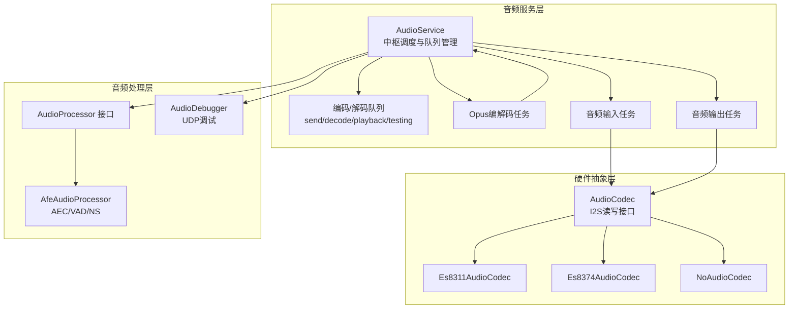
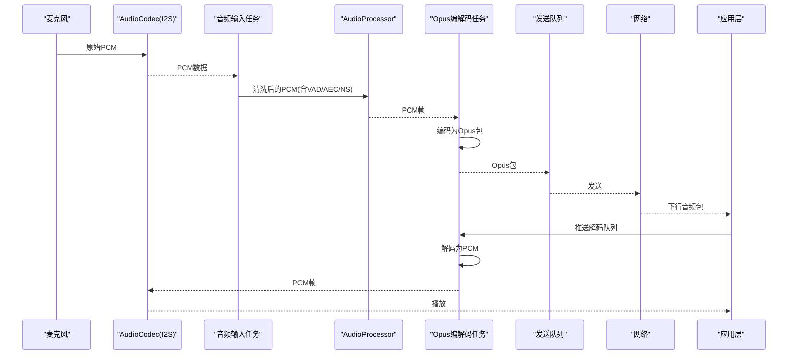
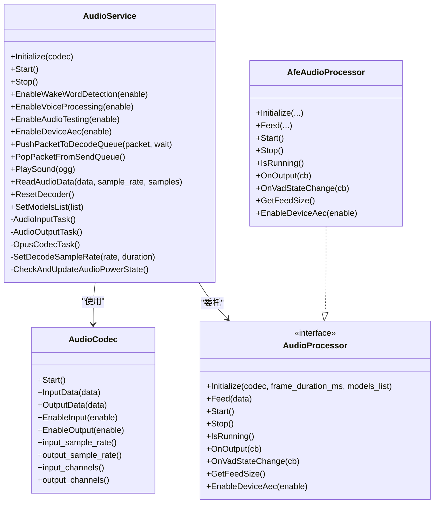
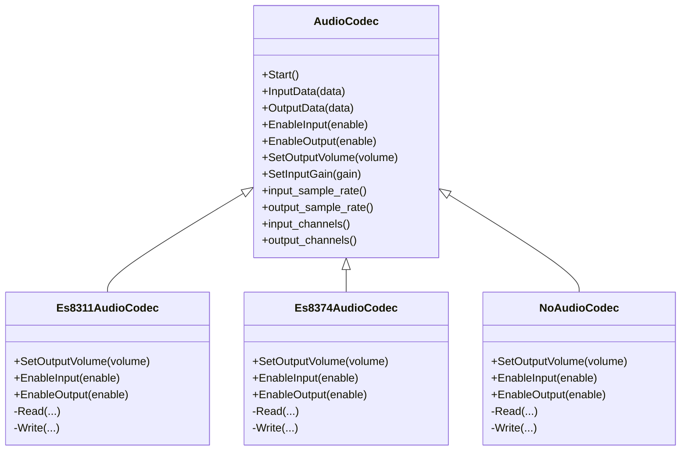
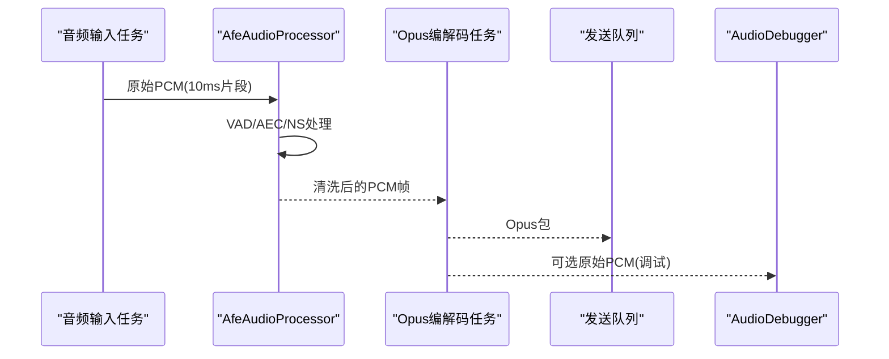
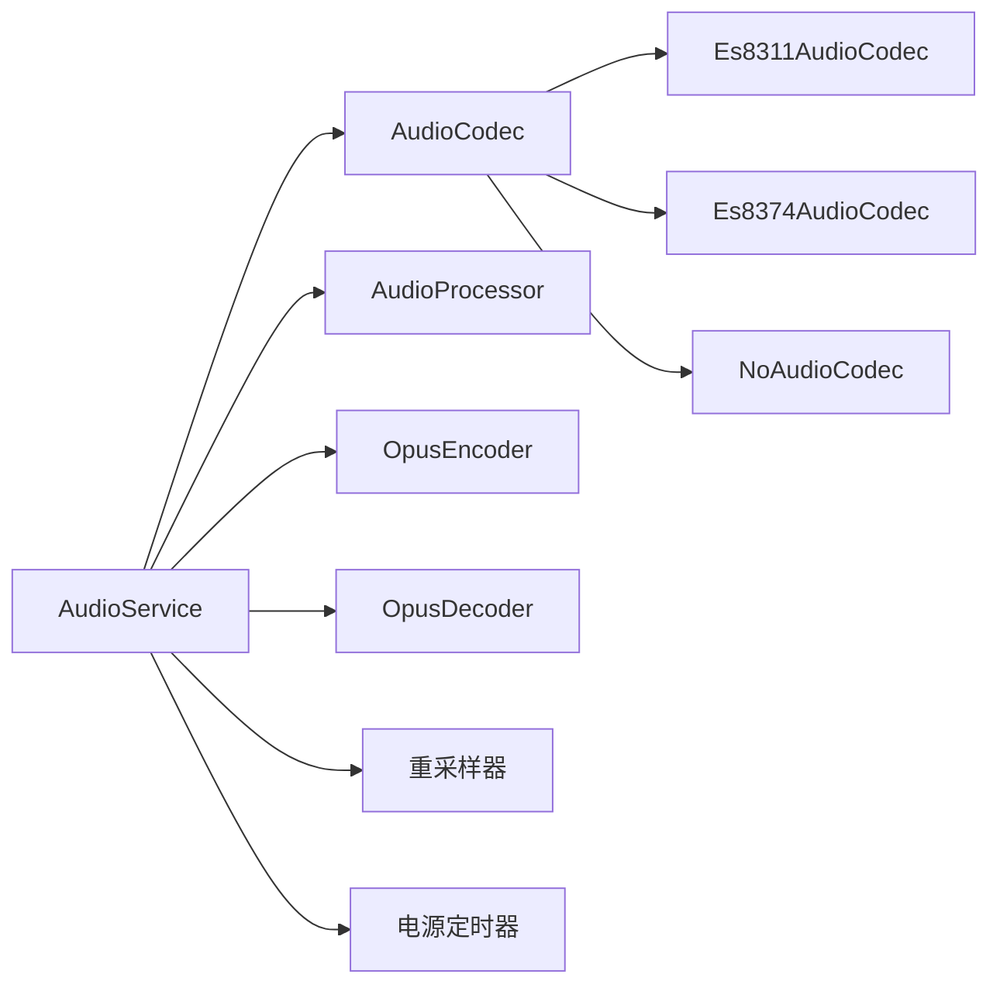

# 音频问题

<cite>
**本文引用的文件**
- [main/audio/README.md](file://main/audio/README.md)
- [main/audio/audio_service.h](file://main/audio/audio_service.h)
- [main/audio/audio_service.cc](file://main/audio/audio_service.cc)
- [main/audio/audio_codec.h](file://main/audio/audio_codec.h)
- [main/audio/audio_codec.cc](file://main/audio/audio_codec.cc)
- [main/audio/audio_processor.h](file://main/audio/audio_processor.h)
- [main/audio/processors/afe_audio_processor.h](file://main/audio/processors/afe_audio_processor.h)
- [main/audio/processors/audio_debugger.h](file://main/audio/processors/audio_debugger.h)
- [main/audio/codecs/es8311_audio_codec.h](file://main/audio/codecs/es8311_audio_codec.h)
- [main/audio/codecs/es8374_audio_codec.h](file://main/audio/codecs/es8374_audio_codec.h)
- [main/audio/codecs/no_audio_codec.cc](file://main/audio/codecs/no_audio_codec.cc)
- [scripts/audio_debug_server.py](file://scripts/audio_debug_server.py)
- [scripts/p3_tools/play_p3.py](file://scripts/p3_tools/play_p3.py)
- [scripts/p3_tools/convert_audio_to_p3.py](file://scripts/p3_tools/convert_audio_to_p3.py)
- [scripts/p3_tools/convert_p3_to_audio.py](file://scripts/p3_tools/convert_p3_to_audio.py)
- [scripts/acoustic_check/main.py](file://scripts/acoustic_check/main.py)
- [scripts/acoustic_check/demod.py](file://scripts/acoustic_check/demod.py)
- [scripts/acoustic_check/graphic.py](file://scripts/acoustic_check/graphic.py)
</cite>

## 目录
1. [简介](#简介)
2. [项目结构](#项目结构)
3. [核心组件](#核心组件)
4. [架构总览](#架构总览)
5. [详细组件分析](#详细组件分析)
6. [依赖关系分析](#依赖关系分析)
7. [性能考量](#性能考量)
8. [故障排除指南](#故障排除指南)
9. [结论](#结论)
10. [附录](#附录)

## 简介
本指南面向ESP32-AI项目的音频问题诊断与修复，覆盖录制无声、播放杂音、延迟过大、音质差等常见症状；针对编解码器配置（采样率、通道数、格式）不匹配进行系统排查；解释VAD检测、噪声抑制、回声消除等前端处理功能异常的调试方法；提供缓冲区溢出、欠载、同步问题的处理策略；并给出音频质量测试工具与分析脚本的使用方式，以及不同硬件平台的特性与解决方案，最后总结性能优化建议与最佳实践。

## 项目结构
音频子系统采用模块化设计，围绕AudioService中枢协调各组件运行，配合多任务模型实现输入、编码/解码、输出的并发处理，并通过队列与事件组实现松耦合的数据流控制。

**图示来源**
- [main/audio/audio_service.h:106-196](file://main/audio/audio_service.h#L106-L196)
- [main/audio/audio_service.cc:126-168](file://main/audio/audio_service.cc#L126-L168)
- [main/audio/audio_codec.h:17-62](file://main/audio/audio_codec.h#L17-L62)
- [main/audio/codecs/es8311_audio_codec.h:13-42](file://main/audio/codecs/es8311_audio_codec.h#L13-L42)
- [main/audio/codecs/es8374_audio_codec.h:13-41](file://main/audio/codecs/es8374_audio_codec.h#L13-L41)
- [main/audio/processors/afe_audio_processor.h:17-48](file://main/audio/processors/afe_audio_processor.h#L17-L48)
- [main/audio/processors/audio_debugger.h:10-22](file://main/audio/processors/audio_debugger.h#L10-L22)

**章节来源**
- [main/audio/README.md:1-88](file://main/audio/README.md#L1-L88)
- [main/audio/audio_service.h:1-196](file://main/audio/audio_service.h#L1-L196)
- [main/audio/audio_service.cc:1-737](file://main/audio/audio_service.cc#L1-L737)
- [main/audio/audio_codec.h:1-62](file://main/audio/audio_codec.h#L1-L62)
- [main/audio/audio_codec.cc:1-68](file://main/audio/audio_codec.cc#L1-L68)

## 核心组件
- AudioService：负责初始化、启动/停止、事件驱动的任务调度、队列容量控制、编解码参数设置、电源管理定时器、回调注册、唤醒词与语音处理开关、播放提示音等。
- AudioCodec：抽象I2S读写接口，提供输入/输出使能、采样率/通道/增益/音量查询与设置、Start初始化等。
- AudioProcessor/AfeAudioProcessor：提供VAD状态回调、设备侧AEC开关、处理线程与缓冲、Feed接口等。
- 编解码器实现：Es8311AudioCodec、Es8374AudioCodec、NoAudioCodec等，分别对接不同硬件平台或模拟路径。
- AudioDebugger：可选的UDP调试输出，便于在开发阶段观测原始PCM数据。

**章节来源**
- [main/audio/audio_service.h:106-196](file://main/audio/audio_service.h#L106-L196)
- [main/audio/audio_service.cc:63-124](file://main/audio/audio_service.cc#L63-L124)
- [main/audio/audio_codec.h:17-62](file://main/audio/audio_codec.h#L17-L62)
- [main/audio/audio_processor.h:11-27](file://main/audio/audio_processor.h#L11-L27)
- [main/audio/processors/afe_audio_processor.h:17-48](file://main/audio/processors/afe_audio_processor.h#L17-L48)
- [main/audio/processors/audio_debugger.h:10-22](file://main/audio/processors/audio_debugger.h#L10-L22)
- [main/audio/codecs/es8311_audio_codec.h:13-42](file://main/audio/codecs/es8311_audio_codec.h#L13-L42)
- [main/audio/codecs/es8374_audio_codec.h:13-41](file://main/audio/codecs/es8374_audio_codec.h#L13-L41)
- [main/audio/codecs/no_audio_codec.cc:221-255](file://main/audio/codecs/no_audio_codec.cc#L221-L255)

## 架构总览
音频系统采用三任务模型：
- 音频输入任务：从AudioCodec读取原始PCM，送入唤醒词或语音处理器。
- 音频输出任务：从播放队列取出PCM，写入AudioCodec播放。
- Opus编解码任务：并发地从编码队列取PCM编码，或从解码队列取包解码，分别进入发送/播放队列。

**图示来源**
- [main/audio/README.md:26-85](file://main/audio/README.md#L26-L85)
- [main/audio/audio_service.cc:231-448](file://main/audio/audio_service.cc#L231-L448)

**章节来源**
- [main/audio/README.md:14-85](file://main/audio/README.md#L14-L85)
- [main/audio/audio_service.cc:126-168](file://main/audio/audio_service.cc#L126-L168)

## 详细组件分析

### 组件A：AudioService（音频中枢）
- 职责：初始化编解码器、打开/关闭编解码器、创建三任务、维护事件组、队列容量与阻塞条件、电源定时器、回调注册、唤醒词/语音处理开关、播放提示音、重置解码器、设置模型列表。
- 关键点：
  - 编码器固定工作于16kHz单声道，帧时长由宏控制；解码器按包内参数动态重建。
  - 输入/输出重采样器在采样率不一致时自动启用。
  - 电源定时器在空闲超时后自动关闭输入/输出通道，避免功耗浪费。
  - 队列容量限制防止内存膨胀与死锁，必要时阻塞生产者等待消费。

**图示来源**
- [main/audio/audio_service.h:106-196](file://main/audio/audio_service.h#L106-L196)
- [main/audio/audio_codec.h:17-62](file://main/audio/audio_codec.h#L17-L62)
- [main/audio/audio_processor.h:11-27](file://main/audio/audio_processor.h#L11-L27)
- [main/audio/processors/afe_audio_processor.h:17-48](file://main/audio/processors/afe_audio_processor.h#L17-L48)

**章节来源**
- [main/audio/audio_service.h:1-196](file://main/audio/audio_service.h#L1-L196)
- [main/audio/audio_service.cc:63-124](file://main/audio/audio_service.cc#L63-L124)

### 组件B：AudioCodec与具体实现
- AudioCodec：统一I2S读写接口，提供输入/输出使能、采样率/通道/增益/音量查询与设置。
- Es8311AudioCodec/Es8374AudioCodec：基于esp_codec_dev封装，实现I2C控制与I2S数据通路。
- NoAudioCodec：用于无硬件场景或模拟路径，内部完成I2S读写与音量缩放。

**图示来源**
- [main/audio/audio_codec.h:17-62](file://main/audio/audio_codec.h#L17-L62)
- [main/audio/codecs/es8311_audio_codec.h:13-42](file://main/audio/codecs/es8311_audio_codec.h#L13-L42)
- [main/audio/codecs/es8374_audio_codec.h:13-41](file://main/audio/codecs/es8374_audio_codec.h#L13-L41)
- [main/audio/codecs/no_audio_codec.cc:221-255](file://main/audio/codecs/no_audio_codec.cc#L221-L255)

**章节来源**
- [main/audio/audio_codec.h:1-62](file://main/audio/audio_codec.h#L1-L62)
- [main/audio/audio_codec.cc:1-68](file://main/audio/audio_codec.cc#L1-L68)
- [main/audio/codecs/es8311_audio_codec.h:1-42](file://main/audio/codecs/es8311_audio_codec.h#L1-L42)
- [main/audio/codecs/es8374_audio_codec.h:1-41](file://main/audio/codecs/es8374_audio_codec.h#L1-L41)
- [main/audio/codecs/no_audio_codec.cc:221-255](file://main/audio/codecs/no_audio_codec.cc#L221-L255)

### 组件C：音频处理与调试
- AudioProcessor接口定义了初始化、Feed、Start/Stop、回调注册、设备AEC开关等能力。
- AfeAudioProcessor：基于ESP-ADF AFE实现VAD、AEC、噪声抑制等实时处理，并通过回调向编码器提供清洗后的PCM。
- AudioDebugger：可选的UDP调试输出，便于在开发阶段观测原始PCM数据。

**图示来源**
- [main/audio/audio_processor.h:11-27](file://main/audio/audio_processor.h#L11-L27)
- [main/audio/processors/afe_audio_processor.h:17-48](file://main/audio/processors/afe_audio_processor.h#L17-L48)
- [main/audio/processors/audio_debugger.h:10-22](file://main/audio/processors/audio_debugger.h#L10-L22)
- [main/audio/audio_service.cc:102-111](file://main/audio/audio_service.cc#L102-L111)

**章节来源**
- [main/audio/audio_processor.h:1-27](file://main/audio/audio_processor.h#L1-L27)
- [main/audio/processors/afe_audio_processor.h:1-48](file://main/audio/processors/afe_audio_processor.h#L1-L48)
- [main/audio/processors/audio_debugger.h:1-22](file://main/audio/processors/audio_debugger.h#L1-L22)

## 依赖关系分析
- AudioService依赖AudioCodec、AudioProcessor、WakeWord、Opus编解码器、重采样器、定时器与队列。
- 不同硬件平台通过选择性编译切换到对应AudioCodec实现。
- 语音处理与唤醒词根据目标芯片选择Afe/Custom/Esp实现。

**图示来源**
- [main/audio/audio_service.cc:26-37](file://main/audio/audio_service.cc#L26-L37)
- [main/audio/audio_service.h:10-27](file://main/audio/audio_service.h#L10-L27)

**章节来源**
- [main/audio/audio_service.cc:26-37](file://main/audio/audio_service.cc#L26-L37)
- [main/audio/audio_service.h:10-27](file://main/audio/audio_service.h#L10-L27)

## 性能考量
- 任务优先级与栈空间：输入/输出/编解码任务分别分配不同栈深与优先级，确保实时性。
- 队列容量与背压：通过最大队列长度限制与条件变量阻塞，避免内存暴涨与任务饥饿。
- 重采样策略：仅在采样率不一致时启用重采样器，减少额外开销。
- 功耗管理：空闲超时自动关闭输入/输出通道，降低功耗。
- 帧时长与带宽：帧时长越短，端到端延迟越低但CPU占用越高；需在延迟与资源间权衡。

[本节为通用指导，无需列出章节来源]

## 故障排除指南

### 录制无声
- 症状定位
  - 输入通道未启用：检查AudioCodec的EnableInput是否被调用且成功。
  - 电源定时器提前关闭：确认最近一次输入时间更新逻辑正常。
  - 采样率/通道不匹配：确认ReadAudioData中重采样器路径是否生效。
- 处理步骤
  - 在AudioService::ReadAudioData路径中验证输入通道开启与重采样器启用。
  - 查看电源定时器回调是否在空闲阈值后关闭输入。
  - 对比codec->input_sample_rate()与期望采样率，必要时调整配置。
- 相关实现参考
  - [main/audio/audio_service.cc:185-229](file://main/audio/audio_service.cc#L185-L229)
  - [main/audio/audio_service.cc:684-700](file://main/audio/audio_service.cc#L684-L700)
  - [main/audio/audio_codec.cc:53-67](file://main/audio/audio_codec.cc#L53-L67)

**章节来源**
- [main/audio/audio_service.cc:185-229](file://main/audio/audio_service.cc#L185-L229)
- [main/audio/audio_service.cc:684-700](file://main/audio/audio_service.cc#L684-L700)
- [main/audio/audio_codec.cc:53-67](file://main/audio/audio_codec.cc#L53-L67)

### 播放杂音/破音
- 症状定位
  - 输出通道未启用或采样率不匹配：确认EnableOutput与重采样器。
  - 音量/增益设置异常：检查SetOutputVolume/SetInputGain与持久化存储。
  - 数据截断或尺寸不匹配：确认解码后PCM尺寸与重采样后尺寸。
- 处理步骤
  - 在AudioOutputTask中确认输出通道已启用并写入数据。
  - 检查解码后PCM尺寸与目标采样率的重采样结果。
  - 调整音量/增益参数并持久化保存。
- 相关实现参考
  - [main/audio/audio_service.cc:292-327](file://main/audio/audio_service.cc#L292-L327)
  - [main/audio/audio_service.cc:350-395](file://main/audio/audio_service.cc#L350-L395)
  - [main/audio/audio_codec.cc:40-51](file://main/audio/audio_codec.cc#L40-L51)

**章节来源**
- [main/audio/audio_service.cc:292-327](file://main/audio/audio_service.cc#L292-L327)
- [main/audio/audio_service.cc:350-395](file://main/audio/audio_service.cc#L350-L395)
- [main/audio/audio_codec.cc:40-51](file://main/audio/audio_codec.cc#L40-L51)

### 延迟过大
- 症状定位
  - 队列堆积：发送/播放队列超过上限导致背压。
  - 帧时长过长：编码帧时长增大导致端到端延迟上升。
  - 编解码/重采样开销：解码/重采样器处理时间增加。
- 处理步骤
  - 降低OPUS_FRAME_DURATION_MS或提升队列容量阈值。
  - 评估编解码与重采样器性能，必要时优化算法复杂度。
  - 检查任务优先级与调度，避免高优先级任务抢占。
- 相关实现参考
  - [main/audio/audio_service.h:39-76](file://main/audio/audio_service.h#L39-L76)
  - [main/audio/audio_service.cc:329-448](file://main/audio/audio_service.cc#L329-L448)

**章节来源**
- [main/audio/audio_service.h:39-76](file://main/audio/audio_service.h#L39-L76)
- [main/audio/audio_service.cc:329-448](file://main/audio/audio_service.cc#L329-L448)

### 音质差（噪声大/失真）
- 症状定位
  - VAD/AEC/NS未启用或配置不当：确认EnableVoiceProcessing与EnableDeviceAec。
  - 通道数不一致：双声道输入时是否正确下采样为单声道。
  - 编码参数不合理：比特率、帧时长、VBR/DTX等。
- 处理步骤
  - 启用语音处理与设备AEC，观察VAD状态变化。
  - 确认输入通道数为1时的单声道处理逻辑。
  - 调整编码参数，优先保证VBR与DTX开启以适应语音特性。
- 相关实现参考
  - [main/audio/audio_service.cc:581-606](file://main/audio/audio_service.cc#L581-L606)
  - [main/audio/audio_service.cc:246-268](file://main/audio/audio_service.cc#L246-L268)
  - [main/audio/audio_service.h:65-76](file://main/audio/audio_service.h#L65-L76)

**章节来源**
- [main/audio/audio_service.cc:581-606](file://main/audio/audio_service.cc#L581-L606)
- [main/audio/audio_service.cc:246-268](file://main/audio/audio_service.cc#L246-L268)
- [main/audio/audio_service.h:65-76](file://main/audio/audio_service.h#L65-L76)

### 编解码器配置问题（采样率/通道/格式）
- 采样率不匹配
  - 输入采样率≠16kHz：启用输入重采样器；输出解码后如与板载DAC不一致则启用输出重采样器。
  - 解码采样率随包动态变化：SetDecodeSampleRate会重建解码器与输出重采样器。
- 通道数错误
  - 双声道输入时，测试模式会提取左声道作为单声道处理。
- 格式不支持
  - Opus编码器固定工作于16kHz单声道；解码器按包内参数重建。
- 相关实现参考
  - [main/audio/audio_service.cc:87-94](file://main/audio/audio_service.cc#L87-L94)
  - [main/audio/audio_service.cc:450-484](file://main/audio/audio_service.cc#L450-L484)
  - [main/audio/audio_service.cc:256-263](file://main/audio/audio_service.cc#L256-L263)

**章节来源**
- [main/audio/audio_service.cc:87-94](file://main/audio/audio_service.cc#L87-L94)
- [main/audio/audio_service.cc:450-484](file://main/audio/audio_service.cc#L450-L484)
- [main/audio/audio_service.cc:256-263](file://main/audio/audio_service.cc#L256-L263)

### VAD检测、噪声抑制、回声消除异常
- VAD状态回调：AudioProcessor通过OnVadStateChange上报说话/静音状态。
- 设备AEC：EnableDeviceAec控制设备侧AEC开关；切换模式时需重置输入重采样器。
- 唤醒词：根据模型列表自动选择Afe/Custom/Esp实现，支持检测回调。
- 相关实现参考
  - [main/audio/audio_service.cc:102-111](file://main/audio/audio_service.cc#L102-L111)
  - [main/audio/audio_service.cc:565-579](file://main/audio/audio_service.cc#L565-L579)
  - [main/audio/audio_service.cc:702-728](file://main/audio/audio_service.cc#L702-L728)

**章节来源**
- [main/audio/audio_service.cc:102-111](file://main/audio/audio_service.cc#L102-L111)
- [main/audio/audio_service.cc:565-579](file://main/audio/audio_service.cc#L565-L579)
- [main/audio/audio_service.cc:702-728](file://main/audio/audio_service.cc#L702-L728)

### 音频缓冲区溢出/欠载/同步问题
- 溢出
  - 发送/播放队列接近上限：检查MAX_SEND_PACKETS_IN_QUEUE/MAX_PLAYBACK_TASKS_IN_QUEUE阈值。
  - 生产者未及时让步：OpusCodecTask在队列满时等待条件变量。
- 欠载
  - 队列为空导致输出任务阻塞：AudioOutputTask通过条件变量等待非空。
  - 解码器复位：ResetDecoder清空所有队列并通知等待线程。
- 同步
  - 时间戳传递：编码任务为发送队列任务附加时间戳，用于服务端AEC对齐。
- 相关实现参考
  - [main/audio/audio_service.h:39-48](file://main/audio/audio_service.h#L39-L48)
  - [main/audio/audio_service.cc:329-448](file://main/audio/audio_service.cc#L329-L448)
  - [main/audio/audio_service.cc:486-506](file://main/audio/audio_service.cc#L486-L506)
  - [main/audio/audio_service.cc:670-682](file://main/audio/audio_service.cc#L670-L682)

**章节来源**
- [main/audio/audio_service.h:39-48](file://main/audio/audio_service.h#L39-L48)
- [main/audio/audio_service.cc:329-448](file://main/audio/audio_service.cc#L329-L448)
- [main/audio/audio_service.cc:486-506](file://main/audio/audio_service.cc#L486-L506)
- [main/audio/audio_service.cc:670-682](file://main/audio/audio_service.cc#L670-L682)

### 音频质量测试与分析
- P3工具链
  - 将音频转换为P3格式以便离线播放与对比：convert_audio_to_p3.py、convert_p3_to_audio.py、p3_gui_player.py、play_p3.py。
- 声学检测脚本
  - acoustic_check：包含demod.py（解调）、graphic.py（绘图）、main.py（主流程），可用于波形与频谱分析。
- 调试服务器
  - scripts/audio_debug_server.py：接收来自AudioDebugger的UDP PCM数据，便于本地可视化分析。
- 使用建议
  - 先用P3工具链生成标准样本，再用acoustic_check进行频谱/波形对比，最后通过audio_debug_server进行实时观测。
- 相关实现参考
  - [scripts/p3_tools/convert_audio_to_p3.py](file://scripts/p3_tools/convert_audio_to_p3.py)
  - [scripts/p3_tools/convert_p3_to_audio.py](file://scripts/p3_tools/convert_p3_to_audio.py)
  - [scripts/p3_tools/play_p3.py](file://scripts/p3_tools/play_p3.py)
  - [scripts/acoustic_check/main.py](file://scripts/acoustic_check/main.py)
  - [scripts/acoustic_check/demod.py](file://scripts/acoustic_check/demod.py)
  - [scripts/acoustic_check/graphic.py](file://scripts/acoustic_check/graphic.py)
  - [scripts/audio_debug_server.py](file://scripts/audio_debug_server.py)

**章节来源**
- [scripts/p3_tools/convert_audio_to_p3.py](file://scripts/p3_tools/convert_audio_to_p3.py)
- [scripts/p3_tools/convert_p3_to_audio.py](file://scripts/p3_tools/convert_p3_to_audio.py)
- [scripts/p3_tools/play_p3.py](file://scripts/p3_tools/play_p3.py)
- [scripts/acoustic_check/main.py](file://scripts/acoustic_check/main.py)
- [scripts/acoustic_check/demod.py](file://scripts/acoustic_check/demod.py)
- [scripts/acoustic_check/graphic.py](file://scripts/acoustic_check/graphic.py)
- [scripts/audio_debug_server.py](file://scripts/audio_debug_server.py)

### 不同音频硬件平台的特有问题与解决方案
- Es8311/Es8374
  - 特点：基于esp_codec_dev，I2C控制+I2S数据通路；支持PA引脚控制。
  - 常见问题：I2C地址冲突、MCLK配置、PA引脚极性。
  - 解决：核对config.json与硬件接线，确认I2C地址与MCLK引脚。
- NoAudioCodec
  - 特点：无真实硬件时的模拟路径，适合开发与联调。
  - 常见问题：I2S位宽与读写函数实现差异。
  - 解决：确保Read/Write实现与期望位宽一致，注意音量缩放范围。
- 相关实现参考
  - [main/audio/codecs/es8311_audio_codec.h:13-42](file://main/audio/codecs/es8311_audio_codec.h#L13-L42)
  - [main/audio/codecs/es8374_audio_codec.h:13-41](file://main/audio/codecs/es8374_audio_codec.h#L13-L41)
  - [main/audio/codecs/no_audio_codec.cc:221-255](file://main/audio/codecs/no_audio_codec.cc#L221-L255)

**章节来源**
- [main/audio/codecs/es8311_audio_codec.h:13-42](file://main/audio/codecs/es8311_audio_codec.h#L13-L42)
- [main/audio/codecs/es8374_audio_codec.h:13-41](file://main/audio/codecs/es8374_audio_codec.h#L13-L41)
- [main/audio/codecs/no_audio_codec.cc:221-255](file://main/audio/codecs/no_audio_codec.cc#L221-L255)

## 结论
通过AudioService的模块化设计与多任务并发模型，ESP32-AI实现了稳定高效的音频采集、处理、编码与播放链路。针对常见音频问题，应从“硬件通道使能与采样率一致性”、“队列容量与背压控制”、“编解码参数与重采样策略”、“VAD/AEC/NS配置”四个方面入手排查，并结合P3工具链与声学分析脚本进行量化评估。对于不同硬件平台，重点在于I2C配置、MCLK与PA引脚的正确性。

## 附录

### 快速排障清单
- 确认输入/输出通道均处于启用状态，且最近活动时间未触发电源定时器关闭。
- 检查输入采样率是否为16kHz，否则启用输入重采样器；输出解码后若与板载DAC不一致则启用输出重采样器。
- 确认发送/播放队列容量阈值合理，避免溢出或欠载。
- 开启语音处理与设备AEC，观察VAD状态变化；必要时重置重采样器。
- 使用P3工具链与声学分析脚本生成/对比样本，借助audio_debug_server进行实时观测。

[本节为通用指导，无需列出章节来源]