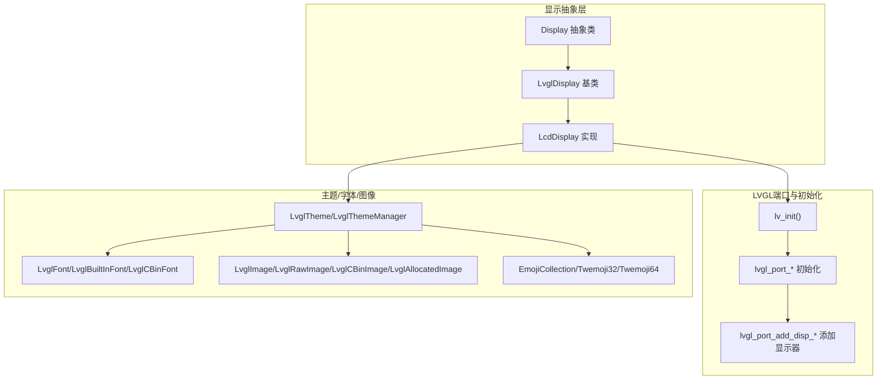
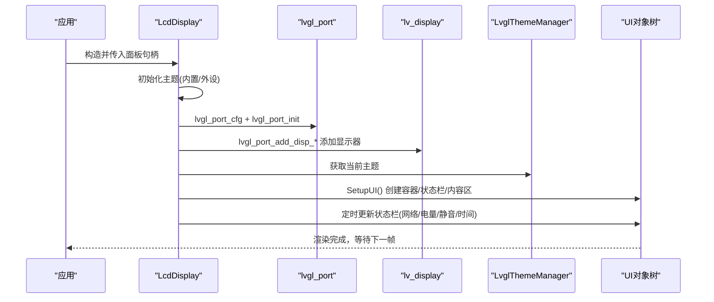
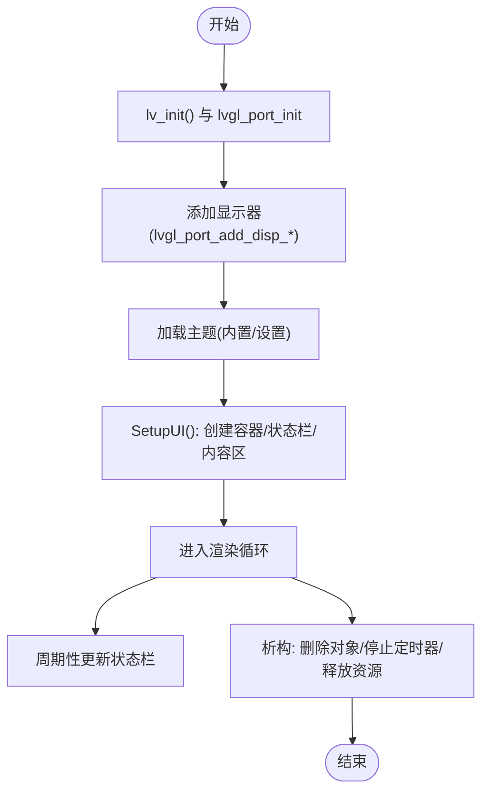
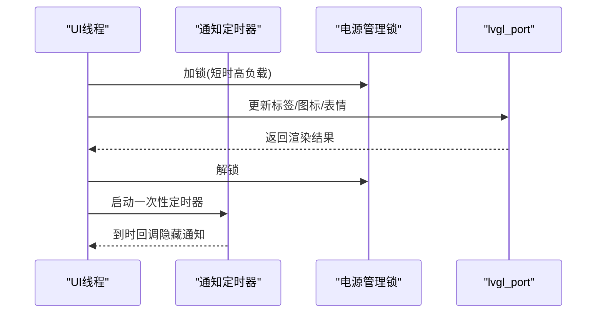
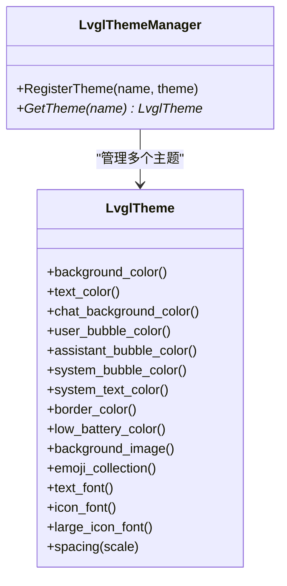
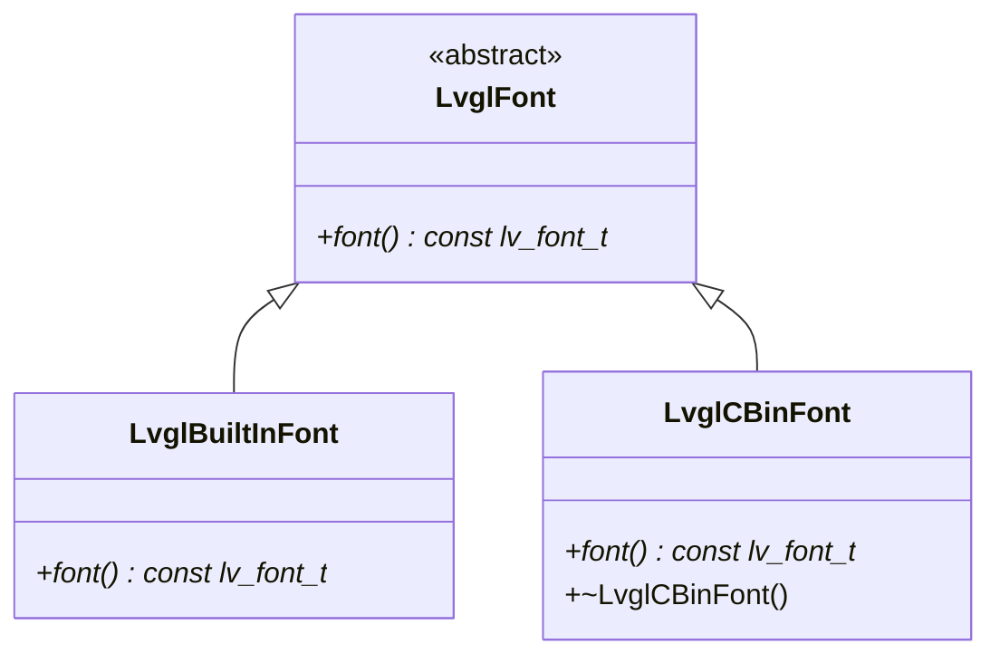
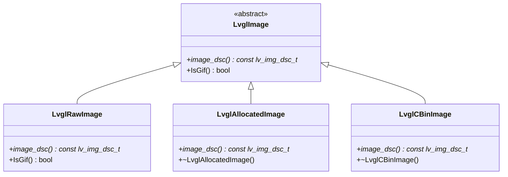
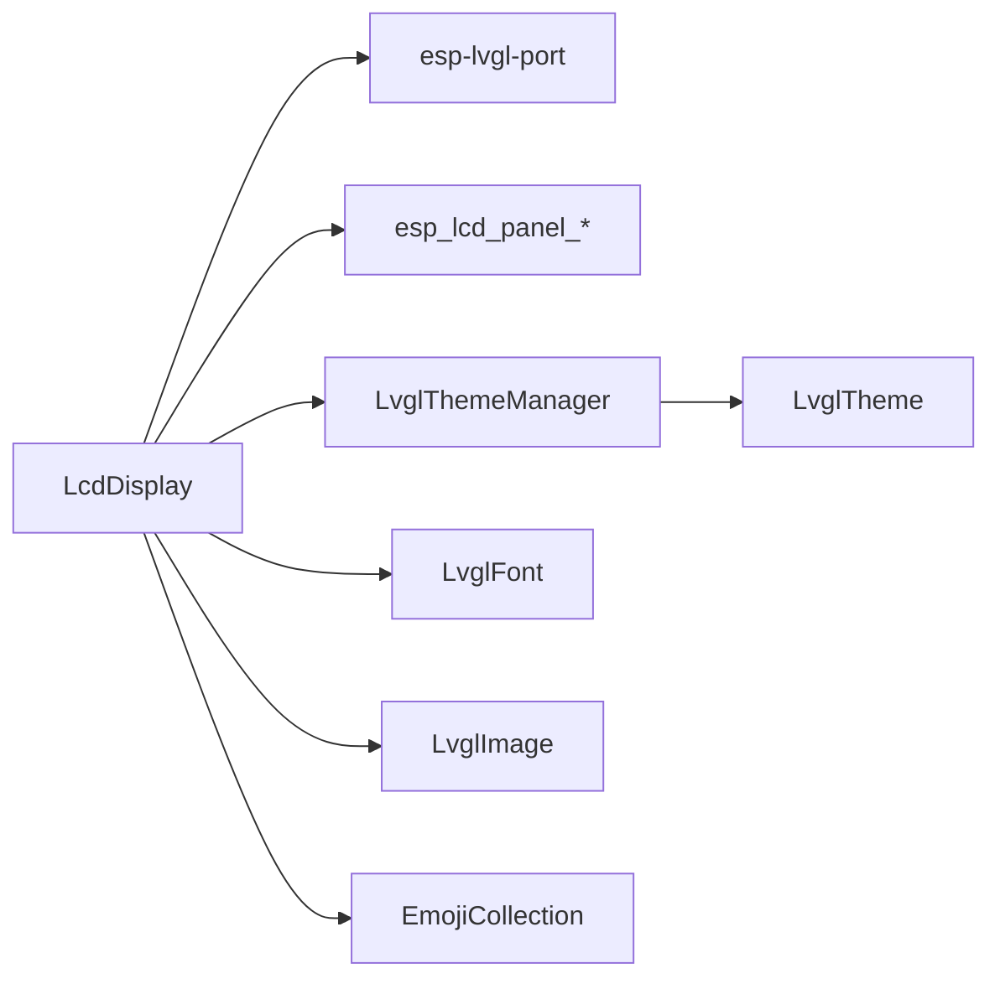

# LVGL图形界面

<cite>
**本文引用的文件**
- [lvgl_display.h](file://main/display/lvgl_display/lvgl_display.h)
- [lvgl_display.cc](file://main/display/lvgl_display/lvgl_display.cc)
- [lvgl_theme.h](file://main/display/lvgl_display/lvgl_theme.h)
- [lvgl_theme.cc](file://main/display/lvgl_display/lvgl_theme.cc)
- [lvgl_font.h](file://main/display/lvgl_display/lvgl_font.h)
- [lvgl_font.cc](file://main/display/lvgl_display/lvgl_font.cc)
- [lvgl_image.h](file://main/display/lvgl_display/lvgl_image.h)
- [lvgl_image.cc](file://main/display/lvgl_display/lvgl_image.cc)
- [emoji_collection.h](file://main/display/lvgl_display/emoji_collection.h)
- [lcd_display.cc](file://main/display/lcd_display.cc)
- [custom_lcd_display.cc](file://main/boards/waveshare/esp32-s3-touch-lcd-3.5b/custom_lcd_display.cc)
</cite>

## 目录
1. [简介](#简介)
2. [项目结构](#项目结构)
3. [核心组件](#核心组件)
4. [架构总览](#架构总览)
5. [组件详解](#组件详解)
6. [依赖关系分析](#依赖关系分析)
7. [性能与内存优化](#性能与内存优化)
8. [故障排查指南](#故障排查指南)
9. [结论](#结论)
10. [附录：开发示例与最佳实践](#附录开发示例与最佳实践)

## 简介
本文件面向ESP32-AI项目的LVGL图形界面系统，系统性阐述UI初始化流程、事件与渲染机制、主题系统、字体与图像管理、UI组件创建与管理、以及配置优化、内存管理与性能调优策略。文档同时提供可操作的开发示例与调试技巧，帮助开发者快速构建稳定高效的嵌入式图形界面。

## 项目结构
围绕LVGL图形界面的关键代码位于main/display/lvgl_display目录，并与main/display/lcd_display.cc及各板级自定义显示适配文件协同工作。整体采用“显示抽象层 + LVGL端口封装 + 主题/字体/图像管理”的分层设计，确保跨硬件平台的一致性与可扩展性。

图示来源
- [lvgl_display.h:15-64](file://main/display/lvgl_display/lvgl_display.h#L15-L64)
- [lvgl_display.cc:19-43](file://main/display/lvgl_display/lvgl_display.cc#L19-L43)
- [lcd_display.cc:113-172](file://main/display/lcd_display.cc#L113-L172)
- [lvgl_theme.h:14-94](file://main/display/lvgl_display/lvgl_theme.h#L14-L94)
- [lvgl_font.h:6-31](file://main/display/lvgl_display/lvgl_font.h#L6-L31)
- [lvgl_image.h:7-53](file://main/display/lvgl_display/lvgl_image.h#L7-L53)
- [emoji_collection.h:14-32](file://main/display/lvgl_display/emoji_collection.h#L14-L32)

章节来源
- [lvgl_display.h:15-64](file://main/display/lvgl_display/lvgl_display.h#L15-L64)
- [lvgl_display.cc:19-43](file://main/display/lvgl_display/lvgl_display.cc#L19-L43)
- [lcd_display.cc:113-172](file://main/display/lcd_display.cc#L113-L172)
- [lvgl_theme.h:14-94](file://main/display/lvgl_display/lvgl_theme.h#L14-L94)
- [lvgl_font.h:6-31](file://main/display/lvgl_display/lvgl_font.h#L6-L31)
- [lvgl_image.h:7-53](file://main/display/lvgl_display/lvgl_image.h#L7-L53)
- [emoji_collection.h:14-32](file://main/display/lvgl_display/emoji_collection.h#L14-L32)

## 核心组件
- 显示抽象与基类
  - Display/LvglDisplay：定义统一接口与通用状态栏、通知、传感器标签、表情控制等能力；通过DisplayLockGuard保证线程安全更新。
- LVGL端口与初始化
  - LcdDisplay/RgbLcdDisplay/MipiLcdDisplay：封装lv_init、lvgl_port初始化与显示器添加；根据硬件选择SPI、RGB或MIPI接口路径。
- 主题系统
  - LvglTheme：集中管理颜色、背景图、字体、间距等主题属性；LvglThemeManager：注册与获取主题实例。
- 字体与图像
  - LvglFont：内置字体与cbin字体封装；LvglImage：原始/分配/外部cbin图像封装，支持GIF探测。
- 表情与图标
  - EmojiCollection/Twemoji32/Twemoji64：表情集合接口与尺寸化实现，配合FontAwesome图标字体。

章节来源
- [lvgl_display.h:15-64](file://main/display/lvgl_display/lvgl_display.h#L15-L64)
- [lvgl_display.cc:19-43](file://main/display/lvgl_display/lvgl_display.cc#L19-L43)
- [lcd_display.cc:113-172](file://main/display/lcd_display.cc#L113-L172)
- [lvgl_theme.h:14-94](file://main/display/lvgl_display/lvgl_theme.h#L14-L94)
- [lvgl_font.h:6-31](file://main/display/lvgl_display/lvgl_font.h#L6-L31)
- [lvgl_image.h:7-53](file://main/display/lvgl_display/lvgl_image.h#L7-L53)
- [emoji_collection.h:14-32](file://main/display/lvgl_display/emoji_collection.h#L14-L32)

## 架构总览
下图展示从应用启动到UI呈现的全链路：初始化LVGL与端口 → 注册主题 → 创建屏幕与状态栏/内容区 → 周期性更新状态栏信息 → 图像/字体/主题驱动渲染。

图示来源
- [lcd_display.cc:113-172](file://main/display/lcd_display.cc#L113-L172)
- [lvgl_theme.h:79-94](file://main/display/lvgl_display/lvgl_theme.h#L79-L94)
- [lvgl_display.cc:359-499](file://main/display/lvgl_display/lvgl_display.cc#L359-L499)

章节来源
- [lcd_display.cc:113-172](file://main/display/lcd_display.cc#L113-L172)
- [lvgl_theme.h:79-94](file://main/display/lvgl_display/lvgl_theme.h#L79-L94)
- [lvgl_display.cc:359-499](file://main/display/lvgl_display/lvgl_display.cc#L359-L499)

## 组件详解

### UI初始化与生命周期
- 初始化阶段
  - 调用lv_init()与lvgl_port_init，按硬件类型选择SPI/RGB/MIPI路径，设置缓冲区大小、旋转与字节序等参数。
  - 注册默认主题(light/dark)，并从设置加载当前主题名。
- 生命周期
  - SetupUI仅允许一次调用，内部创建顶层容器与多层布局（顶部状态栏、中部内容区、底部工具栏等）。
  - 析构时逐层删除对象、停止定时器、释放面板句柄与显示句柄。

图示来源
- [lcd_display.cc:113-172](file://main/display/lcd_display.cc#L113-L172)
- [lcd_display.cc:359-499](file://main/display/lcd_display.cc#L359-L499)
- [lvgl_display.cc:45-78](file://main/display/lvgl_display/lvgl_display.cc#L45-L78)

章节来源
- [lcd_display.cc:113-172](file://main/display/lcd_display.cc#L113-L172)
- [lcd_display.cc:359-499](file://main/display/lcd_display.cc#L359-L499)
- [lvgl_display.cc:45-78](file://main/display/lvgl_display/lvgl_display.cc#L45-L78)

### 事件处理与渲染机制
- 事件与定时器
  - 通知消息使用esp_timer一次性定时器自动隐藏；低电量弹窗在电池图标为空且放电时显示。
  - 状态栏每秒更新时间，网络图标每10秒刷新，避免频繁IO占用。
- 渲染与锁
  - 所有UI更新通过DisplayLockGuard加锁，内部委托lvgl_port_lock/解锁，确保线程安全。
  - 电源管理锁用于短时高负载更新期间维持APB频率，减少撕裂与卡顿。

图示来源
- [lvgl_display.cc:19-43](file://main/display/lvgl_display/lvgl_display.cc#L19-L43)
- [lvgl_display.cc:121-227](file://main/display/lvgl_display/lvgl_display.cc#L121-L227)
- [lvgl_display.cc:351-357](file://main/display/lvgl_display/lvgl_display.cc#L351-L357)

章节来源
- [lvgl_display.cc:19-43](file://main/display/lvgl_display/lvgl_display.cc#L19-L43)
- [lvgl_display.cc:121-227](file://main/display/lvgl_display/lvgl_display.cc#L121-L227)
- [lvgl_display.cc:351-357](file://main/display/lvgl_display/lvgl_display.cc#L351-L357)

### 主题系统：颜色、样式与动态切换
- 颜色与样式
  - 背景/文本/气泡/边框/低电量等颜色集中于LvglTheme；间距通过scale缩放。
- 字体与图标
  - 文本字体、图标字体、大号图标字体分别注入主题；支持内置字体与cbin字体。
- 动态主题切换
  - 通过LvglThemeManager注册与获取主题；运行时可从设置读取主题名并切换。

图示来源
- [lvgl_theme.h:14-76](file://main/display/lvgl_display/lvgl_theme.h#L14-L76)
- [lvgl_theme.cc:1-31](file://main/display/lvgl_display/lvgl_theme.cc#L1-L31)

章节来源
- [lvgl_theme.h:14-76](file://main/display/lvgl_display/lvgl_theme.h#L14-L76)
- [lvgl_theme.cc:1-31](file://main/display/lvgl_display/lvgl_theme.cc#L1-L31)
- [lcd_display.cc:25-63](file://main/display/lcd_display.cc#L25-L63)

### 字体管理系统：中文字体、大小与渲染优化
- 字体封装
  - LvglBuiltInFont：直接使用LVGL内置字体指针；LvglCBinFont：从cbin数据创建字体，支持运行时加载。
- 中文字体支持
  - 通过LvglCBinFont加载中文字体资源，结合主题注入到UI对象树，实现多语言文本渲染。
- 渲染优化
  - 在具备PSRAM时启用图像缓存，提升PNG/GIF解码与复用效率；合理设置缓冲区大小与双缓冲策略。

图示来源
- [lvgl_font.h:6-31](file://main/display/lvgl_display/lvgl_font.h#L6-L31)
- [lvgl_font.cc:1-13](file://main/display/lvgl_display/lvgl_font.cc#L1-L13)

章节来源
- [lvgl_font.h:6-31](file://main/display/lvgl_display/lvgl_font.h#L6-L31)
- [lvgl_font.cc:1-13](file://main/display/lvgl_display/lvgl_font.cc#L1-L13)
- [lcd_display.cc:116-126](file://main/display/lcd_display.cc#L116-L126)

### 图像与表情：GIF检测、内存管理与表情联动
- 图像封装
  - LvglRawImage：包裹原始数据；LvglAllocatedImage：托管堆内存并负责释放；LvglCBinImage：从cbin创建描述符。
  - 支持GIF探测（通过头部字节识别），便于动态播放与缓存策略选择。
- 表情联动
  - 通过MPU6050姿态数据自动切换表情；可禁用自动更新，手动控制表情。

图示来源
- [lvgl_image.h:7-53](file://main/display/lvgl_display/lvgl_image.h#L7-L53)
- [lvgl_image.cc:1-64](file://main/display/lvgl_display/lvgl_image.cc#L1-L64)
- [lvgl_display.cc:253-299](file://main/display/lvgl_display/lvgl_display.cc#L253-L299)

章节来源
- [lvgl_image.h:7-53](file://main/display/lvgl_display/lvgl_image.h#L7-L53)
- [lvgl_image.cc:1-64](file://main/display/lvgl_display/lvgl_image.cc#L1-L64)
- [lvgl_display.cc:253-299](file://main/display/lvgl_display/lvgl_display.cc#L253-L299)

### UI组件创建与管理：按钮、标签、进度条等
- 常用控件
  - 标签：状态栏、通知、温度/湿度/MPU6050数据标签；通过lv_label_create与样式注入。
  - 气泡/聊天区域：基于Flex布局与背景色/圆角/边框样式组合实现微信风格消息气泡。
  - 进度条：可通过lv_bar或lv_meter等控件实现，结合主题颜色与字体进行统一风格。
- 布局与对齐
  - 使用lv_obj_set_flex_flow与align对齐方式实现响应式布局；透明背景与内边距控制视觉层次。

章节来源
- [lcd_display.cc:359-499](file://main/display/lcd_display.cc#L359-L499)

### 快照与截图：JPEG导出与内存优化
- 截图流程
  - 使用lv_snapshot_take捕获活动屏幕，交换RGB565字节序，再通过回调式JPEG编码输出至字符串，避免一次性大块内存分配。
- 条件编译
  - 仅在启用CONFIG_LV_USE_SNAPSHOT时生效，防止不支持平台报错。

章节来源
- [lvgl_display.cc:311-351](file://main/display/lvgl_display/lvgl_display.cc#L311-L351)

## 依赖关系分析
- 组件耦合
  - LcdDisplay强依赖lvgl_port与esp_lcd面板；LvglThemeManager单例持有主题映射，降低主题切换成本。
  - LvglDisplay作为UI基类，通过DisplayLockGuard与电源管理锁协调渲染与系统功耗。
- 外部依赖
  - LVGL库、esp-lvgl-port、esp_lcd面板驱动、PSRAM（可选）、cbin字体/图像解码器。

图示来源
- [lcd_display.cc:113-172](file://main/display/lcd_display.cc#L113-L172)
- [lvgl_theme.h:79-94](file://main/display/lvgl_display/lvgl_theme.h#L79-L94)
- [lvgl_font.h:6-31](file://main/display/lvgl_display/lvgl_font.h#L6-L31)
- [lvgl_image.h:7-53](file://main/display/lvgl_display/lvgl_image.h#L7-L53)
- [emoji_collection.h:14-32](file://main/display/lvgl_display/emoji_collection.h#L14-L32)

章节来源
- [lcd_display.cc:113-172](file://main/display/lcd_display.cc#L113-L172)
- [lvgl_theme.h:79-94](file://main/display/lvgl_display/lvgl_theme.h#L79-L94)
- [lvgl_font.h:6-31](file://main/display/lvgl_display/lvgl_font.h#L6-L31)
- [lvgl_image.h:7-53](file://main/display/lvgl_display/lvgl_image.h#L7-L53)
- [emoji_collection.h:14-32](file://main/display/lvgl_display/emoji_collection.h#L14-L32)

## 性能与内存优化
- LVGL端口配置
  - 设置任务优先级与亲和性，避免UI阻塞主业务；根据CPU核数启用亲和绑定。
  - 合理buffer_size与双缓冲策略，平衡流畅度与内存占用。
- 图像缓存
  - 在PSRAM≥2MB时启用图像缓存，显著降低重复解码开销；针对PNG/GIF优化缓存命中率。
- 字体与文本
  - 优先使用内置字体，必要时加载cbin字体；避免频繁切换字体导致的布局重排。
- 电源管理
  - 在高频更新期间获取电源锁，结束后及时释放，避免长时间拉高频率造成发热。
- 截图优化
  - 使用回调式JPEG编码，避免预分配超大缓冲；先交换字节序再编码，减少中间拷贝。

章节来源
- [lcd_display.cc:113-172](file://main/display/lcd_display.cc#L113-L172)
- [lcd_display.cc:116-126](file://main/display/lcd_display.cc#L116-L126)
- [lvgl_display.cc:160-227](file://main/display/lvgl_display/lvgl_display.cc#L160-L227)
- [lvgl_display.cc:311-351](file://main/display/lvgl_display/lvgl_display.cc#L311-L351)

## 故障排查指南
- UI未显示或闪烁
  - 检查lv_init与lvgl_port_init是否成功；确认面板句柄有效与背光已开启。
  - 查看buffer_size与swap_bytes配置是否匹配硬件。
- 主题切换无效
  - 确认LvglThemeManager已注册主题；检查设置项中的主题名与注册名一致。
- 通知不消失
  - 检查通知定时器是否被重复启动；确认回调函数正确隐藏通知并显示状态标签。
- 低电量弹窗不出现
  - 确认电池状态读取正常；仅在放电且图标为空时弹窗。
- 截图失败
  - 确认已启用CONFIG_LV_USE_SNAPSHOT；检查lv_snapshot_take返回值与draw_buffer有效性。

章节来源
- [lvgl_display.cc:19-43](file://main/display/lvgl_display/lvgl_display.cc#L19-L43)
- [lvgl_display.cc:102-119](file://main/display/lvgl_display/lvgl_display.cc#L102-L119)
- [lvgl_display.cc:185-202](file://main/display/lvgl_display/lvgl_display.cc#L185-L202)
- [lvgl_display.cc:311-351](file://main/display/lvgl_display/lvgl_display.cc#L311-L351)

## 结论
本项目通过清晰的抽象层与端口封装，实现了跨硬件平台的LVGL图形界面统一接入；主题/字体/图像模块化设计便于扩展与维护；结合电源管理与图像缓存策略，在资源受限的ESP32平台上实现了流畅稳定的UI体验。建议在新功能开发中遵循现有模式，优先使用主题与字体封装，确保一致性与可移植性。

## 附录：开发示例与最佳实践
- 新增主题
  - 参考内置light/dark主题创建方式，注册到LvglThemeManager并在设置中选择。
- 自定义字体
  - 将中文字体打包为cbin格式，使用LvglCBinFont注入到主题；在SetupUI中应用到屏幕与控件。
- 动态表情
  - 通过SetEmotionAutoUpdate控制是否自动联动MPU6050；也可手动调用SetEmotion切换表情。
- 性能优化清单
  - 启用PSRAM图像缓存；合理设置buffer_size与双缓冲；在高频更新时使用电源锁；避免在UI线程做长耗时操作。
- 调试技巧
  - 使用esp_timer回调验证UI更新路径；通过日志定位状态栏图标更新时机；利用快照导出验证渲染质量。

章节来源
- [lcd_display.cc:25-63](file://main/display/lcd_display.cc#L25-L63)
- [lvgl_theme.cc:28-30](file://main/display/lvgl_display/lvgl_theme.cc#L28-L30)
- [lvgl_display.cc:383-386](file://main/display/lvgl_display/lvgl_display.cc#L383-L386)
- [lvgl_display.cc:253-299](file://main/display/lvgl_display/lvgl_display.cc#L253-L299)
- [lvgl_display.cc:160-227](file://main/display/lvgl_display/lvgl_display.cc#L160-L227)