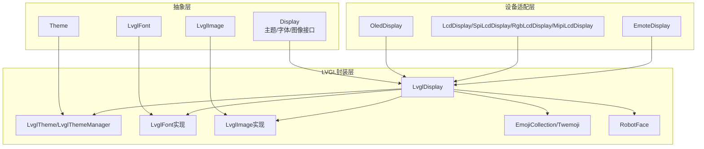
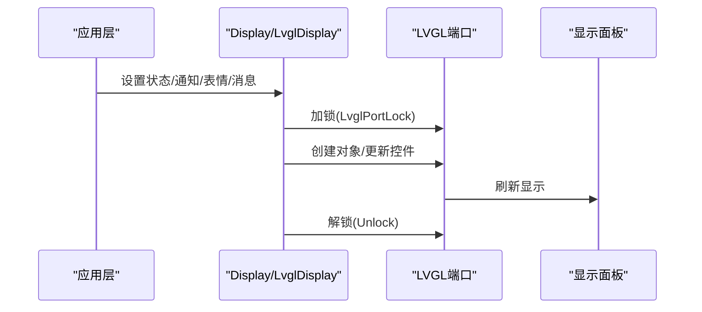
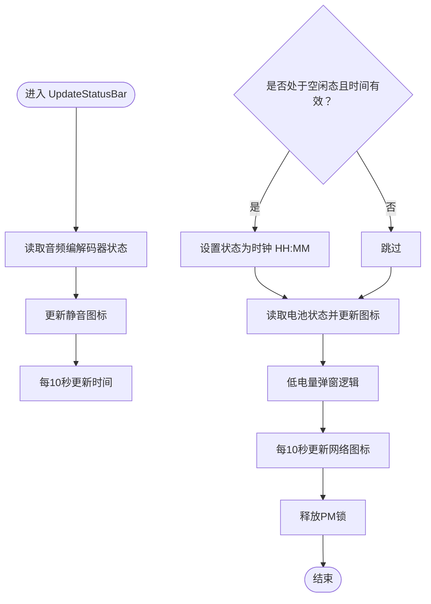
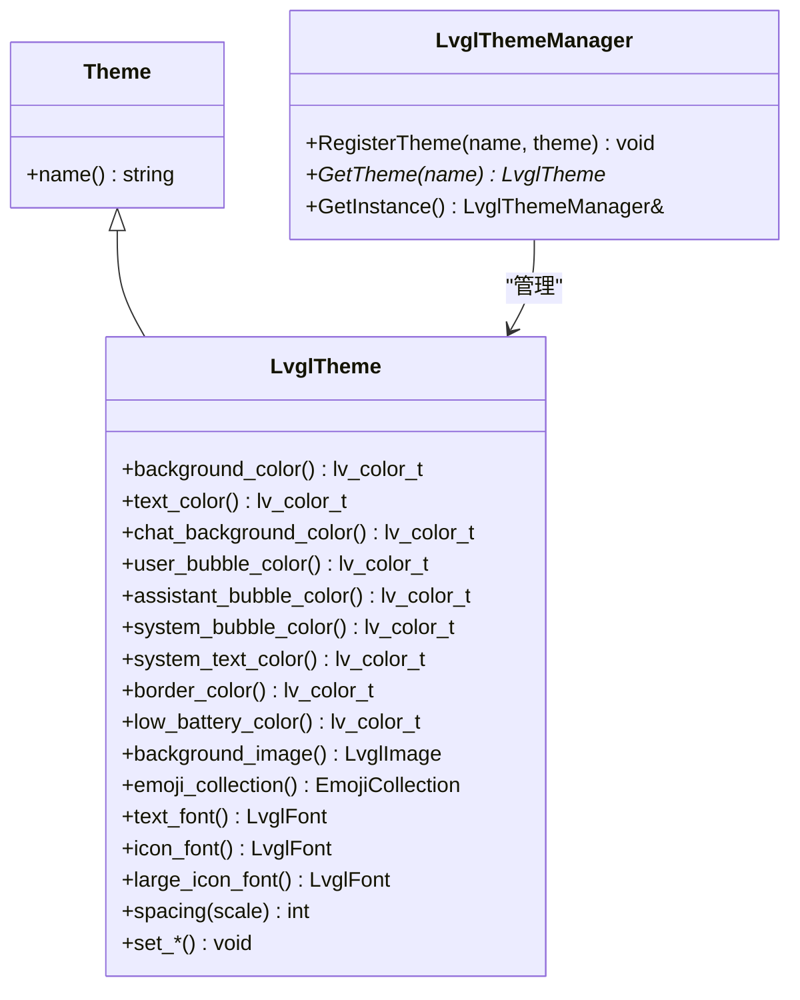
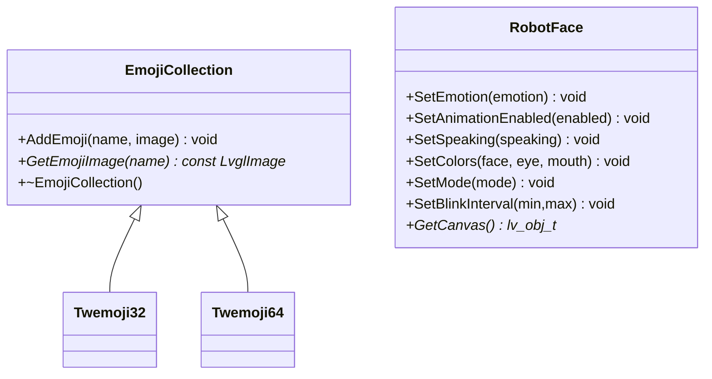
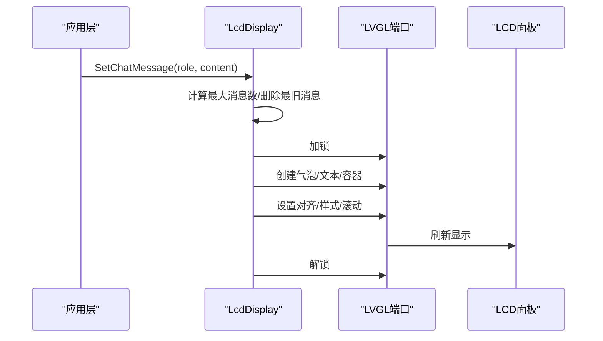
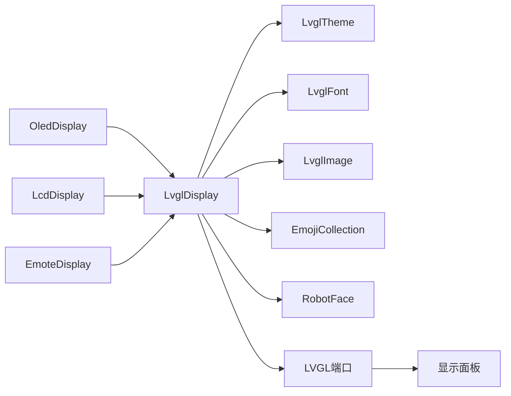

# 显示系统

<cite>
**本文引用的文件**
- [main/display/lvgl_display/lvgl_display.cc](file://main/display/lvgl_display/lvgl_display.cc)
- [main/display/lvgl_display/lvgl_display.h](file://main/display/lvgl_display/lvgl_display.h)
- [main/display/lvgl_display/lvgl_theme.cc](file://main/display/lvgl_display/lvgl_theme.cc)
- [main/display/lvgl_display/lvgl_theme.h](file://main/display/lvgl_display/lvgl_theme.h)
- [main/display/lvgl_display/lvgl_font.cc](file://main/display/lvgl_display/lvgl_font.cc)
- [main/display/lvgl_display/lvgl_font.h](file://main/display/lvgl_display/lvgl_font.h)
- [main/display/lvgl_display/lvgl_image.cc](file://main/display/lvgl_display/lvgl_image.cc)
- [main/display/lvgl_display/lvgl_image.h](file://main/display/lvgl_display/lvgl_image.h)
- [main/display/lvgl_display/emoji_collection.cc](file://main/display/lvgl_display/emoji_collection.cc)
- [main/display/lvgl_display/emoji_collection.h](file://main/display/lvgl_display/emoji_collection.h)
- [main/display/lvgl_display/robot_face.cc](file://main/display/lvgl_display/robot_face.cc)
- [main/display/lvgl_display/robot_face.h](file://main/display/lvgl_display/robot_face.h)
- [main/display/lcd_display.cc](file://main/display/lcd_display.cc)
- [main/display/oled_display.cc](file://main/display/oled_display.cc)
- [main/display/emote_display.cc](file://main/display/emote_display.cc)
- [main/display/display.cc](file://main/display/display.cc)
- [main/display/display.h](file://main/display/display.h)
</cite>

## 目录
1. [简介](#简介)
2. [项目结构](#项目结构)
3. [核心组件](#核心组件)
4. [架构总览](#架构总览)
5. [详细组件分析](#详细组件分析)
6. [依赖关系分析](#依赖关系分析)
7. [性能与内存优化](#性能与内存优化)
8. [故障排查指南](#故障排查指南)
9. [结论](#结论)
10. [附录：自定义开发指南](#附录自定义开发指南)

## 简介
本文件面向ESP32-AI项目的显示系统，系统基于LVGL图形库，提供统一的显示抽象接口，并针对不同硬件平台（OLED与LCD）进行适配。文档涵盖以下方面：
- LVGL图形界面的集成与配置：显示驱动初始化、主题系统、字体管理、图像处理
- 设备支持：OLED与LCD两类显示设备的初始化流程、布局与刷新策略
- 表情系统与动画：内置表情集合、机器人表情绘制与动画、可扩展的动图播放
- 自定义显示内容：图片资源、字体文件、动图素材的制作与集成
- 性能优化与内存管理：缓存策略、刷新策略、电源锁与多缓冲配置
- 实际UI开发示例与调试技巧

## 项目结构
显示系统位于 main/display 目录下，采用“抽象接口 + 多种实现”的分层设计：
- 抽象层：Display/Theme/LvglImage/LvglFont 等基础接口
- LVGL封装层：LvglDisplay 及其主题、字体、图像、表情等模块
- 设备适配层：OledDisplay、LcdDisplay、EmoteDisplay 等具体驱动
- 资源层：emoji_collection、robot_face 提供表情与动效

图表来源
- [main/display/display.h:28-63](file://main/display/display.h#L28-L63)
- [main/display/lvgl_display/lvgl_display.h:15-64](file://main/display/lvgl_display/lvgl_display.h#L15-L64)
- [main/display/lvgl_display/lvgl_theme.h:14-76](file://main/display/lvgl_display/lvgl_theme.h#L14-L76)
- [main/display/lvgl_display/lvgl_font.h:6-31](file://main/display/lvgl_display/lvgl_font.h#L6-L31)
- [main/display/lvgl_display/lvgl_image.h:6-53](file://main/display/lvgl_display/lvgl_image.h#L6-L53)
- [main/display/lvgl_display/emoji_collection.h:13-32](file://main/display/lvgl_display/emoji_collection.h#L13-L32)
- [main/display/lvgl_display/robot_face.h:7-31](file://main/display/lvgl_display/robot_face.h#L7-L31)
- [main/display/oled_display.cc:20-81](file://main/display/oled_display.cc#L20-L81)
- [main/display/lcd_display.cc:65-90](file://main/display/lcd_display.cc#L65-L90)
- [main/display/emote_display.cc:118-135](file://main/display/emote_display.cc#L118-L135)

章节来源
- [main/display/display.h:28-63](file://main/display/display.h#L28-L63)
- [main/display/lvgl_display/lvgl_display.h:15-64](file://main/display/lvgl_display/lvgl_display.h#L15-L64)

## 核心组件
- Display 抽象接口：定义统一的显示能力（状态、通知、表情、消息、主题、电源模式等）
- LvglDisplay：LVGL封装的具体实现，负责状态栏、聊天气泡、传感器标签、表情切换、截图等功能
- 主题系统：LvglTheme/LvglThemeManager 提供颜色、字体、图标、间距、背景等主题属性
- 字体系统：LvglBuiltInFont/LvglCBinFont 支持内置与cbin格式字体
- 图像系统：LvglRawImage/LvglCBinImage/LvglAllocatedImage/LvglSourceImage 支持多种图像来源
- 表情系统：EmojiCollection/Twemoji 提供表情集合；RobotFace 提供绘制式/图片式两种表情渲染与动画
- 设备适配：OledDisplay（单色OLED）、LcdDisplay及其子类（SPI/I2C RGB/MIPI LCD）、EmoteDisplay（外部动图引擎）

章节来源
- [main/display/display.cc:23-60](file://main/display/display.cc#L23-L60)
- [main/display/lvgl_display/lvgl_display.cc:80-120](file://main/display/lvgl_display/lvgl_display.cc#L80-L120)
- [main/display/lvgl_display/lvgl_theme.cc:1-31](file://main/display/lvgl_display/lvgl_theme.cc#L1-L31)
- [main/display/lvgl_display/lvgl_font.cc:1-13](file://main/display/lvgl_display/lvgl_font.cc#L1-L13)
- [main/display/lvgl_display/lvgl_image.cc:1-64](file://main/display/lvgl_display/lvgl_image.cc#L1-L64)
- [main/display/lvgl_display/emoji_collection.cc:1-124](file://main/display/lvgl_display/emoji_collection.cc#L1-L124)
- [main/display/lvgl_display/robot_face.cc:11-79](file://main/display/lvgl_display/robot_face.cc#L11-L79)

## 架构总览
LVGL显示栈从设备驱动到应用UI的调用链如下：

图表来源
- [main/display/lvgl_display/lvgl_display.cc:19-43](file://main/display/lvgl_display/lvgl_display.cc#L19-L43)
- [main/display/lcd_display.cc:351-357](file://main/display/lcd_display.cc#L351-L357)
- [main/display/oled_display.cc:138-144](file://main/display/oled_display.cc#L138-L144)

## 详细组件分析

### LVGL显示封装（LvglDisplay）
- 功能要点
  - 状态栏与通知：顶部网络/静音/电量图标、中间状态文字、底部低电量弹窗
  - 聊天消息：按角色（用户/助手/系统）设置气泡样式与对齐
  - 传感器标签：温度、湿度、MPU6050姿态
  - 表情控制：表情自动更新（基于MPU6050）、手动表情切换、表情动画开关
  - 截图：使用LVGL快照与JPEG编码器输出JPEG数据
  - 锁与电源管理：显示更新时获取PM锁，避免主频降频影响刷新
- 关键实现路径
  - 状态栏更新：[UpdateStatusBar:121-227](file://main/display/lvgl_display/lvgl_display.cc#L121-L227)
  - 表情自动更新（MPU6050）：[SetMpu6050Data:253-299](file://main/display/lvgl_display/lvgl_display.cc#L253-L299)
  - 截图到JPEG：[SnapshotToJpeg:311-351](file://main/display/lvgl_display/lvgl_display.cc#L311-L351)
  - 电源省电模式：[SetPowerSaveMode:301-309](file://main/display/lvgl_display/lvgl_display.cc#L301-L309)

图表来源
- [main/display/lvgl_display/lvgl_display.cc:121-227](file://main/display/lvgl_display/lvgl_display.cc#L121-L227)

章节来源
- [main/display/lvgl_display/lvgl_display.cc:80-227](file://main/display/lvgl_display/lvgl_display.cc#L80-L227)
- [main/display/lvgl_display/lvgl_display.h:15-64](file://main/display/lvgl_display/lvgl_display.h#L15-L64)

### 主题系统（LvglTheme/LvglThemeManager）
- 功能要点
  - 颜色体系：背景、文本、聊天背景、气泡色、边框、低电量提示色
  - 字体体系：文本字体、图标字体、大号图标字体
  - 间距与背景图：统一的spacing缩放与可选背景图
  - 主题注册与获取：全局主题管理器
- 关键实现路径
  - 颜色解析：[ParseColor:6-15](file://main/display/lvgl_display/lvgl_theme.cc#L6-L15)
  - 主题注册/获取：[RegisterTheme/GetTheme:28-30](file://main/display/lvgl_display/lvgl_theme.cc#L28-L30)
  - 主题属性访问器：[LvglTheme 属性:20-51](file://main/display/lvgl_display/lvgl_theme.h#L20-L51)

图表来源
- [main/display/lvgl_display/lvgl_theme.h:14-76](file://main/display/lvgl_display/lvgl_theme.h#L14-L76)
- [main/display/lvgl_display/lvgl_theme.cc:1-31](file://main/display/lvgl_display/lvgl_theme.cc#L1-L31)

章节来源
- [main/display/lvgl_display/lvgl_theme.h:14-76](file://main/display/lvgl_display/lvgl_theme.h#L14-L76)
- [main/display/lvgl_display/lvgl_theme.cc:1-31](file://main/display/lvgl_display/lvgl_theme.cc#L1-L31)

### 字体系统（LvglFont）
- 支持类型
  - 内置字体：LvglBuiltInFont
  - cbin字体：LvglCBinFont
- 关键实现路径
  - cbin字体创建/销毁：[LvglCBinFont:5-13](file://main/display/lvgl_display/lvgl_font.cc#L5-L13)

章节来源
- [main/display/lvgl_display/lvgl_font.h:6-31](file://main/display/lvgl_display/lvgl_font.h#L6-L31)
- [main/display/lvgl_display/lvgl_font.cc:1-13](file://main/display/lvgl_display/lvgl_font.cc#L1-L13)

### 图像系统（LvglImage）
- 支持类型
  - 原始数据图像：LvglRawImage（含GIF检测）
  - cbin图像描述符：LvglCBinImage
  - 分配内存图像：LvglAllocatedImage（自动释放）
  - 源图像指针：LvglSourceImage
- 关键实现路径
  - GIF识别：[IsGif:22-25](file://main/display/lvgl_display/lvgl_image.cc#L22-L25)
  - 分配内存图像释放：[~LvglAllocatedImage:59-64](file://main/display/lvgl_display/lvgl_image.cc#L59-L64)

章节来源
- [main/display/lvgl_display/lvgl_image.h:6-53](file://main/display/lvgl_display/lvgl_image.h#L6-L53)
- [main/display/lvgl_display/lvgl_image.cc:1-64](file://main/display/lvgl_display/lvgl_image.cc#L1-L64)

### 表情系统（EmojiCollection/Twemoji 与 RobotFace）
- EmojiCollection/Twemoji
  - 提供表情名称到图像的映射，支持32px/64px两套Twemoji
- RobotFace
  - 两种渲染模式：DRAW（纯LVGL绘制）与 IMAGE（使用图片资源）
  - 动画：眨眼、说话、空闲、呼吸
  - 情绪切换：根据名称绘制不同表情
- 关键实现路径
  - 表情集合注册：[Twemoji32/Twemoji64 构造:53-123](file://main/display/lvgl_display/emoji_collection.cc#L53-L123)
  - 表情绘制与动画：[RobotFace::SetEmotion/Animate*:214-635](file://main/display/lvgl_display/robot_face.cc#L214-L635)

图表来源
- [main/display/lvgl_display/emoji_collection.h:13-32](file://main/display/lvgl_display/emoji_collection.h#L13-L32)
- [main/display/lvgl_display/robot_face.h:7-31](file://main/display/lvgl_display/robot_face.h#L7-L31)

章节来源
- [main/display/lvgl_display/emoji_collection.cc:1-124](file://main/display/lvgl_display/emoji_collection.cc#L1-L124)
- [main/display/lvgl_display/robot_face.cc:11-727](file://main/display/lvgl_display/robot_face.cc#L11-L727)

### OLED显示适配（OledDisplay）
- 特点
  - 单色显示（monochrome=true），支持128x64与128x32两种布局
  - 任务优先级与栈大小可配置，适合小屏资源受限场景
  - 布局包含顶部状态栏、中间状态/通知、侧栏聊天区
- 关键实现路径
  - 初始化LVGL端口与显示：[构造函数:39-81](file://main/display/oled_display.cc#L39-L81)
  - 128x64布局：[SetupUI_128x64:168-298](file://main/display/oled_display.cc#L168-L298)
  - 128x32布局：[SetupUI_128x32:300-385](file://main/display/oled_display.cc#L300-L385)
  - 表情设置：[SetEmotion:387-398](file://main/display/oled_display.cc#L387-L398)

章节来源
- [main/display/oled_display.cc:20-81](file://main/display/oled_display.cc#L20-L81)
- [main/display/oled_display.cc:168-398](file://main/display/oled_display.cc#L168-L398)

### LCD显示适配（LcdDisplay 及其子类）
- 特点
  - 支持SPI、RGB、MIPI三种接口方式
  - 多种旋转/镜像/偏移参数，适配不同屏幕
  - 聊天消息气泡按角色右/左/居中对齐，支持滚动与最大消息数量限制
  - 主题化布局：顶部状态栏、中部通知/状态、底部低电量弹窗、聊天内容区
- 关键实现路径
  - 主题注册：[InitializeLcdThemes:25-63](file://main/display/lcd_display.cc#L25-L63)
  - SPI/LCD初始化：[SpiLcdDisplay 构造:92-172](file://main/display/lcd_display.cc#L92-L172)
  - RGB LCD初始化：[RgbLcdDisplay 构造:176-233](file://main/display/lcd_display.cc#L176-L233)
  - MIPI LCD初始化：[MipiLcdDisplay 构造:235-284](file://main/display/lcd_display.cc#L235-L284)
  - 聊天消息设置与滚动：[SetChatMessage:562-756](file://main/display/lcd_display.cc#L562-L756)

图表来源
- [main/display/lcd_display.cc:562-756](file://main/display/lcd_display.cc#L562-L756)
- [main/display/lcd_display.cc:351-357](file://main/display/lcd_display.cc#L351-L357)

章节来源
- [main/display/lcd_display.cc:25-63](file://main/display/lcd_display.cc#L25-L63)
- [main/display/lcd_display.cc:92-284](file://main/display/lcd_display.cc#L92-L284)
- [main/display/lcd_display.cc:562-756](file://main/display/lcd_display.cc#L562-L756)

### EmoteDisplay（外部动图引擎）
- 特点
  - 通过回调将帧数据写入面板，支持双缓冲与DMA
  - 事件驱动的表情/动画：监听、空闲、说话、系统消息等
- 关键实现路径
  - 初始化与回调注册：[EmoteDisplay 构造:118-127](file://main/display/emote_display.cc#L118-L127)
  - 设置表情/消息/状态：[SetEmotion/SetChatMessage/SetStatus:137-176](file://main/display/emote_display.cc#L137-L176)
  - 插入对话动画/停止：[InsertAnimDialog/StopAnimDialog:233-240](file://main/display/emote_display.cc#L233-L240)

章节来源
- [main/display/emote_display.cc:118-176](file://main/display/emote_display.cc#L118-L176)
- [main/display/emote_display.cc:233-240](file://main/display/emote_display.cc#L233-L240)

## 依赖关系分析
- 组件耦合
  - LvglDisplay 依赖 Theme/Font/Image/EmojiCollection/RobotFace
  - 设备适配类（OledDisplay/LcdDisplay/EmoteDisplay）继承 Display 并通过 LVGL 端口与面板交互
- 外部依赖
  - LVGL端口（esp_lvgl_port）：负责线程、定时器、缓冲与刷新
  - 图像缓存：PSRAM启用时可配置LVGL图像缓存大小
  - 电源管理锁：显示更新期间提升APB频率，保证刷新流畅

图表来源
- [main/display/lvgl_display/lvgl_display.h:15-64](file://main/display/lvgl_display/lvgl_display.h#L15-L64)
- [main/display/lvgl_display/lvgl_theme.h:14-76](file://main/display/lvgl_display/lvgl_theme.h#L14-L76)
- [main/display/lvgl_display/lvgl_font.h:6-31](file://main/display/lvgl_display/lvgl_font.h#L6-L31)
- [main/display/lvgl_display/lvgl_image.h:6-53](file://main/display/lvgl_display/lvgl_image.h#L6-L53)
- [main/display/oled_display.cc:39-81](file://main/display/oled_display.cc#L39-L81)
- [main/display/lcd_display.cc:128-172](file://main/display/lcd_display.cc#L128-L172)
- [main/display/emote_display.cc:118-127](file://main/display/emote_display.cc#L118-L127)

章节来源
- [main/display/lvgl_display/lvgl_display.h:15-64](file://main/display/lvgl_display/lvgl_display.h#L15-L64)
- [main/display/lcd_display.cc:116-126](file://main/display/lcd_display.cc#L116-L126)

## 性能与内存优化
- 刷新策略
  - 使用 LVGL 端口的双缓冲与DMA标志，减少CPU占用
  - OLED单色显示时，monochrome=true，降低带宽与功耗
  - RGB LCD可开启避免撕裂与全刷标志，平衡流畅度与功耗
- 缓存与内存
  - 在有PSRAM时，根据容量调整LVGL图像缓存大小，提升大图加载性能
  - 分配型图像（LvglAllocatedImage）自动释放，避免泄漏
- 电源与频率
  - 显示更新期间获取PM锁，防止主频下降导致刷新卡顿
- UI复杂度控制
  - 聊天消息上限与滚动策略，避免过多节点造成布局开销
  - 表情动画可开关，空闲时暂停以节省资源

章节来源
- [main/display/lcd_display.cc:116-126](file://main/display/lcd_display.cc#L116-L126)
- [main/display/lvgl_display/lvgl_display.cc:160-161](file://main/display/lvgl_display/lvgl_display.cc#L160-L161)
- [main/display/lvgl_display/lvgl_image.cc:59-64](file://main/display/lvgl_display/lvgl_image.cc#L59-L64)
- [main/display/lcd_display.cc:574-591](file://main/display/lcd_display.cc#L574-L591)

## 故障排查指南
- UI未显示或闪烁
  - 检查 LVGL 端口初始化与显示添加是否成功
  - 确认 DisplayLockGuard 是否正确加锁/解锁
- OLED布局异常
  - 确认分辨率匹配（128x64/128x32），选择对应布局函数
  - 检查字体与字号是否过大导致换行异常
- 聊天消息不滚动或溢出
  - 检查消息数量上限与删除最旧消息逻辑
  - 确认滚动目标对象是否正确
- 表情不更新或动画无效
  - 检查表情自动更新开关与MPU6050数据输入
  - 确认动画计时器是否被暂停
- 截图失败
  - 确认LV_USE_SNAPSHOT已启用
  - 检查RGB565字节序转换与JPEG编码回调

章节来源
- [main/display/lcd_display.cc:562-756](file://main/display/lcd_display.cc#L562-L756)
- [main/display/lvgl_display/lvgl_display.cc:311-351](file://main/display/lvgl_display/lvgl_display.cc#L311-L351)
- [main/display/lvgl_display/robot_face.cc:637-649](file://main/display/lvgl_display/robot_face.cc#L637-L649)

## 结论
本显示系统以LVGL为核心，结合统一的Display抽象与丰富的主题/字体/图像/表情模块，实现了对OLED与LCD等多种显示设备的高效适配。通过合理的刷新策略、内存管理与电源锁机制，在资源受限的ESP32平台上仍能提供流畅的UI体验。开发者可基于现有接口快速扩展新的主题、表情与设备驱动。

## 附录：自定义开发指南

### 自定义主题
- 新建主题类并设置颜色、字体、图标、间距
- 注册到全局主题管理器，运行时切换主题

章节来源
- [main/display/lvgl_display/lvgl_theme.cc:17-30](file://main/display/lvgl_display/lvgl_theme.cc#L17-L30)
- [main/display/lvgl_display/lvgl_theme.h:79-94](file://main/display/lvgl_display/lvgl_theme.h#L79-L94)

### 自定义字体
- 内置字体：直接使用LvglBuiltInFont
- cbin字体：使用LvglCBinFont加载二进制字体

章节来源
- [main/display/lvgl_display/lvgl_font.cc:5-13](file://main/display/lvgl_display/lvgl_font.cc#L5-L13)
- [main/display/lvgl_display/lvgl_font.h:13-31](file://main/display/lvgl_display/lvgl_font.h#L13-L31)

### 自定义表情
- 使用Twemoji32/Twemoji64或自建EmojiCollection
- 或使用RobotFace的DRAW/IMAGE模式自绘/贴图

章节来源
- [main/display/lvgl_display/emoji_collection.cc:53-123](file://main/display/lvgl_display/emoji_collection.cc#L53-L123)
- [main/display/lvgl_display/robot_face.cc:11-79](file://main/display/lvgl_display/robot_face.cc#L11-L79)

### 自定义显示内容
- 图片资源：支持cbin与原始数据，注意色彩格式与stride
- 动图素材：可通过EmoteDisplay或LVGL GIF解码器播放
- 截图导出：使用SnapshotToJpeg生成JPEG数据

章节来源
- [main/display/lvgl_display/lvgl_image.cc:27-46](file://main/display/lvgl_display/lvgl_image.cc#L27-L46)
- [main/display/emote_display.cc:137-176](file://main/display/emote_display.cc#L137-L176)
- [main/display/lvgl_display/lvgl_display.cc:311-351](file://main/display/lvgl_display/lvgl_display.cc#L311-L351)

### 开发示例与调试技巧
- 示例：在应用初始化后调用Display::SetupUI，再设置消息与表情
- 调试：使用DisplayLockGuard确保线程安全；关注日志中的“Failed to lock display”“Failed to add display”等错误信息

章节来源
- [main/display/display.cc:23-33](file://main/display/display.cc#L23-L33)
- [main/display/lcd_display.cc:351-357](file://main/display/lcd_display.cc#L351-L357)