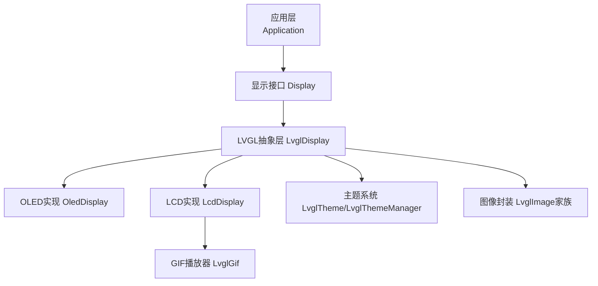
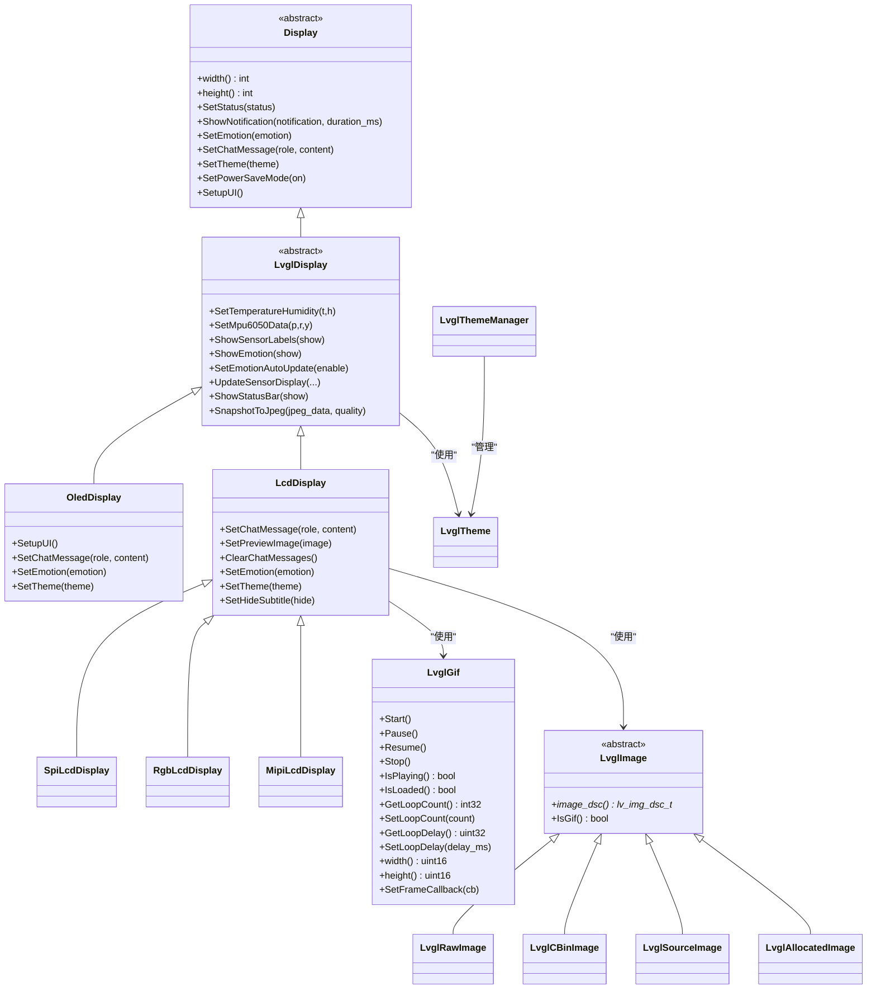
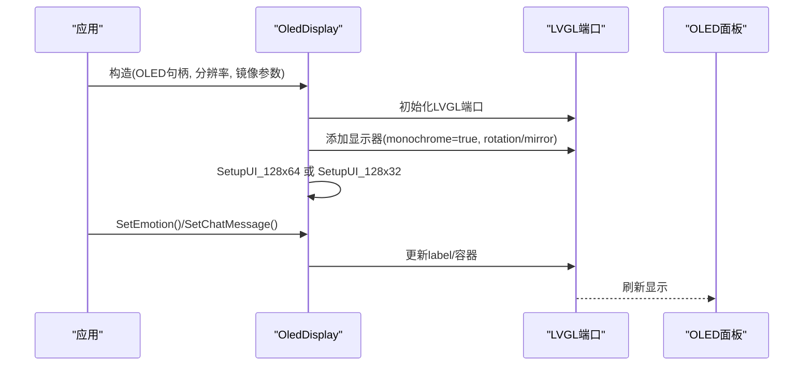
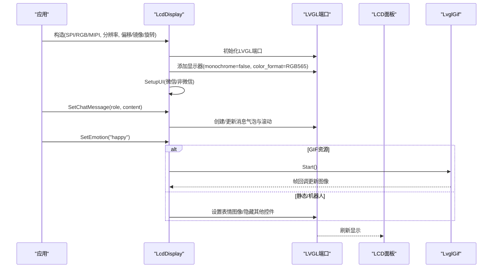
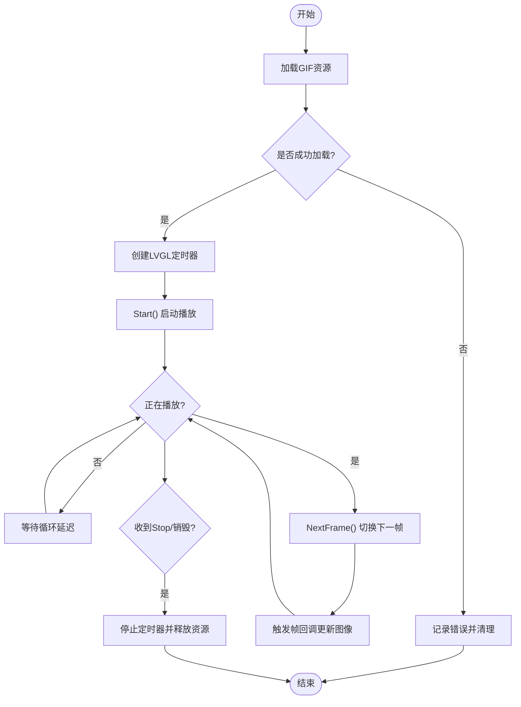
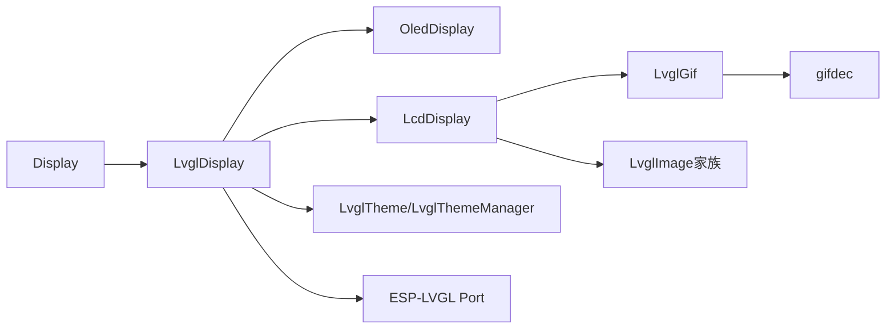

# 显示驱动

<cite>
**本文引用的文件**
- [display.h](file://main/display/display.h)
- [display.cc](file://main/display/display.cc)
- [lvgl_display.h](file://main/display/lvgl_display/lvgl_display.h)
- [oled_display.h](file://main/display/oled_display.h)
- [oled_display.cc](file://main/display/oled_display.cc)
- [lcd_display.h](file://main/display/lcd_display.h)
- [lcd_display.cc](file://main/display/lcd_display.cc)
- [lvgl_gif.h](file://main/display/lvgl_display/gif/lvgl_gif.h)
- [lvgl_theme.h](file://main/display/lvgl_display/lvgl_theme.h)
- [lvgl_image.h](file://main/display/lvgl_display/lvgl_image.h)
</cite>

## 目录
1. [简介](#简介)
2. [项目结构](#项目结构)
3. [核心组件](#核心组件)
4. [架构总览](#架构总览)
5. [详细组件分析](#详细组件分析)
6. [依赖关系分析](#依赖关系分析)
7. [性能考量](#性能考量)
8. [故障排查指南](#故障排查指南)
9. [结论](#结论)
10. [附录](#附录)

## 简介
本文件面向ESP32-AI项目的显示驱动系统，围绕LVGL显示框架与多类显示设备（OLED与彩色LCD）进行技术文档整理。内容覆盖：
- OLED显示驱动（基于SSD1306/SH1106兼容面板）的初始化、布局与主题适配
- 彩色LCD显示驱动（SPI/RGB/MIPI接口）的初始化、像素渲染与聊天消息流式展示
- 不同尺寸屏幕（如128x64、128x32、240x240、320x240等）的参数适配与旋转镜像配置
- GIF动画播放器的实现细节（解码、帧缓冲、播放控制）
- 刷新策略、低功耗模式与背光控制的实践建议
- 驱动移植与硬件兼容性检查方法

## 项目结构
显示相关代码主要位于main/display目录下，并通过LVGL显示抽象层统一管理：
- 基础显示接口与无显示实现：display.h/.cc
- LVGL显示抽象层：lvgl_display.h
- OLED显示实现：oled_display.h/.cc
- LCD显示实现：lcd_display.h/.cc
- LVGL扩展模块：gif播放器、主题与图像封装：lvgl_display/gif、lvgl_theme.h、lvgl_image.h

图表来源
- [display.h:28-63](file://main/display/display.h#L28-L63)
- [lvgl_display.h:15-64](file://main/display/lvgl_display/lvgl_display.h#L15-L64)
- [oled_display.h:10-39](file://main/display/oled_display.h#L10-L39)
- [lcd_display.h:18-86](file://main/display/lcd_display.h#L18-L86)
- [lvgl_gif.h:13-117](file://main/display/lvgl_display/gif/lvgl_gif.h#L13-L117)
- [lvgl_theme.h:14-94](file://main/display/lvgl_display/lvgl_theme.h#L14-L94)
- [lvgl_image.h:7-52](file://main/display/lvgl_display/lvgl_image.h#L7-L52)

章节来源
- [display.h:1-90](file://main/display/display.h#L1-L90)
- [lvgl_display.h:1-68](file://main/display/lvgl_display/lvgl_display.h#L1-L68)

## 核心组件
- Display基类：定义统一的显示接口（状态设置、通知、情感、聊天消息、主题切换、电源模式等），并提供DisplayLockGuard用于线程安全访问
- LvglDisplay：在Display之上集成LVGL对象与定时器，负责状态栏、传感器标签、低电量提示等通用UI元素
- OledDisplay：针对单色OLED面板（monochrome=true）的LVGL端口配置与UI布局，支持128x64与128x32两种典型分辨率
- LcdDisplay/SpiLcdDisplay/RgbLcdDisplay/MipiLcdDisplay：针对彩色LCD的多种接口类型，提供聊天消息流式渲染、预览图、机器人表情、GIF播放等功能
- LvglGif：基于gifdec的GIF解码与帧更新回调机制
- LvglTheme/LvglThemeManager：主题注册与获取，支持背景色、文本色、气泡色、图标字体、大图标字体、间距等
- LvglImage家族：对LVGL图像描述符的封装，支持原始数据、CBin资源、外部源与分配内存等多种来源

章节来源
- [display.h:28-90](file://main/display/display.h#L28-L90)
- [display.cc:17-61](file://main/display/display.cc#L17-L61)
- [lvgl_display.h:15-64](file://main/display/lvgl_display/lvgl_display.h#L15-L64)
- [oled_display.h:10-42](file://main/display/oled_display.h#L10-L42)
- [oled_display.cc:20-144](file://main/display/oled_display.cc#L20-L144)
- [lcd_display.h:18-89](file://main/display/lcd_display.h#L18-L89)
- [lcd_display.cc:65-172](file://main/display/lcd_display.cc#L65-L172)
- [lvgl_gif.h:13-117](file://main/display/lvgl_display/gif/lvgl_gif.h#L13-L117)
- [lvgl_theme.h:14-94](file://main/display/lvgl_display/lvgl_theme.h#L14-L94)
- [lvgl_image.h:7-52](file://main/display/lvgl_display/lvgl_image.h#L7-L52)

## 架构总览
显示系统采用分层设计：
- 应用层通过Display接口调用具体实现
- LvglDisplay统一管理LVGL端口、显示对象与定时器
- OLED/LCD分别针对不同面板特性进行初始化与布局
- 主题系统与图像封装提供可复用的外观与资源管理

图表来源
- [display.h:28-90](file://main/display/display.h#L28-L90)
- [lvgl_display.h:15-64](file://main/display/lvgl_display/lvgl_display.h#L15-L64)
- [oled_display.h:10-42](file://main/display/oled_display.h#L10-L42)
- [lcd_display.h:18-86](file://main/display/lcd_display.h#L18-L86)
- [lvgl_gif.h:13-117](file://main/display/lvgl_display/gif/lvgl_gif.h#L13-L117)
- [lvgl_theme.h:14-94](file://main/display/lvgl_display/lvgl_theme.h#L14-L94)
- [lvgl_image.h:7-52](file://main/display/lvgl_display/lvgl_image.h#L7-L52)

## 详细组件分析

### OLED显示驱动（OledDisplay）
- 单色OLED初始化：通过ESP-LVGL Port添加显示器，monochrome启用，buffer_size按分辨率设置，支持旋转镜像
- 布局适配：根据高度区分128x64与128x32布局；128x64包含顶部状态栏、中间滚动状态、左右侧边内容区；128x32采用纵向布局
- 字体与主题：内置文本/图标/大图标字体，Dark主题默认注册
- 动态更新：聊天消息滚动、表情符号（Font Awesome UTF-8）、低电量弹窗

图表来源
- [oled_display.cc:20-81](file://main/display/oled_display.cc#L20-L81)
- [oled_display.cc:83-144](file://main/display/oled_display.cc#L83-L144)
- [oled_display.cc:168-298](file://main/display/oled_display.cc#L168-L298)
- [oled_display.cc:300-385](file://main/display/oled_display.cc#L300-L385)

章节来源
- [oled_display.h:10-42](file://main/display/oled_display.h#L10-L42)
- [oled_display.cc:20-144](file://main/display/oled_display.cc#L20-L144)
- [oled_display.cc:168-385](file://main/display/oled_display.cc#L168-L385)

### LCD显示驱动（LcdDisplay及其变体）
- 主题系统：Light/Dark双主题，支持背景色、文本色、气泡色、边框色、低电量色、字体与背景图
- 接口适配：SpiLcdDisplay（SPI）、RgbLcdDisplay（RGB）、MipiLcdDisplay（MIPI），均通过LVGL Port初始化
- 聊天消息：非微信风格（默认）与微信风格两种布局；消息数量上限控制、自动滚动、多行换行
- 预览图：支持图片预览与定时隐藏；GIF播放时暂停预览
- 表情与机器人：优先使用RobotFace绘制动态表情，否则回退到静态或GIF图像
- 传感器标签：温度/湿度/MPU6050数据条，支持显示/隐藏与自动更新

图表来源
- [lcd_display.cc:65-172](file://main/display/lcd_display.cc#L65-L172)
- [lcd_display.cc:862-1117](file://main/display/lcd_display.cc#L862-L1117)
- [lcd_display.cc:1119-1193](file://main/display/lcd_display.cc#L1119-L1193)
- [lcd_display.cc:1196-1296](file://main/display/lcd_display.cc#L1196-L1296)
- [lvgl_gif.h:13-117](file://main/display/lvgl_display/gif/lvgl_gif.h#L13-L117)

章节来源
- [lcd_display.h:18-89](file://main/display/lcd_display.h#L18-L89)
- [lcd_display.cc:65-172](file://main/display/lcd_display.cc#L65-L172)
- [lcd_display.cc:862-1193](file://main/display/lcd_display.cc#L862-L1193)
- [lcd_display.cc:1196-1296](file://main/display/lcd_display.cc#L1196-L1296)

### GIF动画播放器（LvglGif）
- 解码库：基于gifdec，封装为LvglGif类
- 播放控制：Start/Pause/Resume/Stop，循环次数与循环等待延迟
- 帧更新：通过LVGL定时器推进帧，支持帧回调同步LVGL图像源
- 生命周期：加载状态检测、资源清理

图表来源
- [lvgl_gif.h:13-117](file://main/display/lvgl_display/gif/lvgl_gif.h#L13-L117)
- [lcd_display.cc:1260-1278](file://main/display/lcd_display.cc#L1260-L1278)

章节来源
- [lvgl_gif.h:13-117](file://main/display/lvgl_display/gif/lvgl_gif.h#L13-L117)

### 主题与字体（LvglTheme/LvglThemeManager）
- 属性：背景色/文本色/聊天背景色/用户/助手/系统气泡色/边框色/低电量色、背景图、字体集合（文本/图标/大图标）、间距
- 注册与获取：全局主题管理器，按名称注册与获取主题
- 应用：SetTheme遍历UI元素批量更新样式

章节来源
- [lvgl_theme.h:14-94](file://main/display/lvgl_display/lvgl_theme.h#L14-L94)
- [lcd_display.cc:1298-1438](file://main/display/lcd_display.cc#L1298-L1438)

### 图像封装（LvglImage家族）
- 支持多种图像来源：原始数据、CBin资源、外部源、分配内存
- GIF判定：IsGif用于分支处理（GIF走LvglGif，静态走lv_image_set_src）

章节来源
- [lvgl_image.h:7-52](file://main/display/lvgl_display/lvgl_image.h#L7-L52)
- [lcd_display.cc:1260-1282](file://main/display/lcd_display.cc#L1260-L1282)

## 依赖关系分析
- 组件耦合
  - LvglDisplay依赖LVGL端口与定时器，向上提供统一接口
  - OLED/LCD实现各自持有panel_io与panel句柄，避免跨模块耦合
  - 主题与图像封装通过指针/智能指针注入，降低编译期依赖
- 外部依赖
  - LVGL端口（ESP-LVGL Port）：负责显示初始化、缓冲与刷新
  - gifdec：GIF解码库
  - Font Awesome：图标UTF-8映射
- 可能的环依赖
  - 通过前置声明与头文件拆分避免循环包含

图表来源
- [display.h:28-63](file://main/display/display.h#L28-L63)
- [lvgl_display.h:15-64](file://main/display/lvgl_display/lvgl_display.h#L15-L64)
- [oled_display.h:10-39](file://main/display/oled_display.h#L10-L39)
- [lcd_display.h:18-86](file://main/display/lcd_display.h#L18-L86)
- [lvgl_gif.h:13-117](file://main/display/lvgl_display/gif/lvgl_gif.h#L13-L117)
- [lvgl_theme.h:79-94](file://main/display/lvgl_display/lvgl_theme.h#L79-L94)
- [lvgl_image.h:7-52](file://main/display/lvgl_display/lvgl_image.h#L7-L52)

章节来源
- [display.h:1-90](file://main/display/display.h#L1-L90)
- [lvgl_display.h:1-68](file://main/display/lvgl_display/lvgl_display.h#L1-L68)
- [oled_display.h:1-42](file://main/display/oled_display.h#L1-L42)
- [lcd_display.h:1-89](file://main/display/lcd_display.h#L1-L89)
- [lvgl_gif.h:1-118](file://main/display/lvgl_display/gif/lvgl_gif.h#L1-L118)
- [lvgl_theme.h:1-95](file://main/display/lvgl_display/lvgl_theme.h#L1-L95)
- [lvgl_image.h:1-53](file://main/display/lvgl_display/lvgl_image.h#L1-L53)

## 性能考量
- 缓冲与刷新
  - OLED：monochrome=true，buffer_size按分辨率设置，减少带宽占用
  - LCD：SPI模式使用较小buffer_size，RGB/MIPI模式可开启双缓冲与全刷标志以提升流畅度
- 字体与图标
  - 文本/图标字体分离，大图标字体仅在高分辨率场景使用，避免过大的line_height导致布局拥挤
- 动画与定时
  - GIF播放通过LVGL定时器推进，帧回调最小化UI线程压力
- 内存与缓存
  - 在具备PSRAM时启用LVGL图像缓存，提高PNG/GIF加载性能
- 低功耗
  - 提供SetPowerSaveMode接口，结合PM锁与定时器暂停非必要任务

章节来源
- [oled_display.cc:49-81](file://main/display/oled_display.cc#L49-L81)
- [lcd_display.cc:116-126](file://main/display/lcd_display.cc#L116-L126)
- [lcd_display.cc:196-233](file://main/display/lcd_display.cc#L196-L233)
- [lcd_display.cc:247-284](file://main/display/lcd_display.cc#L247-L284)
- [lvgl_display.h:37-38](file://main/display/lvgl_display/lvgl_display.h#L37-L38)

## 故障排查指南
- 初始化失败
  - OLED/LCD添加显示器返回空指针：检查panel_io/panel句柄有效性与分辨率配置
  - 日志TAG为“OledDisplay”或“LcdDisplay”，定位初始化阶段
- UI未更新
  - 确认DisplayLockGuard保护临界区；确保SetupUI已调用且UI对象已创建
  - OLED：确认128x64/128x32分支选择正确
- GIF不播放
  - 检查IsLoaded与Start调用；确认帧回调已设置并生效
- 聊天消息溢出
  - 非微信模式下消息数超过上限会删除最旧消息并滚动至最新
- 低电量提示
  - 低电量弹窗需在UI中显式显示，注意透明度与颜色对比度

章节来源
- [oled_display.cc:74-81](file://main/display/oled_display.cc#L74-L81)
- [lcd_display.cc:163-167](file://main/display/lcd_display.cc#L163-L167)
- [lcd_display.cc:574-591](file://main/display/lcd_display.cc#L574-L591)
- [lvgl_gif.h:48-49](file://main/display/lvgl_display/gif/lvgl_gif.h#L48-L49)
- [lvgl_display.h:47-48](file://main/display/lvgl_display/lvgl_display.h#L47-L48)

## 结论
本显示驱动体系以LVGL为核心，通过LvglDisplay抽象层统一对接OLED与LCD设备，提供主题化、可扩展的UI能力。OLED侧重简洁布局与低功耗，LCD强调信息密度与多媒体表现。GIF播放器与图像封装提升了动态内容体验。通过合理的缓冲与刷新策略、字体与缓存配置以及低功耗接口，可在不同硬件平台上获得稳定高效的显示效果。

## 附录

### 不同尺寸屏幕适配方法
- OLED（单色）
  - 128x64：顶部状态栏+中间滚动状态+左右内容区
  - 128x32：纵向布局，左侧表情，右侧状态与滚动文本
- LCD（彩色）
  - 常见分辨率：240x240、320x240、240x320等
  - 通过构造函数传入width/height与offset_x/y、mirror_x/y、swap_xy完成旋转与偏移
  - 微信风格与非微信风格在消息气泡、预览图与底部栏布局上差异较大

章节来源
- [oled_display.cc:91-95](file://main/display/oled_display.cc#L91-L95)
- [oled_display.cc:168-298](file://main/display/oled_display.cc#L168-L298)
- [oled_display.cc:300-385](file://main/display/oled_display.cc#L300-L385)
- [lcd_display.cc:92-172](file://main/display/lcd_display.cc#L92-L172)
- [lcd_display.cc:176-233](file://main/display/lcd_display.cc#L176-L233)
- [lcd_display.cc:235-284](file://main/display/lcd_display.cc#L235-L284)

### 显示刷新策略与背光控制
- 刷新策略
  - OLED：monochrome与小buffer，适合全屏刷新或局部更新
  - LCD：SPI可小buffer，RGB/MIPI可双缓冲与全刷，减少撕裂
- 背光控制
  - 通过Board层GPIO或PMIC控制背光引脚，结合SetPowerSaveMode实现自动休眠
- 低功耗
  - PM锁与定时器暂停非关键任务，关闭GIF/动画，降低刷新频率

章节来源
- [lvgl_display.h:37-38](file://main/display/lvgl_display/lvgl_display.h#L37-L38)
- [lcd_display.cc:116-126](file://main/display/lcd_display.cc#L116-L126)
- [lcd_display.cc:196-233](file://main/display/lcd_display.cc#L196-L233)
- [lcd_display.cc:247-284](file://main/display/lcd_display.cc#L247-L284)

### 驱动移植指南与硬件兼容性检查
- 移植步骤
  - 选择对应面板驱动（OLED或LCD变体），传入正确的panel_io/panel句柄与分辨率
  - 配置旋转/镜像/偏移参数，确保UI坐标与物理像素一致
  - 注册主题与字体，验证颜色与排版
- 兼容性检查
  - 确认LVGL端口初始化成功，display_非空
  - 检查PSRAM可用性以启用图像缓存
  - 对GIF资源进行IsLoaded校验，帧回调正常工作
  - OLED需确认monochrome与buffer_size匹配实际面板

章节来源
- [oled_display.cc:49-81](file://main/display/oled_display.cc#L49-L81)
- [lcd_display.cc:116-126](file://main/display/lcd_display.cc#L116-L126)
- [lvgl_gif.h:48-49](file://main/display/lvgl_display/gif/lvgl_gif.h#L48-L49)