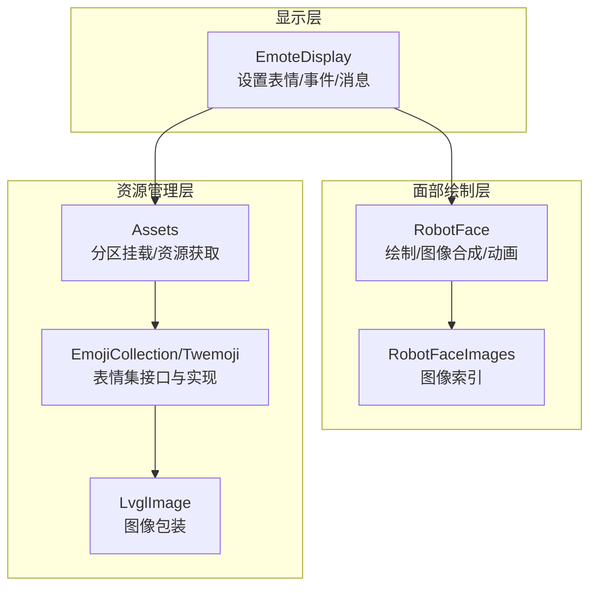
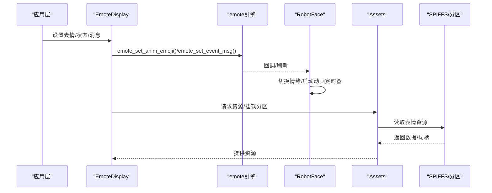
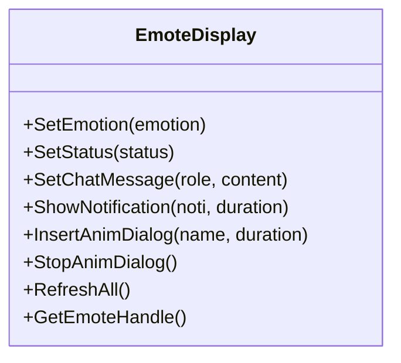
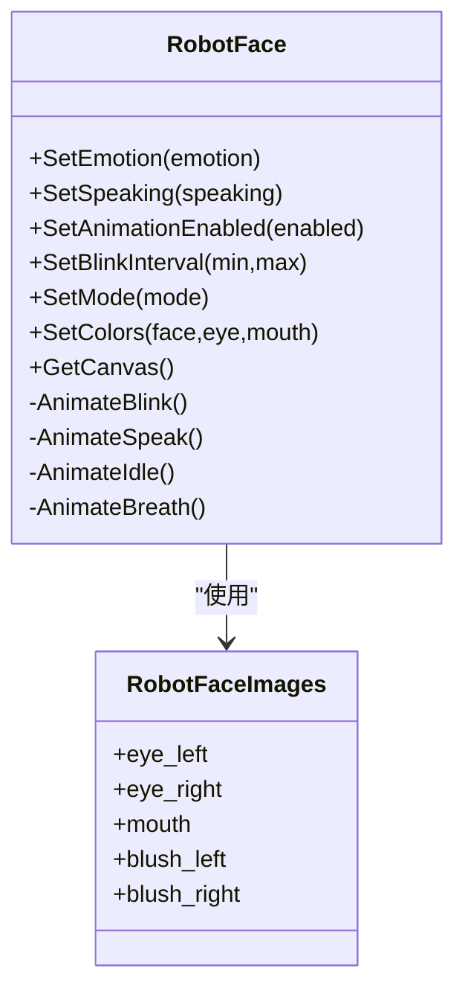
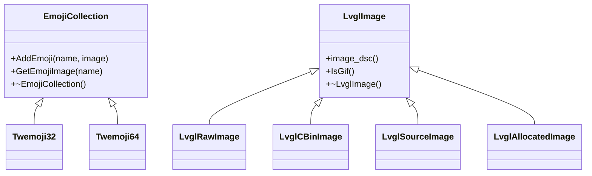
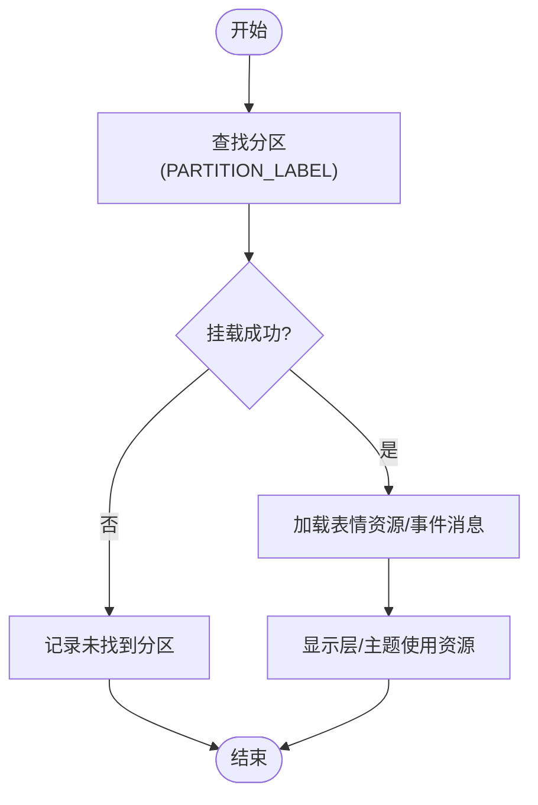
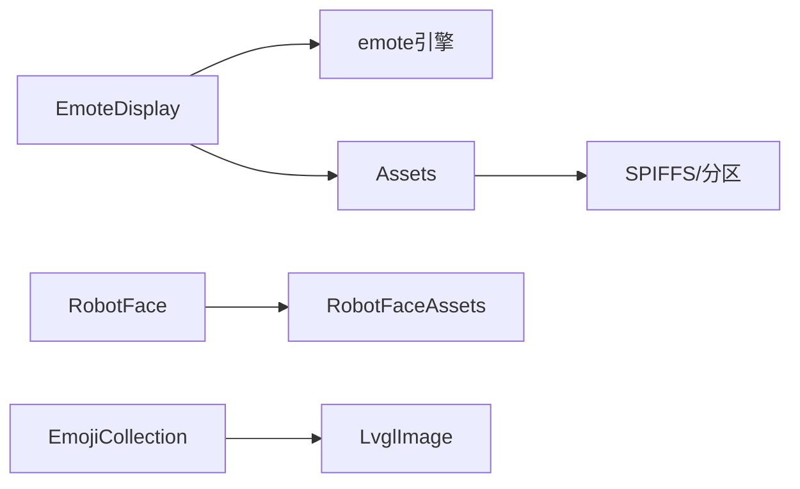

# 表情与动画

<cite>
**本文引用的文件**
- [main/display/emote_display.h](file://main/display/emote_display.h)
- [main/display/emote_display.cc](file://main/display/emote_display.cc)
- [main/display/lvgl_display/robot_face.h](file://main/display/lvgl_display/robot_face.h)
- [main/display/lvgl_display/robot_face.cc](file://main/display/lvgl_display/robot_face.cc)
- [main/display/lvgl_display/robot_face_images.h](file://main/display/lvgl_display/robot_face_images.h)
- [main/display/lvgl_display/emoji_collection.h](file://main/display/lvgl_display/emoji_collection.h)
- [main/display/lvgl_display/emoji_collection.cc](file://main/display/lvgl_display/emoji_collection.cc)
- [main/display/lvgl_display/lvgl_image.h](file://main/display/lvgl_display/lvgl_image.h)
- [main/assets.cc](file://main/assets.cc)
- [main/CMakeLists.txt](file://main/CMakeLists.txt)
- [convert_images.py](file://convert_images.py)
- [resize_eyes.py](file://resize_eyes.py)
</cite>

## 目录
1. [简介](#简介)
2. [项目结构](#项目结构)
3. [核心组件](#核心组件)
4. [架构总览](#架构总览)
5. [详细组件分析](#详细组件分析)
6. [依赖关系分析](#依赖关系分析)
7. [性能考虑](#性能考虑)
8. [故障排查指南](#故障排查指南)
9. [结论](#结论)
10. [附录](#附录)

## 简介
本文件面向ESP32-AI项目的表情与动画系统，系统性阐述表情显示引擎的设计与实现，覆盖以下主题：
- 表情数据结构与状态管理：包括机器人面部表情（眼睛、嘴巴、眉毛等）的绘制与图像化组合，以及动画状态机与定时器驱动。
- 动画播放器架构：基于LVGL与底层emote库的帧序列、时间控制与循环播放。
- 表情集合管理：表情资源加载、缓存策略与内存优化。
- 自定义表情开发：从素材准备到导入流程与质量要求。
- 性能优化与用户体验设计原则。

## 项目结构
表情与动画系统主要由三层构成：
- 显示层：EmoteDisplay封装底层emote引擎，负责接收表情名称并触发动画或静态表情展示；同时支持插入对话气泡动画。
- 面部绘制层：RobotFace负责在容器内绘制或以图像方式合成“眼睛、嘴巴、眉毛、腮红”等部件，并通过定时器实现眨眼、呼吸、说话与闲适动画。
- 资源管理层：Assets负责从SPIFFS/分区挂载表情资源，EmojiCollection提供表情集接口与具体实现（Twemoji系列），LVGL图像包装类统一不同来源的图像数据。

图表来源
- [main/display/emote_display.cc:118-143](file://main/display/emote_display.cc#L118-L143)
- [main/display/lvgl_display/robot_face.cc:214-268](file://main/display/lvgl_display/robot_face.cc#L214-L268)
- [main/display/lvgl_display/robot_face_images.h:38-53](file://main/display/lvgl_display/robot_face_images.h#L38-L53)
- [main/assets.cc:362-384](file://main/assets.cc#L362-L384)
- [main/display/lvgl_display/emoji_collection.cc:53-75](file://main/display/lvgl_display/emoji_collection.cc#L53-L75)
- [main/display/lvgl_display/lvgl_image.h:15-42](file://main/display/lvgl_display/lvgl_image.h#L15-L42)

章节来源
- [main/display/emote_display.h:12-32](file://main/display/emote_display.h#L12-L32)
- [main/display/emote_display.cc:118-143](file://main/display/emote_display.cc#L118-L143)
- [main/display/lvgl_display/robot_face.h:14-31](file://main/display/lvgl_display/robot_face.h#L14-L31)
- [main/display/lvgl_display/robot_face.cc:214-268](file://main/display/lvgl_display/robot_face.cc#L214-L268)
- [main/display/lvgl_display/robot_face_images.h:38-53](file://main/display/lvgl_display/robot_face_images.h#L38-L53)
- [main/display/lvgl_display/emoji_collection.h:14-22](file://main/display/lvgl_display/emoji_collection.h#L14-L22)
- [main/display/lvgl_display/emoji_collection.cc:53-75](file://main/display/lvgl_display/emoji_collection.cc#L53-L75)
- [main/display/lvgl_display/lvgl_image.h:15-42](file://main/display/lvgl_display/lvgl_image.h#L15-L42)
- [main/assets.cc:362-384](file://main/assets.cc#L362-L384)

## 核心组件
- EmoteDisplay：对外暴露设置表情、状态、聊天消息、通知等接口，内部通过emote_set_anim_emoji/emote_set_event_msg等调用底层emote引擎；支持插入对话气泡动画与全量刷新。
- RobotFace：提供两种模式（绘制/图像）合成机器人面部表情；内置多个动画定时器（眨眼、说话、闲适、呼吸），根据情绪切换不同部件形态。
- EmojiCollection/Twemoji：抽象表情集接口与Twemoji32/64实现，提供按名称获取图像的能力；支持自定义表情集注入。
- LvglImage：统一LVGL图像来源（原始数据、cbin、源数据指针、分配数据）。
- Assets：负责从SPIFFS分区挂载表情资源，支持内存映射与按名查询，配合EmoteDisplay使用。

章节来源
- [main/display/emote_display.h:12-32](file://main/display/emote_display.h#L12-L32)
- [main/display/emote_display.cc:137-184](file://main/display/emote_display.cc#L137-L184)
- [main/display/lvgl_display/robot_face.h:14-31](file://main/display/lvgl_display/robot_face.h#L14-L31)
- [main/display/lvgl_display/robot_face.cc:520-572](file://main/display/lvgl_display/robot_face.cc#L520-L572)
- [main/display/lvgl_display/emoji_collection.h:14-22](file://main/display/lvgl_display/emoji_collection.h#L14-L22)
- [main/display/lvgl_display/emoji_collection.cc:53-75](file://main/display/lvgl_display/emoji_collection.cc#L53-L75)
- [main/display/lvgl_display/lvgl_image.h:15-42](file://main/display/lvgl_display/lvgl_image.h#L15-L42)
- [main/assets.cc:362-384](file://main/assets.cc#L362-L384)

## 架构总览
下图展示了从应用层到底层emote引擎的整体交互路径，以及表情资源的加载与使用链路。

图表来源
- [main/display/emote_display.cc:137-184](file://main/display/emote_display.cc#L137-L184)
- [main/assets.cc:362-384](file://main/assets.cc#L362-L384)

## 详细组件分析

### 组件A：表情显示引擎（EmoteDisplay）
- 设计要点
  - 封装底层emote初始化参数（分辨率、FPS、缓冲、任务优先级等），注册刷新回调。
  - 对外提供设置表情、状态、聊天消息、通知、停止/插入对话气泡动画等接口。
  - 支持全量刷新与预览图设置占位。
- 关键行为
  - 设置表情：调用emote_set_anim_emoji，传入表情名称字符串。
  - 设置状态：将系统状态映射为emote事件类型（如监听、空闲、说话、错误）。
  - 设置聊天消息：区分系统消息与普通语音播报消息，分别发送不同事件。
  - 插入对话气泡动画：通过emote_insert_anim_dialog插入指定表情与持续时长。
- 错误处理
  - 当emote句柄为空或输入参数无效时，记录日志并返回失败。

图表来源
- [main/display/emote_display.h:12-32](file://main/display/emote_display.h#L12-L32)

章节来源
- [main/display/emote_display.cc:118-143](file://main/display/emote_display.cc#L118-L143)
- [main/display/emote_display.cc:162-184](file://main/display/emote_display.cc#L162-L184)
- [main/display/emote_display.cc:233-240](file://main/display/emote_display.cc#L233-L240)

### 组件B：机器人面部表情（RobotFace）
- 设计要点
  - 模式切换：绘制模式（原生LVGL对象）与图像模式（按部件拼接的图像）。
  - 部件组成：左/右眼、瞳孔、左右眉毛、嘴巴、腮红；背景图可选。
  - 动画定时器：眨眼、说话、闲适、呼吸四个定时器协同工作。
  - 情绪映射：根据情绪名称选择对应绘制函数（中性、快乐、悲伤、愤怒、惊讶、思考、困倦、爱意、困惑、酷、眨眼、大笑等）。
- 关键行为
  - SetEmotion：隐藏/显示容器、重置部件、按情绪绘制、启动定时器。
  - SetImageEmotion：从RobotFaceAssets获取对应图像并定位到背景坐标上。
  - AnimateBlink/AnimateSpeak/AnimateIdle/AnimateBreath：定时器回调驱动动画。
  - SetSpeaking：控制说话动画的启停。
- 数据结构
  - RobotFaceImages：包含左右眼、嘴巴、左右腮红的图像指针。
  - 定时器数组：blink/speak/idle/breath四个timer。

图表来源
- [main/display/lvgl_display/robot_face.h:14-31](file://main/display/lvgl_display/robot_face.h#L14-L31)
- [main/display/lvgl_display/robot_face_images.h:38-53](file://main/display/lvgl_display/robot_face_images.h#L38-L53)

章节来源
- [main/display/lvgl_display/robot_face.cc:214-268](file://main/display/lvgl_display/robot_face.cc#L214-L268)
- [main/display/lvgl_display/robot_face.cc:270-316](file://main/display/lvgl_display/robot_face.cc#L270-L316)
- [main/display/lvgl_display/robot_face.cc:520-572](file://main/display/lvgl_display/robot_face.cc#L520-L572)
- [main/display/lvgl_display/robot_face_images.h:38-53](file://main/display/lvgl_display/robot_face_images.h#L38-L53)

### 组件C：表情集合与图像包装（EmojiCollection/LvglImage）
- 设计要点
  - EmojiCollection抽象：提供AddEmoji与GetEmojiImage接口，Twemoji32/Twemoji64通过外部生成的LVGL图像数据初始化。
  - 自定义表情：Assets解析配置中的emoji_collection数组，将本地资源转换为LvglRawImage并注入主题。
  - 图像包装：LvglRawImage/LvglCBinImage/LvglSourceImage/LvglAllocatedImage统一封装不同来源的lv_img_dsc_t。
- 关键行为
  - Twemoji构造函数：将标准表情码对应的LVGL图像加入集合。
  - 自定义表情注入：遍历emoji_collection，按文件名获取资源并添加到emoji_collection。

图表来源
- [main/display/lvgl_display/emoji_collection.h:14-22](file://main/display/lvgl_display/emoji_collection.h#L14-L22)
- [main/display/lvgl_display/emoji_collection.cc:53-75](file://main/display/lvgl_display/emoji_collection.cc#L53-L75)
- [main/display/lvgl_display/lvgl_image.h:15-42](file://main/display/lvgl_display/lvgl_image.h#L15-L42)

章节来源
- [main/display/lvgl_display/emoji_collection.cc:53-75](file://main/display/lvgl_display/emoji_collection.cc#L53-L75)
- [main/display/lvgl_display/emoji_collection.cc:101-123](file://main/display/lvgl_display/emoji_collection.cc#L101-L123)
- [main/assets.cc:262-287](file://main/assets.cc#L262-L287)
- [main/display/lvgl_display/lvgl_image.h:15-42](file://main/display/lvgl_display/lvgl_image.h#L15-L42)

### 组件D：资源管理与表情动画下载（Assets/CMakeLists）
- 设计要点
  - 分区挂载：通过PARTITION_LABEL查找并挂载“assets”分区，启用内存映射，使表情资源可直接访问。
  - 资源获取：EmoteStrategy::GetAssetData按名称查询资源数据，供主题与显示层使用。
  - 表情动画下载：CMakeLists中列举一组.aaf动画文件，构建阶段自动下载至本地目录。
- 关键行为
  - Apply/UnApply：在显示初始化前后挂载/卸载资源分区。
  - Download：更新资源时先取消挂载再重新挂载。

图表来源
- [main/assets.cc:362-384](file://main/assets.cc#L362-L384)

章节来源
- [main/assets.cc:362-384](file://main/assets.cc#L362-L384)
- [main/CMakeLists.txt:972-1002](file://main/CMakeLists.txt#L972-L1002)

## 依赖关系分析
- 组件耦合
  - EmoteDisplay依赖emote引擎API与Display基类；与Assets存在弱耦合（通过emote句柄间接使用资源）。
  - RobotFace依赖RobotFaceAssets提供的图像索引与LVGL对象；与定时器强耦合。
  - EmojiCollection与LvglImage解耦，便于替换不同来源的图像数据。
- 外部依赖
  - LVGL用于绘制与图像合成。
  - ESP-IDF的SPIFFS/分区API用于资源存储与访问。
  - CMake下载脚本用于获取.aaf动画资源。

图表来源
- [main/display/emote_display.cc:118-143](file://main/display/emote_display.cc#L118-L143)
- [main/assets.cc:362-384](file://main/assets.cc#L362-L384)
- [main/display/lvgl_display/robot_face_images.h:46-53](file://main/display/lvgl_display/robot_face_images.h#L46-L53)
- [main/display/lvgl_display/emoji_collection.h:14-22](file://main/display/lvgl_display/emoji_collection.h#L14-L22)
- [main/display/lvgl_display/lvgl_image.h:15-42](file://main/display/lvgl_display/lvgl_image.h#L15-L42)

## 性能考虑
- 内存映射与缓存
  - 启用mmap_enable以减少复制开销，提升资源访问速度。
  - 使用LvglImage统一包装，避免重复拷贝与格式转换。
- 动画与定时器
  - 将动画拆分为独立定时器，避免单点阻塞；根据设备能力调整FPS与任务栈大小。
  - 呼吸与眨眼采用小幅度缩放/尺寸变化，降低像素级重绘成本。
- 资源尺寸与数量
  - 统一图像尺寸（如眼睛60x60），减少渲染差异带来的额外计算。
  - 控制表情部件数量与层级，避免过度叠加导致的带宽压力。
- 任务与优先级
  - emote任务栈与优先级需与主UI任务平衡，防止抢占导致掉帧。

## 故障排查指南
- 表情不显示
  - 检查EmoteDisplay是否已正确初始化且句柄有效。
  - 确认分区挂载成功，资源名称与实际一致。
- 动画无响应
  - 确认RobotFace的动画定时器未被暂停；检查SetAnimationEnabled状态。
  - 检查SetSpeaking状态与定时器关联逻辑。
- 资源加载失败
  - 查看分区标签与路径；确认CMake下载流程是否完成。
  - 检查Assets::GetAssetData返回值与错误日志。

章节来源
- [main/display/emote_display.cc:118-143](file://main/display/emote_display.cc#L118-L143)
- [main/display/lvgl_display/robot_face.cc:637-649](file://main/display/lvgl_display/robot_face.cc#L637-L649)
- [main/assets.cc:362-384](file://main/assets.cc#L362-L384)

## 结论
该表情与动画系统通过清晰的分层设计实现了从资源管理到显示输出的完整链路：EmoteDisplay负责高层调度，RobotFace专注面部合成与动画，EmojiCollection与LvglImage提供灵活的资源抽象，Assets保障资源可用性与性能。结合统一的图像尺寸与内存映射策略，系统在资源受限的ESP32平台上仍能提供流畅的动画体验。

## 附录

### A. 表情定制开发指南
- 素材准备
  - 使用convert_images.py将PNG素材批量转为LVGL C数组，生成头文件与尺寸宏定义。
  - 使用resize_eyes.py统一眼部素材尺寸（示例：60x60），确保视觉一致性。
- 导入流程
  - 在配置中新增emoji_collection条目，指向本地资源文件名。
  - Assets在加载主题时解析该列表，将资源转换为LvglRawImage并注入主题。
- 质量要求
  - 图像尺寸统一，颜色格式一致；避免透明度与边缘锯齿影响拼接效果。
  - 动画帧序列命名规范，便于与.aaf动画资源协作。

章节来源
- [convert_images.py:38-107](file://convert_images.py#L38-L107)
- [resize_eyes.py:1-33](file://resize_eyes.py#L1-L33)
- [main/assets.cc:262-287](file://main/assets.cc#L262-L287)

### B. 动画播放器架构（基于emote与LVGL）
- 帧序列与时间控制
  - EmoteDisplay通过emote_set_anim_emoji触发底层emote引擎播放对应动画。
  - 动画事件消息通过emote_set_event_msg传递，支持系统提示与语音播报联动。
- 循环播放与中断
  - InsertAnimDialog允许插入临时动画并设定时长；StopAnimDialog可提前终止。
  - 全局RefreshAll用于强制刷新所有显示内容。

章节来源
- [main/display/emote_display.cc:137-184](file://main/display/emote_display.cc#L137-L184)
- [main/display/emote_display.cc:224-240](file://main/display/emote_display.cc#L224-L240)