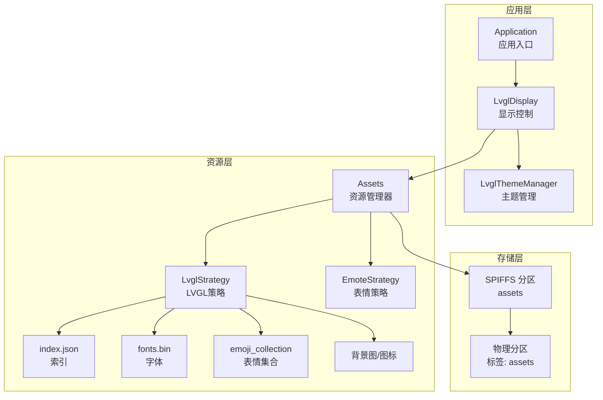
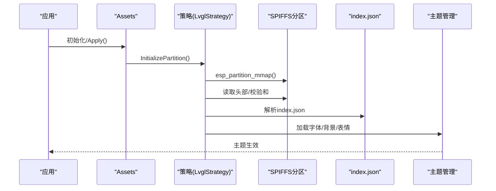
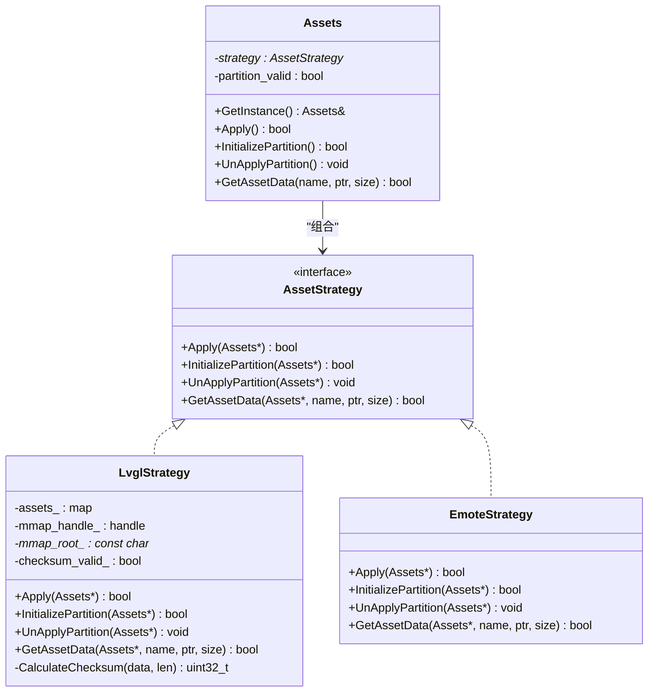
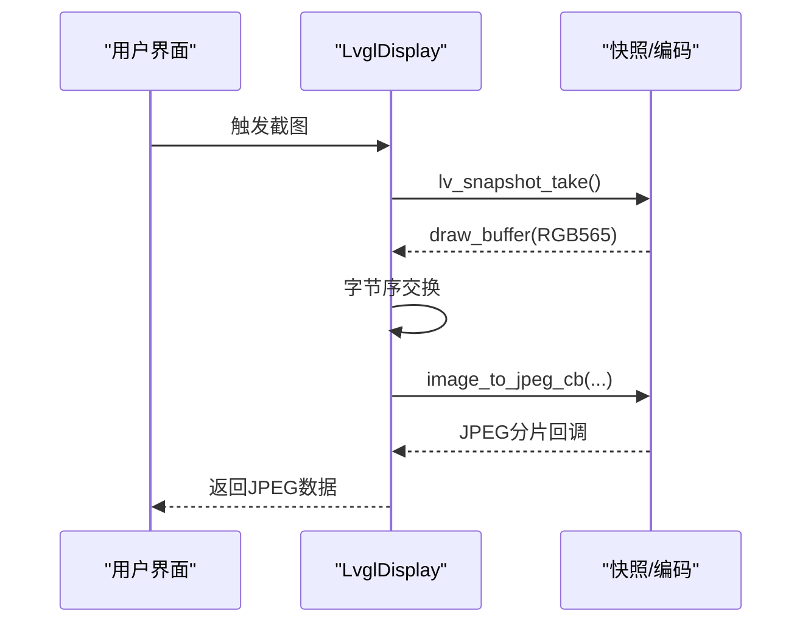
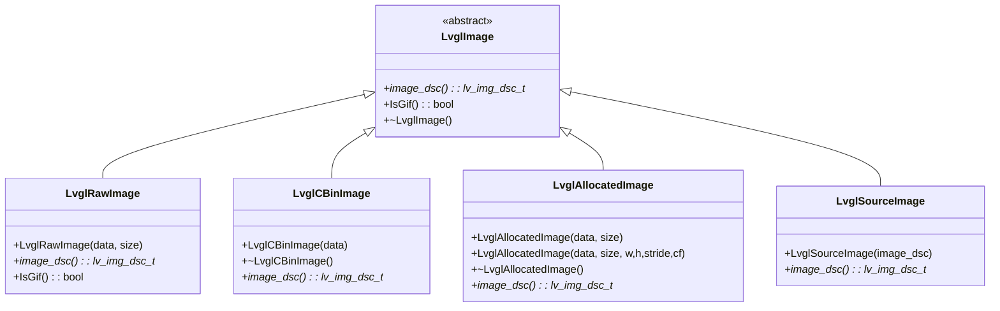
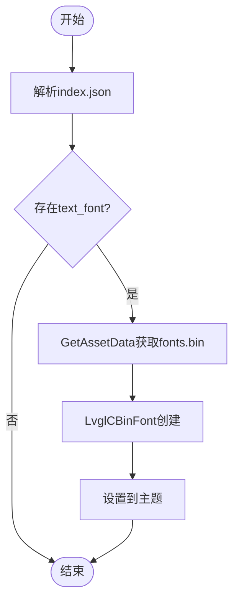
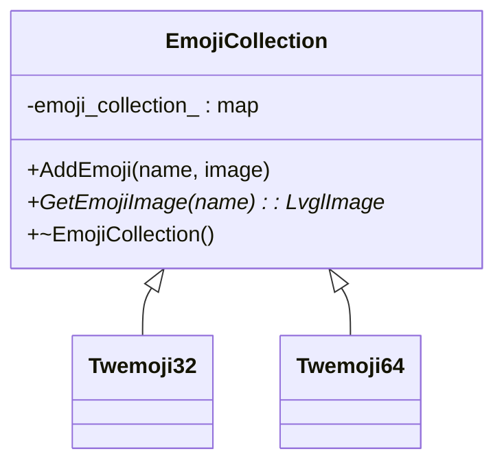
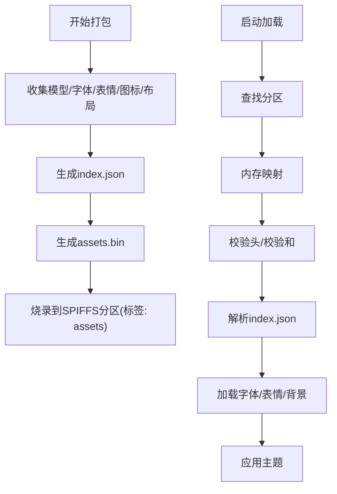
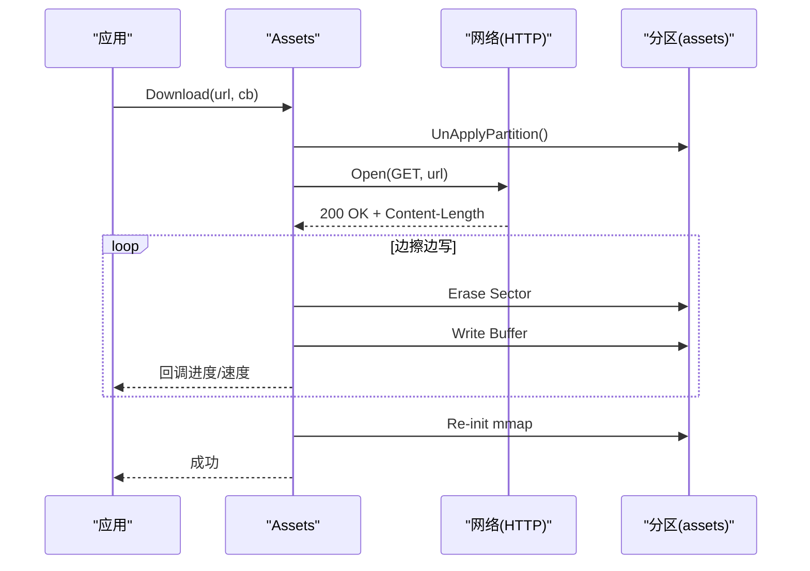
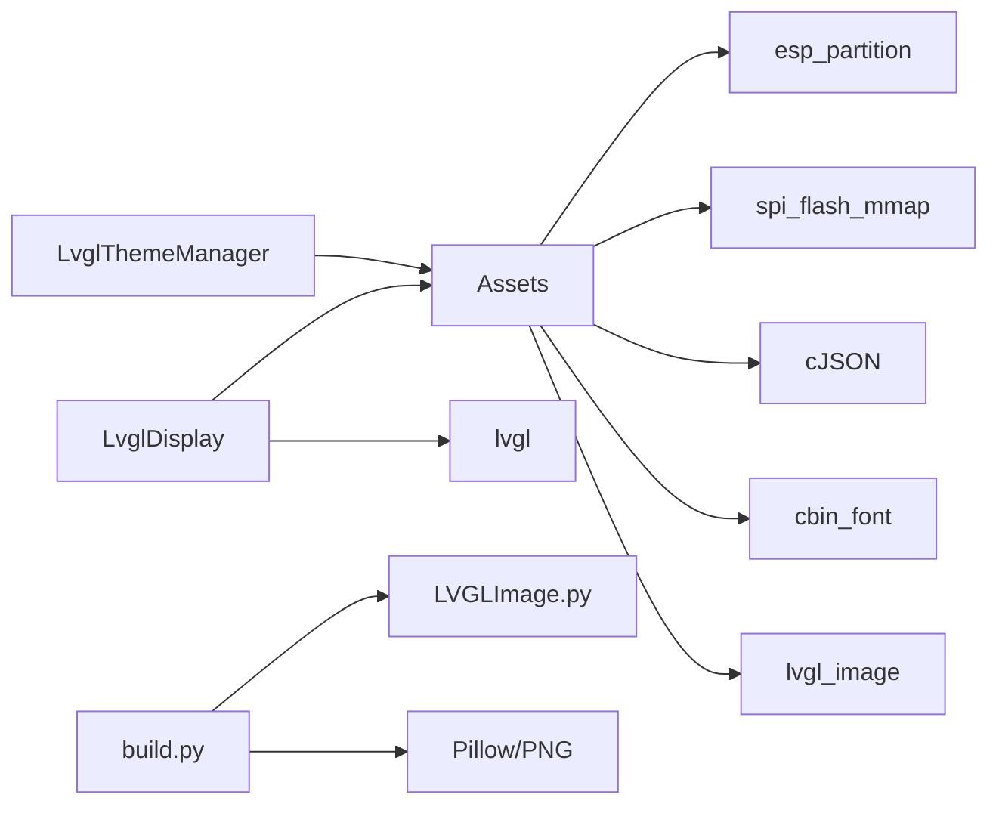

# 资源管理

<cite>
**本文引用的文件**
- [main/assets.h](file://main/assets.h)
- [main/assets.cc](file://main/assets.cc)
- [main/display/lvgl_display/lvgl_display.h](file://main/display/lvgl_display/lvgl_display.h)
- [main/display/lvgl_display/lvgl_display.cc](file://main/display/lvgl_display/lvgl_display.cc)
- [main/display/lvgl_display/lvgl_image.h](file://main/display/lvgl_display/lvgl_image.h)
- [main/display/lvgl_display/lvgl_image.cc](file://main/display/lvgl_display/lvgl_image.cc)
- [main/display/lvgl_display/lvgl_font.h](file://main/display/lvgl_display/lvgl_font.h)
- [main/display/lvgl_display/lvgl_font.cc](file://main/display/lvgl_display/lvgl_font.cc)
- [main/display/lvgl_display/emoji_collection.h](file://main/display/lvgl_display/emoji_collection.h)
- [main/display/lvgl_display/emoji_collection.cc](file://main/display/lvgl_display/emoji_collection.cc)
- [scripts/spiffs_assets/build.py](file://scripts/spiffs_assets/build.py)
- [scripts/Image_Converter/LVGLImage.py](file://scripts/Image_Converter/LVGLImage.py)
- [convert_images.py](file://convert_images.py)
- [main/boards/common/esp32_camera.cc](file://main/boards/common/esp32_camera.cc)
- [main/boards/common/esp_video.cc](file://main/boards/common/esp_video.cc)
</cite>

## 目录
1. [简介](#简介)
2. [项目结构](#项目结构)
3. [核心组件](#核心组件)
4. [架构总览](#架构总览)
5. [详细组件分析](#详细组件分析)
6. [依赖关系分析](#依赖关系分析)
7. [性能考量](#性能考量)
8. [故障排查指南](#故障排查指南)
9. [结论](#结论)
10. [附录](#附录)

## 简介
本文件面向ESP32-AI项目的显示资源管理系统，系统性阐述资源文件的组织与存储策略、SPIFFS资源分区的集成方式、资源打包与加载机制、图像资源处理流程（格式转换、尺寸适配、内存优化）、字体资源管理（中文字体嵌入、字形提取与渲染优化）、资源更新与热重载能力，以及资源调试与性能分析方法。文档同时提供代码级架构图与流程图，帮助开发者快速理解与扩展。

## 项目结构
围绕“资源管理”的关键目录与文件如下：
- main/assets.*：资源分区抽象与加载策略（LVGL与Emote双策略）
- main/display/lvgl_display/*：LVGL显示层对图像、字体、主题、表情的支持
- scripts/spiffs_assets/build.py：资源打包脚本，生成assets.bin与index.json
- scripts/Image_Converter/LVGLImage.py：图像转换与压缩工具
- convert_images.py：将PNG转为LVGL C数组的辅助脚本
- main/boards/common/*：相机与视频路径中的JPEG编码与预览展示

图表来源
- [main/assets.h:23-87](file://main/assets.h#L23-L87)
- [main/assets.cc:30-69](file://main/assets.cc#L30-L69)
- [main/display/lvgl_display/lvgl_display.h:15-64](file://main/display/lvgl_display/lvgl_display.h#L15-L64)

章节来源
- [main/assets.h:1-90](file://main/assets.h#L1-L90)
- [main/assets.cc:1-120](file://main/assets.cc#L1-L120)

## 核心组件
- 资源管理器（Assets）：统一管理资源分区、加载索引、按名称检索资源、应用主题与字体、支持下载更新与热重载。
- 策略模式（Strategy）：LVGLStrategy负责LVGL显示场景下的资源映射、校验与加载；EmoteStrategy用于非LVGL场景的表情资源挂载。
- 显示层（LvglDisplay）：负责状态栏、通知、截图（JPEG）、传感器标签与表情联动。
- 图像与字体封装（LvglImage/LvglFont）：对原始数据、cbin二进制、分配内存等进行统一封装，便于LVGL直接使用。
- 表情集合（EmojiCollection）：内置Twemoji系列表情，支持自定义表情集合。
- 打包与转换（build.py、LVGLImage.py、convert_images.py）：生成assets.bin与index.json，完成图像格式转换与压缩。

章节来源
- [main/assets.h:18-87](file://main/assets.h#L18-L87)
- [main/assets.cc:30-119](file://main/assets.cc#L30-L119)
- [main/display/lvgl_display/lvgl_display.h:15-64](file://main/display/lvgl_display/lvgl_display.h#L15-L64)
- [main/display/lvgl_display/lvgl_image.h:6-53](file://main/display/lvgl_display/lvgl_image.h#L6-L53)
- [main/display/lvgl_display/lvgl_font.h:6-31](file://main/display/lvgl_display/lvgl_font.h#L6-L31)
- [main/display/lvgl_display/emoji_collection.h:13-34](file://main/display/lvgl_display/emoji_collection.h#L13-L34)
- [scripts/spiffs_assets/build.py:279-337](file://scripts/spiffs_assets/build.py#L279-L337)
- [scripts/Image_Converter/LVGLImage.py:491-771](file://scripts/Image_Converter/LVGLImage.py#L491-L771)
- [convert_images.py:1-108](file://convert_images.py#L1-L108)

## 架构总览
资源系统采用“策略+映射+索引”的架构：
- 资源分区以SPIFFS形式存在，标签为“assets”。
- 启动时通过esp_partition_mmap建立内存映射，读取头部元数据与校验和，随后解析索引文件index.json。
- index.json描述版本、文本字体、表情集合、皮肤配置等，Assets根据内容加载字体、背景图、表情，并应用到主题。
- LVGLStrategy支持从映射内存直接读取资源，避免额外拷贝；EmoteStrategy通过emote_mount接口挂载分区。

图表来源
- [main/assets.cc:130-185](file://main/assets.cc#L130-L185)
- [main/assets.cc:214-356](file://main/assets.cc#L214-L356)

章节来源
- [main/assets.cc:130-185](file://main/assets.cc#L130-L185)
- [main/assets.cc:214-356](file://main/assets.cc#L214-L356)

## 详细组件分析

### 资源管理器（Assets）与策略模式
- 单例模式：GetInstance提供全局访问点。
- 策略选择：HAVE_LVGL宏决定使用LvglStrategy或EmoteStrategy。
- LVGL策略职责：
  - 初始化：查找分区、检查可用页数、内存映射、校验头信息与校验和、解析资产表。
  - 应用：加载index.json，解析版本、文本字体、表情集合、皮肤配置，设置主题与表情集合。
  - 数据获取：按名称返回资源指针与长度（来自映射内存）。
- Emote策略职责：
  - 将资源分区挂载到emote子系统，提供按名查询与加载能力。

图表来源
- [main/assets.h:23-87](file://main/assets.h#L23-L87)
- [main/assets.cc:130-185](file://main/assets.cc#L130-L185)
- [main/assets.cc:359-424](file://main/assets.cc#L359-L424)

章节来源
- [main/assets.h:18-87](file://main/assets.h#L18-L87)
- [main/assets.cc:30-119](file://main/assets.cc#L30-L119)
- [main/assets.cc:130-185](file://main/assets.cc#L130-L185)
- [main/assets.cc:359-424](file://main/assets.cc#L359-L424)

### LVGL显示层与资源消费
- LvglDisplay负责状态栏、通知、截图（JPEG）、传感器标签与表情联动。
- 截图流程：从活动屏幕快照绘制缓冲，交换RGB565字节序，回调式编码为JPEG，避免一次性大块内存分配。
- 传感器数据驱动表情变化，支持自动更新开关。

图表来源
- [main/display/lvgl_display/lvgl_display.cc:311-351](file://main/display/lvgl_display/lvgl_display.cc#L311-L351)

章节来源
- [main/display/lvgl_display/lvgl_display.h:15-64](file://main/display/lvgl_display/lvgl_display.h#L15-L64)
- [main/display/lvgl_display/lvgl_display.cc:311-351](file://main/display/lvgl_display/lvgl_display.cc#L311-L351)

### 图像资源封装与处理
- LvglImage体系：
  - LvglRawImage：包装任意原始数据（含GIF探测）。
  - LvglCBinImage：cbin二进制图像描述符，生命周期内管理内存。
  - LvglAllocatedImage：分配内存的图像，负责释放。
  - LvglSourceImage：直接引用静态图像描述符。
- 图像转换与压缩：
  - LVGLImage.py提供多种颜色格式、压缩方法（NONE/RLE/LZ4）、预乘Alpha、stride对齐等能力。
  - convert_images.py将PNG转为LVGL C数组，便于嵌入源码。
- 相机与视频路径：
  - esp32_camera.cc与esp_video.cc演示了RGB565/YUV等格式的编码与预览，JPEG编码通过回调队列传输。

图表来源
- [main/display/lvgl_display/lvgl_image.h:6-53](file://main/display/lvgl_display/lvgl_image.h#L6-L53)
- [main/display/lvgl_display/lvgl_image.cc:12-64](file://main/display/lvgl_display/lvgl_image.cc#L12-L64)

章节来源
- [main/display/lvgl_display/lvgl_image.h:6-53](file://main/display/lvgl_display/lvgl_image.h#L6-L53)
- [main/display/lvgl_display/lvgl_image.cc:12-64](file://main/display/lvgl_display/lvgl_image.cc#L12-L64)
- [scripts/Image_Converter/LVGLImage.py:491-771](file://scripts/Image_Converter/LVGLImage.py#L491-L771)
- [convert_images.py:1-108](file://convert_images.py#L1-L108)
- [main/boards/common/esp32_camera.cc:99-238](file://main/boards/common/esp32_camera.cc#L99-L238)
- [main/boards/common/esp_video.cc:768-793](file://main/boards/common/esp_video.cc#L768-L793)

### 字体资源管理
- LvglFont体系：
  - LvglBuiltInFont：使用LVGL内置字体。
  - LvglCBinFont：从cbin二进制加载字体描述符。
- Assets加载流程：解析index.json中的text_font字段，加载fonts.bin并设置到Light/Dark主题。

图表来源
- [main/assets.cc:242-260](file://main/assets.cc#L242-L260)
- [main/display/lvgl_display/lvgl_font.h:23-31](file://main/display/lvgl_display/lvgl_font.h#L23-L31)
- [main/display/lvgl_display/lvgl_font.cc:5-13](file://main/display/lvgl_display/lvgl_font.cc#L5-L13)

章节来源
- [main/assets.cc:242-260](file://main/assets.cc#L242-L260)
- [main/display/lvgl_display/lvgl_font.h:23-31](file://main/display/lvgl_display/lvgl_font.h#L23-L31)
- [main/display/lvgl_display/lvgl_font.cc:5-13](file://main/display/lvgl_display/lvgl_font.cc#L5-L13)

### 表情集合与皮肤配置
- EmojiCollection：提供添加与查找表情的能力，Twemoji32/Twemoji64内置常用表情。
- Assets在Apply阶段解析emoji_collection数组，构建自定义表情集合并注入主题。

图表来源
- [main/display/lvgl_display/emoji_collection.h:13-34](file://main/display/lvgl_display/emoji_collection.h#L13-L34)
- [main/display/lvgl_display/emoji_collection.cc:9-28](file://main/display/lvgl_display/emoji_collection.cc#L9-L28)

章节来源
- [main/display/lvgl_display/emoji_collection.h:13-34](file://main/display/lvgl_display/emoji_collection.h#L13-L34)
- [main/display/lvgl_display/emoji_collection.cc:9-28](file://main/display/lvgl_display/emoji_collection.cc#L9-L28)
- [main/assets.cc:262-287](file://main/assets.cc#L262-L287)

### 资源打包与加载机制
- 打包脚本build.py：
  - 支持wakenet模型、文本字体、表情集合、图标集合、布局配置等输入。
  - 生成index.json与assets.bin，供固件烧录到SPIFFS分区。
- 资源加载：
  - 初始化时内存映射分区，读取头部元数据与校验和，解析index.json，按需加载字体、表情与背景。
  - 支持下载更新：断开映射、擦写扇区、写入新资源、重新初始化映射并应用。

图表来源
- [scripts/spiffs_assets/build.py:377-396](file://scripts/spiffs_assets/build.py#L377-L396)
- [main/assets.cc:130-185](file://main/assets.cc#L130-L185)
- [main/assets.cc:214-356](file://main/assets.cc#L214-L356)

章节来源
- [scripts/spiffs_assets/build.py:279-337](file://scripts/spiffs_assets/build.py#L279-L337)
- [scripts/spiffs_assets/build.py:377-396](file://scripts/spiffs_assets/build.py#L377-L396)
- [main/assets.cc:130-185](file://main/assets.cc#L130-L185)
- [main/assets.cc:214-356](file://main/assets.cc#L214-L356)

### JPEG与PNG编解码实现要点
- PNG处理：LVGLImage.py支持多种颜色格式与压缩方法；convert_images.py可将PNG转为LVGL C数组。
- JPEG编码：相机与视频路径中使用image_to_jpeg_cb进行回调式编码，减少峰值内存占用；LvglDisplay的截图也采用回调式编码。
- 性能优化：预乘Alpha、压缩（LZ4/RLE）、stride对齐、字节序交换、内存对齐分配。

章节来源
- [scripts/Image_Converter/LVGLImage.py:491-771](file://scripts/Image_Converter/LVGLImage.py#L491-L771)
- [convert_images.py:1-108](file://convert_images.py#L1-L108)
- [main/boards/common/esp32_camera.cc:209-234](file://main/boards/common/esp32_camera.cc#L209-L234)
- [main/display/lvgl_display/lvgl_display.cc:333-340](file://main/display/lvgl_display/lvgl_display.cc#L333-L340)

### 资源更新与热重载
- Download流程：
  - 断开当前映射，打开HTTP连接，按扇区擦写与写入，边擦边写，实时计算进度与速度。
  - 写入完成后重新初始化分区并应用，实现热重载。
- 注意事项：下载前断映射，确保分区未被占用；写入过程严格校验长度与状态码。

图表来源
- [main/assets.cc:426-560](file://main/assets.cc#L426-L560)

章节来源
- [main/assets.cc:426-560](file://main/assets.cc#L426-L560)

## 依赖关系分析
- 组件耦合：
  - Assets依赖esp_partition与spi_flash_mmap；LVGL策略依赖cbin_font与lvgl图像接口。
  - 显示层依赖Assets提供的字体与图像资源；主题管理器依赖Assets加载的字体与表情。
- 外部依赖：
  - JSON解析（cJSON）用于index.json解析。
  - LVGL图像/字体/主题库。
  - Python生态（pypng、lz4、Pillow）用于资源转换与打包。

图表来源
- [main/assets.cc:1-16](file://main/assets.cc#L1-L16)
- [main/display/lvgl_display/lvgl_display.h:7-14](file://main/display/lvgl_display/lvgl_display.h#L7-L14)
- [scripts/spiffs_assets/build.py:16-22](file://scripts/spiffs_assets/build.py#L16-L22)
- [scripts/Image_Converter/LVGLImage.py:11-19](file://scripts/Image_Converter/LVGLImage.py#L11-L19)

章节来源
- [main/assets.cc:1-16](file://main/assets.cc#L1-L16)
- [main/display/lvgl_display/lvgl_display.h:7-14](file://main/display/lvgl_display/lvgl_display.h#L7-L14)
- [scripts/spiffs_assets/build.py:16-22](file://scripts/spiffs_assets/build.py#L16-L22)
- [scripts/Image_Converter/LVGLImage.py:11-19](file://scripts/Image_Converter/LVGLImage.py#L11-L19)

## 性能考量
- 内存映射：通过esp_partition_mmap将分区映射到进程地址空间，避免重复拷贝，提升加载效率。
- 压缩与预乘：LVGLImage支持LZ4/RLE压缩与预乘Alpha，降低带宽与合成成本。
- 回调式编码：JPEG编码采用回调分片，避免一次性大块内存分配，适合低内存设备。
- 字节序与对齐：RGB565字节序交换与stride对齐，减少LVGL解码与渲染开销。
- 预览优化：相机路径中对RGB565预览使用独立缓冲，避免重复解码。

章节来源
- [main/assets.cc:138-151](file://main/assets.cc#L138-L151)
- [scripts/Image_Converter/LVGLImage.py:476-488](file://scripts/Image_Converter/LVGLImage.py#L476-L488)
- [main/display/lvgl_display/lvgl_display.cc:322-340](file://main/display/lvgl_display/lvgl_display.cc#L322-L340)
- [main/boards/common/esp32_camera.cc:99-120](file://main/boards/common/esp32_camera.cc#L99-L120)

## 故障排查指南
- 分区未找到或校验失败：
  - 现象：找不到标签为“assets”的分区或校验不通过。
  - 排查：确认分区已正确烧录、容量充足、校验和一致。
- 资源缺失：
  - 现象：index.json中引用的字体/表情/背景不存在。
  - 排查：检查assets.bin中对应文件是否存在，index.json条目是否正确。
- 下载失败：
  - 现象：HTTP状态非200、内容长度异常、写入失败或擦写范围越界。
  - 排查：检查URL可达性、分区大小限制、扇区擦写逻辑与权限。
- 截图失败：
  - 现象：lv_snapshot为空或JPEG编码失败。
  - 排查：确认LV_USE_SNAPSHOT启用、RGB565字节序交换正确、回调函数返回值。

章节来源
- [main/assets.cc:436-455](file://main/assets.cc#L436-L455)
- [main/assets.cc:518-523](file://main/assets.cc#L518-L523)
- [main/assets.cc:318-340](file://main/assets.cc#L318-L340)
- [main/display/lvgl_display/lvgl_display.cc:311-351](file://main/display/lvgl_display/lvgl_display.cc#L311-L351)

## 结论
本资源管理系统通过策略化设计与SPIFFS内存映射，实现了资源的高效加载与主题化应用；结合Python脚本完成资源打包与格式转换，满足多平台与多格式需求；在LVGL显示层提供统一的图像、字体与表情封装，配合回调式JPEG编码与内存优化技术，兼顾性能与稳定性。下载更新流程支持热重载，保障产品迭代与维护效率。

## 附录
- 资源打包命令示例（摘自build.py）：
  - 生成assets.bin与index.json，包含唤醒模型、文本字体、表情集合等。
- 图像转换工具：
  - LVGLImage.py：支持多种颜色格式与压缩方法。
  - convert_images.py：将PNG转为LVGL C数组，便于嵌入源码。
- 相关路径参考：
  - 资源打包脚本：scripts/spiffs_assets/build.py
  - 图像转换工具：scripts/Image_Converter/LVGLImage.py
  - PNG转C数组：convert_images.py
  - 相机与视频编码：main/boards/common/esp32_camera.cc、main/boards/common/esp_video.cc