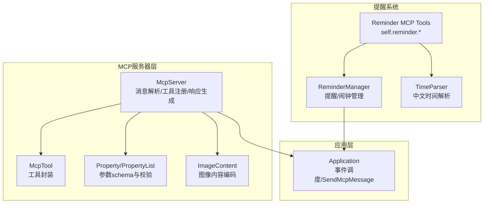
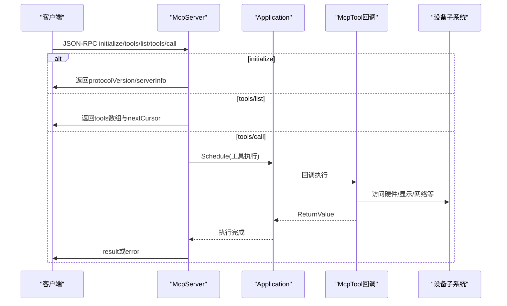
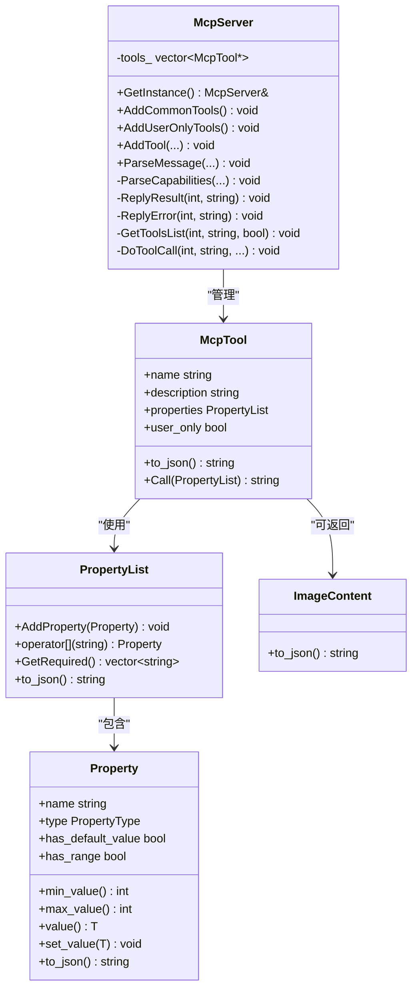
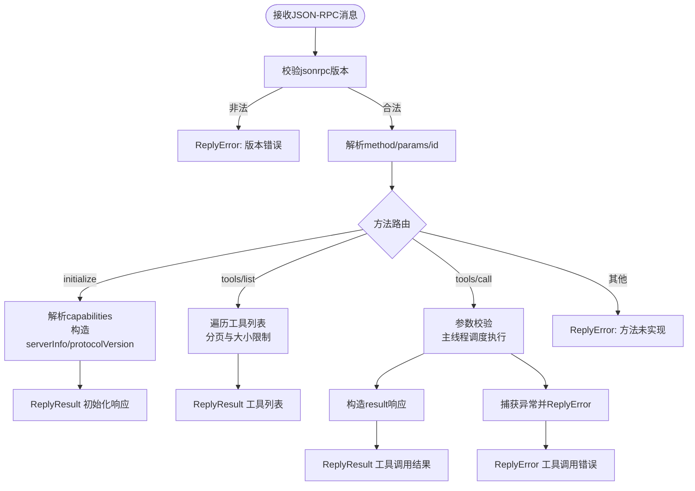
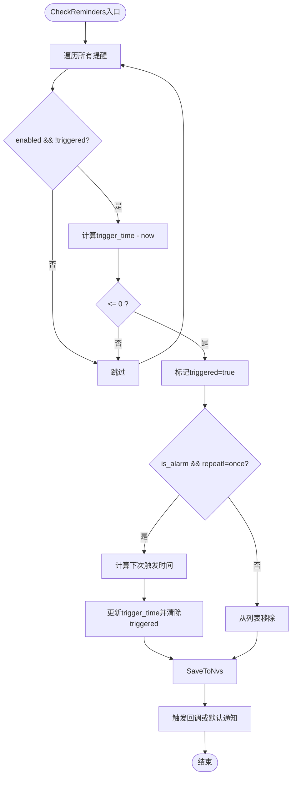
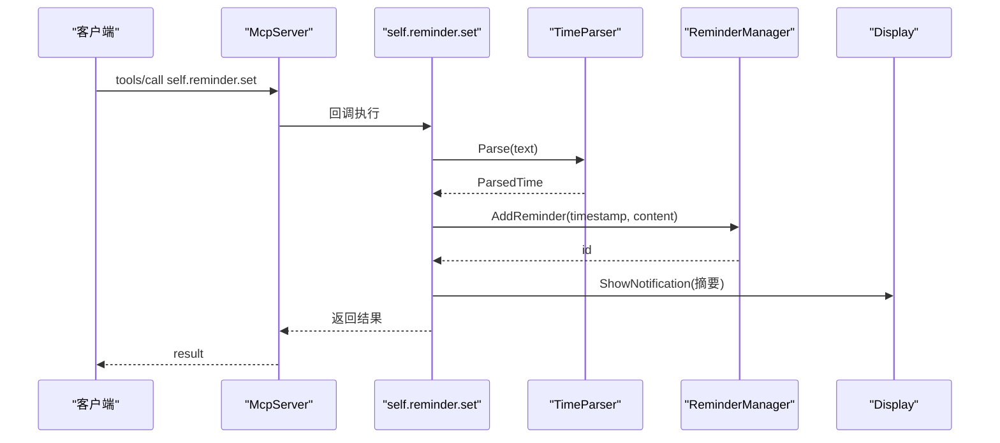
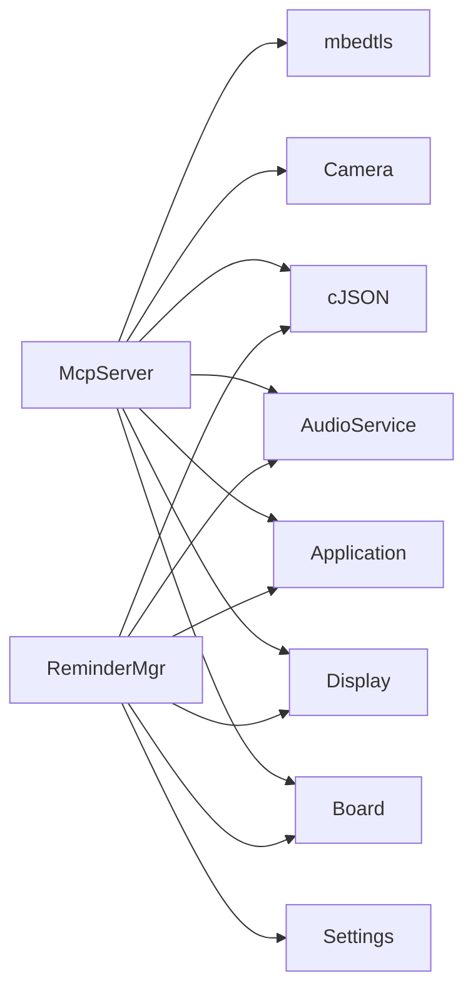

# MCP协议服务器

<cite>
**本文引用的文件**
- [mcp_server.h](file://main/mcp_server.h)
- [mcp_server.cc](file://main/mcp_server.cc)
- [reminder_manager.h](file://main/reminder_manager.h)
- [reminder_manager.cc](file://main/reminder_manager.cc)
- [reminder_mcp_tool.cc](file://main/reminder_mcp_tool.cc)
- [time_parser.h](file://main/time_parser.h)
- [time_parser.cc](file://main/time_parser.cc)
- [mcp-protocol.md](file://docs/mcp-protocol.md)
- [mcp-usage.md](file://docs/mcp-usage.md)
- [application.h](file://main/application.h)
</cite>

## 目录
1. [简介](#简介)
2. [项目结构](#项目结构)
3. [核心组件](#核心组件)
4. [架构总览](#架构总览)
5. [详细组件分析](#详细组件分析)
6. [依赖关系分析](#依赖关系分析)
7. [性能考量](#性能考量)
8. [故障排查指南](#故障排查指南)
9. [结论](#结论)
10. [附录](#附录)

## 简介
本文件面向ESP32-AI项目的MCP协议服务器，系统性阐述McpServer类的设计架构、MCP协议规范实现、工具注册机制与设备控制接口；详解MCP消息处理流程、命令解析与响应生成机制；解释提醒管理系统（含定时任务、提醒触发与状态同步）；提供MCP工具开发指南（自定义工具创建、参数验证与错误处理）；涵盖安全与权限控制、性能优化策略，并给出实际使用案例与集成示例。

## 项目结构
围绕MCP协议服务器的关键文件组织如下：
- 协议与服务器实现：mcp_server.h/.cc
- 提醒管理：reminder_manager.h/.cc
- 提醒工具入口：reminder_mcp_tool.cc
- 时间解析：time_parser.h/.cc
- 协议与用法文档：docs/mcp-protocol.md、docs/mcp-usage.md
- 应用层调度与消息通道：application.h

图表来源
- [mcp_server.h:314-342](file://main/mcp_server.h#L314-L342)
- [mcp_server.cc:35-132](file://main/mcp_server.cc#L35-L132)
- [reminder_manager.h:22-56](file://main/reminder_manager.h#L22-L56)
- [reminder_manager.cc:31-92](file://main/reminder_manager.cc#L31-L92)
- [reminder_mcp_tool.cc:23-163](file://main/reminder_mcp_tool.cc#L23-L163)
- [time_parser.h:18-27](file://main/time_parser.h#L18-L27)
- [application.h:50-194](file://main/application.h#L50-L194)

章节来源
- [mcp_server.h:1-345](file://main/mcp_server.h#L1-L345)
- [mcp_server.cc:1-570](file://main/mcp_server.cc#L1-L570)
- [reminder_manager.h:1-59](file://main/reminder_manager.h#L1-L59)
- [reminder_manager.cc:1-331](file://main/reminder_manager.cc#L1-L331)
- [reminder_mcp_tool.cc:1-164](file://main/reminder_mcp_tool.cc#L1-L164)
- [time_parser.h:1-30](file://main/time_parser.h#L1-L30)
- [time_parser.cc:1-244](file://main/time_parser.cc#L1-L244)
- [mcp-protocol.md:1-270](file://docs/mcp-protocol.md#L1-L270)
- [mcp-usage.md:1-115](file://docs/mcp-usage.md#L1-L115)
- [application.h:1-200](file://main/application.h#L1-L200)

## 核心组件
- McpServer：单例服务器，负责解析MCP JSON-RPC消息、注册工具、执行工具调用并生成响应。
- McpTool：工具抽象，封装名称、描述、输入schema、回调与可见性（user-only）。
- Property/PropertyList：参数schema定义与运行时校验，支持布尔、整数、字符串，整数可配置范围与默认值。
- ImageContent：图像内容封装与Base64编码，用于工具返回图片。
- ReminderManager：提醒/闹钟持久化存储、触发检测、重复策略计算与触发回调。
- TimeParser：中文时间文本解析（绝对时间/相对时间），生成触发时间戳。
- Reminder MCP Tools：基于TimeParser的提醒/闹钟工具集合，注册到McpServer。

章节来源
- [mcp_server.h:52-342](file://main/mcp_server.h#L52-L342)
- [reminder_manager.h:10-56](file://main/reminder_manager.h#L10-L56)
- [reminder_manager.cc:31-92](file://main/reminder_manager.cc#L31-L92)
- [reminder_mcp_tool.cc:23-163](file://main/reminder_mcp_tool.cc#L23-L163)
- [time_parser.h:7-27](file://main/time_parser.h#L7-L27)
- [time_parser.cc:228-243](file://main/time_parser.cc#L228-L243)

## 架构总览
MCP服务器采用“单例+工具注册+线程调度”的架构：
- 单例McpServer持有工具列表，按需注册通用工具与用户专用工具。
- 解析JSON-RPC消息，路由到initialize/tools/list/tools/call等方法。
- 工具调用通过Application::Schedule进入主线程执行，保证设备资源访问一致性。
- 响应通过Application::SendMcpMessage回传至上层协议（WebSocket/MQTT）。

图表来源
- [mcp_server.cc:393-442](file://main/mcp_server.cc#L393-L442)
- [mcp_server.cc:517-569](file://main/mcp_server.cc#L517-L569)
- [application.h:86-118](file://main/application.h#L86-L118)

## 详细组件分析

### McpServer类设计与实现
- 单例模式：全局唯一实例，避免重复初始化。
- 工具注册：
  - AddCommonTools：注册通用工具（设备状态、音量、屏幕亮度、主题、拍照等），并优先放置于工具列表前端以利用提示缓存。
  - AddUserOnlyTools：注册系统工具（系统信息、重启、固件升级、屏幕截图、预览图片、资源下载URL等）。
  - AddTool/AddUserOnlyTool：去重插入，记录工具名称与可见性。
- 消息解析：
  - ParseMessage：解析JSON-RPC，校验版本、方法、参数与id。
  - initialize：返回协议版本、能力声明与服务器信息。
  - tools/list：分页返回工具清单，限制单次响应大小。
  - tools/call：参数校验、主线程调度执行、异常捕获与错误响应。
- 响应生成：ReplyResult/ReplyError构造标准JSON-RPC响应并通过Application发送。

图表来源
- [mcp_server.h:208-342](file://main/mcp_server.h#L208-L342)

章节来源
- [mcp_server.h:314-342](file://main/mcp_server.h#L314-L342)
- [mcp_server.cc:35-132](file://main/mcp_server.cc#L35-L132)
- [mcp_server.cc:330-459](file://main/mcp_server.cc#L330-L459)
- [mcp_server.cc:461-515](file://main/mcp_server.cc#L461-L515)
- [mcp_server.cc:517-569](file://main/mcp_server.cc#L517-L569)

### 工具注册机制与设备控制接口
- 通用工具（可被AI可见）：
  - 设备状态查询：self.get_device_status
  - 音频音量调节：self.audio_speaker.set_volume
  - 屏幕亮度调节：self.screen.set_brightness（若背光可用）
  - 屏幕主题切换：self.screen.set_theme（LVGL场景）
  - 拍照与解释：self.camera.take_photo（LVGL场景）
- 用户专用工具（仅用户可见，AI不可见）：
  - 系统信息：self.get_system_info
  - 重启：self.reboot
  - 固件升级：self.upgrade_firmware
  - 屏幕信息：self.screen.get_info
  - 截图上传：self.screen.snapshot
  - 图片预览：self.screen.preview_image
  - 资源下载URL设置：self.assets.set_download_url

章节来源
- [mcp_server.cc:47-124](file://main/mcp_server.cc#L47-L124)
- [mcp_server.cc:134-307](file://main/mcp_server.cc#L134-L307)

### MCP消息处理流程与命令解析
- initialize：校验jsonrpc版本，读取capabilities（如vision.url/token），返回protocolVersion、capabilities与serverInfo。
- tools/list：支持cursor分页，限制单次响应大小（约8KB），返回tools数组与nextCursor。
- tools/call：校验参数类型与必填项，主线程执行回调，构造标准响应；异常转换为错误响应。

图表来源
- [mcp_server.cc:393-442](file://main/mcp_server.cc#L393-L442)
- [mcp_server.cc:461-515](file://main/mcp_server.cc#L461-L515)
- [mcp_server.cc:517-569](file://main/mcp_server.cc#L517-L569)

章节来源
- [mcp_server.cc:330-459](file://main/mcp_server.cc#L330-L459)
- [mcp_server.cc:461-515](file://main/mcp_server.cc#L461-L515)
- [mcp_server.cc:517-569](file://main/mcp_server.cc#L517-L569)

### 响应生成机制与返回值类型
- ReturnValue：variant支持bool/int/string/cJSON*/ImageContent*。
- McpTool::Call：根据返回值类型生成content数组，支持text/image两种内容项；isError标记是否错误。
- ImageContent：Base64编码图像数据，输出为标准JSON对象。

章节来源
- [mcp_server.h:50](file://main/mcp_server.h#L50)
- [mcp_server.h:208-312](file://main/mcp_server.h#L208-L312)
- [mcp_server.h:16-47](file://main/mcp_server.h#L16-L47)

### 提醒管理系统实现原理
- 数据结构：ReminderTask包含id、触发时间、内容、启用/触发状态、是否闹钟、重复策略、铃声、音量。
- 生命周期：
  - AddReminder/AddAlarm：生成唯一ID，写入NVS，记录触发时间与内容。
  - CheckReminders：逐个检查，触发后更新状态；闹钟根据repeat策略计算下次触发时间或删除。
  - SaveToNvs/LoadFromNvs：键空间“next_id/count/task_i”持久化。
- 触发回调：可注入回调，否则默认展示通知与播放告警音效。
- 重复策略：once/daily/weekly/monthly，next触发时间由CalculateNextTriggerTime计算。

图表来源
- [reminder_manager.cc:167-245](file://main/reminder_manager.cc#L167-L245)
- [reminder_manager.cc:300-331](file://main/reminder_manager.cc#L300-L331)

章节来源
- [reminder_manager.h:10-56](file://main/reminder_manager.h#L10-L56)
- [reminder_manager.cc:31-92](file://main/reminder_manager.cc#L31-L92)
- [reminder_manager.cc:167-245](file://main/reminder_manager.cc#L167-L245)
- [reminder_manager.cc:300-331](file://main/reminder_manager.cc#L300-L331)

### 自动化提醒工具（MCP工具）
- self.reminder.set：解析中文时间文本，创建一次性提醒，返回设置摘要与显示通知。
- self.alarm.set：解析时间文本，创建带重复策略的闹钟，返回设置摘要与显示通知。
- self.reminder.list：列举所有提醒/闹钟，包含状态与重复信息。
- self.reminder.delete：按ID删除提醒/闹钟。

图表来源
- [reminder_mcp_tool.cc:26-65](file://main/reminder_mcp_tool.cc#L26-L65)
- [time_parser.cc:228-243](file://main/time_parser.cc#L228-L243)
- [reminder_manager.cc:31-61](file://main/reminder_manager.cc#L31-L61)

章节来源
- [reminder_mcp_tool.cc:23-163](file://main/reminder_mcp_tool.cc#L23-L163)
- [time_parser.h:7-27](file://main/time_parser.h#L7-L27)
- [time_parser.cc:106-226](file://main/time_parser.cc#L106-L226)

### 参数schema与验证机制
- Property/PropertyList：支持布尔、整数、字符串；整数可设置范围与默认值；自动导出schema JSON。
- tools/call参数校验：严格匹配类型与必填项；越界或类型不符抛出异常并返回错误。
- 整数范围约束：set_value在设置时进行边界检查，防止非法值进入设备子系统。

章节来源
- [mcp_server.h:58-156](file://main/mcp_server.h#L58-L156)
- [mcp_server.h:158-206](file://main/mcp_server.h#L158-L206)
- [mcp_server.cc:529-557](file://main/mcp_server.cc#L529-L557)

### MCP协议规范与交互流程
- 协议格式：JSON-RPC 2.0封装在基础协议（WebSocket/MQTT）消息体内。
- 交互流程：initialize → tools/list → tools/call；支持分页与通知。
- 文档参考：mcp-protocol.md与mcp-usage.md提供了完整流程与示例。

章节来源
- [mcp-protocol.md:1-270](file://docs/mcp-protocol.md#L1-L270)
- [mcp-usage.md:1-115](file://docs/mcp-usage.md#L1-L115)

## 依赖关系分析
- McpServer依赖：
  - Board/Display/Audio/Camera等设备子系统，用于执行具体控制。
  - Application：事件调度与消息发送。
  - cJSON：JSON解析与序列化。
  - mbedtls：Base64编码（ImageContent）。
- ReminderManager依赖：
  - Settings/NVS：持久化存储。
  - Application/Board/Display/AudioService：触发回调与通知。
  - cJSON：序列化/反序列化任务结构。

图表来源
- [mcp_server.cc:13-19](file://main/mcp_server.cc#L13-L19)
- [reminder_manager.cc:1-7](file://main/reminder_manager.cc#L1-L7)

章节来源
- [mcp_server.cc:13-19](file://main/mcp_server.cc#L13-L19)
- [reminder_manager.cc:1-7](file://main/reminder_manager.cc#L1-L7)

## 性能考量
- 工具列表优化：将常用工具置于列表前端，利于提示缓存命中，减少响应延迟。
- 响应大小限制：tools/list单次响应上限约8KB，避免超大payload导致传输阻塞。
- 主线程调度：工具执行通过Application::Schedule进入主线程，避免并发访问设备资源引发竞态。
- 图像处理降级：截图上传采用multipart/form-data，注意内存分配与网络稳定性。
- 日志与调试：CheckReminders每秒打印状态日志，便于定位问题但需注意日志开销。

章节来源
- [mcp_server.cc:36-38](file://main/mcp_server.cc#L36-L38)
- [mcp_server.cc:462](file://main/mcp_server.cc#L462)
- [mcp_server.cc:559-568](file://main/mcp_server.cc#L559-L568)
- [reminder_manager.cc:172-201](file://main/reminder_manager.cc#L172-L201)

## 故障排查指南
- JSON解析失败：ParseMessage返回错误，检查消息格式与编码。
- 方法未实现：initialize/tools/list/tools/call以外的方法返回错误。
- 参数缺失或类型错误：tools/call参数校验失败，检查参数类型与必填项。
- 工具不存在：Unknown tool错误，确认工具名称拼写与注册顺序。
- 截图失败：检查网络连接、URL可达性与内存分配。
- 提醒未触发：核对trigger_time、enabled与triggered状态；查看日志中的倒计时信息。

章节来源
- [mcp_server.cc:330-338](file://main/mcp_server.cc#L330-L338)
- [mcp_server.cc:393-442](file://main/mcp_server.cc#L393-L442)
- [mcp_server.cc:517-569](file://main/mcp_server.cc#L517-L569)
- [reminder_manager.cc:212-245](file://main/reminder_manager.cc#L212-L245)

## 结论
MCP协议服务器通过清晰的工具抽象与严格的参数schema，实现了设备能力的标准化暴露；结合主线程调度与响应限流，确保了稳定与高性能；提醒系统提供了完整的定时/重复策略与持久化能力。该架构易于扩展，适合在多板卡、多外设的ESP32-AI平台上快速集成新的设备控制能力。

## 附录

### MCP工具开发指南
- 工具注册要点
  - 使用AddTool/AddUserOnlyTool注册，命名建议“模块.功能”，描述简洁易懂。
  - 参数使用PropertyList定义，必要时设置默认值与整数范围。
  - 回调返回值使用ReturnValue，支持bool/int/string/cJSON*/ImageContent*。
- 参数验证与错误处理
  - tools/call会自动校验参数类型与必填项；越界或类型不符将触发错误响应。
  - 在回调内部抛出异常会被捕获并转换为错误响应。
- 图像返回
  - 使用ImageContent封装图像数据，自动Base64编码并生成标准JSON对象。
- 权限与可见性
  - 用户专用工具（user-only）对AI不可见，仅用户可见；适用于系统操作与敏感功能。

章节来源
- [mcp_server.h:208-312](file://main/mcp_server.h#L208-L312)
- [mcp_server.cc:517-569](file://main/mcp_server.cc#L517-L569)
- [mcp_usage.md:18-59](file://docs/mcp-usage.md#L18-L59)

### 安全与权限控制
- 权限隔离：user-only工具仅对用户可见，AI不可见，降低误用风险。
- 参数白名单：严格schema与类型校验，拒绝未知参数与非法类型。
- 线程安全：设备资源访问统一通过主线程调度，避免并发冲突。
- 固件升级：用户专用工具，需谨慎授权与审计。

章节来源
- [mcp_server.cc:134-307](file://main/mcp_server.cc#L134-L307)
- [mcp_server.cc:517-569](file://main/mcp_server.cc#L517-L569)

### 实际使用案例与集成示例
- 获取工具列表：tools/list，支持cursor分页。
- 调用设备控制：tools/call，如self.audio_speaker.set_volume、self.screen.set_brightness。
- 拍照与解释：self.camera.take_photo，返回照片解释结果。
- 设置提醒/闹钟：self.reminder.set/self.alarm.set，支持中文时间解析。
- 屏幕截图与预览：self.screen.snapshot/self.screen.preview_image。
- 系统操作：self.reboot、self.upgrade_firmware、self.get_system_info。

章节来源
- [mcp-protocol.md:108-196](file://docs/mcp-protocol.md#L108-L196)
- [mcp-usage.md:61-115](file://docs/mcp-usage.md#L61-L115)
- [reminder_mcp_tool.cc:26-163](file://main/reminder_mcp_tool.cc#L26-L163)