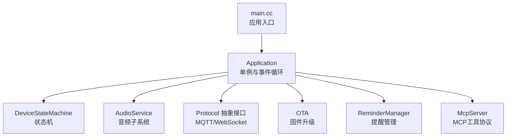
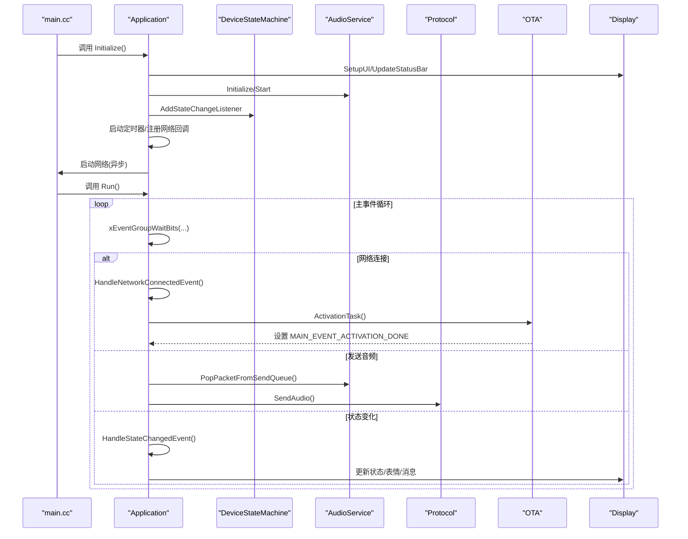
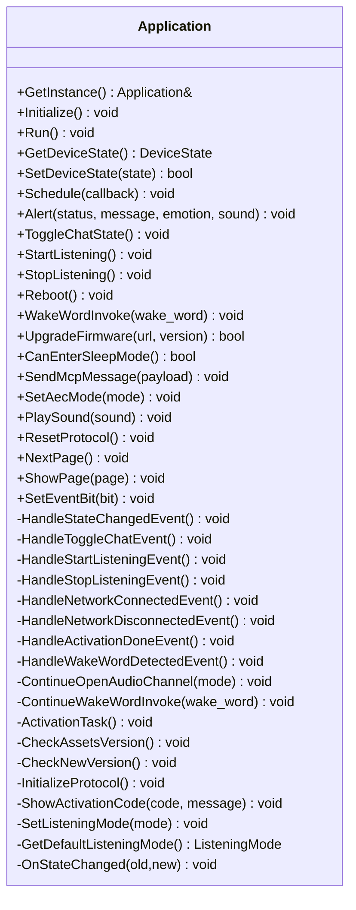
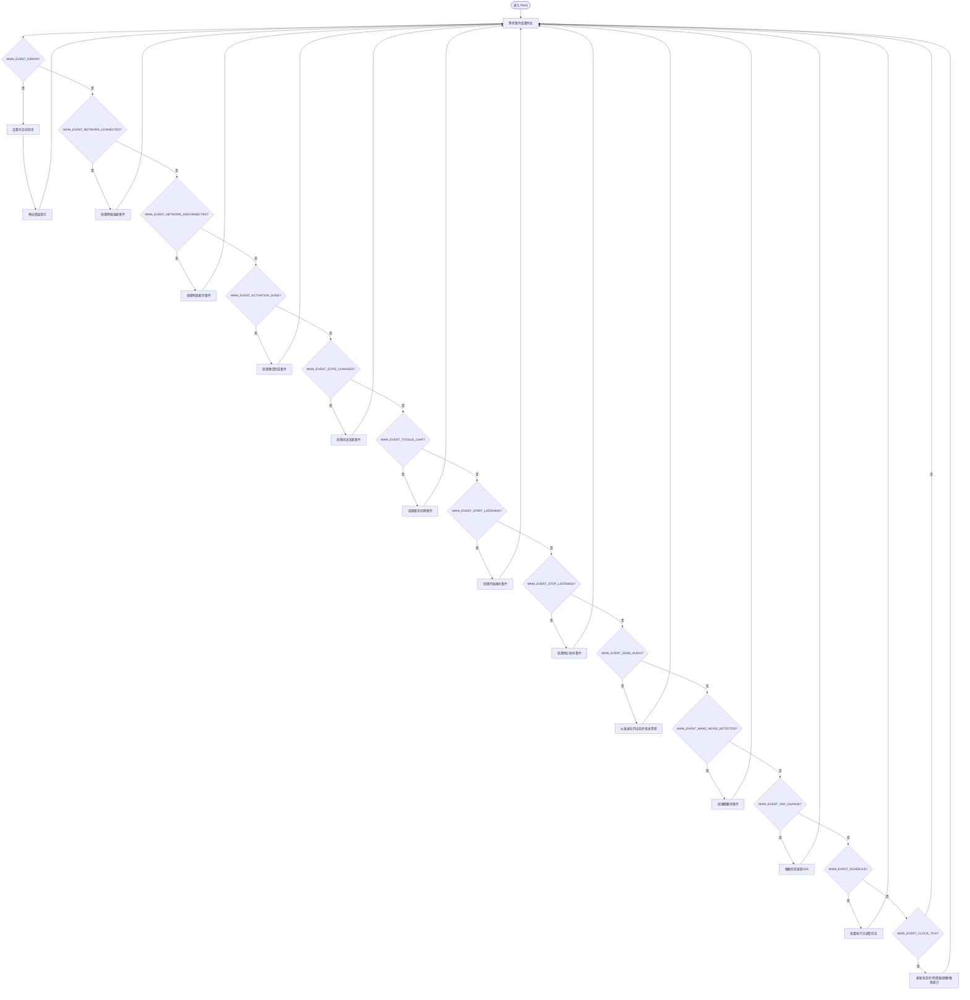
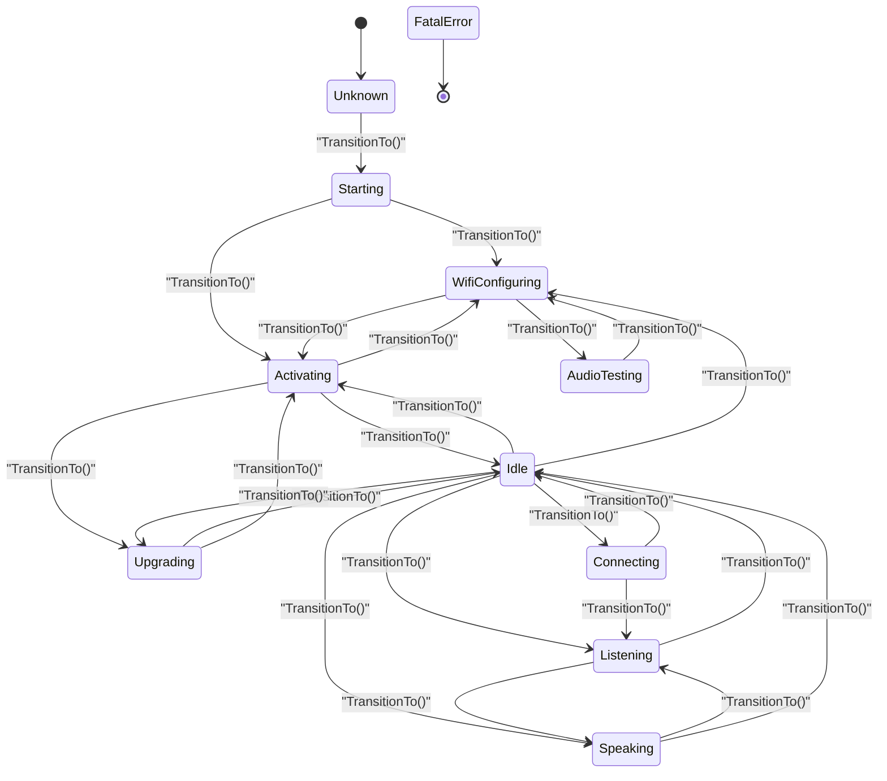
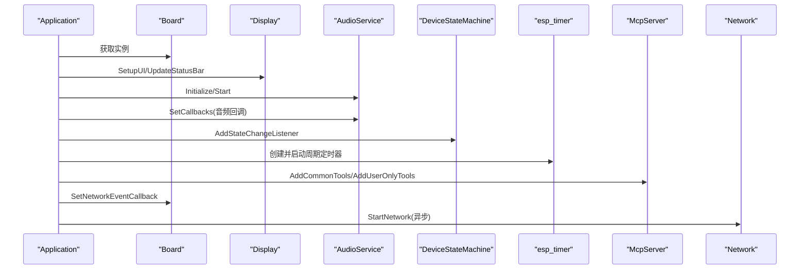
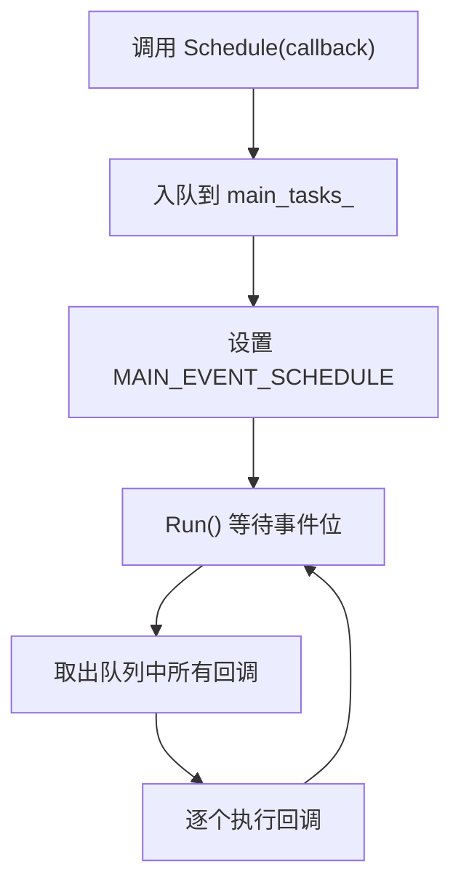
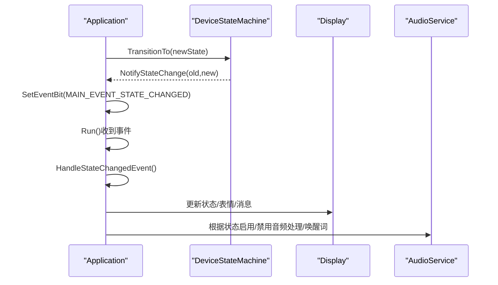
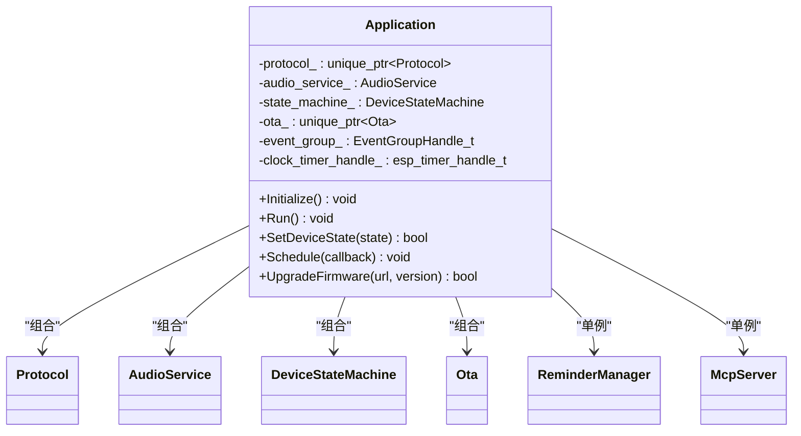

# 应用程序框架

<cite>
**本文档引用的文件**
- [main.cc](file://main/main.cc)
- [application.h](file://main/application.h)
- [application.cc](file://main/application.cc)
- [device_state_machine.h](file://main/device_state_machine.h)
- [device_state_machine.cc](file://main/device_state_machine.cc)
- [device_state.h](file://main/device_state.h)
- [audio_service.h](file://main/audio/audio_service.h)
- [protocol.h](file://main/protocols/protocol.h)
- [ota.h](file://main/ota.h)
- [reminder_manager.h](file://main/reminder_manager.h)
- [mcp_server.h](file://main/mcp_server.h)
</cite>

## 目录
1. [简介](#简介)
2. [项目结构](#项目结构)
3. [核心组件](#核心组件)
4. [架构总览](#架构总览)
5. [详细组件分析](#详细组件分析)
6. [依赖关系分析](#依赖关系分析)
7. [性能考虑](#性能考虑)
8. [故障排查指南](#故障排查指南)
9. [结论](#结论)
10. [附录](#附录)

## 简介
本文件面向ESP32-AI项目的应用程序框架，系统性阐述Application类的设计与实现，包括单例模式、事件驱动机制、状态管理模式；详解应用初始化流程、主事件循环原理、任务调度与线程安全；深入解析设备状态机的状态转换规则、事件处理流程与错误恢复机制；并提供生命周期管理最佳实践与性能优化建议。文末附带可直接定位到源码的路径示例，便于读者对照学习。

## 项目结构
应用程序入口位于main目录，核心逻辑集中在Application类及其子系统中：
- 入口与运行时：main.cc负责系统初始化与启动Application实例
- 应用框架：application.h/.cc定义Application类，封装事件、状态、协议、音频、OTA等子系统
- 设备状态机：device_state_machine.h/.cc提供严格的状态转换与观察者回调
- 子系统接口：audio_service.h（音频）、protocol.h（网络协议抽象）、ota.h（固件升级）、reminder_manager.h（提醒）、mcp_server.h（工具协议）

**图表来源**
- [main.cc:14-29](file://main/main.cc#L14-L29)
- [application.h:50-194](file://main/application.h#L50-L194)
- [device_state_machine.h:17-81](file://main/device_state_machine.h#L17-L81)
- [audio_service.h:106-194](file://main/audio/audio_service.h#L106-L194)
- [protocol.h:44-95](file://main/protocols/protocol.h#L44-L95)
- [ota.h:10-56](file://main/ota.h#L10-L56)
- [reminder_manager.h:22-56](file://main/reminder_manager.h#L22-L56)
- [mcp_server.h:314-342](file://main/mcp_server.h#L314-L342)

**章节来源**
- [main.cc:14-29](file://main/main.cc#L14-L29)
- [application.h:50-194](file://main/application.h#L50-L194)

## 核心组件
- 单例模式：Application通过静态GetInstance()提供全局唯一实例，删除拷贝构造与赋值，确保线程安全与单一职责
- 事件驱动：基于FreeRTOS事件组，集中管理MAIN_EVENT_*事件位，Run()在主任务中阻塞等待并分发处理
- 状态管理：DeviceStateMachine提供原子状态存储、严格转换规则与观察者回调，保证状态一致性
- 子系统集成：AudioService、Protocol抽象、OTA、ReminderManager、McpServer作为成员被统一调度

关键API与职责概览：
- 初始化与运行：Initialize()、Run()
- 状态控制：SetDeviceState()、GetDeviceState()
- 事件调度：Schedule()、SetEventBit()
- 音频控制：StartListening()/StopListening()/ToggleChatState()、AbortSpeaking()
- 固件升级：UpgradeFirmware()
- 页面管理：NextPage()/ShowPage()

**章节来源**
- [application.h:50-194](file://main/application.h#L50-L194)
- [application.cc:81-199](file://main/application.cc#L81-L199)
- [device_state_machine.h:17-81](file://main/device_state_machine.h#L17-L81)
- [device_state_machine.cc:108-131](file://main/device_state_machine.cc#L108-L131)

## 架构总览
Application作为顶层协调者，负责：
- 启动阶段：初始化显示、音频、网络回调、定时器、提醒管理，并异步启动网络
- 运行阶段：主事件循环按优先级处理事件，驱动状态机与各子系统协同工作
- 生命周期：支持重启、固件升级、协议重置、睡眠模式判定

**图表来源**
- [main.cc:26-28](file://main/main.cc#L26-L28)
- [application.cc:85-199](file://main/application.cc#L85-L199)
- [application.cc:201-299](file://main/application.cc#L201-L299)
- [application.cc:302-362](file://main/application.cc#L302-L362)
- [application.cc:364-382](file://main/application.cc#L364-L382)

## 详细组件分析

### Application类设计与单例模式
- 单例实现：静态局部变量保证首次访问创建，析构在进程结束时调用
- 线程安全：内部使用互斥锁保护任务队列；事件通过事件组跨任务安全投递
- 关键成员：事件组、定时器句柄、状态机、音频服务、协议对象、OTA对象、提醒管理器
- 事件位定义：涵盖调度、音频发送、唤醒词、VAD变化、错误、激活完成、时钟、网络、聊天切换、收听/停止收听、状态变更、提醒触发等

**图表来源**
- [application.h:50-194](file://main/application.h#L50-L194)

**章节来源**
- [application.h:50-194](file://main/application.h#L50-L194)
- [application.cc:34-79](file://main/application.cc#L34-L79)

### 事件驱动机制与主事件循环
- 事件模型：使用FreeRTOS事件组统一管理多源事件，避免竞态条件
- 主循环：Run()在主任务中阻塞等待事件位，按优先级处理，确保UI与状态更新及时响应
- 事件处理：针对不同事件位分别调用对应处理器，如网络连接/断开、状态变更、收听控制、音频发送、唤醒词检测、VAD变化、时钟tick等
- 调度机制：Schedule()将回调入队并在MAIN_EVENT_SCHEDULE事件中批量执行，保证所有UI与关键操作在主任务上下文执行

**图表来源**
- [application.cc:201-299](file://main/application.cc#L201-L299)

**章节来源**
- [application.cc:201-299](file://main/application.cc#L201-L299)

### 设备状态机与状态管理模式
- 状态枚举：包含未知、启动、WiFi配置、空闲、连接中、收听、说话、升级、激活、音频测试、致命错误等
- 转换规则：DeviceStateMachine::IsValidTransition()定义合法状态迁移，防止非法跳转
- 观察者回调：AddStateChangeListener()注册监听器，在TransitionTo()时通知所有监听者
- 线程安全：使用原子变量保存当前状态，互斥保护监听器列表与通知过程

**图表来源**
- [device_state.h:4-16](file://main/device_state.h#L4-L16)
- [device_state_machine.cc:34-102](file://main/device_state_machine.cc#L34-L102)

**章节来源**
- [device_state.h:4-16](file://main/device_state.h#L4-L16)
- [device_state_machine.h:17-81](file://main/device_state_machine.h#L17-L81)
- [device_state_machine.cc:108-131](file://main/device_state_machine.cc#L108-L131)

### 应用初始化流程
- 初始化顺序：获取Board实例、设置启动状态、初始化显示与音频、注册音频回调、添加状态变更监听、启动时钟定时器、注册MCP工具、设置网络事件回调、异步启动网络
- 网络事件：根据事件类型更新UI与状态，如扫描、连接中、已连接、断开、模组检测/错误等
- 提醒管理：初始化提醒管理器并设置触发回调，用于定时弹窗与声音提示

**图表来源**
- [application.cc:85-199](file://main/application.cc#L85-L199)

**章节来源**
- [application.cc:85-199](file://main/application.cc#L85-L199)

### 任务调度机制与线程安全
- 任务队列：Application内部维护互斥保护的任务队列，Schedule()将回调入队并通过事件位唤醒主循环
- 主循环执行：在MAIN_EVENT_SCHEDULE事件中取出队列中的所有回调并依次执行，确保所有UI与关键操作在主任务上下文执行
- 线程安全：事件组跨任务投递事件位；互斥锁保护共享数据；状态机使用原子变量与互斥保护监听器

**图表来源**
- [application.h:146-147](file://main/application.h#L146-L147)
- [application.cc:978-984](file://main/application.cc#L978-L984)
- [application.cc:275-282](file://main/application.cc#L275-L282)

**章节来源**
- [application.h:146-147](file://main/application.h#L146-L147)
- [application.cc:978-984](file://main/application.cc#L978-L984)
- [application.cc:275-282](file://main/application.cc#L275-L282)

### 设备状态机工作原理
- 状态转换：由DeviceStateMachine::TransitionTo()执行，先校验合法性，再更新状态并通知监听者
- 事件驱动：Application在Run()中监听MAIN_EVENT_STATE_CHANGED，调用HandleStateChangedEvent()根据新状态更新UI与音频/LED行为
- 错误恢复：当状态异常或出现致命错误时，状态机阻止非法转换，Application通过错误事件弹窗并尝试恢复

**图表来源**
- [device_state_machine.cc:108-131](file://main/device_state_machine.cc#L108-L131)
- [application.cc:240-242](file://main/application.cc#L240-L242)
- [application.cc:897-976](file://main/application.cc#L897-L976)

**章节来源**
- [device_state_machine.cc:108-131](file://main/device_state_machine.cc#L108-L131)
- [application.cc:897-976](file://main/application.cc#L897-L976)

### 应用程序生命周期管理最佳实践
- 资源分配：在Initialize()中一次性完成显示、音频、网络、定时器、提醒等初始化；避免在事件处理中重复分配
- 内存管理：使用智能指针管理协议与OTA对象；升级失败时及时重启音频服务并恢复低功耗策略
- 性能优化：利用事件组减少轮询；在自动收听模式下等待播放队列清空后再启用语音处理，避免音频截断；定期打印堆栈统计辅助诊断
- 错误恢复：网络错误通过错误事件弹窗提示并回退到空闲状态；升级失败后保留音频服务与低功耗策略，保证系统可用性

**章节来源**
- [application.cc:85-199](file://main/application.cc#L85-L199)
- [application.cc:1016-1066](file://main/application.cc#L1016-L1066)
- [application.cc:295-298](file://main/application.cc#L295-L298)

### 实际代码示例（路径指引）
以下为常用功能的调用路径示例，便于快速定位源码：
- 单例获取与运行
  - [main.cc:26-28](file://main/main.cc#L26-L28)
- 初始化与网络事件回调
  - [application.cc:85-199](file://main/application.cc#L85-L199)
- 主事件循环与事件处理
  - [application.cc:201-299](file://main/application.cc#L201-L299)
- 状态机转换与监听
  - [device_state_machine.cc:108-131](file://main/device_state_machine.cc#L108-L131)
  - [application.cc:114-117](file://main/application.cc#L114-L117)
- 唤醒词检测与收听控制
  - [application.cc:816-862](file://main/application.cc#L816-L862)
  - [application.cc:768-800](file://main/application.cc#L768-L800)
- 固件升级流程
  - [application.cc:1016-1066](file://main/application.cc#L1016-L1066)
- 页面管理与显示更新
  - [application.cc:1169-1213](file://main/application.cc#L1169-L1213)

**章节来源**
- [main.cc:26-28](file://main/main.cc#L26-L28)
- [application.cc:816-862](file://main/application.cc#L816-L862)
- [application.cc:768-800](file://main/application.cc#L768-L800)
- [application.cc:1016-1066](file://main/application.cc#L1016-L1066)
- [application.cc:1169-1213](file://main/application.cc#L1169-L1213)

## 依赖关系分析
Application类依赖关系如下：
- 继承与组合：继承自Protocol抽象（通过unique_ptr组合），组合AudioService、DeviceStateMachine、OTA、ReminderManager、McpServer
- 外部依赖：FreeRTOS事件组与定时器、cJSON、ESP-IDF音频编解码库、网络协议实现（MQTT/WebSocket）

**图表来源**
- [application.h:148-156](file://main/application.h#L148-L156)
- [protocol.h:44-95](file://main/protocols/protocol.h#L44-L95)
- [audio_service.h:106-194](file://main/audio/audio_service.h#L106-L194)
- [device_state_machine.h:17-81](file://main/device_state_machine.h#L17-L81)
- [ota.h:10-56](file://main/ota.h#L10-L56)
- [reminder_manager.h:22-56](file://main/reminder_manager.h#L22-L56)
- [mcp_server.h:314-342](file://main/mcp_server.h#L314-L342)

**章节来源**
- [application.h:148-156](file://main/application.h#L148-L156)

## 性能考虑
- 事件驱动：使用事件组替代轮询，降低CPU占用
- 队列化执行：通过Schedule()批量执行回调，避免频繁上下文切换
- 功耗控制：根据状态切换电源策略（低功耗/性能），升级与激活期间提升性能
- 音频处理：在自动收听模式下等待播放队列清空，避免音频截断；合理设置编码帧长与队列长度
- 定时清理：定期打印堆栈统计，监控内存使用趋势

[本节为通用指导，无需具体文件分析]

## 故障排查指南
- 网络错误：收到MAIN_EVENT_ERROR后，Application会弹出错误提示并回退到空闲状态；检查网络事件回调与协议连接状态
- 升级失败：升级失败后自动重启音频服务并保持低功耗；检查升级URL与服务器返回
- 唤醒词冲突：在说话或收听状态下检测到唤醒词会中止当前会话并清空发送队列；确认AEC模式与唤醒词配置
- 状态异常：若状态机拒绝转换，查看日志输出的无效转换信息；确保调用方遵循状态转换规则

**章节来源**
- [application.cc:223-226](file://main/application.cc#L223-L226)
- [application.cc:1050-1058](file://main/application.cc#L1050-L1058)
- [application.cc:844-846](file://main/application.cc#L844-L846)
- [device_state_machine.cc:117-121](file://main/device_state_machine.cc#L117-L121)

## 结论
Application类通过单例模式、事件驱动与状态机实现了清晰的控制流与高内聚的模块化设计。其主事件循环以事件组为核心，结合Schedule()队列化执行，既保证了UI与关键操作的线程安全，又提升了系统的响应性与稳定性。配合严格的设备状态转换规则与完善的错误恢复机制，该框架能够可靠地支撑AI语音交互场景下的复杂业务需求。

[本节为总结性内容，无需具体文件分析]

## 附录
- 快速参考
  - 获取单例：Application::GetInstance()
  - 初始化：Initialize()
  - 运行主循环：Run()
  - 设置状态：SetDeviceState()
  - 调度任务：Schedule()
  - 收听控制：StartListening()/StopListening()/ToggleChatState()
  - 固件升级：UpgradeFirmware()
  - 页面管理：NextPage()/ShowPage()

[本节为概览性内容，无需具体文件分析]