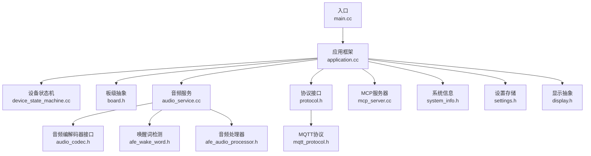
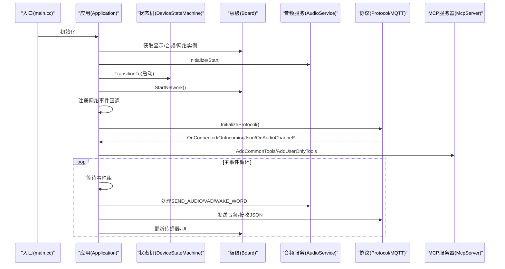
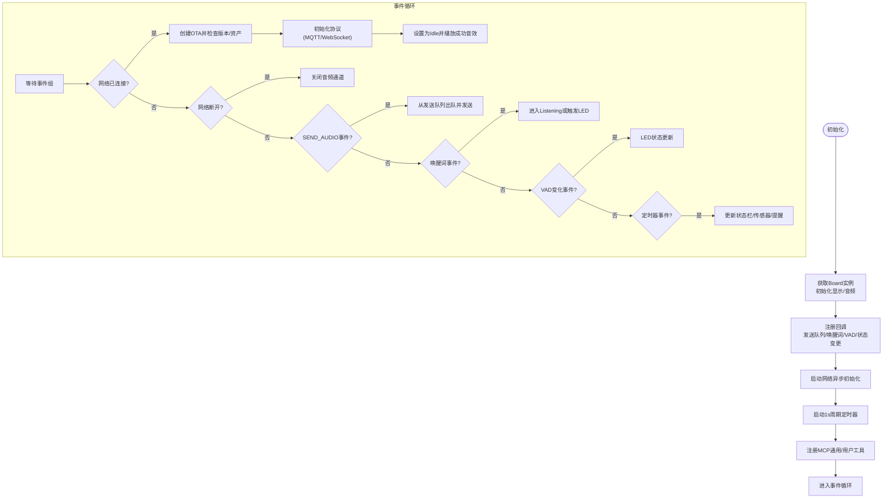
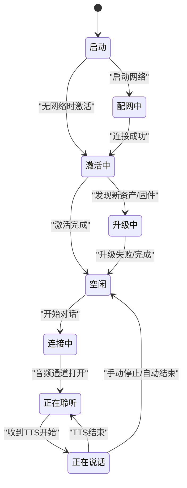
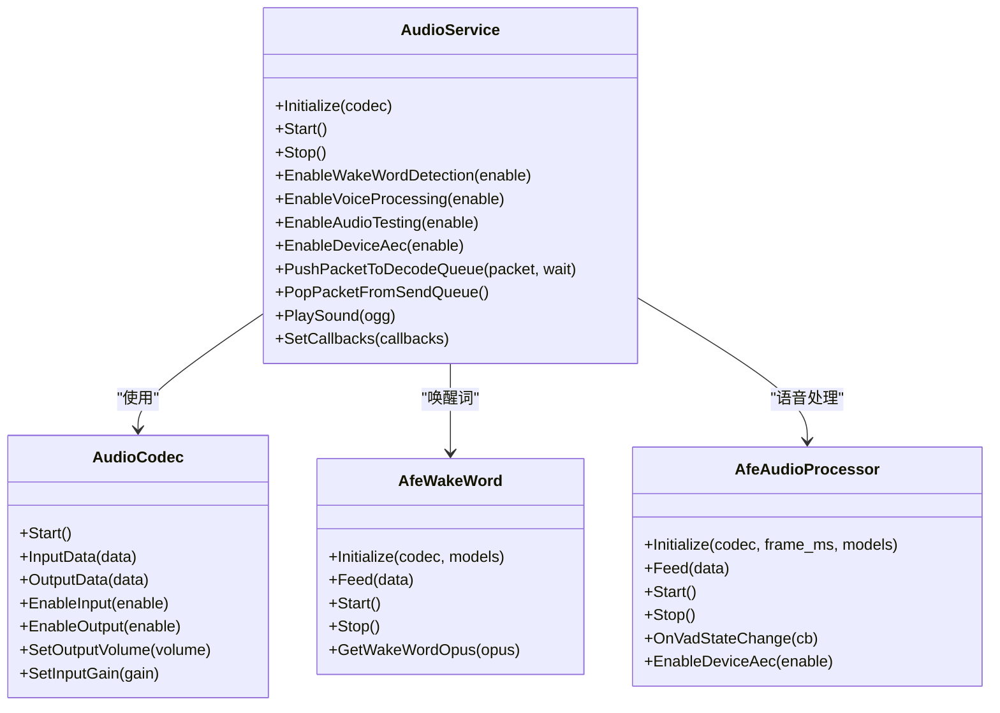
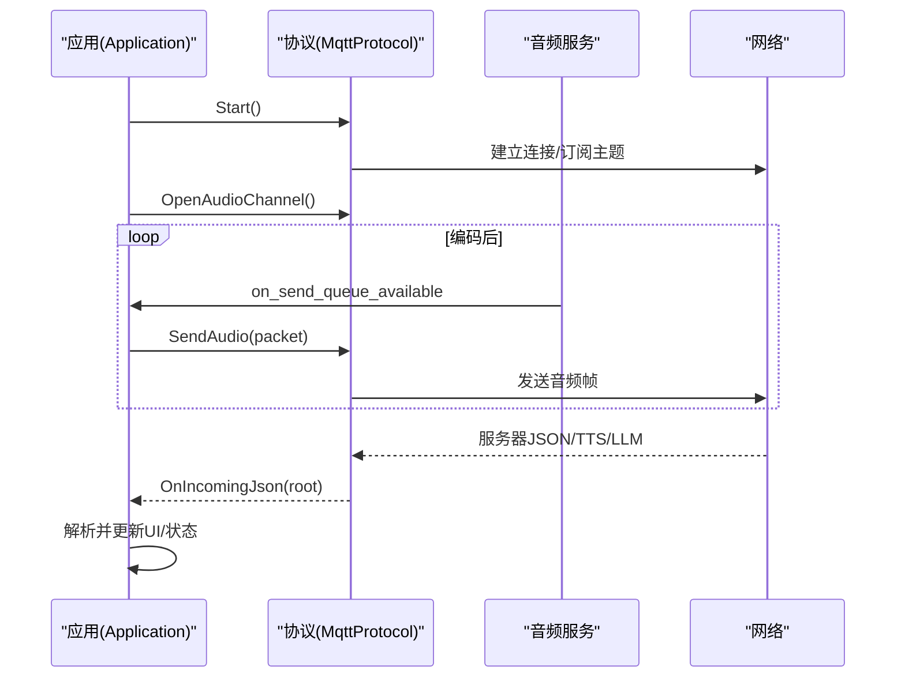
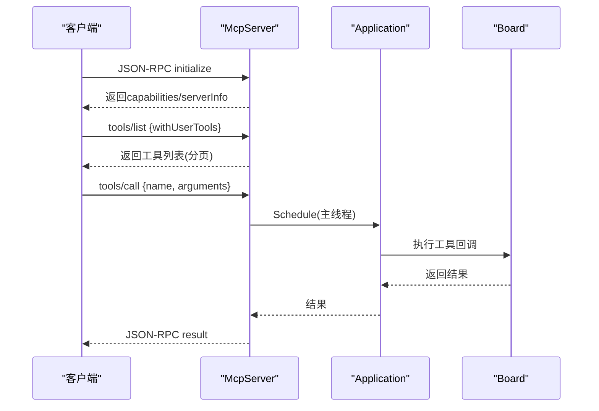
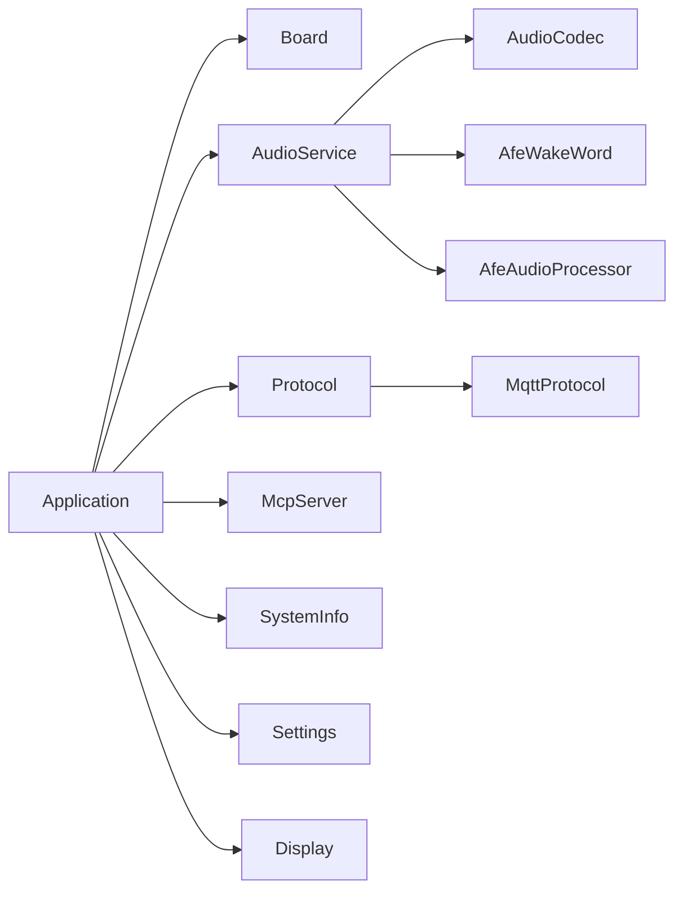

# 核心模块

<cite>
**本文引用的文件**
- [main.cc](file://main/main.cc)
- [application.cc](file://main/application.cc)
- [application.h](file://main/application.h)
- [device_state_machine.cc](file://main/device_state_machine.cc)
- [mcp_server.cc](file://main/mcp_server.cc)
- [mcp_server.h](file://main/mcp_server.h)
- [audio_service.cc](file://main/audio/audio_service.cc)
- [audio_codec.h](file://main/audio/audio_codec.h)
- [protocol.h](file://main/protocols/protocol.h)
- [mqtt_protocol.h](file://main/protocols/mqtt_protocol.h)
- [board.h](file://main/boards/common/board.h)
- [settings.h](file://main/settings.h)
- [system_info.h](file://main/system_info.h)
- [afe_wake_word.h](file://main/audio/wake_words/afe_wake_word.h)
- [afe_audio_processor.h](file://main/audio/processors/afe_audio_processor.h)
- [ota.h](file://main/ota.h)
- [display.h](file://main/display/display.h)
</cite>

## 目录
1. [引言](#引言)
2. [项目结构](#项目结构)
3. [核心组件](#核心组件)
4. [架构总览](#架构总览)
5. [详细组件分析](#详细组件分析)
6. [依赖分析](#依赖分析)
7. [性能考虑](#性能考虑)
8. [故障排查指南](#故障排查指南)
9. [结论](#结论)
10. [附录](#附录)

## 引言
本文件面向ESP32-AI项目的开发者与维护者，系统化梳理应用框架、音频处理系统、MCP协议服务器、通信协议栈等核心模块的设计与实现，重点阐述模块间协作关系、数据流与控制流、初始化顺序、生命周期管理与错误处理机制，并给出扩展与定制指导、关键算法原理说明以及性能优化与调试建议。

## 项目结构
项目采用“按功能域分层”的组织方式：
- 应用入口与主循环：main/main.cc 启动 NVS 初始化后进入 Application 主事件循环。
- 应用层：main/application.cc 负责设备状态机、网络事件、协议初始化、UI更新与定时任务调度。
- 板级抽象：main/boards/common/board.h 定义板级能力接口，屏蔽硬件差异。
- 音频子系统：main/audio 下包含编解码器、处理器、唤醒词检测、服务调度与队列。
- 通信协议：main/protocols 提供统一协议接口与MQTT/WebSocket实现。
- MCP协议服务器：main/mcp_server.cc 实现JSON-RPC 2.0 MCP服务，暴露设备能力工具集。
- 其他支撑：OTA、设置、系统信息、显示抽象等。

**图表来源**
- [main.cc:14-29](file://main/main.cc#L14-L29)
- [application.cc:85-199](file://main/application.cc#L85-L199)
- [board.h:49-86](file://main/boards/common/board.h#L49-L86)
- [audio_service.cc:63-124](file://main/audio/audio_service.cc#L63-L124)
- [protocol.h:44-95](file://main/protocols/protocol.h#L44-L95)
- [mqtt_protocol.h:26-62](file://main/protocols/mqtt_protocol.h#L26-L62)
- [mcp_server.cc:35-132](file://main/mcp_server.cc#L35-L132)
- [system_info.h:9-21](file://main/system_info.h#L9-L21)
- [settings.h:7-26](file://main/settings.h#L7-L26)
- [display.h:28-63](file://main/display/display.h#L28-L63)
- [audio_codec.h:17-59](file://main/audio/audio_codec.h#L17-L59)
- [afe_wake_word.h:22-60](file://main/audio/wake_words/afe_wake_word.h#L22-L60)
- [afe_audio_processor.h:17-46](file://main/audio/processors/afe_audio_processor.h#L17-L46)

**章节来源**
- [main.cc:14-29](file://main/main.cc#L14-L29)
- [application.cc:85-199](file://main/application.cc#L85-L199)

## 核心组件
- 应用框架（Application）：负责全局初始化、事件驱动主循环、状态机驱动、协议选择与启动、网络事件回调、UI与提醒管理、定时任务与调试输出。
- 设备状态机（DeviceStateMachine）：定义合法状态与转换规则，提供监听器回调，确保状态变更可追踪。
- 音频服务（AudioService）：封装OPUS编解码、I2S编解码器、输入/输出/编码/解码队列、唤醒词与语音处理、音频功耗管理。
- 协议接口与实现（Protocol/MqttProtocol/WebSocketProtocol）：统一音频/文本消息通道、会话管理、错误处理与超时检测。
- MCP协议服务器（McpServer）：基于JSON-RPC 2.0实现工具注册与调用，支持用户工具与系统工具，具备负载均衡与安全提示。
- 板级抽象（Board）：统一音频、显示、网络、传感器、电源策略等接口，便于多板适配。
- 设置与系统信息（Settings/SystemInfo）：持久化配置与运行时统计信息打印。
- 显示抽象（Display）：统一状态栏、通知、表情、聊天消息与主题管理。

**章节来源**
- [application.cc:81-382](file://main/application.cc#L81-L382)
- [device_state_machine.cc:108-131](file://main/device_state_machine.cc#L108-L131)
- [audio_service.cc:63-124](file://main/audio/audio_service.cc#L63-L124)
- [protocol.h:44-95](file://main/protocols/protocol.h#L44-L95)
- [mqtt_protocol.h:26-62](file://main/protocols/mqtt_protocol.h#L26-L62)
- [mcp_server.cc:35-132](file://main/mcp_server.cc#L35-L132)
- [board.h:49-86](file://main/boards/common/board.h#L49-L86)
- [settings.h:7-26](file://main/settings.h#L7-L26)
- [system_info.h:9-21](file://main/system_info.h#L9-L21)
- [display.h:28-63](file://main/display/display.h#L28-L63)

## 架构总览
应用以“事件驱动 + 状态机”为核心，Application通过事件组协调多个异步子系统；Board抽象硬件差异；AudioService在独立任务中完成编解码与队列调度；Protocol实现网络层抽象；McpServer提供本地工具调用能力。

**图表来源**
- [main.cc:14-29](file://main/main.cc#L14-L29)
- [application.cc:85-199](file://main/application.cc#L85-L199)
- [application.cc:518-655](file://main/application.cc#L518-L655)
- [mcp_server.cc:35-132](file://main/mcp_server.cc#L35-L132)

## 详细组件分析

### 应用框架（Application）
- 初始化流程
  - 获取Board单例，初始化显示与音频服务，注册回调（发送队列可用、唤醒词检测、VAD变化、状态变更）。
  - 注册网络事件回调，根据事件类型更新UI与状态位。
  - 启动网络异步初始化，启动周期性时钟定时器，初始化提醒管理器。
- 运行循环
  - 使用事件组聚合多种事件源（网络连接/断开、发送音频、唤醒词、VAD、定时器、错误、状态变更、聊天切换、手动听写/停止）。
  - 分支处理各类事件，驱动状态机与协议交互，调度UI更新与声音反馈。
- 激活流程（ActivationTask）
  - 创建OTA对象，启用唤醒词检测，检查资产版本与固件版本，初始化协议，完成后通知主循环。
- 协议初始化
  - 基于OTA配置选择MQTT或WebSocket，注册回调（连接、网络错误、音频通道打开/关闭、JSON消息解析），启动协议。
- 错误处理
  - 网络错误通过事件上报，弹出告警；版本检查失败进行指数回退重试；激活失败提示并回到激活态。

**图表来源**
- [application.cc:85-199](file://main/application.cc#L85-L199)
- [application.cc:201-299](file://main/application.cc#L201-L299)
- [application.cc:364-382](file://main/application.cc#L364-L382)
- [application.cc:518-655](file://main/application.cc#L518-L655)

**章节来源**
- [application.cc:85-199](file://main/application.cc#L85-L199)
- [application.cc:201-299](file://main/application.cc#L201-L299)
- [application.cc:364-382](file://main/application.cc#L364-L382)
- [application.cc:518-655](file://main/application.cc#L518-L655)

### 设备状态机（DeviceStateMachine）
- 状态定义与名称映射，提供合法性校验与转换。
- 支持添加/移除状态变更监听器，广播新旧状态。
- 保证状态转换有序且可审计，避免非法跳转。

**图表来源**
- [device_state_machine.cc:40-102](file://main/device_state_machine.cc#L40-L102)
- [device_state_machine.cc:108-131](file://main/device_state_machine.cc#L108-L131)

**章节来源**
- [device_state_machine.cc:108-131](file://main/device_state_machine.cc#L108-L131)

### 音频服务（AudioService）
- 组件职责
  - OPUS编码/解码、I2S编解码器、输入/输出/编码/解码队列、唤醒词与语音处理、音频功耗管理。
  - 通过回调向应用层报告VAD变化、发送队列可用、唤醒词检测结果。
- 关键算法与实现要点
  - 编解码参数与帧长：编码固定采样率与帧时长；解码按服务器实际采样率动态重建。
  - 重采样：输入侧将板卡采样率转换至编码采样率；输出侧将解码采样率转换至板卡采样率。
  - 唤醒词检测：AFE模型接口，支持自定义唤醒词模型；编码唤醒词PCM为OPUS帧。
  - 语音处理：AFE语音增强/降噪/VAD，输出PCM经编码入发送队列。
  - 功耗管理：定时器检测输入/输出空闲时间，自动关闭编解码器以节能。
- 数据流
  - 输入：I2S读取PCM → 可选输入重采样 → 唤醒词/语音处理 → 编码 → 发送队列。
  - 输出：接收音频包 → 解码 → 输出重采样 → I2S播放。

**图表来源**
- [audio_service.cc:63-124](file://main/audio/audio_service.cc#L63-L124)
- [audio_codec.h:17-59](file://main/audio/audio_codec.h#L17-L59)
- [afe_wake_word.h:22-60](file://main/audio/wake_words/afe_wake_word.h#L22-L60)
- [afe_audio_processor.h:17-46](file://main/audio/processors/afe_audio_processor.h#L17-L46)

**章节来源**
- [audio_service.cc:63-124](file://main/audio/audio_service.cc#L63-L124)
- [audio_service.cc:231-448](file://main/audio/audio_service.cc#L231-L448)
- [audio_service.cc:551-629](file://main/audio/audio_service.cc#L551-L629)
- [audio_service.cc:684-700](file://main/audio/audio_service.cc#L684-L700)
- [afe_wake_word.h:22-60](file://main/audio/wake_words/afe_wake_word.h#L22-L60)
- [afe_audio_processor.h:17-46](file://main/audio/processors/afe_audio_processor.h#L17-L46)

### 协议接口与实现（Protocol/MqttProtocol）
- 接口设计
  - 统一音频/文本消息通道、会话管理、错误处理与超时检测；支持打开/关闭音频通道、发送音频、发送MCP消息等。
- MQTT实现要点
  - 保活心跳、重连定时器、AES上下文与随机数、UDP旁路用于媒体传输。
  - 服务器握手消息解析、序列号管理、事件位驱动。
- 控制流
  - 应用层在收到网络连接事件后创建协议实例，注册回调；音频服务在发送队列有数据时调用SendAudio；协议层负责序列化与传输。

**图表来源**
- [protocol.h:44-95](file://main/protocols/protocol.h#L44-L95)
- [mqtt_protocol.h:26-62](file://main/protocols/mqtt_protocol.h#L26-L62)
- [application.cc:518-655](file://main/application.cc#L518-L655)

**章节来源**
- [protocol.h:44-95](file://main/protocols/protocol.h#L44-L95)
- [mqtt_protocol.h:26-62](file://main/protocols/mqtt_protocol.h#L26-L62)
- [application.cc:518-655](file://main/application.cc#L518-L655)

### MCP协议服务器（McpServer）
- 工具注册
  - 通用工具优先放置以利用提示缓存；用户工具仅对授权用户开放。
  - 包含设备状态查询、音量/亮度调节、屏幕主题切换、拍照与解释、系统信息、重启、固件升级、屏幕截图与预览、资产下载URL设置等。
- 请求处理
  - JSON-RPC 2.0解析，支持initialize/tools/list/tools/call；对未实现方法返回错误；工具调用在主线程执行以保证线程安全。
- 能力声明
  - 支持视觉能力（相机URL与Token），用于远程视觉推理。

**图表来源**
- [mcp_server.cc:330-442](file://main/mcp_server.cc#L330-L442)
- [mcp_server.cc:461-515](file://main/mcp_server.cc#L461-L515)
- [mcp_server.cc:517-569](file://main/mcp_server.cc#L517-L569)

**章节来源**
- [mcp_server.cc:35-132](file://main/mcp_server.cc#L35-L132)
- [mcp_server.cc:330-442](file://main/mcp_server.cc#L330-L442)
- [mcp_server.cc:461-515](file://main/mcp_server.cc#L461-L515)
- [mcp_server.cc:517-569](file://main/mcp_server.cc#L517-L569)

### 板级抽象（Board）
- 统一接口
  - 音频编解码器、显示、网络、LED、背光、相机、温度/电量、UUID生成、电源策略、系统信息与设备状态JSON。
- 事件回调
  - 网络事件统一回调，便于UI与业务逻辑联动。

**章节来源**
- [board.h:49-86](file://main/boards/common/board.h#L49-L86)

### 设置与系统信息（Settings/SystemInfo）
- Settings：命名空间化的NVS访问，支持字符串/整型/布尔读写与擦除。
- SystemInfo：提供内存、CPU使用、任务列表、PM锁等运行时信息打印。

**章节来源**
- [settings.h:7-26](file://main/settings.h#L7-L26)
- [system_info.h:9-21](file://main/system_info.h#L9-L21)

### 显示抽象（Display）
- 提供状态栏、通知、表情、聊天消息、主题切换与锁机制，支持LVGL与无显模式。

**章节来源**
- [display.h:28-63](file://main/display/display.h#L28-L63)

## 依赖分析
- 组件耦合
  - Application强依赖Board、AudioService、Protocol、McpServer、SystemInfo、Settings；弱依赖Display。
  - AudioService依赖AudioCodec、WakeWord/AudioProcessor、队列与定时器。
  - Protocol抽象了MQTT/WebSocket实现，Application仅依赖接口。
  - McpServer依赖Board能力与Application调度。
- 外部依赖
  - FreeRTOS事件组/定时器/任务；ESP-IDF音频库（OPUS、AFE、I2S）；cJSON；NVS；HTTP/UDP。

**图表来源**
- [application.cc:85-199](file://main/application.cc#L85-L199)
- [audio_service.cc:63-124](file://main/audio/audio_service.cc#L63-L124)
- [protocol.h:44-95](file://main/protocols/protocol.h#L44-L95)
- [mqtt_protocol.h:26-62](file://main/protocols/mqtt_protocol.h#L26-L62)
- [mcp_server.cc:35-132](file://main/mcp_server.cc#L35-L132)
- [board.h:49-86](file://main/boards/common/board.h#L49-L86)

**章节来源**
- [application.cc:85-199](file://main/application.cc#L85-L199)
- [audio_service.cc:63-124](file://main/audio/audio_service.cc#L63-L124)
- [protocol.h:44-95](file://main/protocols/protocol.h#L44-L95)
- [mqtt_protocol.h:26-62](file://main/protocols/mqtt_protocol.h#L26-L62)
- [mcp_server.cc:35-132](file://main/mcp_server.cc#L35-L132)
- [board.h:49-86](file://main/boards/common/board.h#L49-L86)

## 性能考虑
- 音频功耗管理
  - 定时器检测输入/输出空闲，自动关闭编解码器；在音频通道打开/关闭时调整电源保存等级。
- 编解码与队列
  - 编码帧时长与缓冲区大小需与协议/网络带宽匹配；解码采样率动态重建避免失真。
- 线程与调度
  - 音频输入/输出/编解码分离任务，避免阻塞；工具调用在主线程执行，防止竞态。
- 内存与存储
  - NVS命名空间化访问；SPIFFS资产分区按需下载与应用；定期打印堆内存统计辅助优化。
- 网络与协议
  - MQTT保活与指数回退重连；音频通道打开时提高电源等级，关闭时降低。

**章节来源**
- [audio_service.cc:684-700](file://main/audio/audio_service.cc#L684-L700)
- [application.cc:549-564](file://main/application.cc#L549-L564)
- [mcp_server.cc:560-568](file://main/mcp_server.cc#L560-L568)
- [system_info.h:19](file://main/system_info.h#L19)

## 故障排查指南
- 版本检查失败
  - 观察重试次数与延迟；确认网络可达与URL正确；必要时手动重试。
- 激活失败
  - 查看激活消息与代码；确认服务器端状态；必要时清除激活挑战重新激活。
- 音频无声/破音
  - 检查编解码器采样率与重采样配置；确认I2S通道与增益设置；查看功耗定时器是否提前关闭输出。
- 网络异常
  - 监控网络事件回调与错误事件；确认MQTT连接与保活；检查UDP旁路与AES上下文。
- UI不更新
  - 确认事件组触发与Schedule调用；检查Display锁与主题切换。

**章节来源**
- [application.cc:442-516](file://main/application.cc#L442-L516)
- [application.cc:534-541](file://main/application.cc#L534-L541)
- [audio_service.cc:684-700](file://main/audio/audio_service.cc#L684-L700)
- [mcp_server.cc:560-568](file://main/mcp_server.cc#L560-L568)

## 结论
本项目通过清晰的模块边界与事件驱动架构，实现了从硬件抽象到音频处理、从协议栈到本地工具调用的完整链路。状态机确保行为可预期，音频服务与协议抽象兼顾性能与可移植性，MCP服务器提供了强大的本地扩展能力。遵循本文的初始化顺序、生命周期管理与错误处理建议，可有效提升系统的稳定性与可维护性。

## 附录
- 扩展与定制指导
  - 新板适配：实现Board虚接口，提供音频/显示/网络/传感器实现。
  - 新协议：继承Protocol接口，实现Start/OpenAudioChannel/SendAudio等。
  - 新工具：在McpServer中注册工具，注意参数校验与线程安全。
  - 新唤醒词/语音处理：替换或扩展WakeWord/AudioProcessor实现。
- 关键算法说明
  - 语音唤醒：基于AFE模型的在线检测与OPUS编码。
  - 音频编解码：OPUS编码/解码，按帧与时序处理。
  - 网络通信：MQTT保活与重连、UDP旁路媒体传输、AES加密上下文。
- 调试技巧
  - 使用SystemInfo打印堆内存与任务列表；开启音频调试器捕获原始数据；观察事件组位与状态机日志。