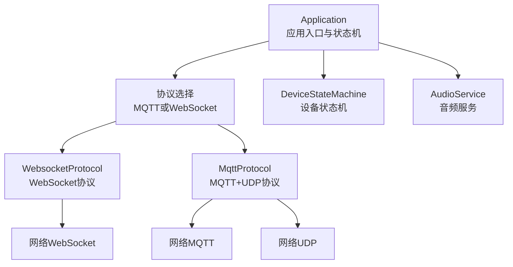
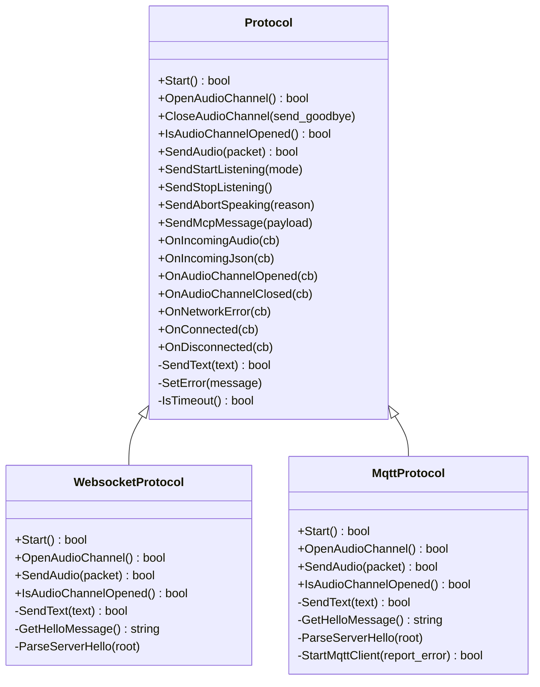
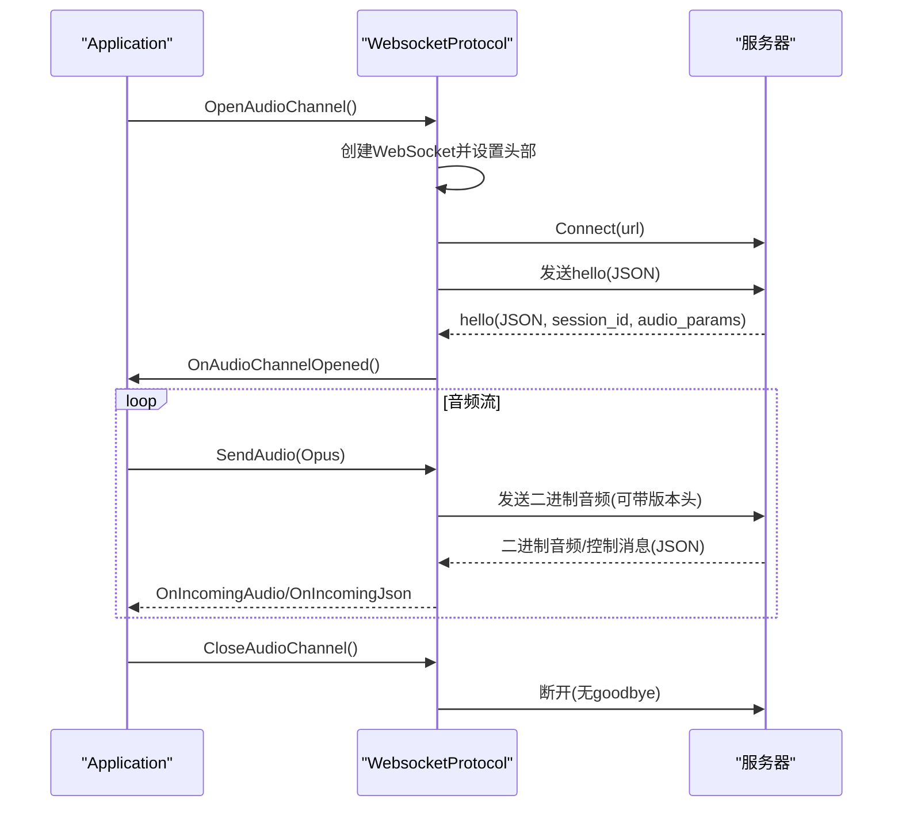
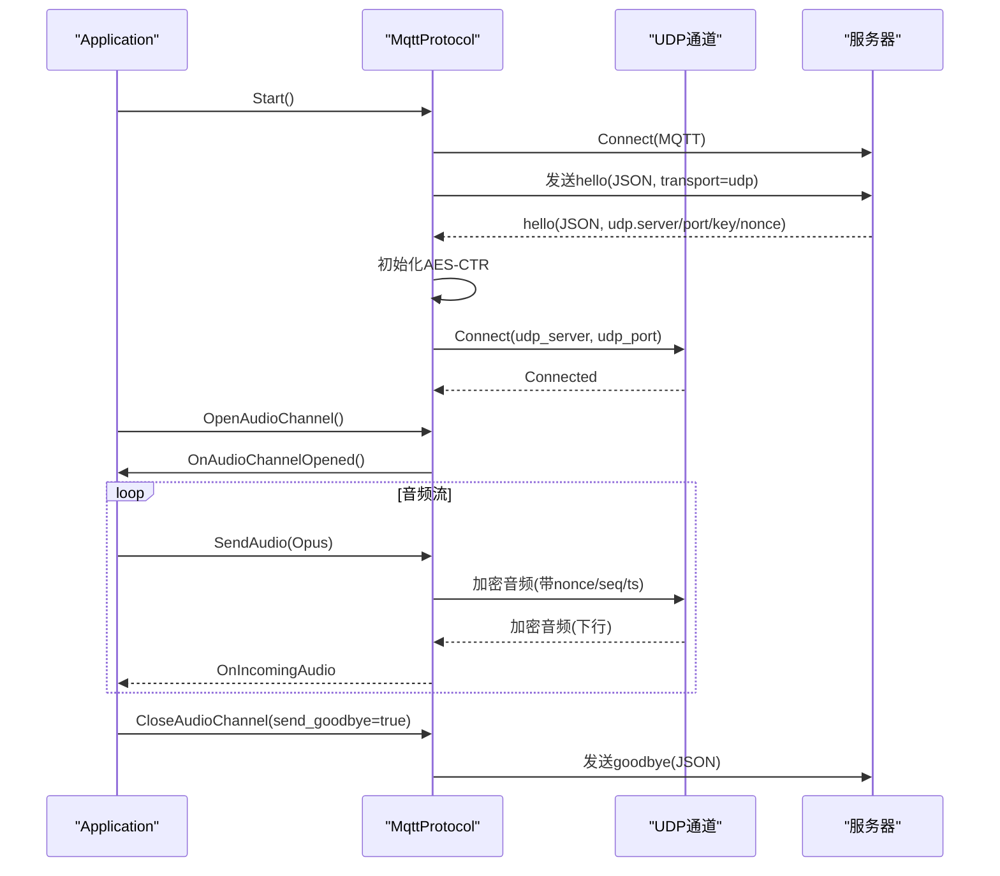
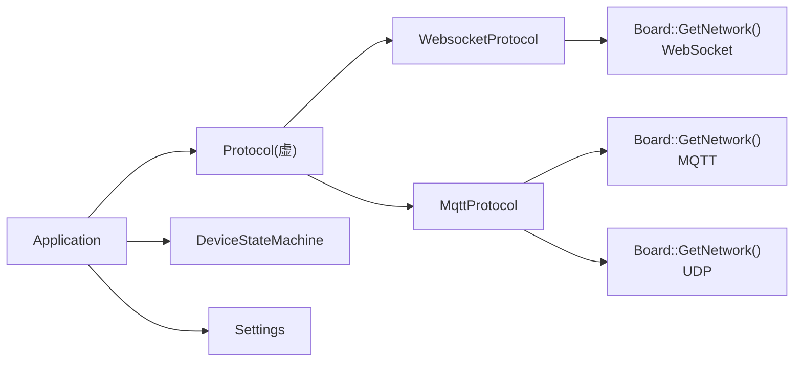

# 通信协议

<cite>
**本文引用的文件**
- [protocol.h](file://main/protocols/protocol.h)
- [protocol.cc](file://main/protocols/protocol.cc)
- [websocket_protocol.h](file://main/protocols/websocket_protocol.h)
- [websocket_protocol.cc](file://main/protocols/websocket_protocol.cc)
- [mqtt_protocol.h](file://main/protocols/mqtt_protocol.h)
- [mqtt_protocol.cc](file://main/protocols/mqtt_protocol.cc)
- [mqtt-udp.md](file://docs/mqtt-udp.md)
- [websocket.md](file://docs/websocket.md)
- [mcp-protocol.md](file://docs/mcp-protocol.md)
- [settings.h](file://main/settings.h)
- [application.h](file://main/application.h)
- [application.cc](file://main/application.cc)
- [device_state_machine.h](file://main/device_state_machine.h)
- [device_state_machine.cc](file://main/device_state_machine.cc)
</cite>

## 目录
1. [简介](#简介)
2. [项目结构](#项目结构)
3. [核心组件](#核心组件)
4. [架构总览](#架构总览)
5. [详细组件分析](#详细组件分析)
6. [依赖关系分析](#依赖关系分析)
7. [性能考量](#性能考量)
8. [故障排查指南](#故障排查指南)
9. [结论](#结论)
10. [附录](#附录)

## 简介
本文件面向ESP32-AI项目的通信协议系统，系统性阐述Protocol抽象基类的设计理念与实现模式，解析WebSocket与MQTT+UDP两种通信协议的实现原理、消息格式与连接管理，说明协议选择策略、自动切换机制与故障恢复流程，并提供网络配置指南、通信安全与性能优化最佳实践，以及协议调试与网络问题排查方法。

## 项目结构
通信协议子系统位于main/protocols目录，核心由Protocol抽象基类与两个具体协议实现组成：
- Protocol：统一抽象，定义音频通道、消息回调、控制命令等接口
- WebsocketProtocol：基于WebSocket的单通道协议，支持二进制Opus音频与JSON控制消息
- MqttProtocol：基于MQTT+UDP的混合协议，MQTT负责控制与会话协商，UDP负责加密音频传输

应用层通过Application在运行时按OTA配置选择具体协议实现，并在设备状态机驱动下进行连接、会话与断开。

图表来源
- [application.cc:518-655](file://main/application.cc#L518-L655)
- [websocket_protocol.cc:83-201](file://main/protocols/websocket_protocol.cc#L83-L201)
- [mqtt_protocol.cc:215-295](file://main/protocols/mqtt_protocol.cc#L215-L295)

章节来源
- [application.cc:518-655](file://main/application.cc#L518-L655)
- [device_state_machine.h:17-81](file://main/device_state_machine.h#L17-L81)
- [device_state_machine.cc:108-131](file://main/device_state_machine.cc#L108-L131)

## 核心组件
- Protocol抽象基类
  - 定义统一接口：Start、OpenAudioChannel、CloseAudioChannel、SendAudio、SendStartListening、SendStopListening、SendAbortSpeaking、SendMcpMessage等
  - 统一回调注册：OnIncomingAudio、OnIncomingJson、OnAudioChannelOpened、OnAudioChannelClosed、OnNetworkError、OnConnected、OnDisconnected
  - 通用控制命令：通过SendText派生类实现，协议无关地封装JSON消息
  - 超时检测：IsTimeout基于last_incoming_time_与固定阈值判定通道可用性

- WebSocket协议
  - 二进制Opus音频帧，支持版本1/2/3二进制协议头
  - 握手与会话：发送hello，等待服务器hello，建立音频通道
  - 认证头：Authorization、Protocol-Version、Device-Id、Client-Id
  - 通道状态：IsAudioChannelOpened综合连接、错误与超时

- MQTT+UDP协议
  - 控制通道：MQTT传输JSON控制消息与会话协商
  - 音频通道：UDP传输加密Opus音频，AES-CTR加密，序列号与时间戳保护
  - 自动重连：MQTT断线定时器重连，UDP通道依赖MQTT重新协商
  - 会话管理：goodbye避免ping-pong，超时检测保障通道健康

章节来源
- [protocol.h:44-95](file://main/protocols/protocol.h#L44-L95)
- [protocol.cc:7-91](file://main/protocols/protocol.cc#L7-L91)
- [websocket_protocol.h:13-32](file://main/protocols/websocket_protocol.h#L13-L32)
- [websocket_protocol.cc:23-201](file://main/protocols/websocket_protocol.cc#L23-L201)
- [mqtt_protocol.h:26-62](file://main/protocols/mqtt_protocol.h#L26-L62)
- [mqtt_protocol.cc:55-295](file://main/protocols/mqtt_protocol.cc#L55-L295)

## 架构总览
协议层采用“抽象基类 + 多实现”的工厂模式：Application依据OTA配置动态选择协议实例，随后通过统一接口与服务器交互。WebSocket适合简单部署与TLS加密，MQTT+UDP适合高实时性与强加密场景。

图表来源
- [protocol.h:44-95](file://main/protocols/protocol.h#L44-L95)
- [websocket_protocol.h:13-32](file://main/protocols/websocket_protocol.h#L13-L32)
- [mqtt_protocol.h:26-62](file://main/protocols/mqtt_protocol.h#L26-L62)

## 详细组件分析

### Protocol抽象基类
- 设计要点
  - 将“音频通道”与“控制消息”解耦，统一回调接口便于上层状态机与UI联动
  - 通过SendText派生类实现，减少重复JSON构造逻辑
  - 统一错误上报与超时检测，提升协议一致性
- 关键行为
  - 会话ID管理：session_id_贯穿控制消息
  - 服务器参数：server_sample_rate_、server_frame_duration_由服务器hello下发
  - 超时阈值：默认120秒，避免僵尸通道占用资源

章节来源
- [protocol.h:44-95](file://main/protocols/protocol.h#L44-L95)
- [protocol.cc:35-91](file://main/protocols/protocol.cc#L35-L91)

### WebSocket协议实现
- 连接与握手
  - 按需连接：OpenAudioChannel时才创建WebSocket
  - 头部注入：Authorization、Protocol-Version、Device-Id、Client-Id
  - hello消息：features、audio_params、transport等字段
- 音频与消息
  - 二进制Opus音频：支持版本1/2/3二进制头
  - 文本JSON：type字段驱动业务（listen/stt/tts/mcp/system/custom等）
- 通道状态
  - IsAudioChannelOpened综合连接、错误与超时
  - 断开回调触发音频通道关闭

图表来源
- [websocket_protocol.cc:83-201](file://main/protocols/websocket_protocol.cc#L83-L201)
- [websocket.md:7-80](file://docs/websocket.md#L7-L80)

章节来源
- [websocket_protocol.h:13-32](file://main/protocols/websocket_protocol.h#L13-L32)
- [websocket_protocol.cc:23-201](file://main/protocols/websocket_protocol.cc#L23-L201)
- [websocket.md:7-80](file://docs/websocket.md#L7-L80)

### MQTT+UDP协议实现
- 控制与数据分离
  - MQTT：控制消息、会话协商、状态同步
  - UDP：加密音频数据，AES-CTR，序列号与时间戳保护
- hello与会话
  - 设备发送hello，服务器返回udp连接信息与密钥nonce
  - 初始化AES上下文，建立UDP连接
- 音频加密与序列号
  - 发送端：nonce含payload_len、timestamp、local_sequence_
  - 接收端：remote_sequence_校验连续性，拒绝旧包
- 自动重连与故障恢复
  - MQTT断线定时器重连，避免阻塞主线程
  - 服务器goodbye不回发，避免ping-pong

图表来源
- [mqtt_protocol.cc:215-295](file://main/protocols/mqtt_protocol.cc#L215-L295)
- [mqtt-udp.md:22-57](file://docs/mqtt-udp.md#L22-L57)

章节来源
- [mqtt_protocol.h:26-62](file://main/protocols/mqtt_protocol.h#L26-L62)
- [mqtt_protocol.cc:55-390](file://main/protocols/mqtt_protocol.cc#L55-L390)
- [mqtt-udp.md:22-57](file://docs/mqtt-udp.md#L22-L57)

### 协议选择策略与自动切换
- 选择依据
  - Application::InitializeProtocol根据OTA配置优先选择MQTT或WebSocket，默认回退到MQTT
- 自动切换
  - 通过OTA配置变更可动态切换协议
  - ResetProtocol在断网或异常时回收协议资源，避免资源泄漏
- 状态联动
  - 设备状态机驱动OpenAudioChannel/CloseAudioChannel，协议层据此建立或关闭音频通道

章节来源
- [application.cc:518-655](file://main/application.cc#L518-L655)
- [application.h:142-194](file://main/application.h#L142-L194)
- [device_state_machine.h:17-81](file://main/device_state_machine.h#L17-L81)
- [device_state_machine.cc:108-131](file://main/device_state_machine.cc#L108-L131)

### 故障恢复与超时处理
- WebSocket
  - SendText失败触发SetError并通过回调上报
  - IsTimeout检测通道空闲超时，避免僵尸连接
- MQTT+UDP
  - OnDisconnected触发定时器重连，避免阻塞
  - 服务器goodbye不回发，防止ping-pong
  - UDP通道依赖MQTT重新协商，确保密钥与会话一致性

章节来源
- [websocket_protocol.cc:60-72](file://main/protocols/websocket_protocol.cc#L60-L72)
- [protocol.cc:81-91](file://main/protocols/protocol.cc#L81-L91)
- [mqtt_protocol.cc:85-98](file://main/protocols/mqtt_protocol.cc#L85-L98)
- [mqtt_protocol.cc:115-127](file://main/protocols/mqtt_protocol.cc#L115-L127)

## 依赖关系分析
- 组件耦合
  - Application持有Protocol指针，通过统一接口与协议交互
  - 协议实现依赖Board::GetNetwork创建WebSocket/MQTT/UDP
  - Settings提供协议配置读取（URL、Token、版本、MQTT端点等）
- 外部依赖
  - MQTT/UDP/WebSocket网络栈、cJSON解析、ESP AES加密、FreeRTOS事件组与定时器

图表来源
- [application.cc:518-655](file://main/application.cc#L518-L655)
- [websocket_protocol.cc:94-109](file://main/protocols/websocket_protocol.cc#L94-L109)
- [mqtt_protocol.cc:81-83](file://main/protocols/mqtt_protocol.cc#L81-L83)
- [settings.h:7-26](file://main/settings.h#L7-L26)

章节来源
- [application.cc:518-655](file://main/application.cc#L518-L655)
- [settings.h:7-26](file://main/settings.h#L7-L26)

## 性能考量
- 并发与线程
  - MQTT重连使用esp_timer异步调度，避免阻塞主线程
  - UDP通道加互斥锁保护，避免并发写入竞争
- 内存与资源
  - 智能指针管理协议与网络对象生命周期
  - AES上下文按需初始化/销毁，降低内存占用
- 实时性
  - MQTT+UDP将控制与数据分离，UDP承载加密音频，提升实时性
  - WebSocket二进制Opus帧，版本2/3头可携带时间戳，利于服务端AEC

章节来源
- [mqtt_protocol.cc:13-53](file://main/protocols/mqtt_protocol.cc#L13-L53)
- [mqtt_protocol.cc:167-190](file://main/protocols/mqtt_protocol.cc#L167-L190)
- [websocket_protocol.cc:33-58](file://main/protocols/websocket_protocol.cc#L33-L58)

## 故障排查指南
- 连接失败
  - WebSocket：检查URL、Token、协议版本头；查看SendText失败日志
  - MQTT：检查endpoint、client_id、用户名密码、keepalive；关注断线重连定时器
- 通道不可用
  - 检查IsAudioChannelOpened组合条件（连接、错误、超时）
  - MQTT+UDP：确认服务器hello下发udp.server/port/key/nonce
- 音频异常
  - 序列号跳跃/过期：检查remote/local_sequence_与日志警告
  - 解密失败：核对AES密钥与nonce格式（十六进制）
- 状态机与UI
  - 关注设备状态机日志，定位无效状态转换
  - 网络事件回调触发UI更新，断网时自动关闭音频通道

章节来源
- [websocket_protocol.cc:175-186](file://main/protocols/websocket_protocol.cc#L175-L186)
- [mqtt_protocol.cc:144-148](file://main/protocols/mqtt_protocol.cc#L144-L148)
- [mqtt_protocol.cc:257-286](file://main/protocols/mqtt_protocol.cc#L257-L286)
- [device_state_machine.cc:116-131](file://main/device_state_machine.cc#L116-L131)
- [application.cc:327-338](file://main/application.cc#L327-L338)

## 结论
本通信协议体系通过Protocol抽象与工厂模式实现协议可插拔，WebSocket协议适合快速部署与TLS加密，MQTT+UDP协议在高实时性与强加密方面表现更优。配合设备状态机与OTA配置，系统实现了灵活的协议选择、自动切换与故障恢复，满足多样化的部署场景。

## 附录

### 网络配置指南
- WebSocket
  - 配置项：url、token、version
  - 头部：Authorization、Protocol-Version、Device-Id、Client-Id
- MQTT+UDP
  - 配置项：endpoint、client_id、username、password、keepalive、publish_topic
  - 服务器需下发udp.server、udp.port、udp.key、udp.nonce

章节来源
- [websocket_protocol.cc:83-111](file://main/protocols/websocket_protocol.cc#L83-L111)
- [mqtt_protocol.cc:65-72](file://main/protocols/mqtt_protocol.cc#L65-L72)
- [mqtt-udp.md:259-277](file://docs/mqtt-udp.md#L259-L277)

### 通信安全与加密
- MQTT：支持TLS端口8883
- UDP：AES-CTR加密，密钥与nonce由服务器下发
- 认证：MQTT用户名/密码；WebSocket Authorization头
- 防重放：序列号单调递增，拒绝过期包

章节来源
- [mqtt-udp.md:303-321](file://docs/mqtt-udp.md#L303-L321)
- [mqtt_protocol.cc:355-365](file://main/protocols/mqtt_protocol.cc#L355-L365)

### MCP协议集成
- 通过type:"mcp"承载JSON-RPC 2.0消息，支持initialize、tools/list、tools/call等
- 与WebSocket/MQTT均可复用，推荐统一使用MCP进行物联网控制

章节来源
- [mcp-protocol.md:1-270](file://docs/mcp-protocol.md#L1-L270)
- [protocol.cc:76-79](file://main/protocols/protocol.cc#L76-L79)