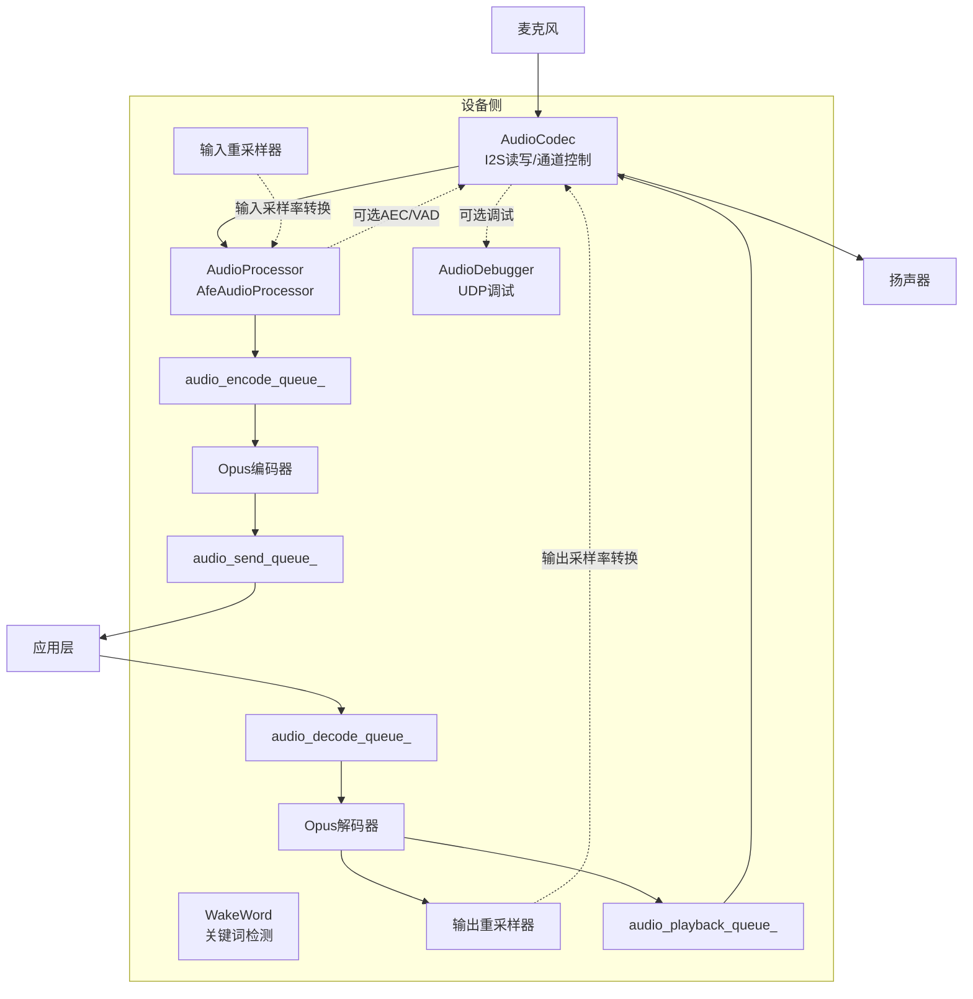
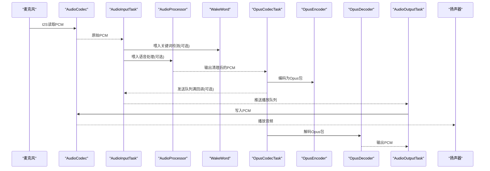
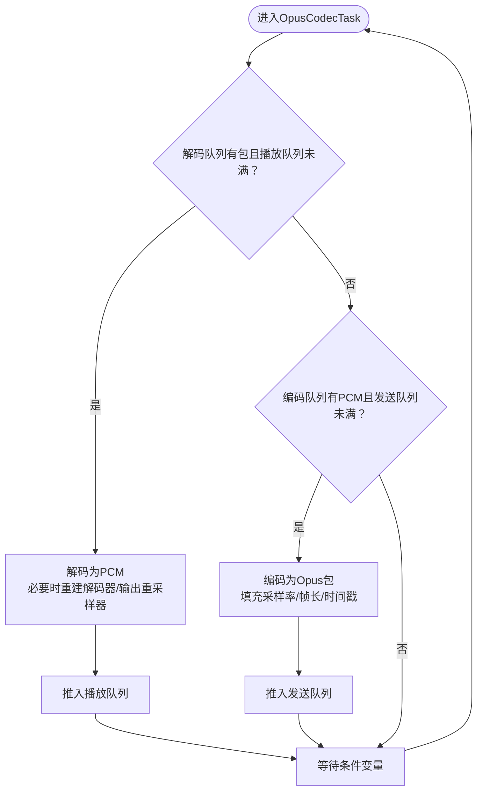
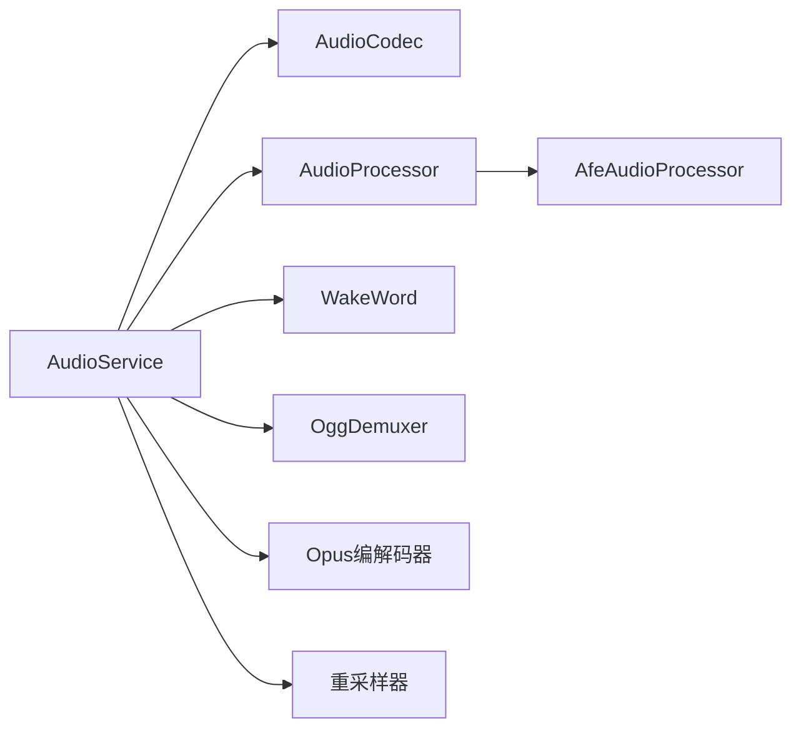

# 音频处理系统

<cite>
**本文引用的文件**
- [audio_service.h](file://main/audio/audio_service.h)
- [audio_service.cc](file://main/audio/audio_service.cc)
- [audio_codec.h](file://main/audio/audio_codec.h)
- [audio_processor.h](file://main/audio/audio_processor.h)
- [afe_audio_processor.h](file://main/audio/processors/afe_audio_processor.h)
- [audio_debugger.h](file://main/audio/processors/audio_debugger.h)
- [wake_word.h](file://main/audio/wake_word.h)
- [ogg_demuxer.h](file://main/audio/demuxer/ogg_demuxer.h)
- [README.md](file://main/audio/README.md)
</cite>

## 目录
1. [简介](#简介)
2. [项目结构](#项目结构)
3. [核心组件](#核心组件)
4. [架构总览](#架构总览)
5. [详细组件分析](#详细组件分析)
6. [依赖关系分析](#依赖关系分析)
7. [性能考量](#性能考量)
8. [故障排查指南](#故障排查指南)
9. [结论](#结论)
10. [附录](#附录)

## 简介
本文件面向ESP32-AI项目的音频处理系统，围绕AudioService类进行系统化技术文档编写，涵盖音频流管理、编解码器接口与处理器链路，深入解析音频数据从采集、处理、编码到播放的完整流程，并说明VAD检测、噪声抑制与音频质量优化策略。同时对OPUS与PCM等格式支持机制进行说明，提供音频参数配置指南与调试技巧。

## 项目结构
音频模块位于main/audio目录下，采用“服务层+硬件抽象+处理器+唤醒词+解复用器”的分层设计：
- 服务层：AudioService负责任务调度、队列管理、编解码与采样率转换、事件控制与电源管理。
- 硬件抽象：AudioCodec封装I2S读写与输入输出使能，屏蔽具体板卡差异。
- 处理器层：AudioProcessor定义统一接口，AfeAudioProcessor提供AEC/VAD/噪声抑制等实时处理。
- 唤醒词：WakeWord接口及实现（AFE/ESP/自定义）独立于主处理器运行。
- 解复用器：OggDemuxer用于将OGG中的Opus数据提取为纯Opus载荷以供解码播放。

图表来源
- [audio_service.h:106-196](file://main/audio/audio_service.h#L106-L196)
- [audio_service.cc:63-124](file://main/audio/audio_service.cc#L63-L124)
- [audio_codec.h:17-62](file://main/audio/audio_codec.h#L17-L62)
- [audio_processor.h:11-27](file://main/audio/audio_processor.h#L11-L27)
- [afe_audio_processor.h:17-48](file://main/audio/processors/afe_audio_processor.h#L17-L48)
- [ogg_demuxer.h:9-63](file://main/audio/demuxer/ogg_demuxer.h#L9-L63)

章节来源
- [README.md:1-88](file://main/audio/README.md#L1-L88)

## 核心组件
- AudioService：音频中枢，负责初始化编解码器、启动三类任务（输入/输出/编解码）、维护多条队列、事件控制与电源管理。
- AudioCodec：I2S硬件抽象，提供输入输出使能、采样率/声道/增益/音量设置与数据读写。
- AudioProcessor：音频处理接口，AfeAudioProcessor默认实现，提供AEC/VAD/噪声抑制与回调输出。
- WakeWord：关键词检测接口，支持多种模型类型，独立于主处理器。
- OggDemuxer：OGG解封装器，提取Opus载荷供解码播放。

章节来源
- [audio_service.h:106-196](file://main/audio/audio_service.h#L106-L196)
- [audio_service.cc:63-124](file://main/audio/audio_service.cc#L63-L124)
- [audio_codec.h:17-62](file://main/audio/audio_codec.h#L17-L62)
- [audio_processor.h:11-27](file://main/audio/audio_processor.h#L11-L27)
- [afe_audio_processor.h:17-48](file://main/audio/processors/afe_audio_processor.h#L17-L48)
- [wake_word.h:11-27](file://main/audio/wake_word.h#L11-L27)
- [ogg_demuxer.h:9-63](file://main/audio/demuxer/ogg_demuxer.h#L9-L63)

## 架构总览
AudioService采用“三任务+多队列”并发模型：
- AudioInputTask：从AudioCodec读取原始PCM，按状态喂给WakeWord或AudioProcessor；在测试模式下生成单声道帧。
- OpusCodecTask：在空闲时批量处理编码/解码，保证发送/播放队列容量上限；根据包内采样率动态重建解码器与输出重采样器。
- AudioOutputTask：从播放队列取出PCM，写入AudioCodec并触发电源定时器更新。

图表来源
- [audio_service.cc:231-448](file://main/audio/audio_service.cc#L231-L448)
- [audio_service.h:188-194](file://main/audio/audio_service.h#L188-L194)

## 详细组件分析

### AudioService 设计与数据流
- 初始化与资源管理：打开Opus解码器/编码器、创建输入/输出重采样器、注册电源定时器回调。
- 任务与队列：
  - 输入/输出任务：分别负责读取与写入，使用条件变量与互斥锁协调。
  - 编解码任务：在空闲时检查编码/解码队列容量，执行批量处理。
  - 队列：发送队列、解码队列、播放队列、测试队列；每类队列有最大长度限制。
- 事件控制：通过事件组控制“测试模式/唤醒词运行/语音处理运行”，任务阻塞等待相应事件。
- 采样率与重采样：输入端若非16kHz则使用输入重采样器；解码后若与输出采样率不一致则使用输出重采样器。
- 电源管理：定时器周期性检查最近输入/输出时间，超时自动关闭输入/输出通道以节能。

图表来源
- [audio_service.cc:329-448](file://main/audio/audio_service.cc#L329-L448)

章节来源
- [audio_service.h:106-196](file://main/audio/audio_service.h#L106-L196)
- [audio_service.cc:63-124](file://main/audio/audio_service.cc#L63-L124)
- [audio_service.cc:231-448](file://main/audio/audio_service.cc#L231-L448)

### AudioCodec 接口与I2S抽象
- 职责：封装I2S通道、输入输出使能、采样率/声道/增益/音量参数；提供InputData/OutputData接口。
- 关键点：duplex标志、输入参考电平、DMA描述符数量与帧数常量；通过Start()启动I2S。

章节来源
- [audio_codec.h:17-62](file://main/audio/audio_codec.h#L17-L62)

### AudioProcessor 接口与AfeAudioProcessor实现
- 接口职责：Initialize/Feed/Start/Stop/IsRunning/OnOutput/OnVadStateChange/GetFeedSize/EnableDeviceAec。
- AfeAudioProcessor实现要点：
  - 使用事件组与专用任务处理音频帧。
  - 维护输入/输出缓冲区，线程安全地传递数据。
  - 支持设备AEC开关，配合AudioService切换重采样器。

章节来源
- [audio_processor.h:11-27](file://main/audio/audio_processor.h#L11-L27)
- [afe_audio_processor.h:17-48](file://main/audio/processors/afe_audio_processor.h#L17-L48)

### 唤醒词 WakeWord 接口与集成
- 接口职责：Initialize/Feed/OnWakeWordDetected/Start/Stop/GetFeedSize/EncodeWakeWordData/GetWakeWordOpus/GetLastDetectedWakeWord。
- 集成逻辑：AudioService根据模型列表选择具体实现（自定义/AFE/ESP），并在启用/停止时重置输入重采样器以避免缓存溢出。

章节来源
- [wake_word.h:11-27](file://main/audio/wake_word.h#L11-L27)
- [audio_service.cc:702-728](file://main/audio/audio_service.cc#L702-L728)

### OggDemuxer 解封装器
- 功能：解析OGG页面，识别Opus头与数据段，提取纯Opus载荷。
- 实现：有限状态机驱动，固定大小缓冲区减少动态分配，支持跨段包拼接。

章节来源
- [ogg_demuxer.h:9-63](file://main/audio/demuxer/ogg_demuxer.h#L9-L63)

### 音频调试器 AudioDebugger
- 功能：将原始PCM数据通过UDP发送至调试端，便于网络外侧观察音频波形与幅度。
- 注意：仅在启用调试宏时生效。

章节来源
- [audio_debugger.h:10-22](file://main/audio/processors/audio_debugger.h#L10-L22)
- [audio_service.cc:220-227](file://main/audio/audio_service.cc#L220-L227)

## 依赖关系分析
- AudioService依赖：
  - AudioCodec：I/O通道与参数。
  - AudioProcessor：语音处理（AEC/VAD/噪声抑制）。
  - WakeWord：关键词检测。
  - OggDemuxer：OGG解封装。
  - 编解码库：ESP-ADF提供的Opus编解码与重采样器。
- 事件耦合：通过事件组控制各子系统的启停，降低耦合度。
- 队列解耦：多队列隔离不同阶段，避免阻塞传播。

图表来源
- [audio_service.h:21-27](file://main/audio/audio_service.h#L21-L27)
- [audio_service.cc:26-37](file://main/audio/audio_service.cc#L26-L37)

章节来源
- [audio_service.h:21-27](file://main/audio/audio_service.h#L21-L27)
- [audio_service.cc:26-37](file://main/audio/audio_service.cc#L26-L37)

## 性能考量
- 任务优先级与栈空间：
  - 输入/输出任务栈更大，确保I/O稳定性；编解码任务栈更大，满足Opus处理开销。
- 队列容量与帧长：
  - 发送/解码队列容量基于帧时长计算，避免网络拥塞与解码堆积。
  - 编码帧时长固定为60ms，保证低延迟与压缩比平衡。
- 重采样策略：
  - 输入端仅在采样率非16kHz时启用输入重采样器；输出端仅在解码采样率与板载输出不一致时启用输出重采样器。
- 电源管理：
  - 定时器周期性检查活动状态，超时自动关闭输入/输出通道，降低功耗。

章节来源
- [audio_service.h:39-48](file://main/audio/audio_service.h#L39-L48)
- [audio_service.cc:134-167](file://main/audio/audio_service.cc#L134-L167)
- [audio_service.cc:450-484](file://main/audio/audio_service.cc#L450-L484)
- [audio_service.cc:684-700](file://main/audio/audio_service.cc#L684-L700)

## 故障排查指南
- 无法启动编码/解码器
  - 现象：日志显示创建失败。
  - 排查：确认编解码器配置参数与目标平台兼容；检查句柄释放与重复初始化。
  - 参考路径：[audio_service.cc:67-85](file://main/audio/audio_service.cc#L67-L85)，[audio_service.cc:455-468](file://main/audio/audio_service.cc#L455-L468)
- 编码失败或帧尺寸不匹配
  - 现象：日志提示无效帧尺寸或编码失败。
  - 排查：确保输入PCM长度等于编码器帧大小；检查输入重采样器是否正确重置。
  - 参考路径：[audio_service.cc:408-442](file://main/audio/audio_service.cc#L408-L442)，[audio_service.cc:567-572](file://main/audio/audio_service.cc#L567-L572)
- 解码失败或重建频繁
  - 现象：日志提示解码失败或频繁重建解码器。
  - 排查：确认包内采样率/帧时长与期望一致；必要时重建解码器与输出重采样器。
  - 参考路径：[audio_service.cc:353-394](file://main/audio/audio_service.cc#L353-L394)，[audio_service.cc:450-484](file://main/audio/audio_service.cc#L450-L484)
- 音频无声或音量异常
  - 现象：播放无声音或音量过低。
  - 排查：检查输出使能、音量设置与增益；确认播放队列非空且AudioOutputTask正常运行。
  - 参考路径：[audio_service.cc:305-315](file://main/audio/audio_service.cc#L305-L315)，[audio_codec.h:22-28](file://main/audio/audio_codec.h#L22-L28)
- 电源通道未关闭
  - 现象：长时间无音频活动但功耗偏高。
  - 排查：确认电源定时器已启动；检查最近输入/输出时间更新逻辑。
  - 参考路径：[audio_service.cc:113-123](file://main/audio/audio_service.cc#L113-L123)，[audio_service.cc:684-700](file://main/audio/audio_service.cc#L684-L700)
- 唤醒词/语音处理切换异常
  - 现象：切换后出现缓冲溢出或处理异常。
  - 排查：切换前后重置输入重采样器；确认事件组状态与回调注册。
  - 参考路径：[audio_service.cc:565-572](file://main/audio/audio_service.cc#L565-L572)，[audio_service.cc:589-599](file://main/audio/audio_service.cc#L589-L599)

## 结论
AudioService通过清晰的任务划分与队列隔离，实现了从麦克风到扬声器的全链路音频处理，结合AEC/VAD/噪声抑制与Opus编解码，在保证实时性的前提下兼顾了网络传输效率与设备能耗。通过事件组与重采样器的灵活运用，系统具备良好的可扩展性与平台适配能力。

## 附录

### 音频参数配置指南
- 采样率
  - 输入采样率：由板载编解码器决定；若非16kHz，将通过输入重采样器转为16kHz。
  - 输出采样率：解码后若与板载输出不一致，将通过输出重采样器转为目标采样率。
  - 参考路径：[audio_service.cc:87-94](file://main/audio/audio_service.cc#L87-L94)，[audio_service.cc:470-483](file://main/audio/audio_service.cc#L470-L483)
- 帧时长
  - 固定为60ms，影响编码帧大小与发送队列容量。
  - 参考路径：[audio_service.h:39-43](file://main/audio/audio_service.h#L39-L43)，[audio_service.cc:404-406](file://main/audio/audio_service.cc#L404-L406)
- 队列容量
  - 发送/解码队列最大包数：约2400ms/帧时长；编码/播放队列最大任务数：2。
  - 参考路径：[audio_service.h:40-43](file://main/audio/audio_service.h#L40-L43)，[audio_service.h:41-42](file://main/audio/audio_service.h#L41-L42)
- 重采样复杂度
  - 输入/输出重采样器复杂度设为速度优先，兼顾实时性。
  - 参考路径：[audio_service.cc:6-15](file://main/audio/audio_service.cc#L6-L15)，[audio_service.cc:477-479](file://main/audio/audio_service.cc#L477-L479)
- 电源超时
  - 默认15秒无活动后关闭输入/输出通道；检查间隔1秒。
  - 参考路径：[audio_service.h:47-48](file://main/audio/audio_service.h#L47-L48)，[audio_service.cc:684-700](file://main/audio/audio_service.cc#L684-L700)

### 编解码器支持机制说明
- OPUS
  - 编码：固定16kHz、单声道、可变比特率、开启丢包隐藏与静音增强。
  - 解码：按包内采样率与帧时长动态配置，必要时重建解码器与输出重采样器。
  - 参考路径：[audio_service.h:65-76](file://main/audio/audio_service.h#L65-L76)，[audio_service.cc:17-24](file://main/audio/audio_service.cc#L17-L24)，[audio_service.cc:353-394](file://main/audio/audio_service.cc#L353-L394)
- PCM
  - 作为中间格式在处理器与编解码器之间流转；通过重采样器与I2S完成物理层对接。
  - 参考路径：[audio_service.cc:254-263](file://main/audio/audio_service.cc#L254-L263)，[audio_codec.h:27-28](file://main/audio/audio_codec.h#L27-L28)