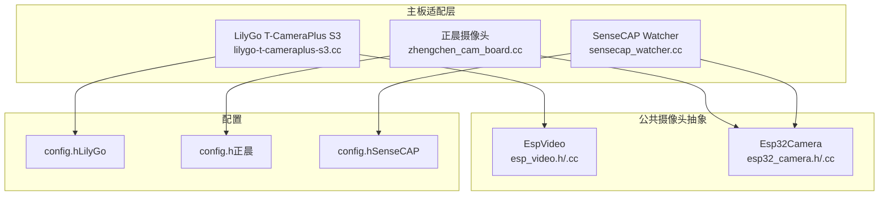
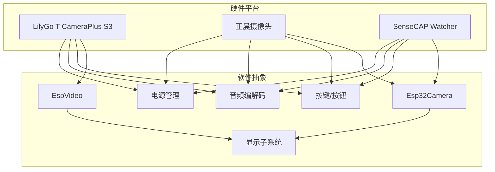
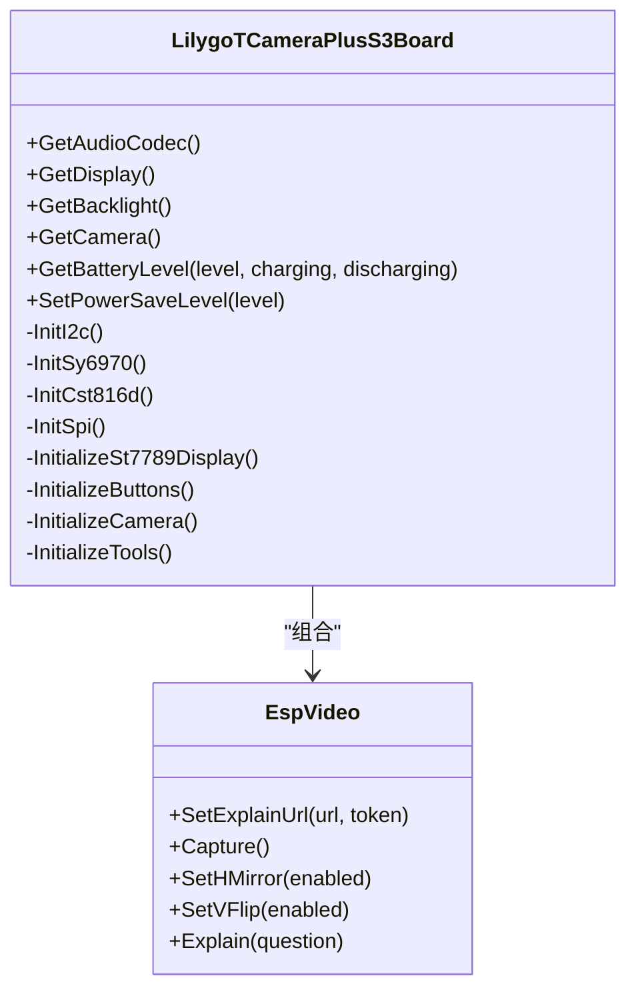
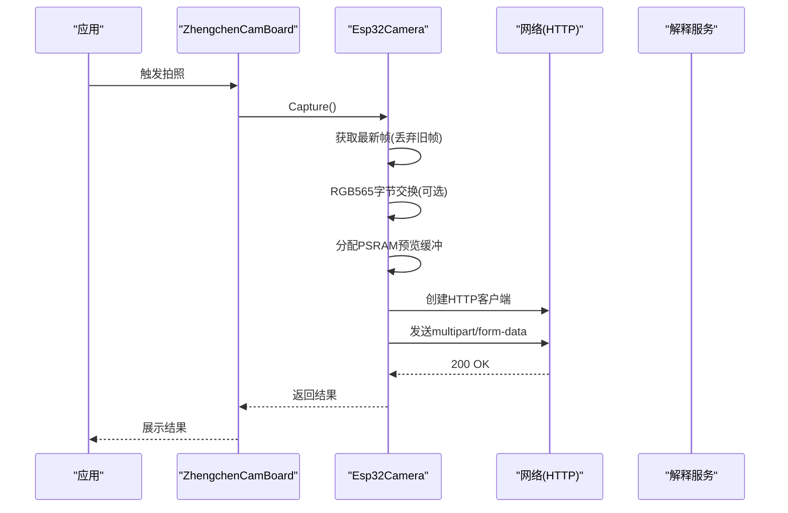
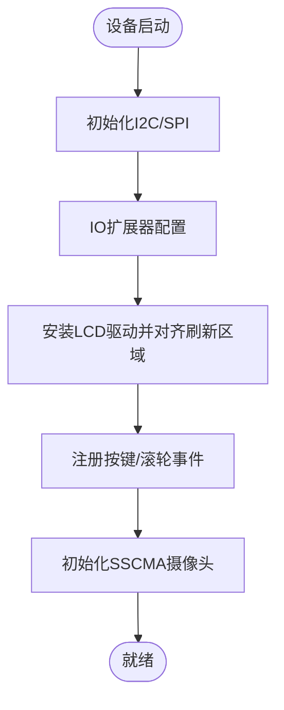
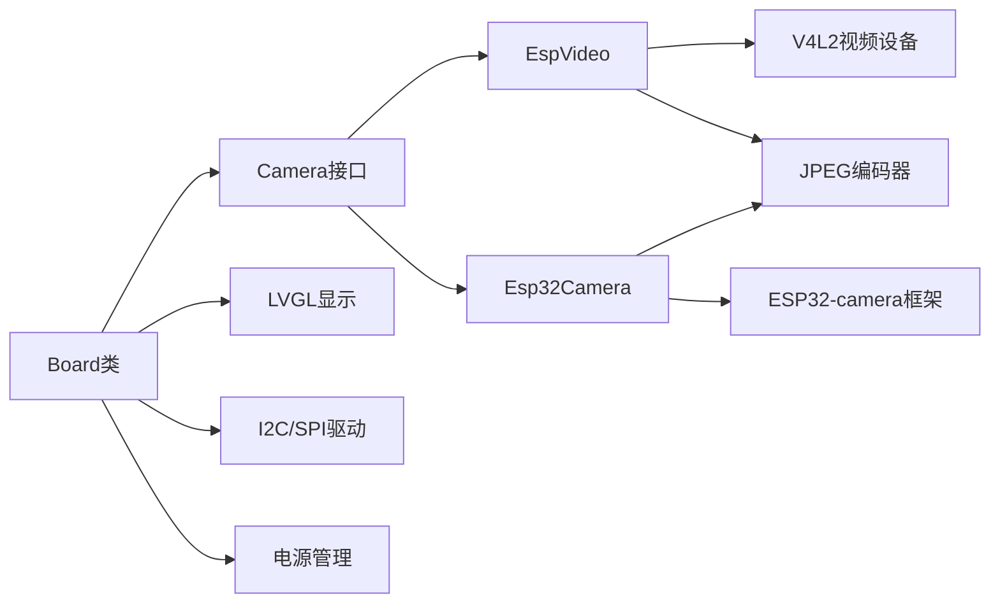

# AI摄像头设备

<cite>
**本文档引用的文件**
- [lilygo-t-cameraplus-s3.cc](file://main/boards/lilygo-t-cameraplus-s3/lilygo-t-cameraplus-s3.cc)
- [config.h（LilyGo T-CameraPlus S3）](file://main/boards/lilygo-t-cameraplus-s3/config.h)
- [sensecap_watcher.cc](file://main/boards/sensecap-watcher/sensecap_watcher.cc)
- [config.h（SenseCAP Watcher）](file://main/boards/sensecap-watcher/config.h)
- [zhengchen_cam_board.cc](file://main/boards/zhengchen-cam/zhengchen_cam_board.cc)
- [config.h（正晨摄像头）](file://main/boards/zhengchen-cam/config.h)
- [esp32_camera.h](file://main/boards/common/esp32_camera.h)
- [esp32_camera.cc](file://main/boards/common/esp32_camera.cc)
- [esp_video.h](file://main/boards/common/esp_video.h)
- [esp_video.cc](file://main/boards/common/esp_video.cc)
</cite>

## 目录
1. [简介](#简介)
2. [项目结构](#项目结构)
3. [核心组件](#核心组件)
4. [架构总览](#架构总览)
5. [详细组件分析](#详细组件分析)
6. [依赖关系分析](#依赖关系分析)
7. [性能考虑](#性能考虑)
8. [故障排查指南](#故障排查指南)
9. [结论](#结论)
10. [附录](#附录)

## 简介
本文件面向ESP32-AI项目中的AI摄像头设备，系统性梳理并说明以下硬件平台与实现方案：
- LilyGo T-CameraPlus S3：基于ESP32-S3的摄像头模组，支持OV2640/OV5640等常见图像传感器，具备DVP接口、I2C扩展、触摸与PMIC管理。
- 正晨摄像头（Zhengchen Cam）：基于ESP32-S3的摄像头开发板，采用ESP32-camera框架，支持RGB565像素格式与JPEG压缩上传。
- SenseCAP Watcher：基于SSCMA协议的AI摄像头设备，通过SPI接口与AI芯片通信，支持圆形LCD显示与多任务功耗管理。

文档涵盖硬件配置、图像传感器规格、视频处理能力、初始化配置、图像采集与预处理、AI推理集成、性能优化、图像质量调节与功耗管理策略，以及实际测试与调试方法。

## 项目结构
围绕摄像头设备的关键目录与文件如下：
- 主板适配层：各硬件平台的Board类实现，负责外设初始化、显示、按键、音频、电源管理与摄像头接入。
- 公共摄像头抽象：统一的Camera接口，分别由EspVideo与Esp32Camera实现不同底层驱动栈。
- 配置头文件：各平台的引脚定义、显示参数、音频参数与外设地址等。

**图表来源**
- [lilygo-t-cameraplus-s3.cc:227-276](file://main/boards/lilygo-t-cameraplus-s3/lilygo-t-cameraplus-s3.cc#L227-L276)
- [zhengchen_cam_board.cc:240-273](file://main/boards/zhengchen-cam/zhengchen_cam_board.cc#L240-L273)
- [sensecap_watcher.cc:566-585](file://main/boards/sensecap-watcher/sensecap_watcher.cc#L566-L585)
- [esp_video.h:21-53](file://main/boards/common/esp_video.h#L21-L53)
- [esp32_camera.h:22-44](file://main/boards/common/esp32_camera.h#L22-L44)
- [config.h（LilyGo）:1-58](file://main/boards/lilygo-t-cameraplus-s3/config.h#L1-L58)
- [config.h（正晨）:1-69](file://main/boards/zhengchen-cam/config.h#L1-L69)
- [config.h（SenseCAP）:1-153](file://main/boards/sensecap-watcher/config.h#L1-L153)

**章节来源**
- [lilygo-t-cameraplus-s3.cc:227-276](file://main/boards/lilygo-t-cameraplus-s3/lilygo-t-cameraplus-s3.cc#L227-L276)
- [zhengchen_cam_board.cc:240-273](file://main/boards/zhengchen-cam/zhengchen_cam_board.cc#L240-L273)
- [sensecap_watcher.cc:566-585](file://main/boards/sensecap-watcher/sensecap_watcher.cc#L566-L585)
- [esp_video.h:21-53](file://main/boards/common/esp_video.h#L21-L53)
- [esp32_camera.h:22-44](file://main/boards/common/esp32_camera.h#L22-L44)
- [config.h（LilyGo）:1-58](file://main/boards/lilygo-t-cameraplus-s3/config.h#L1-L58)
- [config.h（正晨）:1-69](file://main/boards/zhengchen-cam/config.h#L1-L69)
- [config.h（SenseCAP）:1-153](file://main/boards/sensecap-watcher/config.h#L1-L153)

## 核心组件
- EspVideo：基于Linux V4L2语义的视频采集抽象，支持DVP/CSI/JPEG/USB UVC等多种视频设备，具备帧缓冲映射、格式协商、可选旋转与颜色空间转换、JPEG编码上传等功能。
- Esp32Camera：基于ESP32-camera框架的摄像头封装，负责初始化、帧抓取、RGB565/YUV等格式处理、JPEG编码与网络上传。
- Board类（LilyGo/T-CameraPlus S3、正晨摄像头、SenseCAP Watcher）：负责I2C/SPI/显示/按键/音频/电源管理等外设初始化，并注入对应的Camera实现。

关键特性与接口要点：
- 初始化流程：摄像头初始化配置（DVP/I2C/SCCB/XCLK）、视频设备打开、格式协商、请求缓冲并入队、启动流。
- 图像采集：从视频设备队列取出最新可用帧，复制到PSRAM，必要时进行颜色空间转换或旋转，供显示与AI推理使用。
- 预处理与上传：根据当前像素格式选择合适的编码路径，将图像数据打包为multipart/form-data并通过HTTP上传至解释服务。
- 功耗管理：通过PowerSaveTimer与PMIC/IO扩展器控制背光、显示与系统供电，在低电量或空闲状态下进入省电模式。

**章节来源**
- [esp_video.cc:99-363](file://main/boards/common/esp_video.cc#L99-L363)
- [esp32_camera.cc:20-52](file://main/boards/common/esp32_camera.cc#L20-L52)
- [esp32_camera.cc:59-130](file://main/boards/common/esp32_camera.cc#L59-L130)
- [esp32_camera.cc:155-322](file://main/boards/common/esp32_camera.cc#L155-L322)
- [lilygo-t-cameraplus-s3.cc:227-276](file://main/boards/lilygo-t-cameraplus-s3/lilygo-t-cameraplus-s3.cc#L227-L276)
- [zhengchen_cam_board.cc:240-273](file://main/boards/zhengchen-cam/zhengchen_cam_board.cc#L240-L273)
- [sensecap_watcher.cc:566-585](file://main/boards/sensecap-watcher/sensecap_watcher.cc#L566-L585)

## 架构总览
下图展示三款摄像头设备的硬件与软件架构关系，以及与公共摄像头抽象层的交互。

**图表来源**
- [lilygo-t-cameraplus-s3.cc:227-276](file://main/boards/lilygo-t-cameraplus-s3/lilygo-t-cameraplus-s3.cc#L227-L276)
- [zhengchen_cam_board.cc:240-273](file://main/boards/zhengchen-cam/zhengchen_cam_board.cc#L240-L273)
- [sensecap_watcher.cc:566-585](file://main/boards/sensecap-watcher/sensecap_watcher.cc#L566-L585)
- [esp_video.h:21-53](file://main/boards/common/esp_video.h#L21-L53)
- [esp32_camera.h:22-44](file://main/boards/common/esp32_camera.h#L22-L44)

## 详细组件分析

### LilyGo T-CameraPlus S3 设备分析
- 硬件平台：ESP32-S3，支持OV系列图像传感器（通过DVP接口），配备I2C触摸控制器（CST816x）、SY6970电源管理、ST7789 LCD显示与IR滤光片切换。
- 初始化流程：
  - I2C/SPI初始化与设备检测。
  - SY6970 PMIC初始化与状态查询。
  - 触摸面板CST816x初始化与触摸事件循环。
  - ST7789显示驱动安装与镜像/旋转配置。
  - 按键绑定与相机捕获触发。
  - EspVideo摄像头初始化（DVP+SCCB配置、XCLK频率、翻转控制）。
  - IR滤光片控制器初始化。
- 关键配置：
  - 音频采样率、I2S引脚与麦克风/扬声器类型随硬件版本差异。
  - 显示分辨率、镜像/旋转与背光控制。
  - DVP引脚映射、SCCB I2C端口与频率。
- 电源管理：PowerSaveTimer在低电量时降低背光并进入睡眠；PMIC关断由定时器回调触发。

**图表来源**
- [lilygo-t-cameraplus-s3.cc:67-348](file://main/boards/lilygo-t-cameraplus-s3/lilygo-t-cameraplus-s3.cc#L67-L348)
- [esp_video.h:21-53](file://main/boards/common/esp_video.h#L21-L53)

**章节来源**
- [lilygo-t-cameraplus-s3.cc:94-130](file://main/boards/lilygo-t-cameraplus-s3/lilygo-t-cameraplus-s3.cc#L94-L130)
- [lilygo-t-cameraplus-s3.cc:155-175](file://main/boards/lilygo-t-cameraplus-s3/lilygo-t-cameraplus-s3.cc#L155-L175)
- [lilygo-t-cameraplus-s3.cc:177-207](file://main/boards/lilygo-t-cameraplus-s3/lilygo-t-cameraplus-s3.cc#L177-L207)
- [lilygo-t-cameraplus-s3.cc:209-225](file://main/boards/lilygo-t-cameraplus-s3/lilygo-t-cameraplus-s3.cc#L209-L225)
- [lilygo-t-cameraplus-s3.cc:227-276](file://main/boards/lilygo-t-cameraplus-s3/lilygo-t-cameraplus-s3.cc#L227-L276)
- [lilygo-t-cameraplus-s3.cc:278-280](file://main/boards/lilygo-t-cameraplus-s3/lilygo-t-cameraplus-s3.cc#L278-L280)
- [config.h（LilyGo）:7-57](file://main/boards/lilygo-t-cameraplus-s3/config.h#L7-L57)

### 正晨摄像头（Zhengchen Cam）设备分析
- 硬件平台：ESP32-S3，采用ESP32-camera框架，RGB565像素格式，VGA分辨率，I2C控制SCCB。
- 初始化流程：
  - I2C初始化与PCA9557扩展器配置（用于音频输出使能与背光控制）。
  - SPI初始化与ST7789显示驱动安装。
  - 按键事件绑定（单击/双击/长按）与音量调节。
  - Esp32Camera初始化（像素格式、帧尺寸、PSRAM帧缓存、抓取策略）。
- 关键配置：
  - 像素格式：PIXFORMAT_RGB565。
  - 帧尺寸：FRAMESIZE_VGA。
  - 帧缓存：FRAMEBUFFER在PSRAM中，grab模式为“空闲时抓取”。
- 预处理与上传：RGB565帧复制到PSRAM，必要时进行字节交换，随后通过JPEG编码与HTTP上传。

**图表来源**
- [zhengchen_cam_board.cc:122-157](file://main/boards/zhengchen-cam/zhengchen_cam_board.cc#L122-L157)
- [esp32_camera.cc:59-130](file://main/boards/common/esp32_camera.cc#L59-L130)
- [esp32_camera.cc:155-322](file://main/boards/common/esp32_camera.cc#L155-L322)

**章节来源**
- [zhengchen_cam_board.cc:91-109](file://main/boards/zhengchen-cam/zhengchen_cam_board.cc#L91-L109)
- [zhengchen_cam_board.cc:111-120](file://main/boards/zhengchen-cam/zhengchen_cam_board.cc#L111-L120)
- [zhengchen_cam_board.cc:191-238](file://main/boards/zhengchen-cam/zhengchen_cam_board.cc#L191-L238)
- [zhengchen_cam_board.cc:240-273](file://main/boards/zhengchen-cam/zhengchen_cam_board.cc#L240-L273)
- [config.h（正晨）:47-66](file://main/boards/zhengchen-cam/config.h#L47-L66)

### SenseCAP Watcher 设备分析
- 硬件平台：基于SSCMA协议的AI摄像头，通过SPI与AI芯片通信，配备圆形LCD与IO扩展器电源管理。
- 初始化流程：
  - I2C/SPI初始化与IO扩展器配置（电源域、背光、按键等）。
  - SPD2010 LCD驱动安装与刷新区域对齐。
  - 滚轮/按键事件注册与长按恢复出厂设置。
  - SscmaCamera初始化（SD卡CS隔离、SPI客户端配置）。
- 电池与功耗：ADC测量与百分比估算、IO扩展器检测充电状态、低电量自动关机。
- UI定制：自定义顶部栏与状态栏布局，适配圆形屏幕。

**图表来源**
- [sensecap_watcher.cc:143-181](file://main/boards/sensecap-watcher/sensecap_watcher.cc#L143-L181)
- [sensecap_watcher.cc:194-211](file://main/boards/sensecap-watcher/sensecap_watcher.cc#L194-L211)
- [sensecap_watcher.cc:333-382](file://main/boards/sensecap-watcher/sensecap_watcher.cc#L333-L382)
- [sensecap_watcher.cc:566-585](file://main/boards/sensecap-watcher/sensecap_watcher.cc#L566-L585)

**章节来源**
- [sensecap_watcher.cc:120-141](file://main/boards/sensecap-watcher/sensecap_watcher.cc#L120-L141)
- [sensecap_watcher.cc:306-331](file://main/boards/sensecap-watcher/sensecap_watcher.cc#L306-L331)
- [sensecap_watcher.cc:333-382](file://main/boards/sensecap-watcher/sensecap_watcher.cc#L333-L382)
- [sensecap_watcher.cc:566-585](file://main/boards/sensecap-watcher/sensecap_watcher.cc#L566-L585)
- [config.h（SenseCAP）:28-152](file://main/boards/sensecap-watcher/config.h#L28-L152)

## 依赖关系分析
- 组件耦合：
  - Board类聚合Camera实现（EspVideo/Esp32Camera），并与显示、音频、电源管理模块协作。
  - EspVideo依赖Linux V4L2语义与内核视频设备，支持多种像素格式与可选旋转/颜色转换。
  - Esp32Camera依赖ESP32-camera框架与JPEG编码器，适合RGB565/YUV等格式的快速抓取与上传。
- 外部依赖：
  - ESP-IDF驱动（I2C/SPI/LCD/V4L2/PSRAM）。
  - JPEG编码库与网络HTTP客户端。
  - LVGL显示框架（部分Board实现）。

**图表来源**
- [esp_video.h:21-53](file://main/boards/common/esp_video.h#L21-L53)
- [esp32_camera.h:22-44](file://main/boards/common/esp32_camera.h#L22-L44)
- [lilygo-t-cameraplus-s3.cc:67-348](file://main/boards/lilygo-t-cameraplus-s3/lilygo-t-cameraplus-s3.cc#L67-L348)
- [zhengchen_cam_board.cc:79-330](file://main/boards/zhengchen-cam/zhengchen_cam_board.cc#L79-L330)
- [sensecap_watcher.cc:105-662](file://main/boards/sensecap-watcher/sensecap_watcher.cc#L105-L662)

**章节来源**
- [esp_video.cc:99-363](file://main/boards/common/esp_video.cc#L99-L363)
- [esp32_camera.cc:20-52](file://main/boards/common/esp32_camera.cc#L20-L52)
- [lilygo-t-cameraplus-s3.cc:67-348](file://main/boards/lilygo-t-cameraplus-s3/lilygo-t-cameraplus-s3.cc#L67-L348)
- [zhengchen_cam_board.cc:79-330](file://main/boards/zhengchen-cam/zhengchen_cam_board.cc#L79-L330)
- [sensecap_watcher.cc:105-662](file://main/boards/sensecap-watcher/sensecap_watcher.cc#L105-L662)

## 性能考虑
- 帧抓取策略：
  - 丢弃旧帧优先保证实时性（如正晨摄像头的“当空闲时抓取”策略）。
  - 多次出队/入队确保拿到最新帧，减少延迟。
- 内存与缓存：
  - PSRAM用于帧缓冲与预览图像，避免主DRAM压力。
  - JPEG编码采用分块队列与堆栈对齐分配，降低碎片化风险。
- 像素格式与转换：
  - RGB565直接显示效率高；YUV需颜色空间转换后再显示，增加CPU开销。
  - 可选字节交换与大端序转换，注意与目标显示格式匹配。
- 传输与并发：
  - JPEG编码在独立线程执行，避免阻塞主线程。
  - HTTP上传采用分块传输与边界标识，提升稳定性。
- 功耗管理：
  - 低电量/空闲时降低背光亮度、关闭非必要外设、进入睡眠模式。
  - PMIC/IO扩展器统一控制电源域，防止过放电。

[本节为通用指导，无需具体文件引用]

## 故障排查指南
- 摄像头无画面/黑屏：
  - 检查DVP引脚配置与SCCB I2C端口是否正确。
  - 确认XCLK频率与传感器兼容性。
  - 查看视频设备打开与格式协商日志，确认支持的像素格式。
- 图像倒置/镜像异常：
  - 使用SetHMirror/SetVFlip接口切换水平/垂直翻转。
  - 检查显示镜像/旋转参数与传感器默认方向。
- 预览卡顿/延迟大：
  - 减少帧尺寸或降低帧率。
  - 启用PSRAM帧缓存，避免频繁malloc。
  - 检查JPEG编码线程与HTTP上传是否阻塞。
- 上传失败：
  - 校验解释服务URL与Token配置。
  - 检查网络连接与HTTP状态码。
  - 查看分块发送与终止符是否完整。
- 低电量自动关机：
  - 检查电池ADC校准与百分比计算逻辑。
  - 确认PMIC/IO扩展器电源控制引脚配置。
- 触摸/按键无响应：
  - 确认I2C地址探测与中断引脚配置。
  - 检查按键事件回调注册与长按阈值。

**章节来源**
- [esp_video.cc:388-520](file://main/boards/common/esp_video.cc#L388-L520)
- [esp32_camera.cc:155-322](file://main/boards/common/esp32_camera.cc#L155-L322)
- [lilygo-t-cameraplus-s3.cc:94-130](file://main/boards/lilygo-t-cameraplus-s3/lilygo-t-cameraplus-s3.cc#L94-L130)
- [zhengchen_cam_board.cc:122-157](file://main/boards/zhengchen-cam/zhengchen_cam_board.cc#L122-L157)
- [sensecap_watcher.cc:643-658](file://main/boards/sensecap-watcher/sensecap_watcher.cc#L643-L658)

## 结论
本项目针对三类主流AI摄像头硬件平台提供了统一的摄像头抽象与平台化适配层：
- LilyGo T-CameraPlus S3：侧重DVP+SCCB+PMIC+触摸+IR滤光片的完整生态。
- 正晨摄像头：基于ESP32-camera框架，强调RGB565抓取与快速上传。
- SenseCAP Watcher：面向SSCMA协议的AI摄像头，强调圆形显示与多任务功耗管理。

通过公共Camera接口与平台Board类的分离设计，开发者可以便捷地移植与扩展新的摄像头设备，同时在图像采集、预处理与AI推理集成方面获得一致的开发体验。

[本节为总结性内容，无需具体文件引用]

## 附录
- 测试与调试建议：
  - 使用I2C地址扫描与触摸事件循环验证外设连通性。
  - 在不同光照条件下测试曝光与白平衡（若传感器支持）。
  - 通过HTTP上传接口验证图像质量与网络稳定性。
  - 记录JPEG编码耗时与内存占用，评估性能瓶颈。
- 最佳实践：
  - 优先使用PSRAM作为帧缓冲，避免DRAM碎片化。
  - 控制JPEG质量与分辨率以平衡带宽与存储。
  - 合理设置PowerSaveTimer阈值，延长续航时间。
  - 在显示前进行颜色空间转换，确保预览一致性。

[本节为通用指导，无需具体文件引用]