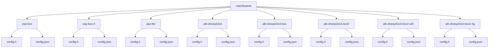
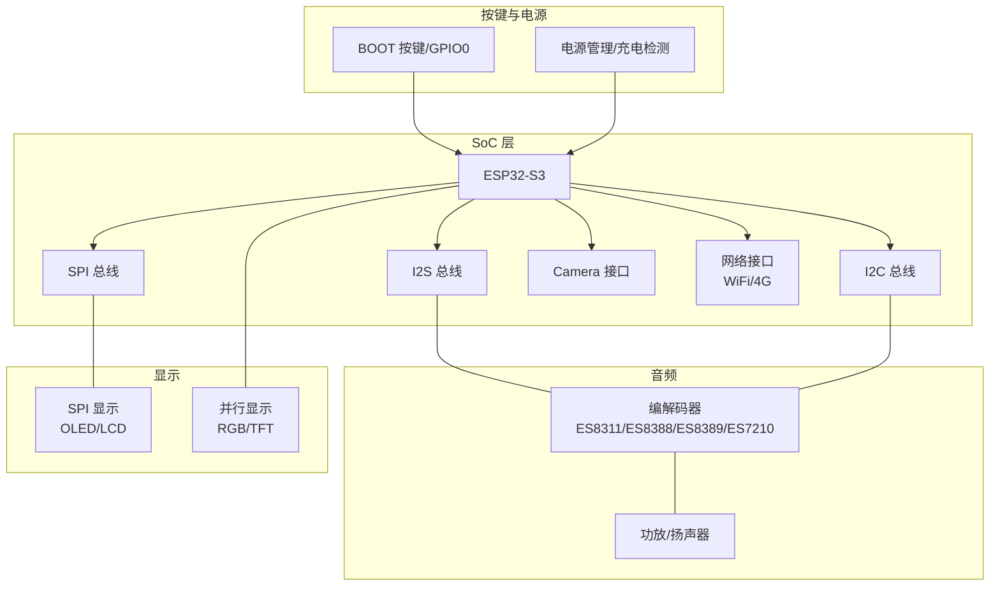
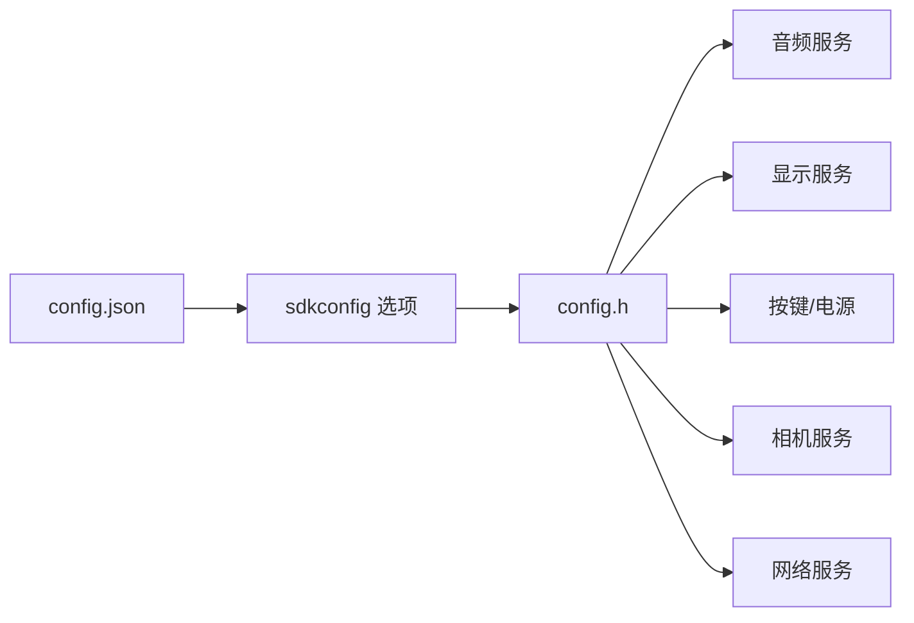

# 开发板系列

<cite>
**本文引用的文件**
- [main/boards/esp-box/config.h](file://main/boards/esp-box/config.h)
- [main/boards/esp-box/config.json](file://main/boards/esp-box/config.json)
- [main/boards/esp-box-3/config.h](file://main/boards/esp-box-3/config.h)
- [main/boards/esp-box-3/config.json](file://main/boards/esp-box-3/config.json)
- [main/boards/aipi-lite/config.h](file://main/boards/aipi-lite/config.h)
- [main/boards/aipi-lite/config.json](file://main/boards/aipi-lite/config.json)
- [main/boards/atk-dnesp32s3/config.h](file://main/boards/atk-dnesp32s3/config.h)
- [main/boards/atk-dnesp32s3/config.json](file://main/boards/atk-dnesp32s3/config.json)
- [main/boards/atk-dnesp32s3-box/config.h](file://main/boards/atk-dnesp32s3-box/config.h)
- [main/boards/atk-dnesp32s3-box/config.json](file://main/boards/atk-dnesp32s3-box/config.json)
- [main/boards/atk-dnesp32s3-box0/config.h](file://main/boards/atk-dnesp32s3-box0/config.h)
- [main/boards/atk-dnesp32s3-box0/config.json](file://main/boards/atk-dnesp32s3-box0/config.json)
- [main/boards/atk-dnesp32s3-box2-4g/config.h](file://main/boards/atk-dnesp32s3-box2-4g/config.h)
- [main/boards/atk-dnesp32s3-box2-4g/config.json](file://main/boards/atk-dnesp32s3-box2-4g/config.json)
- [main/boards/atk-dnesp32s3-box2-wifi/config.h](file://main/boards/atk-dnesp32s3-box2-wifi/config.h)
- [main/boards/atk-dnesp32s3-box2-wifi/config.json](file://main/boards/atk-dnesp32s3-box2-wifi/config.json)
</cite>

## 目录
1. [简介](#简介)
2. [项目结构](#项目结构)
3. [核心组件](#核心组件)
4. [架构总览](#架构总览)
5. [详细组件分析](#详细组件分析)
6. [依赖分析](#依赖分析)
7. [性能考虑](#性能考虑)
8. [故障排查指南](#故障排查指南)
9. [结论](#结论)
10. [附录](#附录)

## 简介
本文件面向ESP32-AI项目的开发板系列，聚焦于以下主流开发板：ESP-BOX、ESP-BOX-3、Aipi Lite、ATK DNESP32S3系列（含BOX、BOX0、BOX2-WiFi、BOX2-4G）。内容涵盖硬件配置与引脚定义、音频接口、显示与按键、网络与相机能力、启动配置与默认设置、性能特点与适用场景、常见问题与测试验证方法。目标是帮助开发者快速理解各开发板差异、正确配置与部署，并高效完成功能验证。

## 项目结构
开发板相关配置集中在 main/boards 下，每个开发板以独立子目录组织，包含：
- config.h：硬件引脚、显示参数、音频参数等编译期常量定义
- config.json：构建目标 target 与 sdkconfig 追加项，用于启用特定外设或特性

图表来源
- [main/boards/esp-box/config.h:1-42](file://main/boards/esp-box/config.h#L1-L42)
- [main/boards/esp-box/config.json:1-9](file://main/boards/esp-box/config.json#L1-L9)
- [main/boards/esp-box-3/config.h:1-42](file://main/boards/esp-box-3/config.h#L1-L42)
- [main/boards/esp-box-3/config.json:1-11](file://main/boards/esp-box-3/config.json#L1-L11)
- [main/boards/aipi-lite/config.h:1-54](file://main/boards/aipi-lite/config.h#L1-L54)
- [main/boards/aipi-lite/config.json:1-12](file://main/boards/aipi-lite/config.json#L1-L12)
- [main/boards/atk-dnesp32s3/config.h:1-65](file://main/boards/atk-dnesp32s3/config.h#L1-L65)
- [main/boards/atk-dnesp32s3/config.json:1-13](file://main/boards/atk-dnesp32s3/config.json#L1-L13)
- [main/boards/atk-dnesp32s3-box/config.h:1-47](file://main/boards/atk-dnesp32s3-box/config.h#L1-L47)
- [main/boards/atk-dnesp32s3-box/config.json:1-11](file://main/boards/atk-dnesp32s3-box/config.json#L1-L11)
- [main/boards/atk-dnesp32s3-box0/config.h:1-85](file://main/boards/atk-dnesp32s3-box0/config.h#L1-L85)
- [main/boards/atk-dnesp32s3-box0/config.json:1-9](file://main/boards/atk-dnesp32s3-box0/config.json#L1-L9)
- [main/boards/atk-dnesp32s3-box2-wifi/config.h:1-72](file://main/boards/atk-dnesp32s3-box2-wifi/config.h#L1-L72)
- [main/boards/atk-dnesp32s3-box2-wifi/config.json:1-9](file://main/boards/atk-dnesp32s3-box2-wifi/config.json#L1-L9)
- [main/boards/atk-dnesp32s3-box2-4g/config.h:1-81](file://main/boards/atk-dnesp32s3-box2-4g/config.h#L1-L81)
- [main/boards/atk-dnesp32s3-box2-4g/config.json:1-9](file://main/boards/atk-dnesp32s3-box2-4g/config.json#L1-L9)

章节来源
- [main/boards/esp-box/config.h:1-42](file://main/boards/esp-box/config.h#L1-L42)
- [main/boards/esp-box/config.json:1-9](file://main/boards/esp-box/config.json#L1-L9)
- [main/boards/esp-box-3/config.h:1-42](file://main/boards/esp-box-3/config.h#L1-L42)
- [main/boards/esp-box-3/config.json:1-11](file://main/boards/esp-box-3/config.json#L1-L11)
- [main/boards/aipi-lite/config.h:1-54](file://main/boards/aipi-lite/config.h#L1-L54)
- [main/boards/aipi-lite/config.json:1-12](file://main/boards/aipi-lite/config.json#L1-L12)
- [main/boards/atk-dnesp32s3/config.h:1-65](file://main/boards/atk-dnesp32s3/config.h#L1-L65)
- [main/boards/atk-dnesp32s3/config.json:1-13](file://main/boards/atk-dnesp32s3/config.json#L1-L13)
- [main/boards/atk-dnesp32s3-box/config.h:1-47](file://main/boards/atk-dnesp32s3-box/config.h#L1-L47)
- [main/boards/atk-dnesp32s3-box/config.json:1-11](file://main/boards/atk-dnesp32s3-box/config.json#L1-L11)
- [main/boards/atk-dnesp32s3-box0/config.h:1-85](file://main/boards/atk-dnesp32s3-box0/config.h#L1-L85)
- [main/boards/atk-dnesp32s3-box0/config.json:1-9](file://main/boards/atk-dnesp32s3-box0/config.json#L1-L9)
- [main/boards/atk-dnesp32s3-box2-wifi/config.h:1-72](file://main/boards/atk-dnesp32s3-box2-wifi/config.h#L1-L72)
- [main/boards/atk-dnesp32s3-box2-wifi/config.json:1-9](file://main/boards/atk-dnesp32s3-box2-wifi/config.json#L1-L9)
- [main/boards/atk-dnesp32s3-box2-4g/config.h:1-81](file://main/boards/atk-dnesp32s3-box2-4g/config.h#L1-L81)
- [main/boards/atk-dnesp32s3-box2-4g/config.json:1-9](file://main/boards/atk-dnesp32s3-box2-4g/config.json#L1-L9)

## 核心组件
- 音频配置：各开发板通过 I2S 引脚定义与编解码器地址实现音频输入输出；采样率统一为 24000Hz 或 16000Hz，部分型号支持外部麦克风与功放控制。
- 显示配置：统一采用宽高与镜像/旋转参数描述，部分开发板使用 SPI 接口驱动 OLED/LCD，另有开发板采用并行 RGB 控制屏。
- 按键与引导：BOOT 按键在多数开发板上复用为 GPIO_NUM_0；部分开发板提供额外按键或电源控制引脚。
- 相机与网络：部分 ATK 系列开发板具备摄像头接口；网络能力取决于具体型号（WiFi/4G），部分型号集成 4G 模块与 IO 扩展器。
- 构建目标：所有开发板均针对 ESP32-S3 平台，部分开发板通过 config.json 追加 sdkconfig 选项以启用特定外设或特性。

章节来源
- [main/boards/esp-box/config.h:6-26](file://main/boards/esp-box/config.h#L6-L26)
- [main/boards/esp-box-3/config.h:6-26](file://main/boards/esp-box-3/config.h#L6-L26)
- [main/boards/aipi-lite/config.h:8-51](file://main/boards/aipi-lite/config.h#L8-L51)
- [main/boards/atk-dnesp32s3/config.h:8-61](file://main/boards/atk-dnesp32s3/config.h#L8-L61)
- [main/boards/atk-dnesp32s3-box/config.h:9-27](file://main/boards/atk-dnesp32s3-box/config.h#L9-L27)
- [main/boards/atk-dnesp32s3-box0/config.h:43-81](file://main/boards/atk-dnesp32s3-box0/config.h#L43-L81)
- [main/boards/atk-dnesp32s3-box2-wifi/config.h:11-68](file://main/boards/atk-dnesp32s3-box2-wifi/config.h#L11-L68)
- [main/boards/atk-dnesp32s3-box2-4g/config.h:12-74](file://main/boards/atk-dnesp32s3-box2-4g/config.h#L12-L74)
- [main/boards/esp-box/config.json:1-9](file://main/boards/esp-box/config.json#L1-L9)
- [main/boards/esp-box-3/config.json:1-11](file://main/boards/esp-box-3/config.json#L1-L11)
- [main/boards/aipi-lite/config.json:1-12](file://main/boards/aipi-lite/config.json#L1-L12)
- [main/boards/atk-dnesp32s3/config.json:1-13](file://main/boards/atk-dnesp32s3/config.json#L1-L13)
- [main/boards/atk-dnesp32s3-box/config.json:1-11](file://main/boards/atk-dnesp32s3-box/config.json#L1-L11)
- [main/boards/atk-dnesp32s3-box0/config.json:1-9](file://main/boards/atk-dnesp32s3-box0/config.json#L1-L9)
- [main/boards/atk-dnesp32s3-box2-wifi/config.json:1-9](file://main/boards/atk-dnesp32s3-box2-wifi/config.json#L1-L9)
- [main/boards/atk-dnesp32s3-box2-4g/config.json:1-9](file://main/boards/atk-dnesp32s3-box2-4g/config.json#L1-L9)

## 架构总览
下图展示各开发板在系统中的定位与关键接口关系：音频编解码器通过 I2C 与 I2S 连接至 SoC；显示模块通过 SPI 或并行接口连接；部分开发板具备相机接口与网络扩展能力；构建配置通过 config.json 控制 sdkconfig 选项。

图表来源
- [main/boards/esp-box/config.h:11-21](file://main/boards/esp-box/config.h#L11-L21)
- [main/boards/esp-box-3/config.h:11-21](file://main/boards/esp-box-3/config.h#L11-L21)
- [main/boards/aipi-lite/config.h:11-19](file://main/boards/aipi-lite/config.h#L11-L19)
- [main/boards/atk-dnesp32s3/config.h:11-19](file://main/boards/atk-dnesp32s3/config.h#L11-L19)
- [main/boards/atk-dnesp32s3-box/config.h:30-44](file://main/boards/atk-dnesp32s3-box/config.h#L30-L44)
- [main/boards/atk-dnesp32s3-box0/config.h:64-70](file://main/boards/atk-dnesp32s3-box0/config.h#L64-L70)
- [main/boards/atk-dnesp32s3-box2-wifi/config.h:44-56](file://main/boards/atk-dnesp32s3-box2-wifi/config.h#L44-L56)
- [main/boards/atk-dnesp32s3-box2-4g/config.h:50-56](file://main/boards/atk-dnesp32s3-box2-4g/config.h#L50-L56)

## 详细组件分析

### ESP-BOX
- 硬件与引脚
  - 音频：I2S 引脚（MCLK/WS/BCLK/DIN/DOUT）与编解码器（ES8311/ES7210）地址已定义；功放引脚与 I2C 引脚明确。
  - 显示：分辨率 320x240，镜像与偏移参数设定，背光引脚与极性定义。
  - 按键：BOOT 按键位于 GPIO_NUM_0。
- 构建配置：目标平台为 ESP32-S3，未追加特殊 sdkconfig 选项。
- 适用场景：入门级 AI 音频应用、语音唤醒与播放、基础显示交互。

章节来源
- [main/boards/esp-box/config.h:6-38](file://main/boards/esp-box/config.h#L6-L38)
- [main/boards/esp-box/config.json:1-9](file://main/boards/esp-box/config.json#L1-L9)

### ESP-BOX-3
- 硬件与引脚
  - 音频：I2S 引脚与编解码器地址与 ESP-BOX 类似，但 WS 引脚不同。
  - 显示：分辨率 320x240，背光引脚与极性定义。
  - 构建配置：目标平台为 ESP32-S3，并追加启用 AEC 特性的 sdkconfig 选项。
- 适用场景：对回声消除有需求的语音交互设备。

章节来源
- [main/boards/esp-box-3/config.h:6-38](file://main/boards/esp-box-3/config.h#L6-L38)
- [main/boards/esp-box-3/config.json:1-11](file://main/boards/esp-box-3/config.json#L1-L11)

### Aipi Lite
- 硬件与引脚
  - 音频：I2S 引脚与编解码器（ES8311）地址定义；功放引脚明确。
  - 显示：分辨率为 128x128，镜像/旋转/颜色顺序参数设定；SPI 接口引脚齐全，包含 CS/DC/RST/SCLK/MOSI。
  - 电源：电源按键、电源控制引脚、充电检测引脚与 ADC 通道定义。
  - 按键：BOOT 按键与内置 LED 引脚定义。
- 构建配置：目标平台为 ESP32-S3，并追加 16MB Flash 与分区表路径。
- 适用场景：轻量级可穿戴/便携式 AI 应用，强调低功耗与小体积。

章节来源
- [main/boards/aipi-lite/config.h:8-51](file://main/boards/aipi-lite/config.h#L8-L51)
- [main/boards/aipi-lite/config.json:1-12](file://main/boards/aipi-lite/config.json#L1-L12)

### ATK DNESP32S3 系列
- ATK DNESP32S3（基础款）
  - 音频：I2S 引脚与编解码器（ES8388）地址定义。
  - 显示：分辨率 320x240，镜像与旋转参数；背光引脚与极性定义。
  - 相机：DVP 接口引脚完整定义，支持 OV2640 等常见传感器。
  - 构建配置：目标平台为 ESP32-S3，并启用 OV2640 及其帧率/格式。
  - 适用场景：入门级 AI 视觉+音频应用，适合教学与原型验证。

  章节来源
  - [main/boards/atk-dnesp32s3/config.h:8-61](file://main/boards/atk-dnesp32s3/config.h#L8-L61)
  - [main/boards/atk-dnesp32s3/config.json:1-13](file://main/boards/atk-dnesp32s3/config.json#L1-L13)

- ATK DNESP32S3 BOX
  - 显示：采用并行接口控制的 RGB TFT，引脚映射完整。
  - 构建配置：目标平台为 ESP32-S3，并启用微信消息风格显示。
  - 适用场景：需要大屏显示与特定 UI 风格的应用。

  章节来源
  - [main/boards/atk-dnesp32s3-box/config.h:9-44](file://main/boards/atk-dnesp32s3-box/config.h#L9-L44)
  - [main/boards/atk-dnesp32s3-box/config.json:1-11](file://main/boards/atk-dnesp32s3-box/config.json#L1-L11)

- ATK DNESP32S3 BOX0
  - 音频：I2S 引脚与编解码器（ES8311）地址定义。
  - 显示：分辨率 240x240，背光引脚与极性定义。
  - 按键：左右中三键引脚定义。
  - 电源：电源控制、充电控制、电池电压检测引脚定义。
  - 适用场景：强调按键与电源管理的小型交互设备。

  章节来源
  - [main/boards/atk-dnesp32s3-box0/config.h:43-81](file://main/boards/atk-dnesp32s3-box0/config.h#L43-L81)
  - [main/boards/atk-dnesp32s3-box0/config.json:1-9](file://main/boards/atk-dnesp32s3-box0/config.json#L1-L9)

- ATK DNESP32S3 BOX2 WiFi
  - 音频：I2S 引脚与编解码器（ES8389）地址定义。
  - 显示：分辨率 240x320，背光引脚与极性定义。
  - IO 扩展：通过 IO 扩展器控制 USB 选择、4G 使能、电源等。
  - 适用场景：需要 WiFi 通信与 IO 扩展的中型设备。

  章节来源
  - [main/boards/atk-dnesp32s3-box2-wifi/config.h:11-68](file://main/boards/atk-dnesp32s3-box2-wifi/config.h#L11-L68)
  - [main/boards/atk-dnesp32s3-box2-wifi/config.json:1-9](file://main/boards/atk-dnesp32s3-box2-wifi/config.json#L1-L9)

- ATK DNESP32S3 BOX2 4G
  - 音频：I2S 引脚与编解码器（ES8389）地址定义。
  - 显示：分辨率 240x320，背光引脚与极性定义。
  - 4G 模块：串口 RX/TX 引脚定义，配合 IO 扩展器控制电源与使能。
  - 适用场景：需要广域网通信的远程监控/物联设备。

  章节来源
  - [main/boards/atk-dnesp32s3-box2-4g/config.h:12-74](file://main/boards/atk-dnesp32s3-box2-4g/config.h#L12-L74)
  - [main/boards/atk-dnesp32s3-box2-4g/config.json:1-9](file://main/boards/atk-dnesp32s3-box2-4g/config.json#L1-L9)

## 依赖分析
- 耦合关系
  - 各开发板通过 config.h 统一暴露 I2S/I2C/SPI 引脚与显示参数，便于上层音频/显示服务抽象。
  - 部分开发板（如 ATK 系列）共享 IO 扩展器与 4G 模块的控制逻辑，降低重复实现。
- 外部依赖
  - 编解码器驱动：ES8311/ES8388/ES8389/ES7210 等，由 config.h 中的地址与 I2C 引脚决定。
  - 分区表：Aipi Lite 通过 config.json 指定 16MB Flash 与分区表文件名，确保存储布局正确。
- 潜在环路
  - 配置文件之间无直接循环包含；音频/显示/按键等模块通过统一的 Board 抽象间接耦合。

图表来源
- [main/boards/aipi-lite/config.json:6-8](file://main/boards/aipi-lite/config.json#L6-L8)
- [main/boards/atk-dnesp32s3/config.json:6-10](file://main/boards/atk-dnesp32s3/config.json#L6-L10)
- [main/boards/esp-box-3/config.json:7-8](file://main/boards/esp-box-3/config.json#L7-L8)

章节来源
- [main/boards/aipi-lite/config.json:1-12](file://main/boards/aipi-lite/config.json#L1-L12)
- [main/boards/atk-dnesp32s3/config.json:1-13](file://main/boards/atk-dnesp32s3/config.json#L1-L13)
- [main/boards/esp-box-3/config.json:1-11](file://main/boards/esp-box-3/config.json#L1-L11)

## 性能考虑
- 音频采样率
  - 多数开发板采用 24kHz 采样率，兼顾处理复杂度与音质；部分 ATK BOX2 系列采用 16kHz，降低 CPU 占用。
- 显示刷新与带宽
  - SPI 显示在高频时会占用较多总线带宽；并行 RGB 显示可获得更高帧率，但引脚占用更多。
- 电源与热设计
  - Aipi Lite 提供电源控制与充电检测引脚，适合电池供电设备；建议在高负载场景下评估散热与降频策略。
- 网络与并发
  - 4G 模块与 WiFi 并发使用需注意 RF 干扰与内存占用；建议在资源受限设备上谨慎启用。

## 故障排查指南
- 音频无声或杂音
  - 检查 I2S 引脚是否与硬件一致；确认编解码器地址与 I2C 引脚匹配。
  - 若使用外部 MIC/PA，请核对 PA 引脚与功放电路连接。
- 显示异常
  - SPI 显示：检查 MOSI/CS/DC/SCLK 引脚与模式；确认分辨率与旋转/镜像参数。
  - 并行显示：确认数据总线引脚映射与控制引脚（RD/WR/RST）正确。
- 按键无效
  - BOOT 按键通常位于 GPIO0；确认上拉/下拉配置与软件中断/轮询策略。
- 相机无法识别
  - 确认 DVP 时钟与数据引脚连接；检查摄像头供电与复位引脚。
- 4G 模块不工作
  - 检查串口 RX/TX 引脚与 IO 扩展器使能信号；确认电源与天线连接。

## 结论
ESP32-AI 项目提供了覆盖从入门到进阶的多款开发板方案：ESP-BOX/BOX-3 适合基础音频与显示应用；Aipi Lite 适合便携式低功耗场景；ATK DNESP32S3 系列则在显示、按键、相机、WiFi/4G 能力上形成完整生态。通过 config.h/config.json 的标准化配置，开发者可以快速适配硬件差异并稳定上线。

## 附录

### 启动配置与默认设置
- 目标平台：所有开发板目标均为 ESP32-S3。
- 默认 sdkconfig 选项：可通过 config.json 的 sdkconfig_append 字段追加，例如启用 OV2640、启用 AEC、指定分区表等。
- 常见追加项
  - 启用 OV2640 与对应帧率/格式
  - 启用 AEC（回声消除）
  - 指定 16MB Flash 与分区表文件名

章节来源
- [main/boards/esp-box/config.json:1-9](file://main/boards/esp-box/config.json#L1-L9)
- [main/boards/esp-box-3/config.json:1-11](file://main/boards/esp-box-3/config.json#L1-L11)
- [main/boards/aipi-lite/config.json:1-12](file://main/boards/aipi-lite/config.json#L1-L12)
- [main/boards/atk-dnesp32s3/config.json:1-13](file://main/boards/atk-dnesp32s3/config.json#L1-L13)
- [main/boards/atk-dnesp32s3-box/config.json:1-11](file://main/boards/atk-dnesp32s3-box/config.json#L1-L11)
- [main/boards/atk-dnesp32s3-box0/config.json:1-9](file://main/boards/atk-dnesp32s3-box0/config.json#L1-L9)
- [main/boards/atk-dnesp32s3-box2-wifi/config.json:1-9](file://main/boards/atk-dnesp32s3-box2-wifi/config.json#L1-L9)
- [main/boards/atk-dnesp32s3-box2-4g/config.json:1-9](file://main/boards/atk-dnesp32s3-box2-4g/config.json#L1-L9)

### 实际测试方法与验证步骤
- 音频测试
  - 使用音频服务进行录音与播放，验证采样率与声道配置。
  - 对比不同编解码器地址与 I2C 引脚，确认设备可达性。
- 显示测试
  - 初始化显示驱动，绘制基本图形与文本，验证分辨率与旋转/镜像参数。
  - 对比 SPI 与并行接口的帧率表现。
- 按键与电源
  - 检测 BOOT 按键触发与系统复位；若具备电源控制，验证充电状态与电源切换。
- 相机测试（如适用）
  - 初始化摄像头，抓取图像并保存为 BMP/JPEG，检查分辨率与帧率。
- 网络测试（如适用）
  - WiFi：连接热点，进行简单 HTTP 请求或 MQTT 通信。
  - 4G：插入 SIM 卡，拨号或发送 AT 指令，确认模块在线。