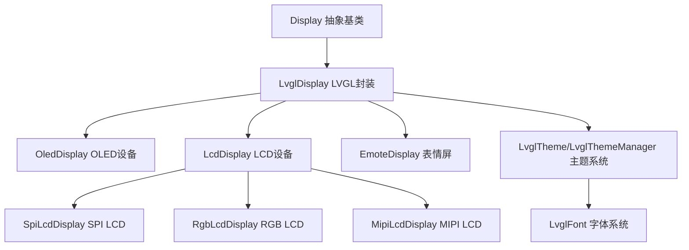
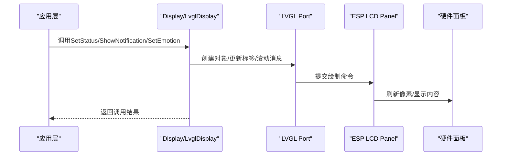
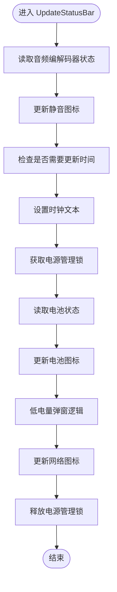
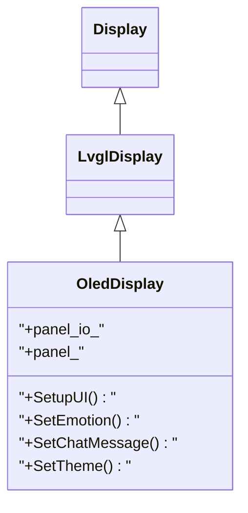
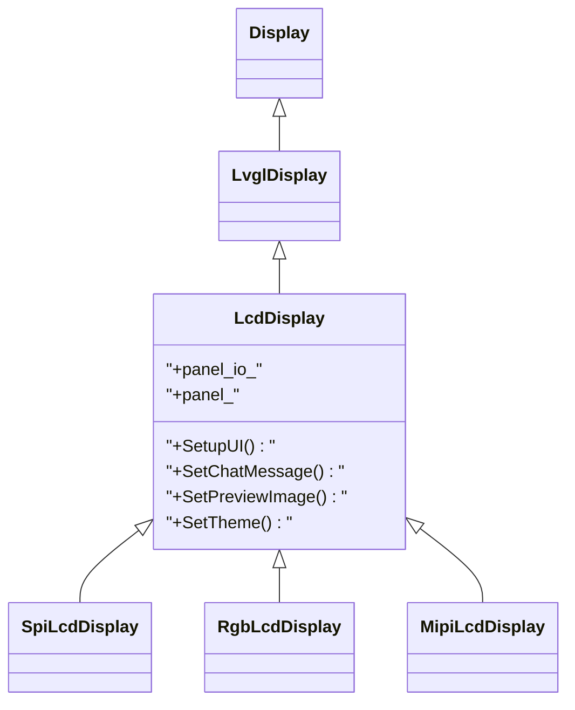
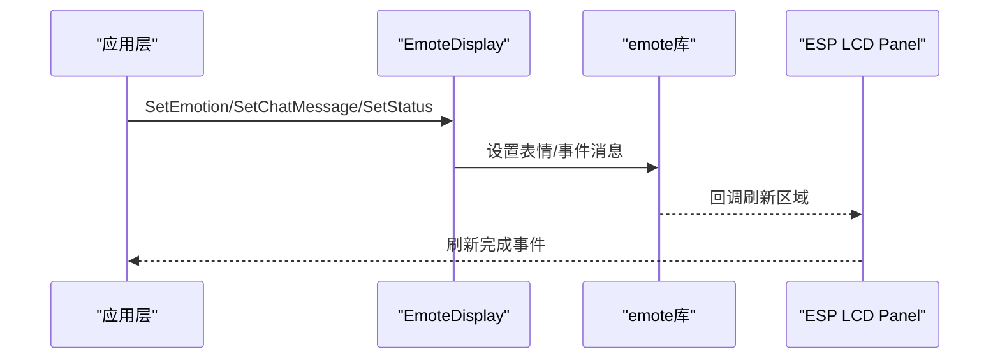
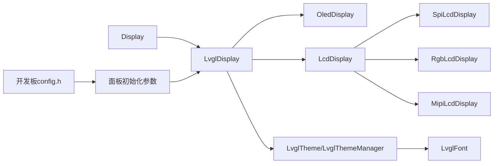

# 显示设备

<cite>
**本文引用的文件**
- [display.h](file://main/display/display.h)
- [display.cc](file://main/display/display.cc)
- [lvgl_display.h](file://main/display/lvgl_display/lvgl_display.h)
- [lvgl_display.cc](file://main/display/lvgl_display/lvgl_display.cc)
- [lvgl_theme.h](file://main/display/lvgl_display/lvgl_theme.h)
- [lvgl_font.h](file://main/display/lvgl_display/lvgl_font.h)
- [oled_display.h](file://main/display/oled_display.h)
- [oled_display.cc](file://main/display/oled_display.cc)
- [lcd_display.h](file://main/display/lcd_display.h)
- [lcd_display.cc](file://main/display/lcd_display.cc)
- [emote_display.h](file://main/display/emote_display.h)
- [emote_display.cc](file://main/display/emote_display.cc)
- [config.h（bread-compact-esp32）](file://main/boards/bread-compact-esp32/config.h)
- [config.h（bread-compact-esp32-lcd）](file://main/boards/bread-compact-esp32-lcd/config.h)
</cite>

## 目录
1. [简介](#简介)
2. [项目结构](#项目结构)
3. [核心组件](#核心组件)
4. [架构总览](#架构总览)
5. [详细组件分析](#详细组件分析)
6. [依赖关系分析](#依赖关系分析)
7. [性能考量](#性能考量)
8. [故障排除指南](#故障排除指南)
9. [结论](#结论)
10. [附录](#附录)

## 简介
本章节面向ESP32-AI项目中的显示设备，系统性梳理项目支持的显示类型（OLED、LCD、表情屏等）、LVGL图形界面的集成与配置、设备技术规格（分辨率、接口、驱动方式）、初始化流程、图像渲染与动画、主题与界面定制、性能优化与故障排除。文档以“可读性优先”的原则组织，既适合开发者深入理解实现细节，也便于非专业读者快速掌握使用要点。

## 项目结构
显示相关代码主要位于main/display目录下，采用“抽象接口+多态实现”的分层设计：
- 抽象基类：Display（统一接口）
- LVGL封装：LvglDisplay（通用LVGL UI能力）
- 设备实现：OledDisplay、LcdDisplay及其派生（SPI/LCD/MIPI）、EmoteDisplay
- 主题与字体：LvglTheme、LvglThemeManager、LvglFont
- 板级配置：各开发板config.h定义分辨率、接口引脚、旋转镜像等参数

图示来源
- [display.h:28-63](file://main/display/display.h#L28-L63)
- [lvgl_display.h:15-64](file://main/display/lvgl_display/lvgl_display.h#L15-L64)
- [oled_display.h:10-39](file://main/display/oled_display.h#L10-L39)
- [lcd_display.h:18-86](file://main/display/lcd_display.h#L18-L86)
- [lvgl_theme.h:14-94](file://main/display/lvgl_display/lvgl_theme.h#L14-L94)
- [lvgl_font.h:6-31](file://main/display/lvgl_display/lvgl_font.h#L6-L31)

章节来源
- [display.h:1-90](file://main/display/display.h#L1-L90)
- [lvgl_display.h:1-68](file://main/display/lvgl_display/lvgl_display.h#L1-L68)
- [lvgl_theme.h:1-95](file://main/display/lvgl_display/lvgl_theme.h#L1-L95)
- [lvgl_font.h:1-32](file://main/display/lvgl_display/lvgl_font.h#L1-L32)

## 核心组件
- Display抽象基类：定义统一接口（状态、通知、情感、聊天消息、主题切换、电源模式、UI初始化等），并提供DisplayLockGuard互斥保护。
- LvglDisplay：继承自Display，封装LVGL端口初始化、状态栏更新、传感器标签显示、表情自动更新、截图导出等通用能力。
- OledDisplay：基于SSD1306等OLED面板，支持128x64与128x32两种布局，单色位图缓冲，旋转与镜像配置。
- LcdDisplay：支持SPI/LCD、RGB、MIPI三类接口，多尺寸面板配置，动态消息气泡、预览图、机器人表情等。
- EmoteDisplay：专用表情屏驱动，通过emote库进行动画刷新，支持插入对话气泡与停止动画。
- 主题系统：LvglTheme管理颜色、字体、背景、间距等；LvglThemeManager集中注册与获取主题；LvglFont提供内置与外部字体适配。

章节来源
- [display.h:28-63](file://main/display/display.h#L28-L63)
- [lvgl_display.cc:19-78](file://main/display/lvgl_display/lvgl_display.cc#L19-L78)
- [oled_display.cc:20-81](file://main/display/oled_display.cc#L20-L81)
- [lcd_display.cc:65-90](file://main/display/lcd_display.cc#L65-L90)
- [emote_display.cc:118-135](file://main/display/emote_display.cc#L118-L135)
- [lvgl_theme.h:14-94](file://main/display/lvgl_display/lvgl_theme.h#L14-L94)
- [lvgl_font.h:6-31](file://main/display/lvgl_display/lvgl_font.h#L6-L31)

## 架构总览
显示子系统围绕Display抽象展开，LvglDisplay作为通用层，向下对接ESP-IDF的esp_lcd_panel与LVGL Port，向上提供统一的UI操作接口。OLED与LCD分别针对不同硬件特性进行布局与资源分配；表情屏通过独立emote驱动实现动画刷新。

图示来源
- [lvgl_display.cc:80-119](file://main/display/lvgl_display/lvgl_display.cc#L80-L119)
- [oled_display.cc:168-298](file://main/display/oled_display.cc#L168-L298)
- [lcd_display.cc:360-556](file://main/display/lcd_display.cc#L360-L556)

## 详细组件分析

### Display抽象层
- 统一接口：状态设置、通知展示、情感设置、聊天消息、主题切换、电源模式、UI初始化标记。
- 互斥机制：DisplayLockGuard在关键UI更新时加锁，避免并发冲突。
- 默认行为：无具体实现，子类按需覆盖。

章节来源
- [display.h:28-63](file://main/display/display.h#L28-L63)
- [display.cc:23-60](file://main/display/display.cc#L23-L60)

### LvglDisplay通用层
- 初始化：创建通知定时器、电源管理锁；根据编译选项启用快照功能。
- 状态栏：音量静音图标、电池电量图标、网络状态图标、时钟更新。
- 传感器显示：温度/湿度/MPU6050数值与表情联动。
- 截图：基于LVGL快照与JPEG编码回调输出。
- 可见性控制：状态栏、传感器标签、表情显示开关。

图示来源
- [lvgl_display.cc:121-227](file://main/display/lvgl_display/lvgl_display.cc#L121-L227)

章节来源
- [lvgl_display.h:15-64](file://main/display/lvgl_display/lvgl_display.h#L15-L64)
- [lvgl_display.cc:19-78](file://main/display/lvgl_display/lvgl_display.cc#L19-L78)
- [lvgl_display.cc:121-227](file://main/display/lvgl_display/lvgl_display.cc#L121-L227)
- [lvgl_display.cc:311-351](file://main/display/lvgl_display/lvgl_display.cc#L311-L351)

### OLED显示（OledDisplay）
- 面板接入：通过esp_lcd_panel_io与panel句柄注册LVGL端口，单色(monochrome)模式，DMA缓冲。
- 布局适配：128x64与128x32两种布局，顶部状态条与侧边栏组合，支持表情与滚动文本。
- 主题：内置文本/图标/大号图标字体，浅色主题默认注册。
- 锁机制：委托LVGL Port进行线程安全更新。

图示来源
- [display.h:28-63](file://main/display/display.h#L28-L63)
- [lvgl_display.h:15-64](file://main/display/lvgl_display/lvgl_display.h#L15-L64)
- [oled_display.h:10-39](file://main/display/oled_display.h#L10-L39)

章节来源
- [oled_display.h:10-39](file://main/display/oled_display.h#L10-L39)
- [oled_display.cc:20-81](file://main/display/oled_display.cc#L20-L81)
- [oled_display.cc:83-136](file://main/display/oled_display.cc#L83-L136)
- [oled_display.cc:168-384](file://main/display/oled_display.cc#L168-L384)

### LCD显示（LcdDisplay及其派生）
- 多接口支持：SPI/LCD、RGB、MIPI三种路径，分别配置缓冲大小、双缓冲、字节交换、旋转与镜像。
- 动态UI：顶部状态栏、温度湿度条、MPU6050条、聊天消息气泡、预览图、AI引导图标。
- 消息管理：最大消息数量限制、系统消息折叠、自动滚动至最新消息。
- 图像缓存：PSRAM可用时启用图片缓存，提升加载性能。
- 主题：Light/Dark两套主题，颜色与字体可配置。

图示来源
- [display.h:28-63](file://main/display/display.h#L28-L63)
- [lvgl_display.h:15-64](file://main/display/lvgl_display/lvgl_display.h#L15-L64)
- [lcd_display.h:18-86](file://main/display/lcd_display.h#L18-L86)

章节来源
- [lcd_display.h:18-86](file://main/display/lcd_display.h#L18-L86)
- [lcd_display.cc:65-90](file://main/display/lcd_display.cc#L65-L90)
- [lcd_display.cc:92-172](file://main/display/lcd_display.cc#L92-L172)
- [lcd_display.cc:175-233](file://main/display/lcd_display.cc#L175-L233)
- [lcd_display.cc:235-284](file://main/display/lcd_display.cc#L235-L284)
- [lcd_display.cc:360-556](file://main/display/lcd_display.cc#L360-L556)
- [lcd_display.cc:562-756](file://main/display/lcd_display.cc#L562-L756)
- [lcd_display.cc:758-800](file://main/display/lcd_display.cc#L758-L800)

### 表情屏显示（EmoteDisplay）
- 专用驱动：基于emote库，配置帧率、缓冲区、任务优先级与刷新回调。
- 事件驱动：根据状态（监听/待机/说话/错误）与消息类型设置表情与对话。
- 动画控制：支持插入对话气泡、停止动画、全量刷新。

图示来源
- [emote_display.cc:118-135](file://main/display/emote_display.cc#L118-L135)
- [emote_display.cc:137-176](file://main/display/emote_display.cc#L137-L176)
- [emote_display.cc:224-248](file://main/display/emote_display.cc#L224-L248)

章节来源
- [emote_display.h:12-42](file://main/display/emote_display.h#L12-L42)
- [emote_display.cc:118-135](file://main/display/emote_display.cc#L118-L135)
- [emote_display.cc:137-176](file://main/display/emote_display.cc#L137-L176)
- [emote_display.cc:224-248](file://main/display/emote_display.cc#L224-L248)

### 主题与字体系统
- 主题：颜色体系（背景、文本、气泡、边框、低电量）、字体（文本/图标/大号图标）、间距、背景图与表情集合。
- 注册与获取：LvglThemeManager集中管理主题注册与查找。
- 字体：内置字体与外部bin字体适配。

章节来源
- [lvgl_theme.h:14-94](file://main/display/lvgl_display/lvgl_theme.h#L14-L94)
- [lvgl_font.h:6-31](file://main/display/lvgl_display/lvgl_font.h#L6-L31)

## 依赖关系分析
- Display → LvglDisplay：抽象到通用实现的继承关系。
- LvglDisplay → OledDisplay/LcdDisplay/EmoteDisplay：多态实现。
- LvglDisplay → LVGL Port：通过esp_lcd_panel与lvgl_port完成底层刷新。
- 主题系统：LvglThemeManager集中注册，各设备共享主题实例。
- 板级配置：各开发板config.h定义分辨率、接口引脚、旋转镜像等，影响UI布局与面板初始化参数。

图示来源
- [display.h:28-63](file://main/display/display.h#L28-L63)
- [lvgl_display.h:15-64](file://main/display/lvgl_display/lvgl_display.h#L15-L64)
- [oled_display.h:10-39](file://main/display/oled_display.h#L10-L39)
- [lcd_display.h:18-86](file://main/display/lcd_display.h#L18-L86)
- [lvgl_theme.h:79-94](file://main/display/lvgl_display/lvgl_theme.h#L79-L94)
- [lvgl_font.h:6-31](file://main/display/lvgl_display/lvgl_font.h#L6-L31)
- [config.h（bread-compact-esp32）:39-49](file://main/boards/bread-compact-esp32/config.h#L39-L49)
- [config.h（bread-compact-esp32-lcd）:54-66](file://main/boards/bread-compact-esp32-lcd/config.h#L54-L66)

章节来源
- [config.h（bread-compact-esp32）:39-49](file://main/boards/bread-compact-esp32/config.h#L39-L49)
- [config.h（bread-compact-esp32-lcd）:54-66](file://main/boards/bread-compact-esp32-lcd/config.h#L54-L66)

## 性能考量
- LVGL端口与电源管理：LvglDisplay创建电源管理锁，避免UI更新期间降频导致卡顿。
- 缓冲策略：OLED单色缓冲、LCD DMA缓冲与双缓冲，减少CPU占用。
- 图像缓存：LCD在PSRAM充足时启用图片缓存，加速PNG等格式加载。
- 滚动与动画：文本滚动与表情动画采用LVGL动画系统，合理设置速度与重复次数。
- 截图优化：使用回调式JPEG编码，避免一次性分配大块内存。

章节来源
- [lvgl_display.cc:36-42](file://main/display/lvgl_display/lvgl_display.cc#L36-L42)
- [lvgl_display.cc:311-351](file://main/display/lvgl_display/lvgl_display.cc#L311-L351)
- [lcd_display.cc:116-126](file://main/display/lcd_display.cc#L116-L126)
- [oled_display.cc:49-71](file://main/display/oled_display.cc#L49-L71)

## 故障排除指南
- UI未显示或闪烁
  - 检查面板初始化是否成功，确认display_不为空。
  - 确认DisplayLockGuard在关键更新路径上正确加锁。
- 状态栏图标不更新
  - 确保UpdateStatusBar被周期性调用；检查音量/电池/网络状态读取。
- OLED布局异常
  - 核对分辨率宏与镜像/旋转参数；确认128x64与128x32分支。
- LCD消息溢出
  - 检查消息上限宏与删除最旧消息逻辑；确保滚动至最新消息。
- 截图失败
  - 确认LV_USE_SNAPSHOT已启用；检查draw_buffer与像素格式转换。
- 表情屏无动画
  - 确认emote初始化成功；检查flush回调与面板IO事件注册。

章节来源
- [lvgl_display.cc:74-78](file://main/display/lvgl_display/lvgl_display.cc#L74-L78)
- [lvgl_display.cc:121-227](file://main/display/lvgl_display/lvgl_display.cc#L121-L227)
- [oled_display.cc:168-298](file://main/display/oled_display.cc#L168-L298)
- [lcd_display.cc:562-756](file://main/display/lcd_display.cc#L562-L756)
- [lvgl_display.cc:311-351](file://main/display/lvgl_display/lvgl_display.cc#L311-L351)
- [emote_display.cc:118-135](file://main/display/emote_display.cc#L118-L135)

## 结论
本项目通过Display抽象与LvglDisplay通用层，实现了对OLED、LCD与表情屏的统一支持。OLED强调简洁布局与低功耗，LCD强调丰富UI与多媒体能力，表情屏强调动画表现力。结合主题系统与电源管理策略，可在不同硬件平台上获得一致且高效的用户体验。

## 附录

### 支持的显示设备类型与技术规格
- OLED（SSD1306等）
  - 分辨率：常见128x64、128x32
  - 接口：I2C（示例：bread-compact-esp32）
  - 驱动：单色(monochrome)，DMA缓冲
  - 特点：低功耗、高对比度
- LCD（ST7789、ILI9341、GC9A01等）
  - 分辨率：常见170x320、172x320、240x240、240x240_7PIN、240x280、240x320、320x480等
  - 接口：SPI/LCD、RGB、MIPI
  - 驱动：RGB565，支持双缓冲、字节交换、旋转与镜像
  - 特点：色彩丰富、可播放GIF/图片、支持聊天气泡
- 表情屏（Emote）
  - 驱动：emote库，30FPS，双缓冲
  - 特点：动画流畅、事件驱动

章节来源
- [config.h（bread-compact-esp32）:39-49](file://main/boards/bread-compact-esp32/config.h#L39-L49)
- [config.h（bread-compact-esp32-lcd）:54-234](file://main/boards/bread-compact-esp32-lcd/config.h#L54-L234)
- [oled_display.cc:49-71](file://main/display/oled_display.cc#L49-L71)
- [lcd_display.cc:137-161](file://main/display/lcd_display.cc#L137-L161)
- [lcd_display.cc:197-215](file://main/display/lcd_display.cc#L197-L215)
- [lcd_display.cc:248-275](file://main/display/lcd_display.cc#L248-L275)
- [emote_display.cc:74-112](file://main/display/emote_display.cc#L74-L112)

### LVGL集成与配置要点
- 初始化顺序：lv_init → lvgl_port_init → lvgl_port_add_disp（或RGB/DSI变体）
- 电源管理锁：UI更新前后acquire/release，避免降频
- 截图：启用LV_USE_SNAPSHOT，使用回调编码减少内存峰值
- 主题：注册light/dark主题，运行时切换

章节来源
- [oled_display.cc:40-71](file://main/display/oled_display.cc#L40-L71)
- [lcd_display.cc:114-134](file://main/display/lcd_display.cc#L114-L134)
- [lcd_display.cc:188-194](file://main/display/lcd_display.cc#L188-L194)
- [lcd_display.cc:241-245](file://main/display/lcd_display.cc#L241-L245)
- [lvgl_display.cc:36-42](file://main/display/lvgl_display/lvgl_display.cc#L36-L42)
- [lvgl_display.cc:311-351](file://main/display/lvgl_display/lvgl_display.cc#L311-L351)
- [lvgl_theme.h:79-94](file://main/display/lvgl_display/lvgl_theme.h#L79-L94)

### 初始化配置步骤（以OLED为例）
- 创建面板IO与panel句柄
- 初始化LVGL端口与显示
- 在Application::Initialize中调用SetupUI
- 设置主题与字体
- 启动状态栏更新循环

章节来源
- [oled_display.cc:20-81](file://main/display/oled_display.cc#L20-L81)
- [oled_display.cc:83-96](file://main/display/oled_display.cc#L83-L96)
- [lvgl_display.cc:121-227](file://main/display/lvgl_display/lvgl_display.cc#L121-L227)