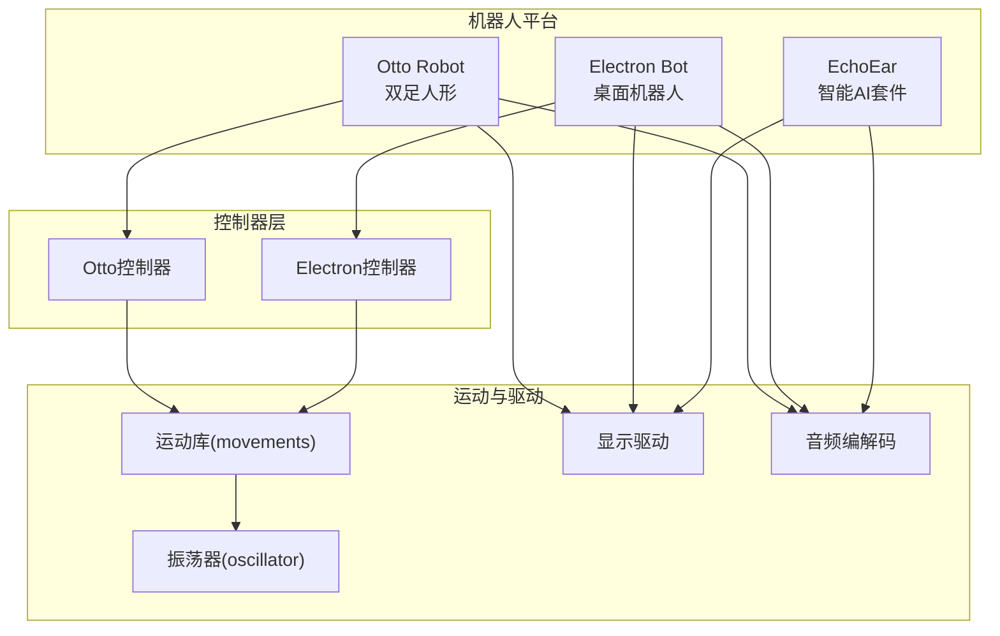
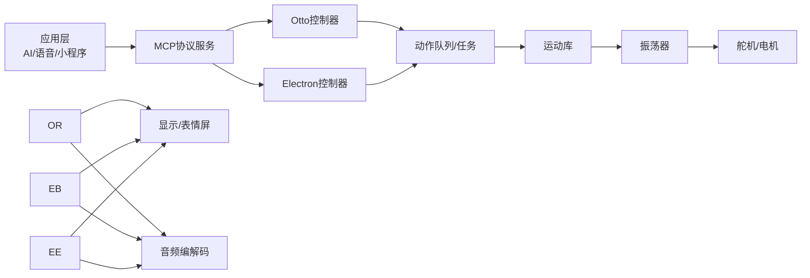
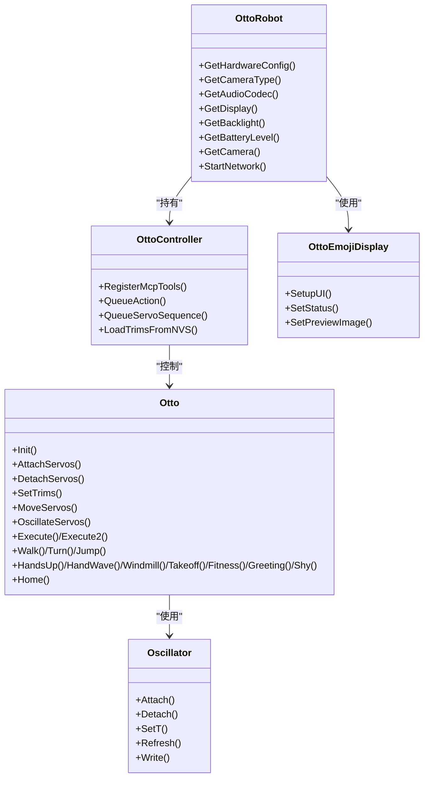
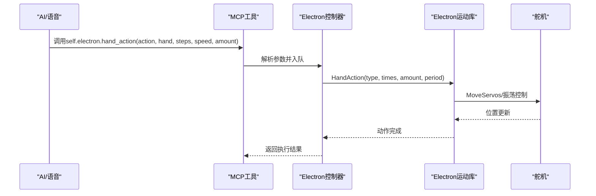
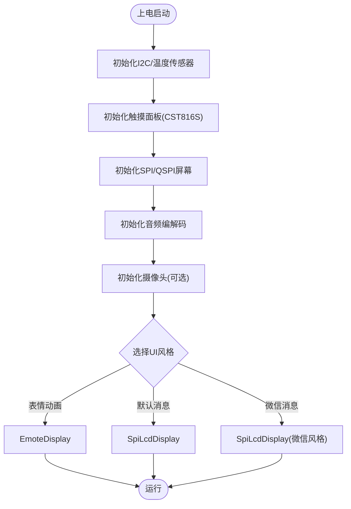
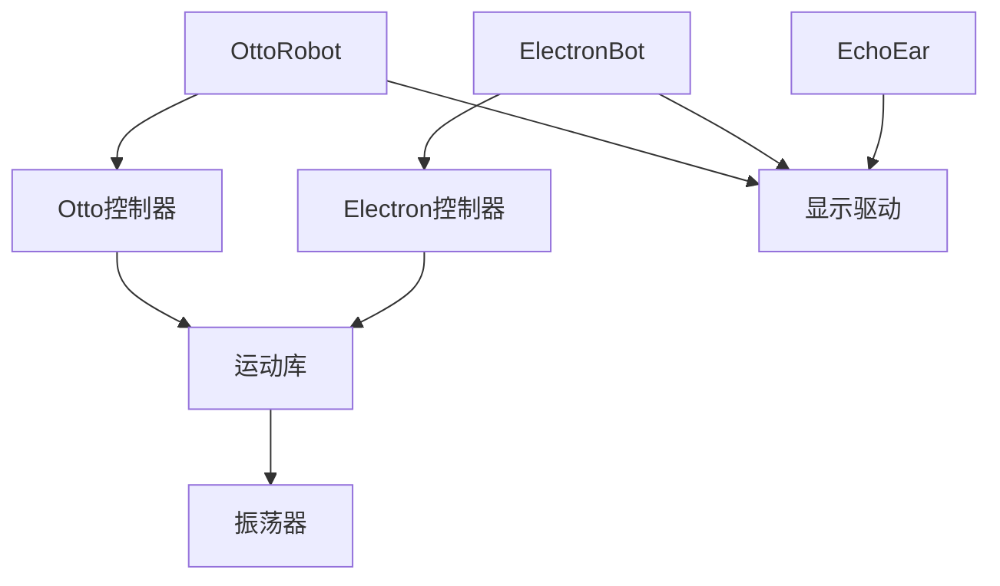

# 机器人设备

<cite>
**本文档引用的文件**
- [otto_robot.cc](file://main/boards/otto-robot/otto_robot.cc)
- [electron_bot.cc](file://main/boards/electron-bot/electron_bot.cc)
- [EchoEar.cc](file://main/boards/echoear/EchoEar.cc)
- [otto_controller.cc](file://main/boards/otto-robot/otto_controller.cc)
- [electron_bot_controller.cc](file://main/boards/electron-bot/electron_bot_controller.cc)
- [movements.cc](file://main/boards/electron-bot/movements.cc)
- [movements.cc](file://main/boards/otto-robot/otto_movements.cc)
- [oscillator.cc](file://main/boards/otto-robot/oscillator.cc)
- [oscillator.cc](file://main/boards/electron-bot/oscillator.cc)
- [config.h](file://main/boards/otto-robot/config.h)
- [config.h](file://main/boards/electron-bot/config.h)
- [config.h](file://main/boards/echoear/config.h)
- [otto_emoji_display.cc](file://main/boards/otto-robot/otto_emoji_display.cc)
- [electron_emoji_display.cc](file://main/boards/electron-bot/electron_emoji_display.cc)
- [README.md](file://main/boards/otto-robot/README.md)
- [README.md](file://main/boards/electron-bot/README.md)
- [README.md](file://main/boards/echoear/README.md)
</cite>

## 目录
1. [简介](#简介)
2. [项目结构](#项目结构)
3. [核心组件](#核心组件)
4. [架构总览](#架构总览)
5. [详细组件分析](#详细组件分析)
6. [依赖关系分析](#依赖关系分析)
7. [性能考虑](#性能考虑)
8. [故障排除指南](#故障排除指南)
9. [结论](#结论)
10. [附录](#附录)

## 简介
本文件面向ESP32-AI项目中的机器人设备，系统性梳理并说明以下三类智能机器人平台：
- Otto Robot：双足人形机器人，支持行走、转向、跳跃、舞蹈等丰富动作，具备麦克风阵列与表情屏，支持语音交互与AI控制。
- Electron Bot：桌面级小型机器人，具备肩部旋转/推拉、腰部旋转、头部俯仰等6自由度，支持手部动作与头部/身体动作组合。
- EchoEar：智能AI开发套件，配备圆形QSPI屏、双麦阵列、触摸面板，支持离线唤醒与声源定位，强调UI风格与触控交互。

文档覆盖硬件平台、机械结构、运动控制、传感器与AI交互、初始化配置、行为模式、语音交互、安全控制、避障思路、远程控制与个性化定制，并提供组装指南、调试方法与故障排除方案。

## 项目结构
围绕机器人设备的核心目录与文件组织如下：
- 主板适配层：各机器人平台在main/boards下独立实现，包含硬件配置、显示驱动、音频编解码、按钮与网络接入等。
- 控制器层：每台机器人对应独立控制器，负责动作队列、参数解析、动作调度与MCP工具注册。
- 运动库：movements与oscillator提供舵机控制、振荡器生成与运动序列执行。
- 配置文件：各平台config.h定义引脚映射、采样率、显示参数等硬件细节。
- 文档与说明：各平台README.md提供功能概览、参数建议与使用示例。

**图表来源**
- [otto_robot.cc](file://main/boards/otto-robot/otto_robot.cc)
- [electron_bot.cc](file://main/boards/electron-bot/electron_bot.cc)
- [EchoEar.cc](file://main/boards/echoear/EchoEar.cc)
- [movements.cc](file://main/boards/otto-robot/otto_movements.cc)
- [oscillator.cc](file://main/boards/otto-robot/oscillator.cc)

**章节来源**
- [otto_robot.cc:1-418](file://main/boards/otto-robot/otto_robot.cc#L1-L418)
- [electron_bot.cc:1-124](file://main/boards/electron-bot/electron_bot.cc#L1-L124)
- [EchoEar.cc:1-697](file://main/boards/echoear/EchoEar.cc#L1-L697)

## 核心组件
- 硬件抽象与初始化
  - Otto Robot：自动检测摄像头版本、初始化SPI/LCD、按键、电源管理、音频编解码、摄像头与WebSocket控制服务器。
  - Electron Bot：初始化GC9A01屏幕、按键、电源管理、控制器与显示。
  - EchoEar：初始化I2C、温度传感器、触摸面板、SPI/QSPI屏幕、音频编解码、摄像头（可选）。
- 控制器与动作队列
  - Otto控制器：统一动作工具self.otto.action、舵机序列工具self.otto.servo_sequences、停止与状态查询、舵机微调设置。
  - Electron控制器：手部/身体/头部动作统一工具、停止、状态查询、舵机微调与电量查询。
- 运动与振荡器
  - movements：MoveServos、OscillateServos、Execute/Execute2等，支持多舵机同步振荡与轨迹插值。
  - oscillator：基于LEDC定时器输出PWM，生成正弦振荡，控制舵机角度。
- 显示与交互
  - Otto Emoji Display：表情屏、状态图标、预览图与GIF播放。
  - Electron Emoji Display：聊天标签、表情屏与主题切换。
- 配置与引脚映射
  - 各平台config.h定义音频采样率、I2C/SPI引脚、显示参数、电源ADC等。

**章节来源**
- [otto_controller.cc:1-800](file://main/boards/otto-robot/otto_controller.cc#L1-L800)
- [electron_bot_controller.cc:1-377](file://main/boards/electron-bot/electron_bot_controller.cc#L1-L377)
- [movements.cc](file://main/boards/otto-robot/otto_movements.cc)
- [oscillator.cc](file://main/boards/otto-robot/oscillator.cc)
- [config.h](file://main/boards/otto-robot/config.h)

## 架构总览
机器人设备采用“平台抽象 + 控制器 + 运动库”的分层架构：
- 平台抽象：Board子类负责硬件初始化与外设集成。
- 控制器：解析MCP工具参数，入队动作，后台任务执行，保证主线程非阻塞。
- 运动库：提供多舵机同步控制与正弦振荡，支持复杂动作序列与自定义振荡模式。
- 交互层：显示、音频、触摸、网络（WebSocket/HTTP）构成人机交互通道。

**图表来源**
- [otto_controller.cc:1-800](file://main/boards/otto-robot/otto_controller.cc#L1-L800)
- [electron_bot_controller.cc:1-377](file://main/boards/electron-bot/electron_bot_controller.cc#L1-L377)
- [movements.cc](file://main/boards/otto-robot/otto_movements.cc)
- [oscillator.cc](file://main/boards/otto-robot/oscillator.cc)

## 详细组件分析

### Otto Robot（双足人形机器人）
- 硬件与初始化
  - 自动检测摄像头版本，区分OV2640/OV3660并设置翻转参数；初始化SPI/LCD、按键、电源管理、音频编解码、摄像头与WebSocket控制服务器。
  - 提供获取IP、电池状态、摄像头实例等接口。
- 控制器与动作
  - 统一动作工具self.otto.action：支持walk/turn/jump/swing/moonwalk/bend/shake_leg/updown/whirlwind_leg等基础动作，以及hands_up/hands_down/hand_wave/windmill/takeoff/fitness/greeting/shy/radio_calisthenics/magic_circle等手部动作。
  - 舵机序列工具self.otto.servo_sequences：支持普通移动与振荡器两种模式，可分段发送序列，自动排队执行。
  - 系统工具：stop（立即停止并复位）、get_status（获取状态）、set_trim/get_trims（舵机微调）。
- 运动控制与算法
  - MoveServos：线性插值到目标位置，支持细粒度增量更新。
  - OscillateServos/Execute/Execute2：基于正弦振荡的多舵机同步控制，支持相位差与周期数。
  - 典型动作：Walk/Turn/Jump/Swing/Moonwalker/Bend/ShakeLeg/UpDown/Windmill/Takeoff/Fitness/Greeting/Shy等。
- 交互与显示
  - OttoEmojiDisplay：表情屏、状态图标（听/说/连接/待机）、预览图与GIF播放。
- 安全与稳定性
  - 动作执行期间暂停电量更新，避免干扰；队列满载时丢弃多余动作；手部动作前置校验，无手部舵机时跳过。
- 语音与远程控制
  - README提供大量语音指令示例；WebSocket控制服务器提供远程控制入口。

**图表来源**
- [otto_robot.cc:28-418](file://main/boards/otto-robot/otto_robot.cc#L28-L418)
- [otto_controller.cc:23-800](file://main/boards/otto-robot/otto_controller.cc#L23-L800)
- [movements.cc](file://main/boards/otto-robot/otto_movements.cc)
- [oscillator.cc](file://main/boards/otto-robot/oscillator.cc)
- [otto_emoji_display.cc:14-134](file://main/boards/otto-robot/otto_emoji_display.cc#L14-L134)

**章节来源**
- [otto_robot.cc:1-418](file://main/boards/otto-robot/otto_robot.cc#L1-L418)
- [otto_controller.cc:1-800](file://main/boards/otto-robot/otto_controller.cc#L1-L800)
- [movements.cc](file://main/boards/otto-robot/otto_movements.cc)
- [oscillator.cc](file://main/boards/otto-robot/oscillator.cc)
- [README.md](file://main/boards/otto-robot/README.md)

### Electron Bot（桌面机器人）
- 硬件与初始化
  - 初始化GC9A01屏幕、按键、电源管理、控制器与显示。
- 控制器与动作
  - 手部动作统一工具self.electron.hand_action：支持举手/放手/挥手/拍打（左/右/双手）。
  - 身体动作工具self.electron.body_turn：支持左转/右转/回中心，角度可调。
  - 头部动作工具self.electron.head_move：支持抬头/低头/点头/回中心/连续点头。
  - 系统工具：stop/get_status/set_trim/get_trims/电池电量查询。
- 运动控制与算法
  - HandAction/BodyAction/HeadAction：参数化动作，限制步数、速度与幅度范围，确保安全与稳定。
- 交互与显示
  - ElectronEmojiDisplay：聊天标签、表情屏与主题切换。

**图表来源**
- [electron_bot_controller.cc:146-358](file://main/boards/electron-bot/electron_bot_controller.cc#L146-L358)
- [movements.cc](file://main/boards/electron-bot/movements.cc)

**章节来源**
- [electron_bot.cc:1-124](file://main/boards/electron-bot/electron_bot.cc#L1-L124)
- [electron_bot_controller.cc:1-377](file://main/boards/electron-bot/electron_bot_controller.cc#L1-L377)
- [movements.cc](file://main/boards/electron-bot/movements.cc)
- [README.md](file://main/boards/electron-bot/README.md)

### EchoEar（智能AI开发套件）
- 硬件与初始化
  - 初始化I2C、温度传感器、触摸面板（CST816S）、SPI/QSPI屏幕（ST77916）、音频编解码（ES8311/ES7210）、摄像头（可选）。
  - 支持多种UI风格：表情动画风格、默认消息风格、微信消息风格。
- 交互与显示
  - EmoteDisplay/SpiLcdDisplay：表情屏、状态图标、触摸事件处理与任务。
- 配置与编译
  - README提供配置menuconfig、选择显示风格、编译与烧录步骤。

**图表来源**
- [EchoEar.cc:397-697](file://main/boards/echoear/EchoEar.cc#L397-L697)
- [config.h](file://main/boards/echoear/config.h)

**章节来源**
- [EchoEar.cc:1-697](file://main/boards/echoear/EchoEar.cc#L1-L697)
- [README.md](file://main/boards/echoear/README.md)

## 依赖关系分析
- 组件耦合
  - 控制器与运动库：控制器通过队列与任务调度调用运动库，运动库依赖振荡器生成PWM。
  - 平台抽象：各Board类封装硬件差异，向上提供统一接口（显示、音频、电池、摄像头）。
- 外部依赖
  - ESP-IDF驱动：LED PWM、SPI/I2C、摄像头视频栈、触摸面板、温度传感器。
  - LVGL：表情屏与主题渲染。
- 潜在循环依赖
  - 控制器与运动库通过头文件相互引用，但通过前置声明与分离实现避免循环。

**图表来源**
- [otto_controller.cc:1-800](file://main/boards/otto-robot/otto_controller.cc#L1-L800)
- [electron_bot_controller.cc:1-377](file://main/boards/electron-bot/electron_bot_controller.cc#L1-L377)
- [movements.cc](file://main/boards/otto-robot/otto_movements.cc)
- [oscillator.cc](file://main/boards/otto-robot/oscillator.cc)

**章节来源**
- [config.h](file://main/boards/otto-robot/config.h)
- [config.h](file://main/boards/electron-bot/config.h)
- [config.h](file://main/boards/echoear/config.h)

## 性能考虑
- 动作执行
  - MoveServos采用10ms增量更新，Execute/Execute2基于正弦振荡，周期与相位差可调，平衡流畅度与实时性。
  - 队列与任务：动作在高优先级任务中执行，避免阻塞主循环。
- 音频与显示
  - 音频采样率与I2S引脚在config.h中集中配置，避免运行时切换带来的抖动。
  - 显示刷新与GIF播放在独立任务中进行，降低对动作执行的影响。
- 电源与热管理
  - 动作开始暂停电量更新，动作结束后恢复，避免动作抖动影响电量估算。
  - EchoEar集成温度传感器，可在UI中显示温度，辅助热管理。

[本节为通用指导，无需特定文件引用]

## 故障排除指南
- 无法识别摄像头/OV型号
  - Otto Robot：自动检测失败时强制使用摄像头配置，但会记录警告；检查I2C引脚与上拉电阻。
  - 解决：确认I2C SDA/SCL引脚正确，必要时手动设置硬件版本宏。
- 动作卡顿或舵机异响
  - 检查MoveServos的速度参数与振荡周期，避免过小周期导致电流峰值过高。
  - 确认振荡器相位差与幅度设置，避免左右腿/脚同时大幅振荡造成机械应力。
- 语音/麦克风无声
  - 检查音频编解码器初始化与I2S引脚映射，确认电源与PA引脚配置。
  - 对照config.h中的采样率与I2S引脚定义，确保与硬件一致。
- 触摸无响应（EchoEar）
  - 检查CST816S中断引脚与ISR安装，确认I2C地址与触摸面板固件。
  - 触摸任务与信号量需正确创建与删除，避免资源泄漏。
- 电量显示异常
  - 确认ADC通道与电源检测引脚配置，检查电池充电状态逻辑。
- UI显示异常
  - OLED/屏幕初始化参数（镜像、旋转、颜色交换）需与config.h一致。
  - LVGL主题与表情资源需正确加载，避免锁竞争导致的闪烁。

**章节来源**
- [otto_robot.cc:41-159](file://main/boards/otto-robot/otto_robot.cc#L41-L159)
- [EchoEar.cc:497-513](file://main/boards/echoear/EchoEar.cc#L497-L513)
- [config.h](file://main/boards/otto-robot/config.h)
- [config.h](file://main/boards/echoear/config.h)

## 结论
ESP32-AI项目为三类机器人平台提供了完整的软硬件框架：Otto Robot强调双足动作与AI交互，Electron Bot聚焦桌面级多自由度动作，EchoEar侧重智能AI开发与触控交互。通过统一的MCP工具、队列化动作执行与振荡器驱动，系统实现了高可扩展性与易用性。结合本文档的配置、调试与故障排除指南，开发者可快速完成设备初始化、动作定制与个性化部署。

[本节为总结性内容，无需特定文件引用]

## 附录

### 组装与调试要点
- 引脚与连线
  - 严格对照config.h中的引脚定义，核对I2C、SPI、I2S、ADC与电源线路。
  - 摄像头模块需确认XCLK/PCLK/VSYNC/HREF/D0-D7连接正确。
- 编译与烧录
  - 使用menuconfig选择目标板类型与显示风格，确保分区表与资源文件匹配。
  - 编译后通过idf.py flash烧录，首次上电进入WiFi配置模式（按住Boot按钮）。
- 初始校准
  - 使用set_trim工具对舵机微调，确保机器人站立姿态平衡。
  - 对手部动作（Otto）或多自由度动作（Electron）进行幅度与速度测试。

**章节来源**
- [README.md](file://main/boards/otto-robot/README.md)
- [README.md](file://main/boards/electron-bot/README.md)
- [README.md](file://main/boards/echoear/README.md)