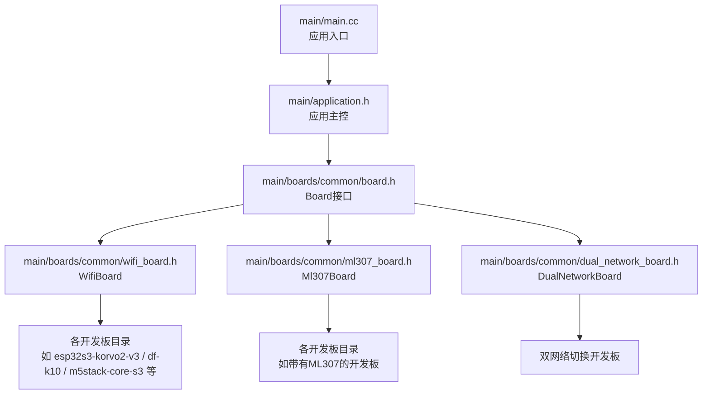
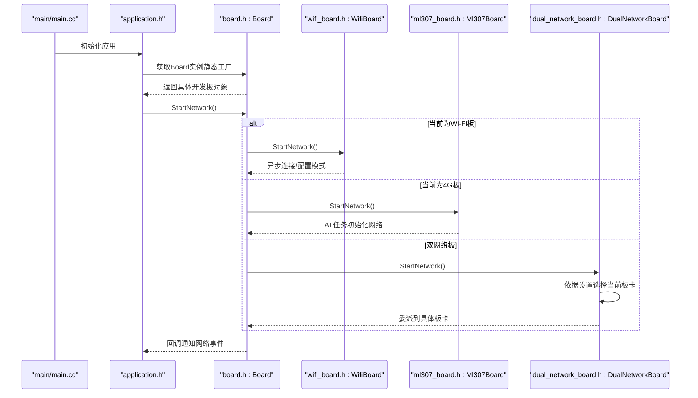
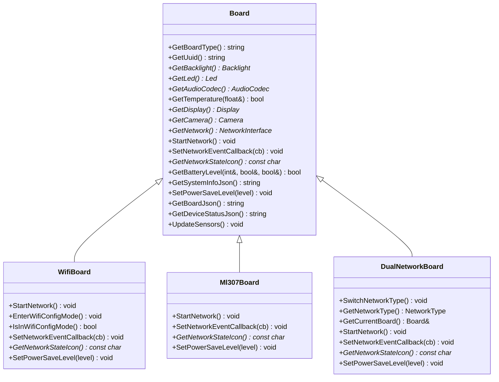
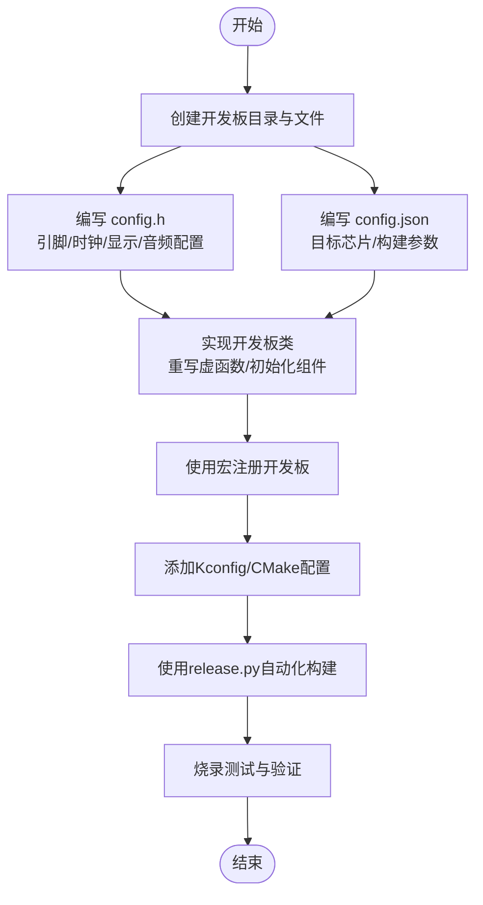
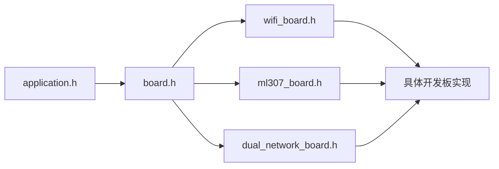

# 硬件支持

<cite>
**本文引用的文件**   
- [main.cc](file://main/main.cc)
- [application.h](file://main/application.h)
- [board.h](file://main/boards/common/board.h)
- [board.cc](file://main/boards/common/board.cc)
- [wifi_board.h](file://main/boards/common/wifi_board.h)
- [ml307_board.h](file://main/boards/common/ml307_board.h)
- [dual_network_board.h](file://main/boards/common/dual_network_board.h)
- [custom-board.md](file://docs/custom-board.md)
- [README.md](file://README.md)
- [esp32s3-korvo2-v3/config.h](file://main/boards/esp32s3-korvo2-v3/config.h)
- [df-k10/config.h](file://main/boards/df-k10/config.h)
- [m5stack-core-s3/config.h](file://main/boards/m5stack-core-s3/config.h)
- [lilygo-t-display-p4/config.h](file://main/boards/lilygo-t-display-p4/config.h)
- [electron-bot/config.h](file://main/boards/electron-bot/config.h)
</cite>

## 目录
1. [简介](#简介)
2. [项目结构](#项目结构)
3. [核心组件](#核心组件)
4. [架构总览](#架构总览)
5. [详细组件分析](#详细组件分析)
6. [依赖分析](#依赖分析)
7. [性能考虑](#性能考虑)
8. [故障排查指南](#故障排查指南)
9. [结论](#结论)
10. [附录](#附录)

## 简介
本文件面向ESP32-AI项目的硬件支持体系，系统化阐述硬件抽象层（HAL）设计理念与Board接口实现方式，梳理70+开源硬件平台的分类与差异，提供新增硬件的完整流程与最佳实践，并给出兼容性矩阵、推荐组合、升级迁移方案以及测试验证方法。目标是帮助开发者快速理解并高效扩展硬件支持。

## 项目结构
项目采用“应用层-硬件抽象层-具体开发板”的分层架构：
- 应用入口与主循环位于顶层，负责系统初始化、事件调度与状态机运行。
- 硬件抽象层定义统一的Board接口，屏蔽不同开发板的差异，向上提供稳定的API。
- 具体开发板在各自目录下实现Board接口，按需组合网络、显示、音频、传感器等子系统。
- 文档与脚本提供自定义开发板的指导与自动化构建流程。

**图示来源**
- [main.cc:14-29](file://main/main.cc#L14-L29)
- [application.h:50-194](file://main/application.h#L50-L194)
- [board.h:49-86](file://main/boards/common/board.h#L49-L86)
- [wifi_board.h:9-67](file://main/boards/common/wifi_board.h#L9-L67)
- [ml307_board.h:9-36](file://main/boards/common/ml307_board.h#L9-L36)
- [dual_network_board.h:16-58](file://main/boards/common/dual_network_board.h#L16-L58)

**章节来源**
- [main.cc:14-29](file://main/main.cc#L14-L29)
- [application.h:50-194](file://main/application.h#L50-L194)
- [board.h:49-86](file://main/boards/common/board.h#L49-L86)

## 核心组件
- Board接口：定义统一的硬件能力抽象，包括获取板型、网络、显示、音频、LED、背光、温度/电量、系统信息、电源策略等。
- WifiBoard：封装Wi-Fi连接流程、配置模式、网络事件回调与状态图标。
- Ml307Board：封装AT模组（ML307）网络初始化任务、事件回调与状态图标。
- DualNetworkBoard：在Wi-Fi与ML307之间动态切换，持久化网络类型并委派调用。

这些组件通过虚函数与工厂式创建（宏）对接具体开发板实现，保证上层应用无需感知底层差异。

**章节来源**
- [board.h:49-86](file://main/boards/common/board.h#L49-L86)
- [board.cc:15-46](file://main/boards/common/board.cc#L15-L46)
- [wifi_board.h:9-67](file://main/boards/common/wifi_board.h#L9-L67)
- [ml307_board.h:9-36](file://main/boards/common/ml307_board.h#L9-L36)
- [dual_network_board.h:16-58](file://main/boards/common/dual_network_board.h#L16-L58)

## 架构总览
下图展示从应用入口到具体开发板实现的调用链与职责划分：

**图示来源**
- [main.cc:14-29](file://main/main.cc#L14-L29)
- [application.h:65-120](file://main/application.h#L65-L120)
- [board.h:62-65](file://main/boards/common/board.h#L62-L65)
- [wifi_board.h:49-61](file://main/boards/common/wifi_board.h#L49-L61)
- [ml307_board.h:29-35](file://main/boards/common/ml307_board.h#L29-L35)
- [dual_network_board.h:51-57](file://main/boards/common/dual_network_board.h#L51-L57)

## 详细组件分析

### 硬件抽象层与Board接口
- 设计理念
  - 统一接口：通过纯虚函数约束具体开发板必须实现的能力，如获取板型、网络、显示、音频等。
  - 工厂模式：通过全局工厂函数与宏实现“静态单例”式创建，避免上层硬编码板型。
  - 可选能力：对非必需能力（如显示、电池、温度）提供默认实现或空实现，降低适配成本。
  - 系统信息：统一输出系统信息JSON，便于云端诊断与OTA校验。
- 关键点
  - UUID生成与持久化：首次运行生成UUID并保存，保证设备唯一标识。
  - 网络事件：统一的事件枚举与回调机制，支持Wi-Fi扫描、连接、断开及4G模组特定事件。
  - 电源策略：提供低功耗、平衡、高性能三种等级，便于不同场景权衡。

**图示来源**
- [board.h:49-86](file://main/boards/common/board.h#L49-L86)
- [wifi_board.h:9-67](file://main/boards/common/wifi_board.h#L9-L67)
- [ml307_board.h:9-36](file://main/boards/common/ml307_board.h#L9-L36)
- [dual_network_board.h:16-58](file://main/boards/common/dual_network_board.h#L16-L58)

**章节来源**
- [board.h:49-86](file://main/boards/common/board.h#L49-L86)
- [board.cc:15-46](file://main/boards/common/board.cc#L15-L46)

### Wi-Fi开发板（WifiBoard）
- 能力要点
  - 异步启动网络，内部维护连接定时器与配置模式状态。
  - 提供进入配置模式的线程安全接口，支持超时回调。
  - 统一网络事件回调，便于UI与业务层响应。
- 适用场景
  - 适用于具备Wi-Fi能力的开发板，如常见ESP32-S3、ESP32-C3等。

**章节来源**
- [wifi_board.h:9-67](file://main/boards/common/wifi_board.h#L9-L67)

### 4G开发板（Ml307Board）
- 能力要点
  - 通过AT模组（ML307）进行网络初始化，独立任务处理网络状态。
  - 统一网络事件回调，包含模组检测、SIM缺失、注册拒绝、初始化失败、超时等。
- 适用场景
  - 适用于带4G Cat.1模块的开发板，如部分“Compact”系列与移动版。

**章节来源**
- [ml307_board.h:9-36](file://main/boards/common/ml307_board.h#L9-L36)

### 双网络开发板（DualNetworkBoard）
- 能力要点
  - 在Wi-Fi与ML307之间动态切换，持久化网络类型。
  - 委派当前活动板卡的全部能力，保持上层透明。
- 适用场景
  - 适用于需要灵活选择网络类型的设备，如可插拔4G模块的开发板。

**章节来源**
- [dual_network_board.h:16-58](file://main/boards/common/dual_network_board.h#L16-L58)

### 新硬件添加指南（自定义开发板）
- 目录与文件
  - 开发板目录：包含主实现文件、config.h、config.json、README.md。
  - config.h：定义引脚、时钟、显示参数、音频采样率与I2S/I2C配置等。
  - config.json：目标芯片、构建参数（如Flash大小、分区表、语言、唤醒词等）。
- 实现步骤
  - 创建目录与文件；编写config.h与config.json；实现开发板类，重写必要虚函数；使用宏注册。
  - 在构建系统中添加Kconfig与CMake配置项，确保编译与资源选择正确。
  - 使用release.py脚本一键完成配置、编译与打包。
- 注意事项
  - 不同IO配置时，必须新建开发板类型，避免覆盖原有固件导致OTA回退风险。
  - 字体与表情集合需根据屏幕分辨率合理选择。

**图示来源**
- [custom-board.md:20-389](file://docs/custom-board.md#L20-L389)

**章节来源**
- [custom-board.md:1-453](file://docs/custom-board.md#L1-L453)

### 硬件平台分类与差异
- 开发板（Wi-Fi）
  - 示例：esp32s3-korvo2-v3、df-k10、m5stack-core-s3、lilygo-t-display-p4等。
  - 差异：音频采样率、I2S引脚、编解码器地址、显示尺寸与方向、摄像头引脚与像素时钟等。
- AI摄像头
  - 示例：lilygo-t-cameraplus-s3、zhengchen-cam、sensecap-watcher等。
  - 差异：摄像头接口（OV系列）、IR滤光片控制、MIPI/LCD屏适配、音频编解码器集成度。
- 机器人
  - 示例：electron-bot、otto-robot等。
  - 差异：舵机/电机控制引脚、姿态传感器、自定义显示与交互。
- 显示设备
  - 示例：ST7789/ILI9341/QSPI屏、AMOLED、EPD、触摸屏等。
  - 差异：SPI/QSPI/DSI接口、色彩格式、分辨率、触摸控制器、背光控制。

**章节来源**
- [README.md:51-103](file://README.md#L51-L103)
- [esp32s3-korvo2-v3/config.h:7-81](file://main/boards/esp32s3-korvo2-v3/config.h#L7-L81)
- [df-k10/config.h:6-77](file://main/boards/df-k10/config.h#L6-L77)
- [m5stack-core-s3/config.h:8-67](file://main/boards/m5stack-core-s3/config.h#L8-L67)
- [lilygo-t-display-p4/config.h:51-77](file://main/boards/lilygo-t-display-p4/config.h#L51-L77)
- [electron-bot/config.h:6-52](file://main/boards/electron-bot/config.h#L6-L52)

### 性能特点与适用场景
- 音频
  - 采样率与I2S引脚决定音质与CPU占用；部分开发板支持麦克风阵列（ES7210）提升拾音效果。
- 显示
  - 屏幕尺寸与色彩格式影响渲染性能；高分辨率与触摸屏会增加内存与带宽压力。
- 网络
  - Wi-Fi适合室内稳定环境；4G适合移动场景但功耗较高；双网络板可在两者间切换。
- 电源
  - 部分开发板集成PMIC与电量监测，支持低功耗模式；需结合负载与使用场景选择策略。

**章节来源**
- [board.h:36-40](file://main/boards/common/board.h#L36-L40)
- [board.cc:48-54](file://main/boards/common/board.cc#L48-L54)

### 硬件兼容性矩阵与推荐组合
- 兼容性矩阵（示意）
  - 芯片平台：ESP32-C3、ESP32-S3、ESP32-P4、ESP32-C6、ESP32-P4等。
  - 网络：Wi-Fi（通用）、ML307（Cat.1）、双网络切换。
  - 显示：SPI/DSI/QSPI屏、AMOLED、EPD、触摸屏。
  - 摄像头：OV系列、SC系列、MIPI接口。
  - 机器人：舵机/步进电机、IMU、自定义显示。
- 推荐组合
  - 语音交互+显示：ESP32-S3 + ST7789/ILI9341 + ES8311/ES7210。
  - 移动场景：ESP32-S3 + ML307 + 小尺寸OLED。
  - 教育/教学：ESP32-C3 + 触摸屏 + 机器人套件。
- 升级迁移
  - v2分区表与v1不兼容，OTA不可直接从v1升级至v2；可通过手动刷写升级。
  - 自定义开发板需保持唯一标识，避免OTA覆盖。

**章节来源**
- [README.md:17-21](file://README.md#L17-L21)
- [README.md:34](file://README.md#L34)

### 测试与验证方法
- 硬件测试
  - 显示：检查分辨率、色彩、镜像/翻转、触摸（若支持）。
  - 音频：播放测试音、录音测试、回音抑制（AEC）验证。
  - 网络：Wi-Fi连通性、4G信号强度、切换稳定性、超时与错误事件。
  - 传感器：温度/电量读数、按键/按钮响应。
- 软件验证
  - 应用初始化日志、系统信息JSON输出、OTA升级流程。
  - 事件回调与UI联动、状态机流转、异常恢复。

**章节来源**
- [board.cc:70-178](file://main/boards/common/board.cc#L70-L178)
- [application.h:65-120](file://main/application.h#L65-L120)

## 依赖分析
- 组件耦合
  - 应用层仅依赖Board接口，不直接依赖具体开发板，耦合度低、内聚性强。
  - WifiBoard/Ml307Board/DualNetworkBoard分别封装不同网络栈，避免重复代码。
- 外部依赖
  - ESP-IDF驱动（I2C/SPI/I2S/ADC/定时器/事件组/FreeRTOS）。
  - 第三方库（LVGL、ESP-SR、OPUS等，由构建系统集成）。
- 循环依赖
  - 未发现直接循环依赖；通过头文件前置声明与延迟绑定避免问题。

**图示来源**
- [application.h:50-194](file://main/application.h#L50-L194)
- [board.h:49-86](file://main/boards/common/board.h#L49-L86)
- [wifi_board.h:9-67](file://main/boards/common/wifi_board.h#L9-L67)
- [ml307_board.h:9-36](file://main/boards/common/ml307_board.h#L9-L36)
- [dual_network_board.h:16-58](file://main/boards/common/dual_network_board.h#L16-L58)

**章节来源**
- [application.h:50-194](file://main/application.h#L50-L194)
- [board.h:49-86](file://main/boards/common/board.h#L49-L86)

## 性能考虑
- 功耗优化
  - 合理选择PowerSaveLevel；在待机/空闲时启用低功耗模式。
  - 关闭不必要的外设与显示背光；利用睡眠定时器。
- 渲染与音频
  - 根据屏幕分辨率选择合适字体与表情集；减少刷新频率。
  - 控制音频采样率与缓冲深度，平衡音质与CPU占用。
- 网络
  - Wi-Fi优先于4G；在弱信号场景自动切换；合理设置超时与重试策略。

## 故障排查指南
- 显示异常
  - 检查SPI/QSPI/DSI配置、分辨率与色彩格式、镜像/翻转设置。
- 音频无声/杂音
  - 核对I2S引脚、采样率、编解码器地址与PA使能引脚。
- 无法联网
  - Wi-Fi：检查SSID/密码、配置模式、超时设置。
  - 4G：检查SIM卡、信号强度、AT命令响应、事件回调。
- OTA失败
  - 确认分区表版本与目标芯片；避免覆盖自定义固件；必要时手动刷写。

**章节来源**
- [custom-board.md:442-447](file://docs/custom-board.md#L442-L447)
- [board.h:20-33](file://main/boards/common/board.h#L20-L33)

## 结论
ESP32-AI通过清晰的硬件抽象层与标准化的Board接口，有效屏蔽了70+开源硬件平台的差异，使应用层与上层服务获得一致体验。配合完善的自定义开发板流程、兼容性矩阵与测试验证方法，开发者可快速扩展新硬件并稳定交付产品。建议在新硬件接入时严格遵循配置规范与OTA策略，确保长期可维护性与可升级性。

## 附录
- 快速参考
  - 新增开发板：创建目录 → 编写config.h/config.json → 实现类与注册 → 构建系统配置 → release.py自动化构建。
  - 网络选择：Wi-Fi优先；4G用于移动场景；双网络板按需切换。
  - 升级注意：v2与v1不兼容，OTA不可直连；自定义板需保持唯一标识。