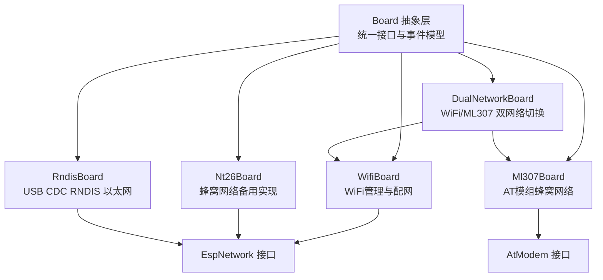
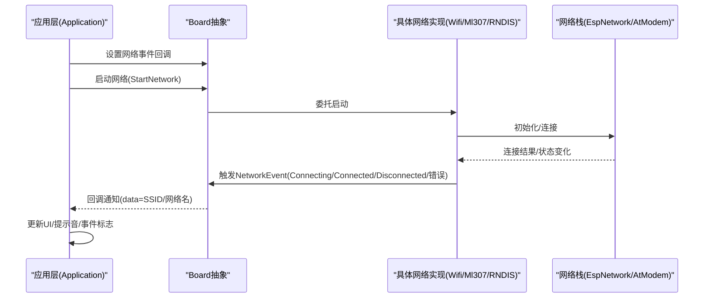
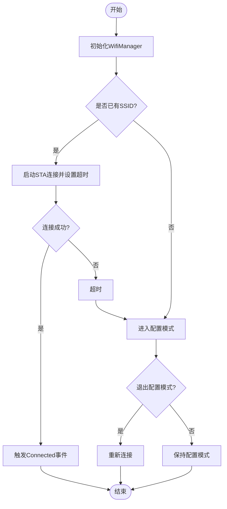
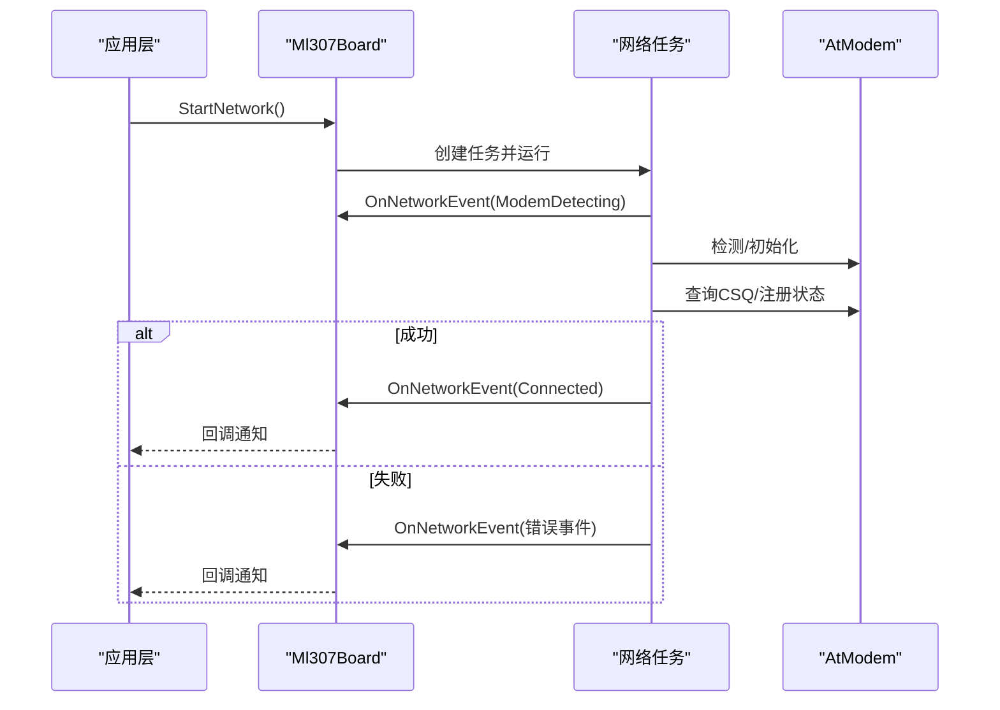
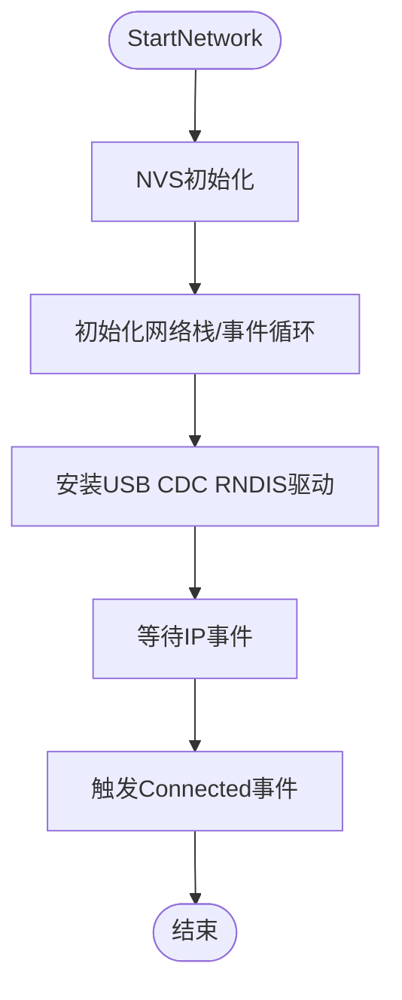
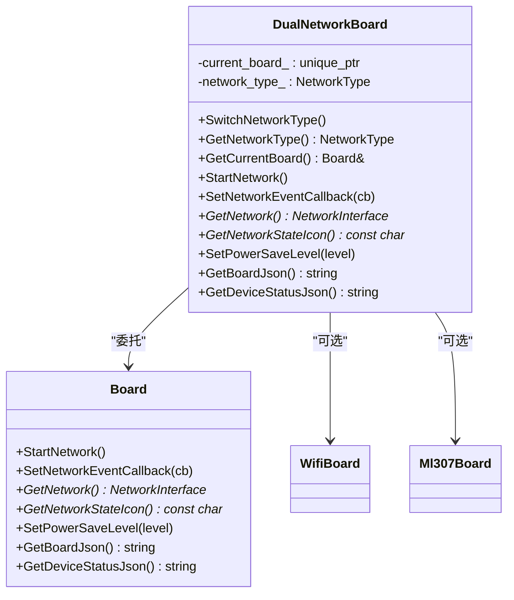
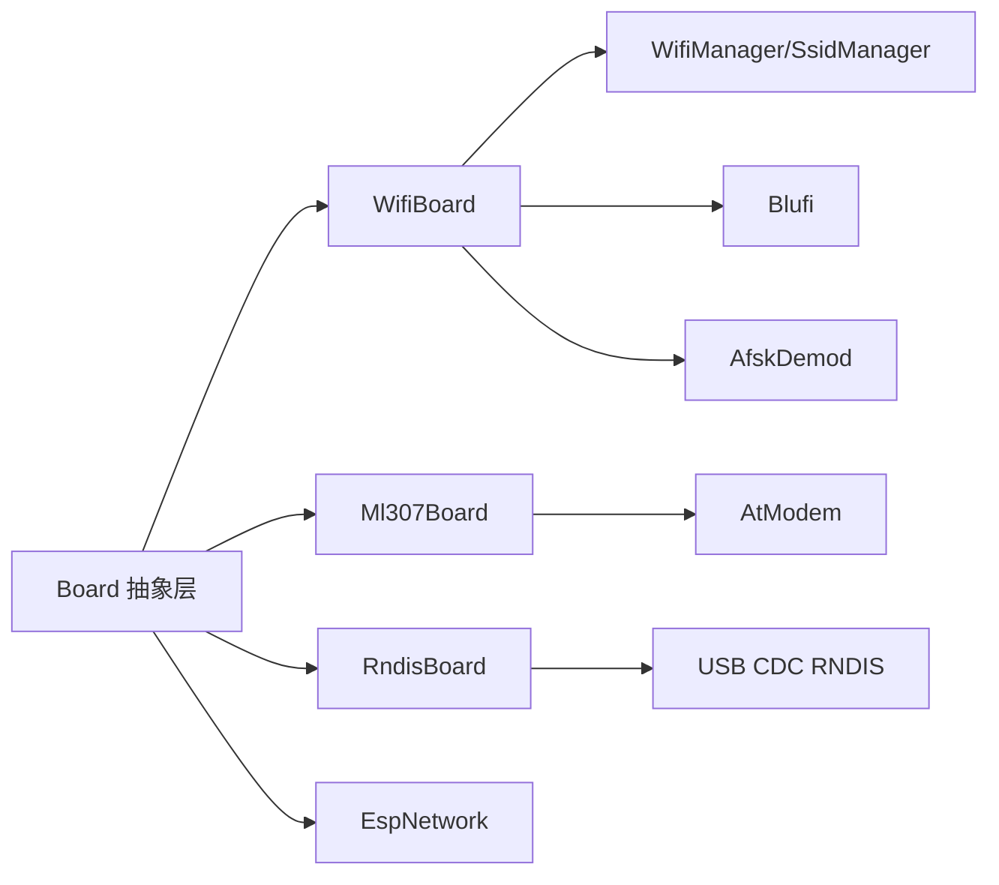

# 网络模块

<cite>
**本文档引用的文件**
- [board.h](file://main/boards/common/board.h)
- [board.cc](file://main/boards/common/board.cc)
- [wifi_board.h](file://main/boards/common/wifi_board.h)
- [wifi_board.cc](file://main/boards/common/wifi_board.cc)
- [ml307_board.h](file://main/boards/common/ml307_board.h)
- [ml307_board.cc](file://main/boards/common/ml307_board.cc)
- [nt26_board.h](file://main/boards/common/nt26_board.h)
- [nt26_board.cc](file://main/boards/common/nt26_board.cc)
- [rndis_board.h](file://main/boards/common/rndis_board.h)
- [rndis_board.cc](file://main/boards/common/rndis_board.cc)
- [dual_network_board.h](file://main/boards/common/dual_network_board.h)
- [dual_network_board.cc](file://main/boards/common/dual_network_board.cc)
- [application.cc](file://main/application.cc)
- [config.json（bread-compact-ml307）](file://main/boards/bread-compact-ml307/config.json)
- [config.json（bread-compact-wifi）](file://main/boards/bread-compact-wifi/config.json)
- [websocket.md](file://docs/websocket.md)
</cite>

## 目录
1. [简介](#简介)
2. [项目结构](#项目结构)
3. [核心组件](#核心组件)
4. [架构总览](#架构总览)
5. [详细组件分析](#详细组件分析)
6. [依赖关系分析](#依赖关系分析)
7. [性能考虑](#性能考虑)
8. [故障排查指南](#故障排查指南)
9. [结论](#结论)
10. [附录](#附录)

## 简介
本文件面向ESP32-AI项目的网络模块，系统性梳理并说明以下支持的网络通信模块：
- ML307 4G模块：基于AT命令的蜂窝数据与语音能力，适用于移动场景。
- RNDIS网络适配器：通过USB CDC RNDIS在ESP32S3/P4上实现以太网直连，适合开发与测试。
- WiFi模块：集成ESP-WHO/WiFi管理栈，支持热点配置、自动连接、以及多种配网方式（含声学/Blufi）。

文档涵盖各模块的通信协议、连接方式、数据传输能力、初始化与配置流程、事件回调与错误处理、性能优化策略、信号质量监控与故障诊断，并提供实际部署与调试建议。

## 项目结构
网络相关代码主要位于“main/boards/common”目录下，采用统一的Board抽象层，按功能拆分为多个具体板卡类；同时提供双网络切换板（DualNetworkBoard）用于在WiFi与ML307之间动态切换。

图表来源
- [board.h:49-86](file://main/boards/common/board.h#L49-L86)
- [wifi_board.h:9-67](file://main/boards/common/wifi_board.h#L9-L67)
- [ml307_board.h:9-36](file://main/boards/common/ml307_board.h#L9-L36)
- [nt26_board.h:48-60](file://main/boards/common/nt26_board.h#L48-L60)
- [rndis_board.h:17-71](file://main/boards/common/rndis_board.h#L17-L71)
- [dual_network_board.h:16-58](file://main/boards/common/dual_network_board.h#L16-L58)

章节来源
- [board.h:1-94](file://main/boards/common/board.h#L1-L94)
- [board.cc:1-179](file://main/boards/common/board.cc#L1-L179)

## 核心组件
- Board抽象层：定义统一的网络接口、事件回调、电源策略、状态查询等能力，确保上层应用与UI无需关心底层差异。
- WifiBoard：封装WiFi扫描、连接、配置模式（热点/声学/Blufi）与RSSI信号强度图标映射。
- Ml307Board：封装AT模组检测、注册、CSQ信号强度、错误事件上报与状态图标映射。
- Nt26Board：蜂窝模组的另一种实现，提供PM锁与定时器，支持信号强度与注册状态查询。
- RndisBoard：在ESP32S3/P4上安装USB CDC RNDIS驱动，桥接主机以太网，获取IP后通知事件。
- DualNetworkBoard：在WiFi与ML307之间切换，持久化网络类型并在重启后生效。

章节来源
- [board.h:17-86](file://main/boards/common/board.h#L17-L86)
- [wifi_board.h:9-67](file://main/boards/common/wifi_board.h#L9-L67)
- [ml307_board.h:9-36](file://main/boards/common/ml307_board.h#L9-L36)
- [nt26_board.h:48-60](file://main/boards/common/nt26_board.h#L48-L60)
- [rndis_board.h:17-71](file://main/boards/common/rndis_board.h#L17-L71)
- [dual_network_board.h:9-58](file://main/boards/common/dual_network_board.h#L9-L58)

## 架构总览
网络模块整体遵循“Board抽象 + 具体实现 + 应用回调”的分层设计。Board统一事件模型（NetworkEvent），由具体板卡在不同阶段触发；应用层（Application）订阅事件并更新UI、播放提示音、设置事件标志位。

图表来源
- [board.h:18-44](file://main/boards/common/board.h#L18-L44)
- [wifi_board.cc:52-87](file://main/boards/common/wifi_board.cc#L52-L87)
- [ml307_board.cc:134-141](file://main/boards/common/ml307_board.cc#L134-L141)
- [rndis_board.cc:30-57](file://main/boards/common/rndis_board.cc#L30-L57)
- [application.cc:127-156](file://main/application.cc#L127-L156)

## 详细组件分析

### WiFi模块（WifiBoard）
- 通信协议与连接方式
  - 使用ESP-WHO/WiFi管理栈，支持STA模式自动连接与AP配置模式。
  - 支持热点配网、声学配网（音频采集SSID/PWD）、Blufi配网。
  - 连接超时（默认约60秒）自动进入配置模式。
- 数据传输能力
  - 通过EspNetwork接口对外提供网络能力，支持获取SSID、RSSI、信道、IP等信息。
- 初始化与配置
  - 初始化WifiManager，设置事件回调，尝试连接或进入配置模式。
  - 配置模式中显示提示信息，引导用户通过浏览器或声学方式完成配网。
- 事件与错误处理
  - 统一映射为NetworkEvent：Scanning/Connecting/Connected/Disconnected/WifiConfigModeEnter/Exit。
  - 超时自动进入配置模式；退出配置模式后重新尝试连接。
- 性能与功耗
  - 支持设置WiFi省电等级（低功耗/平衡/高性能），影响PM策略与CPU频率。
- 信号质量监控
  - RSSI阈值映射为弱/中/强图标，便于UI直观展示。

图表来源
- [wifi_board.cc:52-104](file://main/boards/common/wifi_board.cc#L52-L104)
- [wifi_board.cc:151-157](file://main/boards/common/wifi_board.cc#L151-L157)
- [wifi_board.cc:159-197](file://main/boards/common/wifi_board.cc#L159-L197)
- [wifi_board.cc:244-266](file://main/boards/common/wifi_board.cc#L244-L266)

章节来源
- [wifi_board.h:9-67](file://main/boards/common/wifi_board.h#L9-L67)
- [wifi_board.cc:29-358](file://main/boards/common/wifi_board.cc#L29-L358)
- [application.cc:127-156](file://main/application.cc#L127-L156)

### ML307 4G模块（Ml307Board）
- 通信协议与连接方式
  - 基于AT命令的蜂窝网络，通过AtModem接口进行检测、注册、获取IMSI/ICCID/CSQ等。
  - 注册失败、无SIM、初始化失败、超时等错误均映射为NetworkEvent。
- 数据传输能力
  - 提供网络就绪判断、CSQ信号强度查询、运营商/版本/IMEI/ICCID等信息。
- 初始化与配置
  - 在独立任务中执行检测与注册流程，避免阻塞主线程。
  - 通过回调上报“检测中/注册中/已连接/断开/错误”等状态。
- 事件与错误处理
  - 错误事件包括无SIM、注册被拒、初始化失败、超时等，配合日志与UI提示。
- 性能与功耗
  - 当前未实现特定省电策略，保留扩展空间。
- 信号质量监控
  - CSQ区间映射为弱/一般/好/强图标，异常CSQ返回关闭图标。

图表来源
- [ml307_board.cc:134-141](file://main/boards/common/ml307_board.cc#L134-L141)
- [ml307_board.cc:31-65](file://main/boards/common/ml307_board.cc#L31-L65)
- [ml307_board.cc:147-166](file://main/boards/common/ml307_board.cc#L147-L166)

章节来源
- [ml307_board.h:9-36](file://main/boards/common/ml307_board.h#L9-L36)
- [ml307_board.cc:20-184](file://main/boards/common/ml307_board.cc#L20-L184)
- [application.cc:166-181](file://main/application.cc#L166-L181)

### RNDIS网络适配器（RndisBoard）
- 通信协议与连接方式
  - 在ESP32S3/P4上安装USB CDC RNDIS驱动，桥接主机以太网，等待获得IP地址。
  - 通过事件回调上报连接/断开状态。
- 数据传输能力
  - 作为网络接口提供者，结合系统网络栈完成TCP/IP数据传输。
- 初始化与配置
  - 初始化NVS、网络栈与事件循环，注册以太网事件处理器。
  - 安装RNDIS驱动并挂载netif，等待IP事件。
- 事件与错误处理
  - 连接/断开事件映射为NetworkEvent；断开时清除IP标志。
- 性能与功耗
  - 当前未实现省电策略，保留扩展空间。
- 信号质量监控
  - 以太网场景不适用CSQ/RSSI，统一返回强信号图标。

图表来源
- [rndis_board.cc:30-57](file://main/boards/common/rndis_board.cc#L30-L57)
- [rndis_board.cc:118-170](file://main/boards/common/rndis_board.cc#L118-L170)
- [rndis_board.cc:90-112](file://main/boards/common/rndis_board.cc#L90-L112)

章节来源
- [rndis_board.h:17-71](file://main/boards/common/rndis_board.h#L17-L71)
- [rndis_board.cc:20-247](file://main/boards/common/rndis_board.cc#L20-L247)

### 双网络切换（DualNetworkBoard）
- 功能概述
  - 在WiFi与ML307之间动态切换，持久化网络类型至Settings，重启后生效。
  - 切换时显示提示并触发系统重启以加载新网络栈。
- 实现要点
  - 仅初始化当前选中的板卡实例，减少资源占用。
  - 所有接口委托给当前板卡，保证行为一致。

图表来源
- [dual_network_board.h:16-58](file://main/boards/common/dual_network_board.h#L16-L58)
- [dual_network_board.cc:10-99](file://main/boards/common/dual_network_board.cc#L10-L99)

章节来源
- [dual_network_board.h:9-58](file://main/boards/common/dual_network_board.h#L9-L58)
- [dual_network_board.cc:23-57](file://main/boards/common/dual_network_board.cc#L23-L57)

## 依赖关系分析
- 组件耦合
  - Board抽象层向上屏蔽具体实现差异，向下依赖具体网络接口（EspNetwork/AtModem）。
  - WifiBoard依赖WifiManager/SsidManager/Blufi/AfskDemod等子系统。
  - Ml307Board依赖AtModem与FreeRTOS任务。
  - RndisBoard依赖USB CDC RNDIS与以太网栈。
- 外部依赖
  - ESP-IDF网络栈、事件框架、定时器、日志系统。
  - 配网相关：Blufi、声学配网、热点配网。
- 循环依赖
  - 未见直接循环依赖；事件回调通过Board统一转发，避免紧耦合。

图表来源
- [board.h:4-16](file://main/boards/common/board.h#L4-L16)
- [wifi_board.cc:1-22](file://main/boards/common/wifi_board.cc#L1-L22)
- [ml307_board.h:4-6](file://main/boards/common/ml307_board.h#L4-L6)
- [rndis_board.cc:4-13](file://main/boards/common/rndis_board.cc#L4-L13)

章节来源
- [board.h:1-94](file://main/boards/common/board.h#L1-L94)

## 性能考虑
- WiFi省电策略
  - 通过SetPowerSaveLevel设置低功耗/平衡/高性能模式，影响PM锁与CPU频率。
- 4G模组
  - 当前未实现省电策略，可在后续版本中引入睡眠/DTIM等机制。
- RNDIS
  - 以太网直连通常稳定且带宽高，注意USB供电与线缆质量。
- 信号质量
  - WiFi：依据RSSI阈值映射图标；4G：依据CSQ区间映射图标。
- 事件与UI
  - 应用层根据事件及时更新UI与提示音，避免长时间阻塞。

章节来源
- [wifi_board.cc:284-299](file://main/boards/common/wifi_board.cc#L284-L299)
- [ml307_board.cc:181-184](file://main/boards/common/ml307_board.cc#L181-L184)
- [nt26_board.cc:161-178](file://main/boards/common/nt26_board.cc#L161-L178)
- [rndis_board.cc:191-193](file://main/boards/common/rndis_board.cc#L191-L193)

## 故障排查指南
- WiFi连接失败
  - 检查热点密码、路由器限制、信号强度；确认是否进入配置模式并完成配网。
  - 关注超时自动进入配置模式的行为。
- 4G模块无SIM/注册失败
  - 确认SIM卡正确插入与激活；查看无SIM/注册被拒/初始化失败/超时等错误事件。
  - 监控CSQ与注册状态，必要时重置或更换位置。
- RNDIS无法获得IP
  - 确认USB线缆与主机驱动；检查RNDIS驱动安装与netif挂载。
- 事件与日志
  - 应用层对关键事件进行UI提示与声音反馈；结合日志定位问题。
- WebSocket错误处理参考
  - 参考文档对连接失败与服务器断开的处理流程，有助于理解网络层错误传播。

章节来源
- [application.cc:127-182](file://main/application.cc#L127-L182)
- [ml307_board.cc:31-65](file://main/boards/common/ml307_board.cc#L31-L65)
- [wifi_board.cc:151-157](file://main/boards/common/wifi_board.cc#L151-L157)
- [rndis_board.cc:134-147](file://main/boards/common/rndis_board.cc#L134-L147)
- [websocket.md:369-380](file://docs/websocket.md#L369-L380)

## 结论
本项目通过Board抽象层实现了WiFi、4G与RNDIS三种网络路径的统一接入与事件管理。WifiBoard覆盖主流配网方式与省电策略；Ml307Board提供蜂窝网络能力与信号监控；RndisBoard满足开发与测试场景。DualNetworkBoard进一步增强了灵活性，支持运行时切换。建议在生产环境中结合信号质量与业务需求选择合适网络路径，并完善4G省电策略与错误恢复机制。

## 附录
- 构建配置示例
  - ML307与WiFi开发板的构建配置文件展示了目标芯片与显示配置的差异。
- 事件枚举与回调
  - 统一的NetworkEvent与回调签名，便于跨模块复用与扩展。

章节来源
- [config.json（bread-compact-ml307）:1-17](file://main/boards/bread-compact-ml307/config.json#L1-L17)
- [config.json（bread-compact-wifi）:1-17](file://main/boards/bread-compact-wifi/config.json#L1-L17)
- [board.h:18-44](file://main/boards/common/board.h#L18-L44)