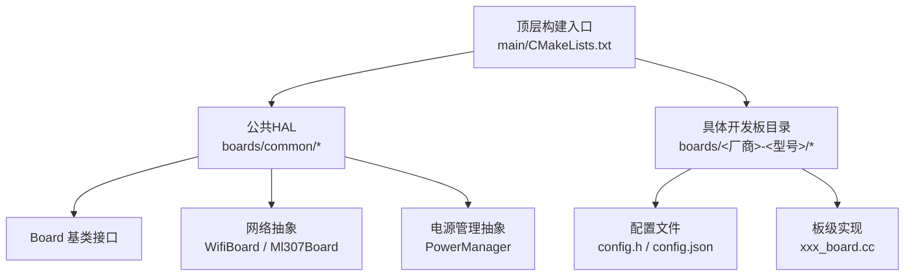
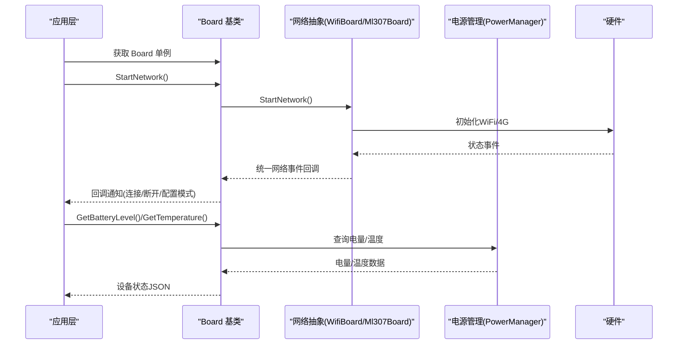
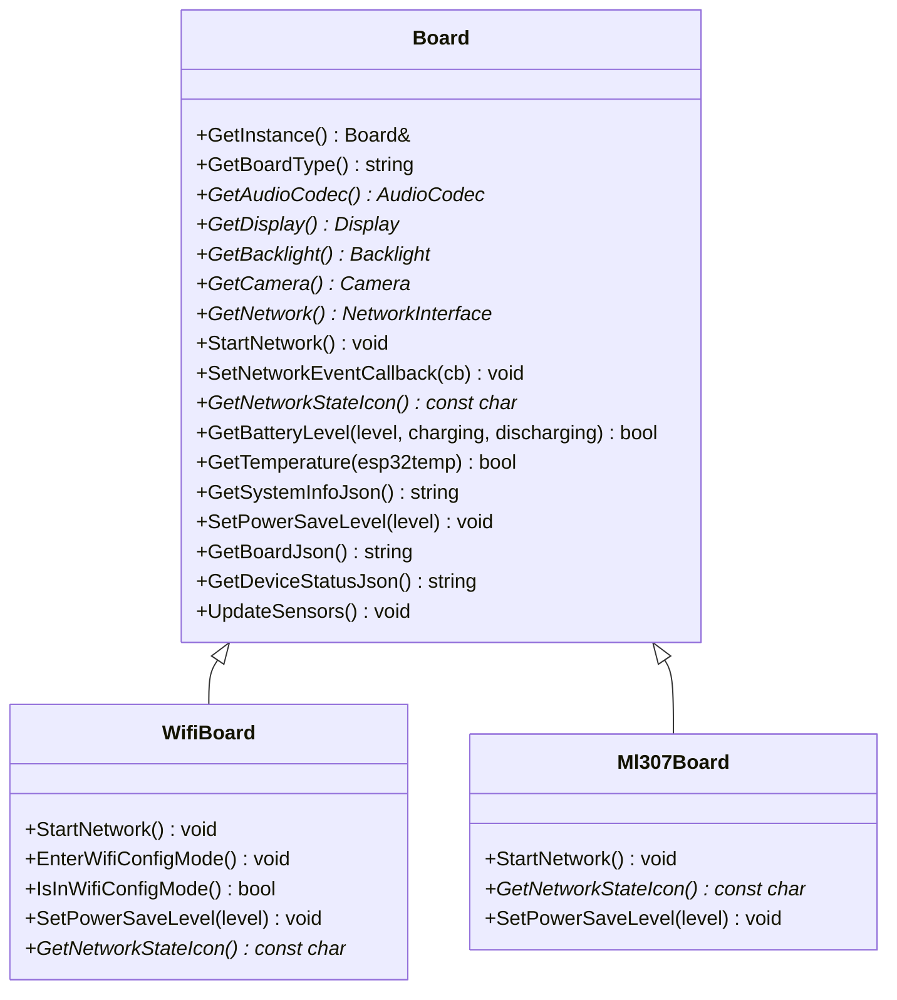
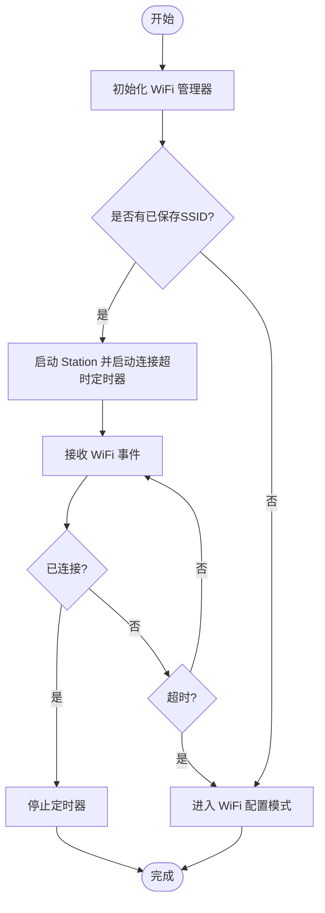
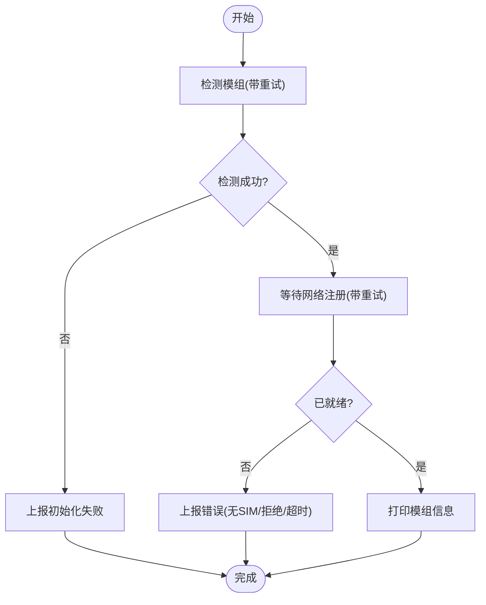
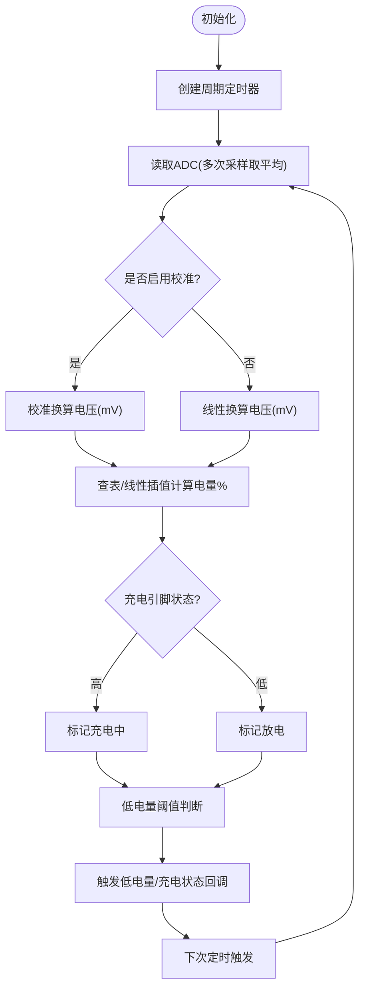
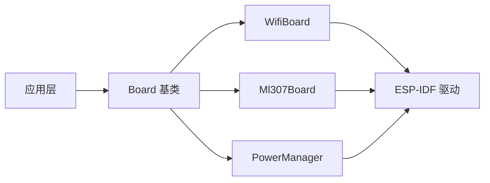

# 自定义硬件开发

<cite>
**本文引用的文件**
- [board.h](file://main/boards/common/board.h)
- [board.cc](file://main/boards/common/board.cc)
- [wifi_board.h](file://main/boards/common/wifi_board.h)
- [wifi_board.cc](file://main/boards/common/wifi_board.cc)
- [ml307_board.h](file://main/boards/common/ml307_board.h)
- [ml307_board.cc](file://main/boards/common/ml307_board.cc)
- [custom-board.md](file://docs/custom-board.md)
- [CMakeLists.txt](file://main/CMakeLists.txt)
- [power_manager.h (aipi-lite)](file://main/boards/aipi-lite/power_manager.h)
- [power_manager.h (esp32s3-korvo2-v3)](file://main/boards/esp32s3-korvo2-v3/power_manager.h)
- [config.h (bread-compact-wifi)](file://main/boards/bread-compact-wifi/config.h)
- [config.h (m5stack-core-s3)](file://main/boards/m5stack-core-s3/config.h)
</cite>

## 目录
1. [简介](#简介)
2. [项目结构](#项目结构)
3. [核心组件](#核心组件)
4. [架构总览](#架构总览)
5. [详细组件分析](#详细组件分析)
6. [依赖分析](#依赖分析)
7. [性能考虑](#性能考虑)
8. [故障排查指南](#故障排查指南)
9. [结论](#结论)
10. [附录](#附录)

## 简介
本指南面向为 ESP32-AI 项目新增自定义硬件平台的开发者，系统讲解硬件抽象层（HAL）的设计原则、Board 接口的实现方法、硬件配置文件的编写规范、引脚定义的标准格式以及电源管理的实现策略。文档提供从硬件设计到软件集成的完整流程，并包含硬件兼容性测试、性能验证与问题诊断的方法，以及实际的自定义硬件开发案例与最佳实践。

## 项目结构
ESP32-AI 采用“按板级目录组织”的结构，每个开发板在 main/boards/<厂商>-<型号>/ 下维护独立的配置与实现；公共 HAL 抽象位于 main/boards/common/。构建系统通过 main/CMakeLists.txt 根据 Kconfig 选择 BOARD_TYPE 并动态加入对应板级源码。

图示来源
- [CMakeLists.txt:97-750](file://main/CMakeLists.txt#L97-L750)

章节来源
- [CMakeLists.txt:97-750](file://main/CMakeLists.txt#L97-L750)

## 核心组件
- Board 基类：定义统一的硬件抽象接口，包括获取音频编解码器、显示、摄像头、网络、背光、温度/电量查询、系统信息与设备状态 JSON 输出等。
- WifiBoard：封装 WiFi 连接流程、配置模式、事件回调与网络图标状态。
- Ml307Board：封装 4G 模组（AT）初始化、检测、注册与信号强度上报。
- PowerManager：抽象电源管理与电池电量采集，提供充电状态与低电量事件回调。

章节来源
- [board.h:49-86](file://main/boards/common/board.h#L49-L86)
- [board.cc:15-178](file://main/boards/common/board.cc#L15-L178)
- [wifi_board.h:9-67](file://main/boards/common/wifi_board.h#L9-L67)
- [wifi_board.cc:29-357](file://main/boards/common/wifi_board.cc#L29-L357)
- [ml307_board.h:9-36](file://main/boards/common/ml307_board.h#L9-L36)
- [ml307_board.cc:20-270](file://main/boards/common/ml307_board.cc#L20-L270)

## 架构总览
下图展示从应用层到硬件抽象层的关键交互路径，包括网络初始化、事件回调与电源管理。

图示来源
- [board.h:68-84](file://main/boards/common/board.h#L68-L84)
- [wifi_board.cc:52-104](file://main/boards/common/wifi_board.cc#L52-L104)
- [ml307_board.cc:134-141](file://main/boards/common/ml307_board.cc#L134-L141)
- [power_manager.h (aipi-lite):9-187](file://main/boards/aipi-lite/power_manager.h#L9-L187)

## 详细组件分析

### Board 接口与实现要点
- 设计原则
  - 单例化访问：通过静态工厂函数 create_board 与 Board::GetInstance 提供全局唯一实例。
  - 可插拔扩展：各板级类仅需实现必要接口，未使用的组件可返回空指针或默认实现。
  - 统一事件模型：网络事件通过 NetworkEvent 枚举与回调统一处理。
- 关键接口
  - GetBoardType、GetAudioCodec、GetDisplay、GetBacklight、GetCamera、GetNetwork、StartNetwork、SetNetworkEventCallback、GetNetworkStateIcon、GetBatteryLevel、GetTemperature、GetSystemInfoJson、SetPowerSaveLevel、GetBoardJson、GetDeviceStatusJson、UpdateSensors。
- 默认行为
  - 未实现的接口返回空指针或默认值，避免上层分支过多。
  - UUID 自动生成并持久化，确保设备唯一标识。

图示来源
- [board.h:49-86](file://main/boards/common/board.h#L49-L86)
- [wifi_board.h:9-67](file://main/boards/common/wifi_board.h#L9-L67)
- [ml307_board.h:9-36](file://main/boards/common/ml307_board.h#L9-L36)

章节来源
- [board.h:49-86](file://main/boards/common/board.h#L49-L86)
- [board.cc:15-178](file://main/boards/common/board.cc#L15-L178)

### WiFi 网络抽象（WifiBoard）
- 功能要点
  - 异步启动网络，内部维护连接超时定时器。
  - 统一网络事件回调，转发至 Board 层统一事件模型。
  - 支持 WiFi 配置模式（热点/蓝牙/WIFI 配置），并在连接成功后释放相关资源。
  - 提供网络状态图标（基于 RSSI）。
- 流程图

图示来源
- [wifi_board.cc:52-104](file://main/boards/common/wifi_board.cc#L52-L104)
- [wifi_board.cc:159-197](file://main/boards/common/wifi_board.cc#L159-L197)
- [wifi_board.cc:284-299](file://main/boards/common/wifi_board.cc#L284-L299)

章节来源
- [wifi_board.h:9-67](file://main/boards/common/wifi_board.h#L9-L67)
- [wifi_board.cc:29-357](file://main/boards/common/wifi_board.cc#L29-L357)

### 4G 网络抽象（Ml307Board）
- 功能要点
  - 检测 4G 模组（AT）并初始化，支持多次重试。
  - 监听网络注册状态变化，上报连接/断开事件。
  - 提供信号强度（CSQ）与运营商信息。
- 流程图

图示来源
- [ml307_board.cc:67-132](file://main/boards/common/ml307_board.cc#L67-L132)
- [ml307_board.cc:147-166](file://main/boards/common/ml307_board.cc#L147-L166)

章节来源
- [ml307_board.h:9-36](file://main/boards/common/ml307_board.h#L9-L36)
- [ml307_board.cc:20-270](file://main/boards/common/ml307_board.cc#L20-L270)

### 电源管理（PowerManager）
- 设计要点
  - 通过定时器周期性读取 ADC 采样，多点均值滤波提升稳定性。
  - 支持充电状态检测与低电量事件回调。
  - 不同板级可选择线性估算或 ADC 校准方案，增强精度。
- 流程图

图示来源
- [power_manager.h (aipi-lite):27-112](file://main/boards/aipi-lite/power_manager.h#L27-L112)
- [power_manager.h (esp32s3-korvo2-v3):57-142](file://main/boards/esp32s3-korvo2-v3/power_manager.h#L57-L142)

章节来源
- [power_manager.h (aipi-lite):9-187](file://main/boards/aipi-lite/power_manager.h#L9-L187)
- [power_manager.h (esp32s3-korvo2-v3):12-250](file://main/boards/esp32s3-korvo2-v3/power_manager.h#L12-L250)

### 硬件配置文件与引脚定义规范
- config.h 规范
  - 音频：采样率、I2S 引脚（WS/BCLK/DIN/DOUT/MCLK）、编解码器 I2C 引脚与地址、功放引脚。
  - 显示：SPI/I2C 引脚、分辨率、镜像/旋转/偏移、背光引脚与极性。
  - 按键与指示灯：按键 GPIO、内置 LED、外设控制（如灯带）。
  - 摄像头：XCLK、D0-D7、VSYNC/HREF/PCLK 等。
- 示例参考
  - bread-compact-wifi：OLED 显示、简单按键与 I2S 引脚配置。
  - m5stack-core-s3：双编解码器地址、I2S MCLK 与麦克风阵列配置、摄像头引脚。

章节来源
- [config.h (bread-compact-wifi):1-60](file://main/boards/bread-compact-wifi/config.h#L1-L60)
- [config.h (m5stack-core-s3):1-67](file://main/boards/m5stack-core-s3/config.h#L1-L67)

### 新硬件添加的完整流程
- 步骤概览
  - 创建开发板目录与文件：config.h、config.json、xxx_board.cc、README.md。
  - 在 Kconfig.projbuild 与 CMakeLists.txt 中注册新板型。
  - 实现板级类，重写必要接口，注册 Board 工厂。
  - 配置 config.json 的 target 与 sdkconfig_append，使用 release.py 自动编译或手动 menuconfig。
  - 编译、烧录、验证网络、显示、音频、电源管理与传感器功能。
- 参考文档
  - 自定义开发板指南：包含目录结构、配置项说明、构建系统配置与常见问题。

章节来源
- [custom-board.md:20-390](file://docs/custom-board.md#L20-L390)
- [CMakeLists.txt:97-750](file://main/CMakeLists.txt#L97-L750)

## 依赖分析
- 组件耦合
  - Board 作为抽象基类，向上层应用提供统一接口；向下依赖具体网络实现（WifiBoard/Ml307Board）与硬件组件（显示/音频/电源）。
  - 构建系统通过 BOARD_TYPE 决定包含哪些板级源码，避免交叉依赖。
- 外部依赖
  - ESP-IDF 驱动（GPIO/I2C/SPI/ADC/Timers/FreeRTOS）。
  - 第三方协议栈（WiFi 管理器、MQTT/WebSocket）。
- 潜在风险
  - 引脚冲突、I2S/ADC 通道占用、电源管理与系统休眠策略不一致。

图示来源
- [board.h:49-86](file://main/boards/common/board.h#L49-L86)
- [wifi_board.h:9-67](file://main/boards/common/wifi_board.h#L9-L67)
- [ml307_board.h:9-36](file://main/boards/common/ml307_board.h#L9-L36)

章节来源
- [board.h:49-86](file://main/boards/common/board.h#L49-L86)
- [CMakeLists.txt:97-750](file://main/CMakeLists.txt#L97-L750)

## 性能考虑
- 电源管理
  - 采用定时器周期采样与多点均值滤波，平衡精度与 CPU 占用。
  - 可根据场景调整采样间隔与样本数量，降低功耗。
- 网络连接
  - WiFi 连接超时与配置模式切换，避免长时间阻塞。
  - 4G 模组检测与注册重试次数限制，防止卡死。
- 显示与音频
  - 显示缓冲区大小与刷新策略影响内存与带宽；音频采样率与通道数影响 CPU 占用。

## 故障排查指南
- 显示异常
  - 检查 SPI/I2C 引脚、分辨率、镜像/旋转/偏移设置是否与硬件一致。
- 音频无声/失真
  - 核对 I2S 引脚映射、采样率、编解码器地址与 PA 引脚。
- 无法联网
  - WiFi：确认 SSID/密码、热点配置模式、RSSI 与超时。
  - 4G：检查 SIM 卡、注册状态、CSQ、模组检测日志。
- 电量读数异常
  - 校准 ADC 或更换线性估算参数；检查充电引脚逻辑电平。
- OTA 升级冲突
  - 确保自定义开发板使用独立 BOARD_TYPE 与 config.json builds.name，避免覆盖标准固件通道。

章节来源
- [custom-board.md:442-447](file://docs/custom-board.md#L442-L447)
- [wifi_board.cc:151-157](file://main/boards/common/wifi_board.cc#L151-L157)
- [ml307_board.cc:104-118](file://main/boards/common/ml307_board.cc#L104-L118)

## 结论
通过清晰的硬件抽象层与标准化的开发流程，ESP32-AI 能够快速适配多样化的硬件平台。遵循本文的接口设计原则、配置规范与测试方法，可显著降低自定义硬件开发的复杂度与风险，提升集成效率与产品一致性。

## 附录
- 快速检查清单
  - config.h 是否完整覆盖音频/显示/按键/摄像头/电源引脚。
  - Kconfig.projbuild 与 CMakeLists.txt 是否注册新板型。
  - config.json target 与 sdkconfig_append 是否正确。
  - 电源管理是否接入充电检测与低电量回调。
  - 网络初始化是否支持配置模式与事件回调。
  - README.md 是否包含编译与烧录步骤。