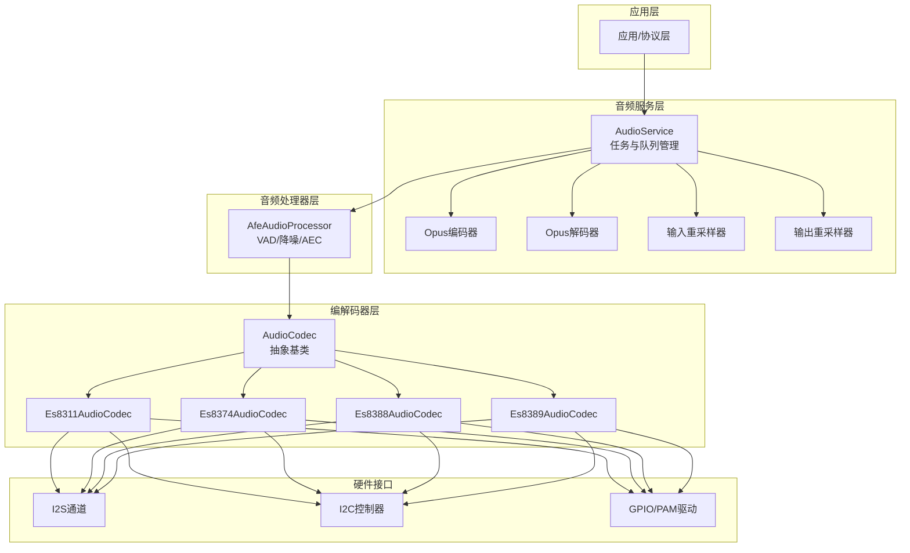
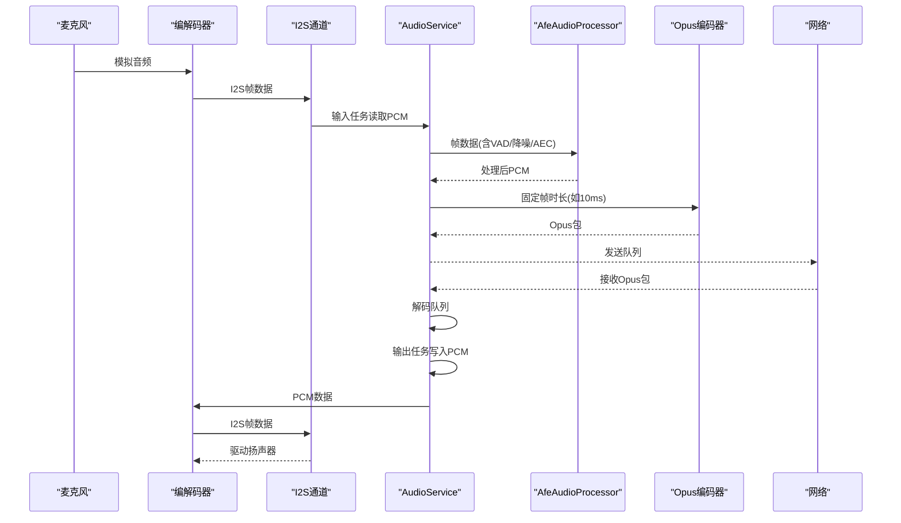
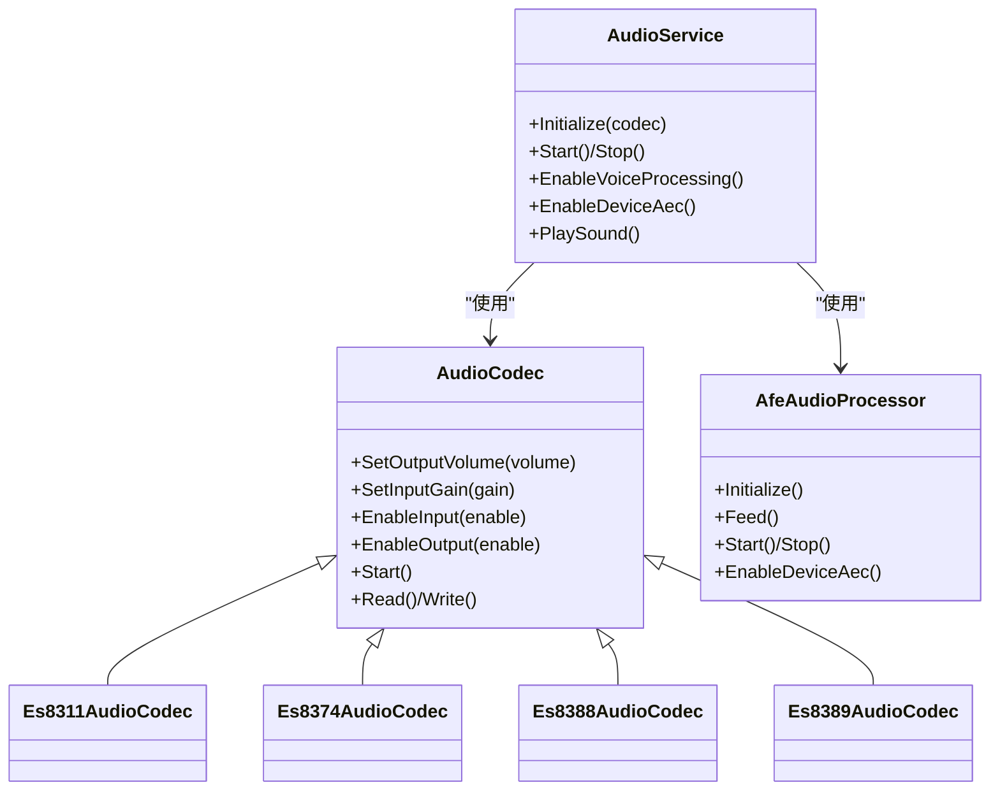

# 音频硬件

<cite>
**本文引用的文件**
- [audio_codec.h](file://main/audio/audio_codec.h)
- [audio_codec.cc](file://main/audio/audio_codec.cc)
- [audio_service.h](file://main/audio/audio_service.h)
- [audio_service.cc](file://main/audio/audio_service.cc)
- [es8311_audio_codec.h](file://main/audio/codecs/es8311_audio_codec.h)
- [es8311_audio_codec.cc](file://main/audio/codecs/es8311_audio_codec.cc)
- [es8374_audio_codec.h](file://main/audio/codecs/es8374_audio_codec.h)
- [es8374_audio_codec.cc](file://main/audio/codecs/es8374_audio_codec.cc)
- [es8388_audio_codec.h](file://main/audio/codecs/es8388_audio_codec.h)
- [es8388_audio_codec.cc](file://main/audio/codecs/es8388_audio_codec.cc)
- [es8389_audio_codec.h](file://main/audio/codecs/es8389_audio_codec.h)
- [es8389_audio_codec.cc](file://main/audio/codecs/es8389_audio_codec.cc)
- [afe_audio_processor.h](file://main/audio/processors/afe_audio_processor.h)
- [afe_audio_processor.cc](file://main/audio/processors/afe_audio_processor.cc)
</cite>

## 目录
1. [简介](#简介)
2. [项目结构](#项目结构)
3. [核心组件](#核心组件)
4. [架构总览](#架构总览)
5. [详细组件分析](#详细组件分析)
6. [依赖关系分析](#依赖关系分析)
7. [性能考虑](#性能考虑)
8. [故障排除指南](#故障排除指南)
9. [结论](#结论)
10. [附录](#附录)

## 简介
本章节面向ESP32-AI项目中的音频硬件子系统，聚焦于主流音频编解码器与音频处理器的集成与使用，涵盖以下方面：
- 支持的音频编解码器：ES8311、ES8374、ES8388、ES8389
- 音频硬件配置方法、采样率设置、音质调节与功耗控制
- 初始化流程、音频路由、信号处理与噪声抑制
- 性能优化、延迟控制与音质测试方法
- 实际调试与故障排除建议

## 项目结构
音频子系统主要由三层构成：
- 编解码器层：封装具体芯片（ESxx系列）的初始化、读写与状态管理
- 服务层：统一调度音频输入/输出、编码/解码、处理器链路与队列
- 处理器层：语音识别/唤醒词检测、VAD、降噪、回声消除等算法处理

图表来源
- [audio_service.h:106-196](file://main/audio/audio_service.h#L106-L196)
- [audio_service.cc:63-124](file://main/audio/audio_service.cc#L63-L124)
- [audio_codec.h:17-62](file://main/audio/audio_codec.h#L17-L62)
- [es8311_audio_codec.h:13-42](file://main/audio/codecs/es8311_audio_codec.h#L13-L42)
- [es8374_audio_codec.h:13-41](file://main/audio/codecs/es8374_audio_codec.h#L13-L41)
- [es8388_audio_codec.h:12-41](file://main/audio/codecs/es8388_audio_codec.h#L12-L41)
- [es8389_audio_codec.h:12-41](file://main/audio/codecs/es8389_audio_codec.h#L12-L41)

章节来源
- [audio_service.h:1-196](file://main/audio/audio_service.h#L1-L196)
- [audio_service.cc:1-737](file://main/audio/audio_service.cc#L1-L737)
- [audio_codec.h:1-62](file://main/audio/audio_codec.h#L1-L62)

## 核心组件
- 抽象编解码器接口：定义通用的输入/输出使能、音量/增益控制、开始与读写接口
- 具体编解码器实现：ES8311/ES8374/ES8388/ES8389基于esp_codec_dev框架，通过I2S/I2C连接硬件
- 音频服务：负责多任务调度、队列管理、Opus编解码、重采样、设备电源管理
- 音频处理器：AfeAudioProcessor提供VAD、降噪、回声消除等能力

章节来源
- [audio_codec.h:17-62](file://main/audio/audio_codec.h#L17-L62)
- [audio_codec.cc:11-68](file://main/audio/audio_codec.cc#L11-L68)
- [audio_service.h:106-196](file://main/audio/audio_service.h#L106-L196)
- [audio_service.cc:63-124](file://main/audio/audio_service.cc#L63-L124)
- [afe_audio_processor.h:17-48](file://main/audio/processors/afe_audio_processor.h#L17-L48)

## 架构总览
音频从“硬件编解码器”到“应用”的典型路径如下：
- 录音路径：麦克风 → 编解码器 → I2S → 服务层输入任务 → 处理器/唤醒词 → Opus编码 → 发送队列
- 播放路径：服务器 → 解码队列 → Opus解码 → 输出重采样 → 编解码器 → 扬声器/I2S

图表来源
- [audio_service.cc:231-290](file://main/audio/audio_service.cc#L231-L290)
- [audio_service.cc:292-327](file://main/audio/audio_service.cc#L292-L327)
- [audio_service.cc:329-448](file://main/audio/audio_service.cc#L329-L448)
- [afe_audio_processor.cc:135-187](file://main/audio/processors/afe_audio_processor.cc#L135-L187)

章节来源
- [audio_service.cc:126-168](file://main/audio/audio_service.cc#L126-L168)
- [audio_service.cc:231-448](file://main/audio/audio_service.cc#L231-L448)

## 详细组件分析

### 抽象编解码器接口（AudioCodec）
- 职责：统一音量/增益、输入/输出使能、开始与读写；维护I2S通道句柄与参数
- 关键点：默认输出音量、输入增益、采样率/声道数、双工标志；Start时从设置中恢复音量

章节来源
- [audio_codec.h:17-62](file://main/audio/audio_codec.h#L17-L62)
- [audio_codec.cc:11-68](file://main/audio/audio_codec.cc#L11-L68)

### ES8311编解码器（Es8311AudioCodec）
- 特性：双工I2S，支持PA引脚控制；通过esp_codec_dev配置采样率、增益、音量
- 初始化：创建I2S双工通道、I2C控制接口、GPIO接口；打开设备并设置初始增益/音量
- 功耗：EnableInput/Output时按需打开设备，空闲自动关闭；PA引脚可反相控制

章节来源
- [es8311_audio_codec.h:13-42](file://main/audio/codecs/es8311_audio_codec.h#L13-L42)
- [es8311_audio_codec.cc:7-98](file://main/audio/codecs/es8311_audio_codec.cc#L7-L98)
- [es8311_audio_codec.cc:100-156](file://main/audio/codecs/es8311_audio_codec.cc#L100-L156)
- [es8311_audio_codec.cc:158-199](file://main/audio/codecs/es8311_audio_codec.cc#L158-L199)

### ES8374编解码器（Es8374AudioCodec）
- 特性：双工I2S；DMIC数字麦克风模式；独立输入/输出设备句柄
- 初始化：分别创建输入/输出设备，设置采样率、增益、音量；启用PA引脚

章节来源
- [es8374_audio_codec.h:13-41](file://main/audio/codecs/es8374_audio_codec.h#L13-L41)
- [es8374_audio_codec.cc:7-63](file://main/audio/codecs/es8374_audio_codec.cc#L7-L63)
- [es8374_audio_codec.cc:77-133](file://main/audio/codecs/es8374_audio_codec.cc#L77-L133)
- [es8374_audio_codec.cc:135-201](file://main/audio/codecs/es8374_audio_codec.cc#L135-L201)

### ES8388编解码器（Es8388AudioCodec）
- 特性：双工I2S；支持参考输入（回声消除）；可选左右声道增益寄存器配置
- 初始化：创建输入/输出设备；根据是否启用参考输入设置通道掩码；输出时设置耳机/扬声器模拟音量寄存器

章节来源
- [es8388_audio_codec.h:12-41](file://main/audio/codecs/es8388_audio_codec.h#L12-L41)
- [es8388_audio_codec.cc:7-71](file://main/audio/codecs/es8388_audio_codec.cc#L7-L71)
- [es8388_audio_codec.cc:85-137](file://main/audio/codecs/es8388_audio_codec.cc#L85-L137)
- [es8388_audio_codec.cc:139-221](file://main/audio/codecs/es8388_audio_codec.cc#L139-L221)

### ES8389编解码器（Es8389AudioCodec）
- 特性：双工I2S；支持PA引脚；独立输入/输出设备
- 初始化：创建输入/输出设备，设置采样率、增益、音量；启用PA引脚

章节来源
- [es8389_audio_codec.h:12-41](file://main/audio/codecs/es8389_audio_codec.h#L12-L41)
- [es8389_audio_codec.cc:7-70](file://main/audio/codecs/es8389_audio_codec.cc#L7-L70)
- [es8389_audio_codec.cc:84-138](file://main/audio/codecs/es8389_audio_codec.cc#L84-L138)
- [es8389_audio_codec.cc:140-206](file://main/audio/codecs/es8389_audio_codec.cc#L140-L206)

### 音频服务（AudioService）
- 任务模型：输入任务、输出任务、编解码任务三线程协作
- 队列模型：解码队列、发送队列、测试队列、编码队列、播放队列；带容量限制与条件变量
- 编解码：固定帧时长（如60ms）的Opus编解码；输入/输出重采样器按需创建
- 功耗管理：周期性检查输入/输出最后活跃时间，超时自动关闭输入/输出

章节来源
- [audio_service.h:28-77](file://main/audio/audio_service.h#L28-L77)
- [audio_service.h:106-196](file://main/audio/audio_service.h#L106-L196)
- [audio_service.cc:63-124](file://main/audio/audio_service.cc#L63-L124)
- [audio_service.cc:126-168](file://main/audio/audio_service.cc#L126-L168)
- [audio_service.cc:185-229](file://main/audio/audio_service.cc#L185-L229)
- [audio_service.cc:292-327](file://main/audio/audio_service.cc#L292-L327)
- [audio_service.cc:329-448](file://main/audio/audio_service.cc#L329-L448)
- [audio_service.cc:450-484](file://main/audio/audio_service.cc#L450-L484)
- [audio_service.cc:684-700](file://main/audio/audio_service.cc#L684-L700)

### 音频处理器（AfeAudioProcessor）
- 能力：VAD静音/语音检测、降噪（NS）、回声消除（AEC，可选）
- 工作流：接收PCM帧，按AFE喂入大小分块处理，异步fetch输出；回调通知VAD状态变化
- 设备AEC：在目标平台可通过配置启用设备侧AEC，禁用VAD以降低误触发

章节来源
- [afe_audio_processor.h:17-48](file://main/audio/processors/afe_audio_processor.h#L17-L48)
- [afe_audio_processor.cc:13-75](file://main/audio/processors/afe_audio_processor.cc#L13-L75)
- [afe_audio_processor.cc:91-107](file://main/audio/processors/afe_audio_processor.cc#L91-L107)
- [afe_audio_processor.cc:135-187](file://main/audio/processors/afe_audio_processor.cc#L135-L187)
- [afe_audio_processor.cc:189-201](file://main/audio/processors/afe_audio_processor.cc#L189-L201)

## 依赖关系分析
- 编解码器依赖：I2S通道、I2C控制器、GPIO；部分型号通过esp_codec_dev统一抽象
- 服务层依赖：FreeRTOS任务/事件组/定时器；esp_codec_dev（重采样器）、esp_opus（编解码）
- 处理器依赖：ESP-ADF AFE接口（esp_afe_sr_*），模型库（VAD/NS等）

图表来源
- [audio_codec.h:17-62](file://main/audio/audio_codec.h#L17-L62)
- [es8311_audio_codec.h:13-42](file://main/audio/codecs/es8311_audio_codec.h#L13-L42)
- [es8374_audio_codec.h:13-41](file://main/audio/codecs/es8374_audio_codec.h#L13-L41)
- [es8388_audio_codec.h:12-41](file://main/audio/codecs/es8388_audio_codec.h#L12-L41)
- [es8389_audio_codec.h:12-41](file://main/audio/codecs/es8389_audio_codec.h#L12-L41)
- [audio_service.h:106-196](file://main/audio/audio_service.h#L106-L196)
- [afe_audio_processor.h:17-48](file://main/audio/processors/afe_audio_processor.h#L17-L48)

章节来源
- [audio_service.cc:63-124](file://main/audio/audio_service.cc#L63-L124)
- [afe_audio_processor.cc:13-75](file://main/audio/processors/afe_audio_processor.cc#L13-L75)

## 性能考虑
- 帧时长与延迟：服务层采用固定帧时长（如10ms/60ms）平衡CPU占用与延迟
- 队列容量：发送/解码/播放队列均有限制，避免内存暴涨；编码/播放队列上限与帧时长成比例
- 重采样：输入/输出采样率不匹配时动态创建重采样器，注意额外CPU开销
- 任务优先级：输入/输出/编解码任务优先级不同，确保实时性
- 功耗控制：空闲超时自动关闭输入/输出，保持TX时钟以避免双工RX停滞

章节来源
- [audio_service.h:39-48](file://main/audio/audio_service.h#L39-L48)
- [audio_service.h:164-177](file://main/audio/audio_service.h#L164-L177)
- [audio_service.cc:185-229](file://main/audio/audio_service.cc#L185-L229)
- [audio_service.cc:329-448](file://main/audio/audio_service.cc#L329-L448)
- [audio_service.cc:684-700](file://main/audio/audio_service.cc#L684-L700)

## 故障排除指南
- 无法初始化编解码器
  - 检查I2C地址、引脚配置与供电；确认I2S时钟/位宽/WS极性设置正确
  - 参考各编解码器初始化流程与日志
- 无声或音量过低
  - 确认EnableOutput已调用且设备已打开；检查音量/增益设置
  - 对于ES8388，确认HP/SPK模拟音量寄存器已设置
- 录音无输入
  - 确认EnableInput已调用；检查输入增益与通道数
  - 若使用参考输入（ES8388），确认通道掩码与寄存器配置
- 延迟过大或卡顿
  - 调整帧时长与队列容量；减少重采样器使用或提高重采样复杂度
  - 检查任务优先级与CPU负载
- 功耗偏高
  - 确认空闲超时策略生效；避免长时间保持输入/输出开启
  - 检查PA引脚控制逻辑

章节来源
- [es8388_audio_codec.cc:139-206](file://main/audio/codecs/es8388_audio_codec.cc#L139-L206)
- [es8311_audio_codec.cc:158-199](file://main/audio/codecs/es8311_audio_codec.cc#L158-L199)
- [es8374_audio_codec.cc:135-201](file://main/audio/codecs/es8374_audio_codec.cc#L135-L201)
- [es8389_audio_codec.cc:140-206](file://main/audio/codecs/es8389_audio_codec.cc#L140-L206)
- [audio_service.cc:684-700](file://main/audio/audio_service.cc#L684-L700)

## 结论
本音频子系统通过抽象编解码器接口与统一的服务层调度，实现了对多种主流音频芯片的兼容与高效处理。配合AEC/VAD/降噪等算法，可在资源受限的ESP32平台上实现低延迟、低功耗的高质量音频体验。实际部署中应结合具体板载硬件选择合适的编解码器与参数，并关注队列容量、重采样与功耗控制。

## 附录

### 配置与使用要点
- 采样率设置
  - 编解码器层：在构造时指定输入/输出采样率；若与16kHz不一致，服务层会创建重采样器
  - 服务层：编码固定为16kHz单声道，解码可根据包内参数动态调整
- 音质调节
  - 音量/增益：通过编解码器接口设置；服务层启动时从设置恢复输出音量
  - 降噪/AEC：通过处理器启用；设备AEC仅在支持的目标平台启用
- 功耗控制
  - 自动关闭输入/输出；保持TX时钟以避免双工RX停滞
- 音频路由
  - 输入：麦克风 → 编解码器I2S → 服务层输入任务 → 处理器/唤醒词 → 编码 → 发送
  - 输出：网络 → 解码 → 输出重采样 → 编解码器I2S → 扬声器

章节来源
- [audio_codec.cc:29-46](file://main/audio/audio_codec.cc#L29-L46)
- [audio_service.cc:67-85](file://main/audio/audio_service.cc#L67-L85)
- [audio_service.cc:450-484](file://main/audio/audio_service.cc#L450-L484)
- [afe_audio_processor.cc:189-201](file://main/audio/processors/afe_audio_processor.cc#L189-L201)