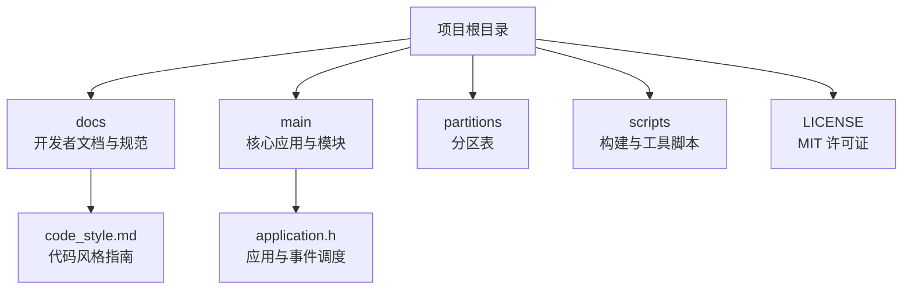
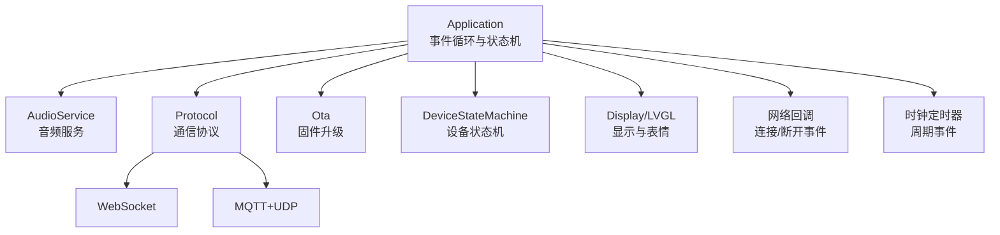
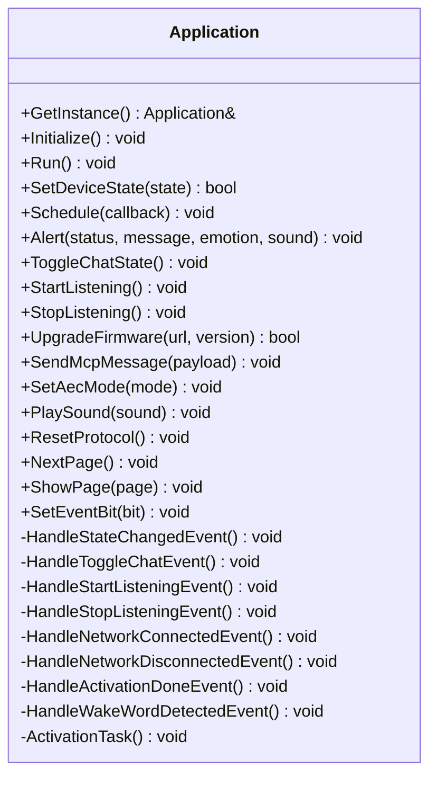
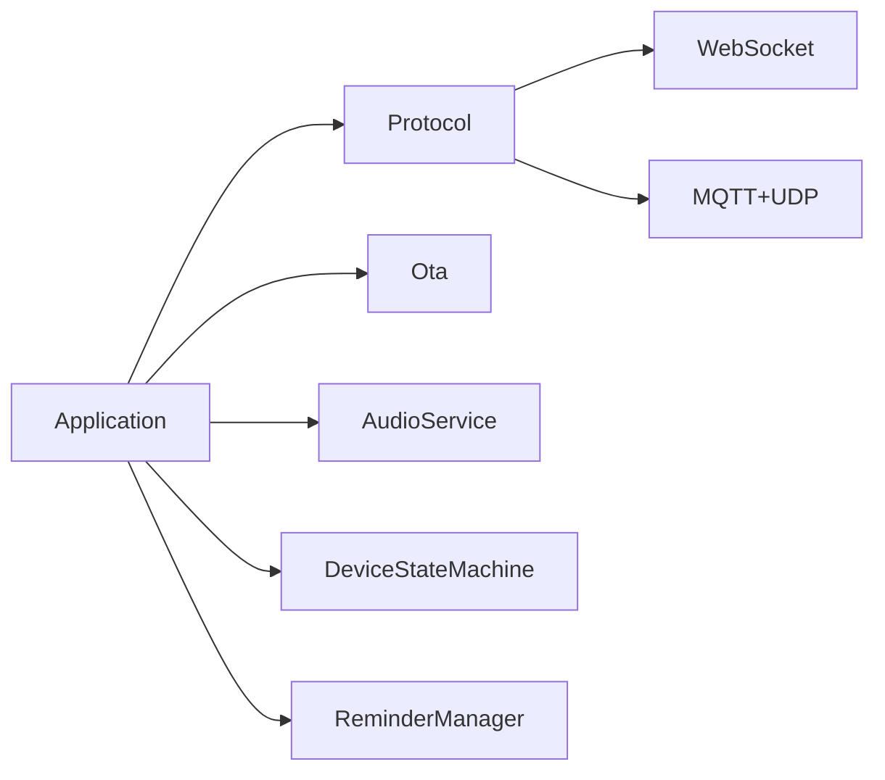

# 社区与贡献

<cite>
**本文档引用的文件**
- [README.md](file://README.md)
- [README_zh.md](file://README_zh.md)
- [LICENSE](file://LICENSE)
- [docs/code_style.md](file://docs/code_style.md)
- [main/application.h](file://main/application.h)
</cite>

## 目录
1. [简介](#简介)
2. [项目结构](#项目结构)
3. [核心组件](#核心组件)
4. [架构总览](#架构总览)
5. [详细组件分析](#详细组件分析)
6. [依赖分析](#依赖分析)
7. [性能考虑](#性能考虑)
8. [故障排查指南](#故障排查指南)
9. [结论](#结论)
10. [附录](#附录)

## 简介
本指南面向所有希望参与 ESP32-AI（XiaoZhi AI Chatbot）项目的社区成员与贡献者，系统性介绍项目的开源许可、贡献流程、社区规范、问题报告与功能请求模板、代码贡献流程（含分支策略、PR 规范与代码审查）、治理结构与沟通渠道、新贡献者入门路径以及商业使用指导。内容严格依据仓库内现有文件整理，确保可执行与可追溯。

## 项目结构
- 项目采用模块化组织，核心应用位于 main 目录，文档集中在 docs 目录，许可证与通用规范在根目录。
- 关键模块包括：音频处理、显示与表情、协议栈（WebSocket/MQTT+UDP）、OTA、设备状态机与事件调度等。
- 文档与规范：
  - 代码风格：Google C++ 风格，使用 clang-format 统一格式。
  - 许可证：MIT。
  - 社区沟通：Discord 与 QQ 群。
  - 分支与版本：README 中明确 v1/v2 版本差异与维护策略。

章节来源
- [README.md:15-22](file://README.md#L15-L22)
- [README_zh.md:15-22](file://README_zh.md#L15-L22)

## 核心组件
- 应用主类与事件调度：Application 提供全局单例、事件位定义、状态机集成、页面管理、网络事件处理、协议重置与任务调度等能力，是系统事件循环与状态流转的核心。
- 事件机制：通过事件位与 FreeRTOS 事件组协调多任务，保证线程安全与异步回调的有序执行。
- 协议与通信：支持 WebSocket 与 MQTT+UDP 两类协议，配合音频服务与 OTA 模块完成端到端交互。
- 开发规范：统一使用 Google C++ 风格与 clang-format，IDE 集成与批量格式化流程明确。

章节来源
- [main/application.h:50-194](file://main/application.h#L50-L194)
- [docs/code_style.md:1-91](file://docs/code_style.md#L1-L91)

## 架构总览
ESP32-AI 的运行时架构围绕 Application 的事件循环展开，音频、网络、协议与显示模块通过事件驱动协同工作；OTA 与设备状态机贯穿生命周期管理。

图表来源
- [main/application.h:148-156](file://main/application.h#L148-L156)
- [main/application.h:174-178](file://main/application.h#L174-L178)

## 详细组件分析

### 事件与状态管理（Application）
- 全局单例与线程安全：禁止拷贝构造，通过互斥锁保护主任务队列与共享状态。
- 事件位与事件组：定义了唤醒词检测、VAD 变化、网络连接、定时器、提醒触发等事件位，Run 方法作为主循环统一处理。
- 页面管理：支持页面切换与当前页跟踪，便于 UI 与交互逻辑解耦。
- 协议重置：网络断连后可释放协议与音频通道资源，保障资源回收与稳定性。
- 状态机集成：OnStateChanged 回调与事件处理器联动，确保状态变更的可观测与可追踪。

图表来源
- [main/application.h:50-194](file://main/application.h#L50-L194)

章节来源
- [main/application.h:50-194](file://main/application.h#L50-L194)

### 代码风格与格式化（Google C++ 风格）
- 工具：clang-format，遵循项目根目录 .clang-format 配置（基于 Google C++ 风格并做定制）。
- 安装与使用：提供 Windows/Linux/macOS 的安装命令与常用格式化命令。
- IDE 集成：VSCode 与 CLion 的推荐配置步骤。
- 规则要点：缩进、行长、大括号风格、指针与引用对齐、头文件排序、类访问修饰符缩进等。
- 注意事项：提交前必须格式化；如需跳过格式化可使用特定注释块包裹。

章节来源
- [docs/code_style.md:1-91](file://docs/code_style.md#L1-L91)

### 开源许可与合规
- 许可证：MIT，允许自由使用、修改与商用，但需保留版权与许可声明。
- 贡献者需确保提交内容不侵犯第三方权利，并遵守 MIT 条款。

章节来源
- [LICENSE:1-23](file://LICENSE#L1-L23)

### 社区沟通与治理
- 沟通渠道：Discord 与 QQ 群（README 中提供链接与群号）。
- 治理结构：README 明确项目由“虾哥”开源，未披露具体维护者名单与决策流程细节。
- 建议：贡献者可通过 Issue/PR 与社区互动，重大变更建议先开议题讨论。

章节来源
- [README.md:159-163](file://README.md#L159-L163)
- [README_zh.md:155-159](file://README_zh.md#L155-L159)

### 新贡献者入门与学习资源
- 环境准备：推荐使用 VSCode/Cursor + ESP-IDF 插件，SDK 版本 5.4+；Linux 编译体验更佳。
- 文档导航：README 的“开发者文档”与 docs 目录中的协议、通信与自定义开发板指南。
- 示例与硬件：README 展示了大量支持的开源硬件列表与面包板实践教程链接。

章节来源
- [README.md:115-129](file://README.md#L115-L129)
- [README_zh.md:115-129](file://README_zh.md#L115-L129)

## 依赖分析
- 内部依赖：Application 依赖 Protocol、Ota、AudioService、DeviceStateMachine、ReminderManager 等模块，形成清晰的职责边界。
- 外部依赖：通过 managed_components 引入的第三方组件（如音频编解码、DSP、相机等），均带有各自 LICENSE。
- 事件耦合：事件位与事件处理器解耦了 UI、音频、网络与协议层，降低模块间耦合度。

图表来源
- [main/application.h:148-156](file://main/application.h#L148-L156)

章节来源
- [main/application.h:148-156](file://main/application.h#L148-L156)

## 性能考虑
- 事件驱动与轻量任务：通过事件组与定时器减少阻塞等待，提升响应性。
- 资源回收：网络断连后及时释放协议与音频通道资源，避免内存泄漏。
- 编译与格式化：Linux 环境通常具备更快的编译速度与更少的驱动问题；clang-format 保证一致性，减少调试成本。

## 故障排查指南
- 事件未触发：检查事件位设置与事件处理器绑定，确认 Run 循环中事件分发逻辑。
- 状态异常：通过 OnStateChanged 与状态机日志定位状态变更路径，核对事件处理器顺序。
- 音频问题：确认音频服务初始化与通道打开流程，必要时调用 ResetProtocol 重置协议资源。
- 网络波动：关注网络连接/断开事件处理，确保在断连后释放资源并在重连后重建通道。

章节来源
- [main/application.h:170-179](file://main/application.h#L170-L179)
- [main/application.h:186-189](file://main/application.h#L186-L189)

## 结论
本指南基于仓库现有文件，为社区贡献者提供了从许可、规范、流程到协作与治理的全景视图。建议贡献者在提交前完成代码格式化与自测，按需开启议题讨论，遵循 Google C++ 风格与 MIT 许可要求，共同维护高质量的开源生态。

## 附录

### 问题报告标准模板（Issue 模板）
- 标题：简洁描述问题现象
- 环境信息：硬件型号、固件版本、SDK 版本、操作系统
- 复现步骤：最小可复现步骤
- 预期行为：期望结果
- 实际行为：实际结果
- 日志与截图：关键日志片段与截图
- 附加信息：相关 PR/Issue 链接、影响范围

### 功能请求提交指南（Feature Request）
- 标题：简述功能目标
- 背景与动机：为什么需要此功能
- 用户场景：典型使用场景
- 技术方案（可选）：初步设计或实现思路
- 影响评估：对现有功能/性能/兼容性的影响
- 附件：原型图、流程图或参考实现链接

### 代码贡献流程（分支管理、PR 规范与审查）
- 分支策略
  - 主分支：稳定版本与发布分支
  - 开发分支：v1/v2 版本差异已在 README 中说明，v1 分支维护至 2026-02
- 提交流程
  - Fork 仓库 -> 新建特性分支 -> 提交更改 -> 运行 clang-format -> 提交 PR
  - PR 描述需包含：变更目的、影响范围、测试验证、兼容性说明
- 代码审查
  - 遵循 Google C++ 风格与 clang-format
  - 重要变更建议先开议题讨论，获得维护者反馈后再提交 PR
- 合并与发布
  - 维护者负责合并与版本发布，遵循 MIT 许可条款

章节来源
- [README.md:15-22](file://README.md#L15-L22)
- [README_zh.md:15-22](file://README_zh.md#L15-L22)
- [docs/code_style.md:1-91](file://docs/code_style.md#L1-L91)

### 社区资源汇总
- 官方文档与教程：README 中的开发者文档与硬件实践链接
- 协议与通信：docs 目录中的 MCP、WebSocket、MQTT+UDP 文档
- 第三方服务器与客户端：README 中列出的相关开源项目链接
- 沟通渠道：Discord 与 QQ 群（README 中提供）

章节来源
- [README.md:122-151](file://README.md#L122-L151)
- [README_zh.md:122-151](file://README_zh.md#L122-L151)

### 商业使用指导
- 许可类型：MIT 允许商用
- 注意事项：保留版权与许可声明；因使用本项目造成的责任由使用者自行承担
- 建议：在商业产品中标注所用组件与版本信息，便于审计与溯源

章节来源
- [LICENSE:1-23](file://LICENSE#L1-L23)