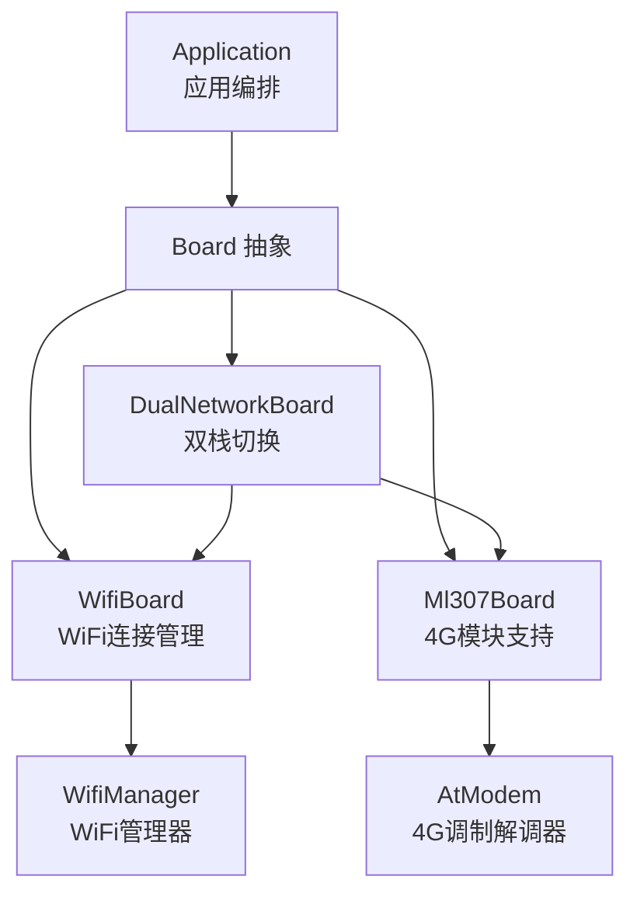
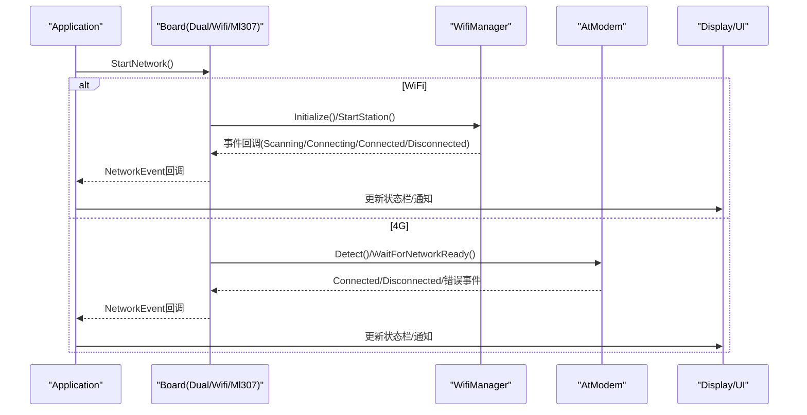
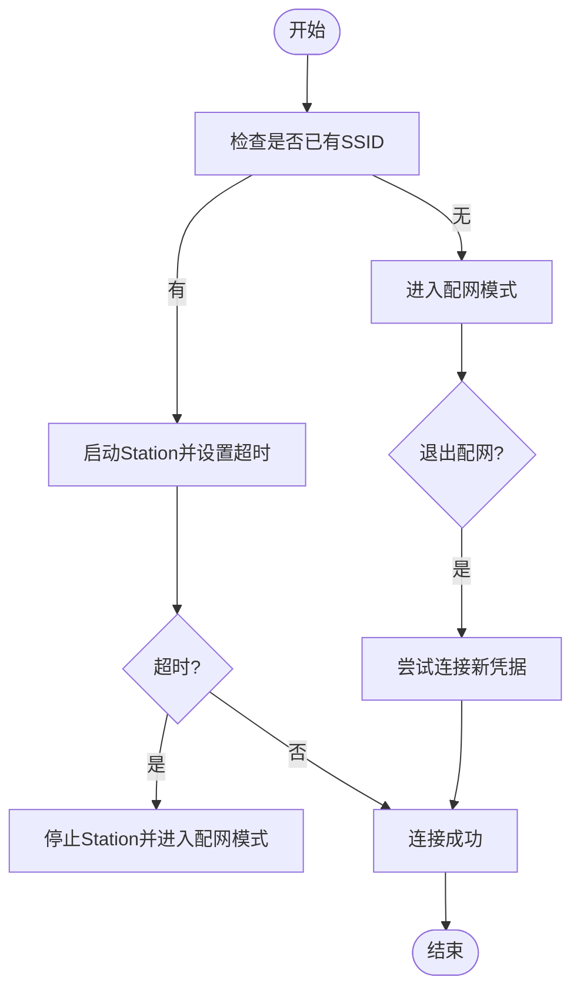
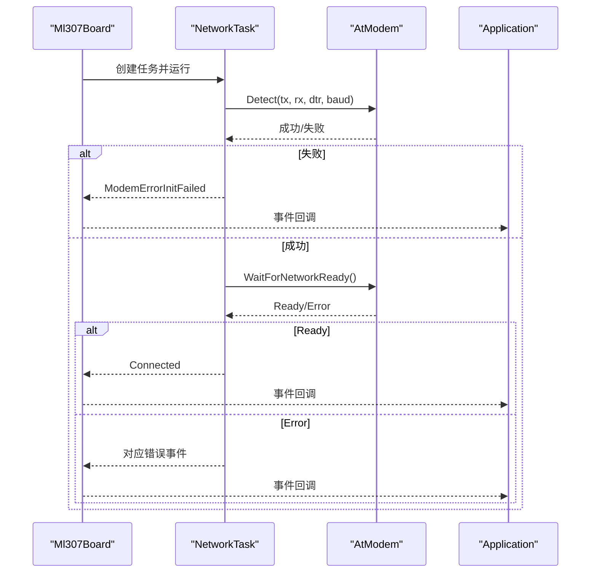
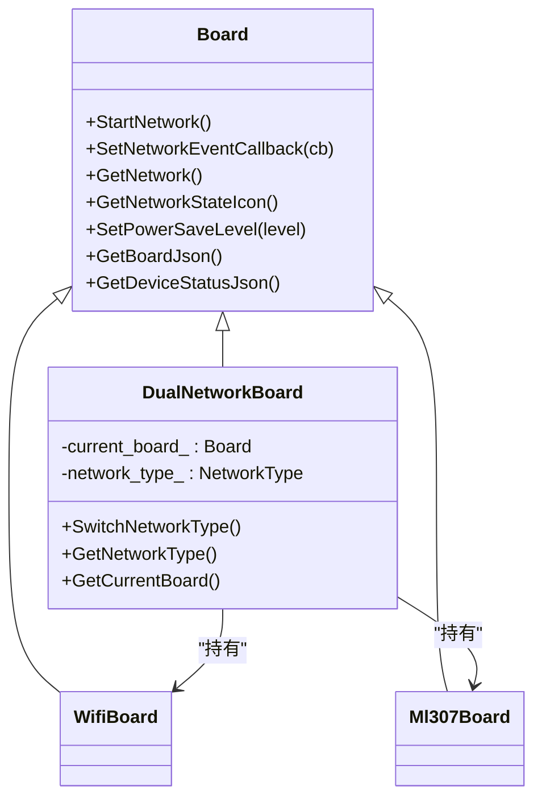
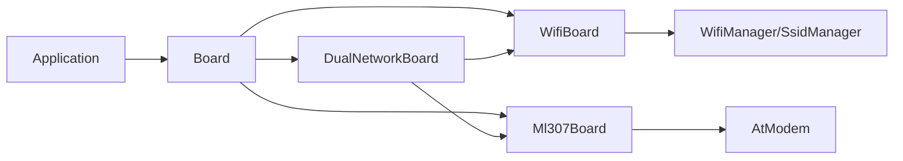

# 网络管理

<cite>
**本文档引用的文件**
- [main/boards/common/wifi_board.h](file://main/boards/common/wifi_board.h)
- [main/boards/common/wifi_board.cc](file://main/boards/common/wifi_board.cc)
- [main/boards/common/ml307_board.h](file://main/boards/common/ml307_board.h)
- [main/boards/common/ml307_board.cc](file://main/boards/common/ml307_board.cc)
- [main/boards/common/dual_network_board.h](file://main/boards/common/dual_network_board.h)
- [main/boards/common/dual_network_board.cc](file://main/boards/common/dual_network_board.cc)
- [main/application.h](file://main/application.h)
- [main/application.cc](file://main/application.cc)
- [main/boards/atk-dnesp32s3-box2-4g/atk_dnesp32s3_box2.cc](file://main/boards/atk-dnesp32s3-box2-4g/atk_dnesp32s3_box2.cc)
- [main/boards/atk-dnesp32s3-box2-wifi/atk_dnesp32s3_box2.cc](file://main/boards/atk-dnesp32s3-box2-wifi/atk_dnesp32s3_box2.cc)
</cite>

## 目录
1. [简介](#简介)
2. [项目结构](#项目结构)
3. [核心组件](#核心组件)
4. [架构总览](#架构总览)
5. [详细组件分析](#详细组件分析)
6. [依赖关系分析](#依赖关系分析)
7. [性能考量](#性能考量)
8. [故障排除指南](#故障排除指南)
9. [结论](#结论)
10. [附录](#附录)

## 简介
本文件面向ESP32-AI项目的网络管理系统，系统性梳理WiFi连接管理、4G（ML307）模块支持、网络状态监控与故障恢复机制，解释在不同网络环境下的自动切换策略与负载均衡考虑，给出网络配置参数说明（IP/DNS/代理）、网络安全措施（TLS/证书/防火墙）、性能优化建议（带宽/延迟/丢包处理），以及实用的网络调试工具与故障排除方法。

## 项目结构
网络管理由“板卡抽象层 + 具体实现 + 应用编排”三层构成：
- 板卡抽象层：Board及其派生类（WifiBoard、Ml307Board、DualNetworkBoard）
- 具体实现：WiFi管理器、4G调制解调器驱动、事件回调与状态机
- 应用编排：Application负责启动网络、接收事件、更新UI与协议资源

图表来源
- [main/application.cc:85-199](file://main/application.cc#L85-L199)
- [main/boards/common/wifi_board.cc:52-87](file://main/boards/common/wifi_board.cc#L52-L87)
- [main/boards/common/ml307_board.cc:134-141](file://main/boards/common/ml307_board.cc#L134-L141)
- [main/boards/common/dual_network_board.cc:64-73](file://main/boards/common/dual_network_board.cc#L64-L73)

章节来源
- [main/application.cc:85-199](file://main/application.cc#L85-L199)
- [main/boards/common/wifi_board.h:9-67](file://main/boards/common/wifi_board.h#L9-L67)
- [main/boards/common/ml307_board.h:9-36](file://main/boards/common/ml307_board.h#L9-L36)
- [main/boards/common/dual_network_board.h:16-58](file://main/boards/common/dual_network_board.h#L16-L58)

## 核心组件
- WifiBoard：封装WiFi连接流程、配网模式入口、RSSI图标映射、电源策略、设备状态JSON生成。
- Ml307Board：封装ML307 4G模块检测、注册、信号强度上报、错误事件、设备状态JSON生成。
- DualNetworkBoard：在WiFi与ML307之间进行运行时切换，持久化网络类型，重启生效。
- Application：统一接收网络事件，更新UI状态栏与通知，触发协议资源的建立/释放。

章节来源
- [main/boards/common/wifi_board.cc:52-145](file://main/boards/common/wifi_board.cc#L52-L145)
- [main/boards/common/ml307_board.cc:67-132](file://main/boards/common/ml307_board.cc#L67-L132)
- [main/boards/common/dual_network_board.cc:45-57](file://main/boards/common/dual_network_board.cc#L45-L57)
- [main/application.cc:128-182](file://main/application.cc#L128-L182)

## 架构总览
系统采用“事件驱动 + 异步启动”的方式：
- 启动阶段：Application异步调用Board::StartNetwork，回调通过SetNetworkEventCallback传递给上层。
- WiFi路径：WifiBoard初始化WifiManager，扫描/连接/超时/配网模式；支持热点配网、Blufi或声学配网。
- 4G路径：Ml307Board在独立任务中探测模块、等待网络注册、上报CSQ与运营商信息。
- 切换路径：DualNetworkBoard根据设置选择当前板卡，重启后生效。

图表来源
- [main/application.cc:128-182](file://main/application.cc#L128-L182)
- [main/boards/common/wifi_board.cc:52-87](file://main/boards/common/wifi_board.cc#L52-L87)
- [main/boards/common/ml307_board.cc:134-141](file://main/boards/common/ml307_board.cc#L134-L141)

## 详细组件分析

### WiFi连接管理（WifiBoard）
- 连接流程
  - 初始化WifiManager，设置统一事件回调，转发为NetworkEvent。
  - 若已保存SSID则发起Station连接并设置连接超时定时器；否则进入配网模式。
  - 超时触发后停止Station并进入配网模式。
- 配网模式
  - 支持热点配网（显示SSID与Web地址）、Blufi、声学配网（音频接收凭据）。
  - 进入/退出配网模式时更新设备状态与UI提示。
- 状态与图标
  - 根据是否处于配网模式、是否连接、RSSI值返回不同图标。
- 电源策略
  - 将PowerSaveLevel映射为WifiPowerSaveLevel并交由WifiManager执行。
- 设备状态JSON
  - 输出网络类型、SSID、RSSI、信道、IP、MAC等信息。

图表来源
- [main/boards/common/wifi_board.cc:89-104](file://main/boards/common/wifi_board.cc#L89-L104)
- [main/boards/common/wifi_board.cc:151-157](file://main/boards/common/wifi_board.cc#L151-L157)

章节来源
- [main/boards/common/wifi_board.h:24-67](file://main/boards/common/wifi_board.h#L24-L67)
- [main/boards/common/wifi_board.cc:52-145](file://main/boards/common/wifi_board.cc#L52-L145)
- [main/boards/common/wifi_board.cc:244-282](file://main/boards/common/wifi_board.cc#L244-L282)
- [main/boards/common/wifi_board.cc:284-299](file://main/boards/common/wifi_board.cc#L284-L299)

### 4G模块支持（Ml307Board）
- 模块检测与注册
  - 在独立任务中循环检测ML307模块，达到最大重试次数仍未检测到则上报初始化失败。
  - 注册网络时对SIM卡缺失、注册被拒、超时等场景分别上报对应错误事件。
- 信号与设备信息
  - 上报CSQ、运营商名称、IMEI、ICCID、注册状态等。
- 图标与状态
  - 根据CSQ区间映射信号强度图标；设备状态JSON输出网络类型、运营商、信号等级等。

图表来源
- [main/boards/common/ml307_board.cc:67-132](file://main/boards/common/ml307_board.cc#L67-L132)
- [main/application.cc:165-181](file://main/application.cc#L165-L181)

章节来源
- [main/boards/common/ml307_board.h:9-36](file://main/boards/common/ml307_board.h#L9-L36)
- [main/boards/common/ml307_board.cc:67-132](file://main/boards/common/ml307_board.cc#L67-L132)
- [main/boards/common/ml307_board.cc:147-166](file://main/boards/common/ml307_board.cc#L147-L166)
- [main/boards/common/ml307_board.cc:186-270](file://main/boards/common/ml307_board.cc#L186-L270)

### 双网络切换（DualNetworkBoard）
- 切换策略
  - 从Settings加载网络类型（默认ML307），初始化对应板卡。
  - 切换时保存新类型并重启，确保新配置生效。
- 运行时行为
  - 统一暴露Board接口，内部转发至当前活动板卡（WifiBoard或Ml307Board）。
  - StartNetwork根据当前类型设置初始状态提示（连接/检测模块）。

图表来源
- [main/boards/common/dual_network_board.h:16-58](file://main/boards/common/dual_network_board.h#L16-L58)
- [main/boards/common/dual_network_board.cc:35-43](file://main/boards/common/dual_network_board.cc#L35-L43)

章节来源
- [main/boards/common/dual_network_board.h:9-58](file://main/boards/common/dual_network_board.h#L9-L58)
- [main/boards/common/dual_network_board.cc:23-57](file://main/boards/common/dual_network_board.cc#L23-L57)
- [main/boards/atk-dnesp32s3-box2-4g/atk_dnesp32s3_box2.cc:416-416](file://main/boards/atk-dnesp32s3-box2-4g/atk_dnesp32s3_box2.cc#L416-L416)
- [main/boards/atk-dnesp32s3-box2-wifi/atk_dnesp32s3_box2.cc:395-395](file://main/boards/atk-dnesp32s3-box2-wifi/atk_dnesp32s3_box2.cc#L395-L395)

### 应用层事件编排（Application）
- 事件回调
  - 设置统一网络事件回调，区分WiFi与4G事件，更新UI状态与通知。
  - 连接成功后设置网络已连接事件位，断开时设置断开事件位。
- 协议与资源
  - 断连时关闭音频通道、重置协议与OTA对象，避免资源泄漏。
- 启动顺序
  - 初始化完成后异步启动网络，立即刷新状态栏以展示当前网络状态。

章节来源
- [main/application.cc:128-182](file://main/application.cc#L128-L182)
- [main/application.cc:321-334](file://main/application.cc#L321-L334)
- [main/application.cc:85-199](file://main/application.cc#L85-L199)

## 依赖关系分析
- WifiBoard依赖WifiManager、SsidManager、Display、Application、Settings等组件。
- Ml307Board依赖AtModem、Display、Board能力。
- DualNetworkBoard聚合WifiBoard与Ml307Board，通过Settings持久化网络类型。
- Application作为事件中枢，协调UI、协议与网络资源。

图表来源
- [main/application.cc:128-182](file://main/application.cc#L128-L182)
- [main/boards/common/wifi_board.cc:52-87](file://main/boards/common/wifi_board.cc#L52-L87)
- [main/boards/common/ml307_board.cc:134-141](file://main/boards/common/ml307_board.cc#L134-L141)
- [main/boards/common/dual_network_board.cc:64-73](file://main/boards/common/dual_network_board.cc#L64-L73)

章节来源
- [main/application.h:21-36](file://main/application.h#L21-L36)
- [main/application.cc:128-182](file://main/application.cc#L128-L182)

## 性能考量
- 连接超时与退避
  - WiFi连接超时（默认60秒）触发配网模式，避免长时间占用CPU。
  - 4G注册重试（默认多次）与固定间隔延时，降低AT命令竞争带来的阻塞风险。
- 功耗与性能平衡
  - WifiBoard支持低功耗/平衡/高性能三种电源策略，按场景选择。
  - 建议在弱网或移动场景下启用低功耗策略，稳定场景启用高性能策略。
- 带宽与延迟
  - 优先选择信号强、延迟低的WiFi；4G场景关注CSQ与运营商覆盖。
  - 结合业务特性（语音/视频）动态调整音频编码参数与缓冲策略。
- 丢包处理
  - 传输层可结合拥塞控制算法；应用层在断连时及时重试与降级（如切换到另一网络）。

## 故障排除指南
- WiFi无法连接
  - 检查是否已保存SSID；若无则进入配网模式，确认热点/Blufi/声学配网流程是否完成。
  - 关注Scanning/Connecting/Disconnected事件日志，定位认证或密码问题。
  - RSSI过低可能导致不稳定，建议靠近路由器或减少干扰。
- 4G无SIM/注册失败
  - 观察ModemErrorNoSim/ModemErrorRegDenied/ModemErrorTimeout事件，核对SIM卡安装与套餐状态。
  - CSQ异常（-1）表示无法获取信号，检查天线与遮挡情况。
- 自动切换无效
  - 确认Settings中的网络类型设置已被保存；切换后需重启生效。
  - 检查DualNetworkBoard初始化逻辑与当前活动板卡状态。
- 断连后资源未释放
  - 确认Application在断连事件中调用了ResetProtocol，关闭音频通道并重置协议。
- 调试工具
  - 查看串口日志（ESP_LOG输出）中的NetworkEvent事件与状态变化。
  - 使用设备状态JSON（WifiBoard::GetDeviceStatusJson / Ml307Board::GetDeviceStatusJson）快速核对网络参数。

章节来源
- [main/boards/common/wifi_board.cc:106-145](file://main/boards/common/wifi_board.cc#L106-L145)
- [main/boards/common/ml307_board.cc:31-65](file://main/boards/common/ml307_board.cc#L31-L65)
- [main/boards/common/dual_network_board.cc:45-57](file://main/boards/common/dual_network_board.cc#L45-L57)
- [main/application.cc:321-334](file://main/application.cc#L321-L334)

## 结论
该网络管理体系通过清晰的抽象与事件驱动设计，实现了WiFi与4G双栈支持、自动配网、状态监控与故障恢复。DualNetworkBoard提供了灵活的运行时切换能力，Application统一编排UI与协议资源，整体具备良好的可维护性与扩展性。建议在实际部署中结合业务场景优化电源策略与传输参数，并完善TLS/证书/防火墙等安全措施。

## 附录

### 网络配置参数说明
- IP设置
  - WiFi：由路由器DHCP分配，可通过WifiBoard获取IP字符串；设备侧不直接配置静态IP。
- DNS配置
  - 由路由器/DHCP服务器下发；设备侧不直接配置静态DNS。
- 代理支持
  - 未在现有代码中发现显式代理配置接口；如需HTTP代理，请在上层协议或网络栈中补充实现。
- 电源策略
  - WifiBoard支持低功耗/平衡/高性能三种策略，按场景选择。

章节来源
- [main/boards/common/wifi_board.cc:244-282](file://main/boards/common/wifi_board.cc#L244-L282)
- [main/boards/common/wifi_board.cc:284-299](file://main/boards/common/wifi_board.cc#L284-L299)

### 网络安全措施
- TLS加密与证书验证
  - 未在现有代码中发现TLS/证书验证相关实现；如需HTTPS/TLS，请在上层协议或网络栈中引入并配置证书校验。
- 防火墙配置
  - 未发现专用防火墙组件；建议在网络栈层面启用必要的入站/出站规则，限制不必要的端口访问。
- 配网安全
  - 热点配网、Blufi与声学配网均涉及敏感信息传输，建议仅在可信网络环境下使用，并在完成配置后及时关闭配网模式。

章节来源
- [main/boards/common/wifi_board.cc:159-197](file://main/boards/common/wifi_board.cc#L159-L197)

### 实际网络调试工具与方法
- 日志与事件
  - 通过ESP_LOG输出的NetworkEvent事件（Scanning/Connecting/Connected/Disconnected/ModemError*）定位问题。
- 设备状态JSON
  - 使用WifiBoard::GetDeviceStatusJson与Ml307Board::GetDeviceStatusJson输出网络参数，便于远程诊断。
- UI提示
  - Application根据事件更新状态栏与通知，辅助现场排查。

章节来源
- [main/boards/common/wifi_board.cc:106-145](file://main/boards/common/wifi_board.cc#L106-L145)
- [main/boards/common/ml307_board.cc:186-270](file://main/boards/common/ml307_board.cc#L186-L270)
- [main/application.cc:128-182](file://main/application.cc#L128-L182)