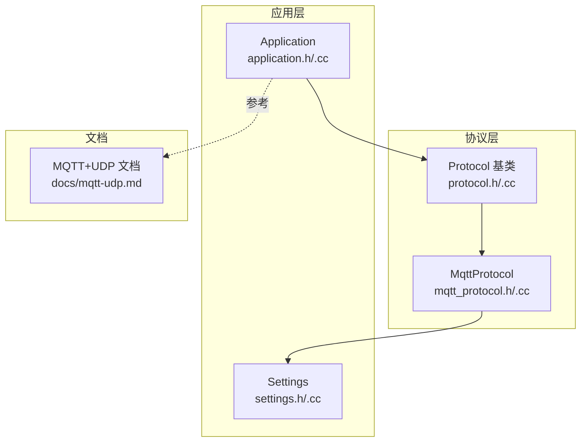
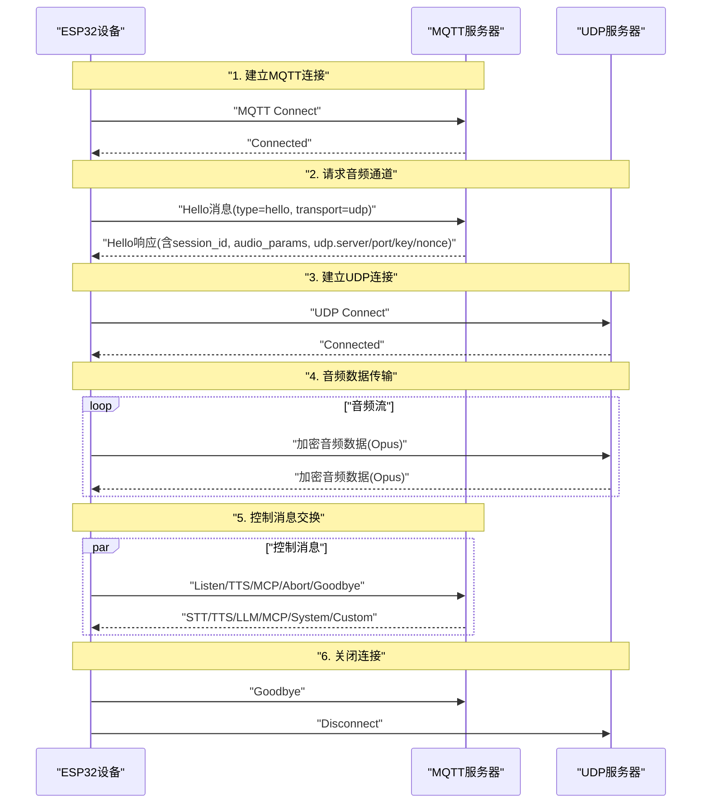
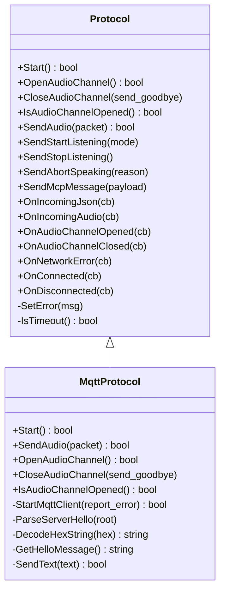
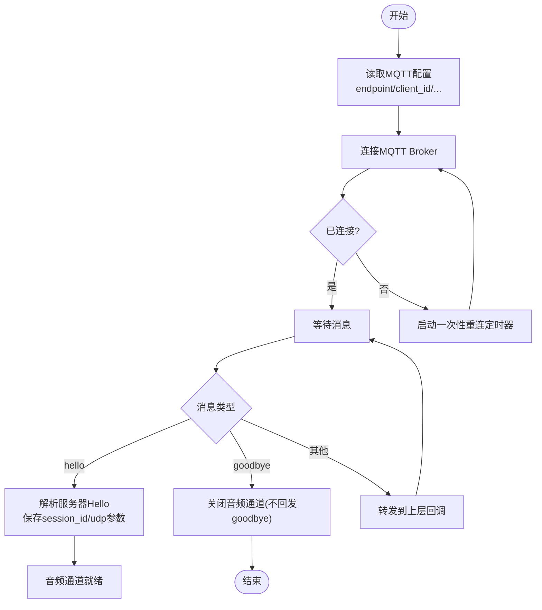
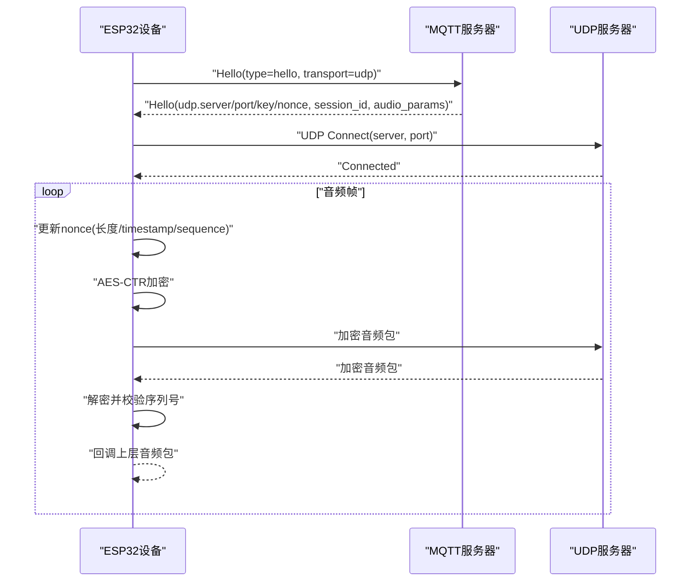
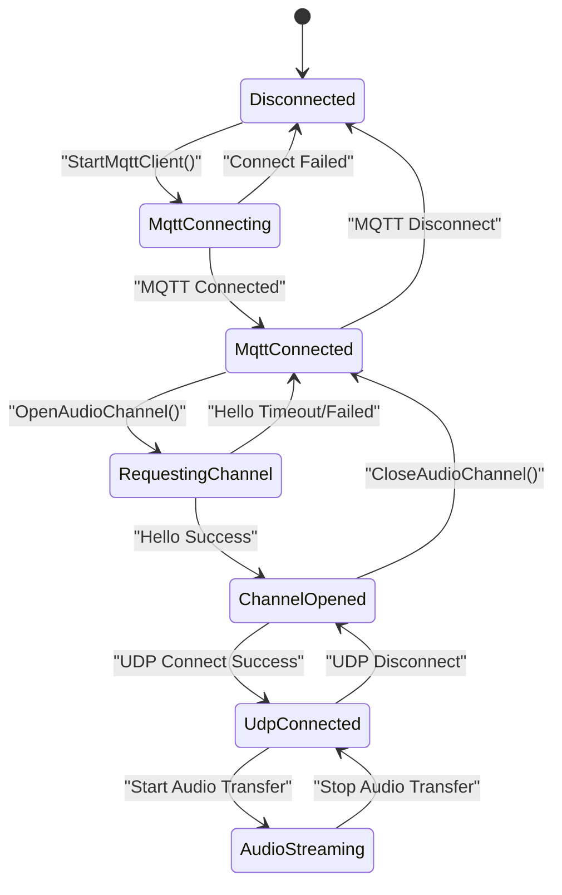
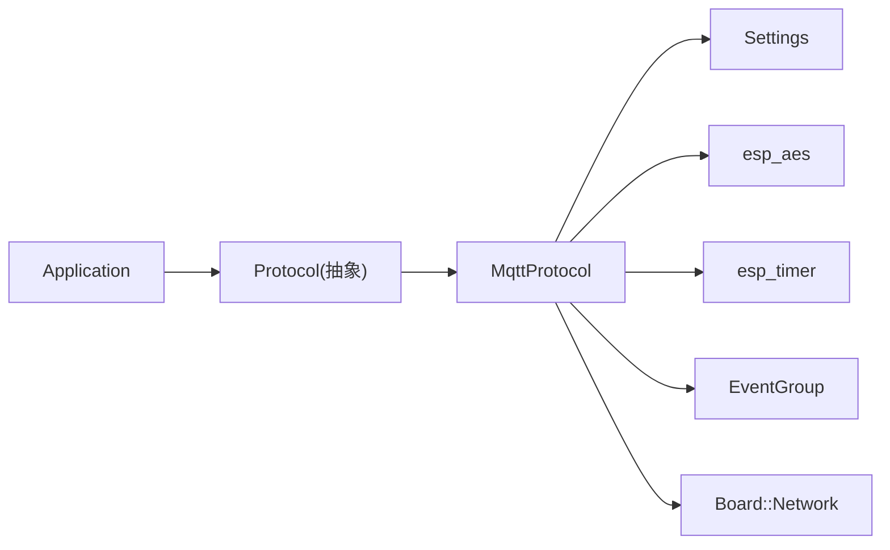

# MQTT+UDP协议

<cite>
**本文引用的文件**
- [docs/mqtt-udp.md](file://docs/mqtt-udp.md)
- [main/protocols/mqtt_protocol.h](file://main/protocols/mqtt_protocol.h)
- [main/protocols/mqtt_protocol.cc](file://main/protocols/mqtt_protocol.cc)
- [main/protocols/protocol.h](file://main/protocols/protocol.h)
- [main/protocols/protocol.cc](file://main/protocols/protocol.cc)
- [main/settings.h](file://main/settings.h)
- [main/settings.cc](file://main/settings.cc)
- [main/application.h](file://main/application.h)
- [main/application.cc](file://main/application.cc)
</cite>

## 目录
1. [引言](#引言)
2. [项目结构](#项目结构)
3. [核心组件](#核心组件)
4. [架构总览](#架构总览)
5. [详细组件分析](#详细组件分析)
6. [依赖关系分析](#依赖关系分析)
7. [性能考量](#性能考量)
8. [故障排查指南](#故障排查指南)
9. [结论](#结论)
10. [附录](#附录)

## 引言
本文件面向ESP32-AI项目的“MQTT+UDP”混合通信协议，系统化阐述在嵌入式环境中如何以MQTT承载控制与状态消息、以UDP承载实时音频数据，并在弱网络环境下保持低时延与一定可靠性。文档覆盖协议流程、消息格式、QoS与可靠性策略、配置参数、安全与加密、性能优化、与WebSocket方案的对比以及部署与排障建议。

## 项目结构
围绕MQTT+UDP协议的关键代码位于“main/protocols”目录，配合“main/settings”进行参数持久化，“main/application”负责事件调度与状态机驱动。文档“docs/mqtt-udp.md”提供了协议总体流程、消息模型与状态机的高层说明。

图表来源
- [main/protocols/protocol.h:44-95](file://main/protocols/protocol.h#L44-L95)
- [main/protocols/mqtt_protocol.h:26-62](file://main/protocols/mqtt_protocol.h#L26-L62)
- [main/application.h:148-149](file://main/application.h#L148-L149)
- [main/settings.h:7-26](file://main/settings.h#L7-L26)
- [docs/mqtt-udp.md:1-393](file://docs/mqtt-udp.md#L1-L393)

章节来源
- [docs/mqtt-udp.md:1-393](file://docs/mqtt-udp.md#L1-L393)
- [main/protocols/protocol.h:1-99](file://main/protocols/protocol.h#L1-L99)
- [main/protocols/mqtt_protocol.h:1-66](file://main/protocols/mqtt_protocol.h#L1-L66)
- [main/application.h:1-212](file://main/application.h#L1-L212)
- [main/settings.h:1-29](file://main/settings.h#L1-L29)

## 核心组件
- 协议抽象基类 Protocol：定义统一接口、回调、会话与超时检测；提供通用JSON消息构造工具。
- MQTT协议实现 MqttProtocol：继承自Protocol，封装MQTT控制通道、UDP音频通道、AES-CTR加密封装、序列号管理、自动重连与事件组协调。
- 设置模块 Settings：提供键值读写接口，用于读取MQTT端点、鉴权、心跳、发布主题等配置。
- 应用层 Application：持有Protocol实例，负责事件循环、状态机、任务调度与资源回收。

章节来源
- [main/protocols/protocol.h:44-95](file://main/protocols/protocol.h#L44-L95)
- [main/protocols/protocol.cc:1-91](file://main/protocols/protocol.cc#L1-L91)
- [main/protocols/mqtt_protocol.h:26-62](file://main/protocols/mqtt_protocol.h#L26-L62)
- [main/protocols/mqtt_protocol.cc:1-390](file://main/protocols/mqtt_protocol.cc#L1-L390)
- [main/settings.h:7-26](file://main/settings.h#L7-L26)
- [main/settings.cc:1-109](file://main/settings.cc#L1-L109)
- [main/application.h:148-149](file://main/application.h#L148-L149)

## 架构总览
MQTT+UDP混合架构将“控制/状态/配置”与“实时音频”分离，MQTT负责可靠控制，UDP负责低时延音频。整体流程如下：

图表来源
- [docs/mqtt-udp.md:24-57](file://docs/mqtt-udp.md#L24-L57)
- [main/protocols/mqtt_protocol.cc:113-132](file://main/protocols/mqtt_protocol.cc#L113-L132)
- [main/protocols/mqtt_protocol.cc:215-295](file://main/protocols/mqtt_protocol.cc#L215-L295)

章节来源
- [docs/mqtt-udp.md:22-57](file://docs/mqtt-udp.md#L22-L57)
- [main/protocols/mqtt_protocol.cc:59-152](file://main/protocols/mqtt_protocol.cc#L59-L152)

## 详细组件分析

### 协议抽象与消息模型
- 抽象接口：Protocol定义了Start、OpenAudioChannel、CloseAudioChannel、IsAudioChannelOpened、SendAudio、各类JSON消息发送方法与回调注册。
- 通用JSON构造：Protocol提供SendStartListening、SendStopListening、SendAbortSpeaking、SendMcpMessage、SendWakeWordDetected等便捷方法。
- 超时检测：Protocol内置last_incoming_time_与IsTimeout()，默认超时阈值为120秒，用于判定通道健康。

图表来源
- [main/protocols/protocol.h:44-95](file://main/protocols/protocol.h#L44-L95)
- [main/protocols/mqtt_protocol.h:26-62](file://main/protocols/mqtt_protocol.h#L26-L62)

章节来源
- [main/protocols/protocol.h:44-95](file://main/protocols/protocol.h#L44-L95)
- [main/protocols/protocol.cc:35-90](file://main/protocols/protocol.cc#L35-L90)

### MQTT控制通道与自动重连
- 连接参数：从Settings读取endpoint、client_id、username、password、keepalive、publish_topic；默认keepalive为240秒。
- 心跳与断线：设置MQTT心跳；断线回调中启动一次性重连定时器（默认60秒），连接成功则停止定时器。
- 消息处理：解析JSON消息，识别type字段；当type为hello时解析服务器响应并准备UDP通道；当type为goodbye且匹配session_id时触发关闭音频通道。
- Hello消息：携带版本、传输方式、特性开关、音频参数（格式、采样率、声道、帧时长）。

图表来源
- [main/protocols/mqtt_protocol.cc:59-152](file://main/protocols/mqtt_protocol.cc#L59-L152)
- [main/protocols/mqtt_protocol.cc:100-132](file://main/protocols/mqtt_protocol.cc#L100-L132)
- [main/protocols/mqtt_protocol.cc:322-366](file://main/protocols/mqtt_protocol.cc#L322-L366)

章节来源
- [main/protocols/mqtt_protocol.cc:59-152](file://main/protocols/mqtt_protocol.cc#L59-L152)
- [main/protocols/mqtt_protocol.cc:100-132](file://main/protocols/mqtt_protocol.cc#L100-L132)
- [main/protocols/mqtt_protocol.cc:297-320](file://main/protocols/mqtt_protocol.cc#L297-L320)
- [main/protocols/mqtt_protocol.cc:322-366](file://main/protocols/mqtt_protocol.cc#L322-L366)

### UDP音频通道与加密封装
- 建立流程：收到服务器Hello后，解析udp.server、udp.port、udp.key、udp.nonce，初始化AES-CTR上下文，创建UDP实例并注册OnMessage回调，随后Connect。
- 发送路径：每次发送前更新nonce（包含payload长度、timestamp、sequence），使用esp_aes_crypt_ctr加密，再通过UDP发送。
- 接收路径：校验包头type、长度、序列号连续性；解密后回调上层AudioStreamPacket。
- 序列号：本地local_sequence_单调递增，远端remote_sequence_严格递增；允许轻微跳跃记录警告，拒绝过旧包。

图表来源
- [main/protocols/mqtt_protocol.cc:215-295](file://main/protocols/mqtt_protocol.cc#L215-L295)
- [main/protocols/mqtt_protocol.cc:166-190](file://main/protocols/mqtt_protocol.cc#L166-L190)
- [main/protocols/mqtt_protocol.cc:243-287](file://main/protocols/mqtt_protocol.cc#L243-L287)

章节来源
- [main/protocols/mqtt_protocol.cc:215-295](file://main/protocols/mqtt_protocol.cc#L215-L295)
- [main/protocols/mqtt_protocol.cc:166-190](file://main/protocols/mqtt_protocol.cc#L166-L190)
- [main/protocols/mqtt_protocol.cc:243-287](file://main/protocols/mqtt_protocol.cc#L243-L287)

### 状态管理与通道可用性
- 状态机：Disconnected → MqttConnecting → MqttConnected → RequestingChannel → ChannelOpened → UdpConnected → AudioStreaming；支持回退与重试。
- 可用性判断：IsAudioChannelOpened()综合检查UDP实例存在、无错误、未超时。

图表来源
- [docs/mqtt-udp.md:230-246](file://docs/mqtt-udp.md#L230-L246)
- [main/protocols/mqtt_protocol.cc:387-390](file://main/protocols/mqtt_protocol.cc#L387-L390)

章节来源
- [docs/mqtt-udp.md:226-256](file://docs/mqtt-udp.md#L226-L256)
- [main/protocols/mqtt_protocol.cc:387-390](file://main/protocols/mqtt_protocol.cc#L387-L390)

### 配置参数与参数说明
- MQTT配置（来自Settings命名空间“mqtt”）：
  - endpoint：MQTT服务器地址与端口（支持形如host:port或仅host，默认端口8883）
  - client_id：设备唯一标识
  - username/password：认证凭据
  - keepalive：心跳间隔（秒，默认240）
  - publish_topic：发布主题
- 音频参数（设备端Hello中声明）：
  - format：opus
  - sample_rate：16000 Hz
  - channels：1（单声道）
  - frame_duration：由OPUS_FRAME_DURATION_MS决定（见实现）

章节来源
- [main/protocols/mqtt_protocol.cc:65-71](file://main/protocols/mqtt_protocol.cc#L65-L71)
- [main/protocols/mqtt_protocol.cc:135-143](file://main/protocols/mqtt_protocol.cc#L135-L143)
- [main/protocols/mqtt_protocol.cc:297-320](file://main/protocols/mqtt_protocol.cc#L297-L320)
- [main/protocols/mqtt_protocol.cc:335-346](file://main/protocols/mqtt_protocol.cc#L335-L346)

### 消息格式与UDP封装
- MQTT JSON消息类型：
  - listen：开始/停止/检测唤醒词
  - abort：中止说话，可带原因
  - mcp：承载JSON-RPC负载
  - goodbye：优雅关闭音频通道
- UDP加密音频包结构（固定头部+加密负载）：
  - type：1字节（固定0x01）
  - flags：1字节（保留）
  - payload_len：2字节（网络字节序）
  - ssrc：4字节
  - timestamp：4字节（网络字节序）
  - sequence：4字节（网络字节序）
  - payload：加密的Opus音频数据
- 加密算法：AES-CTR，密钥与nonce由服务器通过MQTT Hello下发，设备侧初始化esp_aes上下文。

章节来源
- [docs/mqtt-udp.md:120-173](file://docs/mqtt-udp.md#L120-L173)
- [docs/mqtt-udp.md:188-210](file://docs/mqtt-udp.md#L188-L210)
- [main/protocols/mqtt_protocol.cc:348-366](file://main/protocols/mqtt_protocol.cc#L348-L366)
- [main/protocols/mqtt_protocol.cc:243-248](file://main/protocols/mqtt_protocol.cc#L243-L248)

### QoS与可靠性策略
- MQTT通道：使用MQTT协议的可靠传输与服务器持久化能力，结合自动重连与错误上报，保障控制消息送达。
- UDP通道：无QoS保证，采用序列号与时间戳防止重放与乱序；允许轻微跳跃并记录警告；超时检测与错误上报辅助恢复。
- 会话管理：通过session_id绑定一次音频会话，避免跨会话混淆；服务器发起goodbye时避免重复回发。

章节来源
- [docs/mqtt-udp.md:280-300](file://docs/mqtt-udp.md#L280-L300)
- [main/protocols/mqtt_protocol.cc:115-127](file://main/protocols/mqtt_protocol.cc#L115-L127)
- [main/protocols/mqtt_protocol.cc:259-265](file://main/protocols/mqtt_protocol.cc#L259-L265)

### 安全与加密
- MQTT：支持TLS/SSL（默认端口8883），用户名/密码认证。
- UDP：AES-CTR加密，密钥与随机数由服务器通过MQTT Hello下发，设备侧按nonce构造计数器进行加解密。

章节来源
- [docs/mqtt-udp.md:303-321](file://docs/mqtt-udp.md#L303-L321)
- [main/protocols/mqtt_protocol.cc:355-362](file://main/protocols/mqtt_protocol.cc#L355-L362)

## 依赖关系分析
- 组件耦合：
  - MqttProtocol依赖Protocol接口、Settings、Board网络工厂、cJSON、esp_aes、FreeRTOS定时器与事件组。
  - Application持有Protocol实例，通过事件组与定时器驱动协议生命周期。
- 外部依赖：
  - MQTT库、UDP库、cJSON、ESP-IDF AES、日志与NVS。

图表来源
- [main/application.h:148-149](file://main/application.h#L148-L149)
- [main/protocols/mqtt_protocol.h:46-54](file://main/protocols/mqtt_protocol.h#L46-L54)
- [main/protocols/mqtt_protocol.cc:81-83](file://main/protocols/mqtt_protocol.cc#L81-L83)

章节来源
- [main/application.h:148-149](file://main/application.h#L148-L149)
- [main/protocols/mqtt_protocol.h:46-54](file://main/protocols/mqtt_protocol.h#L46-L54)
- [main/protocols/mqtt_protocol.cc:81-83](file://main/protocols/mqtt_protocol.cc#L81-L83)

## 性能考量
- 并发与锁：发送音频时使用互斥锁保护UDP实例，避免并发冲突。
- 内存管理：动态创建/销毁网络对象，智能指针管理音频包，及时释放加密上下文。
- 网络优化：UDP连接复用、数据包大小优化、序列号连续性检查降低抖动。
- 实时性：UDP通道优先保证音频低时延；MQTT通道承担控制与状态同步，避免阻塞音频。

章节来源
- [docs/mqtt-udp.md:323-343](file://docs/mqtt-udp.md#L323-L343)
- [main/protocols/mqtt_protocol.cc:167-170](file://main/protocols/mqtt_protocol.cc#L167-L170)

## 故障排查指南
- MQTT连接失败
  - 检查endpoint格式与可达性；确认用户名/密码正确；观察断线重连定时器是否触发。
- Hello超时
  - 确认服务器返回udp.server/port/key/nonce完整；检查网络ACL与防火墙；确认设备时间与服务器时间差异合理。
- UDP解密失败
  - 核对密钥与nonce长度与十六进制格式；确认AES-CTR参数一致；检查payload长度与nonce拼接顺序。
- 序列号异常
  - 观察日志中“old sequence/wrong sequence”警告；确认发送端local_sequence_与接收端remote_sequence_一致性；排查网络重传导致的乱序。
- 超时断开
  - 检查last_incoming_time_与IsTimeout()判定；确认控制通道与音频通道均活跃；必要时重启音频通道。

章节来源
- [main/protocols/mqtt_protocol.cc:233-238](file://main/protocols/mqtt_protocol.cc#L233-L238)
- [main/protocols/mqtt_protocol.cc:249-265](file://main/protocols/mqtt_protocol.cc#L249-L265)
- [main/protocols/protocol.cc:81-90](file://main/protocols/protocol.cc#L81-L90)

## 结论
MQTT+UDP混合协议通过“控制可靠、数据低时延”的分工，在弱网络环境下兼顾了稳定性与实时性。MQTT通道提供可靠的控制与状态同步，UDP通道以AES-CTR加密与序列号管理保障音频数据的安全与有序传输。结合自动重连、超时检测与错误上报，该方案适合对实时语音交互有较高要求的应用场景。

## 附录

### 与WebSocket方案的对比
- 控制通道：MQTT vs WebSocket
- 音频通道：UDP(加密) vs WebSocket(二进制)
- 实时性：高(UDP) vs 中等
- 可靠性：中等(QoS) vs 高(WS)
- 复杂度：高(需维护两套通道) vs 低
- 加密：AES-CTR vs TLS
- 防火墙友好度：低(UDP) vs 高(WS)

章节来源
- [docs/mqtt-udp.md:346-358](file://docs/mqtt-udp.md#L346-L358)

### 部署建议
- 网络环境：确保UDP端口可达，配置防火墙与NAT规则。
- 服务器配置：部署MQTT Broker与UDP服务器，完善密钥分发与轮换机制。
- 监控指标：连接成功率、音频传输延迟、数据包丢失率、解密失败率。

章节来源
- [docs/mqtt-udp.md:360-381](file://docs/mqtt-udp.md#L360-L381)