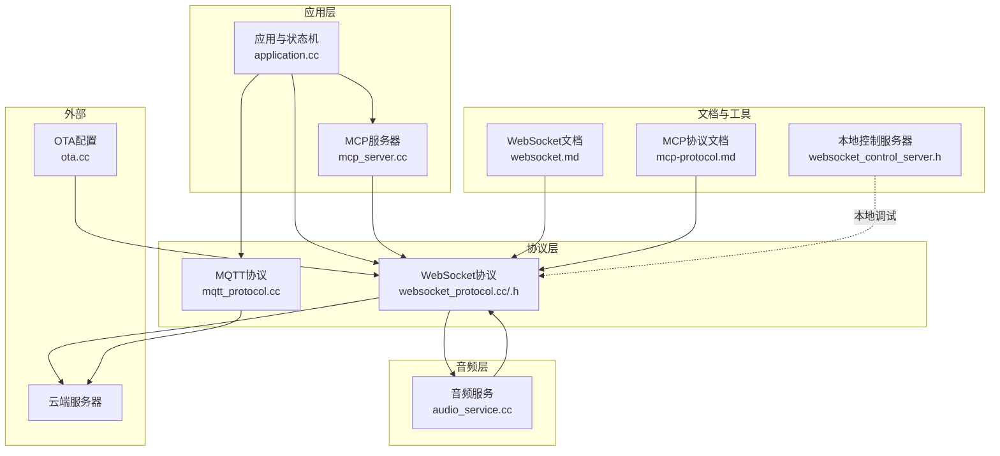
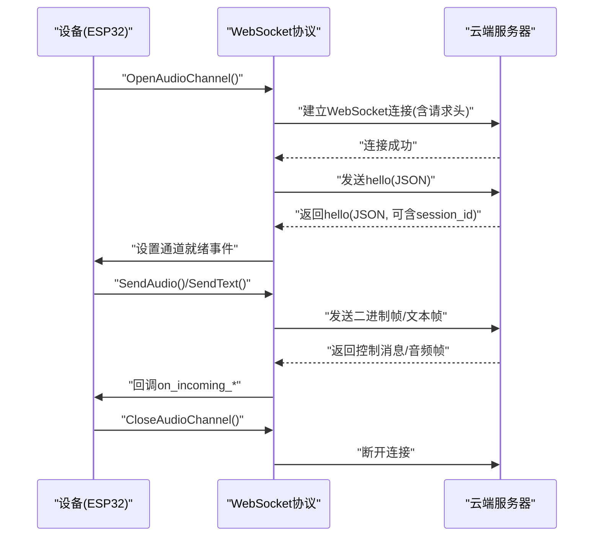
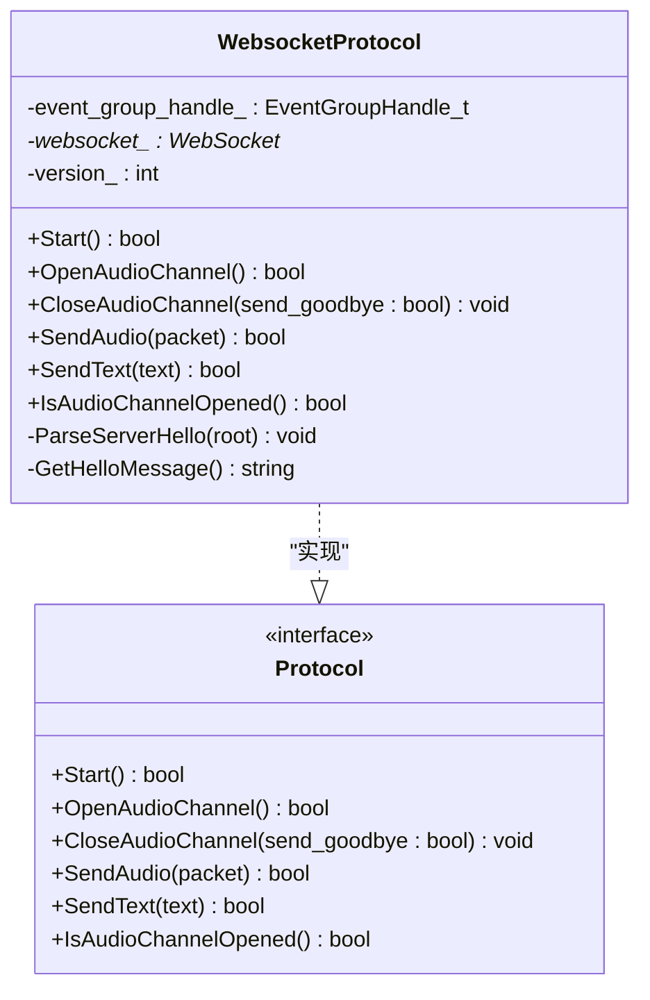
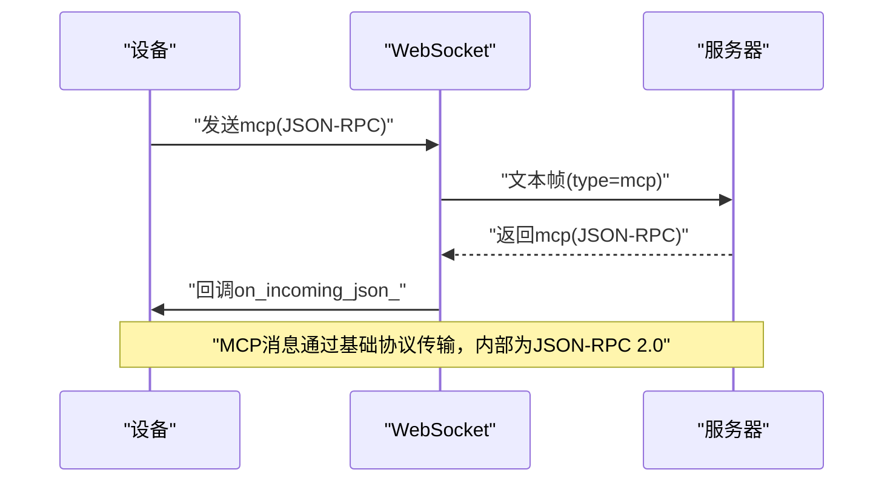
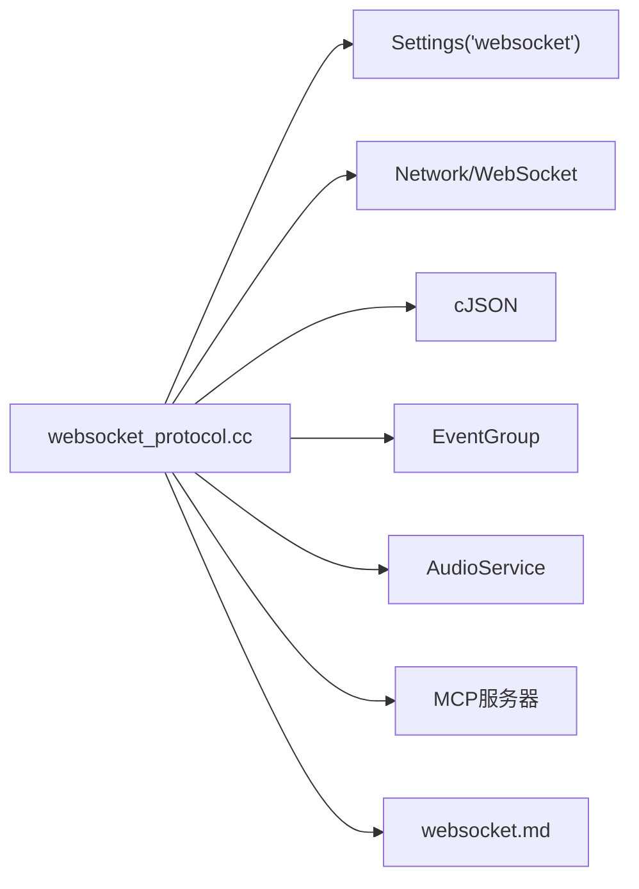

# WebSocket协议

<cite>
**本文引用的文件**
- [websocket.md](file://docs/websocket.md)
- [websocket_protocol.h](file://main/protocols/websocket_protocol.h)
- [websocket_protocol.cc](file://main/protocols/websocket_protocol.cc)
- [mcp-protocol.md](file://docs/mcp-protocol.md)
- [websocket_control_server.h](file://main/boards/otto-robot/websocket_control_server.h)
- [audio_service.cc](file://main/audio/audio_service.cc)
- [mqtt_protocol.cc](file://main/protocols/mqtt_protocol.cc)
- [ota.cc](file://main/ota.cc)
</cite>

## 目录
1. [简介](#简介)
2. [项目结构](#项目结构)
3. [核心组件](#核心组件)
4. [架构总览](#架构总览)
5. [详细组件分析](#详细组件分析)
6. [依赖关系分析](#依赖关系分析)
7. [性能考虑](#性能考虑)
8. [故障排查指南](#故障排查指南)
9. [结论](#结论)
10. [附录](#附录)

## 简介
本文件面向ESP32-AI项目的WebSocket协议实现，聚焦于语音交互系统中的连接建立、消息传输、心跳保持、二进制音频帧承载、JSON控制消息、MCP协议集成以及与云端服务器的交互流程。文档同时给出消息格式规范、配置参数说明、错误处理策略、调试方法与性能优化建议，帮助开发者快速理解并稳定集成。

## 项目结构
与WebSocket协议直接相关的关键位置如下：
- 协议实现：main/protocols/websocket_protocol.{h,cc}
- 协议文档：docs/websocket.md
- MCP协议说明：docs/mcp-protocol.md
- 控制服务器（本地调试）：main/boards/otto-robot/websocket_control_server.h
- 音频服务与帧时长：main/audio/audio_service.cc
- MQTT协议对比：main/protocols/mqtt_protocol.cc
- OTA配置入口：main/ota.cc

图表来源
- [websocket_protocol.cc:1-255](file://main/protocols/websocket_protocol.cc#L1-L255)
- [websocket_protocol.h:1-35](file://main/protocols/websocket_protocol.h#L1-L35)
- [mqtt_protocol.cc:300-320](file://main/protocols/mqtt_protocol.cc#L300-L320)
- [audio_service.cc:60-85](file://main/audio/audio_service.cc#L60-L85)
- [websocket.md:1-496](file://docs/websocket.md#L1-L496)
- [mcp-protocol.md:1-270](file://docs/mcp-protocol.md#L1-L270)
- [websocket_control_server.h:1-34](file://main/boards/otto-robot/websocket_control_server.h#L1-L34)
- [ota.cc:160-175](file://main/ota.cc#L160-L175)

章节来源
- [websocket_protocol.h:1-35](file://main/protocols/websocket_protocol.h#L1-L35)
- [websocket_protocol.cc:1-255](file://main/protocols/websocket_protocol.cc#L1-L255)
- [websocket.md:1-496](file://docs/websocket.md#L1-L496)

## 核心组件
- WebSocket协议类：负责连接管理、握手、二进制与文本消息收发、事件回调、超时与错误处理。
- 音频服务：负责Opus编解码、帧时长与采样率配置，与WebSocket协议配合完成音频帧的发送与接收。
- MCP协议：通过WebSocket传输JSON-RPC 2.0消息，实现设备能力发现、工具调用与状态同步。
- 本地控制服务器：用于本地调试，模拟WebSocket服务端，便于离线验证消息格式与流程。
- 配置与OTA：通过Settings键“websocket”读取URL、Token、协议版本等；OTA路径中也涉及“websocket”键。

章节来源
- [websocket_protocol.cc:23-201](file://main/protocols/websocket_protocol.cc#L23-L201)
- [websocket_protocol.h:13-32](file://main/protocols/websocket_protocol.h#L13-L32)
- [audio_service.cc:60-85](file://main/audio/audio_service.cc#L60-L85)
- [mcp-protocol.md:1-270](file://docs/mcp-protocol.md#L1-L270)
- [websocket_control_server.h:9-30](file://main/boards/otto-robot/websocket_control_server.h#L9-L30)
- [ota.cc:160-175](file://main/ota.cc#L160-L175)

## 架构总览
WebSocket在ESP32-AI中的角色是“语音交互通道”，承担以下职责：
- 建立与云端服务器的持久连接
- 以JSON文本帧传递控制消息（STT、TTS、MCP、System等）
- 以二进制帧承载Opus编码的音频数据
- 通过“hello”握手完成能力协商与会话初始化
- 通过事件组与回调实现状态流转与错误处理

图表来源
- [websocket_protocol.cc:83-201](file://main/protocols/websocket_protocol.cc#L83-L201)
- [websocket.md:16-79](file://docs/websocket.md#L16-L79)

## 详细组件分析

### WebSocket协议类（WebsocketProtocol）
- 职责
  - 实现Protocol接口的Start、OpenAudioChannel、CloseAudioChannel、SendAudio、SendText等方法
  - 管理WebSocket连接生命周期与事件回调
  - 解析服务器hello消息，提取session_id与音频参数
  - 支持二进制协议版本1/2/3，分别对应直接Opus、带时间戳与元数据的二进制帧、简化二进制帧
- 关键行为
  - 连接建立：从Settings读取URL、Token、version，设置Authorization、Protocol-Version、Device-Id、Client-Id请求头，发起Connect
  - 握手：发送hello消息，等待服务器hello，超时约10秒
  - 消息处理：OnData回调区分binary与text；binary按版本解析为AudioStreamPacket；text按type分派
  - 断开：OnDisconnected回调触发音频通道关闭
- 错误处理
  - 连接失败、发送失败、超时均设置错误并回调

图表来源
- [websocket_protocol.h:13-32](file://main/protocols/websocket_protocol.h#L13-L32)
- [websocket_protocol.cc:15-201](file://main/protocols/websocket_protocol.cc#L15-L201)

章节来源
- [websocket_protocol.h:13-32](file://main/protocols/websocket_protocol.h#L13-L32)
- [websocket_protocol.cc:23-201](file://main/protocols/websocket_protocol.cc#L23-L201)

### 消息格式与业务类型
- 通用请求头
  - Authorization: Bearer <token>
  - Protocol-Version: 与hello中的version一致
  - Device-Id: 设备MAC地址
  - Client-Id: 设备UUID
- 二进制协议版本
  - 版本1：直接发送Opus二进制帧
  - 版本2：带版本、类型、保留、时间戳、负载长度与负载的二进制结构
  - 版本3：简化版二进制结构，不含时间戳
- JSON消息类型
  - 设备→服务器：hello、listen、abort、wake word detected、mcp
  - 服务器→设备：hello、stt、llm、tts、mcp、system、custom、音频二进制帧
- 会话与参数
  - session_id：会话标识，可选但建议使用
  - audio_params：format、sample_rate、channels、frame_duration

章节来源
- [websocket.md:82-496](file://docs/websocket.md#L82-L496)
- [websocket_protocol.cc:101-110](file://main/protocols/websocket_protocol.cc#L101-L110)
- [websocket_protocol.cc:203-226](file://main/protocols/websocket_protocol.cc#L203-L226)
- [websocket_protocol.cc:228-254](file://main/protocols/websocket_protocol.cc#L228-L254)

### 与MCP协议的集成
- 传输载体：通过WebSocket文本帧承载type为“mcp”的JSON消息
- 协议格式：payload遵循JSON-RPC 2.0，包含jsonrpc、method、params/id/result/error等
- 典型流程：initialize → tools/list → tools/call，支持分页与通知
- 与MQTT对比：MQTT实现中同样包含frame_duration字段，体现跨协议一致性

图表来源
- [mcp-protocol.md:11-267](file://docs/mcp-protocol.md#L11-L267)
- [websocket_protocol.cc:148-164](file://main/protocols/websocket_protocol.cc#L148-L164)

章节来源
- [mcp-protocol.md:1-270](file://docs/mcp-protocol.md#L1-L270)
- [mqtt_protocol.cc:300-320](file://main/protocols/mqtt_protocol.cc#L300-L320)

### 本地调试与控制服务器
- 本地控制服务器：基于HTTPD实现的WebSocket服务端，用于本地联调
- 使用场景：在无云端环境时，快速验证握手、消息格式与状态流转
- 注意：该组件属于本地调试用途，不参与生产连接

章节来源
- [websocket_control_server.h:9-30](file://main/boards/otto-robot/websocket_control_server.h#L9-L30)

### 配置参数与设置入口
- Settings键“websocket”
  - url：服务器WebSocket地址
  - token：访问令牌（可自动补全Bearer前缀）
  - version：二进制协议版本（1/2/3）
- OTA路径中也存在“websocket”键，表明OTA流程可能读取或写入相关配置

章节来源
- [websocket_protocol.cc:83-110](file://main/protocols/websocket_protocol.cc#L83-L110)
- [ota.cc:160-175](file://main/ota.cc#L160-L175)

### 音频参数与时钟
- 帧时长：OPUS_FRAME_DURATION_MS（默认60ms）
- 采样率：设备侧默认16kHz，服务器可下发不同采样率
- 解码与重采样：根据服务器音频参数动态适配

章节来源
- [audio_service.cc:60-85](file://main/audio/audio_service.cc#L60-L85)
- [websocket_protocol.cc:217-219](file://main/protocols/websocket_protocol.cc#L217-L219)
- [websocket_protocol.cc:242-250](file://main/protocols/websocket_protocol.cc#L242-L250)

## 依赖关系分析
- 组件耦合
  - WebsocketProtocol依赖Settings、Network、WebSocket、cJSON、EventGroup
  - 与Application、AudioService、MCP服务器存在回调与消息交互
- 外部依赖
  - 第三方库：cJSON、ESP-IDF WebSocket、HTTPD（本地调试）
- 潜在风险
  - 事件组与回调的时序问题可能导致“hello”超时
  - 二进制协议版本不匹配会导致解析失败
  - Token格式错误导致握手被拒

图表来源
- [websocket_protocol.cc:83-110](file://main/protocols/websocket_protocol.cc#L83-L110)
- [websocket_protocol.cc:112-173](file://main/protocols/websocket_protocol.cc#L112-L173)
- [websocket.md:1-496](file://docs/websocket.md#L1-L496)

章节来源
- [websocket_protocol.cc:1-255](file://main/protocols/websocket_protocol.cc#L1-L255)

## 性能考虑
- 帧时长与带宽
  - 帧时长越短，延迟越低但CPU与带宽占用越高；默认60ms在实时性与资源间取得平衡
- 采样率与重采样
  - 服务器下行音频可能为更高采样率，设备需进行重采样，注意内存与CPU开销
- 二进制协议版本
  - 版本2携带时间戳，有利于服务器端AEC，但增加开销；版本3更轻量
- 超时与重连
  - 握手超时约10秒；建议在网络波动环境下引入指数退避与断线重连策略（当前实现以回调与错误码为主）

章节来源
- [websocket_protocol.cc:188-194](file://main/protocols/websocket_protocol.cc#L188-L194)
- [websocket_protocol.cc:33-57](file://main/protocols/websocket_protocol.cc#L33-L57)
- [audio_service.cc:60-85](file://main/audio/audio_service.cc#L60-L85)

## 故障排查指南
- 连接失败
  - 检查URL、Token、请求头是否正确设置
  - 查看连接错误码与日志
- “hello”超时
  - 确认服务器支持websocket传输且返回了正确的hello消息
  - 检查网络质量与防火墙
- 服务器断开
  - 触发OnDisconnected回调，设备应回调音频通道关闭并回到空闲状态
- JSON解析错误
  - 缺少type字段将被记录为错误日志，不会执行业务逻辑
- 二进制协议不匹配
  - 确保设备与服务器使用相同版本；版本2/3需正确解析元数据

章节来源
- [websocket_protocol.cc:175-180](file://main/protocols/websocket_protocol.cc#L175-L180)
- [websocket_protocol.cc:190-194](file://main/protocols/websocket_protocol.cc#L190-L194)
- [websocket_protocol.cc:168-173](file://main/protocols/websocket_protocol.cc#L168-L173)
- [websocket_protocol.cc:160-163](file://main/protocols/websocket_protocol.cc#L160-L163)
- [websocket_protocol.cc:112-147](file://main/protocols/websocket_protocol.cc#L112-L147)

## 结论
WebSocket协议在ESP32-AI中承担了语音交互的“统一通道”，通过hello握手、JSON控制消息与二进制音频帧实现了完整的语音链路。配合MCP协议，设备与云端可以进行能力发现与工具调用，满足IoT控制场景。建议在生产环境中关注握手超时、二进制协议版本一致性与音频参数适配，并结合本地调试工具进行端到端验证。

## 附录

### 消息时序与状态流转
- 自动模式与手动模式的状态流转图可参考文档中的状态图，展示从Idle到Connecting、Listening、Speaking再到Idle的闭环。

章节来源
- [websocket.md:308-366](file://docs/websocket.md#L308-L366)

### 本地调试步骤
- 启动本地控制服务器，连接至8080端口
- 在客户端发送hello，验证设备端回调
- 发送listen/tts/stt等消息，观察设备行为
- 断开连接，验证断线回调与恢复

章节来源
- [websocket_control_server.h:14-29](file://main/boards/otto-robot/websocket_control_server.h#L14-L29)