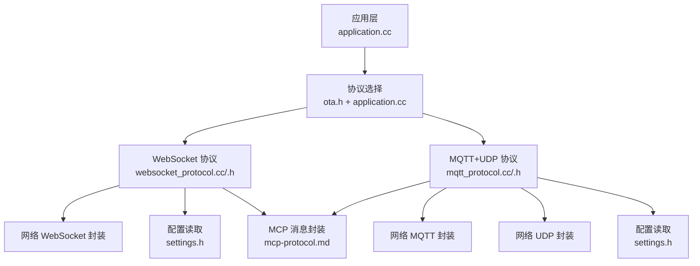
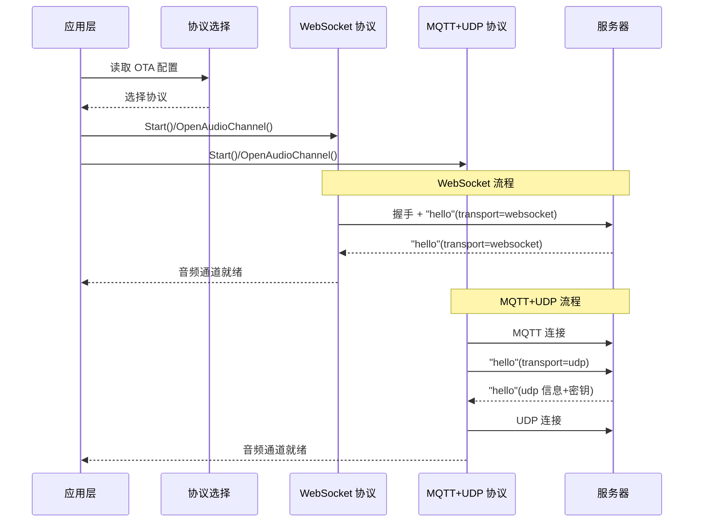
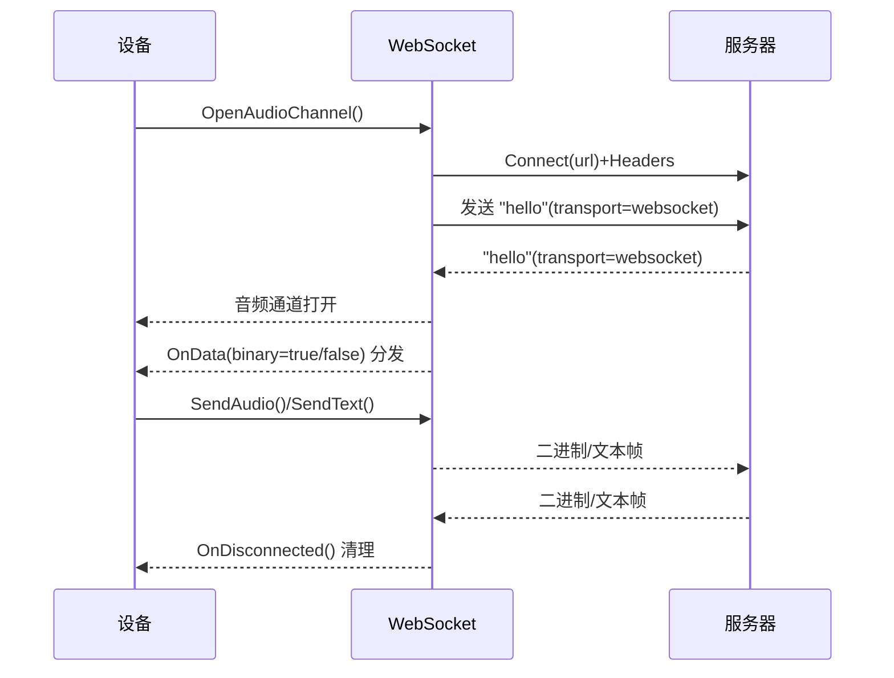
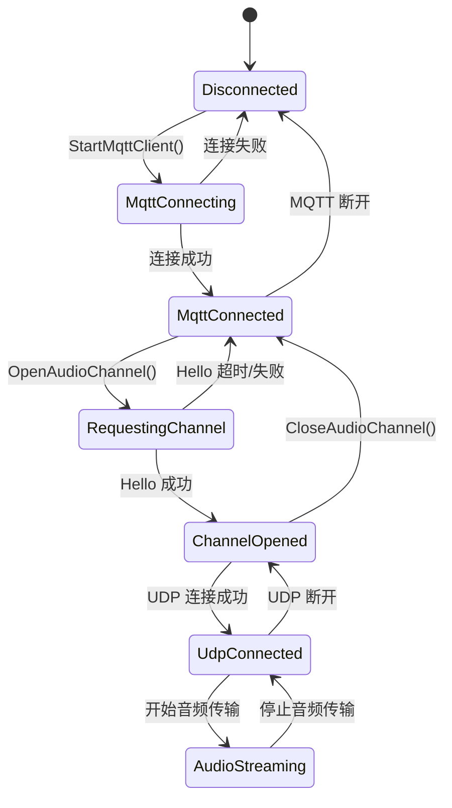
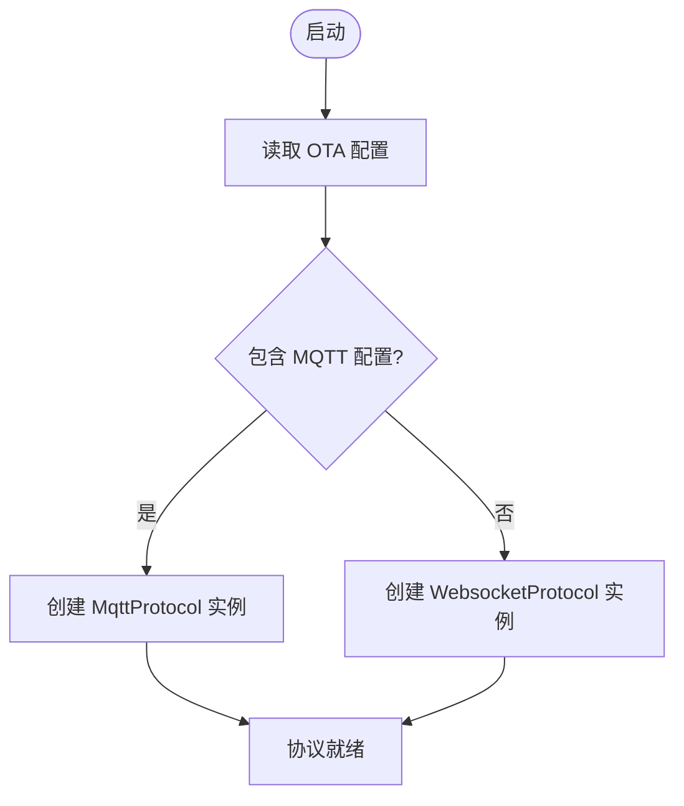
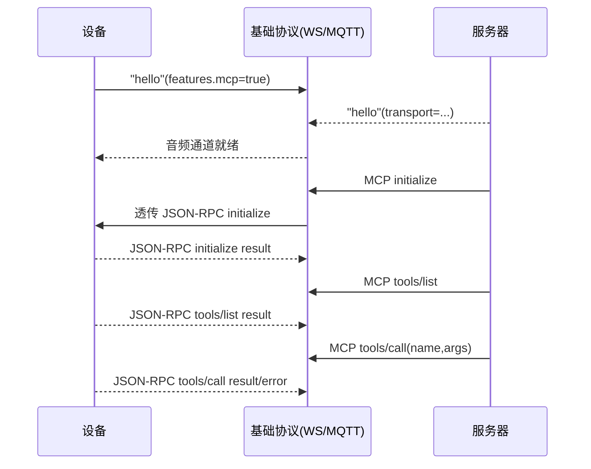
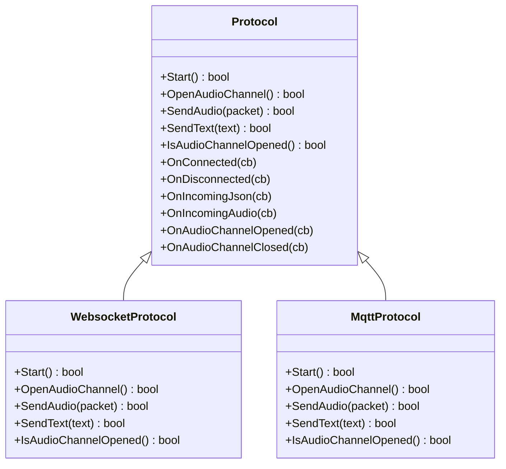

# 通信协议

<cite>
**本文引用的文件**
- [websocket.md](file://docs/websocket.md)
- [mqtt-udp.md](file://docs/mqtt-udp.md)
- [mcp-protocol.md](file://docs/mcp-protocol.md)
- [mcp-usage.md](file://docs/mcp-usage.md)
- [protocol.h](file://main/protocols/protocol.h)
- [websocket_protocol.h](file://main/protocols/websocket_protocol.h)
- [websocket_protocol.cc](file://main/protocols/websocket_protocol.cc)
- [mqtt_protocol.h](file://main/protocols/mqtt_protocol.h)
- [mqtt_protocol.cc](file://main/protocols/mqtt_protocol.cc)
- [application.cc](file://main/application.cc)
- [ota.h](file://main/ota.h)
- [settings.h](file://main/settings.h)
</cite>

## 目录
1. [简介](#简介)
2. [项目结构](#项目结构)
3. [核心组件](#核心组件)
4. [架构总览](#架构总览)
5. [详细组件分析](#详细组件分析)
6. [依赖关系分析](#依赖关系分析)
7. [性能考量](#性能考量)
8. [故障排查指南](#故障排查指南)
9. [结论](#结论)
10. [附录](#附录)

## 简介
本文件面向 ESP32-AI 项目的通信协议系统，系统支持两种基础协议：WebSocket 与 MQTT+UDP。二者均通过统一的 Protocol 抽象接口对外提供一致的音频通道打开/关闭、音频发送、JSON 消息收发与回调能力；同时，两者均可承载 MCP（Model Context Protocol）消息，实现设备能力发现与远程控制。

- WebSocket 协议：适合对可靠性要求较高、防火墙穿透相对友好的场景，音频通过二进制帧传输，控制消息通过文本帧传输。
- MQTT+UDP 协议：将控制通道置于 MQTT（高可靠），音频通道置于 UDP（低时延），并通过 AES-CTR 对音频进行端到端加密，适合对实时性要求更高的语音交互。

## 项目结构
与通信协议相关的核心目录与文件：
- 协议抽象与接口：main/protocols/protocol.h
- WebSocket 协议实现：main/protocols/websocket_protocol.{h,cc}
- MQTT+UDP 协议实现：main/protocols/mqtt_protocol.{h,cc}
- 应用入口与协议选择：main/application.cc
- OTA 配置与协议选择：main/ota.h
- 设置读取：main/settings.h
- 协议文档：docs/websocket.md、docs/mqtt-udp.md、docs/mcp-protocol.md、docs/mcp-usage.md

图表来源
- [application.cc:518-536](file://main/application.cc#L518-L536)
- [ota.h:19-20](file://main/ota.h#L19-L20)
- [websocket_protocol.cc:83-200](file://main/protocols/websocket_protocol.cc#L83-L200)
- [mqtt_protocol.cc:55-152](file://main/protocols/mqtt_protocol.cc#L55-L152)
- [settings.h:12-19](file://main/settings.h#L12-L19)

章节来源
- [application.cc:518-536](file://main/application.cc#L518-L536)
- [ota.h:19-20](file://main/ota.h#L19-L20)

## 核心组件
- Protocol 抽象接口：定义统一的音频通道生命周期、音频发送、JSON 回调、网络事件回调等能力，WebSocket 与 MQTT+UDP 均继承该接口。
- WebSocket 协议实现：负责 WebSocket 连接、握手、二进制协议版本兼容、音频帧解析与发送。
- MQTT+UDP 协议实现：负责 MQTT 连接、Hello 交换、UDP 音频通道建立、AES-CTR 加密与序列号管理。
- 应用层协议选择：依据 OTA 配置动态选择 WebSocket 或 MQTT+UDP。
- MCP 协议封装：在基础协议之上承载 JSON-RPC 2.0 的 MCP 消息，实现设备能力发现与工具调用。

章节来源
- [protocol.h:44-95](file://main/protocols/protocol.h#L44-L95)
- [websocket_protocol.h:13-32](file://main/protocols/websocket_protocol.h#L13-L32)
- [mqtt_protocol.h:26-62](file://main/protocols/mqtt_protocol.h#L26-L62)
- [application.cc:518-536](file://main/application.cc#L518-L536)
- [mcp-protocol.md:1-270](file://docs/mcp-protocol.md#L1-L270)

## 架构总览
两种协议的总体交互流程如下：

图表来源
- [websocket.md:7-80](file://docs/websocket.md#L7-L80)
- [mqtt-udp.md:22-57](file://docs/mqtt-udp.md#L22-L57)
- [application.cc:518-536](file://main/application.cc#L518-L536)

## 详细组件分析

### WebSocket 协议
- 连接与握手
  - 通过设置读取 WebSocket URL、Token、协议版本等参数，建立连接并发送 "hello"，等待服务器 "hello" 应答。
  - 二进制协议版本支持 v1（直接 Opus）、v2（含时间戳）与 v3（简化头部）。
- 音频与消息
  - 二进制帧承载 Opus 音频；文本帧承载 JSON 控制消息（如 STT、TTS、MCP 等）。
  - 支持会话 ID、唤醒词检测、Abort 等消息类型。
- 错误处理
  - 连接失败或握手超时触发网络错误回调；断开时触发音频通道关闭回调。

图表来源
- [websocket_protocol.cc:83-200](file://main/protocols/websocket_protocol.cc#L83-L200)
- [websocket.md:16-79](file://docs/websocket.md#L16-L79)

章节来源
- [websocket_protocol.cc:83-200](file://main/protocols/websocket_protocol.cc#L83-L200)
- [websocket_protocol.h:13-32](file://main/protocols/websocket_protocol.h#L13-L32)
- [websocket.md:82-398](file://docs/websocket.md#L82-L398)

### MQTT+UDP 协议
- 连接与 Hello 交换
  - 通过设置读取 MQTT 服务器地址、客户端 ID、用户名/密码、心跳等参数，建立 MQTT 连接。
  - 发送 "hello"(transport=udp)，服务器返回 UDP 服务器地址、端口、AES 密钥与随机数。
- 音频通道与加密
  - 使用 AES-CTR 对 Opus 音频进行加密，包头包含类型、标志、长度、SSRC、时间戳、序列号等字段。
  - 发送端维护本地序列号，接收端验证连续性并拒绝过期包。
- 状态机与超时
  - 状态包括 Disconnected、MqttConnecting、MqttConnected、RequestingChannel、ChannelOpened、UdpConnected、AudioStreaming 等。
  - 基类提供默认超时检测（默认 120 秒），超时自动标记为不可用。

图表来源
- [mqtt-udp.md:226-246](file://docs/mqtt-udp.md#L226-L246)

章节来源
- [mqtt_protocol.cc:55-152](file://main/protocols/mqtt_protocol.cc#L55-L152)
- [mqtt_protocol.cc:166-190](file://main/protocols/mqtt_protocol.cc#L166-L190)
- [mqtt_protocol.h:26-62](file://main/protocols/mqtt_protocol.h#L26-L62)
- [mqtt-udp.md:176-343](file://docs/mqtt-udp.md#L176-L343)

### 协议选择与切换机制
- 选择依据
  - 应用启动时读取 OTA 配置，若包含 MQTT 配置则优先选择 MQTT+UDP；否则选择 WebSocket。
- 切换策略
  - 通过重新初始化协议实例实现切换；协议选择位于应用层初始化阶段。

图表来源
- [application.cc:518-536](file://main/application.cc#L518-L536)
- [ota.h:19-20](file://main/ota.h#L19-L20)

章节来源
- [application.cc:518-536](file://main/application.cc#L518-L536)
- [ota.h:19-20](file://main/ota.h#L19-L20)

### MCP 协议数据交换
- 封装方式
  - MCP 消息封装在基础协议的 JSON 文本帧中，payload 遵循 JSON-RPC 2.0。
- 典型流程
  - 初始化会话（initialize）、列举工具（tools/list）、调用工具（tools/call）、通知（notifications）。
- 与协议无关
  - 该协议既可在 WebSocket 上运行，也可在 MQTT 上运行，二者均可承载 MCP。

图表来源
- [mcp-protocol.md:219-267](file://docs/mcp-protocol.md#L219-L267)
- [websocket.md:196-287](file://docs/websocket.md#L196-L287)
- [mqtt-udp.md:120-173](file://docs/mqtt-udp.md#L120-L173)

章节来源
- [mcp-protocol.md:1-270](file://docs/mcp-protocol.md#L1-L270)
- [mcp-usage.md:1-115](file://docs/mcp-usage.md#L1-L115)
- [websocket.md:196-287](file://docs/websocket.md#L196-L287)
- [mqtt-udp.md:120-173](file://docs/mqtt-udp.md#L120-L173)

## 依赖关系分析
- 协议抽象与实现
  - Protocol 为抽象基类，WebSocket 与 MQTT+UDP 各自实现 Start、OpenAudioChannel、SendAudio、SendText 等。
- 配置与网络
  - 两类协议均通过 Settings 读取各自配置；网络层由 Board 获取具体网络实现（WebSocket/MQTT/UDP）。
- 应用层耦合
  - 应用层在初始化阶段根据 OTA 配置选择协议实例，协议实例通过回调与应用层解耦。

图表来源
- [protocol.h:44-95](file://main/protocols/protocol.h#L44-L95)
- [websocket_protocol.h:13-32](file://main/protocols/websocket_protocol.h#L13-L32)
- [mqtt_protocol.h:26-62](file://main/protocols/mqtt_protocol.h#L26-L62)

章节来源
- [protocol.h:44-95](file://main/protocols/protocol.h#L44-L95)
- [websocket_protocol.h:13-32](file://main/protocols/websocket_protocol.h#L13-L32)
- [mqtt_protocol.h:26-62](file://main/protocols/mqtt_protocol.h#L26-L62)

## 性能考量
- WebSocket
  - 优点：可靠性高、防火墙友好；适合对实时性要求中等的场景。
  - 注意：二进制帧体积与协议版本有关，v2/v3 带额外头部，需平衡延迟与功能。
- MQTT+UDP
  - 优点：音频通道低时延、加密保护；适合对实时性要求高的语音交互。
  - 注意：UDP 本身不可靠，需依赖序列号与超时机制保障稳定性。
- 共同点
  - 基类提供超时检测（默认 120 秒），避免资源长期占用。
  - MQTT+UDP 使用互斥锁保护 UDP 连接，避免并发问题。

章节来源
- [websocket.md:346-358](file://docs/websocket.md#L346-L358)
- [mqtt-udp.md:323-343](file://docs/mqtt-udp.md#L323-L343)
- [protocol.h:94-95](file://main/protocols/protocol.h#L94-L95)

## 故障排查指南
- 连接失败
  - WebSocket：检查 URL、Token、协议版本；握手超时（默认 10 秒）触发网络错误回调。
  - MQTT：检查 endpoint、client_id、用户名/密码、keepalive；连接失败触发错误回调。
- 断线与重连
  - WebSocket：断开触发音频通道关闭回调；应用层可按需重试。
  - MQTT：断线后定时器触发自动重连（默认 60 秒间隔）。
- UDP 音频异常
  - 解密失败、序列号异常、格式错误等将记录错误并丢弃数据包；检查密钥与随机数一致性。
- 超时与状态
  - 基类超时检测（默认 120 秒）；MQTT+UDP 提供状态机，便于定位问题阶段。

章节来源
- [websocket.md:369-380](file://docs/websocket.md#L369-L380)
- [mqtt_protocol.cc:85-98](file://main/protocols/mqtt_protocol.cc#L85-L98)
- [mqtt-udp.md:280-300](file://docs/mqtt-udp.md#L280-L300)

## 结论
- WebSocket 与 MQTT+UDP 均通过统一的 Protocol 接口对外提供一致能力，满足语音交互的控制与音频传输需求。
- 协议选择由 OTA 配置驱动，应用层在启动阶段完成协议实例化与回调绑定。
- MCP 协议以 JSON-RPC 2.0 封装在基础协议之上，实现设备能力发现与远程控制，推荐在新项目中统一采用。
- 在网络环境差异较大的场景，建议优先评估防火墙友好度与实时性需求，选择合适的协议组合。

## 附录

### 协议配置参数说明
- WebSocket
  - 配置键：url、token、version
  - 作用：服务器地址、鉴权令牌、二进制协议版本
- MQTT
  - 配置键：endpoint、client_id、username、password、keepalive、publish_topic
  - 作用：Broker 地址与端口、认证、心跳、发布主题
- UDP 音频通道（由 MQTT Hello 下发）
  - 字段：udp.server、udp.port、udp.key、udp.nonce
  - 作用：UDP 服务器地址、端口、AES 密钥、随机数

章节来源
- [websocket_protocol.cc:84-110](file://main/protocols/websocket_protocol.cc#L84-L110)
- [mqtt_protocol.cc:65-71](file://main/protocols/mqtt_protocol.cc#L65-L71)
- [mqtt-udp.md:94-118](file://docs/mqtt-udp.md#L94-L118)

### 与云端服务器交互流程要点
- WebSocket
  - 握手 + "hello"(transport=websocket) → 服务器返回 "hello" → 音频通道就绪 → 双向传输音频与控制消息。
- MQTT+UDP
  - MQTT 连接 → "hello"(transport=udp) → 服务器返回 UDP 信息与密钥 → 建立 UDP 连接 → 音频通道就绪 → 双向传输音频与控制消息。

章节来源
- [websocket.md:7-80](file://docs/websocket.md#L7-L80)
- [mqtt-udp.md:22-57](file://docs/mqtt-udp.md#L22-L57)