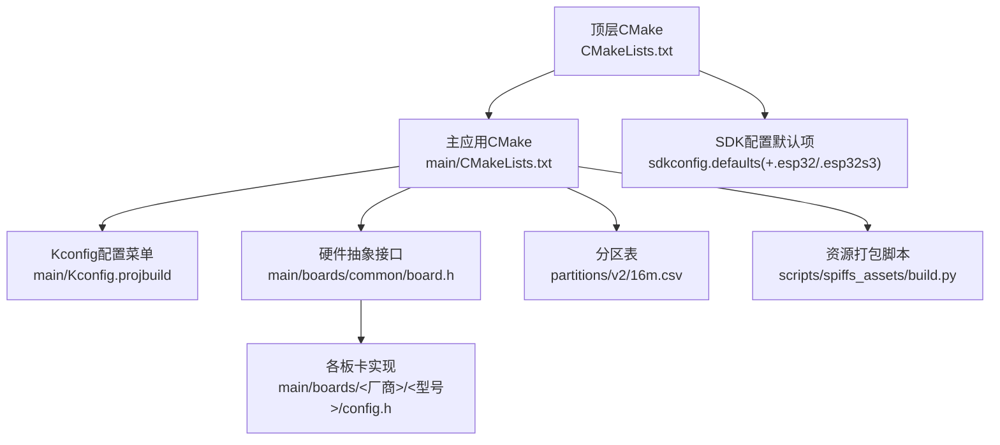
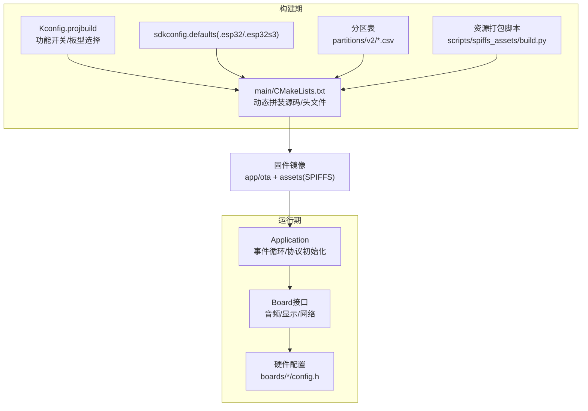
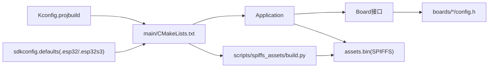

# 配置与定制

<cite>
**本文引用的文件**
- [CMakeLists.txt](file://CMakeLists.txt)
- [main/CMakeLists.txt](file://main/CMakeLists.txt)
- [sdkconfig.defaults](file://sdkconfig.defaults)
- [sdkconfig.defaults.esp32](file://sdkconfig.defaults.esp32)
- [sdkconfig.defaults.esp32s3](file://sdkconfig.defaults.esp32s3)
- [main/Kconfig.projbuild](file://main/Kconfig.projbuild)
- [main/application.cc](file://main/application.cc)
- [main/settings.cc](file://main/settings.cc)
- [main/boards/common/board.h](file://main/boards/common/board.h)
- [main/boards/aipi-lite/config.h](file://main/boards/aipi-lite/config.h)
- [main/boards/esp-box/config.h](file://main/boards/esp-box/config.h)
- [partitions/v2/16m.csv](file://partitions/v2/16m.csv)
- [scripts/spiffs_assets/build.py](file://scripts/spiffs_assets/build.py)
</cite>

## 目录
1. [简介](#简介)
2. [项目结构](#项目结构)
3. [核心组件](#核心组件)
4. [架构总览](#架构总览)
5. [详细组件分析](#详细组件分析)
6. [依赖关系分析](#依赖关系分析)
7. [性能考量](#性能考量)
8. [故障排查指南](#故障排查指南)
9. [结论](#结论)
10. [附录](#附录)

## 简介
本指南面向ESP32-AI项目的配置与定制需求，覆盖以下主题：
- CMake构建配置与最小化构建策略
- SDK配置与分区表定制
- 硬件平台差异与外设启用
- 功能开关与运行时行为控制
- 自定义唤醒词、字体、表情与布局资源打包
- 批量配置管理与备份恢复建议
- 配置验证与测试方法

## 项目结构
项目采用ESP-IDF工程组织方式，顶层通过CMake驱动构建；应用层在main目录下，按“硬件抽象+功能模块”分层设计；资源与分区由脚本与分区表共同决定。

图示来源
- [CMakeLists.txt:1-17](file://CMakeLists.txt#L1-L17)
- [main/CMakeLists.txt:1-120](file://main/CMakeLists.txt#L1-L120)
- [main/Kconfig.projbuild:1-120](file://main/Kconfig.projbuild#L1-L120)
- [main/boards/common/board.h:46-94](file://main/boards/common/board.h#L46-L94)
- [partitions/v2/16m.csv:1-9](file://partitions/v2/16m.csv#L1-L9)
- [scripts/spiffs_assets/build.py:1-120](file://scripts/spiffs_assets/build.py#L1-L120)
- [sdkconfig.defaults:1-79](file://sdkconfig.defaults#L1-L79)

章节来源
- [CMakeLists.txt:1-17](file://CMakeLists.txt#L1-L17)
- [main/CMakeLists.txt:1-120](file://main/CMakeLists.txt#L1-L120)
- [sdkconfig.defaults:1-79](file://sdkconfig.defaults#L1-L79)
- [partitions/v2/16m.csv:1-9](file://partitions/v2/16m.csv#L1-L9)

## 核心组件
- 构建系统与最小化构建
  - 顶层CMake设置编译器选项与最小化构建属性，减少不必要的组件加载。
  - 主应用CMake根据Kconfig选择性添加源码与头文件路径，并动态拼接各板卡源文件。
- SDK配置默认项
  - 统一的默认配置文件覆盖优化级别、分区表、LVGL、网络栈等关键参数。
  - 针对不同芯片目标提供专用默认项，如ESP32/ESP32S3的SPIRAM、缓存与任务栈大小。
- 板级抽象与硬件配置
  - Board接口统一音频、显示、网络、传感器等能力；各板卡通过config.h声明引脚、分辨率、采样率等硬件参数。
- 资源与分区
  - 分区表定义app、ota、nvs、otadata、assets等分区；assets使用SPIFFS镜像，由脚本打包生成。
- 运行时配置与状态
  - Settings封装NVS读写，用于持久化用户配置；Application负责协议初始化、事件循环与状态机。

章节来源
- [CMakeLists.txt:1-17](file://CMakeLists.txt#L1-L17)
- [main/CMakeLists.txt:1-120](file://main/CMakeLists.txt#L1-L120)
- [sdkconfig.defaults:1-79](file://sdkconfig.defaults#L1-L79)
- [sdkconfig.defaults.esp32s3:1-32](file://sdkconfig.defaults.esp32s3#L1-L32)
- [main/boards/common/board.h:46-94](file://main/boards/common/board.h#L46-L94)
- [main/boards/aipi-lite/config.h:1-54](file://main/boards/aipi-lite/config.h#L1-L54)
- [main/boards/esp-box/config.h:1-42](file://main/boards/esp-box/config.h#L1-L42)
- [partitions/v2/16m.csv:1-9](file://partitions/v2/16m.csv#L1-L9)
- [main/settings.cc:1-109](file://main/settings.cc#L1-L109)
- [main/application.cc:85-199](file://main/application.cc#L85-L199)

## 架构总览
下图展示从构建到运行的关键交互：Kconfig选择板型与功能开关；CMake拼装源码与资源；SDK默认项影响运行时行为；最终产物包含app、ota与SPIFFS资源分区。

图示来源
- [main/Kconfig.projbuild:120-200](file://main/Kconfig.projbuild#L120-L200)
- [main/CMakeLists.txt:90-120](file://main/CMakeLists.txt#L90-L120)
- [sdkconfig.defaults.esp32s3:1-32](file://sdkconfig.defaults.esp32s3#L1-L32)
- [partitions/v2/16m.csv:1-9](file://partitions/v2/16m.csv#L1-L9)
- [scripts/spiffs_assets/build.py:340-400](file://scripts/spiffs_assets/build.py#L340-L400)
- [main/application.cc:85-199](file://main/application.cc#L85-L199)
- [main/boards/common/board.h:46-94](file://main/boards/common/board.h#L46-L94)
- [main/boards/aipi-lite/config.h:1-54](file://main/boards/aipi-lite/config.h#L1-L54)

## 详细组件分析

### CMake构建配置
- 最小化构建
  - 顶层CMake设置MINIMAL_BUILD，仅包含必要组件，缩短构建时间并降低镜像体积。
- 主应用CMake
  - 基于Kconfig的BOARD_TYPE与语言选择，动态确定BOARD_TYPE与内置字体/表情集合。
  - 根据目标芯片自动选择唤醒词实现（AFE/ESP/自定义）与音频处理器。
  - 依据语言配置选择本地化目录。
- 关键变量与条件
  - BUILTIN_TEXT_FONT/BUILTIN_ICON_FONT/DEFAULT_EMOJI_COLLECTION/EMOTE_RESOLUTION等由Kconfig与板型决定。

章节来源
- [CMakeLists.txt:11-17](file://CMakeLists.txt#L11-L17)
- [main/CMakeLists.txt:90-480](file://main/CMakeLists.txt#L90-L480)

### SDK配置与分区表
- 默认配置要点
  - 编译优化、HTTPD缓冲、任务看门狗、运行统计、LVGL裁剪、SPIFFS压缩与禁用部分控件以节省空间。
  - ESP32S3默认启用SPIRAM与缓存优化，提升图形与语音处理性能。
- 分区表
  - 使用自定义分区表，包含nvs、otadata、phy_init、两个OTA分区与assets分区（SPIFFS）。
  - 不同容量与平台可切换CSV文件，确保资源分区大小满足需求。

章节来源
- [sdkconfig.defaults:1-79](file://sdkconfig.defaults#L1-L79)
- [sdkconfig.defaults.esp32s3:1-32](file://sdkconfig.defaults.esp32s3#L1-L32)
- [partitions/v2/16m.csv:1-9](file://partitions/v2/16m.csv#L1-L9)

### 硬件平台与外设启用
- 板级抽象
  - Board接口统一对外提供音频编解码、显示、网络、背光、LED、相机、电源管理等能力。
- 硬件参数
  - 各板卡通过config.h声明I2S引脚、采样率、显示尺寸与旋转/镜像参数、背光引脚等。
- 示例
  - aipi-lite：定义I2S引脚、显示尺寸与SPI参数、电源相关引脚。
  - esp-box：定义I2S引脚、双编码器地址、显示尺寸与背光引脚。

章节来源
- [main/boards/common/board.h:46-94](file://main/boards/common/board.h#L46-L94)
- [main/boards/aipi-lite/config.h:1-54](file://main/boards/aipi-lite/config.h#L1-L54)
- [main/boards/esp-box/config.h:1-42](file://main/boards/esp-box/config.h#L1-L42)

### 功能开关与运行时行为
- Kconfig功能开关
  - 语言选择、板型选择、显示风格、唤醒词实现类型、AEC模式、音频调试、WiFi配置方式等。
- 运行时逻辑
  - Application根据网络事件更新UI与状态；协议初始化支持MQTT/WebSocket；支持OTA升级与激活流程。
- 配置持久化
  - Settings封装NVDS读写，便于保存用户偏好或临时标志位。

章节来源
- [main/Kconfig.projbuild:120-200](file://main/Kconfig.projbuild#L120-L200)
- [main/application.cc:85-199](file://main/application.cc#L85-L199)
- [main/settings.cc:1-109](file://main/settings.cc#L1-109)

### 自定义唤醒词、字体、表情与背景
- 资源打包流程
  - scripts/spiffs_assets/build.py负责：
    - 复制唤醒模型、文本字体、表情/图标资源至构建目录；
    - 生成index.json描述资源索引；
    - 生成config.json描述打包参数；
    - 调用spiffs_assets_gen.py生成assets.bin并写入SPIFFS镜像。
- 资源映射
  - index.json包含srmodels、text_font、emoji_collection、icon_collection、layout等字段；
  - config.json包含输出路径、支持格式、尺寸限制等。
- 板卡特定资源
  - 可通过--target_board与--res_path组合，按板卡目录下的emote.json等配置进行筛选与打包。

章节来源
- [scripts/spiffs_assets/build.py:1-120](file://scripts/spiffs_assets/build.py#L1-L120)
- [scripts/spiffs_assets/build.py:279-337](file://scripts/spiffs_assets/build.py#L279-L337)
- [scripts/spiffs_assets/build.py:340-400](file://scripts/spiffs_assets/build.py#L340-L400)

### 分区表定制方法
- 选择分区表
  - 通过sdkconfig.defaults中的CONFIG_PARTITION_TABLE_CUSTOM_FILENAME指定CSV文件。
- 分区含义
  - nvs/otadata/phy_init：系统与引导数据；
  - ota_0/ota_1：双OTA分区，支持安全回滚；
  - assets：SPIFFS分区，存放字体、表情、布局等资源。
- 定制建议
  - 根据目标平台Flash容量调整assets大小；
  - 若需更大资源，可增大assets分区并相应调整其他分区。

章节来源
- [sdkconfig.defaults:14-16](file://sdkconfig.defaults#L14-L16)
- [partitions/v2/16m.csv:1-9](file://partitions/v2/16m.csv#L1-L9)

### 不同硬件平台的特定配置
- ESP32/ESP32S3差异
  - ESP32默认4MB Flash，ESP32S3默认16MB Flash并启用SPIRAM与缓存优化。
  - ESP32S3默认开启唤醒网络模型与图形快照支持。
- 板卡差异
  - 不同板卡在I2S采样率、显示分辨率、背光控制等方面存在差异，需在config.h中明确配置。
- 选择与生效
  - 通过Kconfig的BOARD_TYPE选择具体板型，CMake据此拼接对应源码与资源。

章节来源
- [sdkconfig.defaults.esp32:1-7](file://sdkconfig.defaults.esp32#L1-L7)
- [sdkconfig.defaults.esp32s3:1-32](file://sdkconfig.defaults.esp32s3#L1-L32)
- [main/CMakeLists.txt:90-480](file://main/CMakeLists.txt#L90-L480)
- [main/boards/aipi-lite/config.h:1-54](file://main/boards/aipi-lite/config.h#L1-L54)
- [main/boards/esp-box/config.h:1-42](file://main/boards/esp-box/config.h#L1-L42)

### 批量配置管理与备份恢复
- 配置持久化
  - 使用Settings命名空间保存字符串、整数、布尔等键值，支持提交与擦除。
- 备份与恢复建议
  - 通过NVS导出/导入工具备份关键键值（如下载URL、语言、显示风格等），避免重复配置。
  - 结合脚本自动化生成与校验index.json与config.json，确保资源一致性。
- 注意事项
  - 写入后需commit，避免掉电丢失；
  - 擦除全部键值会清空用户配置，谨慎操作。

章节来源
- [main/settings.cc:1-109](file://main/settings.cc#L1-L109)

### 配置验证与测试
- 构建验证
  - 确认BOARD_TYPE与语言选择正确，CMake日志显示已拼接对应源码与资源。
- 运行验证
  - Application启动后打印系统信息与网络状态，检查UI显示、音频播放与协议连接。
- 资源验证
  - SPIFFS资源可通过脚本生成assets.bin并烧录，确认index.json与config.json内容一致。
- 性能与稳定性
  - 通过运行统计与定时打印堆栈信息，监控内存占用与任务调度。

章节来源
- [main/application.cc:85-199](file://main/application.cc#L85-L199)
- [scripts/spiffs_assets/build.py:340-400](file://scripts/spiffs_assets/build.py#L340-L400)

## 依赖关系分析
- 组件耦合
  - main/CMakeLists.txt依赖Kconfig与各板卡源码；Board接口向上屏蔽硬件差异；Application依赖Board与协议实现。
- 外部依赖
  - ESP-IDF框架、LVGL、SPIFFS、NVS等。
- 可能的环路
  - 通过接口与命名空间避免直接循环引用；资源打包脚本独立于主工程。

图示来源
- [main/Kconfig.projbuild:120-200](file://main/Kconfig.projbuild#L120-L200)
- [main/CMakeLists.txt:90-120](file://main/CMakeLists.txt#L90-L120)
- [main/application.cc:85-199](file://main/application.cc#L85-L199)
- [main/boards/common/board.h:46-94](file://main/boards/common/board.h#L46-L94)
- [scripts/spiffs_assets/build.py:340-400](file://scripts/spiffs_assets/build.py#L340-L400)

章节来源
- [main/CMakeLists.txt:90-120](file://main/CMakeLists.txt#L90-L120)
- [main/application.cc:85-199](file://main/application.cc#L85-L199)
- [main/boards/common/board.h:46-94](file://main/boards/common/board.h#L46-L94)

## 性能考量
- 构建期优化
  - MINIMAL_BUILD减少组件数量；LVGL禁用非必要控件与动画，降低闪存占用。
- 运行期优化
  - ESP32S3启用SPIRAM与缓存优化；合理设置任务栈大小与看门狗超时。
  - 资源分区大小与压缩策略影响加载速度与内存占用。
- 建议
  - 根据目标平台选择合适分区表与资源规模；在调试阶段启用音频调试，发布前关闭以节省资源。

## 故障排查指南
- 构建失败
  - 检查BOARD_TYPE与目标芯片匹配；确认分区表路径与容量配置正确。
- 运行异常
  - 查看Application事件日志与网络状态回调；确认协议初始化与通道打开流程。
- 资源缺失
  - 校验index.json与config.json生成过程；确认assets.bin已烧录至assets分区。
- 配置丢失
  - 使用Settings读取/写入键值，必要时执行全盘擦除后重新配置。

章节来源
- [main/application.cc:302-338](file://main/application.cc#L302-L338)
- [main/settings.cc:1-109](file://main/settings.cc#L1-L109)
- [scripts/spiffs_assets/build.py:340-400](file://scripts/spiffs_assets/build.py#L340-L400)

## 结论
通过Kconfig与CMake的协同、SDK默认配置与分区表的定制，以及脚本化的资源打包流程，ESP32-AI实现了高度可配置与可移植的硬件抽象与功能开关体系。结合Settings的持久化能力与Application的运行时验证机制，开发者可以高效完成多平台、多资源的定制与部署。

## 附录
- 快速清单
  - 选择BOARD_TYPE与语言 → 生成Kconfig → CMake拼装 → 生成assets.bin → 烧录分区 → 启动验证
- 参考路径
  - [构建入口:1-17](file://CMakeLists.txt#L1-L17)
  - [主应用拼装:90-120](file://main/CMakeLists.txt#L90-L120)
  - [SDK默认项:1-79](file://sdkconfig.defaults#L1-L79)
  - [分区表:1-9](file://partitions/v2/16m.csv#L1-L9)
  - [资源打包:340-400](file://scripts/spiffs_assets/build.py#L340-L400)
  - [运行时配置:1-109](file://main/settings.cc#L1-L109)
  - [板卡配置示例:1-54](file://main/boards/aipi-lite/config.h#L1-L54)
  - [板卡配置示例:1-42](file://main/boards/esp-box/config.h#L1-L42)